# CLI-Anything深度解析：重新定义AI Agent与软件的关系

## 前言

2026年3月8日，香港大学数据科学团队在GitHub上发布了一个名为 **CLI-Anything** 的开源项目。38天后，这个项目斩获了 **30,000+ Stars**，刷新了AI开源项目的增速记录。

但Stars只是表象。真正值得深思的问题是：**这个项目为什么能在这么短的时间内引发如此广泛的共鸣？**

答案藏在项目主页的第一句话里：

> **Today's Software Serves Humans👨💻. Tomorrow's Users will be Agents🤖.**
>
> 今天的软件服务于人类。明天的用户，将是AI Agent。

这不是一个功能强大的工具，而是一个**范式转变的起点**。本文将深入剖析CLI-Anything的本质、它所解决的根本问题、以及它对未来软件生态的深远影响。

## 一、根本问题：Agent与软件之间的"巴别塔"

### 1.1 被忽视的断层

过去几年，AI Agent的发展集中在**推理能力**的提升——从GPT-3到GPT-4，从单步推理到CoT、ReAct、Agentic Workflow。但有一个关键问题始终被回避：

> **AI Agent能推理，但它能真正"使用"软件吗？**

现实很残酷：

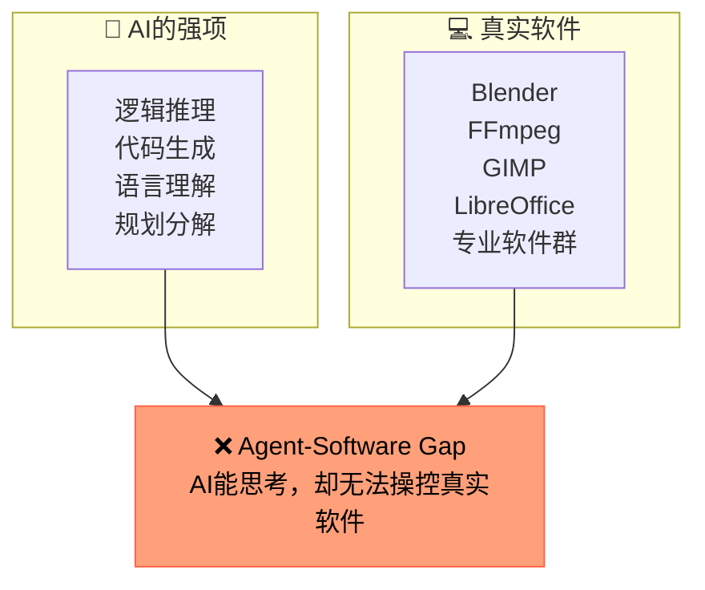

当今AI Agent的"工具调用"能力，本质上是**调用API或搜索网页**——这些都是为人类设计的接口。当Agent需要完成真实任务时，它面对的是：

| Agent看到的 | 真实情况 |
|------------|---------|
| "我可以用Python操作Word文档" | Word的COM接口需要Windows环境，且文档格式复杂 |
| "我可以用API调用FFmpeg" | FFmpeg参数上千种，输出格式验证困难 |
| "我可以控制Blender渲染3D" | Blender的Python API是bpy，不是blender命令行 |

### 1.2 现有方案的三个层次

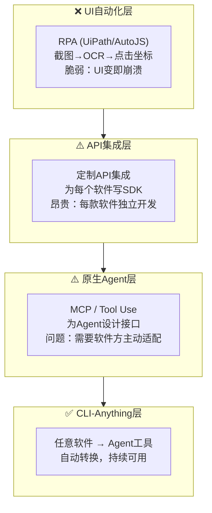

**现有方案的共同困境**：它们都在让Agent"迁就"软件，而非让软件"变成"Agent的原生语言。

## 二、本质创新：重新设计软件与Agent的"中间协议"

### 2.1 CLI-Anything在做什么

CLI-Anything的核心不是"生成CLI工具"，而是**定义了软件与Agent之间的新协议**：

```text
传统协议（软件 → 人类）：
软件 → 图形界面 → 鼠标键盘 → 人类理解

Agent协议（软件 → Agent）：
软件 → CLI → SKILL.md → Agent理解 → 自然语言任务
```

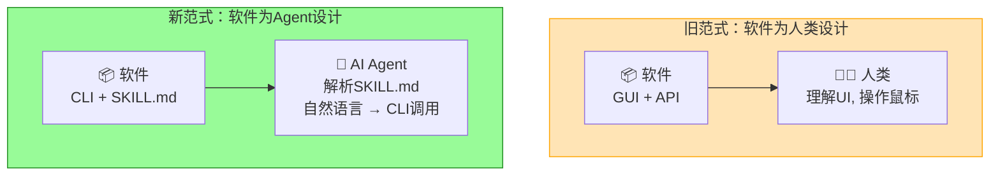

### 2.2 SKILL.md的意义：Agent的"使用说明书"

SKILL.md是CLI-Anything最关键的创新——它本质上是**为Agent重写的软件使用手册**：

| 传统手册（给人看） | SKILL.md（给Agent看） |
|------------------|---------------------|
| "点击'文件'菜单，选择'导出'" | `cli-blender render --scene scene.blend --output ./render.png --engine CYCLES` |
| "拖动时间轴到第60帧" | `cli-blender seek --frame 60` |
| "在属性面板中设置材质" | `cli-blender material set --object Cube --material Wood --roughness 0.8` |

SKILL.md让Agent能像人类读手册一样理解软件的全部能力，并准确调用。

### 2.3 七阶段流水线的工程哲学

CLI-Anything的7阶段流水线不是简单地把"分析源码"和"生成代码"拼接起来，它的工程哲学在于**把人类专家的知识系统化**：

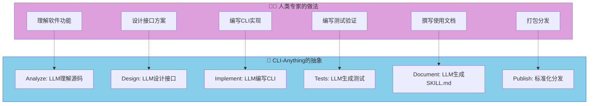

**关键洞察**：这个流水线把"人类专家如何将一个软件CLI化"的知识编码成了HARNESS.md——这是一个可以被LLM执行的方法论。

### 2.4 生成的CLI为何稳定可靠

传统UI自动化为什么脆弱？因为它操作的是**表现层**（像素、坐标），而非**功能层**（命令、参数）。

CLI-Anything生成的CLI操作的是**功能层**：

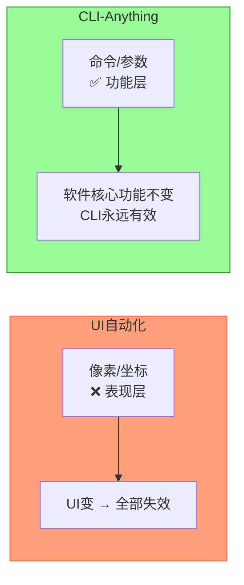

这解释了为什么Blender每次大版本更新会导致大量脚本失效，但FFmpeg的命令行参数相对稳定——**操作功能层的接口天然更稳定**。

## 三、AI座舱：最迫切的落地场景

### 3.1 座舱软件的"Agent荒漠"现状

智能座舱是当今软件智能化程度最低的领域之一：

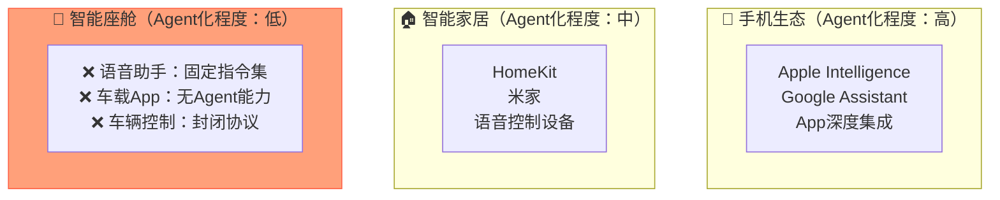

**讽刺的现实**：你的车可能有最强大的芯片，但它最难被AI控制。

### 3.2 座舱Agent化的三层路径

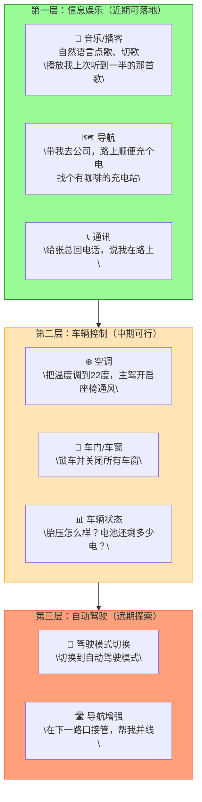

### 3.3 车载CLI生态的构建路径

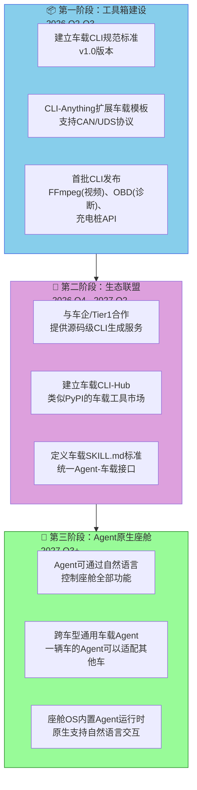

### 3.4 必须跨越的五个门槛

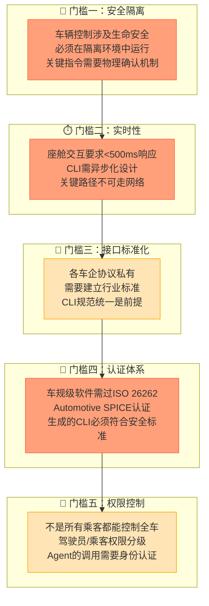

### 3.5 具体落地案例：FFmpeg车载应用

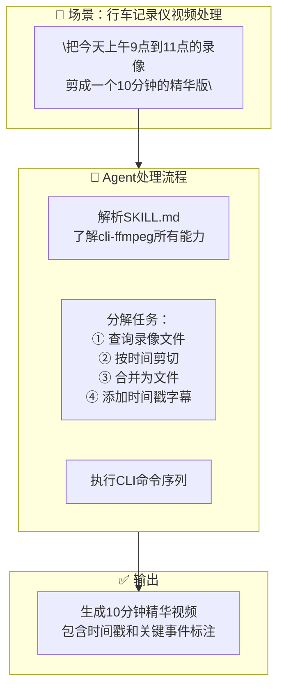

这个场景今天**已经可以做到**——FFmpeg的CLI转换已经在CLI-Hub中。

## 四、更宏大的图景：软件生态的Agent化重构

### 4.1 CLI-Anything揭示的趋势

CLI-Anything的30k Stars背后，是一个正在形成的共识：

> **软件正在从"给人用"转变为"给Agent用"**

这意味着整个软件生态将经历一次重构：

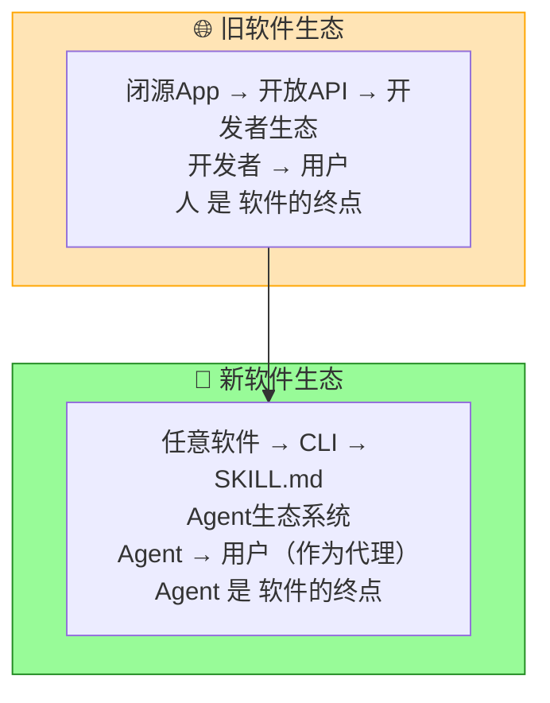

### 4.2 未来三年关键预测

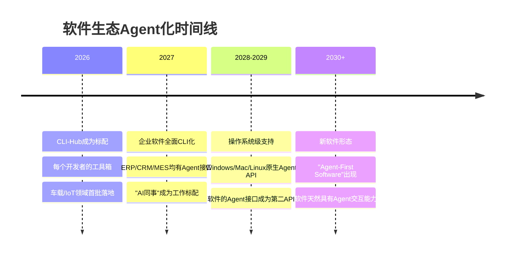

### 4.3 开发者必须思考的问题

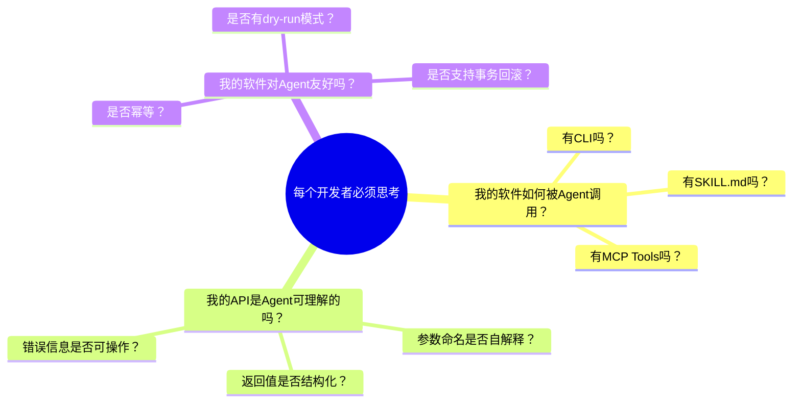

## 五、技术局限与深层挑战

### 5.1 当前局限

| 局限 | 深层原因 | 解决路径 |
|------|---------|---------|
| **依赖强模型** | 源码分析需要强推理能力 | 模型能力持续提升；专用小模型蒸馏 |
| **必须有源码** | 闭源软件无法分析 | 协议逆向（法律允许范围）；与厂商合作 |
| **生成不完整** | 复杂软件难以一次性CLI化 | 多轮Refine；人类专家审核 |
| **非确定性** | LLM生成有随机性 | 测试驱动生成；输出验证 |

### 5.2 更根本的挑战

```mermaid
flowchart TB
    subgraph 哲学挑战["🤔 哲学层面的问题"]
        P1["软件是为人设计的<br/>Agent的认知模型与人不同"]
        P2["\"理解软件意图\"≠\"执行软件命令\""]
        P3["当Agent错误操作软件时<br/>责任归谁？"]
    end
    
    subgraph 技术挑战["🔧 技术层面的问题"]
        T1["状态管理：软件状态复杂<br/>CLI难以完全建模"]
        T2["错误恢复：GUI可以一步步撤回<br/>CLI的错误难以优雅恢复"]
        T3["功能发现：SKILL.md可能遗漏<br/>某些Agent不知道能做什么"]
    end
    
    P1 --> T1
    P2 --> T2
    P3 --> T3
    
    style 哲学挑战 fill:#DDA0DD,stroke:#9370DB
    style 技术挑战 fill:#FFA07A,stroke:#FF6347
```

## 六、项目纵览

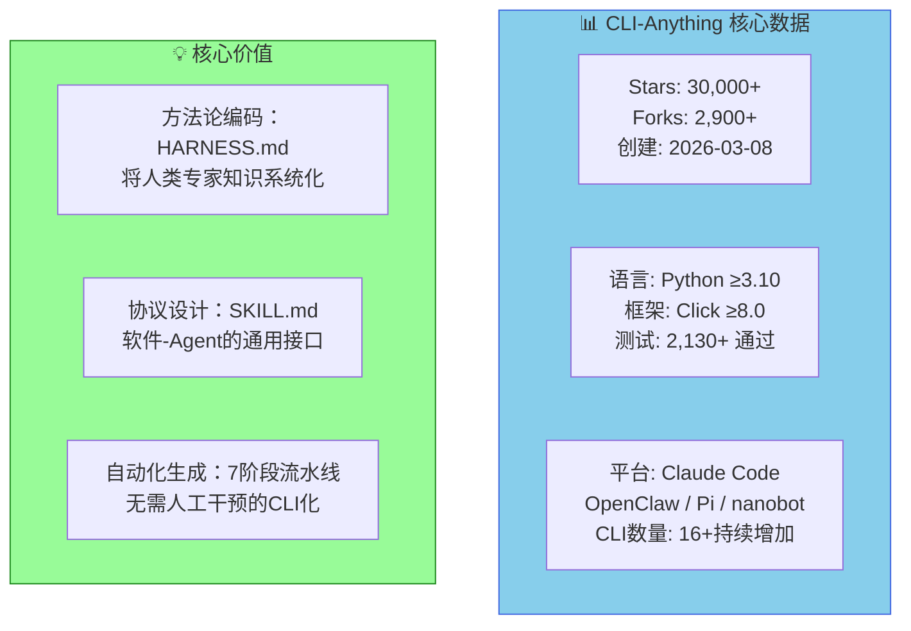

## 结语：站在Agent时代的起点

CLI-Anything的意义，远不止于"生成CLI工具"。它揭示了一个更深层的真相：

> **AI Agent时代需要的不是更强的AI，而是让软件"开口说话"的方法。**

CLI-Anything是第一个系统性地解决这个问题的开源项目。它的成功告诉我们：**把软件变成Agent能理解的语言，这个方向是对的。**

对于AI座舱而言，CLI-Anything的启发在于：**与其等待座舱软件原生支持Agent，不如主动将座舱软件CLI化。** 这是一条可以今天就开始走的路。

## 参考资料

| 资源 | 链接 |
|------|------|
| **GitHub** | github.com/HKUDS/CLI-Anything |
| **CLI-Hub** | clianything.cc |
| **HARNESS.md** | cli-anything-plugin/HARNESS.md |
| **论文** | arXiv:2304.03442 (Generative Agents原始论文) |

---

*本文为技术洞察，如有疑问或想法，欢迎交流。*

---

## 对比分析

CLI-Anything 提出把任意软件"CLI 化"以便 Agent 调用。下面选取两个也围绕"软件可由 Agent 操作"的项目做对比：Anthropic 的 Computer Use 与 OpenHands，并加上 pi-mono 做轻量对照。

### 对比维度一：与软件交互的接口
| 维度 | CLI-Anything | Anthropic Computer Use | OpenHands |
| --- | --- | --- | --- |
| 接入方式 | 生成 CLI 子命令 | 截屏 + 鼠标键盘 | 浏览器/Shell 自动化 |
| 适配目标 | 任何有 CLI 潜力的软件 | 任意带 GUI 的桌面应用 | 任意 Web/桌面 |
| 确定性 | 高，纯命令行 | 低，依赖视觉识别 | 中 |
| 可调试性 | 直接看终端 | 需要回放截图 | 工作区快照 |

### 对比维度二：Agent 友好度
| 维度 | CLI-Anything | Computer Use | OpenHands |
| --- | --- | --- | --- |
| LLM 工具调用友好 | 极好 | 一般 | 好 |
| 权限边界 | 文件级 + 命令级 | 屏幕级 | 沙箱级 |
| 学习成本 | 中，需要适配每个软件 | 低（直接给目标） | 中 |
| 适合生产 | 是 | PoC | 是 |

### 优缺点
- **CLI-Anything**：把"软件交互"压到最确定的形式，工具调用最稳；但需要为每个软件写适配。
- **Computer Use**：通用性最强，能跑任何 GUI；视觉链路不可控、耗 token。
- **OpenHands**：在仓库/浏览器场景最成熟；CLI 化软件的支持不是它的主战场。

### 何时选哪个
- 想让 Agent 操作企业内软件、可接受适配成本 → 选 CLI-Anything
- 想零改造操作任意 GUI 软件 → 选 Computer Use
- 想自动化 Web/仓库任务 → 选 OpenHands

### 参考资料
- Anthropic Computer Use 文档：https://docs.anthropic.com/en/docs/agents-and-tools/computer-use
- OpenHands 仓库：https://github.com/All-Hands-AI/OpenHands
- pi-mono 仓库：https://github.com/malcolmyu/pi-mono（作为轻量对照）
