# OpenClaw完全入门指南：一文读懂节点、会话、心跳与配置项

## 前言

**OpenClaw** 是一个开源的AI Agent网关平台，能够让AI助手（Agent）同时接入多个即时通讯渠道（WhatsApp、Telegram、Discord、微信等），并支持通过手机节点远程控制、文件操作、屏幕截图等功能。

本文将从零开始，系统性地介绍 OpenClaw 的核心概念（**节点**、**会话**、**心跳**、**记忆系统**等），逐项解析配置文件中每个关键字段的含义，并通过实际案例帮助你快速上手。

> ⚠️ **关于"梦境"**：在OpenClaw的标准文档中，"梦境"（Dream）并非内置概念。可能你是在某处看到了这个词——它可能是某个插件或社区扩展的功能，而非OpenClaw原生概念。本文将介绍OpenClaw所有核心概念，如有需要可进一步说明你看到的"梦境"具体指什么。

## 一、OpenClaw是什么

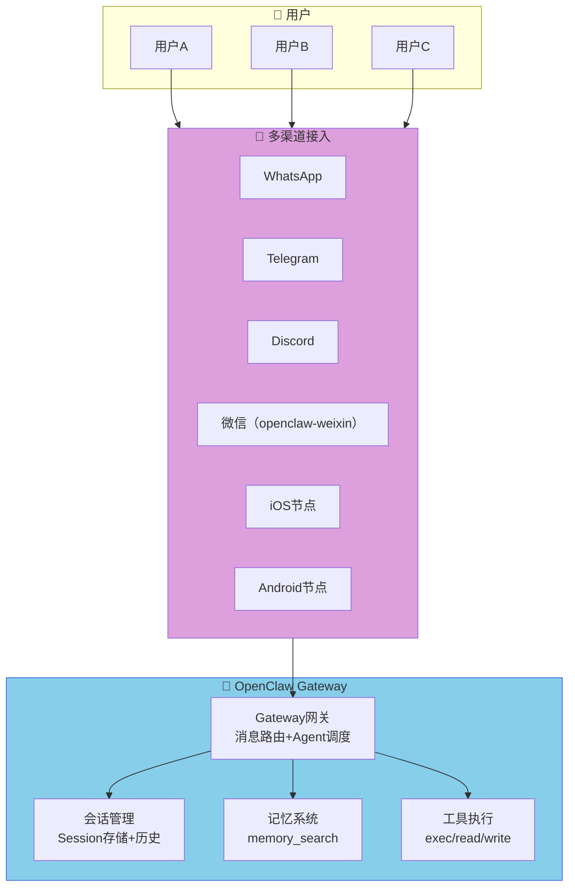

**OpenClaw的核心能力**：
- 一个AI Agent，连接多个聊天平台
- 支持文件操作、代码执行、网页访问等工具
- 持久化记忆系统，支持语义搜索
- 手机节点远程控制（屏幕、相机、位置等）
- 多Agent路由和隔离会话

## 二、核心概念详解

### 2.1 Gateway（网关）

**Gateway（网关）** 是OpenClaw的核心服务，负责：
- 接收来自各渠道的消息
- 调度AI Agent处理请求
- 管理会话状态
- 执行工具调用

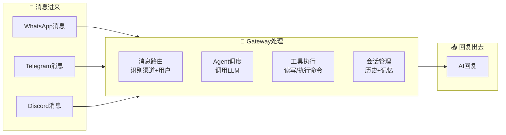

### 2.2 节点（Node）— 重点解析

**节点（Node）** 是连接到Gateway的附属设备（iOS/Android/macOS/无头Linux），通过WebSocket与Gateway保持长连接，暴露一组设备能力供Agent调用。

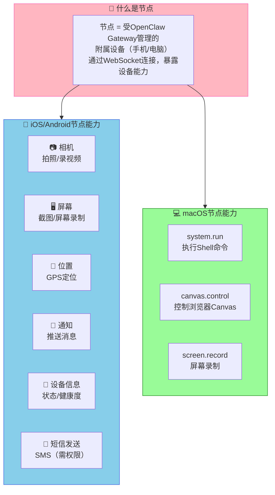

**节点的工作方式**：

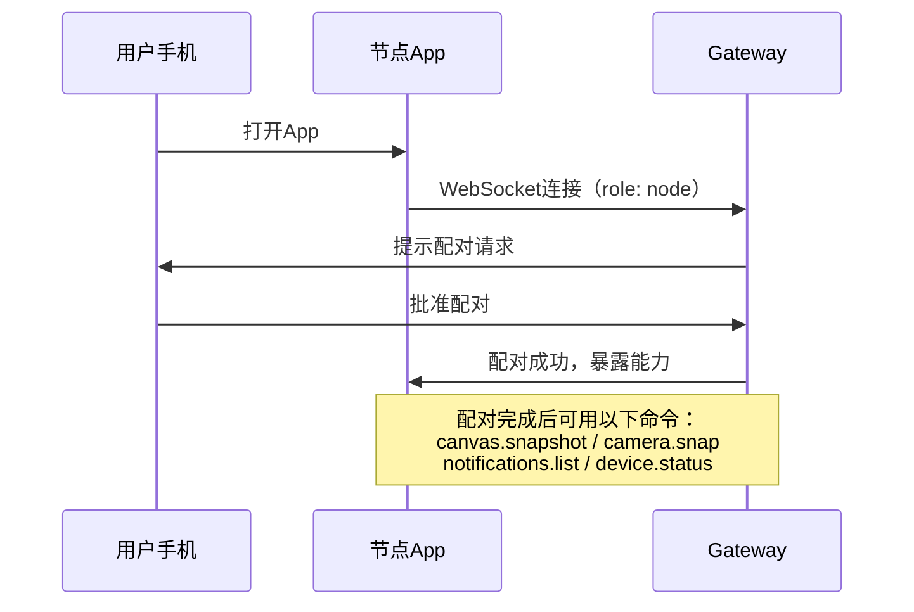

**关键配置字段说明**：

| 配置项 | 含义 | 示例 |
|--------|------|------|
| `tools.exec.host` | 执行命令在哪台机器跑 | `node`（在节点执行）|
| `tools.exec.node` | 指定具体节点ID | `my-phone` |
| `tools.exec.security` | 安全模式 | `allowlist`（白名单）|

```bash
# 指定Agent使用特定节点执行命令
openclaw config set tools.exec.host "node"
openclaw config set tools.exec.node "my-android-phone"
openclaw config set tools.exec.security "allowlist"

# 查看已配对节点
openclaw nodes status

# 重命名节点
openclaw nodes rename --node <id> --name "我的手机"
```

### 2.3 会话（Session）— 重点解析

**会话（Session）** 是OpenClaw管理对话历史的核心机制。每次你和Agent的对话都有一个Session，所有消息和工具调用都被记录在Session历史中。

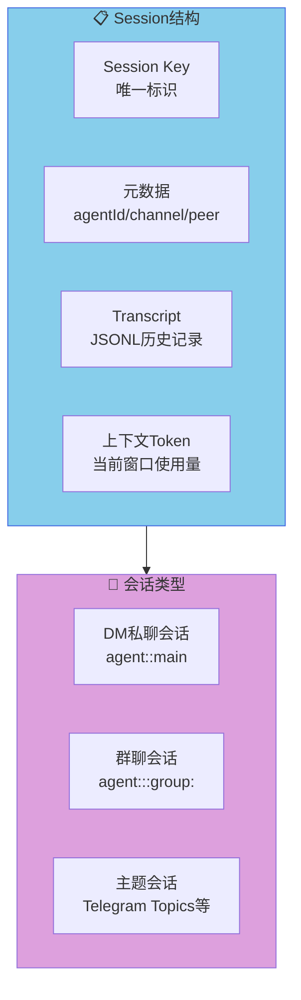

**Session Key的格式**：

| 类型 | 格式 | 说明 |
|------|------|------|
| DM（默认） | `agent:<agentId>:main` | 所有DM共享主会话 |
| DM（按用户） | `agent:<agentId>:<channel>:direct:<peerId>` | 每个用户独立会话 |
| 群聊 | `agent:<agentId>:<channel>:group:<id>` | 每个群一个会话 |
| 定时任务 | `cron:<job.id>` | Cron触发 |
| Webhook | `hook:<uuid>` | Webhook触发 |

**关键配置字段说明**：

| 配置项 | 含义 | 推荐值 |
|--------|------|--------|
| `session.dmScope` | DM会话隔离策略 | `per-channel-peer`（推荐多用户） |
| `session.reset.mode` | 重置策略 | `daily`（每日重置） |
| `session.reset.atHour` | 每日重置时间 | `4`（凌晨4点）|
| `session.maintenance.mode` | 会话维护模式 | `enforce`（生产环境）|
| `session.maintenance.maxEntries` | 最大会话数 | `500` |
| `session.maintenance.pruneAfter` | 会话过期时间 | `30d` |

```json5
// 推荐的会话配置（多用户场景）
{
  session: {
    // DM隔离：每个channel+用户独立会话
    dmScope: "per-channel-peer",
    
    // 重置策略：每日凌晨4点
    reset: {
      mode: "daily",
      atHour: 4,
    },
    
    // 会话维护：自动清理过期会话
    maintenance: {
      mode: "enforce",
      pruneAfter: "30d",
      maxEntries: 500,
    },
  }
}
```

### 2.4 心跳（Heartbeat）— 重点解析

**心跳（Heartbeat）** 是OpenClaw的主动推送机制：Gateway定期运行一个Agent轮次，检查是否有需要提醒用户的事情。

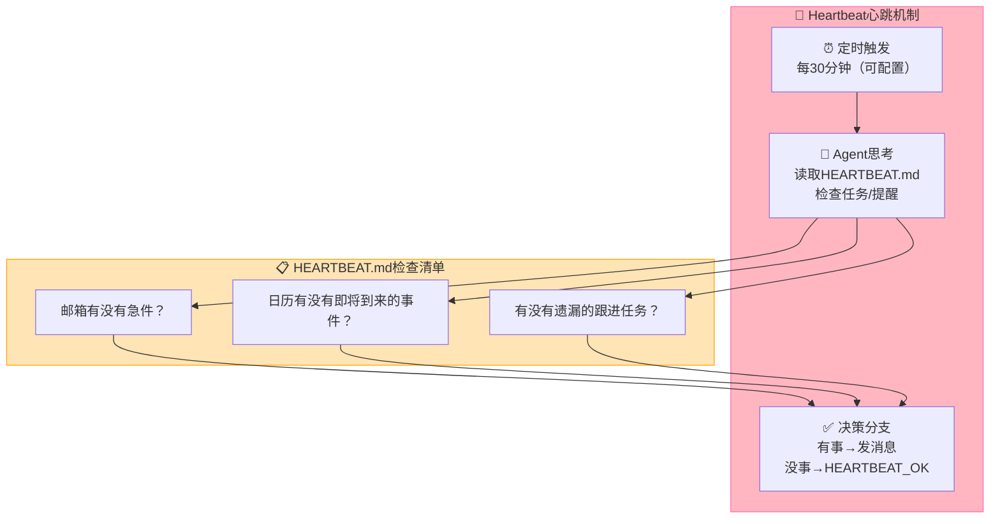

**为什么需要心跳？**

传统AI助手只能被动响应。有了心跳，Agent可以：
- 主动提醒你会议即将开始
- 检查邮箱发现重要邮件后主动通知
- 定时检查并汇报任务状态
- 避免你遗忘重要的跟进事项

**关键配置字段说明**：

| 配置项 | 含义 | 默认值 |
|--------|------|--------|
| `heartbeat.every` | 心跳间隔 | `30m`（30分钟）|
| `heartbeat.target` | 消息发送目标 | `none`（静默运行）|
| `heartbeat.prompt` | 心跳时的提示词 | 见下方默认 |
| `heartbeat.activeHours` | 心跳生效时间段 | 不限 |
| `heartbeat.lightContext` | 仅加载HEARTBEAT.md | `false` |

**心跳的响应约定**：
- 回复 `HEARTBEAT_OK` → 无需通知，静默
- 回复其他内容 → 发送给用户
- `HEARTBEAT_OK` 出现在回复**开头或结尾**才会被识别并过滤

```json5
// 心跳配置示例
{
  agents: {
    defaults: {
      heartbeat: {
        every: "30m",                    // 每30分钟
        target: "last",                 // 发送到上一个对话渠道
        lightContext: true,              // 只加载HEARTBEAT.md，省token
        activeHours: {
          start: "08:00",               // 早上8点开始
          end: "23:00",                 // 晚上11点结束
          timezone: "Asia/Shanghai",    // 使用上海时区
        },
      }
    }
  }
}
```

```markdown
<!-- HEARTBEAT.md 示例 -->
# 心跳检查清单

- 📧 邮箱有没有紧急邮件？
- 📅 未来2小时内有没有会议？
- 📌 有没有遗漏的跟进事项？
```

### 2.5 记忆系统（Memory）

OpenClaw的记忆系统基于**工作区的Markdown文件**，是让Agent"记住"跨会话信息的机制。

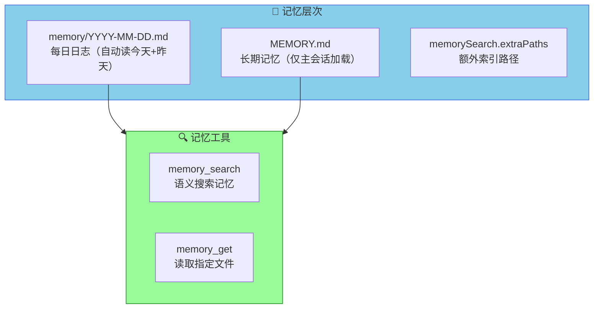

**关键配置字段说明**：

| 配置项 | 含义 |
|--------|------|
| `memorySearch.enabled` | 是否启用语义搜索 |
| `memorySearch.provider` | 向量嵌入提供者（`openai`/`gemini`/`local`） |
| `memorySearch.model` | 嵌入模型 |
| `memorySearch.query.hybrid` | 混合搜索（向量+关键词） |
| `memorySearch.query.temporalDecay` | 时间衰减（近期记忆优先） |
| `memory.backend` | 记忆后端（`qmd`为实验性本地搜索） |

```json5
// 记忆配置示例
{
  agents: {
    defaults: {
      memorySearch: {
        enabled: true,
        provider: "gemini",           // 使用Gemini做嵌入
        model: "gemini-embedding-001",
        query: {
          hybrid: {
            enabled: true,
            vectorWeight: 0.7,
            textWeight: 0.3,
            temporalDecay: {
              enabled: true,
              halfLifeDays: 30,      // 30天前的记忆权重减半
            }
          }
        }
      }
    }
  }
}
```

**关于"梦境"的说明**：在OpenClaw标准文档中并无"梦境"这个概念。可能的情况：
1. 某插件引入了"梦境"功能（如某些AI Agent项目用"梦境"指代Agent的潜记忆）
2. 你可能在其他文档中看到，请告知具体出处，我可以帮你解释

### 2.6 工作区（Workspace）

**工作区**是Agent的"家目录"，存放所有Agent相关的配置文件和记忆文件。

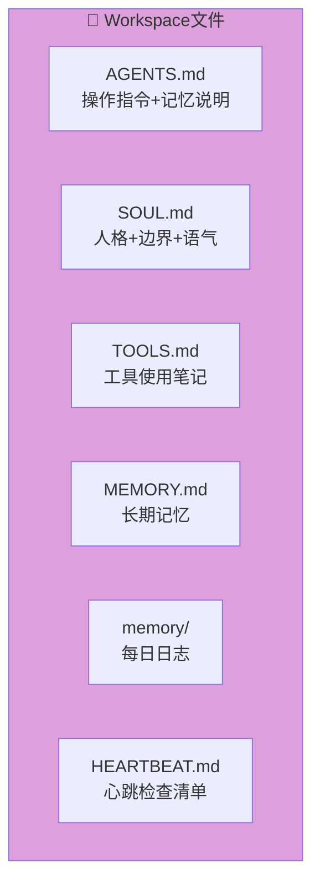

| 文件 | 作用 | 何时加载 |
|------|------|---------|
| `AGENTS.md` | 你的工作指令 | 每次会话 |
| `SOUL.md` | Agent人格定义 | 每次会话 |
| `TOOLS.md` | 工具使用规范 | 每次会话 |
| `MEMORY.md` | 长期记忆 | 仅主会话DM |
| `memory/YYYY-MM-DD.md` | 每日日志 | 今天+昨天 |
| `HEARTBEAT.md` | 心跳检查清单 | 心跳时 |

## 三、完整配置示例

### 3.1 最小配置

```json5
// ~/.openclaw/openclaw.json
{
  // AI Agent工作区（必选）
  agents: {
    defaults: {
      workspace: "~/.openclaw/workspace",
      model: "anthropic/claude-opus-4-6",  // 默认模型
    }
  },
  
  // 至少配置一个渠道
  channels: {
    whatsapp: {
      dmPolicy: "pairing",              // 陌生用户需配对
      allowFrom: ["*"],                 // 允许所有人发起DM
    }
  }
}
```

### 3.2 完整配置（多渠道+节点+心跳）

```json5
// ~/.openclaw/openclaw.json
{
  // === 渠道配置 ===
  channels: {
    whatsapp: {
      dmPolicy: "pairing",             // 新用户需配对审批
      allowFrom: ["*"],
    },
    telegram: {
      dmPolicy: "allowlist",
      allowFrom: [123456789],          // 白名单用户ID
      botToken: "YOUR_TELEGRAM_BOT_TOKEN",
    },
    discord: {
      dmPolicy: "allowlist",
      allowFrom: ["*"],
      botToken: "YOUR_DISCORD_BOT_TOKEN",
    },
    defaults: {
      groupPolicy: "allowlist",       // 默认禁止群聊
    }
  },

  // === Agent配置 ===
  agents: {
    defaults: {
      workspace: "~/.openclaw/workspace",
      model: "anthropic/claude-opus-4-6",
      
      // 模型提供商认证
      auth: {
        provider: "anthropic",
        key: "sk-ant-...",            // Anthropic API Key
      },
      
      // 心跳配置
      heartbeat: {
        every: "30m",                 // 每30分钟
        target: "last",               // 发送到上一个活跃渠道
        lightContext: true,           // 只加载HEARTBEAT.md
        activeHours: {
          start: "08:00",
          end: "23:00",
          timezone: "Asia/Shanghai",
        },
      },
      
      // 会话配置
      session: {
        dmScope: "per-channel-peer",  // 每个用户独立会话
        reset: {
          mode: "daily",
          atHour: 4,
        },
        maintenance: {
          mode: "enforce",
          pruneAfter: "30d",
          maxEntries: 500,
        },
      },
      
      // 记忆配置
      memorySearch: {
        enabled: true,
        provider: "gemini",
        model: "gemini-embedding-001",
        query: {
          hybrid: {
            enabled: true,
            vectorWeight: 0.7,
            textWeight: 0.3,
          }
        }
      },
      
      // 紧凑化（上下文管理）
      compaction: {
        memoryFlush: {
          enabled: true,
          softThresholdTokens: 4000,
        },
      },
    },
  },
  
  // === 节点配置（远程执行命令）===
  tools: {
    exec: {
      host: "node",                    // 在节点执行
      node: "my-phone",               // 指定节点ID
      security: "allowlist",          // 白名单模式
    },
  },
  
  // === Gateway配置 ===
  gateway: {
    port: 18789,                      // WebSocket端口
    bind: "loopback",                 // 本地绑定（远程需配置remote）
  },
}
```

## 四、节点使用进阶

### 4.1 配对和管理

```bash
# 查看已连接的节点
openclaw nodes status

# 查看节点详细信息
openclaw nodes describe --node <节点ID>

# 给节点上的命令添加白名单
openclaw approvals allowlist add --node <节点ID> "/usr/bin/uname"
openclaw approvals allowlist add --node <节点ID> "/usr/bin/screenshot"

# 节点远程截图
openclaw nodes canvas snapshot --node <节点ID> --format png

# 节点拍照
openclaw nodes camera snap --node <节点ID> --facing back

# 节点获取位置
openclaw nodes location get --node <节点ID>

# 节点发送通知
openclaw nodes notify --node <节点ID> --title "提醒" --body "会议5分钟后开始"
```

### 4.2 在Agent中使用节点

Agent可以通过工具调用直接使用节点能力：

```python
# Agent内部的工具调用示例（工具名由Agent系统注入）
canvas.snapshot()           # 截取节点屏幕
camera.snap()               # 节点拍照
location.get()             # 获取GPS位置
notifications.list()       # 查看通知列表
device.status()            # 查看设备状态
system.run("ls -la")      # 在节点执行Shell命令
```

## 五、会话管理进阶

### 5.1 安全DM模式（多用户必读）

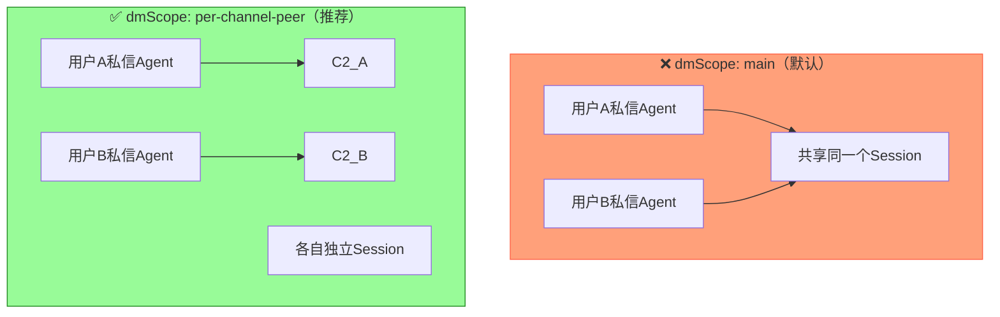

### 5.2 手动管理会话

```bash
# 查看所有会话
openclaw sessions --json

# 查看特定会话
openclaw sessions --active 60  # 最近60分钟活跃的

# 清理会话
openclaw sessions cleanup --dry-run      # 预览要清理的内容
openclaw sessions cleanup --enforce       # 执行清理

# 重置当前会话
/new
/reset
```

### 5.3 发送特殊指令

```bash
# 查看当前Agent状态
/status

# 查看上下文使用情况
/context list

# 强制紧凑化（压缩历史）
/compact

# 停止当前运行
/stop
```

## 六、Skills（技能）系统

OpenClaw支持**技能（Skills）**扩展Agent能力，通过在 `skills/` 目录下放置 `SKILL.md` 定义工具使用规范。

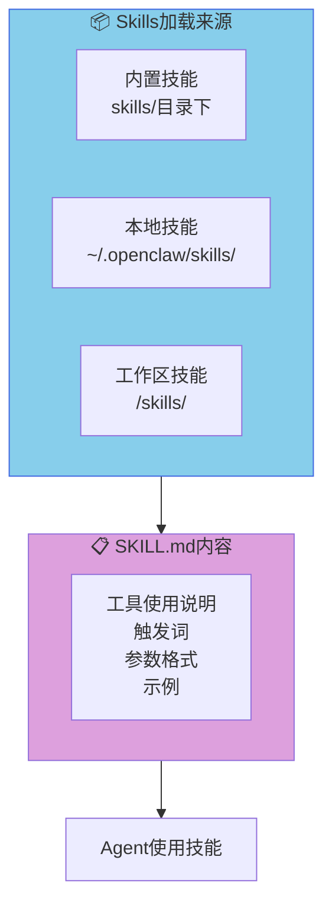

Skills让Agent知道：
- 某个工具什么时候该用
- 工具的参数应该怎么传
- 工具的输出代表什么含义

## 七、常见问题

### Q1：节点显示"未配对"怎么办？
```bash
# 查看待处理的配对请求
openclaw devices list

# 批准配对请求
openclaw devices approve <requestId>
```

### Q2：心跳没有响应？
- 检查 `HEARTBEAT.md` 是否存在且非空
- 检查 `heartbeat.every` 是否设为 `0m`（禁用）
- 确认 `activeHours` 在当前时间范围内

### Q3：Session历史占用太多空间？
```json5
{
  session: {
    maintenance: {
      mode: "enforce",
      pruneAfter: "14d",      // 缩短保留时间
      maxEntries: 200,        // 减少最大会话数
    }
  }
}
```

### Q4：如何让Agent记住跨会话的信息？
告诉Agent"把这个记住"——它会自动写入 `MEMORY.md`。

## 八、架构总览

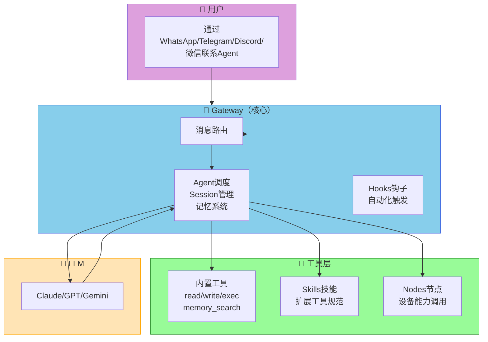

## 结语

OpenClaw是一个功能丰富的AI Agent平台，本文覆盖了它最核心的概念：

| 概念 | 作用 |
|------|------|
| **Gateway** | 消息路由和Agent调度的核心 |
| **Node** | 手机/电脑作为Gateway的远程外设 |
| **Session** | 对话历史的容器，支持隔离和重置策略 |
| **Heartbeat** | Agent主动检查和提醒的机制 |
| **Memory** | 跨会话持久记忆（Markdown文件+向量搜索）|
| **Workspace** | Agent的"家"，存放配置和记忆文件 |
| **Skills** | 工具使用的规范定义 |

如果有任何配置项不清楚，或者你看到的"梦境"概念有具体出处，欢迎告诉我，我可以进一步解释。

## 参考资料

| 资源 | 链接 |
|------|------|
| **OpenClaw官网** | https://openclaw.ai |
| **OpenClaw文档** | /vol1/@apphome/trim.openclaw/data/openclaw/node_modules/openclaw/docs |
| **GitHub** | github.com/openclaw/openclaw |
| **Discord社区** | discord.com/invite/clawd |

---

*如有疑问，欢迎交流。*
