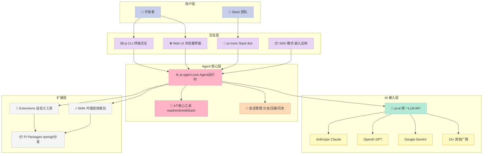
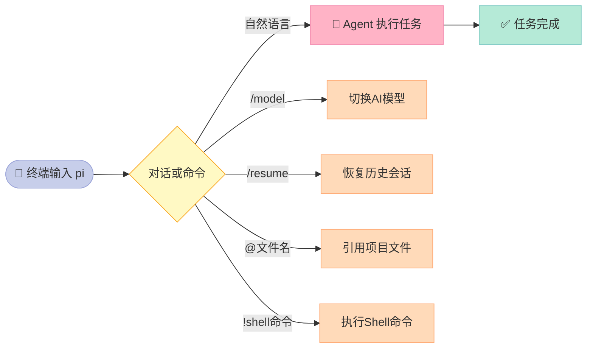
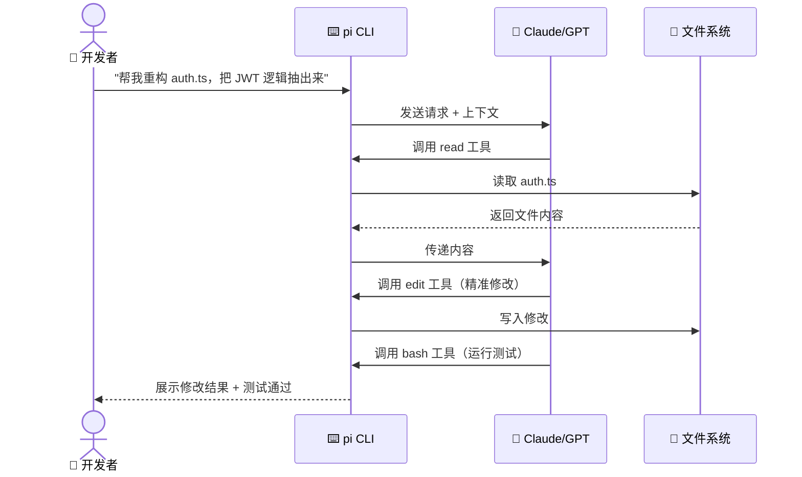

> **核心结论：** pi-mono 用 `read`、`write`、`edit`、`bash` 四个工具覆盖了 99% 的编程自动化需求——它不是 AI 框架，而是一套让你真正掌控 AI 的"乐高积木"。

---

## 前言

最近两年，AI 编程助手的军备竞赛愈演愈烈：Cursor 塞满了上下文感知、Copilot 嵌入了 IDE、Claude Code 内置了复杂的规划模式……

但有一个工具反其道而行之：**功能越少越好，工具越精准越强**。

这就是 [pi-mono](https://github.com/badlogic/pi-mono)，由 libGDX 作者 Mario Zechner（badlogic）创建的开源 AI 编程助手。它在 GitHub 上斩获 **19K+ 星**，但设计理念却截然不同——用极简换取掌控感。

读完本文，你将了解：
- pi-mono 到底是什么，架构怎么设计
- 如何 5 分钟上手使用
- 它和 Claude Code、Cursor 的本质区别
- 哪些场景最适合使用它

---

## 一、pi-mono 是什么？

**pi-mono 不是一个 AI 模型，也不是一个 IDE 插件，而是一个面向开发者的 AI Agent 工具集（Monorepo）。**

其核心是 `pi` —— 一个运行在终端里的极简 AI 编程代理（Coding Agent CLI）。你打开终端，输入 `pi`，就能开始和 AI 协作写代码、读代码、运行测试、修 bug。

**整个 Monorepo 由 7 个包组成：**

| 包名 | 功能 |
|------|------|
| `@mariozechner/pi-ai` | 统一多厂商 LLM API（OpenAI、Anthropic、Google 等 15+ 家） |
| `@mariozechner/pi-agent-core` | Agent 运行时，含工具调用和状态管理 |
| `@mariozechner/pi-coding-agent` | 核心产品：交互式编程代理 CLI |
| `@mariozechner/pi-mom` | Slack Bot，将消息委托给编程代理 |
| `@mariozechner/pi-tui` | 终端 UI 库，支持差分渲染 |
| `@mariozechner/pi-web-ui` | Web 组件库，用于构建 AI 聊天界面 |
| `@mariozechner/pi-pods` | GPU Pod 管理 CLI（用于 vLLM 自托管） |

你可以只用 `pi-coding-agent` 这一个包，也可以把整套工具栈组合起来构建自己的 AI 产品。

---

## 二、核心架构解析



**最值得关注的是 Agent 核心层只有 4 个工具：**

```text
read   → 读取文件内容
write  → 写入/创建文件
edit   → 精准修改文件的某个片段
bash   → 执行 Shell 命令
```

这不是功能缺失，而是**刻意的设计哲学**。有了 `bash`，AI 可以运行测试、安装依赖、调用 curl、操作 git——几乎无所不能。其余三个工具处理文件读写，覆盖绝大多数编码需求。

---

## 三、5 分钟上手指南

### 安装

```bash
# 全局安装（推荐）
npm install -g @mariozechner/pi-coding-agent

# 验证安装
pi --version
```

### 配置 API Key

```bash
# 方式一：设置环境变量（推荐用于 API Key 用户）
export ANTHROPIC_API_KEY=sk-ant-...
# 或者
export OPENAI_API_KEY=sk-...

# 方式二：使用订阅登录（支持 Claude Pro/Max、ChatGPT Plus 等）
pi
/login   # 在 pi 内部执行，选择提供商
```

### 基本使用流程



### 常用命令速查

| 命令 | 说明 |
|------|------|
| `/model` 或 `Ctrl+L` | 切换 AI 模型（跨厂商） |
| `/resume` | 恢复上次会话 |
| `/compact` | 压缩会话上下文（节省 token） |
| `/tree` | 可视化会话分支树，随时回溯 |
| `/fork` | 从当前分支创建新会话 |
| `/share` | 上传为 GitHub Gist，生成分享链接 |
| `@文件名` | 模糊搜索并引用项目文件 |
| `!cmd` | 执行 Shell 命令并把输出发给 AI |
| `Shift+Tab` | 切换思考深度（Thinking Level） |

### 会话分支管理（亮点功能）

会话以 **JSONL 树状结构** 存储，天然支持分支。用 `/tree` 打开会话树视图，可以：
- 跳回任意历史节点继续对话
- 在同一文件内维护多条分支
- 给关键节点打标签（书签）

这类似于 git 的分支模型——**你永远有后悔药吃**。

---

## 四、支持哪些 AI 提供商？

pi-mono 的 `pi-ai` 包实现了统一的 LLM API，支持超过 20 个提供商：

**订阅方式（不需要 API Key）：**
- ✅ Anthropic Claude Pro/Max
- ✅ OpenAI ChatGPT Plus/Pro (Codex)
- ✅ GitHub Copilot
- ✅ Google Gemini CLI

**API Key 方式：**
- OpenAI、Anthropic、Azure OpenAI、Google Gemini、Google Vertex
- Amazon Bedrock、Mistral、Groq、Cerebras、xAI
- OpenRouter、Hugging Face、Kimi For Coding、MiniMax 等

**切换模型只需一个命令：**

```bash
/model   # 或 Ctrl+L，弹出选择器，实时切换
```

这意味着你可以用同一个工具，今天用 Claude 写代码，明天切到 Gemini 跑测试，后天用本地 LLM 处理敏感代码——**零迁移成本**。

---

## 五、扩展系统：真正的"反框架"

pi-mono 的扩展系统是其差异化的核心所在。

### Skills（技能）

技能是可以即插即用的能力包，通过 `/skill:名称` 调用：

```bash
/skill:review   # 代码审查
/skill:test     # 测试生成
```

### Extensions（扩展）

用 TypeScript 写扩展，可以：
- 注册自定义命令
- 替换/扩展编辑器 UI
- 自定义工具调用行为
- 添加自定义 Footer 或 Overlay

```typescript
// 一个简单的扩展示例
export default {
  name: "my-extension",
  commands: {
    "/analyze": async (agent, args) => {
      // 自定义分析逻辑
    }
  }
}
```

### Pi Packages（包分发）

把你的扩展、技能、提示词模板打包成 npm 包发布，别人 `npm install` 后即可使用。**AI 能力像代码一样被复用和分享。**

### 运行模式

| 模式 | 说明 | 适用场景 |
|------|------|----------|
| 交互模式 | 全功能 TUI 界面 | 日常编程 |
| Print/JSON 模式 | 无状态单次执行 | 脚本集成 |
| RPC 模式 | 进程间通信 | 工具集成 |
| SDK 模式 | 嵌入自己的应用 | 产品开发 |

---

## 六、使用场景深度分析

### 场景一：个人开发者的"终端 Copilot"



**最适合**：不想离开终端、喜欢精细控制的后端/全栈开发者。

### 场景二：团队 Slack Bot（pi-mom）

通过 `pi-mom` 包，将 pi 接入 Slack：
- 在 Slack 频道里直接提问代码问题
- AI 自动读取代码库、执行分析、返回结果
- 代码审查、bug 排查、文档查询一键完成

**最适合**：团队协作，让非技术成员也能查询代码库。

### 场景三：自托管 LLM 开发者（pi-pods）

`pi-pods` 提供 GPU Pod 管理能力，支持 vLLM 自托管：

```bash
pi-pods start --model llama3-70b --gpu a100
pi-pods list
pi-pods stop <pod-id>
```

**最适合**：对数据安全有要求、不想把代码发给第三方 API 的企业用户。

### 场景四：构建自己的 AI 编码产品

使用 SDK 模式 + `pi-web-ui` 组件库，可以快速搭建自定义 AI 界面：

```typescript
import { PiAgent } from "@mariozechner/pi-agent-core";
import { PiWebUI } from "@mariozechner/pi-web-ui";

const agent = new PiAgent({ provider: "anthropic" });
const ui = new PiWebUI({ agent });
ui.mount("#app");
```

真实案例：[openclaw/openclaw](https://github.com/openclaw/openclaw) 就是基于 pi SDK 构建的完整产品。

---

## 七、与同类工具横向对比

| 维度 | **pi-mono** | **Claude Code** | **Cursor** | **GitHub Copilot** |
|------|-------------|-----------------|------------|---------------------|
| 运行环境 | ✅ 终端 CLI | ✅ 终端 CLI | ⚠️ IDE 插件 | ⚠️ IDE 插件 |
| 模型支持 | ✅ 20+ 厂商 | ❌ 仅 Anthropic | ⚠️ 少数厂商 | ❌ 仅 GitHub/OpenAI |
| 自托管 LLM | ✅ 支持 vLLM | ❌ 不支持 | ⚠️ 有限支持 | ❌ 不支持 |
| 开源 | ✅ MIT | ❌ 闭源 | ❌ 闭源 | ❌ 闭源 |
| 可扩展性 | ✅ Extensions/Skills | ⚠️ 有限 | ⚠️ 有限 | ⚠️ 有限 |
| 会话分支 | ✅ 树状结构 | ⚠️ 基础 | ❌ 无 | ❌ 无 |
| 工具数量 | 4个（极简） | 多个 | IDE集成 | IDE集成 |
| Slack 集成 | ✅ pi-mom | ❌ | ❌ | ❌ |
| 上手复杂度 | ⚠️ 中等 | ✅ 简单 | ✅ 简单 | ✅ 简单 |
| 定价 | 免费（用自己的API Key） | 按量付费 | 订阅制 | 订阅制 |

**核心差异总结：**

- **Cursor/Copilot** 是 IDE 原住民，开箱即用，但被绑定在特定编辑器和模型里
- **Claude Code** 是终端工具，但锁定在 Anthropic 生态
- **pi-mono** 是最自由的——模型可换、工具可扩展、代码完全透明开源

> 如果你的诉求是"用最快速度用上 AI 辅助"，选 Cursor。
> 如果你的诉求是"完全掌控 AI Agent 的每个细节"，选 pi-mono。

---

## 八、设计哲学：反框架宣言

pi-mono 的 README 里有一句话值得反复品味：

> "Adapt pi to your workflows, not the other way around."
> （让 pi 适应你的工作流，而不是反过来。）

这句话背后有一个深刻的判断：**大多数 AI 框架都在试图替你做决定**——用什么模型、怎么规划任务、工具调用的顺序……框架帮你封装了一切，同时也剥夺了你的控制权。

pi-mono 的选择是：

1. **提供最小可用工具集**（4 个工具），不内置复杂规划逻辑
2. **把扩展权交给开发者**（TypeScript Extensions），而不是等官方更新
3. **透明化一切**（MIT 开源），你能读到每一行代码
4. **鼓励分享真实会话**，通过 [Hugging Face 数据集](https://huggingface.co/datasets/badlogicgames/pi-mono) 改善模型

这种哲学和 Unix 工具的设计精神一脉相承：**做一件事，做到极致，然后和其他工具组合**。

---

## 九、局限性和注意事项

当然，pi-mono 也有其局限：

- **上手曲线**：没有 GUI，纯终端操作，对不熟悉 CLI 的用户不友好
- **无内置计划模式**：不像 Cursor 的 Composer 那样有任务规划，复杂任务需要用户主动分解
- **社区规模**：19K Star 对于开源工具不算小，但相比 Cursor/Copilot 的商业生态还有差距
- **Windows 支持**：主要针对 Unix 系统优化，Windows 有专门的[适配文档](https://github.com/badlogic/pi-mono/blob/main/packages/coding-agent/docs/windows.md)但体验略差

---

## 结论：什么样的人应该用 pi-mono？

如果你符合以下描述，pi-mono 值得立刻尝试：

- 🔧 **喜欢终端**，不想为了 AI 换 IDE
- 🔌 **需要切换模型**，今天 Claude，明天 Gemini，不想被绑定
- 🔒 **数据敏感**，想自托管 LLM 而不是把代码发给第三方
- 🧩 **喜欢折腾**，想定制 AI Agent 的行为逻辑
- 🏢 **团队使用**，需要 Slack Bot 或自定义 AI 界面

```bash
# 现在就开始：
npm install -g @mariozechner/pi-coding-agent
export ANTHROPIC_API_KEY=sk-ant-...
pi
```

极简不是功能少，而是**把复杂度交还给你**。这就是 pi-mono 的赌注——在 AI 工具同质化的今天，它选择做那把让你真正掌控一切的"刀"。

---

> **延伸阅读：**
> - [pi-mono GitHub 仓库](https://github.com/badlogic/pi-mono)
> - [真实开发会话数据集（Hugging Face）](https://huggingface.co/datasets/badlogicgames/pi-mono)
> - [openclaw：基于 pi SDK 构建的真实产品](https://github.com/openclaw/openclaw)
> - [Discord 社区](https://discord.com/invite/3cU7Bz4UPx)

---

## 对比分析

pi-mono 强调"4 个工具搞定一切"的极简编程 Agent。下面与同样极简风格的两个 Agent 项目做对比：Agno（Python 极简框架）和 Smolagents（HuggingFace 轻量框架）。

### 对比维度一：抽象与体积
| 维度 | pi-mono | Agno | Smolagents |
| --- | --- | --- | --- |
| 语言 | Rust | Python | Python |
| 抽象哲学 | 工具即一切 | 模型即一切 | Agent + Tools |
| 启动体积 | 单二进制 | pip 包 | pip 包 |
| 核心依赖 | 极少量 | 中等 | 依赖 transformers/transformers ecosystem |

### 对比维度二：开发体验
| 维度 | pi-mono | Agno | Smolagents |
| --- | --- | --- | --- |
| 上手时间 | 分钟级 | 分钟级 | 分钟级 |
| 多模态 | 文本为主 | 原生多模态 | 文本为主，可扩视觉 |
| 工具生态 | 自定义注册 | 丰富内置工具 | HuggingFace 工具集 |
| 生产部署 | 最简单 | 较简单 | 中（依赖较重） |

### 优缺点
- **pi-mono**：单二进制 + Rust 性能 + 极简哲学；AI SDK 生态需要自封装。
- **Agno**：Python 多模态 + 模型覆盖最广；抽象仍然封装了不少"魔法"。
- **Smolagents**：HF 生态背书，紧跟模型前沿；依赖链较重。

### 何时选哪个
- 要极致性能、零依赖部署 → 选 pi-mono
- 写 Python 多模态应用、模型切换频繁 → 选 Agno
- 想紧跟 HF 生态 + 简单工具调用 → 选 Smolagents

### 参考资料
- pi-mono 仓库：https://github.com/malcolmyu/pi-mono
- Agno 仓库：https://github.com/agno-agi/agno
- Smolagents 仓库：https://github.com/huggingface/smolagents
