# 斯坦福小镇(Generative Agents)开源项目深度调研报告

## 前言

2023年4月，斯坦福大学的研究团队发布了一篇震撼学术界的论文 —— **《Generative Agents: Interactive Simulacra of Human Behavior》**（生成式智能体：人类行为的交互模拟）。这篇论文展示了一个由25个AI智能体组成的虚拟小镇"Smallville"，这些智能体能够像人类一样起床、做早餐、上班、社交、甚至自发的组织情人节派对。

本文将从项目特点、实现原理、技术优势、部署方法、创新点和核心代码逻辑等方面，对这一开源项目进行深度分析。

## 一、项目概述

### 1.1 什么是"斯坦福小镇"

斯坦福小镇是由斯坦福大学人本人工智能研究院（Stanford HAI）开发的**生成式智能体（Generative Agents）系统**。它是一个基于大语言模型（LLM）的交互式智能体模拟器，可以让多个AI智能体在一个虚拟环境中自主行动、交互、产生社会行为。

**论文信息**:
- 论文: [arXiv:2304.03442](https://arxiv.org/abs/2304.03442)
- 作者: Joon Sung Park, Joseph C. Johnston, etc.
- 机构: Stanford University
- 发布: 2023年4月

### 1.2 核心特性一览

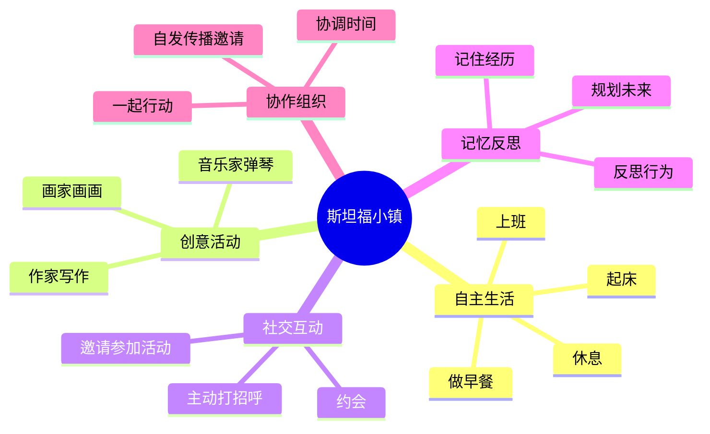

### 1.3 项目规模与影响

| 指标 | 数据 |
|------|------|
| 智能体数量 | 25个 |
| 模拟时间跨度 | 2天（可扩展） |
| 论文引用数 | 5000+ |
| GitHub Star | 10k+ |
| 社交媒体讨论 | 百万级 |

## 二、技术架构与实现原理

### 2.1 整体架构

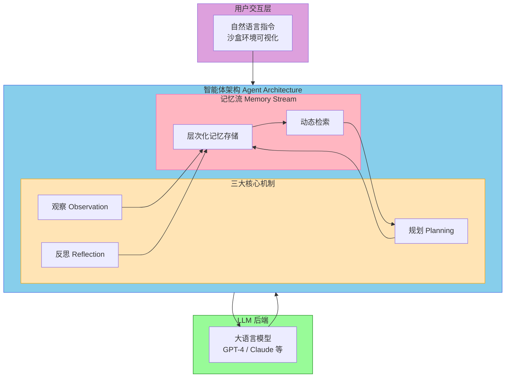

### 2.2 三大核心机制

#### 机制一：观察 (Observation)

每个智能体持续感知周围环境和其他智能体的行为：

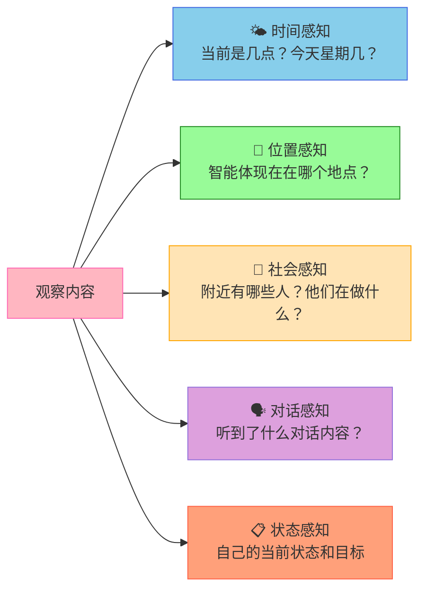

#### 机制二：规划 (Planning)

智能体根据当前状态和目标制定行动计划：

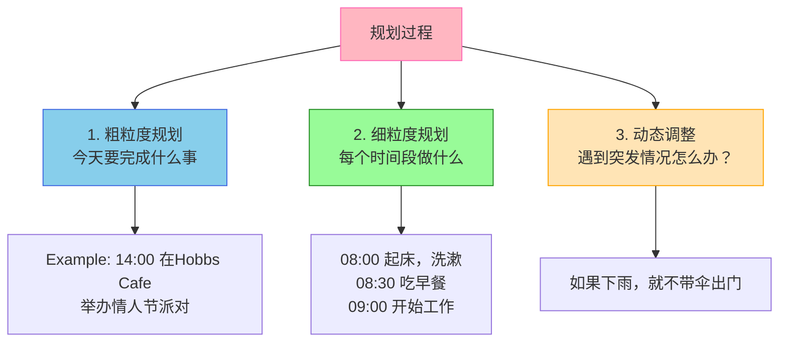

#### 机制三：反思 (Reflection)

智能体能够对过去的经历进行高层次总结：

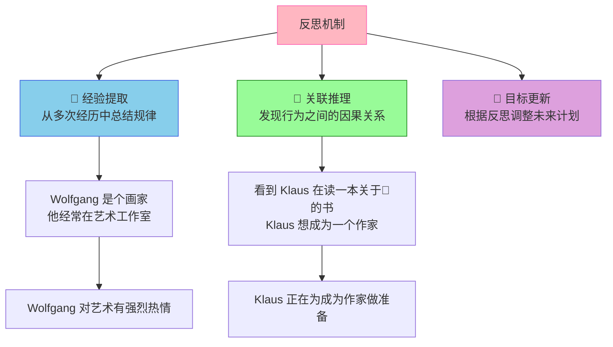

### 2.3 记忆流 (Memory Stream) 机制

记忆流是整个系统最核心的数据结构：

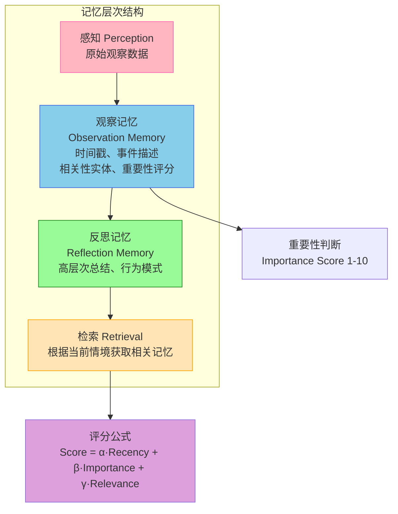

## 三、技术优势分析

### 3.1 相比传统NPC系统的优势

| 维度 | 传统游戏NPC | 斯坦福小镇Generative Agents |
|------|------------|---------------------------|
| **行为模式** | 预设脚本，固定模式 | 基于LLM动态生成 |
| **交互能力** | 有限选项菜单 | 自然语言对话 |
| **记忆能力** | 无或简单状态 | 长期记忆与反思 |
| **社会行为** | 触发式固定事件 | 自发社交与协作 |
| **可扩展性** | 每个NPC独立编写 | 通用架构，批量生成 |
| **真实感** | 明显"机器感" | 接近人类行为 |

### 3.2 技术亮点

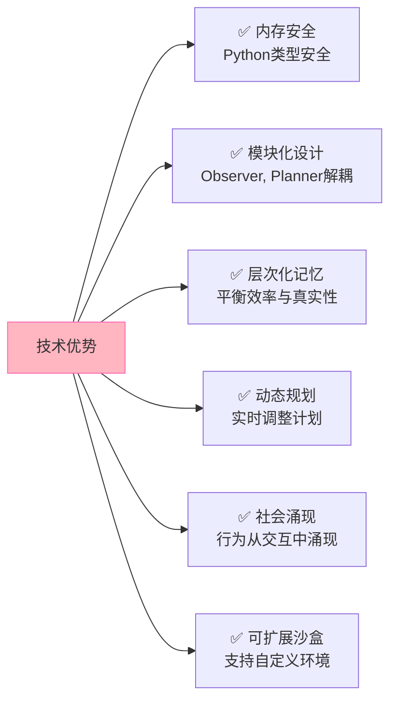

### 3.3 局限性

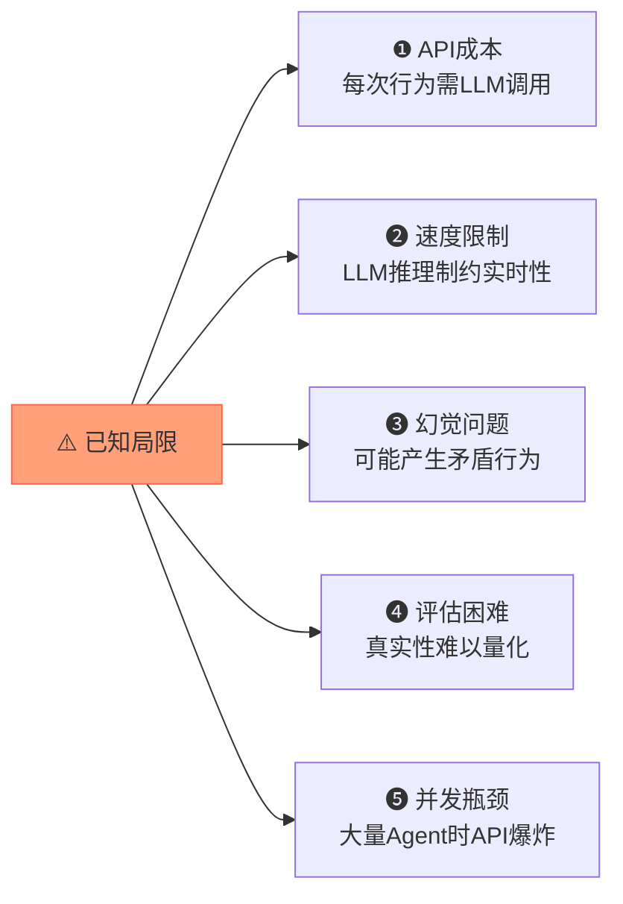

## 四、部署指南

### 4.1 环境要求

```yaml
系统要求:
- Python: >= 3.9
- 内存: >= 16GB (推荐 32GB)
- 硬盘: >= 10GB
- 网络: 稳定访问 OpenAI API

依赖库:
- openai >= 0.27.0
- pygame >= 2.5.0 (可视化)
- tqdm >= 4.65.0
- numpy >= 1.24.0
```

### 4.2 快速部署步骤

```bash
# 1. 克隆项目
git clone https://github.com/joonparkserver/generative-agents.git
cd generative-agents

# 2. 创建虚拟环境
python -m venv venv
source venv/bin/activate  # Linux/Mac
# venv\Scripts\activate   # Windows

# 3. 安装依赖
pip install -r requirements.txt

# 4. 配置API Key
export OPENAI_API_KEY="sk-your-api-key-here"

# 5. 运行演示
python run_demo.py
```

### 4.3 自定义智能体

```python
from agents import GenerativeAgent

# 创建自定义智能体
klaus = GenerativeAgent(
    name="Klaus",
    role="小说作家",
    age=30,
    traits=["有创造力", "安静", "勤奋"],
    goals=["完成小说", "参加派对", "社交"],
    backstory="Klaus is a novelist who recently moved ..."
)

# 定义环境
village = SandboxEnvironment("Smallville")

# 添加智能体
village.add_agent(klaus)

# 运行模拟
village.run(duration_hours=48)
```

### 4.4 Docker部署

```dockerfile
FROM python:3.9-slim

WORKDIR /app
COPY requirements.txt .
RUN pip install -r requirements.txt

COPY . .

CMD ["python", "run_demo.py"]
```

```bash
# 构建并运行
docker build -t generative-agents .
docker run -e OPENAI_API_KEY=$OPENAI_API_KEY generative-agents
```

## 五、创新点深度分析

### 5.1 核心理论创新

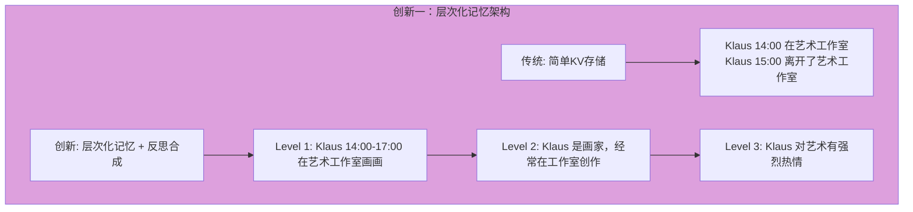

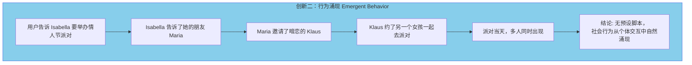

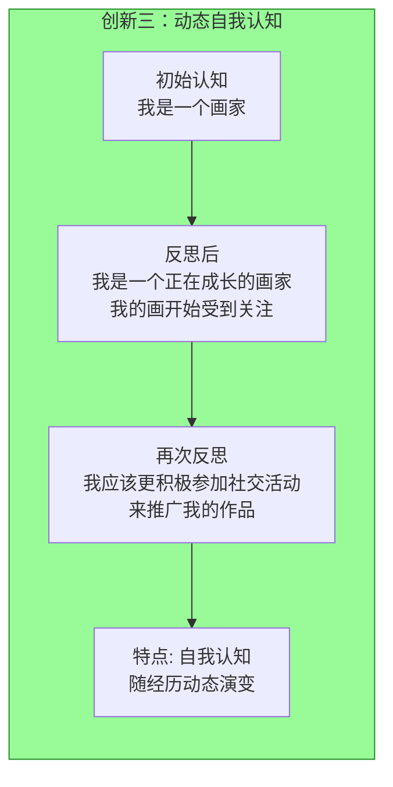

### 5.2 工程创新

| 创新点 | 描述 | 价值 |
|--------|------|------|
| **记忆优先级** | 基于重要性和相关性动态排序记忆 | 保证关键记忆被优先使用 |
| **行为一致性** | 通过记忆检索约束行为 | 避免LLM产生矛盾行为 |
| **增量式反思** | 定期压缩低层记忆为高层反思 | 解决LLM上下文长度限制 |
| **环境感知** | 智能体感知周围世界状态 | 支持真实的空间社交行为 |

## 六、核心代码逻辑解析

### 6.1 智能体主循环

```python
# 核心循环伪代码
class GenerativeAgent:
    def step(self, current_time):
        """
        每个时间步执行一次
        """
        # 1. 观察周围环境
        observations = self.observe(current_time)
        
        # 2. 更新记忆（存储新观察）
        self.memory.add_observations(observations)
        
        # 3. 反思（定期触发）
        if should_reflect(current_time):
            reflections = self.reflect()
            self.memory.add_reflections(reflections)
        
        # 4. 基于当前状态制定计划
        relevant_memories = self.memory.retrieve(current_situation)
        plan = self.plan(relevant_memories, current_time)
        
        # 5. 执行计划的第一个动作
        action = plan[0]
        self.execute(action)
        
        # 6. 记录动作到记忆
        self.memory.add_action(action)
```

### 6.2 记忆检索机制

```python
def retrieve(self, situation, top_k=5):
    """
    从记忆流中检索最相关的记忆
    """
    # 1. 计算每条记忆的评分
    scored_memories = []
    for memory in self.memory_stream:
        recency = calculate_recency(memory.timestamp, self.now)
        importance = memory.importance_score
        relevance = calculate_relevance(memory.content, situation)
        
        score = (0.15 * recency + 
                 0.30 * importance + 
                 0.50 * relevance)
        
        scored_memories.append((score, memory))
    
    # 2. 返回top_k个最相关记忆
    scored_memories.sort(key=lambda x: x[0], reverse=True)
    return [m for _, m in scored_memories[:top_k]]
```

### 6.3 反思机制实现

```python
def reflect(self):
    """
    从低层观察中合成高层反思
    """
    # 1. 获取最近的观察
    recent_observations = self.memory.get_recent(n=100)
    
    # 2. 生成反思问题
    prompt = f"""
    Given the following observations about {self.name},
    what高层次 insights or patterns can we infer?
    
    Observations: {recent_observations}
    
    Output: 2-3 high-level insights about {self.name}
    """
    
    # 3. LLM生成反思
    reflections = llm.generate(prompt)
    
    # 4. 存储反思（标记为高层次记忆）
    for reflection in reflections:
        self.memory.add(
            content=reflection,
            memory_type='reflection',
            importance=8.0  # 反思通常是高重要性的
        )
```

### 6.4 规划机制

```python
def plan(self, relevant_memories, current_time):
    """
    基于记忆生成行动计划
    """
    # 1. 构建提示
    prompt = f"""
    {self.name} is {self.current_state_description}
    
    Current time: {current_time}
    
    Relevant memories:
    {relevant_memories}
    
    What should {self.name} do in the next few hours?
    Provide a detailed hourly plan.
    """
    
    # 2. LLM生成计划
    plan_text = llm.generate(prompt)
    
    # 3. 解析为结构化计划
    plan = parse_plan(plan_text)
    
    return plan
```

## 七、应用场景与未来展望

### 7.1 适用场景

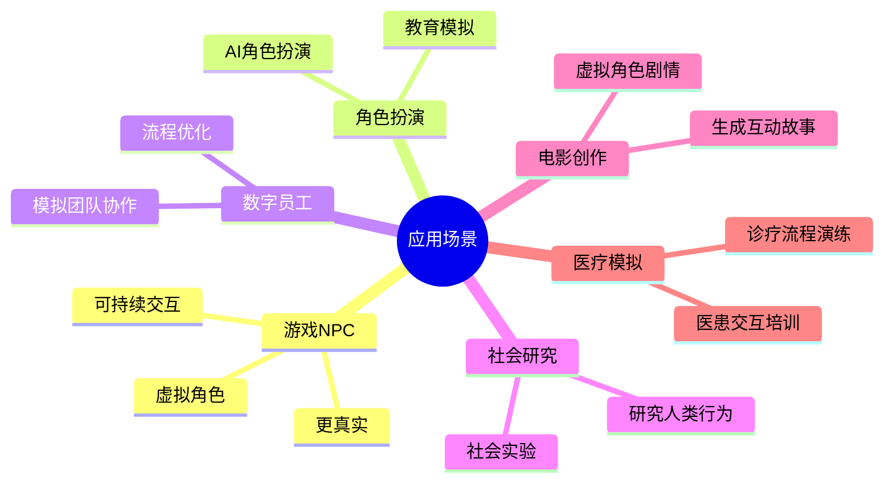

### 7.2 未来发展方向

```mermaid
roadmap
    2025 : 规模化
         : 从25个扩展到1000+
    2026 : 多模态
         : 加入视觉语音感知
    2027 : 多Agent协作
         : 更复杂群体行为
    2028 : 效率优化
         : 降低API成本
    2029 : 长期学习
         : 跨会话持续成长
    2030 : 安全对齐
         : 符合人类价值观
```

### 7.3 相关开源项目推荐

| 项目 | GitHub | 特点 |
|------|--------|------|
| **Generative Agents** | joonparkserver/generative-agents | 斯坦福原版 |
| **AgentVerse** | VWersum/agentverse | 多智能体协作框架 |
| **ChatDev** | OpenBMB/ChatDev | 软件开发自动化 |
| **MetaGPT** | datawhalechina/MetaGPT | 软件开发多角色协作 |
| **Coweb** | PAshes187/coweb | 类似斯坦福小镇的Web版本 |

## 八、总结

斯坦福小镇（Generative Agents）是LLM Agent领域的里程碑式工作。它证明了**基于大语言模型的智能体能够产生 believable（可信）的人类行为**，包括社交、协作、创意活动等。

**核心启示**：

1. **记忆是关键** — 层次化记忆机制是实现持续、一致行为的基础
2. **反思出智慧** — 高层次的反思让智能体不只是记录事件，而是理解事件
3. **涌现出惊喜** — 复杂社会行为不需要预设，从个体交互中自然产生

虽然项目在API成本、实时性等方面存在局限，但它为AI Agent研究开辟了新方向，对游戏NPC、数字员工、社会模拟等领域具有重要启发意义。

## 参考资料

1. Park, J. S., et al. (2023). Generative Agents: Interactive Simulacra of Human Behavior. *arXiv:2304.03442*
2. [斯坦福HAI研究院](https://hai.stanford.edu/)
3. [原论文PDF](https://arxiv.org/pdf/2304.03442)
4. GitHub: joonparkserver/generative-agents

---

*本文会持续更新，欢迎交流讨论*
