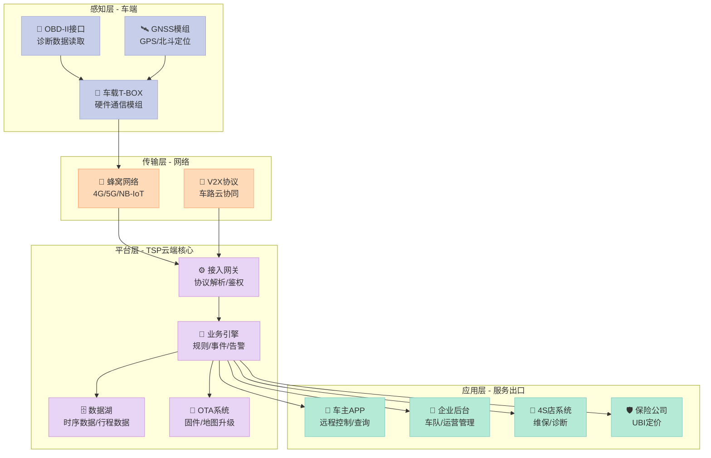
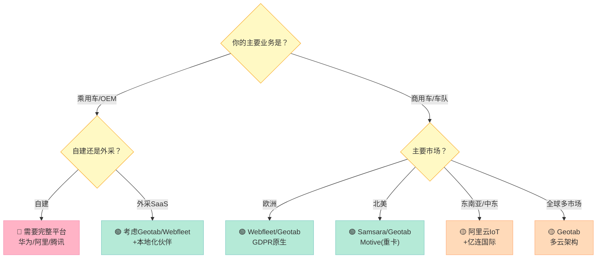
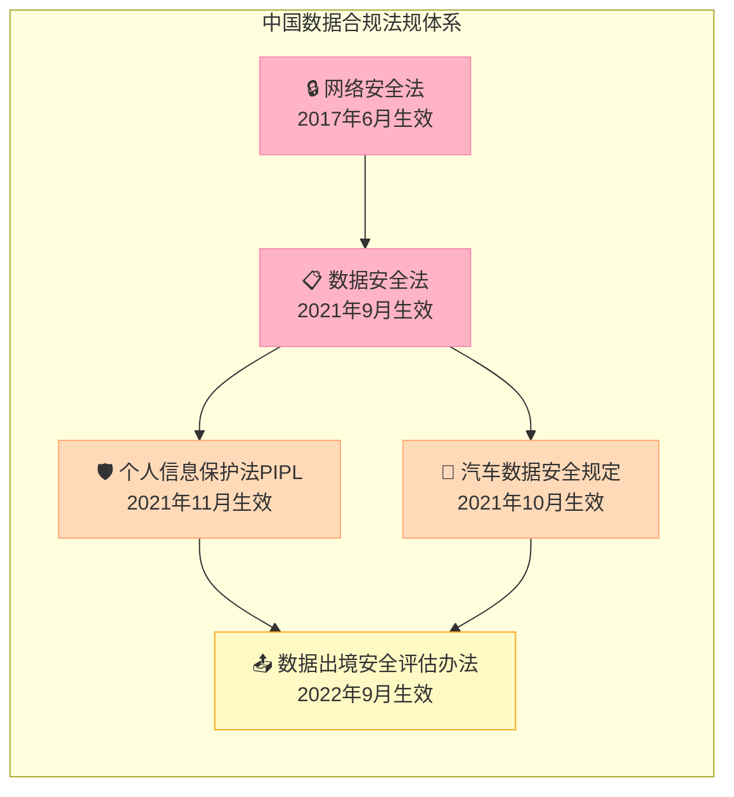
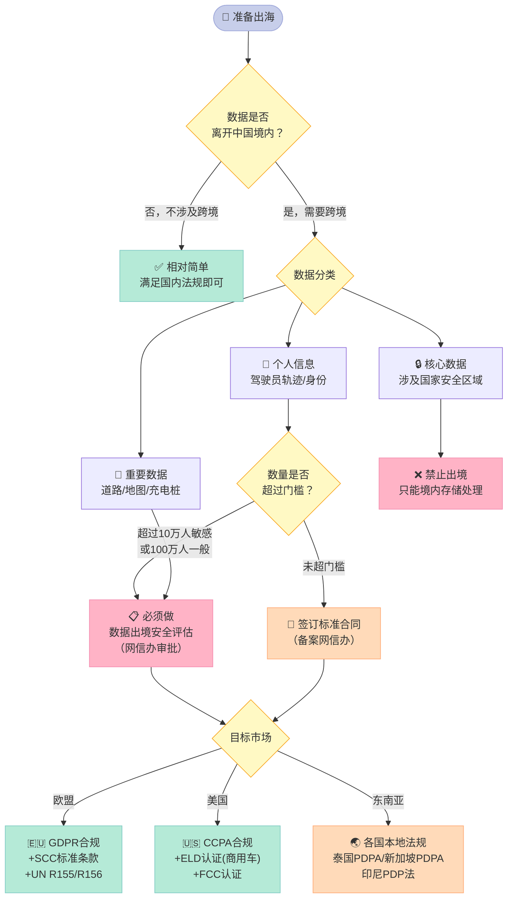
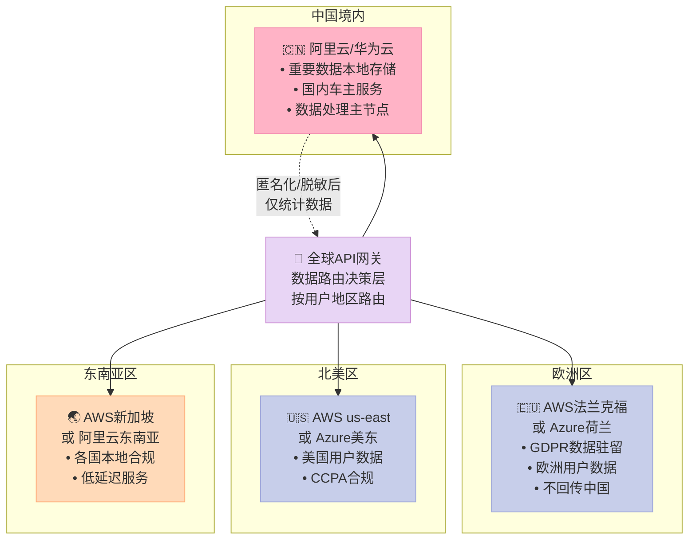
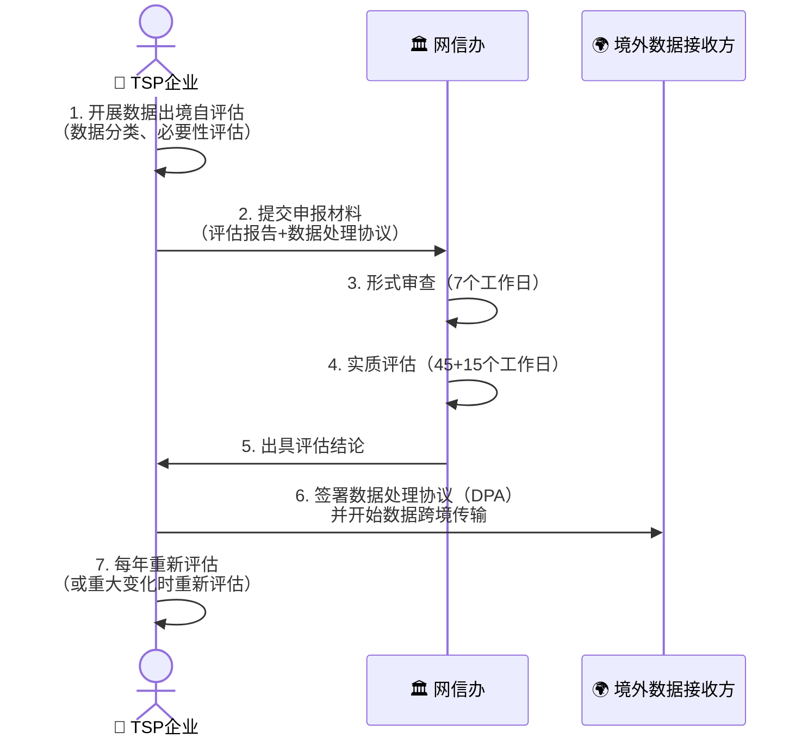
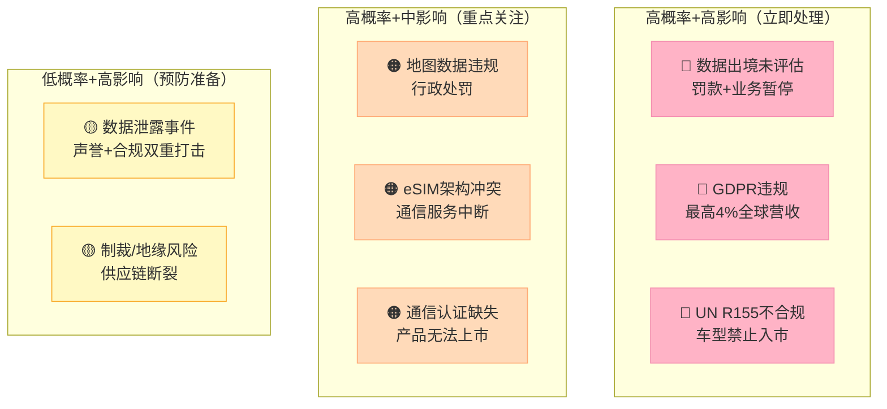

> **核心结论：** TSP是汽车与互联网世界的"连接器"，而出海合规是这个连接器上最容易断路的地方。搞清楚数据分类、本地化存储、GDPR与WP.29，是中国车企和TSP服务商出海的生死线。

---

## 摘要（TL;DR）

| 维度 | 结论 |
|------|------|
| TSP是什么 | 车联网服务提供商，负责车-云-APP之间的全链路数据服务 |
| 核心价值 | 远程诊断、车辆追踪、OTA升级、紧急救援、UBI保险 |
| 出海最大风险 | 数据跨境传输合规（GDPR + 中国PIPL双向约束） |
| 供应商格局 | 国际：Geotab/Samsara领跑；国内：华为/阿里/移远 |
| 云选型建议 | 多云+本地化节点，欧盟用AWS/Azure欧洲区，国内用阿里云/华为云 |
| 最紧迫行动 | 在产品设计阶段就做数据分类分级，而不是上线后补救 |

---

## 一、什么是TSP？从零开始理解

### 1.1 一个比喻

你的手机离开了运营商网络，就只是一块玻璃。汽车也是一样——**没有TSP，再智能的车也只是一台封闭的机器**。

**TSP（Telematics Service Provider，车载远程信息服务提供商）**，就是给汽车装上"手机信号"和"云大脑"的那个平台。它把车辆、驾驶员、道路、维保、保险、地图等所有信息，通过通信网络连接起来，形成完整的服务闭环。

你每次打开汽车App远程开空调、查看油量、定位车辆，背后都有TSP在支撑。

### 1.2 TSP的系统架构

TSP不是一个独立产品，而是由多层组件构成的完整生态：

### 1.3 TSP的核心功能矩阵

| 功能类别 | 具体能力 | 典型场景 |
|---------|---------|---------|
| **定位追踪** | GPS/北斗实时定位、历史轨迹回放、地理围栏告警 | 车辆被盗追回、车队调度 |
| **远程诊断** | OBD故障码读取、电池健康度、轮胎气压 | 主动推送维保提醒 |
| **远程控制** | 远程开/锁门、启动空调、开/关车窗 | 送货员无钥匙进入 |
| **紧急救援** | eCall自动碰撞报警、bCall一键呼叫 | 事故自动通知120 |
| **OTA升级** | 固件升级、地图更新、参数调整 | 召回无需到店 |
| **数据分析** | 驾驶行为评分、能耗分析、路线优化 | UBI保险定价 |
| **车队管理** | 多车调度、司机绩效、油耗管控 | 物流公司降本 |
| **内容服务** | POI推送、天气、交通路况 | 车载信息娱乐 |

---

## 二、TSP产业链全景

TSP不是单打独斗，而是与上下游紧密捆绑的生态：

```mermaid
flowchart LR
    subgraph UP ["上游"]
        U1["🏭 芯片厂商<br/>高通/联发科/紫光"]
        U2["📡 通信模组<br/>移远/广和通/日海"]
        U3["🛰️ 运营商<br/>中移/电信/联通"]
    end

    subgraph MID ["中游 - TSP平台"]
        M1["🏗️ 平台软件<br/>华为/阿里/腾讯"]
        M2["🌐 SaaS TSP<br/>Geotab/Samsara"]
        M3["🚗 OEM自建<br/>比亚迪/蔚来/特斯拉"]
    end

    subgraph DOWN ["下游"]
        D1["🚘 主机厂<br/>整车集成"]
        D2["🏢 车队企业<br/>物流/出行"]
        D3["🛡️ 保险公司<br/>UBI定价"]
        D4["🔧 售后网络<br/>4S/维修站"]
    end

    UP --> MID
    MID --> DOWN

    style U1 fill:#C7CEEA,stroke:#9FA8DA,color:#333
    style U2 fill:#C7CEEA,stroke:#9FA8DA,color:#333
    style U3 fill:#C7CEEA,stroke:#9FA8DA,color:#333
    style M1 fill:#FFB3C6,stroke:#F48FB1,color:#333
    style M2 fill:#FFB3C6,stroke:#F48FB1,color:#333
    style M3 fill:#FFB3C6,stroke:#F48FB1,color:#333
    style D1 fill:#B5EAD7,stroke:#80CBC4,color:#333
    style D2 fill:#B5EAD7,stroke:#80CBC4,color:#333
    style D3 fill:#B5EAD7,stroke:#80CBC4,color:#333
    style D4 fill:#B5EAD7,stroke:#80CBC4,color:#333
```

**关键洞察：** 通信模组是TSP能力的基础硬件门槛。中国的移远通信（Quectel）全球市场份额超过30%，是名副其实的隐形冠军——但出海时，其模组的网络认证（FCC/CE/PTCRB）是必须翻越的第一道墙。

---

## 三、全球主要TSP供应商深度对比

### 3.1 国际头部供应商

根据ABI Research 2024/2025年商用车联网竞争力排名：

| 供应商 | 总部 | 连接车辆数 | 核心优势 | 弱点 |
|-------|------|----------|---------|------|
| **Geotab** | 加拿大 | 460万+ | 开放平台、430+生态伙伴、数据分析深度 | 车主端弱，主攻车队 |
| **Samsara** | 美国 | 上市公司，高增速 | Connected Operations Cloud，AI事件感知 | 欧洲合规需加强 |
| **Webfleet**（Bridgestone旗下） | 荷兰 | 欧洲第一 | 深耕欧洲，GDPR原生合规 | 北美较弱 |
| **PowerFleet** | 美国 | 工业IoT+车联网 | 细分市场强（叉车/航空地面设备） | 乘用车弱 |
| **Verizon Connect** | 美国 | 运营商背景 | 网络资源强，企业销售能力强 | 平台灵活性一般 |
| **Motive**（原KeepTruckin） | 美国 | 重卡专家 | ELD合规原生，重卡场景深度 | 仅北美强 |
| **Mix Telematics** | 南非 | 非洲/新兴市场 | 低带宽适配，新兴市场经验 | 技术深度有限 |

### 3.2 中国主要TSP服务商

| 供应商 | 定位 | 核心能力 | 出海能力 |
|-------|------|---------|---------|
| **华为车联网** | 智能汽车全栈 | MDC计算平台、HiCar、鸿蒙车机 | ⚠️ 受制裁影响，欧美受限 |
| **阿里云IoT/斑马网络** | 互联网TSP | 大数据分析、AliOS | ✅ 中东/东南亚布局 |
| **腾讯车联/TAI** | 内容+场景 | 微信车载、地图、音乐 | ⚠️ 主要面向国内 |
| **移远通信（Quectel）** | 通信模组 | 全球认证，30%+市场份额 | ✅ 全球最强模组供应商 |
| **广和通（Fibocom）** | 通信模组 | 5G/RedCap模组 | ✅ 欧美市场认证完善 |
| **亿连（Ecarlink）** | TSP SaaS | 车队管理、数字化 | ✅ 东南亚/中东落地案例 |
| **四维图新** | 地图+TSP | 高精地图、LBS服务 | ✅ 海外地图合规授权 |

### 3.3 选型决策矩阵

---

## 四、中国出海合规：最难啃的骨头

出海合规是TSP出海的"双向紧箍咒"——**既受中国法规约束，又要满足目标市场要求**。

### 4.1 中国侧法规体系（出境约束）

**《汽车数据安全管理若干规定（试行）》**是TSP出海最直接的约束，关键条款：

| 数据类型 | 定义 | 出境要求 |
|---------|------|---------|
| **个人信息** | 驾驶员/乘客身份、行程数据 | 需PIPL合规路径（安全评估/标准合同/认证） |
| **重要数据** | 道路环境、高精地图、充电桩位置 | 原则上**境内存储**，出境需安全评估 |
| **核心数据** | 国家安全相关（军事区、政府建筑摄像） | **禁止出境** |

**数据出境安全评估触发门槛（2022年《数据出境安全评估办法》）：**
- 累计向境外提供 **超过100万人** 的个人信息
- 累计向境外提供 **超过10万人** 的敏感个人信息
- 向境外提供 **重要数据**
- 关键信息基础设施运营者的任何数据出境

> ⚠️ **关键风险点：** 车辆行驶轨迹数据在中国被认定为"个人信息"，大规模车队运营商极易触碰10万人门槛，必须提前做出境评估。

### 4.2 目标市场法规（入境约束）

#### 欧盟GDPR（通用数据保护条例）

GDPR是全球最严格的数据保护法，TSP业务的核心影响：

| GDPR要求 | 对TSP的具体影响 | 违规代价 |
|---------|--------------|---------|
| **合法性基础** | 位置追踪必须有明确同意或合同必要性 | 最高全球营收4%或2000万欧元 |
| **数据最小化** | 不能采集"以防万一"的数据，必须有明确目的 | 整改+罚款 |
| **删除权** | 用户可要求删除所有历史行程数据 | 必须在30天内响应 |
| **数据泄露通报** | 72小时内上报监管机构 | 延迟通报额外罚款 |
| **跨境传输** | 向中国传数据需标准合同条款（SCC）或充分性决定 | 数据传输被叫停 |
| **DPIA评估** | 大规模位置追踪必须做数据保护影响评估 | 未做评估视为违规 |

**2024年最新执法动态：**
- Meta因Cookie合规被爱尔兰DPC罚款12.5亿欧元（2023年最大单笔）
- 汽车行业：Stellantis旗下品牌因用户数据处理不透明被法国CNIL警告
- 位置数据经纪商被多个欧盟国家重点调查

#### 美国法规体系

美国没有联邦统一数据法，但各州法规越来越严：

| 法规 | 适用范围 | TSP核心影响 |
|-----|---------|-----------|
| **CCPA/CPRA**（加州） | 在加州运营 | 用户有权拒绝出售个人数据，含车辆数据 |
| **ELD强制要求** | 商用重卡（联邦） | 电子记录装置必须FMCSA认证 |
| **FTC数据安全指引** | 全国 | 数据泄露须通报 |
| **各州隐私法** | 弗吉尼亚/科罗拉多/康涅狄格等 | 类GDPR要求逐步扩展 |

#### 联合国WP.29车辆网络安全法规

这是专门针对智能网联汽车的安全强制标准，欧盟/日本/韩国/英国已强制执行：

| 法规 | 名称 | 核心要求 |
|-----|------|---------|
| **UN R155** | 网络安全管理系统（CSMS） | 整车全生命周期网络安全管理，含威胁分析、事件响应 |
| **UN R156** | 软件升级管理系统（SUMS） | OTA升级需有完整版本追溯、用户知情机制 |

**TSP出海欧盟必须满足UN R155要求：**
- 建立CSMS（网络安全管理系统），覆盖设计、开发、生产、运营全周期
- 完成TARA（威胁分析与风险评估）
- 建立漏洞监测和事件响应机制
- OTA升级前必须完成安全测试并记录

### 4.3 合规路径选择

---

## 五、云平台选型：地缘即命运

### 5.1 为什么云选型对TSP至关重要

TSP的数据合规，有一半取决于**数据物理存放在哪里**。云平台的节点位置直接决定了：
- 哪个国家的法律管辖
- 数据是否触发跨境传输评估
- 能否满足数据本地化要求

### 5.2 主流云平台出海适配性对比

| 云平台 | 欧盟合规 | 美国合规 | 东南亚 | 中国互联 | 汽车行业生态 |
|-------|:-------:|:-------:|:------:|:--------:|:----------:|
| **AWS** | ✅ EU节点+GDPR认证 | ✅ GovCloud | ✅ 新加坡/雅加达 | ⚠️ 与国内隔离 | ✅ Connected Mobility |
| **Azure** | ✅ 荷兰/爱尔兰节点 | ✅ 全美覆盖 | ✅ 新加坡/马来西亚 | ⚠️ 需世纪互联 | ✅ Azure for Automotive |
| **GCP** | ✅ 法兰克福等 | ✅ 多区域 | ✅ 有节点 | ⚠️ 国内访问慢 | ⚠️ 汽车生态弱 |
| **阿里云** | ⚠️ 德国/英国节点（较少） | ⚠️ 硅谷节点 | ✅ 中东/东南亚强 | ✅ 国内最强 | ✅ 汽车云产品线完善 |
| **华为云** | ⚠️ 有欧洲节点 | ❌ 受制裁限制 | ✅ 东南亚布局 | ✅ 国内强 | ✅ 车联网方案成熟 |
| **腾讯云** | ⚠️ 有法兰克福节点 | ⚠️ 硅谷节点 | ✅ 东南亚较强 | ✅ 国内强 | ✅ 车联网有布局 |

### 5.3 推荐架构：多云+本地化策略

**核心原则：**
1. **数据就近存储**：欧洲用户数据留在欧洲，绝不回传中国
2. **数据分类路由**：全球API网关根据用户归属地动态路由
3. **匿名化联通**：跨区域只传输匿名化统计数据，不传原始个人信息
4. **独立账号体系**：各区域云账号独立，避免数据"意外流动"

### 5.4 云选型速查表

| 出海目标市场 | 推荐云方案 | 关键理由 |
|-----------|---------|---------|
| **仅欧盟** | AWS Frankfurt + Azure Netherlands | GDPR合规成熟，审计报告完整 |
| **仅北美** | AWS us-east-1/us-west-2 | 市场覆盖广，GovCloud可满足政府要求 |
| **仅中东** | 阿里云中东（迪拜/利雅得） | 本地化节点+阿拉伯语支持 |
| **仅东南亚** | AWS新加坡 + 阿里云东南亚 | 本地合规+低延迟双保险 |
| **全球多市场** | AWS主干 + 阿里云国内 | 全球节点最多，合规文档最完整 |
| **国内为主出海为辅** | 阿里云国内 + 按需开海外节点 | 迁移成本低，国内服务完善 |

---

## 六、出海注意事项：越细越好

### 6.1 第一关：产品设计阶段（最重要，最被忽略）

> **黄金法则：** 数据合规成本在设计阶段是1，在开发阶段是10，在上线后是100。

**必须在设计阶段完成的工作：**

- [ ] **数据地图（Data Map）**：梳理所有数据从哪里采集、流向哪里、存在哪里、保留多久
- [ ] **数据分类分级**：按中国汽车数据安全规定区分个人信息/重要数据/核心数据
- [ ] **隐私设计（Privacy by Design）**：从架构层面隔离各国数据，而非事后打补丁
- [ ] **最小化原则**：只采集业务必需的数据，"以防万一"的采集是合规地雷
- [ ] **目的限制**：明确每种数据的使用目的，不能用A目的采集的数据做B用途

### 6.2 第二关：数据分类与出境评估

**中国数据出境安全评估流程（2022年《数据出境安全评估办法》）：**

**评估耗时提示：** 全流程最长可达67个工作日（约3个月），出海时间表必须提前规划。

### 6.3 第三关：GDPR深度合规检查清单

**用户同意管理（Consent Management）：**
- ⬜ 用户在首次使用时，能够单独选择同意哪类数据采集
- ⬜ 拒绝同意不影响核心服务使用（不能强制同意）
- ⬜ 用户可以随时撤回同意，系统需在30天内响应
- ⬜ 同意记录需要可审计存储（谁同意了什么，何时同意的）

**数据主体权利实现：**
- ⬜ 访问权：用户可以下载自己的所有数据（30天内响应）
- ⬜ 删除权：用户可以申请删除账号及所有相关数据
- ⬜ 更正权：用户可以修改错误的个人信息
- ⬜ 携带权：数据需能以机器可读格式（JSON/CSV）导出
- ⬜ 反对权：用户可以反对基于合法利益的数据处理

**数据保护措施：**
- ⬜ 传输加密：TLS 1.2+，禁用弱密码套件
- ⬜ 存储加密：AES-256以上
- ⬜ 访问控制：最小权限，内部员工访问数据需审批+日志
- ⬜ 匿名化/假名化：分析用途的数据必须匿名化处理
- ⬜ DPIA（数据保护影响评估）：大规模位置追踪前必须完成

**组织措施：**
- ⬜ 指定DPO（数据保护官），或在欧盟当地指定代理人
- ⬜ 与所有数据处理者签订DPA（数据处理协议）
- ⬜ 数据泄露响应流程：72小时内向监管机构报告的内部流程
- ⬜ 定期员工GDPR培训记录

### 6.4 第四关：UN R155/R156网络安全合规

欧盟、日本、韩国销售的新车已强制要求，**TSP平台必须满足：**

**UN R155（网络安全）要求TSP：**
1. **威胁分析（TARA）**：对TSP平台的每个接口、通信链路进行威胁建模
2. **安全监控**：建立SOC（安全运营中心）或接入MSSP，7×24小时监控异常
3. **漏洞管理**：建立CVE响应流程，关键漏洞修复不超过30天
4. **事件响应**：建立汽车网络安全事件分类、上报、处置的标准流程
5. **供应链安全**：对TSP平台的所有第三方组件（SDK、开源库）进行安全评估

**UN R156（OTA软件升级）要求TSP：**
1. **版本完整性**：固件升级包必须有数字签名，车端验签
2. **回滚能力**：升级失败时车辆必须能回退到上一个稳定版本
3. **用户知情**：升级前必须通知用户，告知升级内容和影响
4. **审计日志**：记录每次升级的版本、时间、车辆VIN
5. **加密传输**：OTA传输通道必须端到端加密

### 6.5 第五关：通信认证与eSIM合规

进入不同市场，硬件/通信模组需要取得当地认证：

| 目标市场 | 必需认证 | 认证机构 | 典型周期 |
|---------|---------|---------|---------|
| **美国** | FCC认证 | 联邦通信委员会 | 6-8周 |
| **欧盟** | CE认证（含RED指令） | 欧盟公告机构 | 8-12周 |
| **日本** | TELEC认证 | 日本电波法 | 8-12周 |
| **中国（进口）** | SRRC/CCC认证 | 国家无线电管理局 | 12-16周 |
| **中东（沙特）** | CITC认证 | 沙特通信局 | 6-10周 |

**eSIM特别注意事项：**
- 中国要求eSIM的SM-DP+服务器（码号管理平台）必须在境内，并由国内运营商管理
- 欧盟eSIM遵循GSMA SGP.02/SGP.22标准，允许用户自由选择运营商
- 两套标准存在根本性架构冲突，国内出海车型需要**双SIM架构**（国内eSIM + 国际物理SIM或国际eSIM）

### 6.6 第六关：地图数据特殊管制

这是中国车企出海最容易踩雷的地方：

| 问题 | 中国规定 | 境外规定 |
|-----|---------|---------|
| **高精地图采集** | 必须取得测绘资质，外资不得采集中国境内地图 | 各国有自己的测绘限制 |
| **地图数据出境** | 地图数据属于重要数据，原则上不得出境 | 无特别限制 |
| **坐标系** | 中国使用GCJ-02（火星坐标），境外用WGS-84 | 坐标系不同会导致定位偏移 |
| **POI数据** | 政府、军事、敏感设施POI不得出境 | 无限制 |

**实操建议：** 出海地图服务必须使用**高德/百度境外版**（有出海授权）或**谷歌地图/HERE Maps/TomTom地图**，不要直接把国内地图数据打包出境。

### 6.7 第七关：数据本地化落地执行

不同市场对数据本地化的要求：

| 市场 | 数据本地化要求 | 违规后果 |
|-----|-------------|---------|
| **中国** | 重要数据必须境内存储，个人信息出境需评估 | 最高5000万元罚款或5%营收 |
| **俄罗斯** | 俄罗斯公民数据必须在俄境内存储 | 封锁访问 |
| **印度尼西亚** | 电子系统运营者需在境内有数据副本 | 暂停运营 |
| **沙特阿拉伯** | 金融/政府数据必须本地，其他建议本地 | 监管审查 |
| **欧盟** | 无强制本地化，但禁止传输到非充分性国家 | GDPR罚款 |
| **美国** | 无联邦层面强制，部分行业（医疗/金融）有要求 | 行业监管 |

### 6.8 第八关：驾驶员数据的特殊保护

商用车场景下，驾驶员数据的保护在欧盟尤其严格：

- **欧盟《职业司机监控指引》**：对驾驶员行为评分（急刹车、超速）数据的使用有限制，不得单纯用于惩罚性管理
- **工会协议**：德国/法国等国家，车队企业需与工会协商数据使用方式
- **持续监控**：欧盟GDPR认为持续定位追踪驾驶员属于高风险处理，需做DPIA
- **数据保留期**：行程数据保留期一般不超过3个月（特定目的可延长）

---

## 七、风险评估矩阵

---

## 八、结论与行动建议

### 8.1 不同角色的建议

**如果你是中国车企（OEM）：**
1. **立刻做数据地图**：搞清楚你的车辆在全球每个市场采集了什么、传到了哪里
2. **建立多云隔离架构**：欧洲数据绝对不能回传中国，这是GDPR红线
3. **获取UN R155认证**：准备进欧盟/日韩市场，这是入场券不是加分项
4. **提前启动数据出境安全评估**：流程长达3个月，不要等到发布前才想起

**如果你是TSP服务商/平台商：**
1. **产品本身要支持多租户数据隔离**：让你的客户（OEM）能够满足各地合规
2. **考虑Geotab/Webfleet的合作模式**：在不熟悉的市场，与当地合规TSP合作比自建快得多
3. **建立标准化GDPR工具包**：同意管理、数据主体请求处理、DPIA模板
4. **选对云区域**：客户数据存在哪里，你的服务节点就在哪里

**如果你是车联网创业公司：**
1. **东南亚是最友好的第一站**：合规要求相对温和，中国公司有先发优势
2. **先做车队管理（B2B）**：合规路径比C端简单，现金流也更稳定
3. **模组选移远或广和通**：全球认证最完整，省去大量认证周期

### 8.2 出海合规时间线规划

| 时间节点 | 关键动作 |
|---------|---------|
| **T-18个月** | 确定目标市场，启动数据分类分级，设计多云架构 |
| **T-12个月** | 启动通信模组认证（FCC/CE），完成TARA威胁分析 |
| **T-9个月** | 提交中国数据出境安全评估申请，启动GDPR合规建设 |
| **T-6个月** | 完成DPIA，建立同意管理平台，DPO到位 |
| **T-3个月** | 完成安全渗透测试，UN R155审计，预发布合规复查 |
| **T-0** | 上市，同时建立漏洞响应和数据泄露应急流程 |

> **最后一句话：** TSP出海不是"先上车再说"的游戏。一次GDPR罚款可以抹去数年利润，一次数据出境违规可以直接关门。合规投入是出海的保险，而不是成本。

---

*数据截止：2026年4月。主要法规以官方文本为准，本文不构成正式法律建议。*

---

## 对比分析

本文是车联网 TSP（Telematics Service Provider）出海合规总览。下面选取两个也是"车辆数据 + 远程服务"赛道的真实参考做对比：高新兴（中文 TSP 厂商代表）和 Geotab（北美车队管理代表）。

### 对比维度一：业务范围
| 维度 | 本文 TSP 通论 | 高新兴（Gaoxin） | Geotab |
| --- | --- | --- | --- |
| 业务核心 | T-Box 后端平台 + 远程服务 | T-Box / OBU / 平台一体化 | 车队管理 SaaS + 设备 |
| 主要客户 | OEM、运营商 | 国内 OEM | 北美/欧洲车队 |
| 海外能力 | 取决于自建/合作 | 跟随 OEM 出海 | 自有全球销售网络 |

### 对比维度二：合规与数据
| 维度 | 本文 TSP 通论 | 高新兴 | Geotab |
| --- | --- | --- | --- |
| 国别法规覆盖 | 欧盟/中国/北美并列 | 强在国内 | 强在欧美 |
| 数据本地化 | 必须规划 | 国内合规 | 区域化部署 |
| 安全认证 | ISO/UN R155 等 | 通过 TÜV 等认证 | SOC 2 / ISO 27001 等 |

### 优缺点
- **本文 TSP 通论**：用一张总览图讲清楚选型与合规要点；具体落地仍需结合厂商。
- **高新兴**：国内 OEM 出海常见合作伙伴；海外本地化能力需逐区域搭建。
- **Geotab**：海外车队管理的事实标准之一；不适合直接对接国内 OEM T-Box。

### 何时选哪个
- 自研/新建 TSP 平台，先看方法论 → 看本文
- 国内 OEM 配套 + 出海 → 选高新兴
- 海外车队管理 SaaS → 选 Geotab

### 参考资料
- 高新兴官网：https://www.gosuncn.com/
- Geotab 官网：https://www.geotab.com/
- UNECE WP.29 R155 / R156 法规文本
