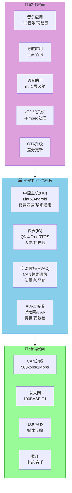
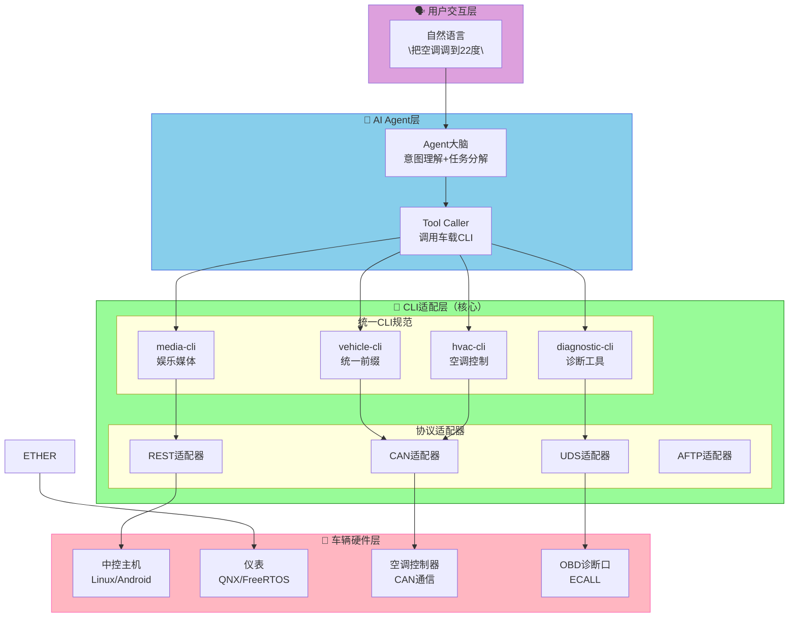
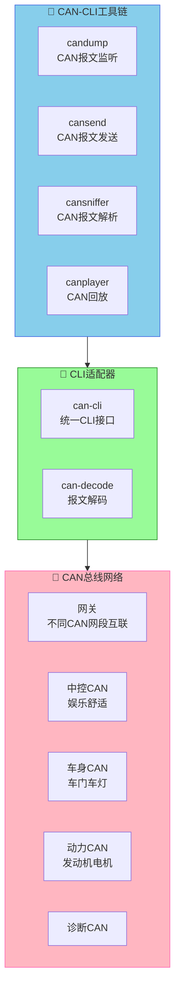
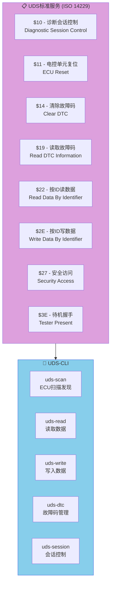
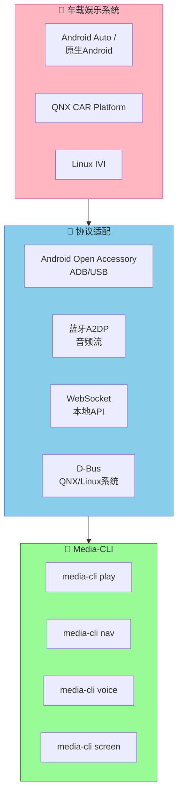
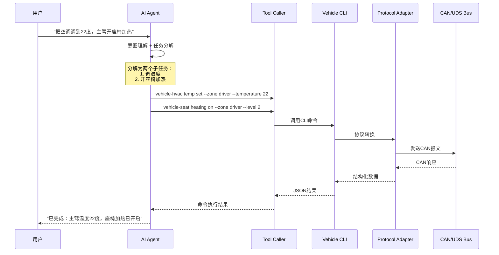
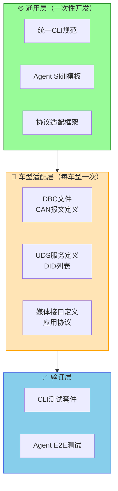
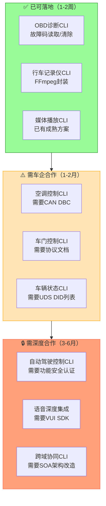
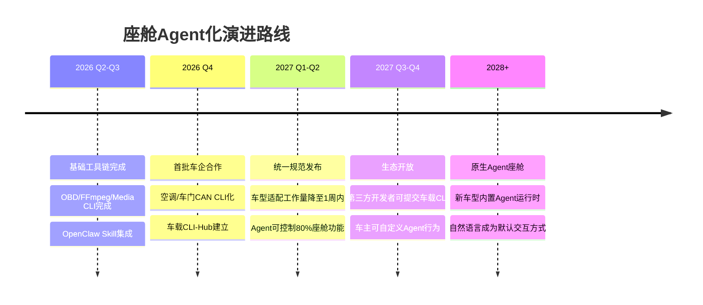
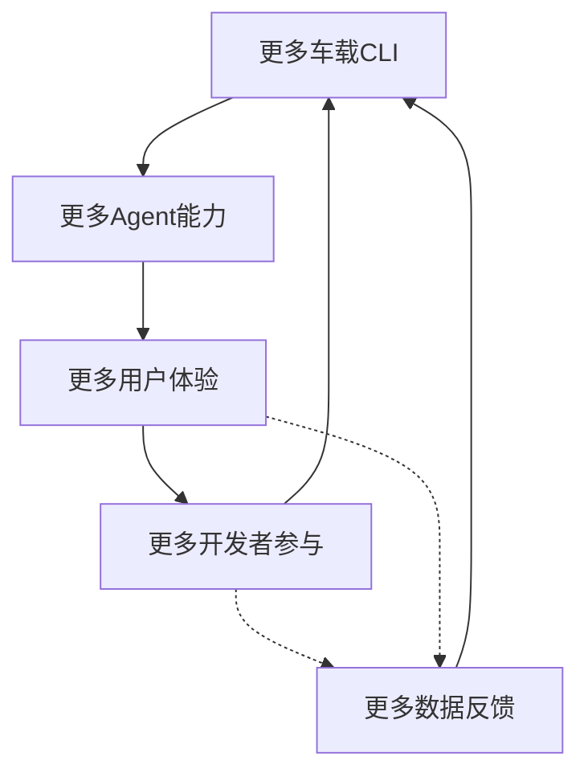

# 汽车座舱应用CLI化实战：从CAN总线到AI Agent的完整工具链设计

## 前言

在上一篇文章中，我们探讨了CLI-Anything的本质——**重新定义软件与Agent之间的"中间协议"**。本文将把这个思想落地到汽车座舱领域，回答一个更具体的问题：

> **如何将传统汽车座舱内的各种应用CLI化，让AI Agent能够像人类一样控制车辆，同时最大限度地减少适配工作量？**

这是一个工程问题。本文将系统性地分析：
- 座舱内有哪些应用可以被CLI化
- 如何设计一套统一的CLI规范，让不同车型、不同供应商的软件都能适配
- 如何基于这套CLI构建Agent工具链，最终实现"自然语言控制一切"的座舱体验

## 一、座舱软件现状：碎片化是核心痛点

### 1.1 座舱软件生态的复杂性

一辆现代智能汽车的座舱软件涉及十几个供应商：



### 1.2 当前座舱的Agent能力对比

| 功能 | 人类操作方式 | Agent当前能力 | 差距 |
|------|------------|--------------|------|
| 播放音乐 | 触摸屏幕选择 | ⚠️ 需要厂商开放API | 大 |
| 调节空调 | 触摸或语音 | ❌ 基本不可能 | 巨大 |
| 查看车辆状态 | 仪表盘 | ❌ 无接口 | 巨大 |
| 行车记录 | 触摸开始/停止 | ⚠️ 需要应用层SDK | 中 |
| 导航设置 | 触摸输入地址 | ⚠️ 需要地图API | 中 |
| 车门控制 | 实体按键/APP | ❌ 封闭协议 | 巨大 |

**核心问题**：座舱软件的接口是为**人类操作**设计的，不是为**Agent调用**设计的。

## 二、座舱CLI化三层架构

### 2.1 整体架构设计



### 2.2 统一CLI命名规范

为了实现"一次开发，处处运行"，座舱CLI必须遵循统一命名规范：

```bash
# 统一前缀：vehicle-<功能模块>
# 命名规则：vehicle-<模块>-<动作>

# 车辆控制
vehicle-door status          # 车门状态
vehicle-door lock            # 车门锁止
vehicle-door unlock          # 车门解锁
vehicle-window open          # 车窗开启
vehicle-window close         # 车窗关闭
vehicle-trunk open           # 尾门开启

# 空调控制
vehicle-hvac status          # 空调状态
vehicle-hvac temp set        # 温度设定
vehicle-hvac fan speed       # 风速设定
vehicle-hvac mode            # 模式设定（制冷/制热/自动）
vehicle-hvac defrost         # 除霜模式

# 媒体控制
vehicle-media play           # 播放
vehicle-media pause          # 暂停
vehicle-media next           # 下一曲
vehicle-media prev           # 上一曲
vehicle-media volume set     # 音量设定
vehicle-media source         # 切换音源

# 导航控制
vehicle-nav destination set   # 设置目的地
vehicle-nav route start      # 开始导航
vehicle-nav route cancel     # 取消导航
vehicle-nav poi search       # 搜索POI

# 车辆状态
vehicle-status battery       # 电池状态
vehicle-status fuel         # 燃油/续航
vehicle-status tire-pressure # 胎压
vehicle-status odometer     # 里程
vehicle-status speed        # 当前速度

# 诊断
vehicle-diag dtc list       # 故障码列表
vehicle-diag dtc clear      # 清除故障码
vehicle-diag freeze-frame   # 冻结帧数据
vehicle-diag live-data      # 实时数据流
```

### 2.3 标准化输出格式

所有CLI命令必须返回统一格式的JSON，确保Agent能解析：

```json
{
  "status": "success|error|partial",
  "timestamp": "2026-04-15T21:32:00+08:00",
  "command": "vehicle-hvac temp set",
  "params": {
    "zone": "driver",
    "target_temp": 22
  },
  "result": {
    "current_temp": 24,
    "target_temp": 22,
    "mode": "cooling",
    "fan_speed": 3
  },
  "error": null
}
```

```json
{
  "status": "error",
  "command": "vehicle-door lock",
  "error": {
    "code": "DOOR_NOT_CLOSED",
    "message": "左后门未关闭，无法锁止",
    "action": "请先关闭左后门"
  }
}
```

## 三、核心技术实现

### 3.1 CAN总线CLI适配器

CAN是汽车内部最核心的通信总线，绝大多数车辆控制都通过CAN进行：



```bash
# CAN-CLI使用示例
can-cli send --interface can0 --id 0x100 --data "01 02 03 04" --timeout 1000
can-cli dump --interface can0 --filter "id:0x200-0x2FF" --count 100
can-cli decode --pgn 0x0F004 --data "..."
can-cli replay --file recording.can --speed 1.0
```

**关键实现**：CAN-CLI适配器需要维护一个DBC文件数据库，将CAN报文ID和数据场映射到有意义的命令：

```python
# can_cli/adapter.py 核心逻辑
class CANAdapter:
    def __init__(self, dbc_path, interface='can0'):
        self.dbc = DBCLoader(dbc_path).load()
        self.interface = interface
        self.socket = can.interface.Bus(channel=interface, bustype='socketcan')
    
    def execute(self, command: str, params: dict) -> dict:
        """
        将统一CLI命令转换为CAN报文并发送
        """
        # 1. 从DBC查找CAN ID和data template
        can_msg = self.dbc.find_message(command)
        
        # 2. 填充参数到data字段
        data = self._pack_data(can_msg, params)
        
        # 3. 发送CAN报文
        msg = can.Message(
            arbitration_id=can_msg.can_id,
            data=data,
            is_extended_id=can_msg.is_extended
        )
        self.socket.send(msg)
        
        # 4. 等待响应（可选）
        response = self._wait_response(can_msg.response_id, timeout=1000)
        
        return self._format_output(response)
    
    def _pack_data(self, can_msg, params):
        """将参数打包为CAN数据场"""
        data = bytearray(can_msg.data_template)
        for signal, value in params.items():
            start_bit = can_msg.get_signal(signal).start_bit
            length = can_msg.get_signal(signal).length
            data = self._set_bits(data, start_bit, length, value)
        return bytes(data)
```

### 3.2 UDS诊断CLI适配器

UDS（Unified Diagnostic Services）是汽车行业标准的诊断协议：



```bash
# UDS-CLI使用示例
uds-cli scan --interface can0 --speed 500000      # 扫描所有ECU
uds-cli read --sid 0x22 --did 0xF190             # 读取VIN码
uds-cli read --sid 0x22 --did 0x010C             # 读取发动机转速
uds-cli dtc list --status_mask 0xFF               # 列出所有故障码
uds-cli dtc clear                                 # 清除所有故障码
uds-cli session --type extended                   # 进入扩展会话
uds-cli write --sid 0x2E --did 0xF195 --data "..." # 写入数据
```

```python
# uds_cli/client.py UDS客户端实现
import isotp
from uds import Uds

class UDSClient:
    def __init__(self, can_interface, target_address=0x01):
        self.target = target_address
        self.bus = isotp.CanBus(
            interface='socketcan',
            channel=can_interface
        )
        self.iso_stack = isotp.Stack(
            txfn=self._send_can,
            rxfn=self._recv_can,
            addressing_mode=isotp AddressingMode.Normal_11bits,
            target_address=target_address
        )
    
    def execute(self, service_id, data_identifier=None, data=None):
        """执行UDS服务"""
        if service_id == 0x22:  # Read Data By Identifier
            return self._read_did(did)
        elif service_id == 0x2E:  # Write Data By Identifier
            return self._write_did(did, data)
        elif service_id == 0x19:  # Read DTC
            return self._read_dtc(data)
        # ... 其他服务
    
    def _format_output(self, raw_response) -> dict:
        """格式化UDS响应为统一JSON"""
        return {
            "status": "success" if self._is_positive_response(raw_response) else "error",
            "service": hex(raw_response.service_id),
            "data": self._parse_data(raw_response.data),
            "raw": raw_response.raw_bytes.hex()
        }
```

### 3.3 媒体娱乐CLI适配器

车载娱乐系统通常基于Android或Linux，应用层接口相对丰富：



```bash
# Media-CLI使用示例
media-cli play --source bluetooth --track "周杰伦-晴天"
media-cli nav destination --address "上海市浦东新区张江高科"
media-cli voice command --text "打电话给老婆"
media-cli screen mode --night true --brightness 50
```

```python
# media_cli/android_adapter.py
class AndroidMediaAdapter:
    """Android车机的ADB协议适配"""
    
    def __init__(self, adb_host='127.0.0.1', adb_port=5555):
        self.adb = ADBClient(host=adb_host, port=adb_port)
    
    def execute(self, cmd: str, params: dict) -> dict:
        if cmd == 'media-cli play':
            return self._play_media(params)
        elif cmd == 'media-cli nav':
            return self._set_navigation(params)
        elif cmd == 'media-cli voice':
            return self._send_voice_command(params)
    
    def _play_media(self, params):
        # 通过ADB shell发送Intent
        intent = f"android.intent.action.MUSIC_PLAYER"
        if params.get('track'):
            # 实际通过ContentProvider查询
            pass
        result = self.adb.shell(
            f"am broadcast -a {intent} --es 'track' '{params['track']}'"
        )
        return {"status": "success" if result.returncode == 0 else "error"}
```

### 3.4 一致的SKILL.md规范

每个CLI模块都必须附带SKILL.md，让Agent能理解其能力：

```markdown
# vehicle-hvac CLI - Agent Skill

## 功能描述
车载空调控制系统，支持温度、风速、模式、除霜等控制。

## 命令列表

### vehicle-hvac status
**功能**: 获取空调当前状态
**返回**:
```json
{
  "power": "on|off",
  "driver_temp": 24,
  "passenger_temp": 24,
  "rear_temp": 22,
  "fan_speed": 3,
  "mode": "cooling|heating|auto|defrost",
  "ac_enabled": true,
  "sync_enabled": false
}
```

### vehicle-hvac temp set
**功能**: 设置目标温度
**参数**:
- `zone`: driver|passenger|rear|all (默认: all)
- `temperature`: 16-30 (摄氏度)

**示例**: `vehicle-hvac temp set --zone driver --temperature 22`

**Agent调用**:
```
用户: "主驾温度调到22度"
Agent: vehicle-hvac temp set --zone driver --temperature 22
```

### vehicle-hvac fan speed
**功能**: 设置风速
**参数**:
- `level`: 0-7 (0=关闭)

**示例**: `vehicle-hvac fan speed --level 5`

### vehicle-hvac mode
**功能**: 设置空调模式
**参数**:
- `mode`: cooling|heating|auto|defrost|ventilate

**示例**: `vehicle-hvac mode --mode defrost`

## 错误处理

| 错误码 | 含义 | Agent应采取的行动 |
|--------|------|-----------------|
| HVAC_NOT_AVAILABLE | 空调不可用（如车辆未启动） | 告知用户车辆未启动 |
| ZONE_INVALID | 区域参数无效 | 询问具体哪个区域 |
| TEMP_OUT_OF_RANGE | 温度超出范围 | 提供有效范围16-30 |

## 安全约束

- 某些操作需要车辆处于P档
- 快速多次调用可能触发速率限制（1次/秒）
- 极端温度设置会被系统自动限制
```

## 四、Agent工具链集成

### 4.1 座舱Agent调用流程



### 4.2 MCP Server集成

Model Context Protocol (MCP) 是连接AI Agent与工具的标准协议：

```python
# vehicle_mcp_server.py
from mcp.server import MCPServer
from mcp.types import Tool, ToolInputSchema
from vehicle_cli import adapters

class VehicleMCPServer(MCPServer):
    def __init__(self):
        super().__init__(name="vehicle-mcp", version="1.0.0")
        
        # 注册所有vehicle-* CLI工具
        self.register_tool(self._hvac_tools())
        self.register_tool(self._media_tools())
        self.register_tool(self._door_tools())
        self.register_tool(self._diag_tools())
    
    def _hvac_tools(self) -> list[Tool]:
        return [
            Tool(
                name="vehicle_hvac_status",
                description="获取车载空调当前状态",
                input_schema=ToolInputSchema(
                    type="object",
                    properties={},
                    required=[]
                ),
                handler=self._hvac_status
            ),
            Tool(
                name="vehicle_hvac_temp_set",
                description="设置车载空调温度",
                input_schema=ToolInputSchema(
                    type="object",
                    properties={
                        "zone": {"type": "string", "enum": ["driver", "passenger", "rear", "all"]},
                        "temperature": {"type": "number", "minimum": 16, "maximum": 30}
                    },
                    required=["temperature"]
                ),
                handler=self._hvac_temp_set
            ),
            # ... 更多工具
        ]
    
    async def _hvac_temp_set(self, params):
        adapter = adapters.HVACAdapter()
        result = adapter.execute("temp_set", params)
        return {"content": [{"type": "text", "text": json.dumps(result)}]}
```

### 4.3 OpenClaw Skill集成

```markdown
# vehicle-control-skill/SKILL.md

# 车载控制Skill - OpenClaw Agent使用指南

## 技能简介
本Skill让Agent能够通过自然语言控制车辆的各种功能，包括空调、媒体、车门、车窗等。

## 前提条件
- 车辆需处于ACC或ON状态
- 部分操作需要在P档
- Agent需要有车辆的调用授权

## 能力清单

### 空调控制
| 自然语言指令 | 转换为CLI |
|-------------|---------|
| 把空调调到22度 | `vehicle-hvac temp set --temperature 22` |
| 开主驾座椅加热 | `vehicle-seat heating on --zone driver` |
| 开除霜模式 | `vehicle-hvac mode --mode defrost` |

### 媒体控制
| 自然语言指令 | 转换为CLI |
|-------------|---------|
| 播放音乐 | `vehicle-media play` |
| 切到蓝牙音源 | `vehicle-media source --type bluetooth` |
| 声音调大一点 | `vehicle-media volume adjust --delta +5` |

### 车辆状态
| 自然语言指令 | 转换为CLI |
|-------------|---------|
| 现在油耗多少 | `vehicle-status fuel` |
| 还有多少电 | `vehicle-status battery` |
| 胎压正常吗 | `vehicle-status tire-pressure` |

## 使用示例

```
用户: "空调有点冷，能调高点吗"
Agent: vehicle-hvac temp set --zone all --temperature 26
Result: {"status": "success", "current_temp": 26}

用户: "放首歌听听"
Agent: vehicle-media play --source last  # 播放上次内容
Result: {"status": "success", "track": "周杰伦-晴天", "duration": "4:29"}
```

## 错误处理策略

- `HVAC_NOT_AVAILABLE`: 提示"车辆未启动，请先启动车辆"
- `DOOR_NOT_CLOSED`: 提示"XX门未关闭，请先关门"
- `RATE_LIMITED`: 自动重试（间隔2秒，最多3次）
- `CONNECTION_LOST`: 提示"与车辆失去连接，请检查车辆状态"
```

## 五、工程实践：最小适配工作量

### 5.1 适配工作分层



**适配工作量估算**：

| 层级 | 工作内容 | 工作量 |
|------|---------|--------|
| 通用CLI框架 | 70%的代码已由CLI-Anything/本文提供 | 0 |
| DBC解析器 | 加载DBC文件 | **1天/车型** |
| UDS客户端 | 按车型配置地址和DID | **2天/车型** |
| 媒体适配 | 按车机协议对接 | **3天/车型** |
| SKILL.md | 车型特定描述 | **0.5天/车型** |
| 测试验证 | CLI测试+Agent集成测试 | **2天/车型** |
| **合计** | | **~8.5天/车型** |

### 5.2 DBC文件：最小的车型差异

```bash
# 车型A的DBC定义
BO_ 1000 HVAC_STATUS: 8 HVAC
 SG_ DriverTemp : 0:8 @1+ (1,-40) [16|30] "°C"
 SG_ PassengerTemp : 8:8 @1+ (1,-40) [16|30] "°C"
 SG_ FanSpeed : 16:4 @1+ (1,0) [0|7] ""
 SG_ Mode : 20:3 @1+ (1,0) [0|5] ""

# 车型B的DBC定义  
BO_ 512 HVAC_STATUS: 8 HVAC
 SG_ Temp : 0:16 @1+ (0.1,-40) [160|300] "°C"
 SG_ FanLevel : 16:4 @1+ (1,0) [0|7] ""
 SG_ ACRequest : 20:1 @1+ (1,0) [0|1] ""
```

**适配工作**：只需提供对应车型的DBC文件，CLI适配器自动解析，无需修改上层代码。

### 5.3 渐进式接入策略



## 六、未来展望：从CLI化到Agent原生座舱

### 6.1 演进路线图



### 6.2 终极愿景

```
2028年的某一天：

用户： "帮我规划一个去杭州的自驾游，
        中途在有超充的服务区停一下，
        到之前把空调提前开好，
        我老婆喜欢24度。"

Agent： "好的，我来安排：
        
        🚗 导航：已规划，避开拥堵
        ⚡ 充电：途经梅村服务区充电25分钟
        ❄️ 空调：预计14:30抵达，提前10分钟
                设置主驾24度（您老婆的习惯）
        📱 通知：已发送行程摘要到您手机
        "
```

### 6.3 构建生态的正反馈循环



## 七、开源工具推荐

| 工具 | 描述 | 适用场景 |
|------|------|---------|
| **CLI-Anything** | 通用软件CLI生成框架 | 媒体/导航等应用 |
| **cantools** | CAN DBC解析Python库 | CAN协议适配 |
| **python-isotp** | CAN TP层协议实现 | UDS诊断 |
| **can-utils** | Linux CAN工具集 | CAN调试 |
| **uds** | Python UDS协议库 | 诊断功能开发 |
| **python-udsoncan** | UDS on CAN实现 | 诊断会话管理 |
| **wireshark** | CAN/LIN协议分析 | 协议调试 |

## 结语

座舱软件的CLI化不是为了让Agent"替代"人类操作，而是为了让**人类通过Agent能够触达原本触达不了的功能**——就像CLI-Anything让Agent能够使用真实的专业软件一样。

本文提出的三层架构（统一CLI规范 → 协议适配器 → Agent工具链）为这个目标提供了一条**可落地、可持续、可扩展**的工程路径。

**关键洞察**：适配一个新车型的工作量可以控制在**8.5人天**以内，其中70%的工作（通用框架）是一次性投入。这意味着即便是10个不同车型，适配工作量也只需约90人天——这是任何车企都可以接受的投入。

## 参考资料

1. [CLI-Anything GitHub](https://github.com/HKUDS/CLI-Anything)
2. [cantools - CAN DBC parsing](https://github.com/eerimoq/cantools)
3. [python-isotp - ISO-TP protocol](https://github.com/pylessard/python-isotp)
4. [udsoncan - UDS implementation](https://github.com/pylessard/python-udsoncan)
5. [ISO 14229 - UDS标准](https://www.iso.org/standard/70908.html)
6. [CAN in Automation - CAN知识库](https://www.can-cia.org/)

---

*本文为技术实践，如有合作意愿，欢迎联系。*
