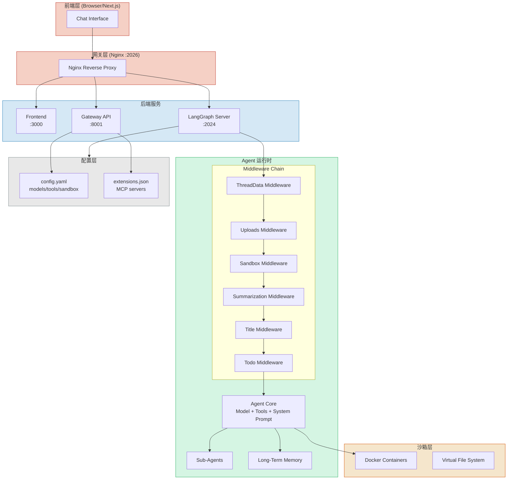
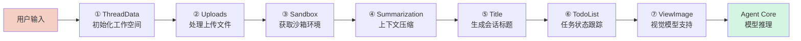
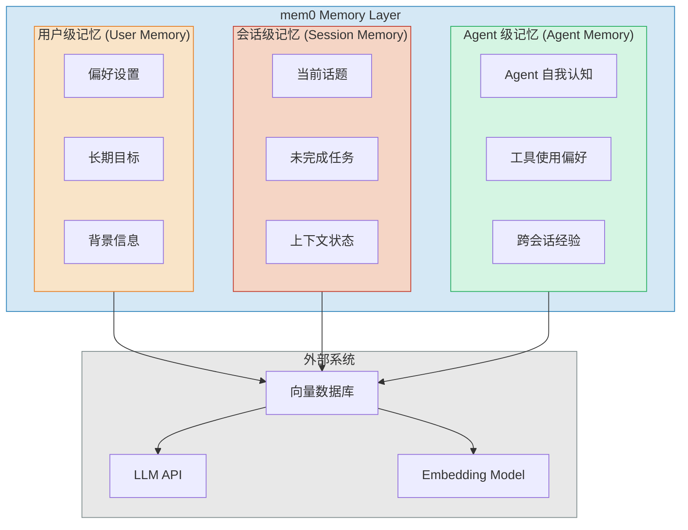
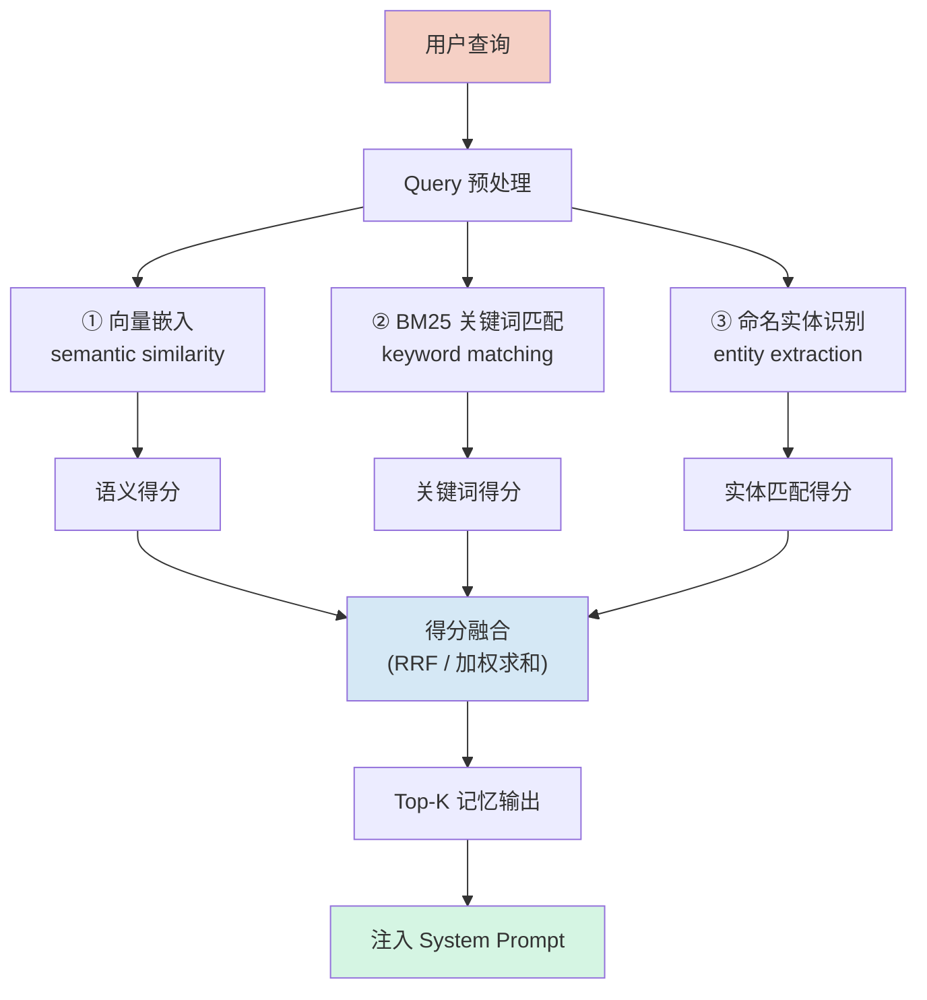
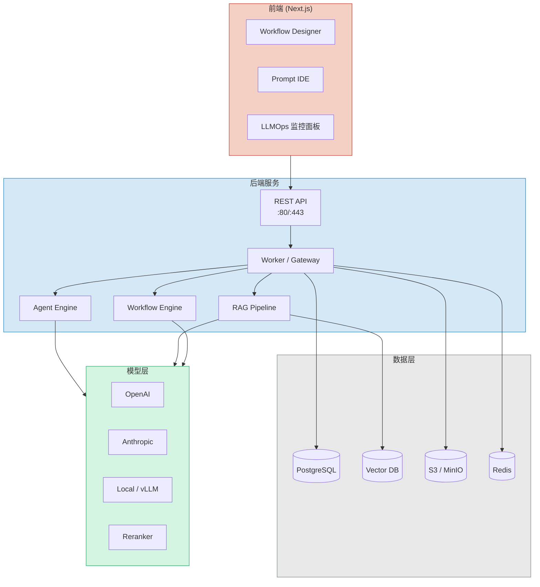
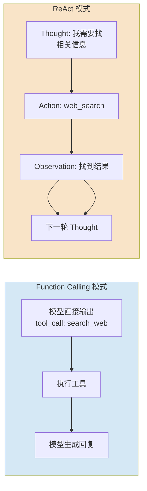
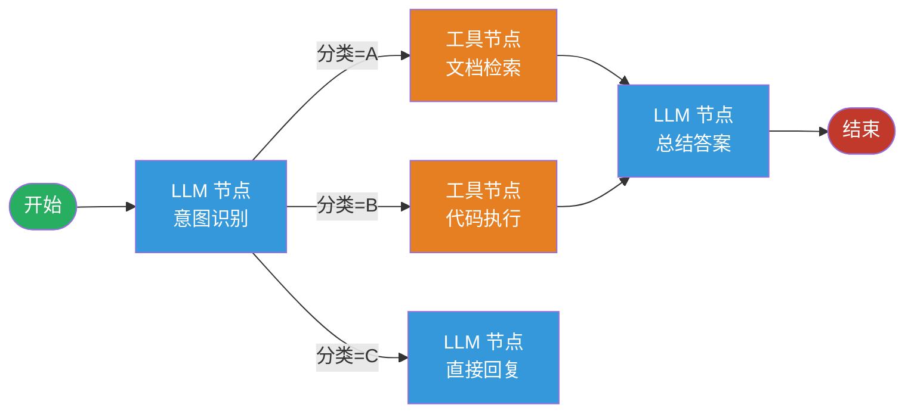
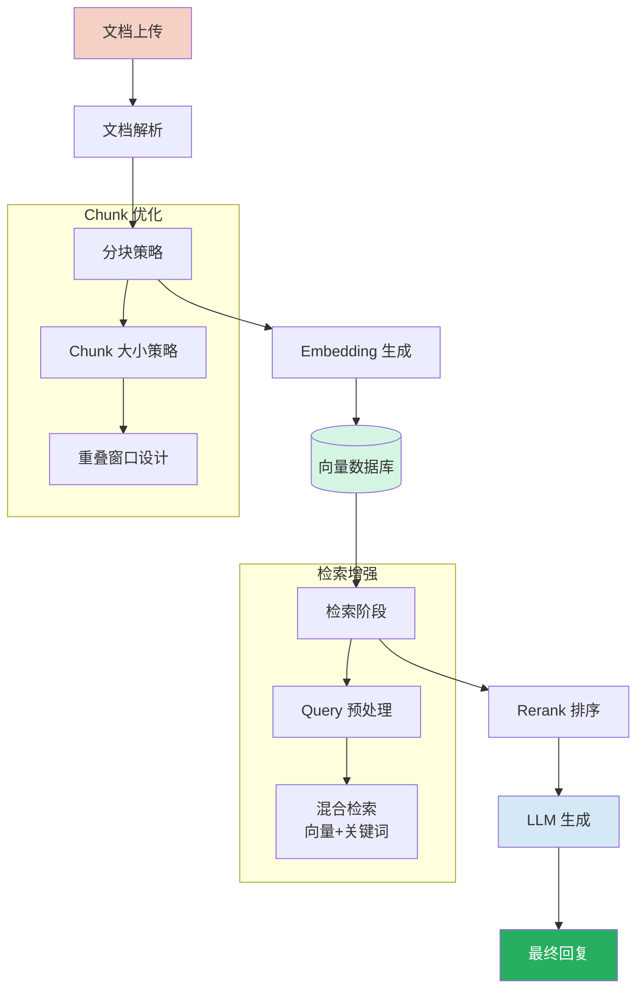

> 大模型本身没有记忆——每次对话都是从零开始。真正让 Agent「变聪明」的，是它背后那套 Memory 系统的设计方式。今天我们深入拆解三个 2025~2026 年最活跃的开源项目，从架构设计到实现原理，一探究竟。

---

## 引子：为什么 Agent 不能没有 Memory？

LLM 的上下文窗口再大，也只是「短期记忆」。一个真正有用的 AI Agent，需要跨越会话、跨越任务积累知识——这就要靠 **Memory（记忆系统）**。

但 Memory 不是一个简单的「存储」问题。它涉及：

- **存储什么**：用户偏好、对话历史、工具执行结果、Agent 的自我反思？
- **如何检索**：关键词？向量相似度？还是结合两者？
- **何时写入**：每轮对话后？还是主动触发？
- **如何组织**：用户级、会话级、Agent 级？分层还是统一？
- **如何影响决策**：Memory 如何真正注入到 Agent 的推理过程中？

今天我们从三个不同侧重的开源项目中，找到这些问题的不同答案。

---

## 参评项目概览

| 项目 | GitHub Stars | 主攻方向 | 核心技术栈 |
|------|-------------|---------|-----------|
| **DeerFlow** (ByteDance) | ⭐ 61.8k | SuperAgent + 多层记忆 | LangGraph + Sandbox + SubAgent |
| **mem0** (mem0ai) | ⭐ 53.1k | 通用 Memory Layer | Hybrid Search + Vector DB |
| **Dify** (langgenius) | ⭐ 137.9k | 全链路 Agent 开发平台 | Workflow + RAG + Agent |

---

## 一、DeerFlow——字节跳动的 SuperAgent 架构

### 1.1 项目定位

DeerFlow（Deep Exploration and Efficient Research Flow）是字节跳动开源的 **SuperAgent 框架**，定位是「一个人可以搞定复杂、长周期任务的 AI Agent」。它的核心设计哲学是：**不只是一个对话机器人，而是一个能在沙箱中执行代码、调用工具、协作子 Agent 的完整任务执行系统**。

2026 年 2 月 28 日，DeerFlow 2.0 重写版发布后，一度登顶 GitHub Trending 第一名。

### 1.2 核心架构

DeerFlow 的架构分为三层：



**三层职责划分**：

- **前端**：Next.js 构建的对话界面，负责渲染和用户交互
- **网关层**：Nginx 统一入口，按路径分发到 Gateway API 或 LangGraph Server
- **LangGraph Server**：核心 Agent 运行时，负责多轮对话、工具执行、子 Agent 编排
- **Sandbox**：Docker 容器化执行环境，保证代码执行的安全性

### 1.3 中间件链（Middleware Chain）——Agent 的「预处理流水线」

DeerFlow 2.0 最独特的设计之一是 **Middleware Chain**。每一轮 Agent 推理前，消息会依次经过 7 个 Middleware：



这个设计的精妙之处在于：**每个 Middleware 都可以修改 ThreadState**，并且它们是链式组合的，可插拔、可配置。这比把所有逻辑堆在 Agent Core 里要优雅得多。

### 1.4 Long-Term Memory 实现原理

DeerFlow 的 Memory 分为两层：

**短期记忆（Session）**：LangGraph 的 `ThreadState` 中维护的 `messages` 列表

**长期记忆（Long-Term）**：通过 `memory.search()` 从外部向量存储检索相关记忆，在 Middleware 链的 **SummarizationMiddleware** 中自动触发

```
用户消息 → SummarizationMiddleware 
         → 查询 Long-Term Memory (向量相似度)
         → 将相关记忆注入上下文 
         → 交给 Agent Core 推理
```

记忆的**写入时机**是 Agent 在完成重要任务后（如生成报告），通过工具调用显式写入。**读取时机**则在每轮推理前的 SummarizationMiddleware 中完成。

### 1.5 SubAgent 协作机制

DeerFlow 支持**子 Agent 协作**。主 Agent（Lead Agent）可以将复杂任务分解给子 Agent：

```python
# 简化逻辑
if task_requires_specialist(task):
    sub_agent = create_sub_agent(specialist_type)
    result = sub_agent.run(task)
    # 结果注入回主 Agent 的消息流
    state.messages.append(result)
```

子 Agent 和主 Agent **共享同一个 Sandbox 环境**，但各自有独立的工具集配置。LangGraph 的 Checkpointing 机制保证了整个调用链的可恢复性。

### 1.6 优缺点分析

**优势**：
- Middleware 链设计非常优雅，扩展性极强
- Sandbox + 虚拟文件系统的组合让代码执行既安全又可控
- 对 MCP（Model Context Protocol）的一流支持
- LangGraph 底层带来了成熟的图执行模型

**局限**：
- 2.0 是完全重写，文档和社区还在成熟中
- 主要面向技术用户，入门门槛不低
- Memory 的实现偏简单，还没有达到 mem0 的精细化程度

---

## 二、mem0——专注射向记忆的 Memory Layer

### 2.1 项目定位

mem0 走的是完全不同的路线：**它不关心 Agent 怎么决策，只专注做好一件事——给 AI 赋予可靠的长期记忆**。

定位是「Universal Memory Layer」，即不论你用 LangGraph、CrewAI、还是自己写的 Agent，只要接上 mem0，就能获得一套完整的记忆管理能力。2025 年拿了 Y Combinator S24 轮融资，是目前最活跃的 AI Memory 开源项目之一。

### 2.2 三层记忆体系

mem0 最核心的设计是**三层记忆架构**：



每一层的**存储内容和生命周期**都不同：

| 层次 | 内容 | TTL | 典型用例 |
|------|------|-----|---------|
| **User Memory** | 偏好、背景、目标 | 永久 | "用户喜欢用中文回复" |
| **Session Memory** | 当前会话的上下文 | 会话结束 | "当前在讨论哪个话题" |
| **Agent Memory** | Agent 的自我经验 | 永久 | "调用这个工具时要小心..." |

### 2.3 Hybrid Search——检索的核心

mem0 的记忆检索不走单纯的向量相似度，而是**混合搜索（Hybrid Search）**：



原理解释：
- **向量检索**：捕捉语义相似性（"我想喝咖啡" ≈ "要不要来杯拿铁？"）
- **BM25**：关键词精确匹配，确保专有名词、数字等不被忽略
- **实体识别**：提取人名、地点、日期等实体，提升记忆的**指代消解**能力

三者融合后输出 Top-K 条记忆，注入 System Prompt 给 LLM 使用。

### 2.4 记忆的写入流程

```python
# mem0 记忆写入伪代码
def memory.add(messages, user_id):
    # 1. 从 messages 提取关键信息（LLM 抽取）
    facts = llm.extract_facts(messages)
    
    # 2. 对每条 fact 生成 embedding
    embeddings = embedder.encode(facts)
    
    # 3. 存储到向量数据库（支持多种后端）
    for fact, embedding in zip(facts, embeddings):
        vector_db.upsert(
            collection=user_id,
            vector=embedding,
            payload={"content": fact, "metadata": ...}
        )
```

关键设计：**Upsert 而非 Append**。如果新的对话内容与已有记忆冲突，mem0 会更新而非简单追加，从而保证记忆的**时效性**和**一致性**。

### 2.5 多后端支持

mem0 支持多种向量数据库作为存储后端：

```
支持的 Vector Store:
├── Qdrant
├── Chroma
├── Pinecone
├── Weaviate
├── pgvector (PostgreSQL)
├── Milvus
└── FAISS (本地)
```

这让 mem0 可以从小规模个人使用（Chroma/FAISS）无缝扩展到生产级别高可用部署（Pinecone/Qdrant）。

### 2.6 评测数据

mem0 团队在 LOCOMO 基准上做了评测：

| 指标 | 数据 |
|------|------|
| 准确率 vs OpenAI Memory | **+26%** |
| 响应速度 vs Full-Context | **91% 提升** |
| Token 消耗 vs Full-Context | **节省 90%** |

### 2.7 优缺点分析

**优势**：
- 三层记忆体系设计非常清晰，针对性强
- Hybrid Search 的效果显著优于单一向量检索
- 轻量级、框架无关，易于集成
- 完整支持 Agent 级、用户级、会话级三种场景

**局限**：
- 本身不包含 Agent 逻辑，需要配合 LangGraph / 自定义代码使用
- 记忆抽取依赖 LLM API 调用，有额外延迟和成本
- 对多模态（图像、音频）记忆的支持还在早期

---

## 三、Dify——全链路 Agent 开发平台

### 3.1 项目定位

Dify 是三者中**体量最大、功能最全**的项目，定位是「开源 LLM App 开发平台」。它不只是 Agent 框架，而是覆盖了从原型验证到生产部署的完整生命周期：LLMOps、RAG Pipeline、Agent、Workflow、可观测性。

GitHub Stars 137.9k，是目前最受欢迎的 AI 开发平台之一。

### 3.2 整体架构



### 3.3 Agent 能力——Function Calling 与 ReAct 双轨

Dify 的 Agent 支持两种推理模式：

**Function Calling 模式**：模型原生支持工具调用，直接输出结构化调用指令

**ReAct 模式**：模型先生成思考链（Thought），再决定动作（Action）和观察（Observation）



配置上，Dify 提供了 **50+ 内置工具**：Google Search、DALL·E、Stable Diffusion、WolframAlpha 等，同时也支持自定义工具（MCP 协议）。

### 3.4 Workflow——复杂业务流程的编排引擎

Dify 最强大的功能之一是 **可视化 Workflow 编排**：



Workflow 支持：
- **条件分支**：根据 LLM 输出路由到不同节点
- **并行执行**：多个节点同时运行再汇聚
- **循环**：支持迭代直到满足条件
- **参数传递**：上游节点的输出自动注入下游

### 3.5 RAG Pipeline

Dify 的 RAG 不是简单的 Embedding + 检索，而是完整的处理流水线：



Dify 支持上传 PDF、PPT、Word、Markdown 等多种格式，自动处理结构化解析。

### 3.6 优缺点分析

**优势**：
- 功能最全，从原型到生产一站式覆盖
- 可视化 Workflow 设计器大幅降低使用门槛
- LLMOps（日志分析、性能监控、数据标注）做得非常扎实
- Backend-as-a-Service API 让集成成本极低

**局限**：
- 架构复杂度最高，学习曲线较陡
- 作为一个平台，它在 Memory 这个细分点上不如 mem0 深入
- 大型企业级功能（多租户、高可用）主要在商业版

---

## 四、横向对比——三项目的设计哲学差异

### 4.1 设计哲学对比

```mermaid
radarChart
    title 设计哲学对比
    "专注深度" 8 7 6
    "易用性" 5 8 9
    "扩展性" 9 7 8
    "Memory 精细度" 6 10 5
    "生产成熟度" 7 7 10
    "轻量级" 5 9 3
```

| 维度 | DeerFlow | mem0 | Dify |
|------|---------|------|------|
| **设计哲学** | 垂直深耕：做最强大的 SuperAgent | 横向抽象：做通用的 Memory 基础设施 | 横向扩展：做全链路的 AI 开发平台 |
| **Memory 定位** | Agent 的支撑模块 | 产品的核心价值 | RAG 场景下的检索增强 |
| **多 Agent 支持** | 原生 SubAgent 协作 | 不涉及（纯 Memory） | 多 Agent Workflow 编排 |
| **沙箱/执行环境** | Docker Sandbox（安全代码执行） | 不涉及 | 依赖外部执行 |
| **最低门槛** | 需要配置 LLM API + Docker | pip install + API key | Docker Compose 一键启动 |
| **适用场景** | 深度研究、长任务执行 | 需要个性化记忆的任何 Agent | 快速原型 → 生产部署 |

### 4.2 Memory 机制的核心差异

```
DeerFlow Memory:
  User Input → SummarizationMiddleware → Vector Search → Inject to Context
  (在推理链路中插入，不改变推理模型)

mem0 Memory:
  Messages → LLM Fact Extraction → Hybrid Search → Structured Memory
  (主动理解、抽取、存储，检索结果作为上下文基础)

Dify Memory:
  RAG Pipeline → Chunk Retrieval → Rerank → LLM Context
  (以文档检索为核心，适用于知识密集型任务)
```

### 4.3 为什么选择这三个项目？

三个项目代表了三类截然不同的设计思路：

- **DeerFlow**：解决「Agent 如何完成需要分钟到小时的长周期任务」，靠 SubAgent + Sandbox + Memory 分层实现
- **mem0**：解决「如何让任何 Agent 获得可靠、持久、跨会话的个性化记忆」，靠三层记忆 + Hybrid Search 实现
- **Dify**：解决「如何让一个团队从原型快速走到生产」，靠全功能平台 + 低代码 Workflow 实现

---

## 五、趋势洞察——Agent + Memory 的未来方向

### 5.1 Memory 正在从「附件」变成「核心」

过去两年，Memory 更多被视为 Agent 的附加能力。但随着 2025 年 mem0 等专用 Memory 层的崛起，业界正在形成共识：**Memory 应该独立成为一个基础设施层**，由专门的系统负责，而不是让 Agent 自己管理。

### 5.2 Hybrid Search 是 Memory 检索的主流

纯向量检索在 Memory 场景下表现不够好——它对关键词、实体名称、数字等不敏感。**Hybrid Search（语义 + 关键词 + 实体）**正在成为 Memory 检索的标准配置，mem0 的 benchmark 已经验证了这条路。

### 5.3 SubAgent 协作正在标准化

多 Agent 协作的核心挑战是：**如何让子 Agent 的输出稳定地回到主 Agent 的上下文**？DeerFlow 通过共享 Sandbox + LangGraph Checkpointing 给出了一个参考答案。随着 MCP（Model Context Protocol）协议的普及，Agent 之间的互操作性问题会逐步得到解决。

### 5.4 可观测性是生产级 Agent 的门槛

Dify 的 LLMOps 功能（日志、监控、数据标注）代表了一个趋势：**Agent 上生产，必须要有可观测性**。随着 Agent 应用规模扩大，如何追踪一次复杂任务中每个 Agent、每次工具调用、每次 Memory 读写的效果，将成为工程化的关键。

---

## 结语

AI Agent 的 Memory 问题，本质上是「如何让 AI 记住有用的东西，并且能在对的时候想起来」。DeerFlow、mem0 和 Dify 给出了三条不同的技术路径——

- 如果你需要一个能独立完成复杂任务的 Agent，选 **DeerFlow**
- 如果你需要在现有 Agent 上叠加记忆能力，选 **mem0**
- 如果你要做一个面向团队/企业的 AI 应用平台，选 **Dify**

但无论选哪个，有一个趋势是确定的：**Memory 正在从 Agent 的配角，变成 AI 系统的核心基础设施**。理解这些项目的设计思路，就是在理解 AI Agent 未来演进的底层逻辑。

---

**参考链接**：
- DeerFlow: https://github.com/bytedance/deer-flow (⭐ 61.8k)
- mem0: https://github.com/mem0ai/mem0 (⭐ 53.1k)
- Dify: https://github.com/langgenius/dify (⭐ 137.9k)
