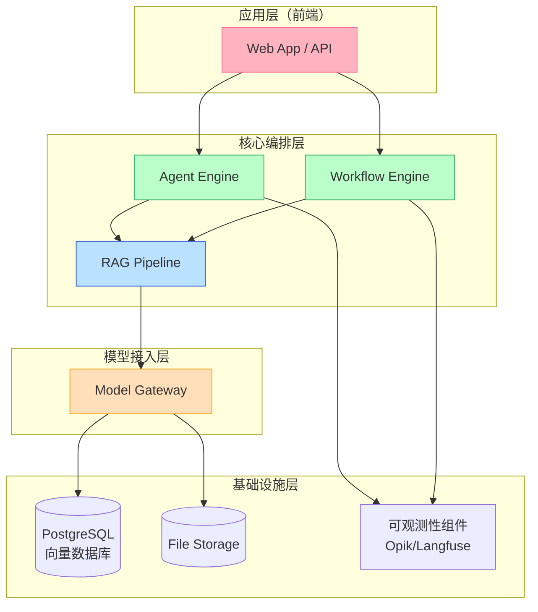
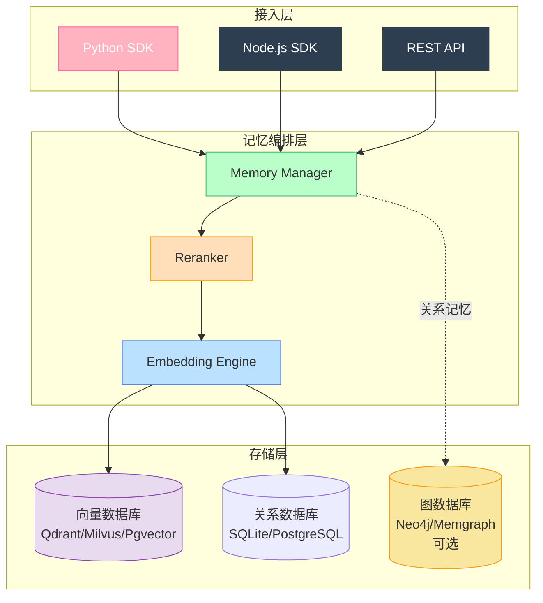
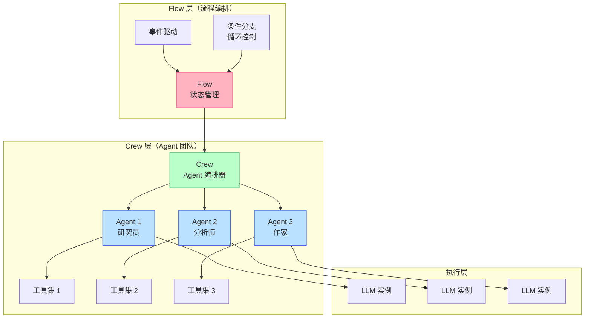
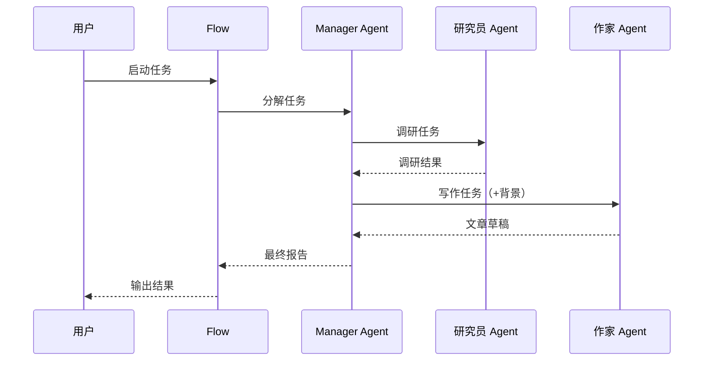

# AI Agent + Memory：2026 年最值得学习的开源项目深度解析

## 引子：为什么 Agent + Memory 才是 AI 应用的主战场

过去两年，大语言模型（LLM）从"聊天玩具"进化成了真正的生产力工具。但真正让 LLM 发挥威力的，不只是模型本身有多强——而是** Agent（智能体）和 Memory（记忆）** 这两个基础设施的成熟度。

简单来说：

- **Agent** 解决的是"让 LLM 真正做事"的问题——不只是回答问题，而是能自主规划、调用工具、完成任务链。
- **Memory** 解决的是"让 LLM 有记忆"的问题——不只是当前对话的上下文，而是跨会话、跨任务的长期知识和偏好。

两者结合，才是真正意义上"类人 AI 助手"的基石。

今天我们从 GitHub 上筛选出三个最具代表性的开源项目，从**核心架构**、**实现原理**、**设计哲学**三个维度做深度解析，并对它们进行横向对比。文章最后会梳理这些项目反映出的技术趋势。

> **项目筛选标准**：Star 数 > 20k、过去 3 个月内仍有活跃提交、与 AI/LLM 强相关、源码可访问。

---

<!-- more -->


## 一、为什么选这三个项目？

| 项目 | GitHub Star | 语言 | 核心定位 |
|------|------------|------|---------|
| **[Dify](https://github.com/langgenius/dify)** | 137k ⭐ | TypeScript | Agentic Workflow 开发平台 |
| **[mem0](https://github.com/mem0ai/mem0)** | 53k ⭐ | Python | 通用 AI 记忆层 |
| **[CrewAI](https://github.com/CrewAIInc/crewAI)** | 22k ⭐ | Python | 多 Agent 协作编排框架 |

三者恰好代表了三个不同的切入角度：

- **Dify** 是**平台层**视角——如何把 Agent、工作流、RAG、可观测性全部整合成一个可部署的产品。
- **mem0** 是**记忆层**视角——如何给 LLM 提供持久化、自适应、跨会话的记忆能力。
- **CrewAI** 是**框架层**视角——如何用代码（而不是配置）编排多个角色化的 Agent 协作完成任务。

三个视角叠加在一起，刚好覆盖了构建复杂 AI 应用的核心要素。

---

## 二、Dify：把 AI 应用开发变成"搭积木"

### 2.1 项目定位

Dify 的 Slogan 是"Production-ready platform for agentic workflow development"。它的核心目标很明确：**让 AI 应用的开发从"写代码"变成"搭工作流"**。

传统开发 AI 应用，开发者需要自己组合 LangChain、处理 RAG 管道、管理 Agent 循环、接入各种模型——门槛很高。Dify 把这些全部抽象成了**可视化的工作流节点**，开发者拖拽配置就能跑起一个完整的 AI 应用。

它的竞品不是 LangChain 这种"代码库"，而是**Coze（扣子）、Flowise** 这类低代码/无代码平台。但 Dify 是完全开源的，可以私有部署，这是它的核心差异。

### 2.2 核心架构

Dify 的整体架构可以分为四层：



**各层职责：**

- **Model Gateway**：统一对接 OpenAI、Claude、Gemini、Llama 等主流模型，Dify 自己做了一层抽象，切换模型不需要改业务代码。
- **Agent Engine**：支持两种模式——**ReAct Agent**（根据用户输入动态决定下一步）和 **Agentic Workflow**（预定义执行路径）。Agent 可以调用工具（Tavily Search、Wikipedia、Google Scholar 等）。
- **Workflow Engine**：这是 Dify 最核心的差异化能力。工作流由多个**节点**组成，每个节点可以是 LLM 调用、条件分支、变量提取、代码执行、外部 API 调用等。工作流支持**循环**和**条件分支**，可以实现非常复杂的业务流程。
- **RAG Pipeline**：Dify 内置了完整的 RAG 管道——文档上传→切片→向量化→存储→检索→生成。支持的向量数据库包括 Milvus、Qdrant、Pgvector、Weaviate 等。

### 2.3 记忆机制：RAG 是核心

Dify 本身不提供"跨会话记忆"（这点和 mem0 完全不同）。它的记忆能力主要来自**RAG 管道**：

1. 用户上传文档 → Dify 自动切片（支持多种策略：按段落、按 Token 数等）
2. 切片后用 Embedding 模型向量化，存入向量数据库
3. 用户提问时，从向量库检索相关片段，和问题一起发给 LLM

所以 Dify 的"记忆"本质上是**领域知识记忆**——记住的是"这个企业/行业的知识库"，而不是"用户上一次聊了什么"。

> **如果你需要跨会话的个性化记忆**，Dify 需要搭配 mem0 这类专用记忆层使用。

### 2.4 实现原理：工作流节点的执行逻辑

Dify 工作流的核心执行逻辑并不复杂，本质上是一个**有向无环图（DAG）+事件循环**：

```
用户输入 → 触发工作流
  → 节点A（LLM调用）→ 节点B（条件判断）
      → 节点C（工具调用）→ 节点D（LLM总结）
  → 输出结果
```

每个节点的输出会写入**上下文变量**，供后续节点使用。节点之间支持并行执行（对于没有依赖的分支）和串行执行（对于有依赖的分支）。

### 2.5 优缺点

| 维度 | 评分 | 分析 |
|------|------|------|
| **上手难度** | ⭐⭐⭐⭐⭐ | 可视化界面，无需写代码就能跑通完整流程 |
| **扩展性** | ⭐⭐⭐ | 工作流覆盖大多数场景，极端定制化需求需fork源码 |
| **生产可用性** | ⭐⭐⭐⭐ | 支持 Docker 一键部署，内置可观测性 |
| **多 Agent 支持** | ⭐⭐⭐ | 支持，但非原生重点 |
| **记忆能力** | ⭐⭐ | 强 RAG，弱跨会话记忆 |

**最大优势**：开箱即用，5 分钟跑通一个完整的 AI 应用。

**最大局限**：当你的需求超出"工作流节点"的表达能力时，改造成本较高。

---

## 三、mem0：给 AI 装上"海马体"

### 3.1 项目定位

mem0 的野心更大——**做 AI 应用的"通用记忆层"（Universal Memory Layer）**。

它的核心洞察是：当前的 LLM 应用，每做一次新会话，都要把所有上下文重新发给模型——成本高、速度慢、而且模型仍然记不住长期偏好。mem0 要解决的是：**让 AI 真正记住用户是谁、在意什么、习惯什么**，而且要在生产级别可用。

官方数据显示：在 LOCOMO 基准测试上，mem0 比 OpenAI Memory 精度高 **26%**，响应速度快 **91%**，Token 消耗减少 **90%**。

### 3.2 核心架构

mem0 的架构围绕**多层次记忆**设计：



**三层记忆：**

1. **User Memory（用户级记忆）**：跨所有会话的长期偏好，如"用户喜欢简洁的回复风格"
2. **Session Memory（会话级记忆）**：当前会话的上下文，如"这次对话讨论了某个项目"
3. **Agent Memory（Agent 级记忆）**：特定 AI Agent 的经验和知识

### 3.3 核心机制：记忆的存储与检索

mem0 的记忆工作流分为**写入**和**检索**两个阶段：

**写入阶段（Add Memory）：**

```
用户输入 → LLM 提取关键信息 → 自适应切片 →
Embedding 向量化 → 存入向量库 + 历史数据库
```

mem0 不是简单地把整段对话向量化存储。它会先用 LLM 分析：这条信息里哪些是值得记住的"知识"、哪些是噪音。这个"LLM 过滤"步骤是 mem0 精度较高的原因之一。

**检索阶段（Search Memory）：**

```
用户查询 → 混合检索（向量搜索 + BM25关键词匹配）→ 
Reranker 重排 → 返回 Top-K 记忆片段
```

这里有两个关键设计：

1. **混合检索**：向量搜索擅长语义相似性，BM25 擅长关键词精确匹配。两者结合能覆盖更多场景。
2. **Reranker**：在召回阶段之后，用交叉编码器对 Top-N 结果重新打分，保证最相关的结果排在最前面。mem0 支持 Cohere、OpenAI 等多种 Reranker。

**Graph Memory（图记忆，可选）：**

mem0 还支持将记忆存储为**知识图谱**——不是简单存储片段，而是存储实体和关系。比如：

```
用户（小明）—喜欢→ 日式料理
用户（小明）—过敏→ 海鲜
餐厅（A）—类型→ 日式料理
```

查询"帮小明找餐厅"时，图结构能提供关系推理能力，而这是纯向量检索做不到的。

### 3.4 与 OpenAI Memory 的对比

很多人会问：mem0 和 OpenAI 的 Memory API 有什么区别？

| 维度 | OpenAI Memory | mem0 |
|------|--------------|------|
| **精度** | LOCOMO 基准 100% | LOCOMO 基准 126%（+26%） |
| **部署方式** | 仅云端 | 云端 + 私有部署 |
| **图记忆** | ❌ 不支持 | ✅ 可选（Neo4j） |
| **Reranker** | ❌ | ✅ 支持 |
| **多存储后端** | 仅 OpenAI | Qdrant/Milvus/Pgvector 等多种 |

核心差距在于：OpenAI Memory 是一个黑盒 API，mem0 是一个**可观测、可配置、可自托管**的开源系统。

### 3.5 优缺点

| 维度 | 评分 | 分析 |
|------|------|------|
| **记忆质量** | ⭐⭐⭐⭐⭐ | LLM 过滤 + 混合检索 + Reranker，业界领先 |
| **易用性** | ⭐⭐⭐⭐⭐ | SDK 极简，3 行代码接入 |
| **部署灵活性** | ⭐⭐⭐⭐ | 支持 Docker Compose 一键部署 |
| **多模态支持** | ⭐⭐⭐ | 目前以文本为主，图片支持有限 |
| **扩展记忆类型** | ⭐⭐⭐⭐ | Graph Memory 提供了关系推理能力 |

**最大优势**：专注做一件事并做到极致——"AI 记忆"这个垂类里，mem0 是目前最成熟的解决方案。

**最大局限**：目前以纯文本场景为主，多模态（图片、语音）的记忆能力还在早期。

---

## 四、CrewAI：让 Agent 像真实团队一样协作

### 4.1 项目定位

CrewAI 的核心理念是：**让多个 AI Agent 像真实团队一样工作**，每个 Agent 有自己的"角色"、"目标"和"工具"，通过协作完成复杂任务。

它的灵感来源是现实世界的**跨职能团队**：研究员负责调研，分析师负责数据，作家负责输出——每个人只做自己最擅长的事，但需要协作才能完成整个项目。

CrewAI 最早火起来是因为它的 **Role-Playing（角色扮演）** 概念——给 Agent 定义 Backstory（背景故事），让它们的回答风格和思维方式更接近真实的专业人士。

### 4.2 核心架构

CrewAI 的架构围绕两个核心概念：**Flows** 和 **Crews**。



**Flow（流程）**：定义整个应用的执行骨架——启动条件、步骤顺序、状态管理、事件触发逻辑。Flow 让 CrewAI 可以处理**有状态的长任务**。

**Crew（团队）**：由多个 Agent 组成。Crew 是真正"干活"的地方。每个 Crew 有一个**manager**（默认是 LLM 本身，也可以自定义），负责：
- 分解任务给各个 Agent
- 决定 Agent 的执行顺序
- 汇总各 Agent 的输出

### 4.3 核心机制：Agent 的决策与协作

CrewAI 的 Agent 决策机制基于 **ReAct 模式**（Reasoning + Acting）：

```
while not done:
    1. Agent 思考：我现在需要做什么？（Reason）
    2. Agent 选择：调用哪个工具/委托给哪个 Agent？（Act）
    3. 工具返回结果 → 影响下一步决策
    4. 循环，直到任务完成
```

**Crew 的协作模式有两种：**

1. **顺序执行（Sequential）**：Agent A 先做 → 结果传给 Agent B → Agent B 继续。适合有前后依赖的流程。
2. **层级执行（Hierarchical）**：Manager Agent 分解任务 → 分派给专业 Agent → 收集结果。适合复杂任务分解。



### 4.4 与 Dify 的本质区别

很多人会把 CrewAI 和 Dify 拿来做比较——它们都能编排多 Agent，但定位完全不同：

| 维度 | Dify | CrewAI |
|------|------|--------|
| **编排方式** | 可视化工作流（节点拖拽） | 代码优先（Python 定义） |
| **复杂度** | 适合中低复杂度 | 适合高复杂度、多角色协作 |
| **记忆机制** | RAG（知识库） | 无内置记忆（需搭配 mem0） |
| **多 Agent 协作** | 基本（串行为主） | 原生（顺序 + 层级双模式） |
| **目标用户** | 业务人员、低代码用户 | 开发者、算法工程师 |

**核心差异**：Dify 是"**配置驱动**"的，适合快速搭建业务 AI 应用；CrewAI 是"**代码驱动**"的，适合深度定制 Agent 行为和协作逻辑。

### 4.5 优缺点

| 维度 | 评分 | 分析 |
|------|------|------|
| **多 Agent 协作** | ⭐⭐⭐⭐⭐ | 原生支持角色化 Agent + 多种协作模式 |
| **代码灵活度** | ⭐⭐⭐⭐⭐ | 全 Python 代码，定制无上限 |
| **上手难度** | ⭐⭐⭐ | 需要写 Python 代码 |
| **可视化** | ⭐⭐ | 纯代码，无 UI |
| **生产部署** | ⭐⭐⭐⭐ | Docker 友好，但不如 Dify 一键部署 |
| **记忆能力** | ⭐ | 需要搭配 mem0 等外部记忆层 |

**最大优势**：Agent 角色化和 Crew 协作模式设计得非常优雅，真正模拟了真实团队的工作方式。

**最大局限**：没有内置记忆能力，也没有 Dify 那样的可视化界面——适合有开发能力的团队。

---

## 五、横向对比：设计哲学的差异

三个项目代表了三种截然不同的设计哲学：

| 维度 | Dify | mem0 | CrewAI |
|------|------|------|--------|
| **核心抽象** | 工作流节点 | 记忆（向量 + 关系） | Agent 角色 + Crew 协作 |
| **解决问题** | "如何快速搭 AI 应用" | "如何让 AI 有记忆" | "如何让多 Agent 协作" |
| **用户画像** | 业务人员 + 全栈工程师 | 算法工程师 + 应用开发者 | 开发者 + AI 研究者 |
| **复杂度取舍** | 牺牲复杂度换易用性 | 专注单一问题 | 保留灵活性牺牲可视化 |
| **记忆机制** | RAG（知识库） | 多层记忆 + 混合检索 | 无（需外接） |
| **多 Agent** | 基础支持 | N/A | 原生支持 |

**最核心的洞察**：三者并不互斥，在真实生产环境中往往会组合使用：

```
Dify（应用层/工作流）
  + CrewAI（复杂 Agent 协作逻辑）
  + mem0（跨会话记忆层）
  → 构建完整的 AI 应用系统
```

---

## 六、技术趋势：从这三个项目看 AI Agent 的未来

### 趋势 1：Memory 从"奢侈品"变成"基础设施"

过去 Agent 没有记忆是因为太贵（Token 成本）和太慢。现在 mem0 这类专用记忆层通过**混合检索 + Reranker + 自适应存储**，把成本降到了 1/10，精度反而更高。

**预测**：未来每个 AI 应用默认都会有记忆层，就像每个 Web 应用默认有数据库一样。

### 趋势 2：Agent 框架正在"两条腿走路"

一条腿是**低代码/可视化平台**（Dify、Coze），降低使用门槛；另一条腿是**代码优先框架**（CrewAI、LangGraph），保留深度定制能力。两者会长期并存，最终用户按需选择。

### 趋势 3：多 Agent 协作从"噱头"走向"工程化"

早期多 Agent 只是"让几个 Agent 聊聊天"，现在 CrewAI 已经能支持**有状态的工作流 + 层级化的任务分解**。下一步是**可观测性**（Agent 决策链路追踪）和**安全性**（Agent 越权控制）的工程化。

### 趋势 4：RAG 不再是记忆的唯一答案

向量检索 + RAG 是目前最成熟的记忆方案，但**知识图谱 + 记忆**（mem0 的 Graph Memory）提供了关系推理能力。未来记忆层会是**混合架构**——向量库存"是什么"，图数据库存"关系是什么"。

---

## 结语

三个项目、三种视角，但都在回答同一个问题：**如何让 LLM 真正成为能做事、有记忆、会协作的智能体？**

没有"最佳"项目，只有"最适合你场景"的选择：

- 想快速搭一个 AI 应用？ → **Dify**
- 想给应用加上长期记忆？ → **mem0**
- 想深度定制多 Agent 协作？ → **CrewAI**
- 想做生产级复杂系统？ → **三者组合**

AI Agent 的生态还在快速演化，2026 年下半年一定还会有新的项目冒出来。但无论工具如何变化，理解**Agent 如何决策**、**Memory 如何工作**、**多 Agent 如何协作**这三个核心问题，才是以不变应万变的关键。

---

## 参考链接

| 项目 | GitHub | 文档 |
|------|--------|------|
| Dify | [langgenius/dify](https://github.com/langgenius/dify) | [docs.dify.ai](https://docs.dify.ai) |
| mem0 | [mem0ai/mem0](https://github.com/mem0ai/mem0) | [docs.mem0.ai](https://docs.mem0.ai) |
| CrewAI | [crewAIInc/crewAI](https://github.com/CrewAIInc/crewAI) | [docs.crewai.com](https://docs.crewai.com) |

---

*本文由 AI 辅助调研整理，参考了项目 README、官方文档及 GitHub 仓库数据。内容截止 2026 年 4 月。*
