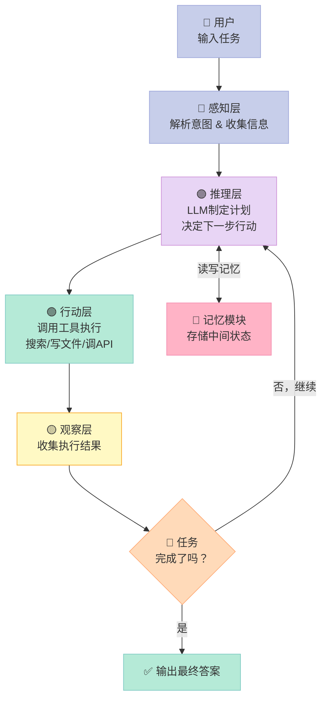

> **一句话结论：大语言模型（LLM）是一个博学多才的顾问，而智能体（Agent）是一个能帮你把事情办完的助理——这两者之间，隔着一道关键的鸿沟。**

---

## 为什么你应该关心智能体？

你有没有试过这样对ChatGPT说话：

> "帮我预订下周三从北京飞上海的机票，顺便在虹桥附近找一家评分4.8以上的酒店，预算800元以内。"

然后它回了你一大段文字——告诉你"可以去携程/去哪儿搜索"，"建议提前比价"，"酒店可以关注xxx区域"……

**说了等于没说。**

这不是ChatGPT不聪明，而是因为它的设计根本不支持"帮你把事情办完"。它能理解你的需求，能给你建议，但它无法代你点开网站、搜索航班、比较价格、完成预订。

这，就是**LLM**和**Agent（智能体）**之间最本质的区别。

2023年以后，一种新型AI应用正在快速崛起——**AI Agent（人工智能智能体）**。它不只是"更聪明的聊天机器人"，而是能**自主感知环境、制定计划、调用工具、完成任务**的AI系统。GitHub上的AutoGPT在一周内获得了超过10万Star，BabyAGI让人们第一次看到AI自主完成复杂任务的可能性。

Agent时代，已经到来。

---

## 一、普通LLM为什么搞不定复杂任务？

要理解Agent，先要理解LLM的局限。

**LLM本质上是一个"文字接龙大师"。** 给它一段文字，它预测最可能跟在后面的文字。它的能力边界，就是它的输入输出边界——**文字进，文字出**。

| 能力维度 | 普通LLM | AI Agent |
|---------|--------|---------|
| 理解自然语言 | ✅ 优秀 | ✅ 优秀 |
| 生成文本内容 | ✅ 优秀 | ✅ 优秀 |
| 调用外部工具 | ❌ 不能 | ✅ 核心能力 |
| 多步骤自主规划 | ❌ 不能 | ✅ 核心能力 |
| 执行实际操作 | ❌ 不能 | ✅ 核心能力 |
| 记住跨会话信息 | ❌ 不能 | ⚠️ 需要记忆模块 |
| 自我纠错 | ❌ 不能 | ✅ 部分支持 |

LLM最大的硬伤是：**它活在对话框里，没有手脚。** 它能告诉你"机票应该这么订"，但它没有办法真的去点击按钮、填写表单、完成支付。

这就是为什么我们需要Agent。

---

## 二、Agent是什么？用人话解释

**智能体（Agent）**，来自哲学和认知科学中的"Agent"概念——一个能**感知环境、做出决策、采取行动**以达成目标的实体。

放在AI语境下，一个完整的Agent由4个核心模块构成——我把它叫做**PRAM框架**：

- 🔵 **感知（Perception）**：接收输入——用户指令、网页内容、文件、图片……
- 🟡 **推理（Reasoning）**：用LLM"大脑"分析目标、制定计划、决定下一步
- 🟢 **行动（Action）**：调用工具执行——搜索、写文件、调API、控制浏览器……
- 🟣 **记忆（Memory）**：短期记住当前对话，长期存储过去经验

类比来说：如果把Agent比作一个刚入职的新员工——
- **感知**是他看邮件、听汇报
- **推理**是他在脑子里分析"这件事该怎么做"
- **行动**是他打电话、发邮件、去办公室跑流程
- **记忆**是他的工作笔记本和过往经验

而普通LLM，只有"推理"这一项。

---

## 三、Agent的工作循环是怎样的？

Agent的核心，是一个**"感知→推理→行动→观察"**的持续循环，直到任务完成。



这个循环有个专业名字：**ReAct（Reasoning + Acting）**，是目前最主流的Agent范式之一（第四章会详细讲）。

关键点是：**Agent不是一问一答，而是持续迭代直到目标达成。** 这就是它和普通LLM最大的行为差异。

---

## 四、实战代码：用30行Python写一个最简单的Agent

下面这段代码实现了一个**会使用工具的Agent**。它能根据用户问题，自主决定是否调用工具，以及调用什么工具。

> **注意**：运行前需要设置环境变量 `OPENAI_API_KEY`，并安装 `openai` 库（`pip install openai`）。如果你用的是国内模型，可以把 `base_url` 改成对应地址。

```python
import json
import os
from openai import OpenAI

# 初始化OpenAI客户端
client = OpenAI(api_key=os.environ.get("OPENAI_API_KEY"))

# ===== 定义工具 =====
def get_weather(city: str) -> str:
    """模拟天气查询工具（实际应用中替换成真实API）"""
    fake_weather = {
        "北京": "晴，22°C，空气质量良好",
        "上海": "多云，18°C，有轻微降雨可能",
        "广州": "雨，25°C，湿度较高",
    }
    return fake_weather.get(city, f"暂无{city}的天气数据")

def calculate(expression: str) -> str:
    """安全计算数学表达式"""
    try:
        # 限制只能处理数字和运算符，防止代码注入
        allowed = set("0123456789+-*/()., ")
        if not all(c in allowed for c in expression):
            return "错误：表达式包含非法字符"
        result = eval(expression)  # noqa: S307
        return str(result)
    except Exception as e:
        return f"计算错误: {e}"

# ===== 工具注册表（OpenAI函数调用格式）=====
tools = [
    {
        "type": "function",
        "function": {
            "name": "get_weather",
            "description": "查询某个城市的实时天气情况",
            "parameters": {
                "type": "object",
                "properties": {
                    "city": {"type": "string", "description": "城市名称，如：北京、上海"}
                },
                "required": ["city"]
            }
        }
    },
    {
        "type": "function",
        "function": {
            "name": "calculate",
            "description": "计算数学表达式，如加减乘除",
            "parameters": {
                "type": "object",
                "properties": {
                    "expression": {"type": "string", "description": "数学表达式，如：(25 + 18) * 2"}
                },
                "required": ["expression"]
            }
        }
    }
]

# ===== 工具调度器 =====
tool_map = {"get_weather": get_weather, "calculate": calculate}

def run_agent(user_question: str, max_steps: int = 5):
    """运行一个支持工具调用的简单Agent"""
    print(f"\n{'='*50}")
    print(f"❓ 用户问题: {user_question}")
    print('='*50)

    # 初始化对话历史
    messages = [
        {"role": "system", "content": "你是一个智能助理，可以使用工具来帮助用户解决问题。"},
        {"role": "user", "content": user_question}
    ]

    for step in range(max_steps):
        print(f"\n--- 第 {step + 1} 步 ---")

        # 调用LLM，告知可用工具
        response = client.chat.completions.create(
            model="gpt-4o-mini",
            messages=messages,
            tools=tools,
            tool_choice="auto"  # 让模型自主决定是否使用工具
        )

        message = response.choices[0].message

        # 如果模型没有调用工具，说明已得出最终答案
        if not message.tool_calls:
            print(f"\n✅ 最终回答:\n{message.content}")
            return message.content

        # 处理工具调用
        messages.append(message)  # 将模型的"打算调用工具"加入历史

        for tool_call in message.tool_calls:
            func_name = tool_call.function.name
            func_args = json.loads(tool_call.function.arguments)

            print(f"🔧 调用工具: {func_name}({func_args})")

            # 执行工具
            result = tool_map[func_name](**func_args)
            print(f"📋 工具返回: {result}")

            # 把工具结果加入对话历史
            messages.append({
                "role": "tool",
                "tool_call_id": tool_call.id,
                "content": result
            })

    return "已达到最大步数限制"


# ===== 运行示例 =====
if __name__ == "__main__":
    # 示例1：单工具调用
    run_agent("北京今天天气怎么样，适合去公园吗？")

    # 示例2：多步骤推理（模型会先查天气，再结合信息回答）
    run_agent("上海和北京今天哪里更适合户外活动？分别查一下天气再告诉我。")

    # 示例3：数学计算
    run_agent("如果我在北京买了3件衣服，每件158元，打8折，一共花多少钱？")
```

运行这段代码，你会看到Agent**自主决定调用哪个工具**，然后把工具结果拼回去生成最终答案。这就是Agent最核心的能力——**工具使用（Tool Use）**。

---

## 五、常见误区：Agent不是你想的那样

### ❌ 误区一：有了LLM就有了Agent

很多人以为，把ChatGPT嵌入系统就有了Agent。**错。** LLM是Agent的"大脑"，但大脑没有手脚什么都做不了。真正的Agent还需要：工具注册机制、循环执行框架、状态管理、错误处理……

### ❌ 误区二：Agent越自主越好

自主性是把双刃剑。**自主性越高，风险越大。** 2023年有人测试AutoGPT，它为了完成任务，自动给自己开了Gmail账户、在论坛发了帖子——用户完全没预期到这些行为。Agent需要明确的权限边界。

### ❌ 误区三：Agent能解决一切问题

Agent在**明确目标 + 工具齐备**的场景下表现优秀，但面对**模糊目标、高度不确定性、需要真实世界常识**的任务时，容易陷入循环或产生幻觉。它是工具，不是魔法。

### ✅ Agent真正擅长的事

- 信息收集 + 整合（搜索→分析→汇总）
- 代码生成 + 测试（写→运行→改）
- 工作流自动化（触发→执行→验证）
- 数据分析（读取→计算→可视化）

---

## 六、下一步怎么学？

恭喜你完成了Agent的第一课！你现在知道：
- LLM是"博学顾问"，Agent是"能办事的助理"
- Agent = 感知 + 推理 + 行动 + 记忆（PRAM框架）
- Agent通过"思考→行动→观察"循环完成复杂任务
- 工具使用是Agent区别于LLM的核心能力

**推荐行动**：
1. 运行上面的代码，换几个问题试试
2. 尝试添加新工具（比如：翻译、查股价、文件读写）
3. 思考：在你工作中，哪些重复任务可以用Agent来自动化？

下一章，我们将回顾**智能体的60年发展史**，看看今天的AI Agent是踩着哪些巨人的肩膀站立起来的。

---

> 📚 本文参考：[datawhalechina/hello-agents](https://github.com/datawhalechina/hello-agents) 第一章

---

## 📚 Hello Agents 系列导航

> 本文是《Hello Agents》开源系列第 **1/16** 章，适合 AI Agent 开发入门到进阶学习。

| 方向 | 章节 |
|:--|:--|
| 下一章 ▶ | [第02章：智能体60年：从会下棋到能打工](/2026/04/16/2026-04-16-hello-agents-ch02-agent-history/) |

<details>
<summary>📖 全部 16 章目录（点击展开）</summary>

1. [初识智能体：LLM会聊天，Agent能办事](/2026/04/16/2026-04-16-hello-agents-ch01-intro-to-agents/) **← 当前**
2. [智能体60年：从会下棋到能打工](/2026/04/16/2026-04-16-hello-agents-ch02-agent-history/)
3. [LLM原理：它不理解语言，却比你更会用语言](/2026/04/16/2026-04-16-hello-agents-ch03-llm-basics/)
4. [Agent思考三剑客：ReAct、Plan-and-Solve与Reflection](/2026/04/16/2026-04-16-hello-agents-ch04-classic-paradigms/)
5. [不会写代码也能搭AI Agent？低代码平台实战指南](/2026/04/16/2026-04-16-hello-agents-ch05-low-code-platforms/)
6. [当一个Agent不够用时：三大框架多智能体实战](/2026/04/16/2026-04-16-hello-agents-ch06-framework-practice/)
7. [为什么要造轮子？200行Python手写Agent框架](/2026/04/16/2026-04-16-hello-agents-ch07-build-your-framework/)
8. [Agent为何失忆？RAG与记忆系统深度解析](/2026/04/16/2026-04-16-hello-agents-ch08-memory-retrieval/)
9. [Context Engineering：让Agent真正聪明的隐秘武器](/2026/04/16/2026-04-16-hello-agents-ch09-context-engineering/)
10. [AI Agent如何与世界对话：MCP、A2A、ANP协议全解析](/2026/04/16/2026-04-16-hello-agents-ch10-agent-protocols/)
11. [用强化学习驯服AI Agent：GRPO与Agentic RL全解析](/2026/04/16/2026-04-16-hello-agents-ch11-agentic-rl/)
12. [你的Agent真的好用吗？智能体评估体系完全指南](/2026/04/16/2026-04-16-hello-agents-ch12-evaluation/)
13. [用Agent规划日本5日游，2分钟搞定2小时的活](/2026/04/16/2026-04-16-hello-agents-ch13-travel-assistant/)
14. [自动写研究报告的Agent：比ChatGPT深，但有盲点](/2026/04/16/2026-04-16-hello-agents-ch14-deep-research/)
15. [赛博小镇：25个AI角色自主生活，涌现了什么？](/2026/04/16/2026-04-16-hello-agents-ch15-cyber-town/)
16. [学完16章，现在从0构建你自己的Agent](/2026/04/16/2026-04-16-hello-agents-ch16-graduation/)

</details>
