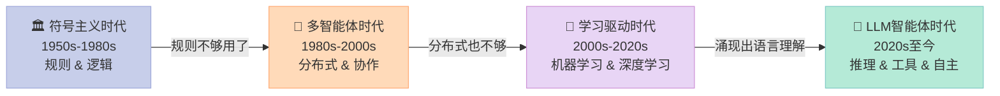
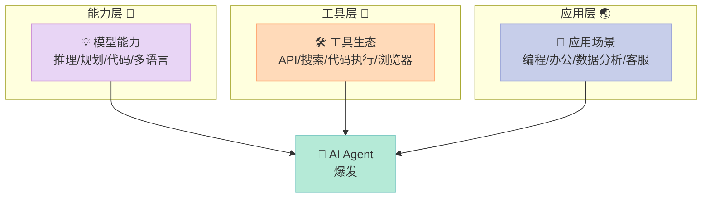

> **一句话结论：AI已经研究了近70年，但真正意义上的"智能体时代"是在2022年之后才突然爆发的——不是因为某一项单独的技术突破，而是三股力量同时成熟后的共鸣。**

---

## 为什么AI已经60岁了，但Agent才刚刚开始？

1956年，一群科学家聚在达特茅斯学院，正式提出了"人工智能（Artificial Intelligence）"这个词。那一年，他们乐观地认为，用一个暑假的时间，就能让机器学会人类所有的智慧。

结果，他们用了将近70年。

这70年里，AI经历了两次"寒冬"（大量投入、没有成果、资金撤退），也经历了若干次"黄金时代"（专家系统、深度学习）。每一次人们都说"这次真的不一样"，然后撞上现实的墙。

但2022年之后发生的事情，真的不一样了。

**ChatGPT在5天内用户数破百万**——相比之下，Netflix用了3.5年，Facebook用了10个月。GPT-4、Claude、Gemini、Llama……大模型们的涌现速度之快，让整个行业来不及消化。在这基础上，AI Agent正在迎来属于自己的黄金时期。

为什么偏偏是现在？要回答这个问题，我们得先回顾这段漫长的历史。

---

## 一、智能体的进化时间线

70年的AI历史，可以清晰地分为四个阶段：

### 🏛️ 第一阶段：符号主义 + 专家系统（1950s-1980s）

早期的AI研究者相信，智能可以被**规则化**。只要把足够多的人类知识写成逻辑规则，机器就能变聪明。

代表作是**专家系统（Expert System）**。1970年代的MYCIN系统，通过600条诊断规则来推断血液感染疾病，准确率高达69%，甚至超过了部分住院医生。听起来很厉害？

问题在于：医学本来就有几万条规则，而且规则之间会互相矛盾。人工编写、维护这些规则的成本呈指数爆炸。**"知识获取瓶颈"成了专家系统最大的死穴。**

这个阶段的Agent概念：**如果符合条件X，则执行动作Y。** 确定、可预期，但极度脆弱。

### 🤝 第二阶段：多智能体系统（1980s-2000s）

研究者们想到：既然一个全知全能的大脑做不到，那能不能让多个"小脑"分工协作？

**多智能体系统（Multi-Agent System, MAS）**应运而生。每个Agent负责一个专门领域，它们通过通信协议相互配合。

这个想法在特定工业场景下很成功——工厂的物流调度、交通灯控制、分布式传感器网络。但在需要**语言理解和开放域推理**的场景下，它依然束手无策。一堆互不理解对方"意图"的小Agent，协作效率极其有限。

### 🧠 第三阶段：学习驱动（2000s-2020s）

这个阶段有两个里程碑：

**里程碑一：深度学习的崛起（2012年）**
AlexNet在ImageNet竞赛上，以碾压性优势击败传统方法，错误率从26%降至16%。这证明：让机器自己从数据中**学习规则**，远比人工编写规则更有效。

**里程碑二：强化学习（Reinforcement Learning, RL）大放异彩**
2013年，DeepMind的DQN学会玩Atari游戏，很多游戏超过人类最高分。2016年，AlphaGo击败世界围棋冠军李世石。Agent不再需要编程规则，而是通过"试错+奖励"自学如何达成目标。

但强化学习的Agent有个致命弱点：**每换一个任务，就要从头训练。** 一个学会下围棋的Agent，对"帮我订机票"完全无从下手。**泛化能力**依然是障碍。

### 🚀 第四阶段：LLM + Agent时代（2020s至今）

这是真正的转折点。

| 年份 | 里程碑 |
|-----|--------|
| 2020 | GPT-3发布，1750亿参数，首次展示强大的零样本能力 |
| 2021 | GitHub Copilot公测，AI写代码成为现实 |
| 2022.03 | **WebGPT**：首个能使用搜索引擎的LLM |
| 2022.10 | **ReAct论文**：Reasoning + Acting，Agent范式的奠基论文 |
| 2022.11 | **ChatGPT**发布，5天破百万用户，AI进入主流视野 |
| 2023.03 | **GPT-4**发布，多模态、推理能力大幅提升 |
| 2023.03 | **AutoGPT**开源，一周10万Star，Agent概念爆火 |
| 2023.04 | **BabyAGI**：展示自主任务规划与执行 |
| 2024.01 | **OpenAI发布GPTs**，工具调用标准化 |
| 2025.01 | **DeepSeek-R1**发布，开源推理模型引发全球关注 |

---

## 二、关键里程碑深度解析

### WebGPT（2022）：Agent有了"眼睛"

微软和OpenAI合作的WebGPT，第一次让LLM能够**主动搜索网页、阅读内容、综合信息**来回答问题，而不只是靠训练数据中的知识。

这意义重大：它打破了LLM的"知识截止日期"限制，也开创了**"工具调用"**这个Agent核心范式。

### ReAct论文（2022）：Agent有了"思维框架"

Google的研究者Yao等人提出了ReAct框架——让LLM**交替进行推理（Reasoning）和行动（Acting）**，就像人类解决问题时"想一步做一步"。

这篇论文是目前引用量最高的Agent相关论文之一。它证明：**让LLM"说出自己的思考过程"，能显著提升任务成功率。**（第四章会详细实现这个框架）

### AutoGPT（2023）：Agent有了"自驱力"

AutoGPT是第一个大规模流行的"全自主"Agent项目。给它一个目标，它会自己分解任务、搜索信息、写代码、运行代码、自我纠错……

一周内GitHub Star破10万，这个数字说明了什么：**人们渴望一个能"自己把事情办完"的AI助手**，而不只是一个聪明的聊天机器人。

当然，AutoGPT也暴露了Agent的局限：容易陷入无限循环，有时会做出超出预期的操作，成功率在复杂任务上仍然偏低。

---

## 三、为什么Agent的黄金时代是现在？

不是1980年，不是2016年，偏偏是2022年以后。这背后是**三股力量同时成熟**：

**第一，模型能力达到了关键阈值。**
GPT-4首次在真实考试（律师资格考试、医学执照考试）中超过人类平均水平。这不是数字游戏，这代表LLM真正具备了**复杂推理和领域理解**能力——Agent的"大脑"终于够用了。

**第二，工具生态完成了基础建设。**
搜索API（Bing API、Google API）、代码执行沙箱、浏览器自动化（Playwright）、结构化输出（OpenAI Function Calling）……这些工具的存在，让Agent"有手可以用"。

**第三，应用需求已经到了临界点。**
信息爆炸 + 工作复杂度提升 + 人力成本上升，每个行业都在寻找降低重复劳动的方法。Agent恰好处在这个需求爆发点上。

---

## 四、对未来的预判：Agent会如何改变工作方式？

这里我要给出一个**明确的判断**，而不是"两边都有道理"的骑墙分析：

**Agent不会替代所有工作，但会让"信息密集型、流程清晰"的工作发生结构性变化。**

具体来说：

- **最先被深刻影响的**：软件开发（GitHub Copilot已证明）、数据分析、内容生成、客户服务
- **中期会被重塑的**：法律文件审阅、医疗影像初步诊断、财务报表分析
- **长期依然需要人的**：需要信任关系的决策、创意方向制定、道德判断、复杂谈判

一个实际例子：Devin（一个AI软件工程师Agent）在2024年展示了它能独立完成SWE-bench（真实软件工程问题集）中13.86%的任务，而GPT-4只能完成1.74%。这个数字在2025年还在快速增长。

**更重要的是**：即使Agent今天只能完成20%的任务，那也意味着——如果你的工作中有20%是机械重复的，这20%将很快消失。而剩下80%的工作，会因为工具的辅助而效率大幅提升。

---

## 五、下一步怎么学？

回顾这段历史，你会发现每一次AI范式的跃迁，都是因为"解决了上一代的核心痛点"：

- 专家系统解决了"纯逻辑推理"的问题，但卡在知识获取
- 深度学习解决了"模式识别"的问题，但缺乏泛化
- LLM解决了"语言理解和泛化"的问题，但缺乏行动能力
- Agent正在解决LLM的"行动能力"问题

**下一个瓶颈是什么？** 我认为是**可靠性**——让Agent在复杂长链任务中保持稳定的成功率。这是当前最热门的研究方向之一。

**推荐行动**：
1. 去GitHub搜索"awesome-ai-agents"，看看现在有哪些Agent项目在解决什么问题
2. 思考：你今天的工作里，有哪些任务符合"目标明确 + 步骤可重复"的Agent适用场景？
3. 下一章，我们会深入LLM的技术原理，理解这个"大脑"究竟是怎么工作的

---

> 📚 本文参考：[datawhalechina/hello-agents](https://github.com/datawhalechina/hello-agents) 第二章
