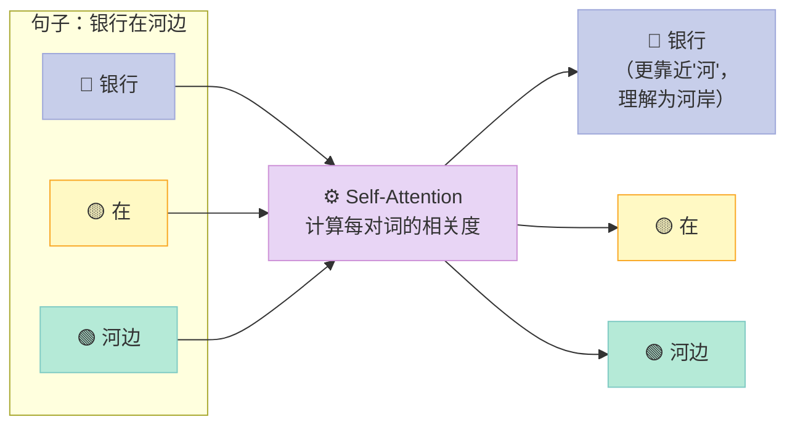

> **一句话结论：GPT不"理解"语言——它是一个极其精密的概率机器，通过预测"下一个词是什么"来完成几乎一切语言任务。但正是这个"不理解"，让它比任何"理解"的系统都更强大。**

---

<!-- more -->


## 为什么GPT能"读懂"你的问题？

你有没有想过：GPT是怎么知道你问的是什么意思？

它没有词典可以查。它没有语法书可以翻。它甚至没有一条规则说"动词+名词=动作"。

它只做一件事：**预测下一个词出现的概率。**

输入"今天天气"，它算出"不错"的概率比"很差"高，比"飞机"高得多。然后它选出最可能的词输出，再把"今天天气不错"作为新输入，预测下一个词……如此反复。

听起来很朴素？但把这个简单机制扩展到1750亿个参数、数万亿词的训练数据上，奇迹就发生了——**涌现（Emergence）**。模型开始"会"写代码、"会"解数学题、"会"分析法律文件，而这些能力没有被明确编程进去。

这就是大语言模型（Large Language Model, LLM）最迷人的地方：**一个极其简单的目标，在极大规模上产生了极其复杂的智能行为。**

对于Agent来说，LLM是它的"大脑"。理解LLM的工作原理，就是理解Agent的推理核心。

---

## 一、从"接龙游戏"到"万能模型"

### N-gram：最古老的"语言预测"

最早的语言模型叫**N-gram模型**，原理极其简单：统计历史语料，如果"今天天气"后面出现"不错"的频率最高，那就预测"不错"。

这个方法在小场景下有效，但有致命弱点：**只能看最近的N个词**。如果句子很长，开头的信息会被完全忽略。

### RNN：有了"记忆"，但记性不好

**循环神经网络（Recurrent Neural Network, RNN）**引入了"隐藏状态"，相当于一个可以传递的记忆：读完每个词，把这个词和之前的记忆合并，传给下一步。

比N-gram聪明很多，但有个问题：**序列太长时，早期信息会被后期信息覆盖**，就像人长时间没复习就会忘记最初学的东西。这叫"梯度消失"问题。

### Transformer：注意力是最关键的资源

2017年，Google Brain的研究者发表了那篇改变历史的论文——《**Attention is All You Need**》。

Transformer架构彻底抛弃了RNN的"顺序处理"，改为**所有词同时并行处理**，核心机制叫做**自注意力（Self-Attention）**。

---

## 二、自注意力：用餐厅点菜来理解

自注意力听起来很抽象，但它的逻辑其实很像你在餐厅点菜的过程。

想象你在看菜单，脑子里在做这样的事：

- 🍜 "我想吃辣的" → **查询（Query）**：你当前的诉求
- 🍛 "每道菜的辣度标签" → **键（Key）**：菜单提供的检索信息
- 🥘 "每道菜的实际味道" → **值（Value）**：匹配后你实际获取的内容

你会把"我的诉求"和"每道菜的标签"逐一比对，越匹配的菜，你对它的注意力权重越高，最终你的选择综合了所有菜按权重叠加的信息。

**这就是Self-Attention的本质**：让句子中的每个词，都去"关注"句子里所有其他词，按相关度分配注意力，然后综合这些信息更新自己的表示。



**这也是为什么Transformer能处理"多义词"问题**：同一个"银行"，在"存钱去银行"里，Self-Attention让它更关注"存钱"；在"银行边钓鱼"里，更关注"河、鱼"。同一个词，不同语境，不同含义，全靠注意力动态调整。

---

## 三、三个必须懂的核心概念

### Token：模型看到的基本单位

LLM处理的不是"字"也不是"词"，而是**Token（词元）**。

一个Token大约等于英文的3/4个单词，或者中文的1-2个字。"Hello World"会被切分为`["Hello", " World"]`；"你好世界"可能被切分为`["你好", "世界"]`。

为什么这个重要？因为**Token数量决定了处理成本**。GPT-4的API按Token计费，100个汉字大约消耗150个Token，而GPT-4每1000个Token大约收费0.03美元（输出价格）。

### Embedding：把词变成数字空间里的坐标

模型不能直接处理文字，需要把Token转化为数字向量——这就是**Embedding（嵌入）**。

神奇之处在于：语义相近的词，在Embedding空间里距离也近。
- "猫" 和 "狗" 的向量距离，远比 "猫" 和 "飞机" 近
- "北京" 和 "中国"，"东京" 和 "日本" 的关系，在向量空间里几乎等价

这让模型能做类比推理：`北京 - 中国 + 日本 ≈ 东京`。

### Context Window：模型的"工作记忆"

**上下文窗口（Context Window）**是模型在单次对话中能处理的最大Token数。

GPT-3.5的上下文窗口是4K Token（约3000个汉字），GPT-4 Turbo扩展到128K Token（约10万汉字，相当于一本中篇小说），Claude 3.5把它推到了200K Token。

对Agent来说，上下文窗口是关键瓶颈：**执行长任务时，历史信息容易超出窗口限制**，需要通过记忆模块进行压缩和管理。

---

## 四、专门为Agent服务的LLM能力

不是所有LLM能力对Agent都同等重要。以下三个是Agent最依赖的：

### 能力一：上下文学习（In-Context Learning, ICL）

你不需要重新训练模型，只需要在Prompt里给几个例子，模型就能学会新的格式或任务模式。

```python
# 示例：3个例子教会模型"情感分析"
prompt = """
判断以下评论的情感：正面还是负面？

评论：这家餐厅的食物太好吃了！
情感：正面

评论：等了一小时还没上菜，服务态度也很差。
情感：负面

评论：价格有点贵，但分量足够，味道还不错。
情感：正面

评论：快递慢得要死，包装也破了。
情感："""
```

**不需要任何训练**，模型会输出"负面"。这叫做**Few-Shot Learning（少样本学习）**。

### 能力二：思维链（Chain-of-Thought, CoT）

研究发现，让模型**说出推理步骤**，能显著提升复杂任务的准确率。

Google的研究者Wei等人（2022）在GSM8K数学题数据集上发现：使用CoT提示，GPT-3的准确率从17.9%跳升到56.9%。让模型"想清楚再说"，效果接近让模型参数量翻10倍。

```
# 不用CoT（直接问答）
问：商店有12个苹果，卖掉4个后买来7个，现在有多少？
答：15个  ← 可能出错

# 用CoT（逐步推理）
问：商店有12个苹果，卖掉4个后买来7个，现在有多少？让我们一步步思考。
答：
1. 开始有12个苹果
2. 卖掉4个后：12 - 4 = 8个
3. 买来7个后：8 + 7 = 15个
所以现在有15个苹果  ← 准确率更高
```

### 能力三：工具调用（Tool Calling / Function Calling）

这是LLM能成为Agent大脑的核心能力。模型不只是输出文字，还能输出**结构化的工具调用指令**。

OpenAI在2023年发布的Function Calling功能，让这个能力标准化了。

---

## 五、实战代码：Tool Calling完整示例

下面这段代码展示了如何用OpenAI API实现**工具调用**，这是构建Agent的核心技术。

> **运行条件**：需要 `pip install openai`，并设置 `OPENAI_API_KEY` 环境变量。

```python
import json
import os
from openai import OpenAI

client = OpenAI(api_key=os.environ.get("OPENAI_API_KEY"))

# ===== 定义工具函数 =====
def search_product(name: str, category: str = "all") -> dict:
    """模拟商品搜索（实际应接真实电商API）"""
    mock_data = {
        "机械键盘": {"price": 399, "stock": 25, "rating": 4.6, "category": "数码"},
        "Python编程书": {"price": 89, "stock": 100, "rating": 4.8, "category": "图书"},
        "降噪耳机": {"price": 1299, "stock": 8, "rating": 4.5, "category": "数码"},
    }
    # 模糊匹配
    for key, val in mock_data.items():
        if name in key or key in name:
            if category == "all" or val["category"] == category:
                return {"product": key, **val}
    return {"error": f"未找到商品：{name}"}

def check_user_balance(user_id: str) -> dict:
    """查询用户账户余额（模拟）"""
    mock_balances = {"user_001": 500.00, "user_002": 1500.00, "user_003": 89.50}
    balance = mock_balances.get(user_id, 0.00)
    return {"user_id": user_id, "balance": balance, "currency": "CNY"}

# ===== 工具描述（传给API）=====
tools = [
    {
        "type": "function",
        "function": {
            "name": "search_product",
            "description": "搜索商品信息，返回价格、库存和评分",
            "parameters": {
                "type": "object",
                "properties": {
                    "name": {"type": "string", "description": "商品名称或关键词"},
                    "category": {
                        "type": "string",
                        "description": "商品分类，可选：数码、图书、all（默认全部）",
                        "enum": ["数码", "图书", "all"]
                    }
                },
                "required": ["name"]
            }
        }
    },
    {
        "type": "function",
        "function": {
            "name": "check_user_balance",
            "description": "查询指定用户的账户余额",
            "parameters": {
                "type": "object",
                "properties": {
                    "user_id": {"type": "string", "description": "用户ID，格式如：user_001"}
                },
                "required": ["user_id"]
            }
        }
    }
]

# ===== 工具调度器 =====
tool_dispatch = {"search_product": search_product, "check_user_balance": check_user_balance}

def llm_with_tools(user_message: str, system_prompt: str = None):
    """
    带工具调用的LLM对话函数。
    支持多轮工具调用：模型可以连续调用多个工具再给出最终答案。
    """
    messages = []
    if system_prompt:
        messages.append({"role": "system", "content": system_prompt})
    messages.append({"role": "user", "content": user_message})

    print(f"\n{'='*60}")
    print(f"👤 用户：{user_message}")
    print('='*60)

    # 支持模型连续调用多个工具（最多5轮）
    for round_num in range(5):
        response = client.chat.completions.create(
            model="gpt-4o-mini",
            messages=messages,
            tools=tools,
            tool_choice="auto"
        )

        msg = response.choices[0].message

        # 没有工具调用 → 最终回答
        if not msg.tool_calls:
            print(f"\n🤖 回答：\n{msg.content}")
            return msg.content

        # 有工具调用 → 执行工具
        messages.append(msg)  # 记录模型的工具调用意图
        print(f"\n🔄 第{round_num + 1}轮工具调用：")

        for call in msg.tool_calls:
            func_name = call.function.name
            func_args = json.loads(call.function.arguments)

            print(f"  📞 调用 {func_name}({func_args})")
            result = tool_dispatch[func_name](**func_args)
            result_str = json.dumps(result, ensure_ascii=False)
            print(f"  📦 返回: {result_str}")

            # 把工具结果放回对话
            messages.append({
                "role": "tool",
                "tool_call_id": call.id,
                "content": result_str
            })

    return "超出工具调用轮数限制"


# ===== 测试 =====
if __name__ == "__main__":
    system = "你是一个购物助手。在回答前，你必须通过工具查询实时数据，不能凭猜测回答。"

    # 场景1：单工具查询
    llm_with_tools("机械键盘多少钱？还有货吗？", system)

    # 场景2：多工具联动
    llm_with_tools(
        "我是user_002，想买一个降噪耳机，请查一下我的余额够不够？",
        system
    )

    # 场景3：复杂推理 + 工具
    llm_with_tools(
        "帮我比较一下机械键盘和降噪耳机的性价比（评分/价格），哪个更划算？",
        system
    )
```

运行后你会看到，对于多工具联动的问题，模型会**先后调用两个工具**，然后综合结果给出答案——这正是LLM作为Agent大脑的工作方式。

---

## 六、Prompt Engineering：和LLM说话的艺术

既然LLM这么重要，怎么跟它沟通得更高效？

### System Prompt：给模型"定角色"

```python
# 普通对话
messages = [{"role": "user", "content": "帮我写一封邮件"}]

# 带System Prompt（效果显著更好）
messages = [
    {
        "role": "system",
        "content": "你是一个专业的商务邮件写手。你的邮件风格：简洁、礼貌、有说服力。"
                   "每封邮件都要包含：明确的主题行、核心诉求、期望的对方行动和时间节点。"
    },
    {"role": "user", "content": "帮我写一封催款邮件，对方欠了我们2万元，已经超期30天"}
]
```

### Few-Shot：用例子比说规则更有效

```python
# 不如直接给例子（Few-Shot效果更稳定）
system = """
将用户的自然语言查询转化为SQL。

示例：
输入：查询销售额最高的前10个产品
输出：SELECT product_name, SUM(sales) as total FROM orders GROUP BY product_name ORDER BY total DESC LIMIT 10;

输入：找出上个月没有下单的用户
输出：SELECT user_id FROM users WHERE user_id NOT IN (SELECT DISTINCT user_id FROM orders WHERE order_date >= DATE_TRUNC('month', CURRENT_DATE - INTERVAL '1 month'));
"""
```

### CoT提示：强制模型"说出思路"

```python
# 在复杂推理任务中，加上这句话能显著提升准确率
user_message = f"""
{问题内容}

请按照以下步骤思考：
1. 首先理解问题的核心要求
2. 分析已有的信息和约束条件
3. 逐步推导答案
4. 给出最终结论
"""
```

---

## 七、常见误区

### ❌ 误区一：更大的模型一定更好

GPT-4的参数量是GPT-3.5的数倍，但在很多**特定场景**下，经过专门微调的小模型（如7B参数的Code Llama）在代码任务上不输GPT-4，而成本只有1/10。选择模型要看场景，不能只看参数量。

### ❌ 误区二：上下文越长越好

上下文窗口越大，**计算成本越高，推理速度越慢**。更关键的是，研究发现LLM在处理超长上下文时，中间部分的信息容易被忽略（"Lost in the Middle"问题，2023年研究发现）。长上下文是工具，不是万能药。

### ❌ 误区三：Prompt越详细越好

有时候，过于复杂的Prompt会让模型"迷失"，不如简洁清晰的指令。最好的Prompt是：**明确目标 + 必要约束 + 1-3个示例**。

---

## 八、下一步怎么学？

你现在理解了：
- LLM通过预测下一个词来工作，Transformer是它的架构基础
- Self-Attention让它能理解词与词之间的关系
- Token、Embedding、Context Window是三个核心概念
- In-Context Learning、Chain-of-Thought、Tool Calling是Agent最依赖的能力
- Prompt Engineering是与LLM高效沟通的技术

**推荐行动**：
1. 运行上面的Tool Calling代码，观察模型如何自主决策调用哪个工具
2. 修改System Prompt，看不同角色设定如何改变模型输出风格
3. 下一章，我们将用这些知识，从零实现三种经典的Agent范式：ReAct、Plan-and-Solve、Reflection

---

> 📚 本文参考：[datawhalechina/hello-agents](https://github.com/datawhalechina/hello-agents) 第三章
