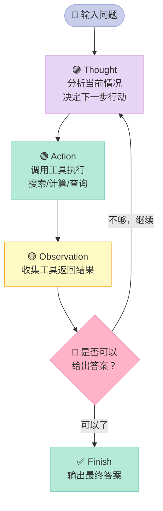
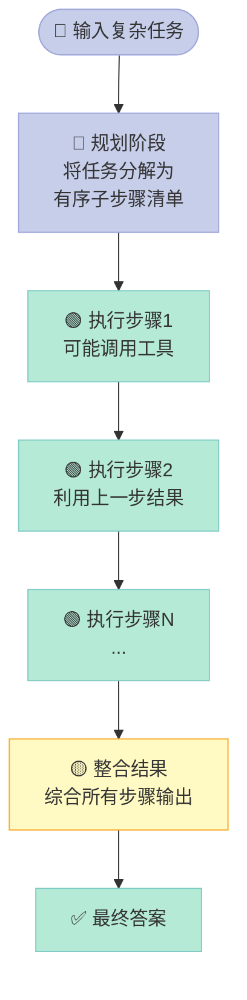
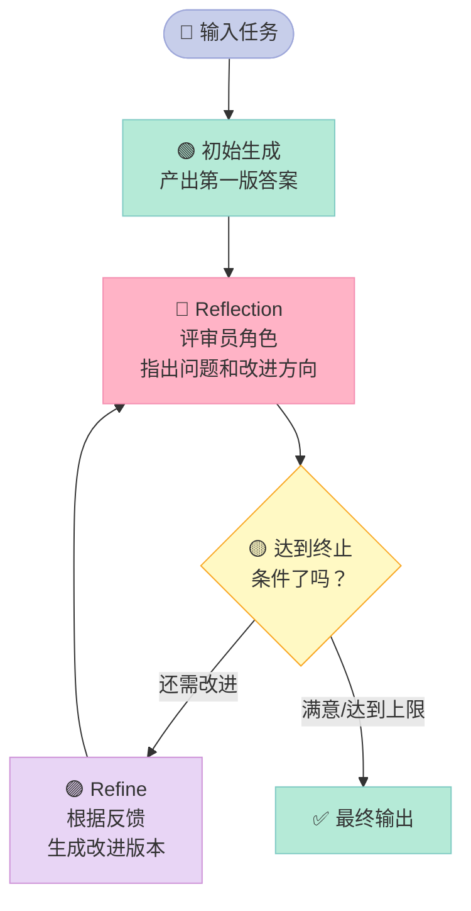
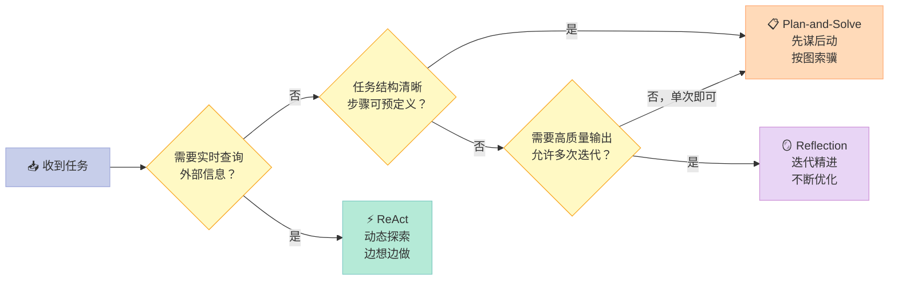

> **一句话结论：Agent"想太多"绝对是优点——关键是用对思考方式。ReAct适合动态探索，Plan-and-Solve适合结构化任务，Reflection适合精益求精，三种范式各有其战场。**

---

## Agent"想太多"是优点还是缺点？

有人测试AutoGPT，让它"帮我规划一次东京旅行"，结果它连续思考了47步，期间查了天气、汇率、签证政策、各区域住宿评比、美食推荐……最后把用户的账户余额花了个七七八八，旅行计划还没出来。

这就是初代Agent最典型的"想太多"综合征：**没有方法论的自主思考，比没有思考更危险。**

但真正的问题不是"想多想少"，而是**用什么框架想**。

2022-2023年间，AI研究界提出了三种经典的Agent推理范式，它们从不同角度解决了"Agent该怎么想"的问题：

- **ReAct**：边想边做，像侦探破案
- **Plan-and-Solve**：先谋后动，像厨师做菜
- **Reflection**：做完复盘，像运动员看回放

今天，我们不只讲理论，还要从零实现它们。

---

## 一、三种范式速览

先看一张全局对比表，建立整体认知：

| 维度 | ReAct | Plan-and-Solve | Reflection |
|------|-------|----------------|-----------|
| 核心思路 | 思考与行动交替进行 | 先规划再执行 | 执行后反思改进 |
| 最擅长场景 | 信息搜集、动态探索 | 结构化多步骤任务 | 代码生成、创意写作 |
| 工具依赖 | ✅ 强依赖外部工具 | ✅ 需要工具执行 | ⚠️ 可以纯LLM内部迭代 |
| 可解释性 | ✅ 高，每步有思考日志 | ✅ 高，计划清晰 | ⚠️ 中等 |
| 应对计划外情况 | ✅ 灵活适应 | ❌ 计划可能失效 | ⚠️ 需要多轮 |
| 计算成本 | ⚠️ 中等 | ⚠️ 中等 | ❌ 高（多轮调用）|
| 适合任务长度 | ⚠️ 中等复杂 | ✅ 长链任务 | ✅ 高质量输出任务 |

三种范式不是谁取代谁，而是**各有适用场景的工具箱**。

---

## 二、ReAct：侦探推理法

### 什么是ReAct？

**ReAct（Reasoning + Acting）**来自2022年Google的论文《ReAct: Synergizing Reasoning and Acting in Language Models》。

核心思想：让Agent**交替进行"思考"和"行动"**，就像侦探破案——看到线索（观察），推断意义（思考），去调查新线索（行动），再观察……

类比来说：你走进一个陌生城市找一家餐厅。你不会坐下来先规划"完整路线"，而是：
> "这条街好像没有，往左边看看" → 走过去 → "哦，有家店，看看评价" → 搜评价 → "评分4.7，合适！" → 进去

**边走边想，随机应变。** 这就是ReAct的精髓。

### ReAct的工作流程



每一轮循环，Agent都输出以下格式：
```yaml
Thought: [分析问题，决定下一步]
Action: tool_name[tool_input]
Observation: [工具返回的结果]
（如果答案足够了）
Action: Finish[最终答案]
```

### ReAct实战代码

下面是一个完整的、可直接运行的ReAct Agent：

> **运行条件**：需要 `pip install openai`，并设置 `OPENAI_API_KEY` 环境变量。

```python
import re
import os
import json
import random
from openai import OpenAI

client = OpenAI(api_key=os.environ.get("OPENAI_API_KEY"))

# ===== 工具定义 =====
def search(query: str) -> str:
    """模拟搜索引擎（实际应接Bing/Google API）"""
    mock_results = {
        "python最新版本": "Python 3.13于2024年10月发布，主要改进：更快的解释器（比3.11快25%）、改进的错误信息、实验性的无GIL模式。",
        "openai gpt-4o": "GPT-4o于2024年5月发布，是OpenAI最新的多模态旗舰模型，支持文本、图像、音频输入，响应速度比GPT-4 Turbo快2倍，价格降低50%。",
        "langchain": "LangChain是最流行的LLM应用框架，GitHub Star超过9万，支持构建Agent、RAG、工具链等应用。",
        "中国gdp 2024": "2024年中国GDP约为134.9万亿元人民币（约18.9万亿美元），增速约为5%，继续保持全球第二大经济体地位。",
    }
    # 简单的关键词匹配
    for key, val in mock_results.items():
        if any(k in query.lower() for k in key.split()):
            return val
    return f"关于'{query}'的搜索结果：该话题暂时没有更多最新信息（这是模拟环境）。"

def calculator(expression: str) -> str:
    """计算数学表达式"""
    try:
        allowed = set("0123456789+-*/().%, ")
        if not all(c in allowed for c in expression):
            return "错误：包含非法字符"
        result = eval(expression)  # noqa: S307
        return f"计算结果：{result}"
    except Exception as e:
        return f"计算错误：{e}"

# ===== ReAct Prompt模板 =====
REACT_SYSTEM_PROMPT = """你是一个智能助理，你必须通过"思考-行动-观察"的方式来解决问题。

可用工具：
- Search[查询词]：搜索互联网获取最新信息
- Calculator[数学表达式]：计算数学题，如 Calculator[25 * 8 + 100]
- Finish[答案]：当你找到最终答案时，使用这个动作结束任务

你必须严格按照以下格式输出，每次只执行一个Action：

Thought: 分析当前情况和需要做什么
Action: 工具名[输入内容]

等我给你Observation之后，你再继续输出下一轮的Thought和Action。
当你有足够信息时，使用Action: Finish[你的答案]结束。
"""

# ===== ReAct Agent核心逻辑 =====
class ReActAgent:
    def __init__(self, max_steps: int = 8):
        self.max_steps = max_steps
        # 工具映射
        self.tools = {"Search": search, "Calculator": calculator}

    def run(self, question: str) -> str:
        print(f"\n{'='*60}")
        print(f"❓ 问题：{question}")
        print('='*60)

        # 构建初始消息
        messages = [
            {"role": "system", "content": REACT_SYSTEM_PROMPT},
            {"role": "user", "content": f"请解决这个问题：{question}"}
        ]

        for step in range(self.max_steps):
            print(f"\n--- Step {step + 1} ---")

            # 调用LLM生成下一个Thought + Action
            response = client.chat.completions.create(
                model="gpt-4o-mini",
                messages=messages,
                temperature=0,  # 推理任务用低温度，减少随机性
                stop=["Observation:"]  # 在Observation前停止，让我们来填充
            )

            agent_output = response.choices[0].message.content.strip()
            print(f"🤖 模型输出：\n{agent_output}")

            # 解析Action
            action_match = re.search(r"Action:\s*(\w+)\[(.+?)\]", agent_output, re.DOTALL)
            if not action_match:
                print("⚠️ 未找到有效Action，终止")
                break

            tool_name = action_match.group(1)
            tool_input = action_match.group(2).strip()

            # 特殊处理：Finish动作
            if tool_name == "Finish":
                print(f"\n✅ 最终答案：{tool_input}")
                return tool_input

            # 执行工具
            if tool_name not in self.tools:
                observation = f"错误：未知工具 '{tool_name}'"
            else:
                observation = self.tools[tool_name](tool_input)

            print(f"👀 Observation：{observation}")

            # 把本轮对话追加进历史，让下一轮LLM看到完整上下文
            messages.append({"role": "assistant", "content": agent_output})
            messages.append({
                "role": "user",
                "content": f"Observation: {observation}\n\n请继续你的思考和行动："
            })

        return "已达到最大步数，未能完成任务"


# ===== 运行示例 =====
if __name__ == "__main__":
    agent = ReActAgent(max_steps=6)

    # 示例1：需要搜索+计算的复合问题
    agent.run("GPT-4o比GPT-4 Turbo便宜多少百分比？")

    # 示例2：多步信息收集
    agent.run("Python 3.13和2024年中国GDP分别是多少？")
```

---

## 三、Plan-and-Solve：厨师做菜法

### 什么是Plan-and-Solve？

**Plan-and-Solve（计划后执行）**来自2023年的论文《Plan-and-Solve Prompting》。

核心思想：先花时间制定**完整计划**，再逐步执行。类比厨师做一桌菜：先看菜谱（规划流程和顺序），再依序准备食材、下锅（执行步骤）。

区别于ReAct的"边走边想"，Plan-and-Solve认为：**好的计划能避免走弯路，提前识别依赖关系，减少无效探索。**

### Plan-and-Solve工作流程



### Plan-and-Solve代码示例

```python
import os
from openai import OpenAI

client = OpenAI(api_key=os.environ.get("OPENAI_API_KEY"))

def plan_and_solve(task: str) -> str:
    """
    Plan-and-Solve实现：
    阶段1 - 让LLM生成解决计划
    阶段2 - 按计划逐步执行并整合
    """
    print(f"\n{'='*60}")
    print(f"📋 任务：{task}")
    print('='*60)

    # ===== 阶段1：规划 =====
    print("\n📌 阶段1：生成解决计划...")
    plan_prompt = f"""你是一个任务规划专家。请将以下复杂任务分解为清晰的、有序的子步骤。
    
任务：{task}

要求：
- 列出3-6个具体的子步骤
- 每个步骤要清晰、可执行
- 注意步骤之间的依赖关系
- 格式：步骤1: ..., 步骤2: ..., 以此类推

只输出步骤列表，不要输出其他内容。"""

    plan_response = client.chat.completions.create(
        model="gpt-4o-mini",
        messages=[{"role": "user", "content": plan_prompt}],
        temperature=0
    )
    plan = plan_response.choices[0].message.content
    print(f"📝 执行计划：\n{plan}")

    # ===== 阶段2：执行 =====
    print("\n⚙️ 阶段2：按计划逐步执行...")
    solve_prompt = f"""你是一个擅长解决复杂问题的专家。

原始任务：{task}

解决计划：
{plan}

现在，请严格按照上述计划，一步一步地完成任务：
1. 对每个步骤，写出详细的执行过程和结论
2. 每个步骤的结果要作为下一步的输入
3. 最后综合所有步骤，给出完整的最终答案

请开始执行："""

    solve_response = client.chat.completions.create(
        model="gpt-4o-mini",
        messages=[{"role": "user", "content": solve_prompt}],
        temperature=0,
        max_tokens=2000
    )
    result = solve_response.choices[0].message.content
    print(f"\n✅ 执行结果：\n{result}")
    return result


if __name__ == "__main__":
    # 适合Plan-and-Solve的任务：结构清晰、步骤明确
    plan_and_solve(
        "帮我分析一下开设一家奶茶店的创业计划，"
        "包括：市场调研要点、启动资金估算（租金/设备/原料/人工）、"
        "盈亏平衡点计算，以及前3个月的风险点。"
    )
```

---

## 四、Reflection：运动员看回放法

### 什么是Reflection？

**Reflection（自我反思）**的核心思想来自认知科学——人类的学习不只是"做"，还要"复盘"。运动员看比赛录像、医生参加病例讨论、程序员做code review，都是反思机制在起作用。

对Agent来说，Reflection意味着：**先生成一个答案，让另一个"评审员角色"指出问题，然后根据反馈改进，循环迭代直到满意。**

这特别适合**代码生成、写作润色、方案设计**这类"没有唯一正确答案，但有优劣之分"的任务。

### Reflection工作流程



### Reflection代码示例

```python
import os
from openai import OpenAI

client = OpenAI(api_key=os.environ.get("OPENAI_API_KEY"))

def get_llm_response(prompt: str) -> str:
    """调用LLM的辅助函数"""
    response = client.chat.completions.create(
        model="gpt-4o-mini",
        messages=[{"role": "user", "content": prompt}],
        temperature=0.3
    )
    return response.choices[0].message.content

class ReflectionAgent:
    """
    Reflection Agent：通过"执行→反思→优化"循环提升输出质量。
    特别适合代码生成、文章写作等高质量输出任务。
    """
    def __init__(self, max_iterations: int = 3):
        self.max_iterations = max_iterations

    def run(self, task: str) -> str:
        print(f"\n{'='*60}")
        print(f"🎯 任务：{task}")
        print('='*60)

        # ===== 初始生成 =====
        print("\n📝 第0轮：生成初始版本...")
        init_prompt = f"""你是一位资深Python程序员。请根据以下要求编写Python代码。
要求：{task}
代码必须包含：完整的函数签名、docstring说明、类型注解，并遵循PEP 8规范。
只输出代码，不要解释。"""

        current_code = get_llm_response(init_prompt)
        print(f"🔵 初始版本：\n{current_code}")

        # ===== 迭代优化循环 =====
        for i in range(self.max_iterations):
            print(f"\n{'─'*40}")
            print(f"🔄 第{i+1}轮 Reflection...")

            # 反思：让"评审员"评价当前代码
            reflect_prompt = f"""你是一位严格的代码评审专家，专注于算法效率和代码质量。

原始任务：{task}

待评审代码：
```python
{current_code}
```text

请从以下角度评审：
1. **算法效率**：时间复杂度是否最优？有没有更好的算法？
2. **代码质量**：可读性、命名、边界条件处理是否到位？
3. **正确性**：是否有潜在的bug？

如果代码已经很好，回复"已达最优，无需改进"。
否则，指出最主要的1-2个问题，并给出明确的改进建议。"""

            feedback = get_llm_response(reflect_prompt)
            print(f"🔴 评审反馈：\n{feedback}")

            # 终止条件：评审员认为已经够好了
            if "无需改进" in feedback or "已达最优" in feedback:
                print("\n✅ 评审通过，迭代结束！")
                break

            # 优化：根据反馈生成改进版本
            refine_prompt = f"""你是一位Python高级工程师，正在根据代码评审反馈优化代码。

原始任务：{task}

上一版本代码：
```python
{current_code}
```text

评审反馈：
{feedback}

请根据评审反馈生成优化后的代码。只输出代码，不要解释。"""

            current_code = get_llm_response(refine_prompt)
            print(f"🟢 优化版本：\n{current_code}")

        print(f"\n{'='*60}")
        print(f"🏁 最终代码：\n{current_code}")
        return current_code


if __name__ == "__main__":
    agent = ReflectionAgent(max_iterations=2)

    # 任务：让Reflection帮我们从O(n²)的朴素算法迭代到O(n)的最优解
    agent.run("编写一个Python函数，找出给定列表中和为目标值target的两个数的索引（Two Sum问题）")
```

运行这段代码，你会看到一个有趣的现象：第一版往往是O(n²)的暴力解法，Reflection会指出"可以用哈希表优化到O(n)"，第二版就会变成更高效的实现。**这就是AI自我改进的缩影。**

---

## 五、三种范式的对比：何时用哪种？



| 任务类型 | 推荐范式 | 理由 |
|--------|---------|------|
| "搜一下XXX的最新消息并总结" | ReAct | 需要动态搜索，信息不确定 |
| "分析竞品并写一份市场报告" | Plan-and-Solve | 步骤清晰，结构化输出 |
| "帮我写一段Python爬虫代码" | Reflection | 代码质量可以迭代提升 |
| "帮我订机票+酒店+制定行程" | Plan-and-Solve + ReAct混合 | 先规划，执行时动态查询 |
| "写一篇技术博客" | Reflection | 内容质量可以通过反思打磨 |
| "回答一个即时的事实问题" | ReAct | 快速查找，不需要复杂规划 |

---

## 六、常见误区

### ❌ 误区一：ReAct就是最好的Agent范式

ReAct论文发表时轰动了圈子，但它并非万能。**在任务结构清晰、步骤已知的场景下，Plan-and-Solve往往成功率更高**——因为它避免了ReAct在探索过程中走弯路的问题。选错范式，不如没有范式。

### ❌ 误区二：Reflection迭代越多越好

每轮Reflection都要多消耗1-2次LLM调用。在GPT-4的API成本下，3轮Reflection的费用接近6次普通问答。**要为质量收益和成本之间找到平衡点**，而不是无限循环迭代。

### ❌ 误区三：这三种范式是互斥的

实际项目中，它们经常被组合使用。比如：先用Plan-and-Solve制定整体计划，执行阶段用ReAct动态调用工具，最终输出时用Reflection打磨质量。**框架是工具，不是教条。**

### ✅ 实用建议：从ReAct开始

如果你是第一次构建Agent，**从ReAct开始**。它结构简单、可解释性强、容易调试。等你对Agent的基本行为有了感觉，再考虑引入Plan-and-Solve或Reflection来提升特定场景的表现。

---

## 七、下一步怎么学？

恭喜！你已经掌握了三种经典Agent范式：
- **ReAct**：适合动态信息搜集，边想边做
- **Plan-and-Solve**：适合结构化任务，先谋后动
- **Reflection**：适合高质量输出，迭代精进

**推荐行动**：
1. 运行ReAct代码，观察Agent如何在多步骤中保持连贯推理
2. 运行Reflection代码，看AI如何把自己的代码从朴素解优化到最优解
3. 思考：你工作中最近遇到的一个复杂问题，适合用哪种范式来解决？
4. 进阶探索：[LangGraph](https://github.com/langchain-ai/langgraph)、[CrewAI](https://github.com/crewAIInc/crewAI) 等框架都是在这些经典范式上构建的，值得深入研究

---

> 📚 本文参考：[datawhalechina/hello-agents](https://github.com/datawhalechina/hello-agents) 第四章

---

## 📚 Hello Agents 系列导航

> 本文是《Hello Agents》开源系列第 **4/16** 章，适合 AI Agent 开发入门到进阶学习。

| 方向 | 章节 |
|:--|:--|
| ◀ 上一章 | [第03章：LLM原理：它不理解语言，却比你更会用语言](/2026/04/16/2026-04-16-hello-agents-ch03-llm-basics/) |
| 下一章 ▶ | [第05章：不会写代码也能搭AI Agent？低代码平台实战指南](/2026/04/16/2026-04-16-hello-agents-ch05-low-code-platforms/) |

<details>
<summary>📖 全部 16 章目录（点击展开）</summary>

1. [初识智能体：LLM会聊天，Agent能办事](/2026/04/16/2026-04-16-hello-agents-ch01-intro-to-agents/)
2. [智能体60年：从会下棋到能打工](/2026/04/16/2026-04-16-hello-agents-ch02-agent-history/)
3. [LLM原理：它不理解语言，却比你更会用语言](/2026/04/16/2026-04-16-hello-agents-ch03-llm-basics/)
4. [Agent思考三剑客：ReAct、Plan-and-Solve与Reflection](/2026/04/16/2026-04-16-hello-agents-ch04-classic-paradigms/) **← 当前**
5. [不会写代码也能搭AI Agent？低代码平台实战指南](/2026/04/16/2026-04-16-hello-agents-ch05-low-code-platforms/)
6. [当一个Agent不够用时：三大框架多智能体实战](/2026/04/16/2026-04-16-hello-agents-ch06-framework-practice/)
7. [为什么要造轮子？200行Python手写Agent框架](/2026/04/16/2026-04-16-hello-agents-ch07-build-your-framework/)
8. [Agent为何失忆？RAG与记忆系统深度解析](/2026/04/16/2026-04-16-hello-agents-ch08-memory-retrieval/)
9. [Context Engineering：让Agent真正聪明的隐秘武器](/2026/04/16/2026-04-16-hello-agents-ch09-context-engineering/)
10. [AI Agent如何与世界对话：MCP、A2A、ANP协议全解析](/2026/04/16/2026-04-16-hello-agents-ch10-agent-protocols/)
11. [用强化学习驯服AI Agent：GRPO与Agentic RL全解析](/2026/04/16/2026-04-16-hello-agents-ch11-agentic-rl/)
12. [你的Agent真的好用吗？智能体评估体系完全指南](/2026/04/16/2026-04-16-hello-agents-ch12-evaluation/)
13. [用Agent规划日本5日游，2分钟搞定2小时的活](/2026/04/16/2026-04-16-hello-agents-ch13-travel-assistant/)
14. [自动写研究报告的Agent：比ChatGPT深，但有盲点](/2026/04/16/2026-04-16-hello-agents-ch14-deep-research/)
15. [赛博小镇：25个AI角色自主生活，涌现了什么？](/2026/04/16/2026-04-16-hello-agents-ch15-cyber-town/)
16. [学完16章，现在从0构建你自己的Agent](/2026/04/16/2026-04-16-hello-agents-ch16-graduation/)

</details>

本章介绍 ReAct、Plan-and-Solve、Reflection 三种 Agent 思考范式，对比维度：三种范式内部 vs 相邻章节的 LLM 与框架实践 vs 工业界主流 Agent 框架的实现选择。

## 对比分析

### 一、本章概念 vs 相邻章节

| 维度 | ch04 思考范式 | ch03 LLM 原理 | ch05 低代码平台 | ch06 框架实战 |
|------|---------------|---------------|----------------|--------------|
| 抽象层级 | 思考模板 | 模型能力 | 拖拽工具 | 代码级框架 |
| 关注问题 | "如何决定下一步" | "为什么能决定" | "不写代码怎么做" | "怎么选框架" |
| 与本章互补 | —— | 提供推理能力 | 把范式封装成可视化 | 把范式封装成 SDK |

### 二、对比生产中类似框架

| 范式 | 工业对应 | 代表实现 | 适用任务 |
|------|----------|----------|----------|
| ReAct | Thought → Action → Observation 循环 | LangChain AgentExecutor、ReAct Agent | 需要调用工具的开放任务 |
| Plan-and-Solve | 先列计划再逐步执行 | LangChain PlanAndExecute、BabyAGI | 多步结构化任务 |
| Reflection | 生成 → 评审 → 改进 | Reflexion、CrewAI reviewer 角色 | 写作 / 代码 / 长链推理 |

### 三、本章观点的优缺点

优点：
- 把三种范式的"何时用"讲得清楚，避免乱选
- 用同一个旅行规划例子贯穿三种范式，对比直观

缺点：
- 没有覆盖 Tree of Thoughts、Self-Ask 等进阶方法
- 对失败回滚机制讨论较少

### 四、何时选

- 简单查 / 写任务：ReAct 足够
- 多步有依赖：Plan-and-Solve
- 需要质量把关：Reflection（可与 ReAct 嵌套使用）
