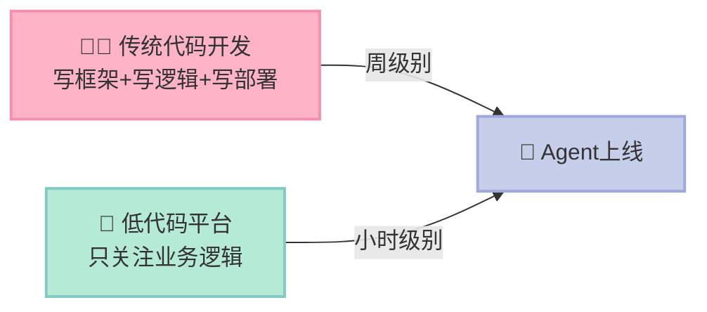
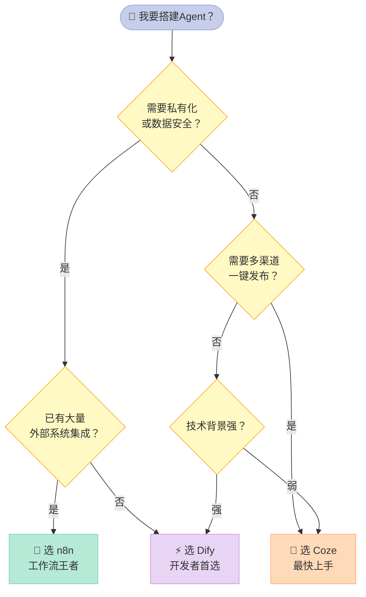
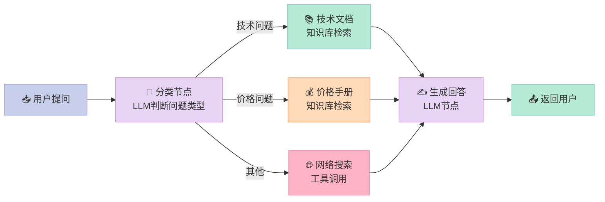
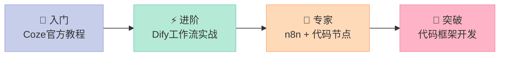

> 低代码平台不是"玩具"，而是让80%的Agent需求在不写一行代码的情况下落地的生产力工具——剩下20%的复杂需求，才是真正需要开发框架的地方。

---

<!-- more -->


## 为什么你应该关心低代码平台？

先问你一个问题：你上一次想做一个小工具，因为"要写代码太麻烦了"而放弃，是什么时候？

我敢打赌，不超过一个月前。

AI Agent的崛起本来是一件令人兴奋的事，但很多人打开LangChain文档的第一眼，就被密密麻麻的`pip install`和`from langchain import ...`劝退了。**技术的壁垒，正在把大量真正有创意的人挡在门外。**

低代码平台（Low-Code Platform）的出现，就是要打破这堵墙。用拖拉拽的方式连接节点，配置参数，点击运行——一个能查天气、搜资料、发邮件的AI Agent，可能只需要20分钟。

这篇文章，我们来认真聊聊三大主流低代码Agent平台：**Coze**（字节跳动）、**Dify**（开源自建）、**n8n**（工作流自动化），以及在不同场景下如何选择。

---

## 一、低代码平台到底解决了什么痛点？

写代码构建Agent，你需要面对：

- LLM API的调用与错误处理
- 工具（Tool）的注册与参数解析
- 多轮对话的状态管理
- 部署、监控、日志……

这些都是**纯粹的"脚手架"工作**，和你真正想解决的业务问题关系不大。低代码平台已经把这些全部打包好了。

想象你是一个厨师，想做一道菜。低代码平台就是那个已经备好了刀、砧板、调料架、洗碗机的现代化厨房——你只需要专注于"做什么菜"，而不是"怎么造厨具"。



---

## 二、三大平台，用人话解释

### 2.1 Coze：最易上手的"傻瓜相机"

**Coze**（扣子）是字节跳动旗下的Agent构建平台，国内版在coze.cn，国际版在coze.com。

它的定位很清晰：**面向普通用户，快速搭建并发布Bot**。

核心特点：
- **插件市场丰富**：内置100+预置工具（搜索、天气、新闻、代码执行等），直接拖拽使用
- **工作流可视化**：用节点图设计复杂的多步骤逻辑，不用写代码
- **一键发布多渠道**：做好的Bot可以直接发布到微信、飞书、抖音等平台
- **知识库集成**：上传PDF/文档，自动构建RAG知识库

类比：Coze就像**WordPress建站**——功能完整、主题丰富、上手快，但深度定制需要付出额外成本。

### 2.2 Dify：开发者最爱的"专业单反"

**Dify**是一个开源的LLM应用开发平台（GitHub: langgenius/dify），既可以使用云端版，也可以自部署。

它比Coze多了一个维度的灵活性：**代码层面的可控性**。

核心特点：
- **完全开源可自部署**：数据不出境，适合企业私有化
- **工作流（Workflow）引擎**：支持条件分支、循环、变量，逻辑更复杂
- **API优先**：每个应用都自动生成REST API，方便与现有系统集成
- **模型无关**：支持OpenAI、Claude、本地Ollama等20+模型

类比：Dify就像**Notion**——设计专业、扩展性强，但需要一点学习成本才能发挥全部威力。

### 2.3 n8n：工作流自动化的"瑞士军刀"

**n8n**（发音"n-eight-n"）起初是一个类Zapier的工作流自动化工具，近两年加入了AI能力，成为Agent领域的一匹黑马。

核心特点：
- **400+应用集成**：GitHub、Slack、Gmail、数据库……几乎你能想到的服务都有
- **触发器驱动**：可以定时、Webhook触发，真正实现自动化
- **代码节点**：在工作流中插入JavaScript/Python代码处理复杂逻辑
- **自部署免费**：云端版收费，但自部署完全免费无限制

类比：n8n就像**乐高积木**——每一块都是独立的连接器，你可以把任意系统像积木一样拼在一起，但需要你理解整体架构。

---

## 三、横向对比：选哪个？

| 维度 | Coze | Dify | n8n |
|------|------|------|-----|
| **上手难度** | ✅ 最简单 | ⚠️ 中等 | ⚠️ 中等 |
| **工作流复杂度** | ⚠️ 有限制 | ✅ 强大 | ✅ 最强 |
| **外部应用集成** | ⚠️ 插件市场 | ⚠️ 有限 | ✅ 400+ |
| **私有化部署** | ❌ 不支持 | ✅ 支持 | ✅ 支持 |
| **数据安全** | ⚠️ 云端存储 | ✅ 可自控 | ✅ 可自控 |
| **RAG/知识库** | ✅ 内置 | ✅ 内置 | ⚠️ 需配置 |
| **API对外暴露** | ⚠️ 有限 | ✅ 完整 | ✅ 完整 |
| **多渠道发布** | ✅ 原生支持 | ⚠️ 需配置 | ⚠️ 需配置 |
| **免费额度** | ✅ 较慷慨 | ✅ 有免费版 | ✅ 自部署免费 |
| **适合人群** | 产品/运营/个人 | 开发者/企业 | 技术型团队 |



---

## 四、实战：用 Dify 创建一个问答 Bot

我们来动手做一个"技术文档问答Bot"——上传一个PDF，然后可以用自然语言提问。这是企业最常见的Agent需求之一。

### Step 1：部署 Dify（Docker一键启动）

```bash
# 克隆仓库
git clone https://github.com/langgenius/dify.git
cd dify/docker

# 复制环境配置（无需修改即可启动）
cp .env.example .env

# 启动所有服务（首次需要下载镜像，约5分钟）
docker compose up -d

# 验证启动成功
docker compose ps
# 看到所有服务 Status 为 Up 即成功
```

访问 `http://localhost` 即可进入 Dify 界面。

### Step 2：配置模型（以 OpenAI 为例）

进入「设置 → 模型供应商」，填入你的 OpenAI API Key。Dify 支持 GPT-4、Claude、本地 Ollama 等，选一个你有 Key 的即可。

### Step 3：创建知识库

1. 点击顶部导航「知识库」→「创建知识库」
2. 上传你的 PDF 文件（比如一份产品手册）
3. 选择分块策略：**自动分块**（初学者选这个）
4. 选择 Embedding 模型：`text-embedding-ada-002`
5. 点击「保存并处理」，等待向量化完成（通常1-2分钟）

### Step 4：创建应用并关联知识库

```python
# Dify 每个应用都会暴露一个 API，可以这样调用：
import requests

DIFY_API_KEY = "app-xxxxxxxxxxxxxxxx"  # 在应用的 API 密钥处获取
DIFY_BASE_URL = "http://localhost/v1"

def ask_bot(question: str, user_id: str = "user-001") -> str:
    """向 Dify 问答 Bot 发送问题"""
    response = requests.post(
        f"{DIFY_BASE_URL}/chat-messages",
        headers={
            "Authorization": f"Bearer {DIFY_API_KEY}",
            "Content-Type": "application/json"
        },
        json={
            "inputs": {},
            "query": question,
            "response_mode": "blocking",   # blocking = 等待完整回复
            "conversation_id": "",          # 空字符串 = 新对话
            "user": user_id
        }
    )
    result = response.json()
    return result.get("answer", "未获取到回复")

# 测试
if __name__ == "__main__":
    answer = ask_bot("这个产品的主要功能是什么？")
    print(f"Bot回复: {answer}")
```

### Step 5：用工作流实现多步骤逻辑

如果想要更复杂的逻辑，比如"先判断问题类型，再分别路由到不同知识库"，可以在 Dify 的「工作流」模式中构建：



---

## 五、低代码的边界：能做什么，不能做什么

低代码平台不是万能的。在你投入大量时间配置之前，先想清楚这张表：

| 场景 | 低代码平台 | 建议 |
|------|-----------|------|
| 企业内部FAQ问答Bot | ✅ 完全胜任 | Dify首选 |
| 定时爬取数据并发邮件 | ✅ 完全胜任 | n8n首选 |
| 个人助手/客服Bot | ✅ 完全胜任 | Coze首选 |
| 复杂多Agent协作（如代码审查流水线） | ⚠️ 有局限 | 考虑LangGraph |
| 需要精细控制LLM推理过程 | ❌ 不适合 | 用代码框架 |
| 高并发生产环境（QPS > 100） | ⚠️ 需评估 | 关注平台SLA |
| 需要自定义复杂工具逻辑 | ⚠️ 受限 | 结合API节点 |

**一个残酷的真相**：低代码平台的工作流，本质上是对"常见Agent模式"的封装。一旦你的需求超出了这个封装范围，你就会开始在各种奇怪的配置选项里挣扎，效率反而不如直接写代码。

**我的建议**：把低代码平台当成**原型验证工具**。先用低代码跑通业务逻辑，验证需求可行，再决定是继续留在平台上，还是用代码框架重构一个更可控的版本。

---

## 六、下一步怎么学？

如果你想深入低代码Agent开发，推荐这个学习路径：



- **Coze 入门**：[coze.cn 官方文档](https://www.coze.cn/docs) - 跟着教程做完"第一个Bot"
- **Dify 实战**：[docs.dify.ai](https://docs.dify.ai/zh-hans) - 特别关注"工作流"章节
- **n8n 自动化**：[docs.n8n.io](https://docs.n8n.io) - 从"Trigger节点"开始理解事件驱动

当你做完3个真实项目之后，你会自然而然地感受到低代码的边界在哪里。那个时候，再去学代码框架，会事半功倍。

> 工具没有高低贵贱，只有合不合适。一个用 Coze 跑通了业务的Bot，比一个用 LangGraph 写了一半的框架，对用户的价值大得多。

---
## 📚 Hello Agents 系列导航

> 本文是《Hello Agents》入门系列第 **5** 章，共 16 章。

| 章节 | 标题 | 状态 |
|:---:|---|:---:|
| 第1章 | [初识智能体：LLM会聊天，Agent能办事](/2026/04/16/2026-04-16-hello-agents-ch01-intro-to-agents/) | ✅ |
| 第2章 | [智能体60年：从会下棋到能打工](/2026/04/16/2026-04-16-hello-agents-ch02-agent-history/) | ✅ |
| 第3章 | [LLM原理：它不理解语言，却比你更会用语言](/2026/04/16/2026-04-16-hello-agents-ch03-llm-basics/) | ✅ |
| 第4章 | [Agent思考三剑客：ReAct、Plan-and-Solve与Reflection](/2026/04/16/2026-04-16-hello-agents-ch04-classic-paradigms/) | ✅ |
| **第5章** | **[不会写代码也能搭AI Agent？低代码平台实战指南](/2026/04/16/2026-04-16-hello-agents-ch05-low-code-platforms/)** | 👉 当前 |
| 第6章 | [当一个Agent不够用时：三大框架多智能体实战](/2026/04/16/2026-04-16-hello-agents-ch06-framework-practice/) | ✅ |
| 第7章 | [为什么要造轮子？200行Python手写Agent框架](/2026/04/16/2026-04-16-hello-agents-ch07-build-your-framework/) | ✅ |
| 第8章 | [Agent为何失忆？RAG与记忆系统深度解析](/2026/04/16/2026-04-16-hello-agents-ch08-memory-retrieval/) | ✅ |
| 第9章 | [Context Engineering：让Agent真正聪明的隐秘武器](/2026/04/16/2026-04-16-hello-agents-ch09-context-engineering/) | ✅ |
| 第10章 | [AI Agent如何与世界对话：MCP、A2A、ANP协议全解析](/2026/04/16/2026-04-16-hello-agents-ch10-agent-protocols/) | ✅ |
| 第11章 | [用强化学习驯服AI Agent：GRPO与Agentic RL全解析](/2026/04/16/2026-04-16-hello-agents-ch11-agentic-rl/) | ✅ |
| 第12章 | [你的Agent真的好用吗？智能体评估体系完全指南](/2026/04/16/2026-04-16-hello-agents-ch12-evaluation/) | ✅ |
| 第13章 | [用Agent规划日本5日游，2分钟搞定2小时的活](/2026/04/16/2026-04-16-hello-agents-ch13-travel-assistant/) | ✅ |
| 第14章 | [自动写研究报告的Agent：比ChatGPT深，但有盲点](/2026/04/16/2026-04-16-hello-agents-ch14-deep-research/) | ✅ |
| 第15章 | [赛博小镇：25个AI角色自主生活，涌现了什么？](/2026/04/16/2026-04-16-hello-agents-ch15-cyber-town/) | ✅ |
| 第16章 | [学完16章，现在从0构建你自己的Agent](/2026/04/16/2026-04-16-hello-agents-ch16-graduation/) | ✅ |

