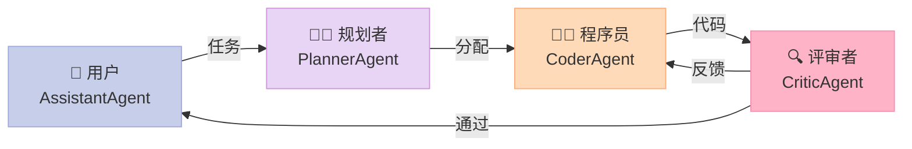
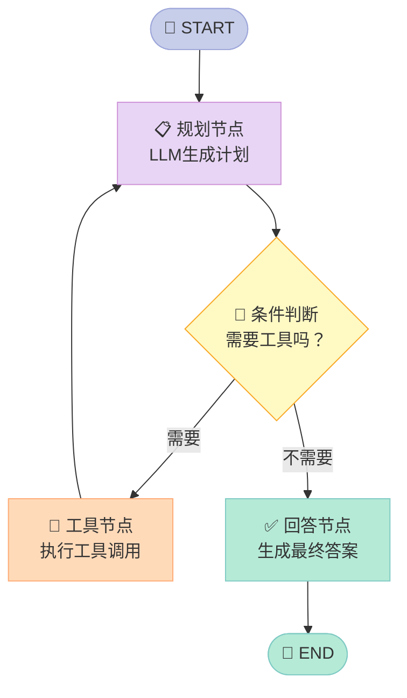
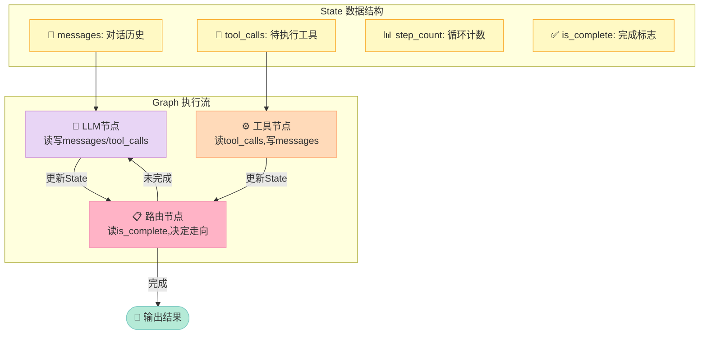
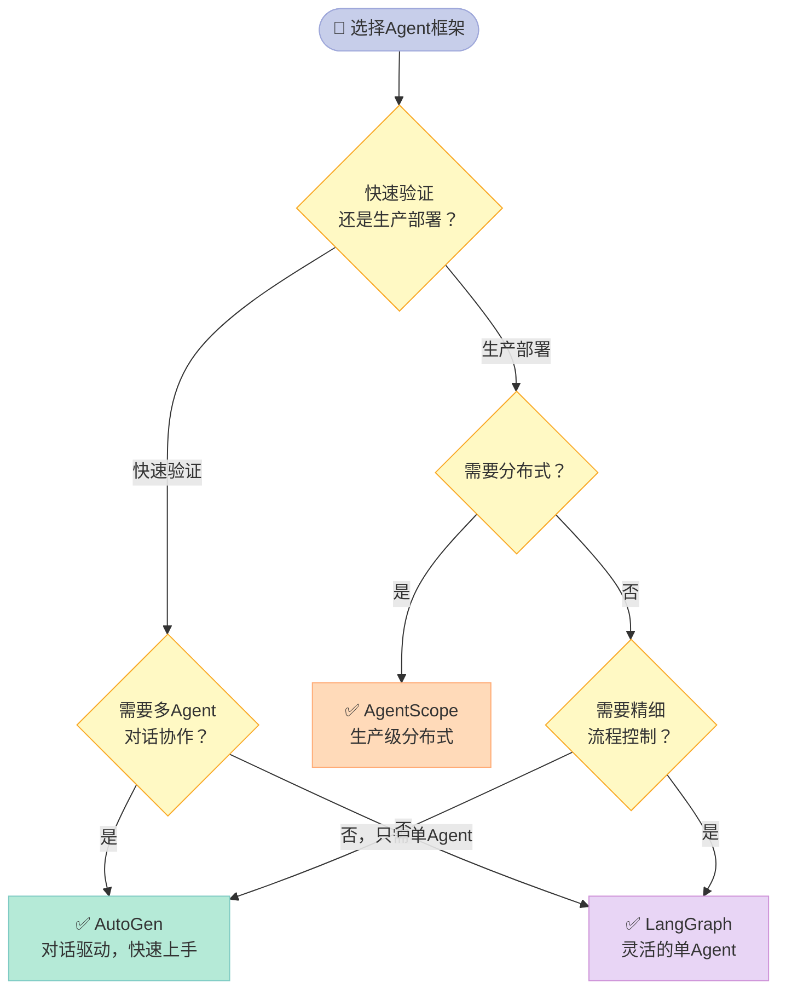

> 单个Agent就像一个全能但疲惫的员工——什么都会，但什么都不精。多Agent框架让你能组建一支分工明确的AI团队，处理真正复杂的任务。

---

## 为什么你应该关心多Agent框架？

2023年，OpenAI发布GPT-4之后，大家的第一反应是：**一个超强的AI助手**。但很快，工程师们发现了一个问题：

你让GPT-4又写代码、又做计划、又检查错误、又汇报结果……它会越来越"不清醒"。上下文窗口（Context Window）被填满，前面的约束被"遗忘"，输出质量开始下降。

这就像你让一个人同时担任项目经理、程序员、测试工程师和产品经理——他不会崩溃才怪。

**多Agent框架的核心洞见**：把一个大任务拆分给多个专职Agent，每个Agent只做一件事，通过结构化的"对话协作"完成整体目标。

现在市场上主流的三个框架——**AutoGen**（微软）、**AgentScope**（阿里）、**LangGraph**（LangChain团队）——各自有截然不同的设计哲学。选错框架，会让你在错误的抽象层浪费大量时间。

---

## 一、三大框架的设计哲学

### 1.1 AutoGen：对话即协作

**AutoGen**（微软研究院出品）的核心理念是：**Agent之间通过自然语言对话来完成协作**。

你定义几个Agent（每个有自己的System Prompt和工具），然后让他们开始"聊天"。框架自动管理对话流转、工具调用和终止条件。



### 1.2 AgentScope：分布式与可靠性优先

**AgentScope**（阿里巴巴出品）专注于**生产级别的可靠性**。它引入了`Msg`（消息对象）作为Agent间通信的统一格式，支持分布式部署，并内置了详细的日志和监控。

如果你的场景涉及大规模、高并发、需要追责的Agent系统，AgentScope的设计会让你少踩很多坑。

### 1.3 LangGraph：状态机驱动的精准控制

**LangGraph**（LangChain团队出品）是三者中**最底层、最灵活**的。它把Agent的执行过程建模为一个**有状态的图（Stateful Graph）**：

- **节点（Node）**：一个处理步骤（LLM调用、工具执行、条件判断）
- **边（Edge）**：节点之间的流转关系（条件边、固定边）
- **状态（State）**：在整个图中共享的数据结构



LangGraph的强大之处在于：你可以**精确控制每一步的状态流转**，包括循环（Tool调用后回到规划节点）、分支（根据工具结果决定下一步）和人工介入（在关键节点暂停等待人工确认）。

---

## 二、框架横向对比

| 维度 | AutoGen | AgentScope | LangGraph |
|------|---------|------------|-----------|
| **核心抽象** | Agent对话 | 消息传递 | 状态图 |
| **上手难度** | ✅ 简单 | ⚠️ 中等 | ⚠️ 较陡 |
| **灵活性** | ⚠️ 中等 | ⚠️ 中等 | ✅ 最高 |
| **生产可靠性** | ⚠️ 需额外工作 | ✅ 内置 | ✅ 稳定 |
| **分布式支持** | ❌ 有限 | ✅ 原生 | ⚠️ 需配置 |
| **人工介入（HITL）** | ⚠️ 有限 | ⚠️ 有限 | ✅ 原生 |
| **可视化调试** | ⚠️ 有限 | ✅ 内置Studio | ✅ LangSmith |
| **社区活跃度** | ✅ 非常活跃 | ⚠️ 增长中 | ✅ 非常活跃 |
| **适合场景** | 快速原型/研究 | 企业生产 | 精细控制 |
| **开源协议** | Creative Commons | Apache 2.0 | MIT |

---

## 三、LangGraph 状态图深度解析

LangGraph最难理解的概念是**状态（State）**。我用一个快递系统来类比：

想象你在管理一个快递分拣中心，每一个包裹（State）都有一张信息单：发件人、收件人、当前位置、处理历史。包裹流过一个个分拣台（Node），每个台只做一件事（扫码、称重、贴标签），完成后根据规则（Edge）送到下一个台。

**LangGraph的State就是这张信息单**，所有Node都能读写它，整个流程就是State不断演化的过程。



---

## 四、实战代码：AutoGen 两个Agent协作解题

下面是一个可以直接运行的例子：一个"数学老师"Agent和一个"学生"Agent协作解决数学问题。

```python
# 需要安装: pip install pyautogen
import autogen

# 配置LLM（使用OpenAI，也可以换成其他兼容接口）
llm_config = {
    "config_list": [
        {
            "model": "gpt-4o-mini",
            "api_key": "your-openai-api-key",  # 替换为你的Key
        }
    ],
    "temperature": 0.7,
}

# 定义"数学老师"Agent：负责讲解和验证
teacher = autogen.AssistantAgent(
    name="MathTeacher",
    system_message="""你是一位耐心的数学老师。
    当学生提出问题时，你要：
    1. 先分析问题类型
    2. 给出清晰的解题思路（不直接给答案）
    3. 验证学生的解答是否正确
    当你认为问题已经解决，回复中包含"TERMINATE"来结束对话。""",
    llm_config=llm_config,
)

# 定义"学生"Agent：负责提问和尝试解答
student = autogen.UserProxyAgent(
    name="Student",
    human_input_mode="NEVER",  # 全自动模式，不需要人工输入
    max_consecutive_auto_reply=5,  # 最多自动回复5次，防止无限循环
    is_termination_msg=lambda msg: "TERMINATE" in msg.get("content", ""),
    system_message="""你是一个认真的数学学生。
    当老师给出提示后，你要尝试按照提示解题，展示完整的计算过程。
    如果不理解，要追问具体步骤。""",
    llm_config=llm_config,
)

# 启动对话：学生向老师提问
if __name__ == "__main__":
    # 学生发起对话，提出问题
    student.initiate_chat(
        teacher,
        message="老师，我不会解这道题：一个等差数列，首项是3，公差是4，求第10项和前10项的和。",
    )
```

运行后，你会看到两个Agent自动进行多轮对话：老师给出解题思路，学生尝试解答，老师验证并纠错，直到问题解决。

---

## 五、LangGraph 实战：带状态的ReAct Agent

```python
# 需要安装: pip install langgraph langchain-openai
from typing import Annotated, TypedDict, Literal
from langchain_openai import ChatOpenAI
from langchain_core.messages import HumanMessage, AIMessage, BaseMessage
from langchain_core.tools import tool
from langgraph.graph import StateGraph, END
from langgraph.prebuilt import ToolNode
import operator

# 1. 定义State结构——这是整个Graph共享的"信息单"
class AgentState(TypedDict):
    messages: Annotated[list[BaseMessage], operator.add]  # add表示追加，不覆盖

# 2. 定义工具
@tool
def calculate(expression: str) -> str:
    """计算数学表达式，如 '2 + 3 * 4'"""
    try:
        result = eval(expression)  # 注意：生产环境应使用安全的表达式解析器
        return f"计算结果: {result}"
    except Exception as e:
        return f"计算错误: {e}"

@tool
def get_weather(city: str) -> str:
    """获取城市天气（模拟）"""
    # 实际使用时连接真实天气API
    weather_data = {
        "北京": "晴，15°C",
        "上海": "多云，20°C",
        "广州": "小雨，25°C",
    }
    return weather_data.get(city, f"未找到{city}的天气数据")

tools = [calculate, get_weather]
tool_node = ToolNode(tools)  # LangGraph内置的工具执行节点

# 3. 定义LLM（绑定工具）
llm = ChatOpenAI(model="gpt-4o-mini", temperature=0)
llm_with_tools = llm.bind_tools(tools)

# 4. 定义节点函数
def agent_node(state: AgentState) -> AgentState:
    """LLM节点：决定下一步动作"""
    response = llm_with_tools.invoke(state["messages"])
    return {"messages": [response]}

def should_continue(state: AgentState) -> Literal["tools", "end"]:
    """路由函数：决定是继续调用工具还是结束"""
    last_message = state["messages"][-1]
    # 如果LLM决定调用工具，就路由到tool节点
    if hasattr(last_message, "tool_calls") and last_message.tool_calls:
        return "tools"
    return "end"

# 5. 构建Graph
graph_builder = StateGraph(AgentState)

# 添加节点
graph_builder.add_node("agent", agent_node)
graph_builder.add_node("tools", tool_node)

# 设置入口和边
graph_builder.set_entry_point("agent")
graph_builder.add_conditional_edges(
    "agent",
    should_continue,
    {"tools": "tools", "end": END}
)
graph_builder.add_edge("tools", "agent")  # 工具执行完，回到agent节点

# 编译Graph
agent = graph_builder.compile()

# 6. 运行
if __name__ == "__main__":
    result = agent.invoke({
        "messages": [HumanMessage(content="帮我算一下 (15 + 27) * 3，然后告诉我北京的天气")]
    })
    # 打印最后一条消息（最终答案）
    print(result["messages"][-1].content)
```

---

## 六、如何选择框架？



**我的个人判断**：

- **学习成本 vs 控制力**的权衡是核心。AutoGen上手快但黑盒多，LangGraph透明但需要更多设计思考。
- 对于大多数国内企业应用，**LangGraph + 国产大模型（如通义千问、文心一言）**的组合是一个很好的起点：开源、可控、社区活跃。
- AgentScope是阿里的生产实践结晶，**如果你的场景有高并发需求**，值得认真评估。

---

## 七、下一步怎么学？

真正理解框架的最快方式，是**亲手实现一遍**。下一章（第七章）我们会从零开始，用200行Python代码构建一个自己的Agent框架——当你理解了框架内部的每一层抽象，再回头看AutoGen和LangGraph，会有完全不同的感受。

- **AutoGen 文档**：[microsoft.github.io/autogen](https://microsoft.github.io/autogen)
- **LangGraph 文档**：[langchain-ai.github.io/langgraph](https://langchain-ai.github.io/langgraph)
- **AgentScope 文档**：[agentscope.io](https://agentscope.io)

> 框架只是工具，清晰的任务分解才是多Agent系统的核心。一个设计糟糕的多Agent系统，比一个设计良好的单Agent系统更难调试、更不可靠。先把任务拆清楚，再选框架。
