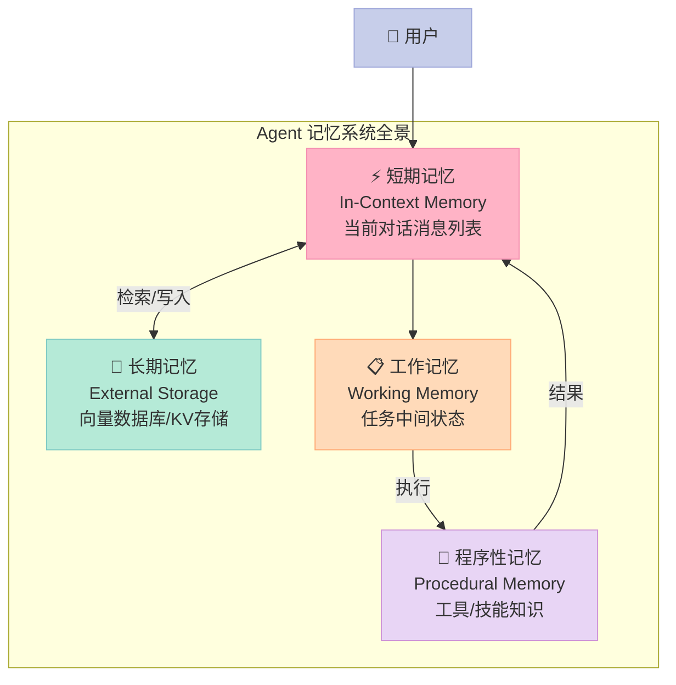
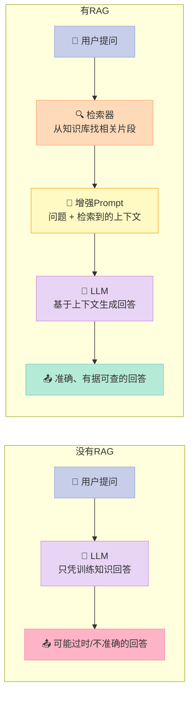
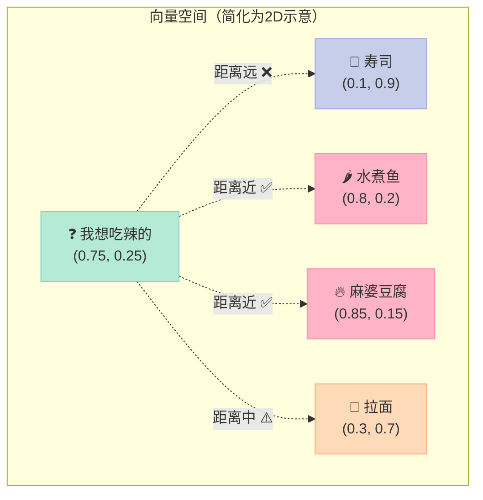
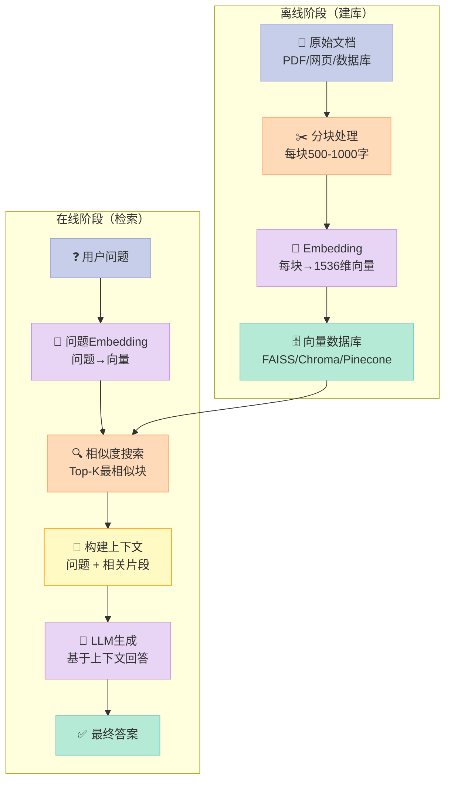
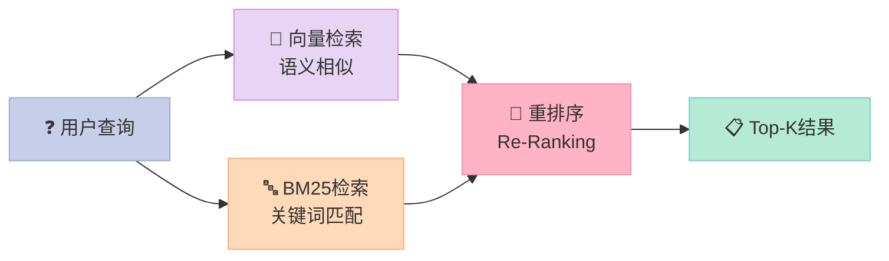
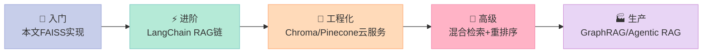

> Agent"失忆"不是Bug，是Context Window的物理硬限制。RAG（检索增强生成）不是让模型变聪明，而是给它配了一个能"随时翻书"的外挂记忆系统。

---

## 为什么你的Agent总是"忘事"？

你有没有经历过这样的场景：

你跟GPT聊了一个小时的项目规划，上下文里有详细的背景信息。结果过了几轮对话之后，它突然开始给出和之前矛盾的建议，或者说"我不记得您提到过……"

这不是模型在敷衍你，而是**Context Window（上下文窗口）的硬限制**在发挥作用。

GPT-4o的上下文窗口是128K tokens，约等于一本100页的书。听起来很多？但如果你的Agent需要：
- 记住几个月的对话历史
- 检索一个10万条记录的产品数据库
- 查阅一个500页的技术手册

128K tokens根本不够用。更重要的是，**把所有信息都塞进Context，推理速度会极慢，费用会极高**。

这就是为什么我们需要**记忆系统**——一个让Agent能"随时调取"相关信息，而不是把所有信息都随身携带的机制。

---

## 一、Agent的四种记忆类型

类比人类的认知系统，Agent的记忆可以分为四种：



| 记忆类型 | 对应人类记忆 | Agent实现 | 容量 | 速度 |
|---------|------------|----------|------|------|
| **短期记忆（In-Context）** | 工作记忆 | messages列表 | 有限（受context window限制） | ✅ 即时 |
| **长期记忆（External）** | 长期记忆 | 向量数据库/SQL | ✅ 几乎无限 | ⚠️ 需检索 |
| **工作记忆（Working）** | 注意力焦点 | Agent State | 有限 | ✅ 即时 |
| **程序性记忆（Procedural）** | 技能/习惯 | 工具定义/System Prompt | ⚠️ 有限 | ✅ 即时 |

**短期记忆**就是你每次对话里的消息列表，Session结束就清空了。

**长期记忆**是存在外部数据库里的信息，下次对话依然存在——这就是RAG的核心战场。

**工作记忆**是Agent在执行多步骤任务时维护的中间状态，类似于你解数学题时草稿纸上的推导过程。

**程序性记忆**是Agent"知道怎么做事"的能力，体现在工具定义和System Prompt里，基本是静态的。

---

## 二、RAG是什么？用餐厅类比解释

**RAG**（Retrieval-Augmented Generation，检索增强生成）是让LLM"按需取用"外部知识的技术。

想象你是一个餐厅服务员：
- **纯LLM模式**：你背下了整本菜谱（训练数据），但菜谱是去年的，新菜品你不知道
- **RAG模式**：你手边有一本实时更新的菜单，顾客问什么，你查什么，然后回答

**RAG不改变模型本身**，它在"模型推理"之前插入了一个"先查资料"的步骤。



---

## 三、向量数据库：Embedding是如何"找相似"的？

这是理解RAG最难的一关。为什么一段文字能和另一段文字比较"相似度"？

### Embedding（嵌入向量）是什么？

**Embedding**是把文本转换成一串数字（向量）的过程。这串数字捕捉了文本的"语义含义"。

用菜单类比：
- "我想吃辣的"→ 向量 `[0.8, 0.2, 0.1, ...]`（辣味权重高）
- "来一份水煮鱼"→ 向量 `[0.75, 0.25, 0.15, ...]`（辣味权重也高）
- "我要一杯绿茶"→ 向量 `[0.05, 0.9, 0.02, ...]`（辣味权重极低）

前两个向量很"接近"（数学上叫余弦相似度高），所以搜索"我想吃辣的"能找到"水煮鱼"。



现实中，Embedding向量通常有1536维（`text-embedding-ada-002`），能捕捉远比"辣度"复杂得多的语义信息。

### RAG的完整流程



---

## 四、实战代码：用 FAISS + OpenAI 实现最简 RAG

**FAISS**（Facebook AI Similarity Search）是Meta开源的高性能向量检索库，可以在本地运行，无需付费的向量数据库服务。

```bash
pip install faiss-cpu openai numpy
```

```python
"""
最简RAG实现：FAISS + OpenAI Embeddings + GPT
完整可运行，约100行代码展示RAG核心流程
"""
import json
import numpy as np
import faiss
from openai import OpenAI

client = OpenAI()  # 从环境变量 OPENAI_API_KEY 读取

# ============================================================
# 第一步：准备知识库（示例：公司产品FAQ）
# ============================================================
KNOWLEDGE_BASE = [
    {
        "id": "faq_001",
        "text": "我们的产品支持Windows、macOS和Linux操作系统。移动端支持iOS 14+和Android 8+。"
    },
    {
        "id": "faq_002",
        "text": "免费版每月有1000次API调用限制。专业版每月10万次，企业版无限制。价格分别是0元、99元/月、联系销售。"
    },
    {
        "id": "faq_003",
        "text": "数据安全方面，我们通过了ISO 27001认证，所有数据在传输时使用TLS 1.3加密，存储时使用AES-256加密。"
    },
    {
        "id": "faq_004",
        "text": "技术支持响应时间：免费版72小时，专业版8小时，企业版1小时。企业版还提供专属客户成功经理。"
    },
    {
        "id": "faq_005",
        "text": "我们提供RESTful API和Python、JavaScript、Go三种语言的官方SDK。WebSocket接口用于实时数据流。"
    },
    {
        "id": "faq_006",
        "text": "退款政策：购买后14天内无理由退款。超过14天如有质量问题可申请退款，需提供问题截图和描述。"
    },
]


# ============================================================
# 第二步：构建向量索引
# ============================================================
def get_embedding(text: str) -> list[float]:
    """调用OpenAI API获取文本的Embedding向量"""
    response = client.embeddings.create(
        model="text-embedding-ada-002",  # 1536维向量
        input=text,
    )
    return response.data[0].embedding


def build_index(documents: list[dict]) -> tuple[faiss.Index, list[dict]]:
    """
    将文档列表转换为FAISS索引
    返回: (faiss索引, 文档列表)
    """
    print("正在构建向量索引...")
    embeddings = []

    for i, doc in enumerate(documents):
        print(f"  处理文档 {i+1}/{len(documents)}: {doc['id']}")
        embedding = get_embedding(doc["text"])
        embeddings.append(embedding)

    # 转换为numpy数组（FAISS要求）
    embeddings_array = np.array(embeddings, dtype=np.float32)

    # 创建FAISS索引（使用余弦相似度：先归一化，再用内积）
    dimension = len(embeddings[0])  # 1536
    index = faiss.IndexFlatIP(dimension)  # IP = Inner Product（内积）

    # 归一化向量（使内积等价于余弦相似度）
    faiss.normalize_L2(embeddings_array)
    index.add(embeddings_array)

    print(f"✅ 索引构建完成，共 {index.ntotal} 个文档片段")
    return index, documents


# ============================================================
# 第三步：检索相关文档
# ============================================================
def retrieve(
    query: str,
    index: faiss.Index,
    documents: list[dict],
    top_k: int = 3,
) -> list[dict]:
    """
    根据查询检索最相关的文档片段
    返回top_k个最相关的文档，按相似度降序排列
    """
    # 将查询转换为向量
    query_embedding = np.array([get_embedding(query)], dtype=np.float32)
    faiss.normalize_L2(query_embedding)  # 归一化

    # 在FAISS索引中搜索
    scores, indices = index.search(query_embedding, top_k)

    # 组装结果
    results = []
    for score, idx in zip(scores[0], indices[0]):
        if idx >= 0 and score > 0.7:  # 过滤低相似度结果
            results.append({
                "document": documents[idx],
                "similarity": float(score),
            })

    return results


# ============================================================
# 第四步：生成增强回答
# ============================================================
def rag_answer(query: str, index: faiss.Index, documents: list[dict]) -> str:
    """
    RAG完整流程：检索 + 生成
    """
    # Step 1: 检索相关文档
    relevant_docs = retrieve(query, index, documents, top_k=3)

    if not relevant_docs:
        context = "（未找到相关知识库内容）"
    else:
        # Step 2: 构建上下文（将检索到的文档片段拼接成字符串）
        context_parts = []
        for item in relevant_docs:
            similarity = item["similarity"]
            text = item["document"]["text"]
            context_parts.append(f"[相似度: {similarity:.2f}] {text}")
        context = "\n".join(context_parts)

    # Step 3: 构建增强Prompt
    prompt = f"""你是一个产品客服助手。请根据以下知识库内容回答用户问题。
如果知识库中没有相关信息，请如实说明，不要编造答案。

【知识库内容】
{context}

【用户问题】
{query}

【回答要求】
- 基于知识库内容回答，不要添加知识库中没有的信息
- 回答简洁清晰
- 如果信息不足，直接说明"""

    # Step 4: 调用LLM生成最终答案
    response = client.chat.completions.create(
        model="gpt-4o-mini",
        messages=[{"role": "user", "content": prompt}],
        temperature=0.3,  # 低温度使回答更稳定、更忠实于检索内容
    )

    return response.choices[0].message.content


# ============================================================
# 主程序：运行RAG系统
# ============================================================
if __name__ == "__main__":
    # 构建索引（实际应用中应该持久化到磁盘，避免每次重建）
    index, docs = build_index(KNOWLEDGE_BASE)

    # 测试问题
    test_questions = [
        "你们支持什么操作系统？",
        "专业版的价格是多少？支持怎么响应？",
        "数据加密用什么算法？",
        "你们支持C++的SDK吗？",  # 这个问题知识库里没有答案
    ]

    print("\n" + "="*50)
    for question in test_questions:
        print(f"\n❓ 问题: {question}")
        answer = rag_answer(question, index, docs)
        print(f"💬 答案: {answer}")
        print("-" * 50)
```

---

## 五、记忆系统设计的陷阱和最佳实践

### ⚠️ 陷阱1：分块策略影响检索质量

RAG最常见的失败原因不是模型问题，而是**文档分块太粗糙**。

| 分块方式 | 问题 | 建议 |
|---------|------|------|
| 按固定字符数分块（500字） | 可能切断一个完整段落 | ✅ 使用重叠滑动窗口（每块500字，重叠100字）|
| 按段落分块 | 段落长度差异大 | ✅ 设置最大/最小长度限制 |
| 整篇文档作为一块 | 检索到的上下文太长 | ❌ 绝对不要这样做 |
| 按语义分块（章节/标题） | 最准确 | ✅ 优先选择，需要解析文档结构 |

### ⚠️ 陷阱2：只用向量检索，忽略关键词匹配

向量检索（语义搜索）擅长"找意思相近的"，但对精确的关键词（如型号、日期、专有名词）效果差。

**最佳实践**：**混合检索（Hybrid Search）**——向量检索 + BM25关键词检索，结果取并集后重排序。



### ⚠️ 陷阱3：把所有历史对话都存进向量库

有人会把每一轮对话都向量化存储，结果检索到一堆无关的历史碎片。

**正确做法**：
- 短期对话（本次session）：存在messages列表（短期记忆）
- 重要信息（用户偏好、关键结论）：提取后结构化存储
- 知识文档：才是向量库的主场

### ⚠️ 陷阱4：没有评估RAG的检索质量

很多项目上线后不知道RAG有没有真正起效。

**建议指标**：
- **召回率**：用户问的问题，知识库里有相关答案吗？（有多少被检索到？）
- **精确率**：检索到的片段，真的和问题相关吗？
- **答案忠实度**：LLM的回答是否基于检索内容，还是在"自由发挥"？

---

## 六、下一步怎么学？

记忆与RAG是Agent工程中最值得深入的方向之一，因为它直接决定了Agent能处理多复杂的知识场景。

**学习路径建议**：



| 阶段 | 推荐资源 |
|------|---------|
| **理解原理** | Pinecone的《What is RAG?》博客 |
| **动手实践** | LangChain官方RAG教程 |
| **工程最佳实践** | Llamaindex文档（比LangChain更聚焦RAG） |
| **前沿进展** | GraphRAG（微软）、Self-RAG论文 |

**一个行动建议**：今天就把本文的代码跑起来，换成你自己的PDF文档（用 `pypdf` 提取文字），问几个只有文档里才有答案的问题。当你第一次看到Agent准确引用文档内容回答时，你会真正理解RAG的价值所在。

> 记忆系统的本质，是解决"信息的时间性"问题：让Agent记住重要的事，忘掉不重要的事，在需要的时候找到相关的事。这和人类管理注意力的方式，其实并无二致。

---

## 📚 Hello Agents 系列导航

> 本文是《Hello Agents》开源系列第 **8/16** 章，适合 AI Agent 开发入门到进阶学习。

| 方向 | 章节 |
|:--|:--|
| ◀ 上一章 | [第07章：为什么要造轮子？200行Python手写Agent框架](/2026/04/16/2026-04-16-hello-agents-ch07-build-your-framework/) |
| 下一章 ▶ | [第09章：Context Engineering：让Agent真正聪明的隐秘武器](/2026/04/16/2026-04-16-hello-agents-ch09-context-engineering/) |

<details>
<summary>📖 全部 16 章目录（点击展开）</summary>

1. [初识智能体：LLM会聊天，Agent能办事](/2026/04/16/2026-04-16-hello-agents-ch01-intro-to-agents/)
2. [智能体60年：从会下棋到能打工](/2026/04/16/2026-04-16-hello-agents-ch02-agent-history/)
3. [LLM原理：它不理解语言，却比你更会用语言](/2026/04/16/2026-04-16-hello-agents-ch03-llm-basics/)
4. [Agent思考三剑客：ReAct、Plan-and-Solve与Reflection](/2026/04/16/2026-04-16-hello-agents-ch04-classic-paradigms/)
5. [不会写代码也能搭AI Agent？低代码平台实战指南](/2026/04/16/2026-04-16-hello-agents-ch05-low-code-platforms/)
6. [当一个Agent不够用时：三大框架多智能体实战](/2026/04/16/2026-04-16-hello-agents-ch06-framework-practice/)
7. [为什么要造轮子？200行Python手写Agent框架](/2026/04/16/2026-04-16-hello-agents-ch07-build-your-framework/)
8. [Agent为何失忆？RAG与记忆系统深度解析](/2026/04/16/2026-04-16-hello-agents-ch08-memory-retrieval/) **← 当前**
9. [Context Engineering：让Agent真正聪明的隐秘武器](/2026/04/16/2026-04-16-hello-agents-ch09-context-engineering/)
10. [AI Agent如何与世界对话：MCP、A2A、ANP协议全解析](/2026/04/16/2026-04-16-hello-agents-ch10-agent-protocols/)
11. [用强化学习驯服AI Agent：GRPO与Agentic RL全解析](/2026/04/16/2026-04-16-hello-agents-ch11-agentic-rl/)
12. [你的Agent真的好用吗？智能体评估体系完全指南](/2026/04/16/2026-04-16-hello-agents-ch12-evaluation/)
13. [用Agent规划日本5日游，2分钟搞定2小时的活](/2026/04/16/2026-04-16-hello-agents-ch13-travel-assistant/)
14. [自动写研究报告的Agent：比ChatGPT深，但有盲点](/2026/04/16/2026-04-16-hello-agents-ch14-deep-research/)
15. [赛博小镇：25个AI角色自主生活，涌现了什么？](/2026/04/16/2026-04-16-hello-agents-ch15-cyber-town/)
16. [学完16章，现在从0构建你自己的Agent](/2026/04/16/2026-04-16-hello-agents-ch16-graduation/)

</details>
