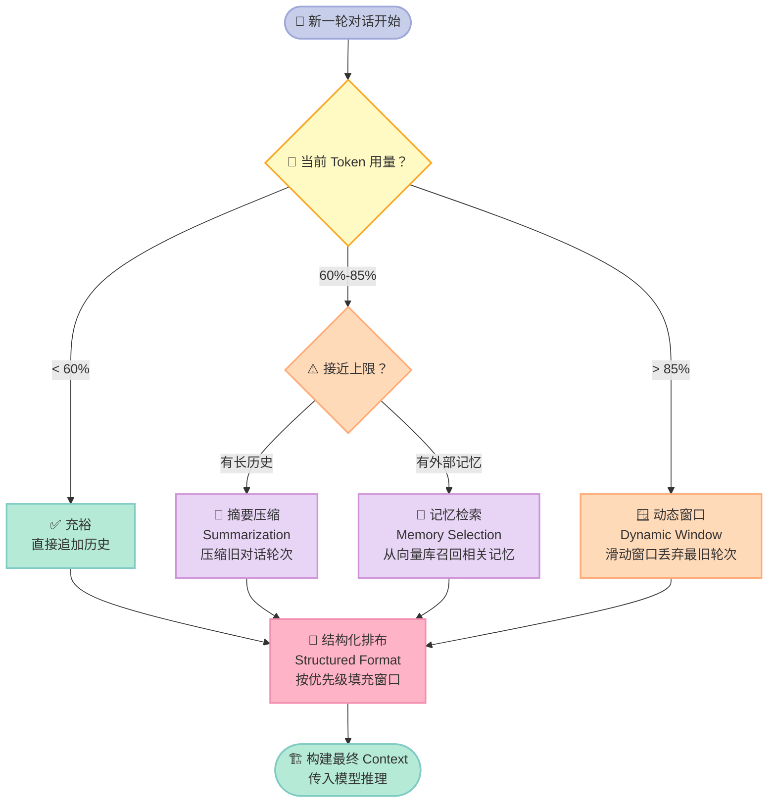
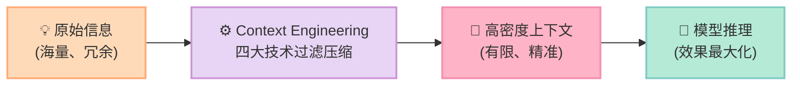

> **核心结论：Agent的智商上限，不是模型决定的，而是你塞进上下文窗口的信息质量决定的。**

---

同样的 GPT-4，同样的系统提示词，为什么有人用得出神入化，有人却一塌糊涂？

很多人把问题归结于"提示词没写好"。但如果你深入观察那些真正好用的 AI Agent，会发现它们的核心优势并不是一两句精妙的提示词——而是**对整个上下文窗口（Context Window）的精密管理**。

这就是本文要讲的 **上下文工程（Context Engineering）**，[hello-agents](https://github.com/youjingvs/hello-agents) 开源项目第九章的核心主题。

---

## 一、"提示词工程"和"上下文工程"，傻傻分不清楚？

很多人把这两个概念混为一谈，但它们其实处于完全不同的层次。

**提示词工程（Prompt Engineering）** 是一门手艺。你精心设计一段话，让模型给出你想要的回答。它是静态的、一次性的，就像厨师写了一张食谱。

**上下文工程（Context Engineering）** 是一套工程体系。它不只关心"这次说什么"，而是关心：哪些历史信息该保留？工具调用结果怎么压缩？当前任务和背景记忆如何结构化排布？它像整个厨房的管理系统——食材采购、存储、备料、出餐顺序，全部系统化。

| 维度 | 提示词工程 | 上下文工程 |
|------|-----------|-----------|
| 关注点 | 单次对话的措辞质量 | 整个会话生命周期的信息管理 |
| 时效性 | ⚠️ 一次性 | ✅ 持续动态 |
| 复杂度 | 低 | 高 |
| 适用场景 | 简单问答 | ✅ 长对话 Agent、多步骤任务 |
| 上限 | 受模型能力限制明显 | ✅ 可突破单次窗口限制 |

一个只会提示词工程的开发者，能做出好的聊天机器人；但一个掌握了上下文工程的开发者，才能做出真正可用的 AI Agent。

---

## 二、Context Window 是 Agent 的"工作记忆"

人类的工作记忆（Working Memory）有限——你能同时记住的事情大概是 7 ± 2 个组块。大语言模型（LLM）也一样，只是它的"记忆"叫做**上下文窗口（Context Window）**，以词元（Token）计量。

以实际数字感受一下规模：

- **GPT-4 Turbo**：128K tokens ≈ 约 **9.6 万汉字**，相当于一本中等篇幅的小说
- **Claude 3.5 Sonnet**：200K tokens ≈ 约 **15 万汉字**
- **Gemini 1.5 Pro**：1M tokens（但实际注意力会衰减）

听起来很大？对于简单问答确实够用。但 Agent 场景里，token 消耗是指数级的：

1. **系统提示词**：角色定义、工具描述，轻松 1000+ tokens
2. **工具调用记录**：每次 function call 的输入+输出，可能 500-2000 tokens
3. **历史对话**：多轮对话积累，每轮 200-500 tokens
4. **检索结果**：RAG 召回的文档片段，每次 1000-3000 tokens
5. **当前用户输入**：100-500 tokens

一个执行 10 步任务的 Agent，很容易在 128K 的窗口里撑爆。更糟糕的是，**上下文越长，模型对早期信息的注意力越弱**——这不是猜测，而是有实验数据支撑的"Lost in the Middle"现象。

所以，**不是 token 越多越好，而是有效 token 密度越高越好。**

---

## 三、四大核心技术

面对有限的上下文窗口，hello-agents 的 `ContextBuilder` 组件提炼出了四大核心策略。下面这张图展示了 Agent 在每轮对话前如何做出上下文管理决策：



### 技术一：摘要压缩（Summarization）

当历史对话积累过多时，不是简单删除，而是**让模型先总结前 N 轮的要点**，用一段摘要替换原始对话。这样既保留了关键信息，又大幅压缩了 token 占用。

关键细节：摘要的触发时机很重要——太早触发会丢失细节，太晚触发会溢出。通常在达到窗口 60%-70% 时触发最佳。

### 技术二：记忆检索（Memory Selection）

长期记忆不能全部塞入上下文，必须**按相关性动态召回**。这本质上是 RAG（检索增强生成）在 Agent 记忆系统中的应用。

只有与当前任务语义相关的记忆片段，才会被选入上下文。无关的记忆留在向量数据库里，不占窗口空间。

### 技术三：结构化格式（Structured Format）

原始对话是线性流，但上下文应该是**分层结构**：系统指令 > 长期记忆 > 历史摘要 > 工具定义 > 近期对话 > 当前输入。

不同信息有不同优先级，越重要的信息越应该靠近当前输入（模型注意力更集中的位置）。

### 技术四：动态窗口管理（Dynamic Window）

当 token 已经接近上限时，滑动窗口策略会**丢弃最旧的对话轮次**，只保留最近的 K 轮。这是最后的兜底机制，保证 Agent 不会因为上下文溢出而崩溃。

---

## 四、实战代码：带历史摘要压缩的对话管理器

下面是一个完整可运行的 Python 实现，演示了上下文工程的核心逻辑。安装依赖：

```bash
pip install "hello-agents[all]==0.2.8"
# 或者只安装 openai 用于独立运行本示例
pip install openai
```

```python
"""
context_manager_demo.py
演示带历史摘要压缩的对话管理器 —— Context Engineering 核心实践
"""

import os
from dataclasses import dataclass, field
from typing import Optional
from openai import OpenAI

# ─── 数据结构 ───────────────────────────────────────────────────────────────

@dataclass
class Message:
    """单条消息"""
    role: str   # "system" / "user" / "assistant"
    content: str

    def token_estimate(self) -> int:
        """粗略估算 token 数（英文约 4 字符/token，中文约 1.5 字符/token）"""
        return len(self.content) // 2


@dataclass
class ConversationManager:
    """
    带摘要压缩的上下文管理器
    
    核心策略：
    1. 追踪每条消息的 token 估算值
    2. 当总量超过阈值时，自动摘要压缩旧消息
    3. 始终保留 system prompt 和最近 N 轮对话
    """
    system_prompt: str
    max_tokens: int = 4000          # 模拟窗口上限（实际生产中用 128K）
    compress_threshold: float = 0.7  # 超过 70% 时触发压缩
    keep_recent_turns: int = 3       # 压缩时保留最近 N 轮
    history: list[Message] = field(default_factory=list)
    summary: Optional[str] = None   # 历史摘要（压缩后的结果）

    def _used_tokens(self) -> int:
        """计算当前上下文已使用的 token 估算值"""
        total = len(self.system_prompt) // 2
        if self.summary:
            total += len(self.summary) // 2
        for msg in self.history:
            total += msg.token_estimate()
        return total

    def _should_compress(self) -> bool:
        return self._used_tokens() > self.max_tokens * self.compress_threshold

    def _compress_history(self, client: OpenAI) -> None:
        """
        摘要压缩：将旧对话轮次压缩为一段摘要
        保留最近 keep_recent_turns 轮不压缩
        """
        if len(self.history) <= self.keep_recent_turns * 2:
            return  # 历史太短，无需压缩

        # 需要压缩的旧消息（保留最近 N 轮）
        compress_count = len(self.history) - self.keep_recent_turns * 2
        to_compress = self.history[:compress_count]
        self.history = self.history[compress_count:]

        # 构建摘要请求
        compress_prompt = "请用简洁的中文总结以下对话的关键信息，保留重要事实和决策，忽略闲聊细节：\n\n"
        for msg in to_compress:
            compress_prompt += f"[{msg.role}]: {msg.content}\n"

        if self.summary:
            compress_prompt = f"已有摘要：{self.summary}\n\n在此基础上继续补充：\n" + compress_prompt

        # 调用模型生成摘要
        response = client.chat.completions.create(
            model="gpt-4o-mini",
            messages=[{"role": "user", "content": compress_prompt}],
            max_tokens=500,
        )
        self.summary = response.choices[0].message.content
        print(f"  [ContextManager] 📝 已压缩 {compress_count} 条消息，摘要生成完毕")

    def build_context(self) -> list[dict]:
        """
        构建结构化上下文（Structured Format）
        优先级：system > 历史摘要 > 近期对话
        """
        messages = []

        # 1. System Prompt（最高优先级，始终保留）
        system_content = self.system_prompt
        if self.summary:
            # 将历史摘要嵌入 system prompt，靠近模型注意力中心
            system_content += f"\n\n【历史对话摘要】\n{self.summary}"
        messages.append({"role": "system", "content": system_content})

        # 2. 近期对话历史
        for msg in self.history:
            messages.append({"role": msg.role, "content": msg.content})

        return messages

    def chat(self, user_input: str, client: OpenAI) -> str:
        """发送一轮对话，自动管理上下文"""
        # 添加用户消息
        self.history.append(Message(role="user", content=user_input))

        # 检查是否需要压缩（Dynamic Window + Summarization）
        if self._should_compress():
            print(f"  [ContextManager] ⚠️  Token 用量 {self._used_tokens()}/{self.max_tokens}，触发摘要压缩...")
            self._compress_history(client)

        # 构建结构化上下文并调用模型
        context = self.build_context()
        token_usage = self._used_tokens()
        print(f"  [ContextManager] 📊 当前 Token 估算：{token_usage}/{self.max_tokens} "
              f"({token_usage/self.max_tokens*100:.1f}%)")

        response = client.chat.completions.create(
            model="gpt-4o-mini",
            messages=context,
            max_tokens=800,
        )
        assistant_reply = response.choices[0].message.content

        # 记录 assistant 回复
        self.history.append(Message(role="assistant", content=assistant_reply))
        return assistant_reply


# ─── 使用示例 ────────────────────────────────────────────────────────────────

def main():
    client = OpenAI(api_key=os.environ.get("OPENAI_API_KEY"))

    manager = ConversationManager(
        system_prompt=(
            "你是一位专业的 Python 编程助手，擅长解释算法和数据结构。"
            "回答要简洁清晰，必要时给出代码示例。"
        ),
        max_tokens=3000,       # 演示用，设置较小触发压缩
        compress_threshold=0.6,
        keep_recent_turns=2,
    )

    # 模拟多轮对话，演示自动压缩
    questions = [
        "Python 中的列表和元组有什么区别？",
        "什么时候应该用元组而不是列表？",
        "能给我一个用元组作为字典键的实际例子吗？",
        "现在告诉我，字典和集合在底层实现上有什么共同点？",
        "哈希冲突是怎么处理的？",
        "回顾一下，我们今天都讨论了哪些 Python 数据结构？",
    ]

    print("=" * 60)
    print("Context Engineering 演示：带摘要压缩的多轮对话")
    print("=" * 60)

    for i, question in enumerate(questions, 1):
        print(f"\n[第 {i} 轮] 👤 用户：{question}")
        reply = manager.chat(question, client)
        print(f"         🤖 助手：{reply[:120]}{'...' if len(reply) > 120 else ''}")

    print("\n" + "=" * 60)
    print(f"最终历史消息数：{len(manager.history)}")
    print(f"历史摘要：{'已生成' if manager.summary else '未生成'}")
    if manager.summary:
        print(f"摘要内容：{manager.summary[:200]}...")


if __name__ == "__main__":
    main()
```

这段代码的精髓在 `build_context()` 方法：**历史摘要被注入 system prompt 尾部**，而不是作为独立的对话消息存在。这样做有两个好处：

1. 摘要始终在模型的"主要注意力区域"内
2. 不会污染对话历史的角色（role）结构，避免模型混淆

---

## 五、什么放 System Prompt，什么放 User Message？

这是上下文工程中最高频的实践问题。很多开发者把所有内容都堆在 system prompt 里，导致更新困难；或者全部放 user message，又让模型角色感模糊。

正确答案是**按信息的时效性和权威性分层放置**：

| 内容类型 | System Prompt | User Message | 备注 |
|---------|:-------------:|:------------:|------|
| 角色定义（身份、口吻、限制） | ✅ | ❌ | 属于全局配置，不应每轮变化 |
| 工具列表（function definitions） | ✅ | ❌ | 工具集合相对稳定，放 system 减少重复 |
| 历史对话摘要 | ✅ | ⚠️ | 优先放 system 尾部；窗口极紧时可单独作为 user 消息前缀 |
| 当前任务描述 | ⚠️ | ✅ | 动态任务放 user；若任务贯穿全局则放 system |
| 临时检索结果（RAG 召回） | ❌ | ✅ | 每轮不同，属于即时上下文，必须放 user |
| 用户的实际输入 | ❌ | ✅ | 这是最基本的规则 |

⚠️ 特别注意：**System Prompt 不是越长越好**。模型对 system prompt 里靠前的内容权重更高，堆砌过多内容会导致"稀释效应"——什么都强调，等于什么都没强调。

---

## 六、总结：Context Engineering 的核心哲学

上下文工程的本质，是**在有限资源下做信息密度的最优化**。

它不是在问"我能告诉模型什么"，而是在问"在这有限的窗口里，哪些信息最值钱？"这是一个工程问题，需要测量、迭代和系统化思维。



**三个可立刻行动的建议：**

1. **量化你的 token 使用**：在每次 API 调用时记录实际 token 数，建立基线，找到你的"高危区间"
2. **给你的 Agent 加一个摘要触发器**：设定阈值（建议 60-70%），超过就自动压缩历史
3. **把 Context 当产品设计**：像设计 UI 布局一样，主动决定每类信息的优先级和位置

模型能力还在快速进化，但**上下文工程的核心原则——信息密度、结构化、动态管理——不会过时**。因为这本质上是信息论的问题，而不是 AI 特有的问题。

掌握了 Context Engineering，你才真正掌握了 AI Agent 的控制权。

---

*本文基于 [hello-agents](https://github.com/youjingvs/hello-agents) 开源项目第九章内容，安装：`pip install "hello-agents[all]==0.2.8"`*

---

## 📚 Hello Agents 系列导航

> 本文是《Hello Agents》开源系列第 **9/16** 章，适合 AI Agent 开发入门到进阶学习。

| 方向 | 章节 |
|:--|:--|
| ◀ 上一章 | [第08章：Agent为何失忆？RAG与记忆系统深度解析](/2026/04/16/2026-04-16-hello-agents-ch08-memory-retrieval/) |
| 下一章 ▶ | [第10章：AI Agent如何与世界对话：MCP、A2A、ANP协议全解析](/2026/04/16/2026-04-16-hello-agents-ch10-agent-protocols/) |

<details>
<summary>📖 全部 16 章目录（点击展开）</summary>

1. [初识智能体：LLM会聊天，Agent能办事](/2026/04/16/2026-04-16-hello-agents-ch01-intro-to-agents/)
2. [智能体60年：从会下棋到能打工](/2026/04/16/2026-04-16-hello-agents-ch02-agent-history/)
3. [LLM原理：它不理解语言，却比你更会用语言](/2026/04/16/2026-04-16-hello-agents-ch03-llm-basics/)
4. [Agent思考三剑客：ReAct、Plan-and-Solve与Reflection](/2026/04/16/2026-04-16-hello-agents-ch04-classic-paradigms/)
5. [不会写代码也能搭AI Agent？低代码平台实战指南](/2026/04/16/2026-04-16-hello-agents-ch05-low-code-platforms/)
6. [当一个Agent不够用时：三大框架多智能体实战](/2026/04/16/2026-04-16-hello-agents-ch06-framework-practice/)
7. [为什么要造轮子？200行Python手写Agent框架](/2026/04/16/2026-04-16-hello-agents-ch07-build-your-framework/)
8. [Agent为何失忆？RAG与记忆系统深度解析](/2026/04/16/2026-04-16-hello-agents-ch08-memory-retrieval/)
9. [Context Engineering：让Agent真正聪明的隐秘武器](/2026/04/16/2026-04-16-hello-agents-ch09-context-engineering/) **← 当前**
10. [AI Agent如何与世界对话：MCP、A2A、ANP协议全解析](/2026/04/16/2026-04-16-hello-agents-ch10-agent-protocols/)
11. [用强化学习驯服AI Agent：GRPO与Agentic RL全解析](/2026/04/16/2026-04-16-hello-agents-ch11-agentic-rl/)
12. [你的Agent真的好用吗？智能体评估体系完全指南](/2026/04/16/2026-04-16-hello-agents-ch12-evaluation/)
13. [用Agent规划日本5日游，2分钟搞定2小时的活](/2026/04/16/2026-04-16-hello-agents-ch13-travel-assistant/)
14. [自动写研究报告的Agent：比ChatGPT深，但有盲点](/2026/04/16/2026-04-16-hello-agents-ch14-deep-research/)
15. [赛博小镇：25个AI角色自主生活，涌现了什么？](/2026/04/16/2026-04-16-hello-agents-ch15-cyber-town/)
16. [学完16章，现在从0构建你自己的Agent](/2026/04/16/2026-04-16-hello-agents-ch16-graduation/)

</details>
