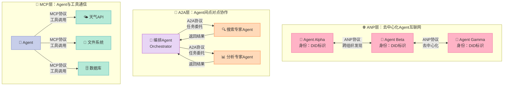
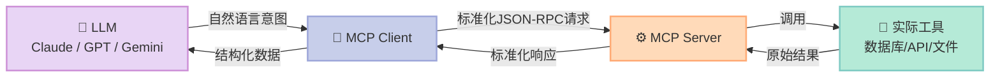
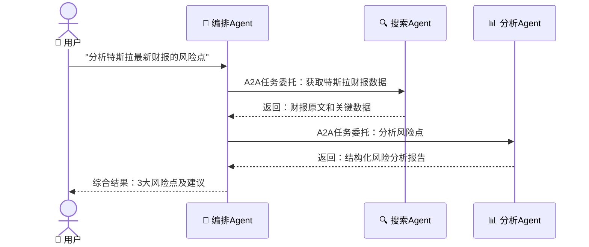
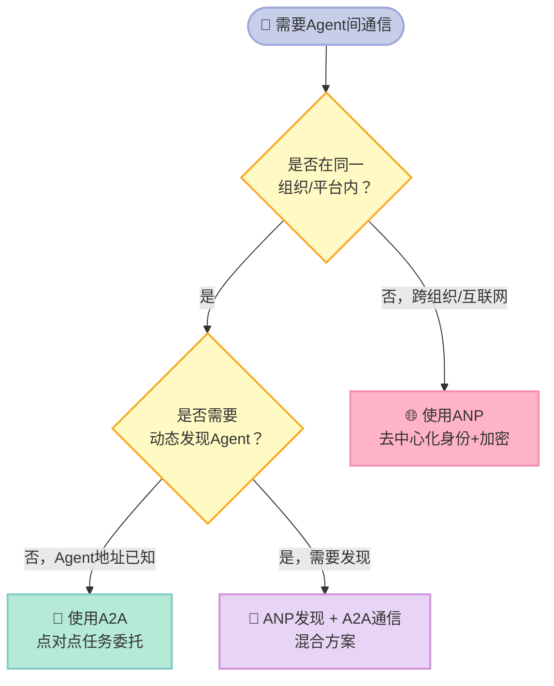

> **通信协议是 AI Agent 能力的天花板**——没有标准化的协议，再强的模型也只是孤岛上的天才。

---

<!-- more -->


## 前言

你有没有想过：当一个 AI Agent 说"我帮你查一下天气"时，它到底是怎么做到的？

它不是凭空"知道"天气，而是通过调用外部工具获取数据。**工具调用的方式，就是协议**。在大型语言模型（LLM）爆发的这两年，三种协议正在悄然定义 AI Agent 的能力边界：**MCP（模型上下文协议）**、**A2A（Agent间协议）**、**ANP（Agent网络协议）**。

读完这篇文章，你将理解：
- 为什么"协议"比"模型"更决定 Agent 的实用价值
- 三种协议各自解决什么问题，适用于哪些场景
- 如何用 Python 实现一个可运行的 MCP 工具服务器

---

## 一、通信协议：Agent进化的基础设施

### 没有标准之前，每个Agent都是孤岛

2023 年以前，每家大模型厂商都有自己的工具调用格式。OpenAI 的 Function Calling 长这样，Google 的 Gemini 长另一个样，Anthropic 又是第三套规范。开发者要支持三个平台，就得写三套适配代码。

这不是小问题。**工具调用是 Agent 与现实世界交互的唯一出口**。格式不统一，意味着：
- 同一个"查天气"工具，要为不同模型重写三遍
- 切换模型时，所有工具集成代码全部作废
- 社区积累的工具无法复用

这就是 **MCP（Model Context Protocol）** 要解决的问题。MCP 就像 USB 接口标准——在它出现之前，每台电脑的接口各不相同；有了 USB，任何设备插上去都能用。

### 三种协议，三个维度的"对话"

随着 Agent 系统越来越复杂，通信需求从单一工具调用扩展到了多 Agent 协作、乃至去中心化的 Agent 互联网。三种协议恰好对应三个层次：

| 层次 | 协议 | 解决的问题 |
|------|------|-----------|
| Agent ↔ 工具 | MCP | Agent 如何调用外部工具和服务 |
| Agent ↔ Agent | A2A | Agent 之间如何委托任务和协作 |
| Agent ↔ 网络 | ANP | 开放网络中 Agent 如何互相发现和通信 |

---

## 二、三种协议一图看懂



这张图揭示了一个关键规律：**三种协议不是竞争关系，而是层叠关系**。一个完整的 Agent 系统，通常三层都需要。

---

## 三、MCP深度解析：为什么它会成为行业标准？

### MCP 的核心定位

MCP 是 Anthropic 于 2024 年 11 月发布的开放协议，基于 **JSON-RPC 2.0** 构建。它的核心思想只有一句话：**把"工具的定义"和"工具的调用"彻底解耦**。

在 MCP 出现之前，工具调用是"紧耦合"的——工具的接口格式由模型厂商规定，换个模型就要重写工具。MCP 引入了一个中间层：



工具只需要适配一次 MCP 规范，就能被所有支持 MCP 的模型调用。这就是 USB 标准的威力。

### MCP 的三层能力

MCP 不只是"工具调用"，它定义了三种原语（Primitive）：

| 原语 | 英文 | 作用 | 举例 |
|------|------|------|------|
| **工具** | Tools | Agent 可调用的函数 | 查天气、执行代码、发邮件 |
| **资源** | Resources | Agent 可读取的数据源 | 文件内容、数据库记录、实时数据流 |
| **提示词** | Prompts | 可复用的提示词模板 | 代码审查模板、翻译模板 |

这三层设计非常精妙。**Tools 是"动词"，Resources 是"名词"，Prompts 是"语法"**。三者结合，Agent 就能以标准方式完成几乎任何任务。

### 谁在用 MCP？

MCP 发布后的采用速度令人印象深刻。截至 2025 年，以下主流产品已原生支持：

- **Claude Desktop**：Anthropic 官方客户端，开箱即用
- **Cursor**：AI 代码编辑器，MCP 是其核心架构
- **VS Code Copilot**：微软官方 AI 编程助手
- **Zed**：新兴代码编辑器

GitHub 上已有超过 1000 个开源 MCP Server，覆盖从 Slack、GitHub、PostgreSQL 到 Figma 的各类工具。**MCP 正在成为 AI 工具调用的事实标准**。

---

## 四、实战代码：实现一个MCP Tool Server

### 4.1 环境准备

```bash
# 安装 MCP Python SDK
pip install mcp
```

### 4.2 实现一个计算器 MCP Server

```python
# calculator_server.py
# 一个简单的计算器 MCP Server，提供加法和乘法工具

import asyncio
import json
from mcp.server import Server
from mcp.server.stdio import stdio_server
from mcp import types

# 初始化 MCP Server，名称是这个 Server 的唯一标识
app = Server("calculator")


@app.list_tools()
async def list_tools() -> list[types.Tool]:
    """向 MCP Client 声明本 Server 提供哪些工具"""
    return [
        types.Tool(
            name="add",
            description="将两个数字相加，返回它们的和",
            inputSchema={
                "type": "object",
                "properties": {
                    "a": {"type": "number", "description": "第一个数字"},
                    "b": {"type": "number", "description": "第二个数字"},
                },
                "required": ["a", "b"],
            },
        ),
        types.Tool(
            name="multiply",
            description="将两个数字相乘，返回它们的积",
            inputSchema={
                "type": "object",
                "properties": {
                    "a": {"type": "number", "description": "第一个数字"},
                    "b": {"type": "number", "description": "第二个数字"},
                },
                "required": ["a", "b"],
            },
        ),
    ]


@app.call_tool()
async def call_tool(
    name: str, arguments: dict
) -> list[types.TextContent]:
    """处理工具调用请求"""
    if name == "add":
        result = arguments["a"] + arguments["b"]
        return [
            types.TextContent(
                type="text",
                text=f"{arguments['a']} + {arguments['b']} = {result}",
            )
        ]
    elif name == "multiply":
        result = arguments["a"] * arguments["b"]
        return [
            types.TextContent(
                type="text",
                text=f"{arguments['a']} × {arguments['b']} = {result}",
            )
        ]
    else:
        raise ValueError(f"未知工具: {name}")


async def main():
    # 通过标准输入输出运行 Server（stdio 传输方式）
    async with stdio_server() as (read_stream, write_stream):
        await app.run(
            read_stream,
            write_stream,
            app.create_initialization_options(),
        )


if __name__ == "__main__":
    asyncio.run(main())
```

### 4.3 实现 MCP Client 调用上面的 Server

```python
# calculator_client.py
# 演示如何通过 MCP Client 调用上面的计算器 Server

import asyncio
from mcp import ClientSession, StdioServerParameters
from mcp.client.stdio import stdio_client


async def main():
    # 配置要连接的 Server（通过子进程启动）
    server_params = StdioServerParameters(
        command="python",
        args=["calculator_server.py"],
    )

    async with stdio_client(server_params) as (read, write):
        async with ClientSession(read, write) as session:
            # 初始化连接
            await session.initialize()

            # 列出所有可用工具
            tools_result = await session.list_tools()
            print("可用工具：")
            for tool in tools_result.tools:
                print(f"  - {tool.name}: {tool.description}")

            # 调用加法工具
            result = await session.call_tool("add", {"a": 15, "b": 27})
            print(f"\n调用 add(15, 27) 结果：{result.content[0].text}")

            # 调用乘法工具
            result = await session.call_tool("multiply", {"a": 6, "b": 7})
            print(f"调用 multiply(6, 7) 结果：{result.content[0].text}")


if __name__ == "__main__":
    asyncio.run(main())
```

运行方式：先在一个终端启动 Server（实际上 Client 会自动管理 Server 进程），直接运行：

```bash
python calculator_client.py
```

输出结果：

```
可用工具：
  - add: 将两个数字相加，返回它们的和
  - multiply: 将两个数字相乘，返回它们的积

调用 add(15, 27) 结果：15 + 27 = 42
调用 multiply(6, 7) 结果：6 × 7 = 42
```

这段代码揭示了 MCP 的核心优势：**Client 完全不需要知道 Server 的内部实现**。你可以把这个计算器 Server 换成一个真实的数据库查询服务，Client 代码几乎一行不用改。

---

## 五、A2A协议：让Agent之间"互相认识"

### Agent Card：Agent世界的"名片"

A2A（Agent-to-Agent Protocol）是 Google 于 2025 年初发布的协议，专注于**解决 Agent 之间的身份认证和任务委托**问题。

A2A 的核心概念是 **Agent Card（Agent名片）**——每个 Agent 都有一个标准化的自我描述文件（通常托管在 `/.well-known/agent.json`），声明：
- 我是谁（名称、描述）
- 我能做什么（技能列表）
- 如何联系我（API 端点）
- 安全要求（认证方式）

一个典型的 Agent Card 长这样：

```json
{
  "name": "数据分析专家Agent",
  "description": "专门处理数据清洗、统计分析和可视化任务",
  "url": "https://data-agent.example.com/",
  "skills": [
    {
      "id": "data_analysis",
      "name": "数据分析",
      "description": "对结构化数据进行统计分析",
      "examples": ["分析这份销售数据的趋势", "找出异常值"]
    }
  ],
  "authentication": {
    "schemes": ["Bearer"]
  }
}
```

### A2A 的任务委托流程

A2A 让"编排Agent"可以把任务分解后委托给专业Agent。流程如下：



这个流程的关键在于：**编排Agent不需要知道搜索Agent或分析Agent是用什么语言写的，也不需要知道它们部署在哪里**。只要双方都遵守 A2A 协议，就能无缝协作。

### A2A 的状态机

A2A 中的每个任务都有标准化的状态流转：

- `submitted`：任务已提交，等待处理
- `working`：Agent 正在处理中
- `input-required`：需要用户补充信息
- `completed`：任务成功完成
- `failed`：任务执行失败
- `canceled`：任务被取消

**状态机的标准化是 A2A 的隐藏亮点**。任何编排框架都能用统一方式追踪多个 Agent 的任务进度，而不需要为每个 Agent 单独开发状态管理逻辑。

---

## 六、ANP协议：去中心化的Agent互联网

### A2A 无法解决的问题

A2A 很好，但它有一个隐含假设：**你事先知道要连接哪个 Agent**。在企业内部部署的 Agent 集群里，这完全合理。但如果场景换成开放的互联网——你的 Agent 需要找到一个素未谋面的陌生 Agent 合作，怎么办？

这就是 **ANP（Agent Network Protocol）** 要解决的问题。ANP 基于 W3C 的 **DID（去中心化标识符，Decentralized Identifiers）** 标准，让每个 Agent 拥有一个不依赖任何中心化平台的身份。

### ANP 的三个核心能力

**1. 去中心化身份**

每个 Agent 有一个 DID，类似：`did:web:agent.example.com`。DID 不依赖任何中心化注册机构，Agent 可以在任何地方运行，身份依然可验证。

**2. 自描述能力**

基于 JSON-LD 的 Agent 描述文档，让 Agent 能够被其他 Agent 自动理解和发现，不需要人工对接文档。

**3. 端到端加密通信**

ANP 内置加密机制，Agent 之间的通信默认加密，防止中间人攻击。

### ANP vs A2A：什么时候用哪个？



ANP 目前的成熟度低于 MCP 和 A2A，更多处于标准制定阶段。但**它描绘的是 Agent 互联网的终极形态**：任何 Agent 都可以像网站一样被发现、被访问、被协作。

---

## 七、协议选型指南

三种协议的全面对比：

| 维度 | MCP | A2A | ANP |
|------|-----|-----|-----|
| **提出方** | Anthropic | Google | 开源社区 |
| **发布时间** | 2024年11月 | 2025年初 | 2024年（草案） |
| **通信对象** | Agent ↔ 工具/服务 | Agent ↔ Agent | Agent ↔ Agent网络 |
| **底层协议** | JSON-RPC 2.0 | HTTP/REST | HTTP + DID |
| **标准化程度** | ✅ 已成熟 | ⚠️ 快速演进 | ❌ 仍在草案阶段 |
| **生态成熟度** | ✅ 1000+ Server | ⚠️ 发展中 | ❌ 早期阶段 |
| **身份认证** | ⚠️ 依赖传输层 | ✅ 内置认证 | ✅ 去中心化DID |
| **跨组织支持** | ❌ 通常不需要 | ⚠️ 有限支持 | ✅ 核心特性 |
| **适用规模** | 单Agent + 多工具 | 多Agent协作 | 互联网规模 |
| **上手难度** | ✅ 低，文档完善 | ⚠️ 中等 | ❌ 高，概念复杂 |
| **推荐场景** | 工具集成首选 | 企业内多Agent | 未来互联网Agent |

### 实际项目中的选型逻辑

大多数开发者应该按这个顺序考虑：

1. **首先用 MCP**：给你的 Agent 接入工具（数据库、API、文件系统）。这是最基础的需求，MCP 生态最成熟，上手成本最低。

2. **当需要多 Agent 协作时，引入 A2A**：如果你发现单个 Agent 太臃肿，需要把任务分发给专门的子 Agent，这时候 A2A 是正确选择。

3. **只有在做开放平台时，才考虑 ANP**：如果你在构建一个让外部 Agent 接入的平台，或者需要跨组织的 Agent 协作，才需要研究 ANP。

---

## 八、总结与建议

### 三个核心判断

**第一，MCP 已经是工具调用的事实标准**。Anthropic、Microsoft、Cursor 等主流厂商的背书，加上 1000+ 开源 Server 的生态，让 MCP 的地位在短期内很难被撼动。如果你正在开发 AI 应用，现在就应该让你的工具支持 MCP。

**第二，A2A 代表多 Agent 系统的工程化方向**。单个 Agent 的能力终究有限，未来的复杂任务必然需要多个专业 Agent 协作完成。A2A 提供了一套经过深思熟虑的工程规范，值得在企业级 Agent 系统中认真对待。

**第三，ANP 是值得关注但不必急于投入的长期赌注**。去中心化 Agent 网络是一个激动人心的愿景，但目前标准仍不成熟，生态几乎空白。把它放在技术雷达上，每半年关注一次进展即可。

### 给开发者的行动建议

如果你是 **正在开发 AI 应用的工程师**：
- 立刻阅读 MCP 官方文档（modelcontextprotocol.io），动手实现一个 MCP Server
- 查看 [MCP Server 列表](https://github.com/modelcontextprotocol/servers)，看看是否有现成的可以直接复用

如果你是 **正在设计多 Agent 系统的架构师**：
- 研究 A2A 规范，特别是 Agent Card 的设计和任务状态机
- 用 A2A 思维重新审视你现有的 Agent 间通信方案

如果你是 **对未来 Agent 生态感兴趣的研究者**：
- 深入研究 DID 和 W3C 的去中心化身份标准
- 关注 ANP 项目（github.com/agent-network-protocol）的进展

---

协议的本质，是**共识**。当越来越多的工具、Agent、平台围绕同一套协议构建时，整个 Agent 生态的价值就会呈指数级增长。我们正处于这个共识形成的关键节点——现在理解并拥抱这些协议，是未来三到五年内最值得做的技术投资之一。

---

*本文基于 hello-agents 开源项目第10章。项目地址：[hello-agents on GitHub](https://github.com/datawhalechina/hello-agents)*

---
## 📚 Hello Agents 系列导航

> 本文是《Hello Agents》入门系列第 **10** 章，共 16 章。

| 章节 | 标题 | 状态 |
|:---:|---|:---:|
| 第1章 | [初识智能体：LLM会聊天，Agent能办事](/2026/04/16/2026-04-16-hello-agents-ch01-intro-to-agents/) | ✅ |
| 第2章 | [智能体60年：从会下棋到能打工](/2026/04/16/2026-04-16-hello-agents-ch02-agent-history/) | ✅ |
| 第3章 | [LLM原理：它不理解语言，却比你更会用语言](/2026/04/16/2026-04-16-hello-agents-ch03-llm-basics/) | ✅ |
| 第4章 | [Agent思考三剑客：ReAct、Plan-and-Solve与Reflection](/2026/04/16/2026-04-16-hello-agents-ch04-classic-paradigms/) | ✅ |
| 第5章 | [不会写代码也能搭AI Agent？低代码平台实战指南](/2026/04/16/2026-04-16-hello-agents-ch05-low-code-platforms/) | ✅ |
| 第6章 | [当一个Agent不够用时：三大框架多智能体实战](/2026/04/16/2026-04-16-hello-agents-ch06-framework-practice/) | ✅ |
| 第7章 | [为什么要造轮子？200行Python手写Agent框架](/2026/04/16/2026-04-16-hello-agents-ch07-build-your-framework/) | ✅ |
| 第8章 | [Agent为何失忆？RAG与记忆系统深度解析](/2026/04/16/2026-04-16-hello-agents-ch08-memory-retrieval/) | ✅ |
| 第9章 | [Context Engineering：让Agent真正聪明的隐秘武器](/2026/04/16/2026-04-16-hello-agents-ch09-context-engineering/) | ✅ |
| **第10章** | **[AI Agent如何与世界对话：MCP、A2A、ANP协议全解析](/2026/04/16/2026-04-16-hello-agents-ch10-agent-protocols/)** | 👉 当前 |
| 第11章 | [用强化学习驯服AI Agent：GRPO与Agentic RL全解析](/2026/04/16/2026-04-16-hello-agents-ch11-agentic-rl/) | ✅ |
| 第12章 | [你的Agent真的好用吗？智能体评估体系完全指南](/2026/04/16/2026-04-16-hello-agents-ch12-evaluation/) | ✅ |
| 第13章 | [用Agent规划日本5日游，2分钟搞定2小时的活](/2026/04/16/2026-04-16-hello-agents-ch13-travel-assistant/) | ✅ |
| 第14章 | [自动写研究报告的Agent：比ChatGPT深，但有盲点](/2026/04/16/2026-04-16-hello-agents-ch14-deep-research/) | ✅ |
| 第15章 | [赛博小镇：25个AI角色自主生活，涌现了什么？](/2026/04/16/2026-04-16-hello-agents-ch15-cyber-town/) | ✅ |
| 第16章 | [学完16章，现在从0构建你自己的Agent](/2026/04/16/2026-04-16-hello-agents-ch16-graduation/) | ✅ |

