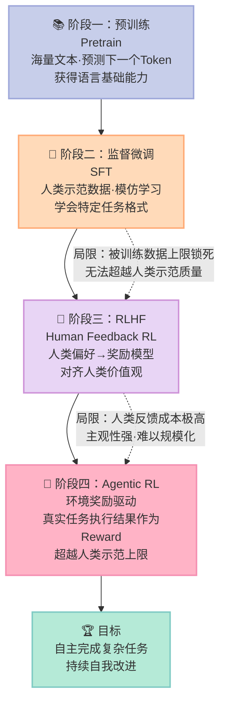
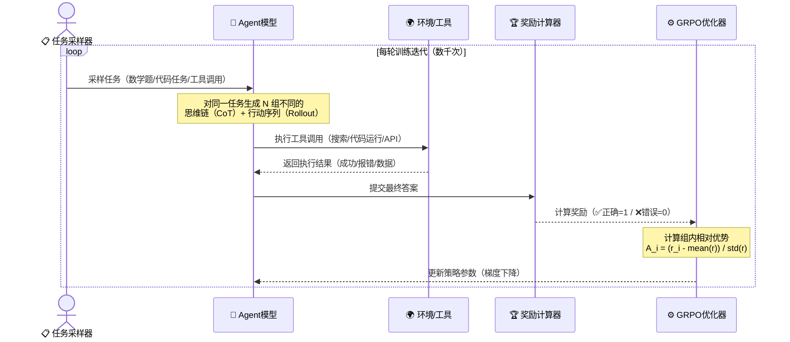
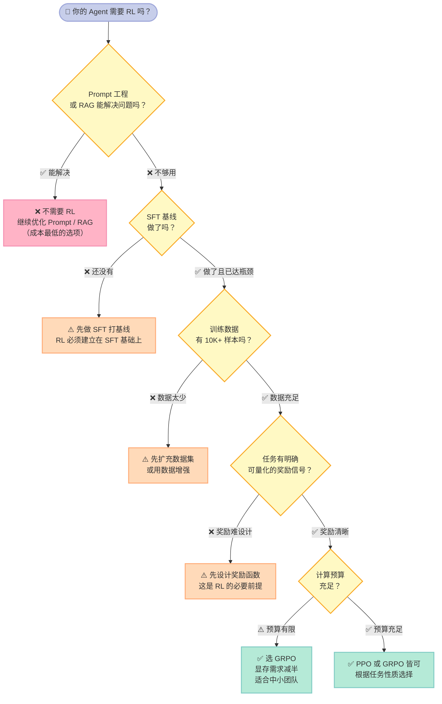

> **核心结论**：监督微调（SFT）教模型"模仿"人类答案，强化学习（RL）教模型在真实反馈中"超越"训练数据——这正是把普通 LLM 变成真正智能 Agent 的关键跨越。

---

## 为什么 GPT-4 已经很强了，还需要强化学习？

让我们先提一个让很多人困惑的问题：**GPT-4 能写代码、能做数学、能处理复杂对话，它已经这么厉害了，为什么还要再训练？**

答案藏在"正确答案"和"好答案"的差距里。

想象这个场景：你让 AI Agent 帮你规划一次出行，它需要调用地图 API、对比酒店价格、处理日期冲突、最终生成完整方案。这个过程中，"正确"的操作路径可能有十几种，但"最优"的那条——步骤最少、花费最低、出错最少——**只有通过真实执行和反馈才能学到，光靠模仿人类示范是不够的**。

这不是理论假设，AlphaGo 的历史早已证明了这一点。围棋 AI 在仅依赖模仿人类棋谱（相当于 SFT 阶段）时，始终无法超越人类顶尖选手。是强化学习——通过自我对弈、获得环境反馈——让 AlphaGo 最终找到了人类棋手从未走过的妙手。

对于 AI Agent 来说，挑战更加严峻：

- **奖励稀疏（Sparse Reward）**：Agent 执行了 20 步操作，但只有最终结果才能判断成败
- **动作序列长**：工具调用链可能有几十步，任何一步出错都会影响最终结果
- **工具使用难评估**：调用 API、执行代码、查询数据库——这些行为的质量很难用简单规则打分

---

## 一、为什么 LLM 还需要强化学习？

用一个具体的比喻来说清楚 SFT 和 RL 的本质区别。

**SFT 是背课本**：给模型看大量"人类写的好答案"，让它学会模仿。这个方法的上限，就是训练数据的质量。人类写不出来的答案，模型自然也学不到。

**RL 是做题练习**：给模型一道题，让它自己尝试，根据结果打分，反复迭代。模型可以**通过试错发现人类从未明确写下的更优解路径**。

这个区别，在 Agent 场景里尤其关键。SFT 训练的 Agent，只会按人类示范的步骤走；RL 训练的 Agent，会在真实环境的反馈中学会更高效的策略。

DeepSeek-R1 在数学推理任务上超越 GPT-4 的核心秘诀，正是这个——用强化学习让模型自己"想清楚"如何一步步推导答案，而不是简单模仿人类的解题过程。

---

## 二、RL 基础：用人话解释四个核心概念

在深入 GRPO（群体相对策略优化，Group Relative Policy Optimization）之前，先把强化学习（Reinforcement Learning，RL）的四个核心概念用"学做菜的厨师"来讲清楚。

### 状态（State）：厨师眼前的一切

状态就是 Agent 当前"感知到的"所有信息。厨师的状态包括：冰箱里有什么食材、现在做到了哪一步、灶台温度是多少。AI Agent 的状态包括：完整的对话历史、工具返回的结果、用户的原始请求。**状态决定了 Agent 拥有哪些信息来做决策**。

### 行动（Action）：厨师能做什么

行动是 Agent 从当前状态出发可以执行的操作集合。厨师可以"切菜"、"加盐"、"调火候"。AI Agent 可以"调用搜索 API"、"生成并执行代码"、"返回最终答案"。行动空间的定义，决定了 Agent 能做什么、不能做什么。

### 奖励（Reward）：反馈信号

奖励是环境对 Agent 行动的评分反馈。厨师的奖励是食客打分，AI Agent 的奖励可能是"代码运行通过"（+1）或"答案错误"（-1）。**RL 的核心假设是：Agent 的目标是最大化长期累积奖励**。奖励函数设计是整个 Agentic RL 最难、最关键的部分。

### 策略（Policy）：决策函数

策略是 Agent 根据当前状态决定采取什么行动的函数。在 LLM 场景里，**策略就是模型本身**——输入 prompt，输出下一步行动。RL 训练的本质，就是不断更新策略，让它在各种状态下做出更好的决策，获得更多累积奖励。

```text
厨师类比总结：

  状态   = 厨房当前情况（食材、进度、温度）
  行动   = 可执行的操作（切菜、加盐、装盘）
  奖励   = 食客的评分（好吃=+1，难吃=-1）
  策略   = 厨师的烹饪经验与直觉
  RL训练 = 不断做菜→得到食客反馈→改进技艺
```

---

## 三、从 RLHF 到 Agentic RL：技术演进路线

AI 训练范式经历了清晰的四个阶段演进。每一阶段都在解决上一阶段留下的核心问题。



**预训练（Pretraining）**：模型在 TB 级文本上学习语言规律，获得基础理解与生成能力。这是"吸收人类知识"的阶段，模型学会了"说话"，但还不懂"什么是好的输出"。

**SFT 阶段**：用人类精心标注的高质量示范数据微调模型，学习特定任务的回答方式和格式。**这是"背课本"阶段——模型的上限，被训练数据的质量硬性锁死**。

**RLHF（基于人类反馈的强化学习，Reinforcement Learning from Human Feedback）阶段**：训练一个奖励模型（Reward Model）来模拟人类偏好，用 PPO（近端策略优化，Proximal Policy Optimization）算法优化主模型。ChatGPT 走红的核心技术就在这里，它让模型从"能回答"升级为"回答得好"。

**Agentic RL 阶段**：直接用环境反馈（任务是否完成、代码能否运行、答案是否正确）作为奖励信号，训练 Agent 在真实场景中自主改进。这是目前最前沿的方向，也是本文的核心主题。

---

## 四、PPO vs GRPO：一张表说清楚

Agentic RL 的核心算法争论，集中在 PPO 和 GRPO 之间。先看对比表，再深入理解 GRPO 的天才之处。

| 维度 | PPO | GRPO |
|------|-----|------|
| **核心原理** | 与价值函数（Critic）比较，计算每个状态的绝对优势 | 与同批次其他样本比较，计算组内相对优势 |
| **是否需要 Critic 模型** | ✅ 需要（额外维护一个与 Actor 等大的模型） | ❌ 不需要（彻底省去 Critic） |
| **显存占用** | ⚠️ 高（Actor + Critic 两个模型同时在显存中） | ✅ 低（只需维护 Actor，显存需求减半） |
| **训练稳定性** | ✅ 相对稳定，理论基础成熟 | ⚠️ 对 group size 敏感，需要仔细调参 |
| **奖励建模** | 需要精确的绝对奖励值估计 | 只需要组内相对排序，不要求精确绝对值 |
| **适合场景** | 连续控制任务、精细奖励环境、机器人 | LLM 微调、数学推理、代码生成、Agent 训练 |
| **代表应用** | InstructGPT、早期 RLHF 系统 | DeepSeek-R1、数学推理 Agent |

**GRPO 的天才之处**在于一个简单但深刻的 insight：它不需要单独训练一个"评委模型"来估算每个输出的绝对价值。**它的做法是——对同一个问题生成 N 个不同的回答，然后用这 N 个回答的相对好坏来估计优势函数**。

用餐厅打分类比：
- PPO：雇了一位专职评委坐在厨房里，根据食品安全标准给每道菜打具体分数（需要维护评委，成本高）
- GRPO：每次做 8 份同一道菜，比较哪份最好、哪份最差，用**相对排名**指导改进（不需要外部评委，靠组内对比）

这个设计既节省了显存，又规避了 Critic 模型本身训练不稳定带来的连锁问题。这也是为什么 DeepSeek 团队选择 GRPO 而不是 PPO 来训练 R1 的核心原因。

---

## 五、Agentic RL 完整训练流程

下图展示了一个完整的 Agentic RL 训练循环，这是让 Agent 在真实任务中不断自我改进的核心机制。



训练流程的每个步骤都有其关键设计决策：

1. **任务采样（Task Sampling）**：从任务池中随机抽取训练样本。**任务的多样性决定了 Agent 泛化能力的广度**，单一任务训练出的 Agent 很容易过拟合。

2. **Rollout 生成**：对同一任务，Agent 以不同的随机温度生成 N 个不同的执行轨迹（思维链 + 工具调用序列）。这是 GRPO 的前提——**必须有组内多样性才能计算相对优势**。

3. **环境执行**：真实调用工具、执行代码、查询数据库，获得无法伪造的环境反馈。这是 Agentic RL 与普通 RLHF 最大的区别——**奖励来自真实世界，而非人类主观判断**。

4. **奖励计算**：根据最终执行结果打分。奖励函数的设计决定了 Agent 学习什么行为——这是整个流程中最需要领域知识的环节。

5. **GRPO 更新**：用组内相对优势计算策略梯度，配合 PPO-style clipping 防止更新幅度过大，保证训练稳定性。

---

## 六、实战代码：GRPO 训练数学推理 Agent（简化版）

下面的代码展示了 GRPO 核心算法的实现逻辑。我们用数学推理任务作为示例——这也是 DeepSeek-R1 最初验证 GRPO 效果的经典场景。

```python
import torch
import torch.nn.functional as F
from transformers import AutoTokenizer, AutoModelForCausalLM
import re
from typing import List, Tuple
import random

# ============================================================
# GRPO 核心实现：组内相对策略优化
# 核心思想：对同一问题生成 N 个答案，用组内相对好坏估计优势函数
# 优势：无需独立 Critic 模型，显存需求减半
# ============================================================


def compute_rewards(responses: List[str], ground_truth: str) -> List[float]:
    """
    奖励函数：检查数学答案是否正确
    正确答案得 1.0，错误得 0.0
    设计好奖励函数，是 Agentic RL 最重要的工程决策
    """
    rewards = []
    for response in responses:
        # 从回答中提取最后出现的数字作为答案
        numbers = re.findall(r'\b\d+\.?\d*\b', response)
        if numbers:
            predicted = numbers[-1]
            reward = 1.0 if predicted == ground_truth else 0.0
        else:
            reward = 0.0
        rewards.append(reward)
    return rewards


def compute_grpo_advantages(rewards: List[float]) -> torch.Tensor:
    """
    GRPO 核心：组内归一化奖励，得到相对优势
    公式：A_i = (r_i - mean(r)) / (std(r) + epsilon)

    关键 insight：这个简单的操作取代了 PPO 中需要独立 Critic 模型的
    价值函数估计。正优势 → 鼓励该行为；负优势 → 抑制该行为
    """
    rewards_tensor = torch.tensor(rewards, dtype=torch.float32)
    mean_reward = rewards_tensor.mean()
    std_reward = rewards_tensor.std() + 1e-8  # epsilon 防止除零

    advantages = (rewards_tensor - mean_reward) / std_reward
    return advantages


def compute_grpo_loss(
    log_probs_new: torch.Tensor,   # 当前（更新后）策略的对数概率
    log_probs_old: torch.Tensor,   # 旧策略的对数概率（detach，不计梯度）
    advantages: torch.Tensor,      # 组内相对优势
    clip_epsilon: float = 0.2      # PPO-style clipping，防止单步更新幅度过大
) -> torch.Tensor:
    """
    GRPO 损失函数：PPO clipping 机制 + 组内相对优势估计

    重要性采样比率 ratio = exp(log_pi_new - log_pi_old)
    通过 clipping 限制策略更新幅度，保证训练稳定性
    """
    # 计算新旧策略的重要性采样比率
    ratio = torch.exp(log_probs_new - log_probs_old)

    # Clipping：将比率限制在 [1-ε, 1+ε] 范围内
    clipped_ratio = torch.clamp(ratio, 1 - clip_epsilon, 1 + clip_epsilon)

    # 取 unclipped 和 clipped 中的较小值（保守策略，防止过度优化）
    policy_loss = -torch.min(
        ratio * advantages,
        clipped_ratio * advantages
    ).mean()

    return policy_loss


def get_response_log_prob(
    model, input_ids: torch.Tensor, generated_ids: torch.Tensor
) -> torch.Tensor:
    """计算生成序列的平均 log probability（不计算梯度）"""
    full_ids = torch.cat([input_ids, generated_ids], dim=1)
    with torch.no_grad():
        outputs = model(full_ids)
        logits = outputs.logits  # [batch, seq_len, vocab_size]

    # 只取生成部分的 logits（对应位置为 input_len-1 到末尾-1）
    input_len = input_ids.shape[1]
    gen_logits = logits[:, input_len - 1:-1, :]

    log_probs = F.log_softmax(gen_logits, dim=-1)
    # 取每个生成 token 的 log prob，然后求均值
    token_log_probs = log_probs.gather(
        2, generated_ids.unsqueeze(-1)
    ).squeeze(-1)

    return token_log_probs.mean()


def generate_group_responses(
    model,
    tokenizer,
    prompt: str,
    group_size: int = 4,        # GRPO 的组大小，每题生成 N 个不同回答
    max_new_tokens: int = 64,
    temperature: float = 0.9    # 温度 > 0 保证回答多样性，这是 GRPO 的前提
) -> Tuple[List[str], torch.Tensor]:
    """
    对同一 prompt 生成 group_size 个不同的回答
    返回：(文本列表, 对应的 log_probs tensor)
    """
    inputs = tokenizer(prompt, return_tensors="pt")
    input_ids = inputs["input_ids"]

    responses, log_probs_list = [], []

    for _ in range(group_size):
        # 生成回答（不计算梯度，仅采样）
        with torch.no_grad():
            output = model.generate(
                input_ids,
                max_new_tokens=max_new_tokens,
                do_sample=True,
                temperature=temperature,
                pad_token_id=tokenizer.eos_token_id
            )

        generated_ids = output[:, input_ids.shape[1]:]
        response_text = tokenizer.decode(generated_ids[0], skip_special_tokens=True)
        responses.append(response_text)

        # 计算该回答的 log probability（旧策略参考值）
        lp = get_response_log_prob(model, input_ids, generated_ids)
        log_probs_list.append(lp)

    return responses, torch.stack(log_probs_list)


def create_math_dataset() -> List[dict]:
    """生成简单的加法训练样本（用于演示）"""
    dataset = []
    for _ in range(50):
        a = random.randint(1, 30)
        b = random.randint(1, 30)
        dataset.append({
            "prompt": f"请计算：{a} + {b} = ？只输出数字结果，不需要解释。",
            "answer": str(a + b)
        })
    return dataset


def demo_grpo_training():
    """
    GRPO 训练流程完整演示（教学简化版）
    实际生产环境：需要更大模型（7B+）、更多步骤（10K+）、更复杂的奖励函数
    """
    print("=== GRPO Agentic RL 训练演示 ===\n")

    # 注意：gpt2 是基础语言模型，不擅长指令遵循
    # 实际使用时替换为 Qwen2-0.5B-Instruct 或 LLaMA-3-8B-Instruct
    model_name = "gpt2"
    print(f"加载模型: {model_name}（演示用，实际请替换为指令模型）\n")

    tokenizer = AutoTokenizer.from_pretrained(model_name)
    tokenizer.pad_token = tokenizer.eos_token
    model = AutoModelForCausalLM.from_pretrained(model_name)

    optimizer = torch.optim.AdamW(model.parameters(), lr=1e-5)
    dataset = create_math_dataset()

    GROUP_SIZE = 4   # 每道题生成 4 个不同回答
    TRAIN_STEPS = 5  # 演示 5 步（实际训练需要数千步）

    for step in range(TRAIN_STEPS):
        sample = random.choice(dataset)
        prompt = sample["prompt"]
        ground_truth = sample["answer"]

        # 步骤 1：对同一问题生成 GROUP_SIZE 个不同回答（旧策略采样）
        responses, log_probs_old = generate_group_responses(
            model, tokenizer, prompt, group_size=GROUP_SIZE
        )

        # 步骤 2：计算每个回答的奖励（正确=1.0，错误=0.0）
        rewards = compute_rewards(responses, ground_truth)

        # 步骤 3：GRPO 组内归一化，得到相对优势
        advantages = compute_grpo_advantages(rewards)

        # 步骤 4：计算当前策略的 log prob（实际需要重新 forward pass）
        # 教学简化：用加微小噪声模拟策略参数更新后的变化
        log_probs_new = log_probs_old + torch.randn_like(log_probs_old) * 0.01
        log_probs_new = log_probs_new.detach().requires_grad_(True)

        # 步骤 5：计算 GRPO loss，反向传播更新参数
        loss = compute_grpo_loss(log_probs_new, log_probs_old.detach(), advantages)
        optimizer.zero_grad()
        loss.backward()
        optimizer.step()

        correct_count = sum(1 for r in rewards if r > 0)
        print(f"Step {step + 1}/{TRAIN_STEPS}")
        print(f"  问题: {prompt[:35]}...")
        print(f"  正确答案: {ground_truth}")
        print(f"  组内正确率: {correct_count}/{GROUP_SIZE}")
        print(f"  优势分布: {[f'{a:.2f}' for a in advantages.tolist()]}")
        print(f"  GRPO Loss: {loss.item():.4f}\n")

    print("演示完成！")
    print("实际的 Agentic RL 训练经过数千步迭代后，")
    print("模型在数学推理、代码生成等任务上的正确率会有显著提升。")


if __name__ == "__main__":
    demo_grpo_training()
```

**代码关键设计解读：**

1. **`generate_group_responses()`**：对同一个问题生成 4 个不同的回答。`temperature=0.9` 保证了回答的多样性——如果所有回答都一样，组内就没有相对差异，GRPO 的优势估计会退化。

2. **`compute_grpo_advantages()`**：这是整个 GRPO 的精髓。一行归一化操作取代了需要独立训练的 Critic 模型。**正优势（>0）= 鼓励这个回答的策略；负优势（<0）= 抑制这个回答的策略**。

3. **`compute_grpo_loss()`**：结合了 PPO 的 clipping 机制，`clip_epsilon=0.2` 确保每次更新不会让策略变化太剧烈，这是保证训练稳定性的关键。

4. **奖励函数的重要性**：这个例子用的是最简单的二元奖励（对/错）。实际的 Agentic RL 通常还会叠加：格式奖励（是否按指定格式输出）、过程奖励（推理步骤是否合理）、工具调用成功率等。**奖励函数设计的好坏，直接决定 Agent 学到的行为质量**。

---

## 七、什么时候需要 RL？开发者决策指南

强化学习很强大，但**不是解决所有问题的万能药**。盲目上 RL 不仅浪费资源，还可能让效果变差。这里给出一个清晰的决策框架。



### ❌ 不需要 RL 的场景

- **Prompt 调优能解决**：如果换个 System Prompt 或加几个 few-shot 示例就能达到目标，RL 是杀鸡用牛刀，成本高出 10 倍以上
- **数据极度稀缺（<1K 样本）**：RL 需要大量样本来稳定估计优势函数，数据太少会导致训练震荡，效果可能不如 SFT
- **预算紧张**：RL 训练的计算成本是 SFT 的 5-10 倍，对于初创团队要仔细评估投入产出比
- **奖励信号模糊**：如果你自己都说不清楚"什么是好答案"，奖励函数就无从设计，RL 会学到错误的目标

### ✅ 最适合 RL 的场景

- **SFT 性能已触达天花板**：增加数据量不再带来效果提升，说明模型需要突破训练数据的上限
- **任务需要多步规划**：工具调用链超过 5 步、需要回溯和重试的任务，RL 的优势远超 SFT
- **有清晰的量化奖励**：代码执行通过率、数学题正确率、API 调用成功率——这些都是理想的奖励信号
- **需要 Agent 自我改进**：希望 Agent 在部署后通过真实使用数据持续优化

| 场景 | 推荐方案 | 理由 |
|------|---------|------|
| 简单问答 + 数据充足 | SFT | ✅ 简单高效，成本低 |
| 主观偏好对齐 | RLHF（PPO） | ✅ 人类反馈能建模主观质量 |
| 数学 / 代码推理 | GRPO | ✅ 奖励清晰，组内对比稳定 |
| 复杂多步 Agent 任务 | Agentic RL | ✅ 环境驱动，可超越示范上限 |
| 预算有限 + 追求效果 | SFT 打底 + GRPO 提升 | ✅ 两阶段组合，平衡成本效果 |

---

## 八、总结：强化学习，Agent 的第二次觉醒

回到最开始的问题：**GPT-4 已经很强了，为什么还需要强化学习？**

因为 GPT-4 的强，是建立在"模仿人类写过的最好答案"之上的。这个上限，就是人类书写和思维的极限。强化学习打破了这个上限——通过与真实环境的交互、通过奖励信号的驱动，AI Agent 可以**自己发现人类从未明确写下的更优路径**。

这正是 AlphaGo 找到人类棋手从未下过的妙手的原因，也是 DeepSeek-R1 在数学推理上超越多数基础版 GPT 的底层逻辑。

**GRPO 的出现**，让这条路变得更加可行：消除了独立 Critic 模型的需求，显存需求减半，工程复杂度大幅降低。这让中小团队也有机会在特定领域训练出真正强大的 Agent，而不再是大厂的专属游戏。

### 对开发者的四条建议

1. **先跑通 SFT 基线**：没有 SFT 基线，RL 的改进效果无从衡量。把 SFT 做到位，再考虑引入 RL
2. **奖励函数是核心**：花 80% 的精力设计好奖励函数，比反复调整 RL 算法超参数重要得多
3. **从 GRPO 开始**：如果显存或预算有限，优先尝试 GRPO 而不是 PPO，工程门槛更低
4. **小规模验证再扩展**：先用 1K 样本在小模型上验证奖励函数的有效性，再扩到完整规模

Agentic RL 不是终点，它是 AI Agent 真正开始"自主进化"的起点。当 Agent 能从真实世界的反馈中持续学习，我们才真正进入了智能体的新纪元。

---

> **延伸阅读**：深入了解 GRPO 的数学推导，推荐阅读 DeepSeek-R1 技术报告（2025）。hello-agents 项目的 Chapter 11 提供了完整的实战训练代码和多任务奖励函数设计示例，建议结合本文一起阅读实践。

---

## 📚 Hello Agents 系列导航

> 本文是《Hello Agents》开源系列第 **11/16** 章，适合 AI Agent 开发入门到进阶学习。

| 方向 | 章节 |
|:--|:--|
| ◀ 上一章 | [第10章：AI Agent如何与世界对话：MCP、A2A、ANP协议全解析](/2026/04/16/2026-04-16-hello-agents-ch10-agent-protocols/) |
| 下一章 ▶ | [第12章：你的Agent真的好用吗？智能体评估体系完全指南](/2026/04/16/2026-04-16-hello-agents-ch12-evaluation/) |

<details>
<summary>📖 全部 16 章目录（点击展开）</summary>

1. [初识智能体：LLM会聊天，Agent能办事](/2026/04/16/2026-04-16-hello-agents-ch01-intro-to-agents/)
2. [智能体60年：从会下棋到能打工](/2026/04/16/2026-04-16-hello-agents-ch02-agent-history/)
3. [LLM原理：它不理解语言，却比你更会用语言](/2026/04/16/2026-04-16-hello-agents-ch03-llm-basics/)
4. [Agent思考三剑客：ReAct、Plan-and-Solve与Reflection](/2026/04/16/2026-04-16-hello-agents-ch04-classic-paradigms/)
5. [不会写代码也能搭AI Agent？低代码平台实战指南](/2026/04/16/2026-04-16-hello-agents-ch05-low-code-platforms/)
6. [当一个Agent不够用时：三大框架多智能体实战](/2026/04/16/2026-04-16-hello-agents-ch06-framework-practice/)
7. [为什么要造轮子？200行Python手写Agent框架](/2026/04/16/2026-04-16-hello-agents-ch07-build-your-framework/)
8. [Agent为何失忆？RAG与记忆系统深度解析](/2026/04/16/2026-04-16-hello-agents-ch08-memory-retrieval/)
9. [Context Engineering：让Agent真正聪明的隐秘武器](/2026/04/16/2026-04-16-hello-agents-ch09-context-engineering/)
10. [AI Agent如何与世界对话：MCP、A2A、ANP协议全解析](/2026/04/16/2026-04-16-hello-agents-ch10-agent-protocols/)
11. [用强化学习驯服AI Agent：GRPO与Agentic RL全解析](/2026/04/16/2026-04-16-hello-agents-ch11-agentic-rl/) **← 当前**
12. [你的Agent真的好用吗？智能体评估体系完全指南](/2026/04/16/2026-04-16-hello-agents-ch12-evaluation/)
13. [用Agent规划日本5日游，2分钟搞定2小时的活](/2026/04/16/2026-04-16-hello-agents-ch13-travel-assistant/)
14. [自动写研究报告的Agent：比ChatGPT深，但有盲点](/2026/04/16/2026-04-16-hello-agents-ch14-deep-research/)
15. [赛博小镇：25个AI角色自主生活，涌现了什么？](/2026/04/16/2026-04-16-hello-agents-ch15-cyber-town/)
16. [学完16章，现在从0构建你自己的Agent](/2026/04/16/2026-04-16-hello-agents-ch16-graduation/)

</details>

本章讲 Agentic RL（含 GRPO），对比维度：训练范式 vs 相邻章节的 LLM 原理与范式 vs 业界开源 RL 框架与训练方法。

## 对比分析

### 一、本章概念 vs 相邻章节

| 维度 | ch11 Agentic RL | ch03 LLM 原理 | ch04 思考范式 | ch12 评估 |
|------|------------------|---------------|---------------|----------|
| 抽象层级 | 训练范式 | 模型层 | 推理模板 | 评测方法 |
| 关注问题 | "如何让 Agent 更好" | "模型怎么工作" | "Agent 怎么思考" | "怎么衡量好坏" |
| 与本章互补 | —— | 给出被训练对象 | 给出训练目标结构 | 给出训练信号 |

### 二、对比生产中类似训练方法

| 方法 | 关注点 | 与本章对比 |
|------|--------|------------|
| SFT | 监督微调 | 本章前置 |
| RLHF / DPO | 对齐人类偏好 | 非 Agentic |
| GRPO | 组内相对优势 | 本章重点 |
| PPO / REINFORCE++ | 经典 RL 算法 | 本章涉及的 baseline |
| Agentic RL（环境反馈） | 用工具结果当奖励 | 本章核心 |

### 三、本章观点的优缺点

优点：
- 把"为什么需要 Agentic RL 而不是普通 RLHF"讲清楚
- GRPO 算法解释直观

缺点：
- 训练成本 / 算力需求讨论较少
- 没有覆盖 Reward Hacking 的实际例子

### 四、何时选

- 一般应用：用 SFT + 提示工程就够了
- 复杂工具调用 / 长链路：考虑 Agentic RL
- 算力受限：跳过本章，应用层优化更划算
