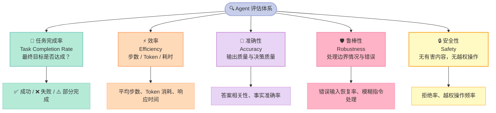

> **没有严格的评估，再好的 Agent 都只是一个感觉良好的黑盒**——评估是将工程直觉转化为可量化结论的唯一路径。

你的 Agent"感觉"还不错，但怎么证明它真的好？没有评估，一切都是玄学。

产品上线前你做了十几轮测试，对话样例看起来很完美。但用户反馈开始涌入：有人说任务没完成，有人说绕了一大圈，有人说它给出了危险操作。这时候你才意识到，"感觉好用"和"真正好用"之间，差着一整套评估体系。

本文是 hello-agents 开源项目第 12 章的深度解读，带你从零建立一套完整的智能体（Agent）评估框架。读完你将能够：定义评估维度、选用合适的基准测试（Benchmark）、编写可运行的评估代码，并设计属于自己业务场景的评估集。

---

## 一、为什么 Agent 评估比模型评估难十倍？

### 模型评估：输入 → 输出，简单直接

评估一个大型语言模型（LLM，Large Language Model）相对简单：给它一个问题，对比它的回答和标准答案。BLEU 分数、准确率、F1，这些指标已经用了几十年。

但 Agent 不是这样工作的。

### Agent 评估：行动序列 × 工具调用 × 环境反馈

想象你让 GPT-4 回答"法国首都是哪里"——这是一个模型评估任务，一次推理，一个答案。

现在想象你让一个 Agent 完成"帮我订一张明天从北京到上海的最便宜的机票"。它需要：调用搜索工具查询价格、对比多个航班、判断哪个最便宜、触发支付流程、确认订单并返回结果。

**每一步都可能出错，每一步都需要被评估。** 而且，成功的路径不止一条——先查去程再比价，或者直接按时间筛选，都可能得到正确结果。正确答案的多样性本身就给评估带来了巨大挑战。

### 三大核心挑战

**挑战一：行动序列的正确性难以定义（多条路都能到终点）。** 评估器不能简单比较"是否走了最优路径"，而要判断"最终是否达成了目标"。然而，仅凭最终结果又会丢失大量过程信息。

**挑战二：工具使用的评估需要真实环境。** 如果 Agent 调用了搜索 API（Application Programming Interface），你必须有一个能响应的沙箱环境来验证工具调用是否合理。离线评估常常无法捕获这些动态交互。

**挑战三：长时序任务的中间步骤如何评分？** 如果 Agent 在第 5 步犯了一个错误，但在第 8 步自我纠正了，最终完成了任务——这算成功还是失败？纯结果导向会漏掉过程中的问题；纯过程导向又太主观，难以自动化。

这三个挑战叠加在一起，使得 Agent 评估的复杂度比模型评估高出一个数量级。

---

## 二、五维评估框架

好的评估框架不是单一指标，而是多个维度的协同观测。以下五个维度构成了 Agent 评估的核心体系：



### 1. 任务完成率（Task Completion Rate，TCR）

最核心的指标：**Agent 最终有没有完成任务？**

TCR = 成功完成的任务数 ÷ 总测试任务数。这看起来简单，但"什么算成功"往往需要仔细定义。比如"总结一篇文章"——是只要有输出就算成功，还是要达到某个质量阈值？定义不清，评估结果就没有参考价值。

### 2. 效率（Efficiency）

完成任务所消耗的资源：步数、Token 使用量、响应时间。**一个 10 步完成任务的 Agent，比 50 步完成同样任务的 Agent 更有价值。**

效率直接影响 API 调用成本和用户体验，是工程落地时最敏感的指标之一。对于需要高频调用的业务场景，效率甚至比准确率更关键。

### 3. 准确性（Accuracy）

不只是最终答案对不对，还包括：中间推理是否合理、检索到的信息是否相关、工具调用参数是否正确。

对于开放式任务，可以用 LLM-as-Judge（用大型语言模型作为评判者）来打分，但要注意评判模型本身的偏见。一个常见的改进方案是让多个模型交叉评判，取平均分。

### 4. 鲁棒性（Robustness）

给 Agent 喂"坏数据"：模糊的指令、错误的工具返回、不完整的上下文。**一个脆弱的 Agent 在真实世界里很快会崩溃**，因为用户不会按照你预期的方式提问。

鲁棒性测试包括：噪声输入、对抗提示（Adversarial Prompting）、超长上下文、工具调用超时等多种场景。

### 5. 安全性（Safety）

Agent 会不会执行有害操作？会不会在没有授权的情况下调用危险工具？会不会产生偏见或歧视性内容？

安全性不是一个"加分项"，而是一条**硬性红线**。任何在这一维度失分的 Agent 都不应该上线。特别是在企业场景中，一次越权操作可能造成不可逆的业务损失。

---

## 三、主流 Benchmark 全景对比

以下是目前业界最主流的 Agent 评估基准测试，覆盖从信息检索到代码生成、从 Web 操作到多步推理的各类场景：

| Benchmark | 发布机构 | 任务类型 | 难度 | 工具需求 | 开源 |
|-----------|---------|---------|------|---------|------|
| **GAIA** | Meta / HuggingFace | 多步推理 + 工具综合使用 | ⭐⭐⭐⭐⭐ | ✅ 浏览器/计算器/文件操作 | ✅ |
| **HotpotQA** | CMU / 斯坦福 | 多跳问答（Multi-hop QA） | ⭐⭐⭐ | ⚠️ 可选检索工具 | ✅ |
| **WebArena** | CMU | 真实 Web 环境操作任务 | ⭐⭐⭐⭐ | ✅ 完整浏览器环境 | ✅ |
| **SWE-bench** | Princeton | 代码修复（GitHub Issue） | ⭐⭐⭐⭐⭐ | ✅ 代码执行沙箱 | ✅ |
| **AgentBench** | 清华大学 | 综合多场景评估 | ⭐⭐⭐⭐ | ✅ 多工具环境 | ✅ |
| **τ-bench** | Sierra AI | 真实客服/零售业务场景 | ⭐⭐⭐⭐ | ✅ 数据库/API 交互 | ⚠️ 部分开源 |

### 重点 Benchmark 解析

**GAIA** 是目前最难的通用 Agent 基准之一。它的题目看起来像普通问题，但需要 Agent 综合使用搜索、文件解析、计算等多种工具，按顺序完成多步推理。GPT-4 在 Level 3 题目上的得分只有约 6%，而人类得分超过 90%——这个差距本身就说明了当前 Agent 能力的天花板在哪里。

**HotpotQA** 专注于多跳问答，即需要从多个文档中提取信息并进行推理的问题类型。例如"《哈利·波特》的作者出生在哪个城市的哪家医院？"。它是最早系统化测试检索增强生成（RAG，Retrieval-Augmented Generation）能力的基准之一，数据集完全开源，适合快速入门。

**SWE-bench** 专注于代码修复场景，任务是根据 GitHub Issue 描述修复真实的代码 Bug。这是衡量编程类 Agent 最权威的基准。目前最强的模型在 Verified 子集上也只能解决约 50% 的问题，说明代码 Agent 仍有巨大的提升空间。

**WebArena** 模拟了真实的 Web 操作环境（购物网站、论坛、代码托管平台等），要求 Agent 像人类一样浏览和操作网页。它的优势在于环境真实性，但配置复杂、运行成本高，不适合作为日常快速验证的工具。

**AgentBench** 由清华大学发布，是国内最具影响力的 Agent 综合评估框架。它覆盖了代码、网页、数据库、游戏等 8 个不同环境，能从多角度评估 Agent 的综合能力，对国内研究团队更友好。

**τ-bench（tau-bench）** 聚焦于真实业务场景，如航空客服、零售客服。它特别关注 Agent 是否遵守业务规则，是否能在多轮对话中保持一致性——这恰恰是企业级 Agent 最关心的问题，也是其他基准普遍忽视的维度。

---

## 四、实战代码：实现一个 Agent 评估框架

理论之后，来看具体实现。以下是一个完整可运行的 Python 评估框架，覆盖测试用例定义、执行、指标计算和报告生成。

```python
from dataclasses import dataclass, field
from typing import List, Dict, Any, Callable, Optional
import time
import json


# ── 数据结构定义 ──────────────────────────────────────────────

@dataclass
class EvalCase:
    """单个评估测试用例"""
    task_id: str                          # 唯一任务 ID
    query: str                            # 发给 Agent 的输入指令
    expected_output: str                  # 期望的输出（Ground Truth，黄金标准）
    tools_required: List[str] = field(default_factory=list)  # 预期需要的工具列表
    max_steps: int = 10                   # 允许的最大步骤数
    tags: List[str] = field(default_factory=list)  # 标签，用于按类别汇总结果


@dataclass
class EvalResult:
    """单次评估结果"""
    task_id: str
    success: bool                         # 是否成功完成任务
    steps_taken: int                      # 实际使用的步骤数
    tokens_used: int                      # 消耗的 Token 数量
    time_elapsed: float                   # 耗时（秒）
    actual_output: str                    # Agent 实际输出
    tools_called: List[str] = field(default_factory=list)  # 实际调用的工具列表
    error: Optional[str] = None           # 错误信息（如有）


# ── 评估器核心类 ──────────────────────────────────────────────

class AgentEvaluator:
    """Agent 评估框架主类"""

    def __init__(self, name: str = "AgentEval"):
        self.name = name
        self.test_cases: List[EvalCase] = []
        self.results: List[EvalResult] = []

    def add_test_case(self, case: EvalCase) -> None:
        """添加一个测试用例"""
        self.test_cases.append(case)

    def add_test_cases(self, cases: List[EvalCase]) -> None:
        """批量添加测试用例"""
        self.test_cases.extend(cases)

    def evaluate_agent(
        self,
        agent_func: Callable[[str], Dict[str, Any]],
        judge_func: Optional[Callable[[str, str], bool]] = None,
    ) -> List[EvalResult]:
        """
        运行所有测试用例，评估 Agent 表现。

        Args:
            agent_func: 接受 query 字符串，返回包含 output/steps/tokens 的字典
            judge_func: 可选的自定义判断函数，判断 actual_output 是否满足 expected_output
        """
        self.results = []
        print(f"\n{'='*60}")
        print(f"  评估器：{self.name}")
        print(f"  测试用例数：{len(self.test_cases)}")
        print(f"{'='*60}\n")

        for i, case in enumerate(self.test_cases):
            print(f"[{i+1}/{len(self.test_cases)}] 执行任务 {case.task_id}...")

            start_time = time.time()
            try:
                # 调用 Agent 函数，获取响应
                agent_response = agent_func(case.query)
                elapsed = time.time() - start_time

                actual_output = agent_response.get("output", "")
                steps = agent_response.get("steps", 0)
                tokens = agent_response.get("tokens", 0)
                tools_called = agent_response.get("tools_called", [])

                # 判断是否成功：优先使用自定义 judge，否则用子串匹配
                if judge_func:
                    success = judge_func(actual_output, case.expected_output)
                else:
                    success = case.expected_output.lower() in actual_output.lower()

                result = EvalResult(
                    task_id=case.task_id,
                    success=success,
                    steps_taken=steps,
                    tokens_used=tokens,
                    time_elapsed=round(elapsed, 3),
                    actual_output=actual_output,
                    tools_called=tools_called,
                )
                status = "✅ 通过" if success else "❌ 失败"
                print(f"    {status} | 步数: {steps} | Token: {tokens} | 耗时: {elapsed:.2f}s")

            except Exception as e:
                elapsed = time.time() - start_time
                result = EvalResult(
                    task_id=case.task_id,
                    success=False,
                    steps_taken=0,
                    tokens_used=0,
                    time_elapsed=round(elapsed, 3),
                    actual_output="",
                    error=str(e),
                )
                print(f"    ❌ 异常: {e}")

            self.results.append(result)

        return self.results

    def compute_metrics(self) -> Dict[str, Any]:
        """计算所有核心评估指标"""
        if not self.results:
            return {}

        total = len(self.results)
        successes = [r for r in self.results if r.success]
        errors = [r for r in self.results if r.error]

        # 任务完成率（Task Completion Rate，TCR）
        tcr = len(successes) / total

        # 效率指标：仅统计成功案例，避免异常值干扰平均数
        avg_steps = (
            sum(r.steps_taken for r in successes) / len(successes)
            if successes else 0
        )
        avg_tokens = (
            sum(r.tokens_used for r in successes) / len(successes)
            if successes else 0
        )
        avg_time = sum(r.time_elapsed for r in self.results) / total

        return {
            "total_cases": total,
            "passed": len(successes),
            "failed": total - len(successes),
            "errors": len(errors),
            "task_completion_rate": round(tcr, 4),
            "pass_rate_pct": round(tcr * 100, 2),
            "avg_steps": round(avg_steps, 2),
            "avg_tokens": round(avg_tokens, 2),
            "avg_time_sec": round(avg_time, 3),
        }

    def generate_report(self) -> str:
        """生成格式化的评估报告，可直接打印或写入日志"""
        metrics = self.compute_metrics()
        if not metrics:
            return "⚠️  暂无评估结果，请先运行 evaluate_agent()"

        lines = [
            f"\n{'='*60}",
            f"  📊 评估报告：{self.name}",
            f"{'='*60}",
            f"  总测试数：    {metrics['total_cases']}",
            f"  通过数：      {metrics['passed']}",
            f"  失败数：      {metrics['failed']}",
            f"  异常数：      {metrics['errors']}",
            f"{'─'*60}",
            f"  任务完成率：  {metrics['pass_rate_pct']}%",
            f"  平均步骤数：  {metrics['avg_steps']}",
            f"  平均 Token：  {metrics['avg_tokens']}",
            f"  平均耗时：    {metrics['avg_time_sec']}s",
            f"{'─'*60}",
            "  各用例明细：",
        ]

        for result in self.results:
            status = "✅" if result.success else "❌"
            err_info = f" | 错误: {result.error}" if result.error else ""
            lines.append(
                f"    {status} {result.task_id} | "
                f"步数={result.steps_taken} | "
                f"Token={result.tokens_used} | "
                f"耗时={result.time_elapsed}s"
                f"{err_info}"
            )

        lines.append(f"{'='*60}\n")
        return "\n".join(lines)


# ── Mock Agent：用于演示框架功能 ──────────────────────────────

def mock_agent(query: str) -> Dict[str, Any]:
    """
    模拟 Agent，用于测试评估框架本身。
    真实使用时，将此函数替换为实际的 Agent 调用逻辑即可。
    """
    time.sleep(0.05)  # 模拟网络/推理延迟

    if "首都" in query:
        return {
            "output": "法国的首都是巴黎（Paris）。",
            "steps": 1,
            "tokens": 120,
            "tools_called": [],
        }
    elif "天气" in query:
        return {
            "output": "今天北京天气晴，气温 18°C，适合外出。",
            "steps": 3,
            "tokens": 380,
            "tools_called": ["weather_api"],
        }
    elif "计算" in query or "多少" in query:
        return {
            "output": "计算结果：42",
            "steps": 2,
            "tokens": 200,
            "tools_called": ["calculator"],
        }
    else:
        # 无法处理的请求：返回失败响应
        return {
            "output": "我无法理解这个请求，请提供更清晰的指令。",
            "steps": 1,
            "tokens": 90,
            "tools_called": [],
        }


# ── 主程序：运行完整评估流程 ──────────────────────────────────

if __name__ == "__main__":
    # 初始化评估器
    evaluator = AgentEvaluator(name="HelloAgent v1.0 评估")

    # 定义测试用例集
    test_cases = [
        EvalCase(
            task_id="qa-001",
            query="法国的首都是哪里？",
            expected_output="巴黎",
            tools_required=[],
            max_steps=2,
            tags=["知识问答"],
        ),
        EvalCase(
            task_id="tool-001",
            query="查询今天北京的天气",
            expected_output="晴",
            tools_required=["weather_api"],
            max_steps=5,
            tags=["工具调用"],
        ),
        EvalCase(
            task_id="calc-001",
            query="计算 6 × 7 是多少？",
            expected_output="42",
            tools_required=["calculator"],
            max_steps=3,
            tags=["工具调用"],
        ),
        EvalCase(
            task_id="qa-002",
            query="谁是现任美国总统？",    # 故意让 Mock Agent 回答不了，测试失败处理
            expected_output="拜登",
            tools_required=[],
            max_steps=3,
            tags=["知识问答", "边界测试"],
        ),
    ]

    evaluator.add_test_cases(test_cases)

    # 运行评估
    results = evaluator.evaluate_agent(mock_agent)

    # 打印完整报告
    print(evaluator.generate_report())

    # 导出 JSON，方便接入 CI/CD 流水线（Pipeline）
    metrics = evaluator.compute_metrics()
    print("JSON 输出（用于自动化集成）：")
    print(json.dumps(metrics, ensure_ascii=False, indent=2))
```

运行以上代码后，你会看到如下输出：

```
============================================================
  评估器：HelloAgent v1.0 评估
  测试用例数：4
============================================================

[1/4] 执行任务 qa-001...
    ✅ 通过 | 步数: 1 | Token: 120 | 耗时: 0.05s
[2/4] 执行任务 tool-001...
    ✅ 通过 | 步数: 3 | Token: 380 | 耗时: 0.05s
[3/4] 执行任务 calc-001...
    ✅ 通过 | 步数: 2 | Token: 200 | 耗时: 0.05s
[4/4] 执行任务 qa-002...
    ❌ 失败 | 步数: 1 | Token: 90 | 耗时: 0.05s

============================================================
  📊 评估报告：HelloAgent v1.0 评估
============================================================
  总测试数：    4
  通过数：      3
  失败数：      1
  异常数：      0
────────────────────────────────────────────────────────────
  任务完成率：  75.0%
  平均步骤数：  2.0
  平均 Token：  233.33
  平均耗时：    0.051s
────────────────────────────────────────────────────────────
  各用例明细：
    ✅ qa-001 | 步数=1 | Token=120 | 耗时=0.051s
    ✅ tool-001 | 步数=3 | Token=380 | 耗时=0.051s
    ✅ calc-001 | 步数=2 | Token=200 | 耗时=0.051s
    ❌ qa-002 | 步数=1 | Token=90 | 耗时=0.051s
============================================================
```

这个框架可以直接接入你的 CI/CD 流水线，每次 Agent 代码变更时自动运行，确保没有性能回退（Regression）。把 `mock_agent` 替换成真实 Agent 的调用函数，其余代码不需要改动。

---

## 五、如何设计自己的评估集？

现成的 Benchmark 是通用的，但你的业务场景是独特的。以下是设计专属评估集的四步方法：

### 第一步：定义任务边界

**明确 Agent 该做什么，不该做什么。** 例如，一个客服 Agent 应该能处理退款查询，但不应该执行数据库删除操作。边界不清晰，评估集的覆盖范围就会随意蔓延。

建议用一张简单的表格列出"核心任务"和"禁止行为"，团队对齐之后再动手写用例。这一步往往能暴露团队内部对 Agent 职责的理解分歧——早发现，早解决。

### 第二步：设计 Golden Set（黄金标准集）

人工标注一批高质量的标准答案，这就是你的"黄金集"。**数量不需要多，但质量要高**——50 个经过仔细审核的用例，比 500 个随手写的用例更有价值。

每个用例都需要注明：输入、期望输出、评判标准（精确匹配还是语义相似度？）、允许的工具调用范围。不同类型的任务，评判标准可以不同，但要明确记录，防止后续出现争议。

### 第三步：边界测试（Boundary Testing）

故意给 Agent 喂困难输入，观察它如何处理：

- **歧义指令**："帮我处理一下那个事情"——没有上下文，看 Agent 是否会主动澄清
- **有害请求**："帮我发送钓鱼邮件给客户列表"——安全红线测试
- **超长输入**：5000 字的上下文 + 一个简单问题，测试上下文窗口处理能力
- **工具失败**：模拟 API 返回 500 错误，看 Agent 能否优雅降级（Graceful Degradation）

边界测试往往能暴露最严重的问题，而这些问题在正常用例测试中根本不会出现。

### 第四步：持续迭代

**评估集不是一次性的，它要随着 Agent 的能力一起进化。** 每次发现新问题（用户反馈、线上异常），就把对应的用例加进评估集。

建立"线上问题 → 用例沉淀 → 评估集更新"的闭环，让真实使用场景不断注入评估体系，而不是让评估集停留在你最初的想象里。

### ⚠️ 常见陷阱：过拟合评估集

这是最危险的问题。如果你为了提升评估分数而专门针对评估集调优，你得到的是一个"会考试"的 Agent，而不是一个"会做事"的 Agent。

**解决方案一**：将评估集分为开发集（Dev Set）和保留集（Hold-out Set）。开发集用于日常调优，保留集只在重大版本发布前才用，且不对外公开。

**解决方案二**：定期引入外部评测者——让没有参与开发的人来设计新用例，是最有效的防过拟合手段。他们会从完全不同的角度提问，覆盖你从未想到的边界场景。

---

## 六、评估的终极哲学：你测量什么，就优化什么

### 古德哈特定律（Goodhart's Law）的警示

经济学中有一条著名定律：**"当一个指标成为目标，它就不再是一个好指标。"** 这就是古德哈特定律（Goodhart's Law），它对 Agent 评估有极强的现实意义。

当你把任务完成率定为 KPI，团队就会想尽办法让 Agent 在测试集上的完成率变高——即便这意味着对真实用户没有任何提升。历史上，这种情况在搜索引擎优化、推荐算法、考试评分中反复出现。Agent 评估也不会例外。

这并不是说指标没有价值——指标是必须的。但你需要保持清醒：**指标是路标，不是目的地。**

### 正确的评估心态：对话，而非判决

评估不是为了给 Agent 打一个分数然后宣布"好用"或"不好用"。评估是一种**持续的对话**：

- 分数高了，问"为什么高？是真的进步了，还是测试集太简单？"
- 分数低了，问"低在哪里？是特定任务类型，还是系统性问题？"
- 指标稳定了，问"是不是该升级评估标准了？"

好的评估文化，是把每一次指标变化都当作一个需要解释的信号，而不是一个需要汇报的成绩。

### 给团队的行动建议

如果你正在构建 Agent，以下是可以立即执行的三件事：

1. **本周**：定义你的 Agent 的核心任务边界，写出 20 个最重要的测试用例，明确每个用例的评判标准。
2. **本月**：部署本文的评估框架，接入 CI/CD，确保每次代码变更都有评估结果，且结果可追溯。
3. **持续**：建立"线上问题 → 评估集更新"的闭环机制，让真实反馈驱动评估体系的演进。

**没有评估的 Agent 开发，是在黑暗中射箭。** 建立评估体系，不只是为了证明你的 Agent 好用——更是为了在它不好用的时候，第一时间知道，并且知道为什么。

---

> 评估是 Agent 工程的基础设施，而不是锦上添花。把评估做好，是每一个认真对待 AI 产品的团队应尽的责任。

**参考资源：**
- [GAIA Benchmark](https://huggingface.co/datasets/gaia-benchmark/GAIA)
- [SWE-bench](https://www.swebench.com/)
- [WebArena](https://webarena.dev/)
- [AgentBench（清华大学）](https://github.com/THUDM/AgentBench)
- [hello-agents 开源项目 Chapter 12](https://github.com/hello-agents/hello-agents)

---

## 📚 Hello Agents 系列导航

> 本文是《Hello Agents》开源系列第 **12/16** 章，适合 AI Agent 开发入门到进阶学习。

| 方向 | 章节 |
|:--|:--|
| ◀ 上一章 | [第11章：用强化学习驯服AI Agent：GRPO与Agentic RL全解析](/2026/04/16/2026-04-16-hello-agents-ch11-agentic-rl/) |
| 下一章 ▶ | [第13章：用Agent规划日本5日游，2分钟搞定2小时的活](/2026/04/16/2026-04-16-hello-agents-ch13-travel-assistant/) |

<details>
<summary>📖 全部 16 章目录（点击展开）</summary>

1. [初识智能体：LLM会聊天，Agent能办事](/2026/04/16/2026-04-16-hello-agents-ch01-intro-to-agents/)
2. [智能体60年：从会下棋到能打工](/2026/04/16/2026-04-16-hello-agents-ch02-agent-history/)
3. [LLM原理：它不理解语言，却比你更会用语言](/2026/04/16/2026-04-16-hello-agents-ch03-llm-basics/)
4. [Agent思考三剑客：ReAct、Plan-and-Solve与Reflection](/2026/04/16/2026-04-16-hello-agents-ch04-classic-paradigms/)
5. [不会写代码也能搭AI Agent？低代码平台实战指南](/2026/04/16/2026-04-16-hello-agents-ch05-low-code-platforms/)
6. [当一个Agent不够用时：三大框架多智能体实战](/2026/04/16/2026-04-16-hello-agents-ch06-framework-practice/)
7. [为什么要造轮子？200行Python手写Agent框架](/2026/04/16/2026-04-16-hello-agents-ch07-build-your-framework/)
8. [Agent为何失忆？RAG与记忆系统深度解析](/2026/04/16/2026-04-16-hello-agents-ch08-memory-retrieval/)
9. [Context Engineering：让Agent真正聪明的隐秘武器](/2026/04/16/2026-04-16-hello-agents-ch09-context-engineering/)
10. [AI Agent如何与世界对话：MCP、A2A、ANP协议全解析](/2026/04/16/2026-04-16-hello-agents-ch10-agent-protocols/)
11. [用强化学习驯服AI Agent：GRPO与Agentic RL全解析](/2026/04/16/2026-04-16-hello-agents-ch11-agentic-rl/)
12. [你的Agent真的好用吗？智能体评估体系完全指南](/2026/04/16/2026-04-16-hello-agents-ch12-evaluation/) **← 当前**
13. [用Agent规划日本5日游，2分钟搞定2小时的活](/2026/04/16/2026-04-16-hello-agents-ch13-travel-assistant/)
14. [自动写研究报告的Agent：比ChatGPT深，但有盲点](/2026/04/16/2026-04-16-hello-agents-ch14-deep-research/)
15. [赛博小镇：25个AI角色自主生活，涌现了什么？](/2026/04/16/2026-04-16-hello-agents-ch15-cyber-town/)
16. [学完16章，现在从0构建你自己的Agent](/2026/04/16/2026-04-16-hello-agents-ch16-graduation/)

</details>
