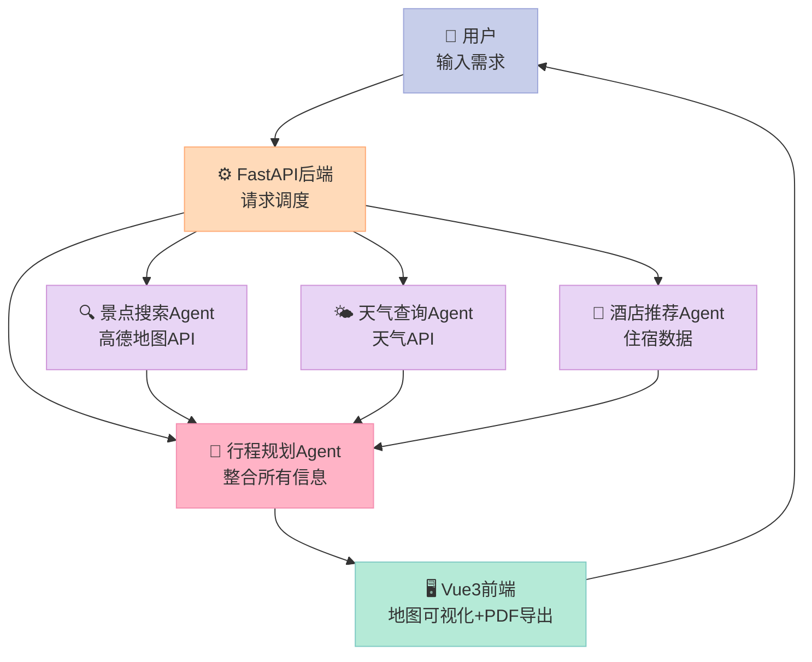
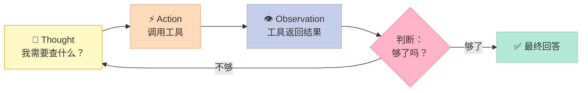
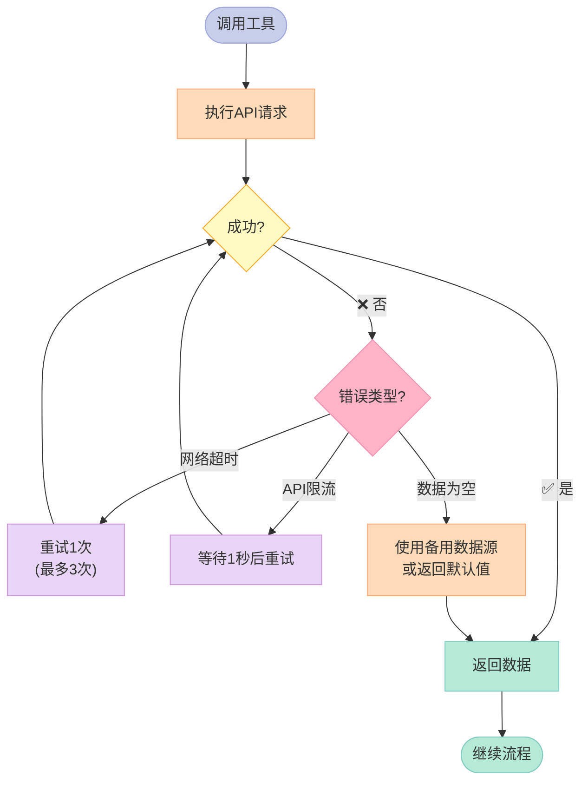

> **核心结论**：多Agent协作不是让一个LLM变得更聪明，而是让多个专职LLM分工合作——就像雇了一支旅行规划团队，每个人只干自己最擅长的事。

---

上周有朋友问我："AI能帮我规划旅行吗？" 我说能。他试了一下，15分钟后发来消息："它只给了我一堆文字，完全不实用。"

这就是普通ChatGPT对话和**真正的旅行助手Agent**之间的差距。

一个训练有素的旅行助手Agent，能做到这些：你输入"北京5天，预算3000，喜欢历史"，它在1-2分钟内自动查询景点、天气、酒店，生成带地图标注的完整行程，算好预算明细，还能导出成PDF带走。这不是聊天，这是**自动化工作流**。

今天我们就来拆解 [hello-agents](https://github.com/datawhalechina/hello-agents) 第13章的完整项目——一个能真正跑起来的智能旅行助手。

## 一、项目架构：为什么需要4个Agent？

直觉上，你可能会想：给LLM一个超长的Prompt，让它一次生成所有内容，不就行了吗？

**试过就知道不行。** 原因有三：
1. **信息获取受限**：LLM的训练数据有截止日期，它不知道今天的天气、实时票价
2. **单次输出质量有限**：让一个模型同时规划景点路线、查酒店、算预算，哪个都做不精
3. **无法与外部系统交互**：没有工具调用，它只能"想象"，不能"查询"

解决方案是**多Agent分工**：把旅行规划分解为4个专职角色，每个角色只做一件事，并拥有对应的工具。



整个系统分四层：
- **前端层**（Vue3+TypeScript）：用户交互、地图可视化、PDF导出
- **后端层**（FastAPI）：API路由、请求调度、数据验证
- **智能体层**（HelloAgents）：4个专职Agent并行工作
- **外部服务层**：高德地图API、Unsplash图片、LLM API

## 二、核心模块解析

### 2.1 数据模型：Pydantic的价值

旅行数据在系统中经历多次转换：前端表单 → HTTP请求 → Python对象 → 外部API → Python对象 → HTTP响应 → 前端渲染。

如果用字典随便传，一处写错就全错。**Pydantic模型**是救命稻草：

```python
from pydantic import BaseModel, Field
from typing import Optional, List

class Location(BaseModel):
    """地理坐标，统一格式避免各API字段名不一致的混乱"""
    longitude: float = Field(..., ge=-180, le=180, description="经度")
    latitude: float = Field(..., ge=-90, le=90, description="纬度")

class Attraction(BaseModel):
    """景点信息模型"""
    name: str = Field(..., description="景点名称")
    address: str = Field(..., description="地址")
    location: Location
    visit_duration: int = Field(..., gt=0, description="建议游览时间(分钟)")
    ticket_price: int = Field(default=0, ge=0, description="门票价格(元)")
    rating: Optional[float] = Field(default=None, ge=0, le=5)
    image_url: Optional[str] = None

class DayPlan(BaseModel):
    """单天行程"""
    date: str
    attractions: List[Attraction]
    meals: List[dict] = []
    hotel: Optional[dict] = None

class TravelPlan(BaseModel):
    """完整旅行计划"""
    destination: str
    days: int
    day_plans: List[DayPlan]
    total_budget: int
    budget_breakdown: dict
```

好处立竿见影：IDE有代码补全，传错类型立刻报错，再也不用猜哪个API用的是`lng`还是`longitude`。

### 2.2 ReAct推理循环：Agent的思考方式

每个Agent的工作核心是**ReAct（Reasoning + Acting）**循环：



景点搜索Agent处理"北京5天历史文化游"的思考过程大概是这样：

```
思考：用户想去北京玩5天，偏好历史文化。需要搜索北京的历史文化景点。
行动：调用高德地图API，查询"北京历史文化景点"
观察：返回了故宫、颐和园、天坛、长城、明十三陵等20个景点
思考：5天行程需要约15个景点（每天3个），我需要按区域筛选，避免来回奔波。
行动：按地理位置聚类，计算各景点距离
观察：故宫/天安门/前门在中轴线，可以安排一天...
最终输出：按天分组的景点推荐列表
```

## 三、Step-by-Step实现

### 3.1 环境准备

```bash
# 克隆项目
git clone https://github.com/datawhalechina/hello-agents.git
cd hello-agents/code/chapter13/helloagents-trip-planner

# 安装依赖
pip install -r backend/requirements.txt
cd frontend && npm install
```

需要准备三个API Key：
- **LLM API**（OpenAI/DeepSeek/Qwen均可）
- **高德地图Web服务Key**：[console.amap.com](https://console.amap.com) 注册
- **Unsplash Access Key**：[unsplash.com/developers](https://unsplash.com/developers) 注册

### 3.2 核心代码实现

**工具定义**——让Agent能调用外部API：

```python
import json
import httpx
from typing import Any

# 高德地图景点搜索工具
def search_attractions(city: str, keywords: str, max_results: int = 10) -> list:
    """
    调用高德地图POI搜索API获取景点信息
    
    Args:
        city: 目标城市，如"北京"
        keywords: 搜索关键词，如"历史博物馆"
        max_results: 最大返回数量
    
    Returns:
        景点信息列表
    """
    import os
    api_key = os.getenv("AMAP_API_KEY")
    
    url = "https://restapi.amap.com/v3/place/text"
    params = {
        "key": api_key,
        "keywords": keywords,
        "city": city,
        "types": "110000",  # 景区类型
        "offset": max_results,
        "output": "json"
    }
    
    response = httpx.get(url, params=params)
    data = response.json()
    
    attractions = []
    if data.get("status") == "1":
        for poi in data.get("pois", []):
            # 高德API返回"lng,lat"格式，需要拆分
            location_str = poi.get("location", "")
            lng, lat = location_str.split(",") if "," in location_str else (0, 0)
            
            attractions.append({
                "name": poi.get("name"),
                "address": poi.get("address"),
                "location": {
                    "longitude": float(lng),
                    "latitude": float(lat)
                },
                "rating": float(poi.get("biz_ext", {}).get("rating", 0) or 0),
            })
    
    return attractions


def get_weather(city: str, date: str) -> dict:
    """
    获取城市天气信息（这里用免费的wttr.in API演示）
    
    Args:
        city: 城市名称
        date: 日期字符串 YYYY-MM-DD
    
    Returns:
        天气信息字典
    """
    url = f"https://wttr.in/{city}?format=j1&lang=zh"
    
    try:
        response = httpx.get(url, timeout=10)
        data = response.json()
        current = data["current_condition"][0]
        
        return {
            "temperature": int(current["temp_C"]),
            "weather": current["weatherDesc"][0]["value"],
            "humidity": int(current["humidity"]),
            "wind_speed": int(current["windspeedKmph"])
        }
    except Exception:
        # 工具失败要有优雅降级，不能让整个Agent崩溃
        return {
            "temperature": None,
            "weather": "暂无天气数据",
            "humidity": None,
            "wind_speed": None
        }
```

**Agent定义**——用OpenAI Function Calling实现工具调用：

```python
from openai import OpenAI
import json
import os

client = OpenAI(api_key=os.getenv("OPENAI_API_KEY"))

# 定义景点搜索Agent可用的工具
ATTRACTION_TOOLS = [
    {
        "type": "function",
        "function": {
            "name": "search_attractions",
            "description": "搜索指定城市的景点信息，返回景点名称、地址、评分等",
            "parameters": {
                "type": "object",
                "properties": {
                    "city": {
                        "type": "string",
                        "description": "目标城市，如'北京'、'上海'"
                    },
                    "keywords": {
                        "type": "string", 
                        "description": "搜索关键词，根据用户偏好设置，如'历史博物馆'、'自然公园'"
                    },
                    "max_results": {
                        "type": "integer",
                        "description": "返回景点数量，默认10",
                        "default": 10
                    }
                },
                "required": ["city", "keywords"]
            }
        }
    },
    {
        "type": "function",
        "function": {
            "name": "get_weather",
            "description": "获取指定城市的天气信息",
            "parameters": {
                "type": "object",
                "properties": {
                    "city": {"type": "string", "description": "城市名称"},
                    "date": {"type": "string", "description": "日期 YYYY-MM-DD格式"}
                },
                "required": ["city"]
            }
        }
    }
]

# 工具名称到函数的映射
TOOL_MAP = {
    "search_attractions": search_attractions,
    "get_weather": get_weather,
}

def run_attraction_agent(destination: str, days: int, preferences: list, 
                          start_date: str) -> dict:
    """
    运行景点搜索Agent，生成推荐景点列表
    
    Args:
        destination: 目的地城市
        days: 旅行天数
        preferences: 用户偏好列表，如["历史文化", "自然景观"]
        start_date: 出发日期 YYYY-MM-DD
    
    Returns:
        包含景点列表和天气信息的字典
    """
    system_prompt = """你是一个专业的旅行规划助手，专门负责景点搜索和推荐。
你的任务是：
1. 根据用户的偏好和旅行天数，搜索合适的景点
2. 获取旅行期间的天气信息
3. 返回结构化的景点推荐列表

注意：
- 搜索时要考虑用户的偏好（历史文化、自然景观、美食购物等）
- 景点数量要合理（每天2-4个）
- 要获取天气信息，帮助用户做好准备"""

    user_message = f"""请为以下旅行需求搜索景点：
- 目的地：{destination}
- 旅行天数：{days}天
- 出发日期：{start_date}
- 用户偏好：{', '.join(preferences)}

请搜索相关景点并获取天气信息，返回完整的景点推荐。"""

    messages = [
        {"role": "system", "content": system_prompt},
        {"role": "user", "content": user_message}
    ]
    
    # ReAct循环：最多执行5轮工具调用
    for _ in range(5):
        response = client.chat.completions.create(
            model="gpt-4o-mini",
            messages=messages,
            tools=ATTRACTION_TOOLS,
            tool_choice="auto"
        )
        
        message = response.choices[0].message
        
        # 如果没有工具调用，说明Agent已完成
        if not message.tool_calls:
            return {"result": message.content, "status": "success"}
        
        # 执行所有工具调用
        messages.append(message)  # 把Assistant的回复加入历史
        
        for tool_call in message.tool_calls:
            tool_name = tool_call.function.name
            tool_args = json.loads(tool_call.function.arguments)
            
            # 调用对应的函数
            if tool_name in TOOL_MAP:
                try:
                    tool_result = TOOL_MAP[tool_name](**tool_args)
                    result_str = json.dumps(tool_result, ensure_ascii=False)
                except Exception as e:
                    # 工具失败：返回错误信息，让Agent决定如何处理
                    result_str = json.dumps({"error": str(e), "status": "failed"})
            else:
                result_str = json.dumps({"error": f"未知工具: {tool_name}"})
            
            # 把工具结果加入消息历史
            messages.append({
                "role": "tool",
                "tool_call_id": tool_call.id,
                "content": result_str
            })
    
    return {"result": "Agent执行超时，请重试", "status": "timeout"}
```

**行程规划Agent**——整合所有信息生成最终计划：

```python
def run_planning_agent(destination: str, days: int, preferences: list,
                        budget: int, start_date: str, attractions_data: dict) -> dict:
    """
    行程规划Agent：整合景点、天气、酒店信息，生成完整行程
    
    Args:
        attractions_data: 景点搜索Agent的输出结果
    
    Returns:
        完整的结构化旅行计划
    """
    system_prompt = """你是一个专业的旅行规划师，负责将搜集到的信息整合成完整的旅行计划。

输出格式要求（严格按照JSON格式）：
{
    "day_plans": [
        {
            "day": 1,
            "date": "YYYY-MM-DD",
            "theme": "当天主题",
            "attractions": ["景点1", "景点2"],
            "meals": {
                "breakfast": "建议早餐地点",
                "lunch": "建议午餐地点", 
                "dinner": "建议晚餐地点"
            },
            "tips": "当天注意事项"
        }
    ],
    "budget_breakdown": {
        "tickets": 预估门票总价,
        "hotels": 预估住宿总价,
        "meals": 预估餐饮总价,
        "transport": 预估交通总价
    },
    "packing_tips": ["携带物品建议1", "携带物品建议2"]
}"""

    user_message = f"""请基于以下信息制定完整旅行计划：

基本信息：
- 目的地：{destination}
- 旅行天数：{days}天
- 出发日期：{start_date}
- 用户偏好：{', '.join(preferences)}
- 总预算：{budget}元

已收集的景点和天气信息：
{attractions_data.get('result', '暂无数据')}

请生成完整的旅行计划，确保：
1. 每天行程合理，不要安排太多景点
2. 按地理位置优化游览顺序，减少来回奔波
3. 预算分配合理，控制在{budget}元以内
4. 根据天气信息给出相应建议"""

    response = client.chat.completions.create(
        model="gpt-4o",  # 行程规划用更强的模型
        messages=[
            {"role": "system", "content": system_prompt},
            {"role": "user", "content": user_message}
        ],
        response_format={"type": "json_object"}  # 强制JSON输出
    )
    
    result = json.loads(response.choices[0].message.content)
    return result
```

**主调度器**——串联所有Agent：

```python
from datetime import datetime, timedelta

async def plan_travel(destination: str, days: int, preferences: list,
                       budget: int, start_date: str) -> dict:
    """
    旅行规划主流程：串联多个Agent完成完整规划
    """
    print(f"🔍 开始规划 {destination} {days}天行程...")
    
    # Step 1: 景点搜索Agent
    print("📍 Step 1: 搜索景点和天气信息...")
    attractions_data = run_attraction_agent(
        destination=destination,
        days=days, 
        preferences=preferences,
        start_date=start_date
    )
    
    # Step 2: 行程规划Agent（整合所有信息）
    print("📅 Step 2: 生成完整行程计划...")
    travel_plan = run_planning_agent(
        destination=destination,
        days=days,
        preferences=preferences,
        budget=budget,
        start_date=start_date,
        attractions_data=attractions_data
    )
    
    print(f"✅ 规划完成！共 {len(travel_plan.get('day_plans', []))} 天行程")
    return travel_plan


# 使用示例
if __name__ == "__main__":
    import asyncio
    
    plan = asyncio.run(plan_travel(
        destination="北京",
        days=3,
        preferences=["历史文化", "美食"],
        budget=3000,
        start_date="2026-05-01"
    ))
    
    for day in plan.get("day_plans", []):
        print(f"\n=== Day {day['day']}: {day['theme']} ===")
        print(f"景点: {', '.join(day['attractions'])}")
        print(f"午餐: {day['meals']['lunch']}")
        print(f"Tips: {day['tips']}")
```

### 3.3 关键决策点：工具失败怎么办？

旅行助手最容易踩坑的地方就是**工具失败处理**。高德API限流、网络超时、返回空数据——这些情况一定会发生。



关键原则：**让Agent知道工具失败了，让它自己决定怎么办**，而不是直接崩溃。把错误信息作为工具返回值传回给Agent，它会决定是换个方式查询，还是用已有数据继续规划。

## 四、运行效果与测试

完整运行后，你会看到：

| 功能 | 效果 |
|------|------|
| 景点规划 | 按天分组，避免来回奔波 ✅ |
| 天气提示 | 根据天气给出穿着建议 ✅ |
| 预算明细 | 门票+住宿+餐饮+交通分项显示 ✅ |
| 地图可视化 | 高德地图标注所有景点位置 ✅ |
| PDF导出 | 一键导出完整行程文档 ✅ |
| 行程编辑 | 拖拽调整景点顺序 ⚠️（需前端配合）|

**有Agent vs 没Agent的真实差距：**

| 维度 | 传统手动规划 | 旅行助手Agent |
|------|-------------|--------------|
| 时间成本 | 2-4小时 | 1-2分钟 |
| 信息整合 | 人工在多个网站切换 ✅ | 自动聚合 ✅ |
| 个性化程度 | 依赖攻略是否匹配 ⚠️ | 根据偏好定制 ✅ |
| 实时信息 | 需要手动查天气、票价 ❌ | 自动调用API ✅ |
| 结果可编辑 | 修改需重头来过 ❌ | 支持拖拽调整 ✅ |
| 准确性 | 依赖人的判断 | 受工具质量影响 ⚠️ |

## 五、扩展方向

1. **接入更多工具**：携程/飞猪酒店API（实时价格）、航班查询API
2. **加入用户反馈循环**：用户说"故宫人太多"，Agent重新规划绕开
3. **多轮对话支持**：支持"把第三天的晚餐改成胡同探店"这样的修改指令
4. **离线缓存**：热门城市的景点数据本地缓存，减少API调用

## 六、总结：学到了什么

这个项目最有价值的三个工程经验：

**第一，多Agent分工比单Agent全能更可靠**。把景点搜索、天气查询、行程规划分开，每个Agent的Prompt更简单、更专注，输出质量更稳定。

**第二，工具失败是常态，优雅降级是必须**。任何外部API都可能挂掉，把错误信息返回给Agent而不是直接崩溃，让Agent有机会自救。

**第三，Pydantic是多Agent系统的胶水**。数据在Agent之间流转时，强类型校验能在源头拦截绝大多数bug。

旅行助手是一个很好的入门实战项目，因为它的需求真实、工具明确、结果可验证。如果你能把它跑通，恭喜你，你已经掌握了构建实用Agent的核心技能。

> **下一步**：尝试给旅行助手加入"用户历史偏好记忆"功能——它应该记住你不喜欢爬山，下次规划时自动回避体力消耗大的景点。这就引出了Agent记忆系统的话题，正是第14章的主角。

---

## 📚 Hello Agents 系列导航

> 本文是《Hello Agents》开源系列第 **13/16** 章，适合 AI Agent 开发入门到进阶学习。

| 方向 | 章节 |
|:--|:--|
| ◀ 上一章 | [第12章：你的Agent真的好用吗？智能体评估体系完全指南](/2026/04/16/2026-04-16-hello-agents-ch12-evaluation/) |
| 下一章 ▶ | [第14章：自动写研究报告的Agent：比ChatGPT深，但有盲点](/2026/04/16/2026-04-16-hello-agents-ch14-deep-research/) |

<details>
<summary>📖 全部 16 章目录（点击展开）</summary>

1. [初识智能体：LLM会聊天，Agent能办事](/2026/04/16/2026-04-16-hello-agents-ch01-intro-to-agents/)
2. [智能体60年：从会下棋到能打工](/2026/04/16/2026-04-16-hello-agents-ch02-agent-history/)
3. [LLM原理：它不理解语言，却比你更会用语言](/2026/04/16/2026-04-16-hello-agents-ch03-llm-basics/)
4. [Agent思考三剑客：ReAct、Plan-and-Solve与Reflection](/2026/04/16/2026-04-16-hello-agents-ch04-classic-paradigms/)
5. [不会写代码也能搭AI Agent？低代码平台实战指南](/2026/04/16/2026-04-16-hello-agents-ch05-low-code-platforms/)
6. [当一个Agent不够用时：三大框架多智能体实战](/2026/04/16/2026-04-16-hello-agents-ch06-framework-practice/)
7. [为什么要造轮子？200行Python手写Agent框架](/2026/04/16/2026-04-16-hello-agents-ch07-build-your-framework/)
8. [Agent为何失忆？RAG与记忆系统深度解析](/2026/04/16/2026-04-16-hello-agents-ch08-memory-retrieval/)
9. [Context Engineering：让Agent真正聪明的隐秘武器](/2026/04/16/2026-04-16-hello-agents-ch09-context-engineering/)
10. [AI Agent如何与世界对话：MCP、A2A、ANP协议全解析](/2026/04/16/2026-04-16-hello-agents-ch10-agent-protocols/)
11. [用强化学习驯服AI Agent：GRPO与Agentic RL全解析](/2026/04/16/2026-04-16-hello-agents-ch11-agentic-rl/)
12. [你的Agent真的好用吗？智能体评估体系完全指南](/2026/04/16/2026-04-16-hello-agents-ch12-evaluation/)
13. [用Agent规划日本5日游，2分钟搞定2小时的活](/2026/04/16/2026-04-16-hello-agents-ch13-travel-assistant/) **← 当前**
14. [自动写研究报告的Agent：比ChatGPT深，但有盲点](/2026/04/16/2026-04-16-hello-agents-ch14-deep-research/)
15. [赛博小镇：25个AI角色自主生活，涌现了什么？](/2026/04/16/2026-04-16-hello-agents-ch15-cyber-town/)
16. [学完16章，现在从0构建你自己的Agent](/2026/04/16/2026-04-16-hello-agents-ch16-graduation/)

</details>
