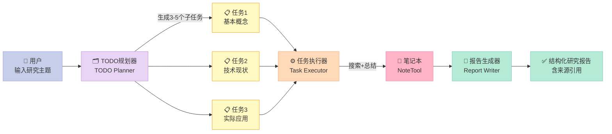
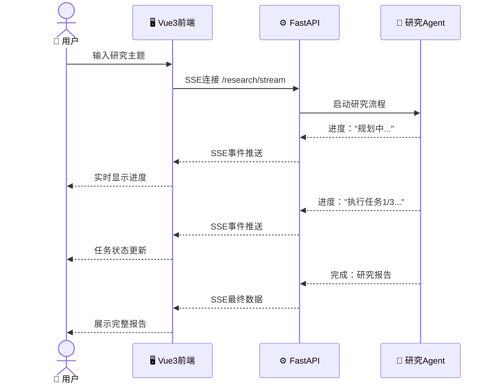

> **核心结论**：深度研究（Deep Research）Agent的本质不是"更聪明的搜索"，而是"会规划任务的研究员"——它先想清楚要查什么，再系统地查，最后把碎片整合成结论。

---

<!-- more -->


2024年，OpenAI推出了Deep Research功能，发布一小时内涌现了数百条评论："这就是研究生要失业的节点吗？"

过度恐慌了。但它确实可以把一个需要人工3-4小时的文献调研，压缩到10分钟。

更关键的问题是：**它怎么做到的？** 今天我们不只是用它，而是动手复刻一个——基于 [hello-agents](https://github.com/datawhalechina/hello-agents) 第14章，实现一个能自动写研究报告的Deep Research Agent。

把这个系统跑起来，你会理解：为什么它在某些任务上远超ChatGPT，在另一些任务上又会产生令人尴尬的错误。

## 一、项目概述：研究报告的生产流水线

传统搜索的方式是：你搜一个关键词，引擎返回10个链接，你逐个点开，手动整理笔记，最后写报告。整个流程人是流水线上的**唯一工人**，所有环节都得人来做。

Deep Research Agent的创新在于：它把"研究"这件事拆成了**三个角色**，各司其职。



**三个核心角色：**
- **TODO规划器**（Planner）：把模糊的研究主题分解为3-5个具体可执行的子问题
- **任务执行器**（Executor）：对每个子问题，搜索→总结→记录，循环执行
- **报告生成器**（Writer）：把所有子任务的总结整合成一篇结构化报告

这种**Plan-then-Execute**范式的精髓在于：先想清楚要研究什么，再去找，而不是边搜边想。

## 二、核心模块解析

### 2.1 TODO驱动：为什么要"先规划再执行"

假设你要研究"Transformer架构为什么能取代RNN"。

**直接搜索的问题：**
- 搜"Transformer vs RNN" → 返回大量泛泛对比文章
- 搜索结果重叠度高，有效信息密度低
- 没有系统化框架，整理时头大

**TODO驱动的方式：**

```
研究主题：Transformer架构为什么能取代RNN

规划结果：
├─ TODO 1: RNN的核心局限性（梯度消失、串行计算）
├─ TODO 2: Transformer的注意力机制原理
├─ TODO 3: 实验数据对比（训练速度、BLEU分数）
└─ TODO 4: Transformer的局限性（长序列内存问题）

执行结果：每个TODO独立搜索，各有3-5篇来源

报告：4个部分，有结构，有引用，有对比数据
```

区别在于：规划让搜索有了**意图**。每次搜索不是随机探索，而是为了回答一个具体问题。

### 2.2 SSE实时流：让用户"看见"研究过程

研究可能需要1-3分钟，如果只是等待一个转圈圈，用户体验很差。这个项目用**服务器发送事件（SSE，Server-Sent Events）**实现实时进度推送：



前端不再傻等一个HTTP响应，而是建立长连接，实时接收每一步的进度更新。

## 三、Step-by-Step实现

### 3.1 环境准备

```bash
cd hello-agents/code/chapter14/helloagents-deepresearch/backend

# 推荐用uv（现代Python包管理器，比pip快很多）
pip install uv
uv sync

# 或者传统方式
pip install -e .

# 配置环境变量
cp .env.example .env
```

`.env`最少需要配置：
```bash
LLM_PROVIDER=openai          # 或 deepseek / qwen
LLM_API_KEY=sk-xxxx          # 你的API Key
LLM_MODEL=gpt-4o-mini        # 模型名称
SEARCH_API=duckduckgo        # 免费搜索引擎，或 tavily（需要API Key）
```

### 3.2 核心代码实现

**TODO规划器**——将研究主题分解为子任务：

```python
from openai import OpenAI
import json
from datetime import datetime
import os

client = OpenAI(api_key=os.getenv("LLM_API_KEY"))

def plan_research_todos(topic: str) -> list[dict]:
    """
    TODO规划器：将研究主题分解为3-5个可执行的子任务
    
    Args:
        topic: 研究主题，如"量子计算的最新进展"
    
    Returns:
        子任务列表，每个任务包含title、intent、query
    """
    today = datetime.now().strftime("%Y年%m月%d日")
    
    system_prompt = """你是一个专业的研究规划师，负责将研究主题分解为具体的子任务。

输出格式（严格JSON数组）：
[
    {
        "title": "子任务简短标题",
        "intent": "这个子任务的研究意图，1-2句话说明要了解什么",
        "query": "用于搜索引擎的英文或中文搜索关键词"
    }
]

规划原则：
- 子任务数量：3-5个，太少覆盖不全，太多会冗余
- 逻辑顺序：从基础概念 → 技术细节 → 实际应用 → 发展趋势
- 搜索关键词要精准，避免过于宽泛
- 子任务之间不要重叠"""

    response = client.chat.completions.create(
        model=os.getenv("LLM_MODEL", "gpt-4o-mini"),
        messages=[
            {"role": "system", "content": system_prompt},
            {"role": "user", "content": f"当前日期：{today}\n研究主题：{topic}"}
        ],
        response_format={"type": "json_object"}
    )
    
    result = json.loads(response.choices[0].message.content)
    # 兼容不同的返回格式
    todos = result if isinstance(result, list) else result.get("todos", [])
    return todos


# 搜索工具（使用DuckDuckGo，无需API Key）
def search_web(query: str, max_results: int = 5) -> list[dict]:
    """
    网络搜索工具
    
    Args:
        query: 搜索关键词
        max_results: 最大返回结果数
    
    Returns:
        搜索结果列表，每条包含title、url、body
    """
    try:
        from duckduckgo_search import DDGS
        
        with DDGS() as ddgs:
            results = list(ddgs.text(
                query, 
                max_results=max_results,
                region="cn-zh"  # 中文结果优先
            ))
        return results
    except Exception as e:
        # 搜索失败时返回空结果，不让整个流程崩溃
        print(f"搜索失败: {e}")
        return []


def summarize_search_results(task: dict, search_results: list[dict]) -> str:
    """
    任务总结器：将搜索结果提炼为结构化摘要
    
    Args:
        task: 当前子任务信息（title、intent）
        search_results: 搜索返回的原始结果
    
    Returns:
        Markdown格式的摘要，含来源引用
    """
    if not search_results:
        return f"**{task['title']}**\n\n暂未找到相关信息，可能需要调整搜索关键词。"
    
    # 格式化搜索结果供LLM处理
    results_text = "\n\n".join([
        f"来源 [{i+1}]: {r.get('title', '')}\nURL: {r.get('href', r.get('url', ''))}\n内容: {r.get('body', '')[:500]}"
        for i, r in enumerate(search_results)
    ])
    
    system_prompt = """你是一个研究助手，负责总结搜索结果。

要求：
1. 提取关键信息，去除冗余
2. 用结构化的Markdown格式输出
3. 在重要观点后标注来源，格式：[来源编号]
4. 如果信息有冲突，要指出并说明
5. 总结长度：200-400字"""

    response = client.chat.completions.create(
        model=os.getenv("LLM_MODEL", "gpt-4o-mini"),
        messages=[
            {"role": "system", "content": system_prompt},
            {"role": "user", "content": f"""任务：{task['title']}
研究意图：{task['intent']}

搜索结果：
{results_text}

请总结以上信息，聚焦于研究意图。"""}
        ]
    )
    
    return response.choices[0].message.content


def generate_research_report(topic: str, task_summaries: list[dict]) -> str:
    """
    报告生成器：将所有子任务摘要整合成完整研究报告
    
    Args:
        topic: 原始研究主题
        task_summaries: 每个子任务的标题和摘要
    
    Returns:
        完整的Markdown格式研究报告
    """
    summaries_text = "\n\n".join([
        f"### {s['title']}\n{s['summary']}"
        for s in task_summaries
    ])
    
    system_prompt = """你是一个专业的研究报告撰写人。

报告结构要求：
1. 执行摘要（3-5句话的核心结论）
2. 主要发现（整合各子任务的关键信息）
3. 深度分析（各部分的关联性和矛盾点）
4. 结论与展望
5. 参考来源汇总

写作风格：
- 客观准确，有数据的地方要引用数据
- 指出信息的局限性和不确定性
- 避免重复，合并相似的观点"""

    response = client.chat.completions.create(
        model=os.getenv("LLM_MODEL", "gpt-4o"),  # 报告生成用更强的模型
        messages=[
            {"role": "system", "content": system_prompt},
            {"role": "user", "content": f"""研究主题：{topic}

各子任务研究结果：

{summaries_text}

请整合以上内容，生成完整的研究报告。"""}
        ]
    )
    
    return response.choices[0].message.content
```

**主研究流程**——将三个角色串联：

```python
import asyncio
from typing import AsyncGenerator

async def run_deep_research(topic: str) -> AsyncGenerator[dict, None]:
    """
    深度研究主流程，异步生成器，支持SSE实时推送
    
    Args:
        topic: 研究主题
    
    Yields:
        进度事件字典，包含type和data字段
    """
    # 阶段1：规划
    yield {"type": "progress", "data": {"stage": "planning", "message": "正在分析研究主题..."}}
    
    todos = plan_research_todos(topic)
    
    yield {
        "type": "planned", 
        "data": {
            "todos": todos,
            "message": f"规划完成，共{len(todos)}个研究子任务"
        }
    }
    
    # 阶段2：执行每个子任务
    task_summaries = []
    
    for i, task in enumerate(todos):
        yield {
            "type": "progress",
            "data": {
                "stage": "executing",
                "current": i + 1,
                "total": len(todos),
                "message": f"正在研究：{task['title']}"
            }
        }
        
        # 搜索
        search_results = search_web(task["query"])
        
        yield {
            "type": "searched",
            "data": {
                "task_title": task["title"],
                "result_count": len(search_results)
            }
        }
        
        # 总结
        summary = summarize_search_results(task, search_results)
        
        task_summaries.append({
            "title": task["title"],
            "summary": summary,
            "sources": [r.get("href", r.get("url", "")) for r in search_results]
        })
        
        yield {
            "type": "task_done",
            "data": {
                "task_title": task["title"],
                "summary_preview": summary[:100] + "..."
            }
        }
        
        # 避免请求过快
        await asyncio.sleep(0.5)
    
    # 阶段3：生成报告
    yield {"type": "progress", "data": {"stage": "reporting", "message": "正在生成研究报告..."}}
    
    report = generate_research_report(topic, task_summaries)
    
    yield {
        "type": "completed",
        "data": {
            "report": report,
            "task_count": len(todos),
            "message": "研究完成！"
        }
    }


# FastAPI SSE接口
from fastapi import FastAPI
from fastapi.responses import StreamingResponse
import json as json_lib

app = FastAPI()

@app.get("/research/stream")
async def research_stream(topic: str):
    """SSE接口：实时推送研究进度"""
    
    async def event_generator():
        async for event in run_deep_research(topic):
            # SSE格式：data: {JSON}\n\n
            yield f"data: {json_lib.dumps(event, ensure_ascii=False)}\n\n"
        yield "data: [DONE]\n\n"
    
    return StreamingResponse(
        event_generator(),
        media_type="text/event-stream",
        headers={
            "Cache-Control": "no-cache",
            "X-Accel-Buffering": "no"
        }
    )


# 命令行运行示例（不用FastAPI时）
async def main():
    topic = "大语言模型（LLM）的上下文窗口技术进展"
    print(f"开始研究：{topic}\n{'='*50}")
    
    async for event in run_deep_research(topic):
        if event["type"] == "planned":
            print(f"\n📋 研究规划：")
            for i, todo in enumerate(event["data"]["todos"], 1):
                print(f"  {i}. {todo['title']}")
        
        elif event["type"] == "task_done":
            print(f"\n✅ 完成：{event['data']['task_title']}")
        
        elif event["type"] == "completed":
            print(f"\n{'='*50}")
            print("📄 最终报告：")
            print(event["data"]["report"])

if __name__ == "__main__":
    asyncio.run(main())
```

### 3.3 关键决策：如何评估信息可靠性？

这是Deep Research Agent最难解决的问题，也是它最大的盲点。

当前版本做了两个简单处理：
1. **优先权威来源**：通过搜索关键词加入"site:arxiv.org"或"site:nature.com"等限定
2. **多源交叉验证**：同一观点如果多个来源都提到，可信度更高

但它**仍然无法做到**：
- 区分新闻观点和学术事实
- 识别被广泛转载的错误信息（一个错误可能被100个来源引用）
- 理解信息的时效性（某项技术可能已被推翻）

这就是为什么报告里要强调"来源引用"——让人类读者自己判断可靠性。

## 四、运行效果与对比

**研究"Datawhale是什么样的组织"的测试结果：**

| 维度 | ChatGPT直接问 | Deep Research Agent |
|------|-------------|-------------------|
| 响应时间 | 5秒 | 1-3分钟 |
| 信息量 | 基于训练数据，可能过时 ⚠️ | 实时网络搜索 ✅ |
| 结构性 | 段落文章 ⚠️ | 多章节报告 ✅ |
| 来源引用 | 无 ❌ | 每个观点有URL ✅ |
| 深度 | 概括性描述 ⚠️ | 多角度分析 ✅ |
| 准确性 | 可能有幻觉 ⚠️ | 依赖搜索质量 ⚠️ |

**Deep Research Agent的适用场景：**

| 适合 ✅ | 不适合 ❌ |
|---------|---------|
| 需要最新信息的主题 | 需要深度专业判断（如医疗诊断）|
| 综述类研究（"X技术的发展现状"）| 需要阅读完整论文原文 |
| 多维度对比分析 | 涉及付费墙后的内容 |
| 快速了解陌生领域 | 需要100%准确度的决策 |

## 五、扩展方向

1. **迭代搜索**：如果某个子任务总结质量低，自动追加新的搜索关键词再查一轮（反思机制）
2. **分层规划**：对复杂主题先规划大纲，再对每个大章节规划子任务
3. **多搜索引擎**：同一个查询同时跑Google Scholar、arXiv、Wikipedia，去重后合并
4. **知识库对接**：搜索时同时检索私有文档（RAG），结合公开网络信息

## 六、总结：学到了什么

这个项目让我们见识了**Plan-then-Execute**范式在知识密集型任务上的威力：

**先规划，再执行**，这不只是工程技巧，更是认知方式。人类做研究时也应该先想清楚"我要回答哪几个问题"，再去找资料——而不是漫无目的地搜索。

**Task分解是AI系统设计的核心能力**。一个能做出好规划的Planner，价值不亚于能做出好总结的Summarizer。

**SSE流式推送**让长时任务变得可忍受。研究需要时间，但让用户看到进度，焦虑感会大大降低。

> **一个值得思考的问题**：如果Deep Research Agent给了你一份报告，你会直接引用它的结论吗？为什么？答案揭示了你对AI工具的使用态度，也决定了你能从中获得多大价值。
