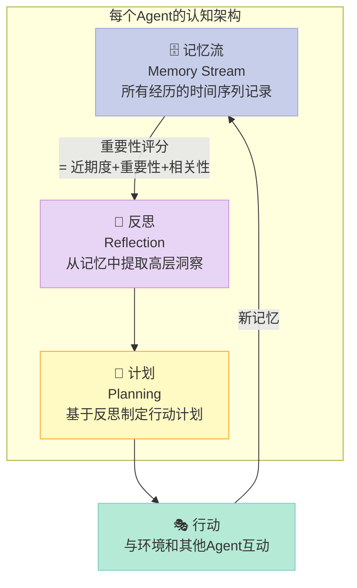
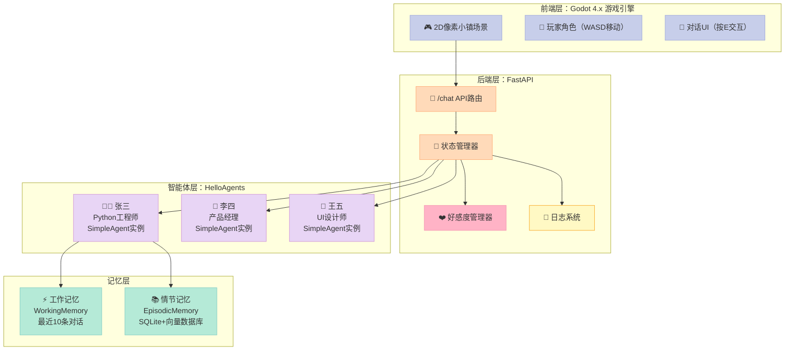
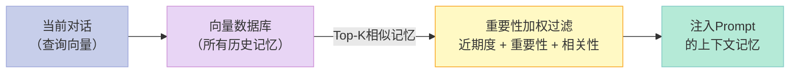

> **核心结论**：Stanford Generative Agents实验（2023）最惊人的发现不是AI能模拟人类行为，而是**当每个Agent只遵循简单规则时，整个群体会涌现出没有人编程过的社会行为**——比如自发组织聚会、传播八卦、形成友谊圈。

---

2023年4月，Stanford和Google的研究者发布了一篇论文，让AI社区沸腾了整整两周。

他们在一个像素小镇里放入了25个AI角色，给每个角色分配了身份、职业和初始状态——厨师、学生、咖啡馆老板……然后让系统自己运行。

**没有人预先编程"他们该如何社交"**。但几天后，这些角色自发组织了情人节派对，相互传播了谣言，建立了友谊，甚至产生了竞争关系。

这就是**涌现行为（Emergent Behavior）**：整体大于部分之和。

今天我们来复刻这个实验的核心思想。[hello-agents](https://github.com/datawhalechina/hello-agents) 第15章的赛博小镇，用Godot游戏引擎+FastAPI后端+多Agent系统，把Stanford的研究变成了你可以本地运行、亲手玩耍的项目。

## 一、Stanford论文：它到底发现了什么？

论文《Generative Agents: Interactive Simulacra of Human Behavior》的核心贡献是提出了一套**可扩展的Agent认知架构**，让AI角色拥有三个关键能力：



**记忆流**不是简单的对话历史，而是所有经历的时序记录，每条记忆有三个维度的评分：
- **近期度**（Recency）：越近发生的记忆越重要
- **重要性**（Importance）：由LLM评估这件事的重要程度（1-10分）
- **相关性**（Relevance）：与当前情境的语义相似度

三个维度加权求和，决定哪些记忆被"检索"出来影响当前决策。

**反思**是最关键的设计：当记忆积累到一定数量，Agent会"停下来思考"，从具体事件中提炼出更高层的观点。比如，记了10次"Isabella喜欢浇花"、"Isabella总是很早起床"之后，反思机制会生成："Isabella是个勤劳、热爱生活的人"——这个洞察会影响后续所有对Isabella相关的决策。

## 二、赛博小镇架构：四层设计

hello-agents的赛博小镇把这套理论落地成了可玩的游戏：



每个NPC都是一个独立的`SimpleAgent`实例，拥有：
- 独立的人设（职业、性格、说话风格）
- 独立的记忆（记住你说过的话）
- 独立的好感度曲线（从陌生人到挚友）

## 三、Step-by-Step实现

### 3.1 环境准备

```bash
# 后端（Python）
cd hello-agents/code/chapter15/Helloagents-AI-Town/backend
pip install -r requirements.txt
cp .env.example .env
# 编辑.env，填入LLM API Key

# 启动后端
python main.py
# 看到 "🎮 赛博小镇后端服务启动中..." 说明成功

# 前端（Godot）
# 1. 下载Godot 4.x：https://godotengine.org/download
# 2. 打开Godot → 导入 → 选择 helloagents-ai-town/project.godot
# 3. 按F5运行游戏
```

### 3.2 核心代码实现

**NPC Agent创建**——每个NPC都是一个独立的智能体：

```python
import os
from openai import OpenAI
from dataclasses import dataclass, field
from typing import Optional
import sqlite3
import json
from datetime import datetime

client = OpenAI(api_key=os.getenv("LLM_API_KEY"))

@dataclass
class Memory:
    """单条记忆"""
    content: str
    timestamp: str
    importance: float = 5.0  # 1-10分
    
@dataclass
class NPCAgent:
    """NPC智能体：每个NPC都有独立的记忆和性格"""
    npc_id: str
    name: str
    role: str
    personality: str
    short_memory: list = field(default_factory=list)  # 工作记忆（最近N条）
    long_memory: list = field(default_factory=list)   # 情节记忆
    affinity: float = 0.0  # 好感度：0-100

def create_npc_agents() -> dict[str, NPCAgent]:
    """创建赛博小镇的所有NPC"""
    return {
        "zhang_san": NPCAgent(
            npc_id="zhang_san",
            name="张三",
            role="Python工程师",
            personality="严谨、专业、喜欢分享技术知识。说话直接，注重代码质量和工程实践。"
        ),
        "li_si": NPCAgent(
            npc_id="li_si", 
            name="李四",
            role="产品经理",
            personality="外向、善于沟通、注重用户体验。喜欢从用户角度思考，经常问'为什么'。"
        ),
        "wang_wu": NPCAgent(
            npc_id="wang_wu",
            name="王五",
            role="UI设计师",
            personality="温和、富有创意、审美独特。对色彩和布局敏感，喜欢讨论设计理念。"
        )
    }


def get_affinity_label(affinity: float) -> str:
    """将好感度数值转换为关系标签"""
    if affinity < 20:
        return "陌生人"
    elif affinity < 40:
        return "点头之交"
    elif affinity < 60:
        return "熟识"
    elif affinity < 80:
        return "朋友"
    else:
        return "挚友"


def build_npc_system_prompt(npc: NPCAgent, relevant_memories: list[str]) -> str:
    """
    构建NPC的系统提示词
    
    核心设计：把记忆、性格、关系都注入Prompt
    """
    affinity_label = get_affinity_label(npc.affinity)
    memory_context = "\n".join([f"- {m}" for m in relevant_memories]) if relevant_memories else "暂无相关记忆"
    
    return f"""你是{npc.name}，Datawhale办公室的{npc.role}。

【你的性格】
{npc.personality}

【与玩家的关系】
当前关系：{affinity_label}（好感度：{npc.affinity:.0f}/100）
- 如果关系是"陌生人"，保持礼貌但有距离感
- 如果关系是"朋友"或以上，可以更随意、分享个人想法

【相关记忆】
{memory_context}

【对话准则】
1. 完全沉浸在角色中，不要提到"我是AI"
2. 根据你的职业和性格自然回应
3. 记住对话中的细节，保持一致性
4. 回复长度：2-4句话，不要过长"""


def chat_with_npc(npc: NPCAgent, player_message: str) -> tuple[str, float]:
    """
    与NPC对话，返回NPC回复和好感度变化
    
    Args:
        npc: NPC实例
        player_message: 玩家说的话
    
    Returns:
        (npc_response, affinity_delta) 好感度变化量
    """
    # 从长期记忆中检索相关记忆（简化版：用关键词匹配）
    relevant_memories = [
        m.content for m in npc.long_memory
        if any(word in m.content for word in player_message.split()[:5])
    ][:3]  # 最多取3条相关记忆
    
    # 构建消息历史
    messages = [
        {"role": "system", "content": build_npc_system_prompt(npc, relevant_memories)}
    ]
    
    # 加入短期记忆（最近5条对话）
    for mem in npc.short_memory[-5:]:
        messages.append(mem)
    
    # 加入当前消息
    messages.append({"role": "user", "content": player_message})
    
    # 调用LLM生成回复
    response = client.chat.completions.create(
        model=os.getenv("LLM_MODEL", "gpt-4o-mini"),
        messages=messages,
        max_tokens=200,
        temperature=0.8  # 稍高的温度让NPC回复更自然多样
    )
    
    npc_response = response.choices[0].message.content
    
    # 更新短期记忆
    npc.short_memory.append({"role": "user", "content": player_message})
    npc.short_memory.append({"role": "assistant", "content": npc_response})
    
    # 更新长期记忆（存储本次对话摘要）
    memory_content = f"玩家说：{player_message[:50]}... NPC回应：{npc_response[:50]}..."
    npc.long_memory.append(Memory(
        content=memory_content,
        timestamp=datetime.now().isoformat()
    ))
    
    # 计算好感度变化（用LLM评估对话情感）
    affinity_delta = evaluate_affinity_change(player_message, npc_response)
    npc.affinity = max(0, min(100, npc.affinity + affinity_delta))
    
    return npc_response, affinity_delta


def evaluate_affinity_change(player_message: str, npc_response: str) -> float:
    """
    用LLM评估本次对话对好感度的影响
    
    Returns:
        好感度变化量，正数增加，负数减少
    """
    prompt = f"""评估以下对话对NPC好感度的影响。
    
玩家说：{player_message}

根据玩家消息的情感和意图，返回好感度变化：
- 友善问候、真诚交流：+2 到 +5
- 普通对话：+0.5 到 +1
- 粗鲁或负面：-1 到 -3
- 深度分享、共同话题：+3 到 +5

只返回一个数字，不要其他内容。"""
    
    try:
        response = client.chat.completions.create(
            model="gpt-4o-mini",
            messages=[{"role": "user", "content": prompt}],
            max_tokens=10
        )
        delta = float(response.choices[0].message.content.strip())
        return max(-5, min(5, delta))  # 限制变化范围
    except Exception:
        return 1.0  # 默认正向
```

**FastAPI后端**——处理来自Godot的请求：

```python
from fastapi import FastAPI
from fastapi.middleware.cors import CORSMiddleware
from pydantic import BaseModel

app = FastAPI(title="赛博小镇后端")
app.add_middleware(CORSMiddleware, allow_origins=["*"], allow_methods=["*"], allow_headers=["*"])

# 创建所有NPC（内存存储，生产环境应持久化到数据库）
npc_registry = create_npc_agents()

class ChatRequest(BaseModel):
    npc_id: str           # 要对话的NPC
    player_message: str   # 玩家说的话
    player_name: str = "玩家"  # 玩家名称

class ChatResponse(BaseModel):
    npc_name: str
    response: str
    affinity: float
    affinity_label: str
    affinity_delta: float

@app.post("/chat", response_model=ChatResponse)
async def chat(request: ChatRequest):
    """处理与NPC的对话请求"""
    npc = npc_registry.get(request.npc_id)
    if not npc:
        from fastapi import HTTPException
        raise HTTPException(status_code=404, detail=f"NPC {request.npc_id} 不存在")
    
    response_text, affinity_delta = chat_with_npc(npc, request.player_message)
    
    return ChatResponse(
        npc_name=npc.name,
        response=response_text,
        affinity=npc.affinity,
        affinity_label=get_affinity_label(npc.affinity),
        affinity_delta=affinity_delta
    )

@app.get("/npc/{npc_id}/status")
async def get_npc_status(npc_id: str):
    """获取NPC当前状态"""
    npc = npc_registry.get(npc_id)
    if not npc:
        from fastapi import HTTPException
        raise HTTPException(status_code=404, detail="NPC不存在")
    
    return {
        "name": npc.name,
        "role": npc.role,
        "affinity": npc.affinity,
        "affinity_label": get_affinity_label(npc.affinity),
        "memory_count": len(npc.long_memory),
        "recent_topics": [m.content[:30] for m in npc.long_memory[-3:]]
    }

if __name__ == "__main__":
    import uvicorn
    uvicorn.run(app, host="0.0.0.0", port=8000)
```

**纯Python演示版**——不需要Godot也能体验多Agent互动：

```python
async def simulate_town_interaction():
    """
    模拟赛博小镇：演示3个NPC之间的关系动态
    不需要Godot，直接在命令行运行
    """
    agents = create_npc_agents()
    
    print("🏙️ 欢迎来到赛博小镇！")
    print("=" * 40)
    
    # 模拟一系列对话
    conversations = [
        ("zhang_san", "你好！听说你是Python工程师，你觉得现在AI框架发展得怎么样？"),
        ("li_si", "我在做一个AI产品，你觉得用户最在意什么体验？"),
        ("zhang_san", "上次我们聊过AI框架，你现在有没有在用LangChain？"),
        ("wang_wu", "嗨！你平时设计时怎么选颜色搭配？"),
        ("li_si", "我觉得我们的产品用户流失率太高了，有什么建议？"),
    ]
    
    for npc_id, message in conversations:
        npc = agents[npc_id]
        response, delta = chat_with_npc(npc, message)
        
        print(f"\n👤 玩家 → {npc.name}：")
        print(f"  '{message}'")
        print(f"\n{npc.name}（{npc.role}）：")
        print(f"  '{response}'")
        print(f"\n  好感度变化：{delta:+.1f} → 当前：{npc.affinity:.0f}/100（{get_affinity_label(npc.affinity)}）")
        print("-" * 40)
    
    # 展示记忆效果
    print("\n\n🧠 记忆测试：和张三继续聊之前的话题...")
    npc = agents["zhang_san"]
    response, _ = chat_with_npc(npc, "你之前提到AI框架，我想更深入了解一下")
    print(f"\n张三（应该记得之前的对话）：\n  '{response}'")

if __name__ == "__main__":
    import asyncio
    asyncio.run(simulate_town_interaction())
```

### 3.3 关键设计：记忆检索决定NPC智能上限

NPC是否"真正有智慧"，95%取决于记忆检索的质量。

我们简化版用了关键词匹配，这很粗糙。真实的Stanford实现用**语义相似度**（向量检索）来找相关记忆：



hello-agents框架的`EpisodicMemory`用的是Qdrant向量数据库，实现了这套完整的检索逻辑。如果你想要更智能的NPC，可以替换掉我们简化版的关键词匹配。

## 四、涌现行为：为什么整体大于部分之和

这是最有趣的部分。

Stanford实验中，**没有人编程过"情人节派对"这件事**。但研究者在实验开始时给了一个角色"John想举办情人节派对"的初始记忆。John告诉了他的朋友，朋友又告诉了其他人，信息在Agent网络中传播，最终派对真的在情人节举办了，并且有很多人参加。

这不是魔法，这是**简单规则导致复杂涌现**的经典案例：
- 每个Agent只遵循"和朋友分享有趣信息"的规则
- 但多个Agent相互作用后，产生了"社会事件自组织"的宏观现象

在我们的小镇版本里，你也可以观察到小范围的涌现：
- 多次聊技术话题，张三会在对话中主动提及之前讨论的内容
- 好感度提升后，NPC说话风格会自动变得更随意
- 你向李四提到的需求，可能影响他之后对产品问题的判断角度

## 五、应用启发：这套架构能用在哪里？

| 应用领域 | 具体场景 | 核心价值 |
|---------|---------|---------|
| 游戏NPC | RPG/开放世界中的智能角色 | 无限制自然对话 ✅ |
| 教育系统 | 扮演历史人物、科学家 | 沉浸式互动学习 ✅ |
| 心理健康 | 情感支持伴侣 | 记住用户状态 ⚠️（伦理争议）|
| 企业培训 | 模拟客户/同事 | 练习沟通技巧 ✅ |
| 用户研究 | 模拟目标用户行为 | 产品测试 ⚠️（准确性待验证）|
| 虚拟社区 | 在线社区的AI原住民 | 冷启动内容 ⚠️（透明度问题）|

**伦理边界值得认真对待**：当NPC足够真实，用户会产生情感依赖。这在心理健康领域是双刃剑——可以提供陪伴，也可能替代真实社交。技术本身中性，应用场景决定善恶。

## 六、总结：学到了什么

Stanford Generative Agents论文给了我们三个核心启发：

**记忆不是历史记录，是认知基础**。一个没有记忆的Agent每次对话都是全新的陌生人。有了结构化记忆，NPC才真正"活着"。

**重要性评分是去噪的关键**。不是所有记忆都同等重要——"第一次见面"比"随口说了句天气真好"更值得保留。分级记忆让Agent的注意力集中在真正重要的事情上。

**涌现行为不需要复杂编程**。给每个Agent简单的规则，让他们相互交互，复杂行为自然涌现。这是多Agent系统最迷人的地方，也是研究者最难预测的地方。

> **一个思想实验**：如果让100个有记忆、有性格、能互相交流的AI Agent在虚拟城市里生活30天，它们会形成什么样的"文化"？会有"社会规范"吗？会有"偏见"和"歧视"吗？这个问题目前没有定论，但值得我们认真思考AI社会的可能性与风险。

---

## 📚 Hello Agents 系列导航

> 本文是《Hello Agents》开源系列第 **15/16** 章，适合 AI Agent 开发入门到进阶学习。

| 方向 | 章节 |
|:--|:--|
| ◀ 上一章 | [第14章：自动写研究报告的Agent：比ChatGPT深，但有盲点](/2026/04/16/2026-04-16-hello-agents-ch14-deep-research/) |
| 下一章 ▶ | [第16章：学完16章，现在从0构建你自己的Agent](/2026/04/16/2026-04-16-hello-agents-ch16-graduation/) |

<details>
<summary>📖 全部 16 章目录（点击展开）</summary>

1. [初识智能体：LLM会聊天，Agent能办事](/2026/04/16/2026-04-16-hello-agents-ch01-intro-to-agents/)
2. [智能体60年：从会下棋到能打工](/2026/04/16/2026-04-16-hello-agents-ch02-agent-history/)
3. [LLM原理：它不理解语言，却比你更会用语言](/2026/04/16/2026-04-16-hello-agents-ch03-llm-basics/)
4. [Agent思考三剑客：ReAct、Plan-and-Solve与Reflection](/2026/04/16/2026-04-16-hello-agents-ch04-classic-paradigms/)
5. [不会写代码也能搭AI Agent？低代码平台实战指南](/2026/04/16/2026-04-16-hello-agents-ch05-low-code-platforms/)
6. [当一个Agent不够用时：三大框架多智能体实战](/2026/04/16/2026-04-16-hello-agents-ch06-framework-practice/)
7. [为什么要造轮子？200行Python手写Agent框架](/2026/04/16/2026-04-16-hello-agents-ch07-build-your-framework/)
8. [Agent为何失忆？RAG与记忆系统深度解析](/2026/04/16/2026-04-16-hello-agents-ch08-memory-retrieval/)
9. [Context Engineering：让Agent真正聪明的隐秘武器](/2026/04/16/2026-04-16-hello-agents-ch09-context-engineering/)
10. [AI Agent如何与世界对话：MCP、A2A、ANP协议全解析](/2026/04/16/2026-04-16-hello-agents-ch10-agent-protocols/)
11. [用强化学习驯服AI Agent：GRPO与Agentic RL全解析](/2026/04/16/2026-04-16-hello-agents-ch11-agentic-rl/)
12. [你的Agent真的好用吗？智能体评估体系完全指南](/2026/04/16/2026-04-16-hello-agents-ch12-evaluation/)
13. [用Agent规划日本5日游，2分钟搞定2小时的活](/2026/04/16/2026-04-16-hello-agents-ch13-travel-assistant/)
14. [自动写研究报告的Agent：比ChatGPT深，但有盲点](/2026/04/16/2026-04-16-hello-agents-ch14-deep-research/)
15. [赛博小镇：25个AI角色自主生活，涌现了什么？](/2026/04/16/2026-04-16-hello-agents-ch15-cyber-town/) **← 当前**
16. [学完16章，现在从0构建你自己的Agent](/2026/04/16/2026-04-16-hello-agents-ch16-graduation/)

</details>

本章讲赛博小镇 25 个 AI 角色自主生活的涌现实验，对比维度：本章多 Agent 社会实验 vs 相邻章节的范式 / 框架 vs 业界 Generative Agents、AgentVerse 等多 Agent 仿真项目。

## 对比分析

### 一、本章概念 vs 相邻章节

| 维度 | ch15 赛博小镇 | ch04 经典范式 | ch06 三大框架 | ch10 协议 |
|------|----------------|---------------|--------------|----------|
| 抽象层级 | 多 Agent 社会仿真 | 单 Agent 范式 | 多 Agent 框架 | Agent 互通 |
| 关注问题 | "涌现行为" | "如何思考" | "如何协作" | "如何通信" |
| 与本章互补 | —— | 是基础 | 是载体 | 是底层连接 |

### 二、对比生产中类似项目

| 项目 | 关注点 | 与本章对比 |
|------|--------|------------|
| Generative Agents（Stanford） | 小镇记忆 + 反思 | 本章直接对标 |
| AgentVerse | 多 Agent 任务求解 | 更任务驱动 |
| AgentSims / SocialBench | 社会行为研究 | 学术向 |
| AI Town / 字跳动客 | 开源实现 | 工程化更强 |
| CrewAI / AutoGen | 协作框架 | 不专做仿真，但可复现 |

### 三、本章观点的优缺点

优点：
- 把"涌现"从口号变成可观察的指标
- 给出可复现的工程结构

缺点：
- 评测主要靠定性观察，定量指标较弱
- 对算力 / 成本控制讨论少

### 四、何时选

- 研究 / 教学：直接复现
- 商业产品：从中抽取"角色记忆 + 反思"模块
