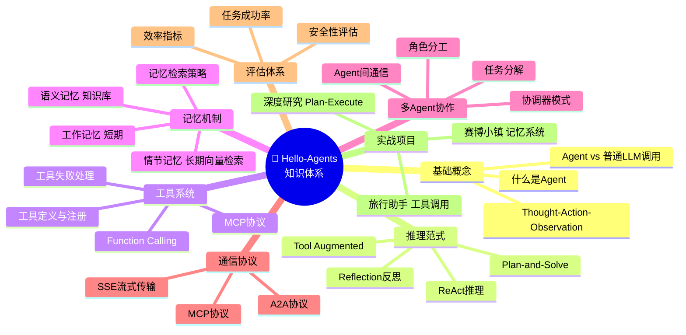
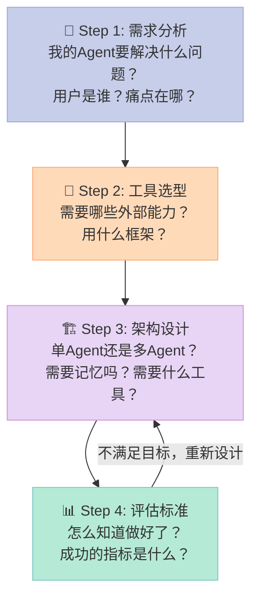
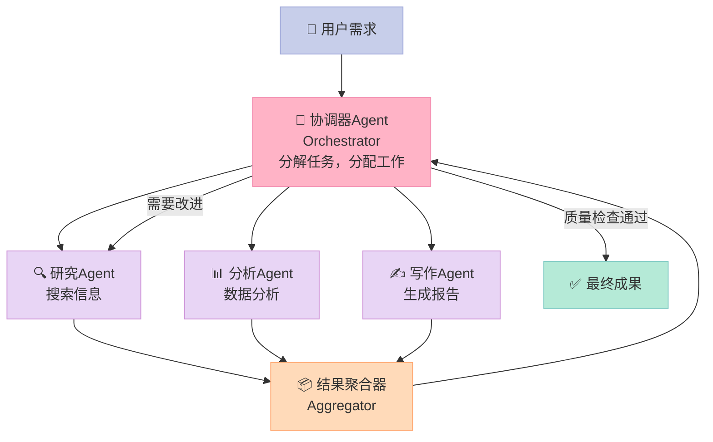

> **核心结论**：学完教程只是开始，真正的能力来自"把自己的问题变成Agent的问题"——这需要的不是更多技术知识，而是工程判断力：什么时候用Agent，用哪种Agent，怎么评估它够不够好。

---

<!-- more -->


恭喜你走到了这里。

如果你跟着hello-agents完整学完了前15章，你现在拥有的不只是知识——你有了**一套可以动手的工具集**。但工具集再多，如果永远只是练习别人的项目，技能不会真正属于你。

现在是时候问那个让很多人卡住的问题：**我要做什么？从哪里开始？**

这篇文章是hello-agents系列的压轴章节。我们会做三件事：
1. 用一张思维导图把16章的知识串起来
2. 给你一个从0到1的项目规划框架
3. 提供3个有难度梯度的实战方向，附完整项目骨架

## 一、16章知识体系：你已经掌握了什么

先来一次知识盘点。这不是为了自我感动，而是帮你找到"我的项目需要哪些模块"。



**你的优势**：16章覆盖了Agent工程的完整栈——从原理到实现到评估，从单Agent到多Agent，从工具调用到记忆系统。这套知识在业界并不多见，大多数人只会调用API。

**你的差距**：工程判断力。什么场景用什么范式？如何设计评估标准？如何处理边缘情况？这些只有真实项目能教你。

## 二、从0到1的项目规划框架

很多人卡在"不知道做什么"，但其实是卡在"不知道怎么想"。用这四步框架来规划：



### Step 1: 需求分析——别急着写代码

**好需求的三个特征：**
- **痛点真实**：你自己或身边的人真的被这个问题困扰
- **Agent适合**：需要多步推理、工具调用、或者处理不确定性——如果if-else就能搞定，不需要Agent
- **范围可控**：初学者做第一个项目，控制在2周内能出demo

**判断"这个问题需要Agent吗"：**

| 问题类型 | 适合Agent | 原因 |
|---------|-----------|------|
| 格式转换（PDF→Word）| ❌ | 确定性任务，写脚本更快 |
| 搜索汇总某个主题 | ✅ | 需要多步搜索+整合判断 |
| 根据内容分类邮件 | ⚠️ | 简单分类用传统ML，复杂语义才需要LLM |
| 代码审查+修改建议 | ✅ | 需要理解上下文+多步分析 |
| 定时发送固定内容 | ❌ | Cron job就够了 |
| 根据用户状态调整建议 | ✅ | 需要记忆+个性化推理 |

### Step 2: 工具选型——用最少的依赖解决问题

| 需求 | 推荐工具 | 理由 |
|------|---------|------|
| 快速原型 | Jupyter Notebook + hello-agents | 迭代快，可视化好 |
| Web应用 | FastAPI + Vue3 | 轻量，文档好，已有hello-agents范例 |
| 搜索能力 | DuckDuckGo（免费）/ Tavily（有API Key）| DDG零成本起步 |
| 文档处理 | LlamaIndex | 专为RAG优化 |
| 向量数据库 | Chroma（本地）/ Qdrant（生产）| Chroma零配置 |
| LLM | DeepSeek（便宜）/ GPT-4o-mini（稳定）| 开发阶段用便宜的 |

### Step 3: 架构设计——先简单后复杂

**黄金法则：先用单Agent能解决的方式，再考虑多Agent。**

单Agent什么时候够用：
- 任务可以用一个系统提示词描述完整
- 工具调用少于5种
- 不需要并行执行子任务

什么时候需要多Agent：
- 不同子任务需要完全不同的专业知识（不能用一个Prompt描述）
- 需要并行执行提高效率
- 系统规模大，单Agent的上下文窗口不够

### Step 4: 评估标准——在开始前就想好怎么算分

| 评估维度 | 适合什么项目 | 怎么测 |
|---------|------------|--------|
| 任务完成率 | 所有Agent | 手工标注50个测试用例，看通过率 |
| 响应时间 | 实时应用 | 计时工具测量P95延迟 |
| 用户满意度 | 对话类 | 5分李克特量表问卷 |
| 工具调用准确率 | 工具密集型 | 对比期望工具调用序列 |
| 幻觉率 | 事实类 | 人工核实关键陈述 |

## 三、3个实战方向（带难度评级和完整骨架）

### 方向一：个人知识助手 ⭐⭐（适合初学者）

**核心功能**：把你的笔记、PDF、网页收藏变成可以对话的知识库。提问"我上个月学了什么关于Agent的内容？"，它能检索并总结。

**技术架构**：RAG（检索增强生成）+ 单Agent + 向量数据库

**为什么适合初学者**：技术链路清晰，没有多Agent协调的复杂性，结果很直观可验证。

```python
"""
个人知识助手 - 完整项目骨架
可以在此基础上直接扩展

依赖安装：
pip install openai chromadb langchain pypdf2 python-dotenv
"""

import os
import hashlib
from pathlib import Path
from typing import Optional
from dataclasses import dataclass
import chromadb
from openai import OpenAI
from dotenv import load_dotenv

load_dotenv()

client = OpenAI(api_key=os.getenv("OPENAI_API_KEY"))

# 初始化向量数据库（本地，无需额外配置）
chroma_client = chromadb.PersistentClient(path="./knowledge_base")
collection = chroma_client.get_or_create_collection(
    name="personal_notes",
    metadata={"hnsw:space": "cosine"}  # 使用余弦相似度
)


def get_embedding(text: str) -> list[float]:
    """获取文本的向量表示"""
    response = client.embeddings.create(
        model="text-embedding-3-small",
        input=text[:8000]  # 限制长度
    )
    return response.data[0].embedding


def add_document(content: str, source: str, doc_type: str = "note") -> str:
    """
    添加文档到知识库
    
    Args:
        content: 文档内容
        source: 来源（文件路径或URL）
        doc_type: 文档类型（note/pdf/webpage）
    
    Returns:
        文档ID
    """
    # 生成唯一ID（基于内容哈希）
    doc_id = hashlib.md5(content.encode()).hexdigest()[:12]
    
    # 长文档分块处理（每块500字，重叠50字）
    chunks = []
    chunk_size = 500
    overlap = 50
    
    for i in range(0, len(content), chunk_size - overlap):
        chunk = content[i:i + chunk_size]
        if chunk.strip():
            chunks.append(chunk)
    
    # 批量添加到向量数据库
    chunk_ids = [f"{doc_id}_{i}" for i in range(len(chunks))]
    embeddings = [get_embedding(chunk) for chunk in chunks]
    
    collection.add(
        ids=chunk_ids,
        embeddings=embeddings,
        documents=chunks,
        metadatas=[{
            "source": source,
            "doc_type": doc_type,
            "doc_id": doc_id,
            "chunk_index": i
        } for i in range(len(chunks))]
    )
    
    print(f"✅ 已添加文档：{source}（{len(chunks)}个片段）")
    return doc_id


def add_pdf(file_path: str) -> str:
    """从PDF文件添加内容到知识库"""
    try:
        import PyPDF2
        
        with open(file_path, "rb") as f:
            reader = PyPDF2.PdfReader(f)
            content = "\n".join([
                page.extract_text() 
                for page in reader.pages
                if page.extract_text()
            ])
        
        return add_document(content, file_path, doc_type="pdf")
    except ImportError:
        print("请先安装：pip install PyPDF2")
        raise


def search_knowledge(query: str, top_k: int = 5) -> list[dict]:
    """
    语义搜索知识库
    
    Args:
        query: 搜索问题
        top_k: 返回的最相关片段数量
    
    Returns:
        最相关的文档片段列表
    """
    query_embedding = get_embedding(query)
    
    results = collection.query(
        query_embeddings=[query_embedding],
        n_results=top_k,
        include=["documents", "metadatas", "distances"]
    )
    
    hits = []
    for i, (doc, meta, dist) in enumerate(zip(
        results["documents"][0],
        results["metadatas"][0],
        results["distances"][0]
    )):
        hits.append({
            "content": doc,
            "source": meta.get("source", "未知"),
            "doc_type": meta.get("doc_type", "note"),
            "similarity": 1 - dist  # 转换为相似度（越高越好）
        })
    
    return hits


def answer_question(question: str) -> str:
    """
    基于知识库回答问题（RAG核心流程）
    
    Args:
        question: 用户问题
    
    Returns:
        基于知识库的回答
    """
    # Step 1: 检索相关内容
    relevant_docs = search_knowledge(question, top_k=5)
    
    if not relevant_docs:
        return "知识库中暂无相关内容。请先添加一些文档！"
    
    # Step 2: 构建上下文
    context = "\n\n".join([
        f"【来源：{doc['source']}】\n{doc['content']}"
        for doc in relevant_docs
        if doc['similarity'] > 0.3  # 只使用相似度>0.3的内容
    ])
    
    if not context:
        return "找到了一些内容，但与问题相关性较低。请尝试换个问题角度。"
    
    # Step 3: 用LLM生成回答
    system_prompt = """你是用户的个人知识助手。
    
根据提供的知识库内容回答问题：
- 只基于知识库内容回答，不要编造
- 如果知识库内容不足以完整回答，说明局限性
- 在回答末尾标注信息来源
- 用简洁清晰的语言"""

    response = client.chat.completions.create(
        model="gpt-4o-mini",
        messages=[
            {"role": "system", "content": system_prompt},
            {"role": "user", "content": f"""知识库内容：
{context}

用户问题：{question}"""}
        ]
    )
    
    return response.choices[0].message.content


# 交互式对话循环
def chat_loop():
    """启动知识助手的交互式对话"""
    print("🧠 个人知识助手已启动！")
    print("命令：/add <文件路径> 添加文档 | /quit 退出")
    print("-" * 40)
    
    doc_count = collection.count()
    print(f"当前知识库：{doc_count}个片段")
    
    while True:
        user_input = input("\n你：").strip()
        
        if not user_input:
            continue
        
        if user_input == "/quit":
            print("再见！")
            break
        
        elif user_input.startswith("/add "):
            file_path = user_input[5:].strip()
            if file_path.endswith(".pdf"):
                add_pdf(file_path)
            else:
                # 假设是文本文件
                with open(file_path, "r", encoding="utf-8") as f:
                    content = f.read()
                add_document(content, file_path)
        
        else:
            print("\n助手：", end="")
            answer = answer_question(user_input)
            print(answer)


if __name__ == "__main__":
    # 示例：添加一些测试内容
    sample_note = """
    Agent系统设计原则（2026年学习笔记）
    
    1. 工具要有容错处理
    每个工具调用都可能失败，必须有优雅降级。
    不要让工具失败导致整个Agent崩溃。
    
    2. Prompt要简洁专注
    每个Agent只干一件事，Prompt越简单越好。
    避免在一个Prompt里塞入太多职责。
    
    3. 先评估再优化
    没有测试集就无法知道优化是否有效。
    至少要有50个有标注的测试用例。
    """
    
    add_document(sample_note, "学习笔记/agent设计原则.md", "note")
    
    # 启动对话
    chat_loop()
```

### 方向二：代码审查Agent ⭐⭐⭐（适合开发者）

**核心功能**：自动分析代码，找出潜在问题、安全漏洞、性能瓶颈，给出具体改进建议（不只是说"可以优化"，而是给出改后的代码）。

**技术架构**：多工具Agent + ReAct推理

**关键工具**：
- `analyze_code_structure`：解析AST，找函数复杂度、未使用变量
- `check_security`：检测SQL注入、硬编码密码等常见漏洞
- `search_best_practices`：搜索该语言的最佳实践

```python
"""
代码审查Agent核心框架（骨架代码，可在此基础上扩展）
"""
import ast
import re
from openai import OpenAI
import json

client = OpenAI()

def analyze_python_structure(code: str) -> dict:
    """分析Python代码结构：函数数量、复杂度、注释率"""
    try:
        tree = ast.parse(code)
        
        functions = [node for node in ast.walk(tree) if isinstance(node, ast.FunctionDef)]
        classes = [node for node in ast.walk(tree) if isinstance(node, ast.ClassDef)]
        
        total_lines = len(code.split('\n'))
        comment_lines = sum(1 for line in code.split('\n') if line.strip().startswith('#'))
        
        return {
            "function_count": len(functions),
            "class_count": len(classes),
            "total_lines": total_lines,
            "comment_rate": f"{comment_lines/max(total_lines,1)*100:.1f}%",
            "functions": [f.name for f in functions]
        }
    except SyntaxError as e:
        return {"error": f"语法错误：{str(e)}"}


def check_security_issues(code: str) -> list[dict]:
    """检测常见安全问题"""
    issues = []
    
    # 硬编码密码检测
    password_patterns = [
        r'password\s*=\s*["\'][^"\']+["\']',
        r'api_key\s*=\s*["\'][^"\']+["\']',
        r'secret\s*=\s*["\'][^"\']+["\']'
    ]
    for pattern in password_patterns:
        matches = re.finditer(pattern, code, re.IGNORECASE)
        for match in matches:
            issues.append({
                "type": "硬编码敏感信息",
                "severity": "HIGH",
                "location": f"第{code[:match.start()].count(chr(10))+1}行",
                "content": match.group()[:50] + "...",
                "suggestion": "使用环境变量或配置文件存储敏感信息"
            })
    
    # SQL注入检测（简化版）
    if re.search(r'execute\s*\(\s*["\'].*\%s', code) or \
       re.search(r'execute\s*\(\s*f["\']', code):
        issues.append({
            "type": "SQL注入风险",
            "severity": "HIGH",
            "location": "SQL查询语句",
            "suggestion": "使用参数化查询而非字符串格式化"
        })
    
    return issues


# Agent工具列表
CODE_REVIEW_TOOLS = [
    {
        "type": "function",
        "function": {
            "name": "analyze_python_structure",
            "description": "分析Python代码的结构：函数数量、复杂度、注释率等",
            "parameters": {
                "type": "object",
                "properties": {
                    "code": {"type": "string", "description": "要分析的Python代码"}
                },
                "required": ["code"]
            }
        }
    },
    {
        "type": "function",
        "function": {
            "name": "check_security_issues",
            "description": "检测代码中的安全漏洞：硬编码密码、SQL注入等",
            "parameters": {
                "type": "object",
                "properties": {
                    "code": {"type": "string", "description": "要检测的代码"}
                },
                "required": ["code"]
            }
        }
    }
]

TOOL_MAP = {
    "analyze_python_structure": analyze_python_structure,
    "check_security_issues": check_security_issues,
}

def review_code(code: str, language: str = "python") -> str:
    """运行代码审查Agent"""
    messages = [
        {
            "role": "system",
            "content": """你是一个专业的代码审查专家。
            
审查维度：
1. 代码结构和可读性
2. 安全漏洞
3. 性能问题
4. 最佳实践

输出格式：
- 问题按严重程度分类（HIGH/MEDIUM/LOW）
- 每个问题给出具体的改进代码示例
- 最后给出总体评分（0-100）"""
        },
        {
            "role": "user",
            "content": f"请审查以下{language}代码：\n\n```{language}\n{code}\n```"
        }
    ]
    
    for _ in range(5):  # 最多5轮工具调用
        response = client.chat.completions.create(
            model="gpt-4o",
            messages=messages,
            tools=CODE_REVIEW_TOOLS,
            tool_choice="auto"
        )
        
        message = response.choices[0].message
        
        if not message.tool_calls:
            return message.content
        
        messages.append(message)
        
        for tool_call in message.tool_calls:
            tool_name = tool_call.function.name
            tool_args = json.loads(tool_call.function.arguments)
            
            result = TOOL_MAP[tool_name](**tool_args)
            messages.append({
                "role": "tool",
                "tool_call_id": tool_call.id,
                "content": json.dumps(result, ensure_ascii=False)
            })
    
    return "审查完成"
```

### 方向三：多Agent协作平台 ⭐⭐⭐⭐⭐（挑战项目）

**核心功能**：用户描述一个复杂任务（如"帮我写一份完整的竞品分析报告"），系统自动分解任务，协调多个专职Agent并行工作，汇总成最终成果。

**技术架构**：Orchestrator-Worker模式 + 动态任务分配



这个项目的真正难点不是写代码，而是**设计Agent间的接口**：Worker Agent输出什么格式？Orchestrator怎么判断质量够不够好？什么时候停止迭代？建议作为第二个项目，在完成方向一或方向二之后挑战。

## 四、如何提交到hello-agents社区

做完项目别只留在本地。提交到 [hello-agents](https://github.com/datawhalechina/hello-agents) 的`Co-creation-projects`目录，让更多人看到你的成果。

```bash
# 1. Fork仓库
# 访问 https://github.com/datawhalechina/hello-agents → Fork

# 2. 克隆到本地
git clone git@github.com:你的用户名/hello-agents.git
cd hello-agents

# 3. 创建开发分支
git checkout -b feature/你的项目名称

# 4. 创建项目目录（格式：GitHub用户名-项目名）
mkdir Co-creation-projects/你的用户名-项目名
cd Co-creation-projects/你的用户名-项目名

# 5. 添加必要文件
# - README.md（项目说明）
# - requirements.txt（依赖）
# - main.ipynb 或 main.py（核心代码）

# 6. 提交PR
git add .
git commit -m "feat: 添加个人知识助手项目"
git push origin feature/你的项目名称
# 然后在GitHub上点击"Create Pull Request"
```

**README必写内容：**
- 解决什么问题（一句话）
- 核心功能截图或GIF
- 快速开始命令（5分钟能跑起来）
- 技术栈列表

## 五、下一步如何深入？

学完hello-agents之后，你面前有三条路：

| 路线 | 适合谁 | 推荐资源 |
|------|---------|---------|
| **工程深入** | 想做AI应用开发 | LangGraph（复杂状态机）、AutoGen（微软多Agent框架）|
| **研究深入** | 想做AI科研 | Reflexion论文、MCTS for LLM、Agent安全性研究 |
| **产品方向** | 想做AI产品 | 研究真实用户需求，LLM应用产品设计模式 |

**必读论文（按重要性排序）：**

| 论文 | 核心贡献 | 难度 |
|------|---------|------|
| ReAct (Yao et al., 2023) | 推理+行动交织范式 | ⭐⭐ |
| Generative Agents (Park et al., 2023) | Agent记忆与社会模拟 | ⭐⭐⭐ |
| Reflexion (Shinn et al., 2023) | 语言反馈强化学习 | ⭐⭐⭐ |
| MetaGPT (Hong et al., 2023) | 多Agent软件工程 | ⭐⭐⭐ |
| AgentBench (Liu et al., 2023) | Agent能力评估基准 | ⭐⭐ |

**值得持续关注的社区：**
- [Datawhale开源社区](https://github.com/datawhalechina) — 本系列所在地
- [LangChain Blog](https://blog.langchain.dev/) — Agent工程实践
- [Hugging Face Daily Papers](https://huggingface.co/papers) — 最新Agent研究

## 六、总结：从学习者到构建者

学完16章，你已经不是只会提问的ChatGPT用户，也不只是能跑demo的入门者。

**你现在拥有的核心能力：**
- 设计Agent架构（知道什么时候用什么工具）
- 实现工具调用（Function Calling + 错误处理）
- 构建记忆系统（短期记忆+长期向量检索）
- 协调多Agent（分工合作，接口设计）
- 评估Agent系统（知道怎么算分）

**接下来最重要的一步，就是做出你自己的第一个项目。**

不用完美。不用完整。先跑起来，能回答一个真实的问题，就是成功。

> **最后一个挑战**：把你用hello-agents学到的最大收获，写成一篇博客发布出来。教别人是检验自己理解深度最好的方式。也许下一个系列教程，就是你写的。

---
## 📚 Hello Agents 系列导航

> 本文是《Hello Agents》入门系列第 **16** 章，共 16 章。

| 章节 | 标题 | 状态 |
|:---:|---|:---:|
| 第1章 | [初识智能体：LLM会聊天，Agent能办事](/2026/04/16/2026-04-16-hello-agents-ch01-intro-to-agents/) | ✅ |
| 第2章 | [智能体60年：从会下棋到能打工](/2026/04/16/2026-04-16-hello-agents-ch02-agent-history/) | ✅ |
| 第3章 | [LLM原理：它不理解语言，却比你更会用语言](/2026/04/16/2026-04-16-hello-agents-ch03-llm-basics/) | ✅ |
| 第4章 | [Agent思考三剑客：ReAct、Plan-and-Solve与Reflection](/2026/04/16/2026-04-16-hello-agents-ch04-classic-paradigms/) | ✅ |
| 第5章 | [不会写代码也能搭AI Agent？低代码平台实战指南](/2026/04/16/2026-04-16-hello-agents-ch05-low-code-platforms/) | ✅ |
| 第6章 | [当一个Agent不够用时：三大框架多智能体实战](/2026/04/16/2026-04-16-hello-agents-ch06-framework-practice/) | ✅ |
| 第7章 | [为什么要造轮子？200行Python手写Agent框架](/2026/04/16/2026-04-16-hello-agents-ch07-build-your-framework/) | ✅ |
| 第8章 | [Agent为何失忆？RAG与记忆系统深度解析](/2026/04/16/2026-04-16-hello-agents-ch08-memory-retrieval/) | ✅ |
| 第9章 | [Context Engineering：让Agent真正聪明的隐秘武器](/2026/04/16/2026-04-16-hello-agents-ch09-context-engineering/) | ✅ |
| 第10章 | [AI Agent如何与世界对话：MCP、A2A、ANP协议全解析](/2026/04/16/2026-04-16-hello-agents-ch10-agent-protocols/) | ✅ |
| 第11章 | [用强化学习驯服AI Agent：GRPO与Agentic RL全解析](/2026/04/16/2026-04-16-hello-agents-ch11-agentic-rl/) | ✅ |
| 第12章 | [你的Agent真的好用吗？智能体评估体系完全指南](/2026/04/16/2026-04-16-hello-agents-ch12-evaluation/) | ✅ |
| 第13章 | [用Agent规划日本5日游，2分钟搞定2小时的活](/2026/04/16/2026-04-16-hello-agents-ch13-travel-assistant/) | ✅ |
| 第14章 | [自动写研究报告的Agent：比ChatGPT深，但有盲点](/2026/04/16/2026-04-16-hello-agents-ch14-deep-research/) | ✅ |
| 第15章 | [赛博小镇：25个AI角色自主生活，涌现了什么？](/2026/04/16/2026-04-16-hello-agents-ch15-cyber-town/) | ✅ |
| **第16章** | **[学完16章，现在从0构建你自己的Agent](/2026/04/16/2026-04-16-hello-agents-ch16-graduation/)** | 👉 当前 |

