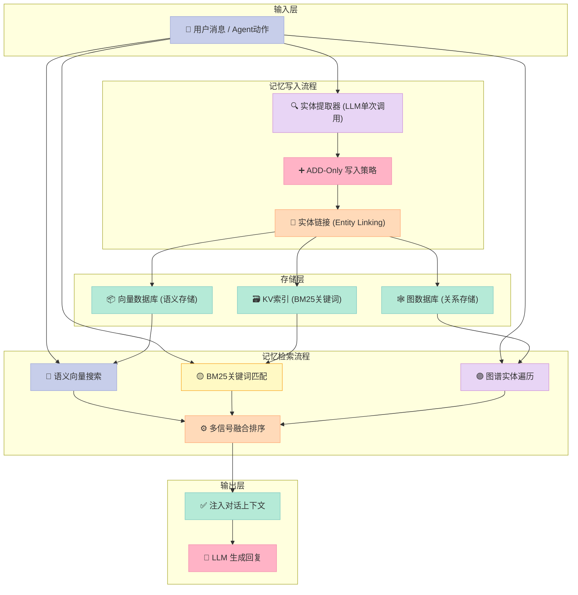
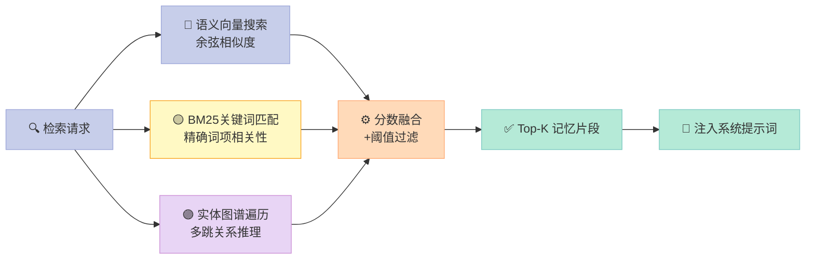
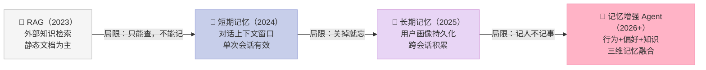

> **核心结论：** RAG 解决的是"查资料"问题，而 mem0 解决的是"记人心"问题——用单次 LLM 调用 + 三信号混合检索，把 AI Agent 的记忆准确率在 LoCoMo 基准上从 71.4 提升到 **91.6**，延迟控制在 1 秒以内。

---

## 前言

你一定遇到过这种场景：上周告诉 ChatGPT"我是素食主义者"，这周它推荐食谱时照样给你塞满了牛排。

这不是模型蠢，而是 **AI Agent 天生没有长期记忆**。每次对话都是一张白纸，过去的偏好、历史决策、用户个性——全部清零。

2024 年诞生的 [mem0](https://github.com/mem0ai/mem0)（读作 "mem-zero"）用一种优雅的方式解决了这个问题：**把记忆从对话上下文中剥离出来，单独管理，按需检索**。如今它已积累 **53k+ GitHub Stars**，被 100,000+ 开发者使用，并于 2026 年 4 月发布了新一代记忆算法，在多个学术基准上实现了 20+ 分的大幅跃升。

读完本文，你将理解：
- mem0 如何在技术层面实现"记忆"
- 新算法为何选择 ADD-only 而不是 UPDATE/DELETE
- 三信号混合检索（语义 + BM25 + 图谱）的设计逻辑
- 从 RAG 到 Memory-Augmented Agent，这个领域在走向何处

---

## 一、mem0 是什么：定位与核心能力

**mem0 不是一个 Agent 框架，而是一个插件式的记忆层（Memory Layer）。**

打个比方：如果 LangGraph 是 AI Agent 的"大脑皮层"，那 mem0 就是"海马体"——专门负责记忆的存储与检索，而不参与推理本身。

| 维度 | 描述 |
|------|------|
| **项目地址** | [github.com/mem0ai/mem0](https://github.com/mem0ai/mem0) |
| **Stars** | 53,000+（2026 年 4 月） |
| **License** | Apache 2.0 |
| **支持语言** | Python、TypeScript/JavaScript |
| **部署方式** | 自托管（开源）或托管平台（SaaS） |
| **背书** | Y Combinator S24 |
| **集成生态** | LangGraph、CrewAI、AutoGen、OpenAI Assistants |

**三种记忆维度：**

| 记忆类型 | 内容 | 举例 |
|----------|------|------|
| **用户记忆（User Memory）** | 跨会话的长期用户偏好 | "用户喜欢简洁的中文回复" |
| **会话记忆（Session Memory）** | 当前对话的上下文 | "本次对话在讨论 Python 部署问题" |
| **Agent 记忆（Agent Memory）** | Agent 自身的决策历史 | "上次部署用了 Docker，效果良好" |

---

## 二、技术方法深度解析

### 2.1 整体架构



### 2.2 新一代记忆算法（2026 年 4 月）

2026 年 4 月，mem0 发布了重大算法升级，核心变化只有三点，但影响深远：

**变化一：ADD-Only 单次提取（最重要）**

旧算法在写入记忆时需要对已有记忆执行 UPDATE 或 DELETE 操作——这意味着每次写入都需要先检索现有记忆，再决定如何合并或删除，多次 LLM 调用，延迟高、成本高。

新算法彻底抛弃了 UPDATE/DELETE，转为**纯追加（ADD-Only）**：
- 每次交互只用 **1 次 LLM 调用** 提取事实
- 新事实直接追加写入，旧记忆永远保留
- 检索时由多信号排序决定哪条记忆更"新鲜"、更相关

**变化二：Agent 行为即事实（Agent Facts First-Class）**

旧系统主要记录用户说的话，Agent 执行的动作（"部署成功了"、"用户选择了方案 B"）被忽略。新系统将 Agent 确认执行的动作**与用户偏好同等权重**写入记忆。

**变化三：实体链接（Entity Linking）**

提取到的实体（人名、地点、产品名等）会被分配稳定 ID，**跨记忆条目之间自动建立关联**。这样当你问"Alice 搬家之前住在哪？"时，系统能通过图谱追踪到历史记忆，而不仅靠语义相似度模糊匹配。

**算法升级效果（与旧算法对比）：**

| 基准测试 | 旧算法 | 新算法 | 提升 |
|----------|--------|--------|------|
| **LoCoMo** | 71.4 | **91.6** | +20.2 |
| **LongMemEval** | 67.8 | **93.4** | +25.6 |
| **BEAM (1M tokens)** | — | **64.1** | 首次测试 |
| **BEAM (10M tokens)** | — | **48.6** | 首次测试 |
| **平均 Token 消耗** | ~25,000 | **~6,900** | 降低 72% |
| **P50 延迟** | >2s | **0.88~1.09s** | 降低 50%+ |

> 这组数字意味着什么？LongMemEval 的 +25.6 分代表 AI 助手在长期交互中的记忆召回准确率，从"还行"提升到了"接近人类短期记忆水平"。

### 2.3 三信号混合检索

检索是 mem0 的另一个核心差异点。检索时三条管道**并行执行**，结果融合后返回：



三条管道各有侧重：

- **语义向量搜索**：用 embedding 捕捉语义相似性，擅长找"意思接近"的记忆，但对专有名词不敏感
- **BM25 关键词匹配**：对精确词项高度敏感，当用户问"我的 API Key 是什么"时，语义搜索可能返回笼统内容，BM25 能精确命中"API Key"相关记忆
- **实体图谱遍历**：支持多跳推理，能回答"我上次用的那个框架的主要竞争对手是什么"这类需要关联多条记忆的问题

**为什么需要三个信号而不是一个？**

因为单一信号都有盲区。纯向量搜索会漏掉精确词项；纯 BM25 会漏掉同义词和语义相关内容；图谱遍历适合关系推理但对开放域不擅长。三者互补，才能在不同问题类型上都保持高准确率。

---

## 三、如何使用 mem0

### 3.1 安装

```bash
# Python（基础版）
pip install mem0ai

# Python（增强版，含 BM25 + 实体提取）
pip install "mem0ai[nlp]"
python -m spacy download en_core_web_sm

# JavaScript/TypeScript
npm install mem0ai
```

### 3.2 最简单的使用模式

```python
from openai import OpenAI
from mem0 import Memory

openai_client = OpenAI()
memory = Memory()   # 默认使用本地向量存储

def chat_with_memory(message: str, user_id: str) -> str:
    # 第一步：检索相关历史记忆
    past = memory.search(query=message, filters={"user_id": user_id}, top_k=5)
    memories_str = "\n".join(f"- {m['memory']}" for m in past["results"])

    # 第二步：将记忆注入系统提示
    system = f"你是一个有记忆的助手。\n用户历史记忆:\n{memories_str}"
    msgs = [{"role": "system", "content": system},
            {"role": "user", "content": message}]

    # 第三步：调用 LLM 生成回复
    resp = openai_client.chat.completions.create(model="gpt-4o-mini", messages=msgs)
    reply = resp.choices[0].message.content

    # 第四步：提取本次对话中的新事实并写入记忆
    msgs.append({"role": "assistant", "content": reply})
    memory.add(msgs, user_id=user_id)   # ADD-Only，一次 LLM 调用完成提取

    return reply
```

### 3.3 与 LangGraph 集成

```python
from langgraph.graph import StateGraph
from mem0 import MemoryClient

client = MemoryClient(api_key="your-mem0-key")

def retrieve_memories(state):
    user_id = state["user_id"]
    query = state["messages"][-1]["content"]
    # 从 mem0 平台检索记忆，注入到 state
    memories = client.search(query, user_id=user_id, limit=5)
    state["context"] = [m["memory"] for m in memories]
    return state

def save_memories(state):
    client.add(state["messages"], user_id=state["user_id"])
    return state

# 在 LangGraph 节点中嵌入 mem0
builder = StateGraph(dict)
builder.add_node("retrieve", retrieve_memories)
builder.add_node("llm", call_llm_node)
builder.add_node("save", save_memories)
builder.set_entry_point("retrieve")
builder.add_edge("retrieve", "llm")
builder.add_edge("llm", "save")
```

### 3.4 CLI 快速体验

```bash
npm install -g @mem0/cli

mem0 init
mem0 add "我喜欢简短的技术回答，不需要废话" --user-id alice
mem0 add "我的主力语言是 Python 和 TypeScript" --user-id alice
mem0 search "适合我的编程工具推荐" --user-id alice
```

---

## 四、与同类方案横向对比

| 维度 | **mem0** | **Letta (MemGPT)** | **LangMem** | **Zep** |
|------|----------|--------------------|-------------|---------|
| 定位 | 插件式记忆层 | 完整 Agent 运行时 | LangChain 专属 | 生产级混合记忆 |
| 接入方式 | API/SDK 插件 | Agent 原生内置 | LangChain 节点 | API/SDK |
| 框架依赖 | ✅ 无依赖 | ❌ 需在 Letta 内运行 | ⚠️ 绑定 LangChain | ✅ 无依赖 |
| 图谱记忆 | ✅ 支持 | ⚠️ 有限 | ❌ 无 | ✅ 支持 |
| BM25 检索 | ✅ 内置 | ❌ 无 | ⚠️ 可配置 | ✅ 内置 |
| 开源协议 | Apache 2.0 | Apache 2.0 | MIT | SSPL（受限） |
| 自托管 | ✅ 完整支持 | ✅ 支持 | ✅ 支持 | ⚠️ 部分限制 |
| SaaS 平台 | ✅ 企业级 | ✅ 有 | ❌ 无 | ✅ 有 |
| GitHub Stars | 53k+ | 21k+ | 5k+ | 3k+ |

**核心差异一句话总结：**

- **mem0**：最像"记忆芯片"，插哪个框架都能用
- **Letta**：最像"记忆型 Agent 操作系统"，功能完整但侵入性强
- **LangMem**：LangChain 生态的原住民，不在这个生态就别考虑
- **Zep**：注重时序推理，适合需要追踪事件时间线的场景

---

## 五、趋势：从 RAG 到记忆增强 Agent

mem0 的技术路径，其实折射出整个 AI Agent 领域的一个核心演进方向：



**RAG 的根本局限**在于它只是"查资料"——你问什么，它找什么，但它不记得你这个人。下次对话，它还是不认识你。

**短期记忆（对话上下文）**解决了单次会话的连贯性，但关掉浏览器就消失。

**长期记忆（mem0 的核心贡献）**让 AI 真正记住用户跨越多次对话的偏好和历史。

**记忆增强 Agent（下一阶段）**的方向是三维融合：不仅记住用户偏好，还记住 Agent 自身的行为决策历史，以及领域知识库——让 Agent 像一个有经验的同事，而不是每次都要从头解释背景的临时工。

**这个趋势背后有两个关键推力：**

1. **Token 成本下降的边际效益递减**：Context Window 变大了，但把所有历史都塞进 Prompt 的做法太粗暴——Token 成本高、检索精度低。精准的记忆系统（用 6,900 token 达到 91.6 分）比暴力全量上下文（用 25,000 token 还不如它）更有竞争力。

2. **个性化 AI 产品的市场需求**：用户越来越不满足于"通用助手"，他们要的是"认识我的助手"。mem0 对应的应用场景——客服、医疗、教育、游戏——无一不是高度个性化的刚需市场。

---

## 六、局限性与适用边界

mem0 不是银弹，有几个值得注意的边界：

- **ADD-Only 带来的存储膨胀**：记忆只增不删，长期运行后存储量会持续增长，需要定期维护或设定淘汰策略
- **提取质量依赖底层 LLM**：记忆提取的准确性直接受 LLM 能力影响，使用较弱的模型时提取的事实可能不准确
- **图谱记忆是 Pro 功能**：开源版本的图谱记忆能力有限，完整能力需要订阅托管平台
- **冷启动问题**：新用户没有记忆数据时，系统无法体现优势，需要积累一定交互量

---

## 结论

**mem0 证明了一件事：AI Agent 的长期记忆问题，是一个工程问题，而不是模型能力问题。**

不需要更大的 Context Window，不需要更强的 LLM——只需要一个设计精良的记忆层，三信号并行检索，单次 LLM 提取，实体跨记忆链接。

这是从"更大"到"更精"的范式转变。

如果你在构建任何需要记住用户的 AI 应用——无论是客服机器人、个人助理还是教育 Agent——mem0 是目前最值得优先考虑的记忆方案。

```bash
# 5 分钟开始体验
pip install "mem0ai[nlp]"
python -m spacy download en_core_web_sm
```

---

> **延伸阅读：**
> - [mem0 GitHub 仓库](https://github.com/mem0ai/mem0)
> - [mem0 学术论文（arXiv:2504.19413）](https://arxiv.org/abs/2504.19413)
> - [新算法迁移指南](https://docs.mem0.ai/migration/oss-v2-to-v3)
> - [AWS 集成实践：用 Valkey + Neptune 构建持久记忆](https://aws.amazon.com/blogs/database/build-persistent-memory-for-agentic-ai-applications-with-mem0-open-source-amazon-elasticache-for-valkey-and-amazon-neptune-analytics/)
> - [开源记忆基准测试框架](https://github.com/mem0ai/memory-benchmarks)
