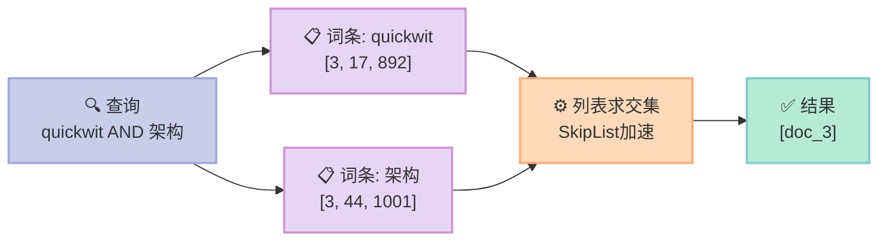
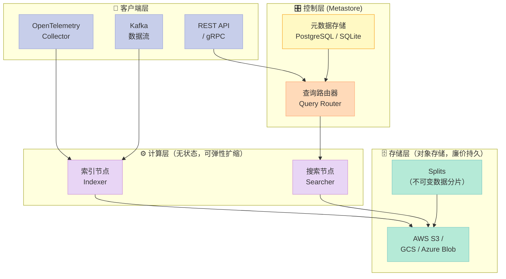
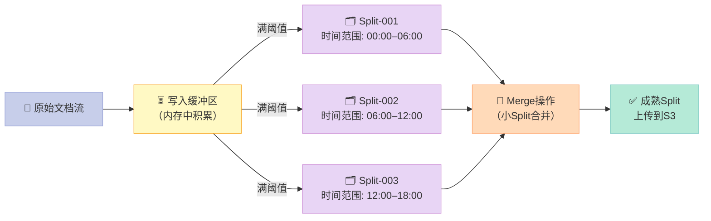
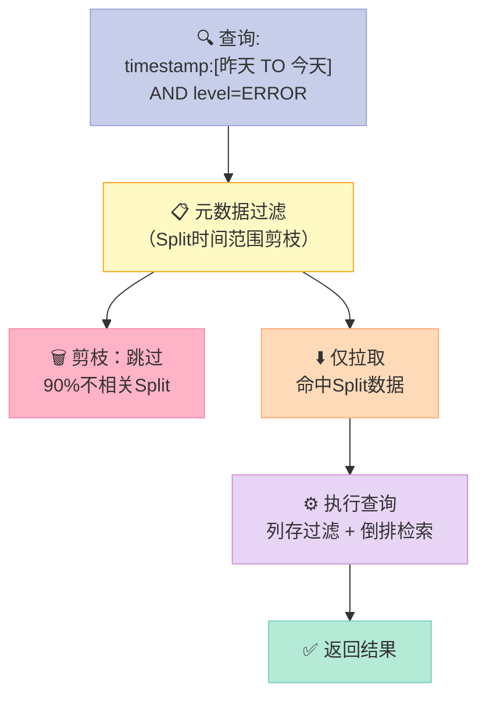

> **核心结论**：Quickwit 并非靠更快的硬件取胜，而是靠更聪明的数据结构和存储策略——把"搜"这件事的时间复杂度从 O(N) 降到接近 O(log N)，再配合 Rust 的零开销抽象，才做到了用对象存储（S3）替代昂贵 SSD 却比 Elasticsearch 快 10 倍的壮举。

---

## 前言

你有没有见过这样的场景：1TB 的日志文件，`grep` 要跑 40 分钟，Elasticsearch 索引要 8 GB 内存，结果线上查一次都要超时。

这不是硬件太差，是工具选错了。

**Quickwit** 是 2022 年开源的云原生分布式搜索引擎（Search Engine），用 Rust 编写，专为**日志、追踪、安全事件**等海量非结构化文本设计。它的核心主张是：把索引存在廉价对象存储（Object Storage）上，用完即销毁计算节点，搜索延迟依然在亚秒级。

读完本文你将获得：
- 全文索引（Full-Text Index）的底层数据结构原理
- Quickwit 的三大加速机制：倒排索引 + 列存储 + 分片并行
- 一套可直接运行的本地上手教程（含 Docker + REST API）
- 与 Elasticsearch 的关键差异对比，帮你做技术选型

---

## 一、全文索引是什么？——先把基础打扎实

先说结论：**全文索引的本质是用空间换时间**，把原本要逐行扫描文档的工作，变成提前建好一张"词→文档"的地图。

### 1.1 没有索引时发生什么？

想象图书馆有 100 万本书，每本书有 500 页。你要找"Quickwit 的架构"，如果没有目录——只能从第一本第一页逐页翻，最坏情况要翻 5 亿页。这就是全表扫描（Full Table Scan）。

### 1.2 倒排索引（Inverted Index）：图书馆的词典

图书馆的解决方案是**索引卡**：每个关键词一张卡片，卡片上记录"这个词出现在哪些书的哪些页"。

```
词条(Term)   →   文档列表(Posting List)
──────────────────────────────────────
"quickwit"  →  [doc_3, doc_17, doc_892]
"架构"      →  [doc_3, doc_44, doc_1001]
"索引"      →  [doc_3, doc_17, doc_55, ...]
```

查询"quickwit AND 架构"时，只需取两个列表的**交集**：`{doc_3}`，时间复杂度从 O(N) 降到 O(k)，其中 k 是命中文档数。



### 1.3 文本分词（Tokenization）：把句子拆成词条

"Quickwit的架构设计很精妙"在建索引前会先被**分词器（Tokenizer）**拆解：

```
原文：Quickwit的架构设计很精妙
↓ 分词
词条：["quickwit", "架构", "设计", "精妙"]
↓ 词干化/归一化
词条：["quickwit", "架构", "设计", "精妙"]   ← 中文通常逐字或使用结巴分词
```

分词质量直接决定搜索召回率（Recall），这是为什么中文搜索需要专门的中文分词器（如 Jieba）。

---

## 二、Quickwit 的架构设计——三层加速机制

Quickwit 在标准倒排索引之上叠加了三层额外优化，让它在对象存储上也能跑得飞快。

### 2.1 整体架构



**关键设计决策**：计算层与存储层彻底解耦。搜索节点可以按需启动、用完关掉，索引数据永久存在 S3。这和 Elasticsearch 把计算+存储绑死在同一个节点上形成了根本性差异。

### 2.2 加速机制一：Split 分片架构（并行化）

Quickwit 把索引数据切成若干个**不可变 Split（分片）**，每个 Split 是一个独立的小型 Tantivy（Rust 全文搜索库）索引，大小约 5–10 GB。



查询时，多个搜索节点并行扫描不同的 Split，结果汇聚后返回。**理论加速比 = Split 数量**。100 个 Split 就是 100 倍并行。

### 2.3 加速机制二：Tantivy 列存储（Fast Fields）

Quickwit 底层使用 **Tantivy**，这是 Rust 生态中最成熟的全文搜索库（类比 Java 的 Lucene）。

Tantivy 对数值型和时间型字段提供**列存储（Columnar Store）**，称为 Fast Fields：

```
行存储（Row Store）— 传统方式：
Doc1: {timestamp: 1713200000, level: "ERROR", message: "disk full"}
Doc2: {timestamp: 1713200001, level: "INFO",  message: "startup ok"}
Doc3: {timestamp: 1713200002, level: "WARN",  message: "high memory"}

列存储（Columnar Store）— Fast Fields：
timestamp列: [1713200000, 1713200001, 1713200002, ...]
level列:     ["ERROR", "INFO", "WARN", ...]
```

**为什么列存储快？**
当你执行 `timestamp:[now-1h TO now]` 这类范围过滤时，列存储只需读取 `timestamp` 这一列，完全跳过 `message` 列的数百 GB 数据。配合 SIMD（单指令多数据）指令，可以同时对 8 个值做比较。

### 2.4 加速机制三：ZSTD 压缩 + 稀疏索引（减少 I/O）

S3 的瓶颈不是计算，是**网络 I/O**。Quickwit 用两招减少从 S3 拉取的数据量：

**压缩（Compression）**：倒排列表（Posting List）用 ZSTD 算法压缩，日志文本通常能压到原始大小的 10–15%。1 TB 日志只需从 S3 拉取约 100–150 GB。

**稀疏索引（Sparse Index）**：每个 Split 有一个轻量级元数据文件，记录该 Split 包含的**时间范围**和**字段最大最小值**。查询时，路由器先过滤掉不可能命中的 Split，根本不去 S3 拉那些文件。



---

## 三、为什么这样设计？——设计动机深挖

### 3.1 不可变 Split 的代价与收益

不可变（Immutable）意味着每次写入不会改变已有文件，只会新增 Split。这带来三个好处：
1. **无锁读**：搜索节点读 Split 时不需要加任何锁，天然并发安全
2. **S3 友好**：对象存储天生支持写一次读多次（Write Once Read Many），不可变文件完美契合
3. **简化故障恢复**：Split 要么完整，要么不存在，不会有"写到一半"的脏数据

代价是：**实时性不如 Elasticsearch**。Quickwit 的最小索引延迟约 30 秒（写缓冲满了才生成 Split），而 Elasticsearch 可以做到近实时（Near Real-Time，NRT）约 1 秒。

**结论**：如果你做的是实时交易监控，Quickwit 不适合；如果是日志审查、安全事件分析，30 秒完全够用。

### 3.2 BM25 相关性打分（Relevance Scoring）

Quickwit 继承了 Tantivy 的 BM25（Best Matching 25）算法进行相关性打分，公式简化为：

```
Score(doc, query) = Σ IDF(term) × TF(term, doc) / (TF + k₁ × (1 - b + b × |doc|/avgdl))
```

- **IDF（逆文档频率）**：词越罕见，权重越高。"的"出现在所有文档里，得分贡献接近 0；"Quickwit" 只出现在少数文档里，权重很高
- **TF（词频）**：词在文档中出现越多，相关性越高，但有 k₁ 做上限平滑，防止"关键词堆砌"作弊
- **|doc|/avgdl**：文档长度归一化，避免长文档因词多而占便宜

---

## 四、实战教程——10 分钟跑起来

### 4.1 环境准备

```bash
# 方式一：Docker（推荐，零配置）
docker pull quickwit/quickwit:latest

# 方式二：二进制包（Linux/macOS）
curl -L https://install.quickwit.io | sh
export PATH="$PWD/quickwit:$PATH"
```

### 4.2 启动本地服务

```bash
# 启动单节点模式，数据存本地磁盘
docker run -d \
  --name quickwit \
  -p 7280:7280 \
  -v $(pwd)/qw-data:/quickwit/qwdata \
  quickwit/quickwit:latest \
  run

# 验证服务正常
curl http://localhost:7280/api/v1/version
```

### 4.3 创建索引

Quickwit 需要预先定义索引的字段类型（Schema）。日志场景下的典型配置：

```yaml
# my-logs-index.yaml
version: 0.8

index_id: my-logs

doc_mapping:
  mode: lenient           # 允许 schema 里没定义的字段
  field_mappings:
    - name: timestamp
      type: datetime
      input_formats: [unix_timestamp]
      fast: true           # 启用列存储（Fast Field）用于时间范围过滤
      stored: false        # 不存储原始值，节省空间

    - name: level
      type: text
      tokenizer: raw       # 不分词，精确匹配（ERROR/WARN/INFO）
      fast: true

    - name: message
      type: text
      tokenizer: default   # 标准分词器，支持全文搜索

    - name: service
      type: text
      tokenizer: raw
      fast: true

  timestamp_field: timestamp   # 告诉 Quickwit 时间戳字段，用于 Split 剪枝

indexing_settings:
  commit_timeout_secs: 30      # 30秒没有新数据就提交当前Split

search_settings:
  default_search_fields: [message]  # 不指定字段时搜 message
```

```bash
# 通过 REST API 创建索引
curl -X POST http://localhost:7280/api/v1/indexes \
  -H "Content-Type: application/yaml" \
  --data-binary @my-logs-index.yaml
```

### 4.4 写入数据

```bash
# 批量写入 NDJSON（换行分隔的 JSON）
curl -X POST "http://localhost:7280/api/v1/my-logs/ingest" \
  -H "Content-Type: application/json" \
  -d '
{"timestamp": 1713254400, "level": "ERROR", "service": "auth", "message": "Failed to authenticate user xuqi, invalid token"}
{"timestamp": 1713254401, "level": "INFO",  "service": "api",  "message": "Request processed successfully in 23ms"}
{"timestamp": 1713254402, "level": "WARN",  "service": "db",   "message": "Connection pool exhausted, waiting for available connection"}
{"timestamp": 1713254403, "level": "ERROR", "service": "auth", "message": "Rate limit exceeded for IP 192.168.1.100"}
'
```

### 4.5 执行查询

Quickwit 支持 Lucene 语法（和 Elasticsearch 查询语法兼容）：

```bash
# 全文搜索：找所有包含 "authenticate" 的日志
curl "http://localhost:7280/api/v1/my-logs/search?query=authenticate"

# 精确过滤：只看 ERROR 级别，最近1小时
curl "http://localhost:7280/api/v1/my-logs/search?query=level:ERROR&start_timestamp=1713250800"

# 组合查询：ERROR 级别 + message 包含 "token"
curl "http://localhost:7280/api/v1/my-logs/search?query=level:ERROR+AND+token"

# 聚合查询：按 service 统计 ERROR 数量（需要 Fast Field）
curl -X POST "http://localhost:7280/api/v1/my-logs/search" \
  -H "Content-Type: application/json" \
  -d '{
    "query": "level:ERROR",
    "max_hits": 0,
    "aggs": {
      "errors_by_service": {
        "terms": { "field": "service" }
      }
    }
  }'
```

### 4.6 查询响应示例

```json
{
  "hits": [
    {
      "timestamp": 1713254400,
      "level": "ERROR",
      "service": "auth",
      "message": "Failed to authenticate user xuqi, invalid token"
    }
  ],
  "num_hits": 2,
  "elapsed_time_micros": 1823,   // ← 1.8毫秒！
  "errors": []
}
```

---

## 五、与 Elasticsearch 的核心差异

| 维度 | Quickwit | Elasticsearch |
|------|----------|---------------|
| 实现语言 | ✅ Rust（零 GC 停顿） | ⚠️ Java（GC 停顿可达 100ms+） |
| 存储后端 | ✅ 对象存储（S3/GCS，$0.023/GB/月） | ❌ 本地 SSD（约 $0.1/GB/月） |
| 计算与存储分离 | ✅ 完全解耦 | ❌ 强绑定，扩容需迁移数据 |
| 写入实时性 | ⚠️ 最小延迟 ~30s | ✅ 近实时 ~1s |
| 全文搜索延迟 | ✅ 亚秒（在对象存储上） | ✅ 亚秒（在本地 SSD 上） |
| 内存占用 | ✅ 极低（无 JVM 堆） | ❌ 高（需预留 heap size） |
| 运维复杂度 | ✅ 简单（无需分片规划） | ⚠️ 高（需提前规划分片数） |
| 中文分词支持 | ⚠️ 有插件但不如 ES 成熟 | ✅ IK 分词器成熟稳定 |
| 向量搜索（Vector Search） | ❌ 不支持 | ✅ kNN 向量搜索 |
| 生态成熟度 | ⚠️ 2022年开源，快速迭代中 | ✅ 十余年积累，生态丰富 |
| 适用场景 | ✅ 日志、追踪、安全事件 | ✅ 通用全文搜索、电商、推荐 |

### 成本对比（10 TB 日志，保存 90 天）

```
Elasticsearch（3节点 × 16核 64GB，每节点挂 4TB SSD）：
  计算：3 × $3,000/月 = $9,000/月
  存储：12TB SSD ≈ $1,200/月
  合计：≈ $10,200/月

Quickwit（按需 2 个搜索节点 + S3 存储）：
  计算：2 × $200/月（按需，空闲时关机）= $400/月
  存储：10TB × $0.023/GB = $230/月
  合计：≈ $630/月
```

**差距超过 15 倍**。如果你的日志体量超过几 TB，这个成本差异足以支撑技术迁移的工作量。

---

## 六、优缺点与适用场景

### Quickwit 的局限

1. **实时性短板**：最小索引延迟 30 秒，不适合"秒级监控告警"
2. **中文支持弱**：官方分词器对中文不友好，需要额外配置 jieba 或 lindera 插件
3. **生态年轻**：Kibana/Grafana 集成有限，官方提供 Jaeger UI 和基础 Web UI，功能比 Kibana 简陋
4. **无向量搜索**：不支持语义搜索，不适合 RAG 场景

### 最适合 Quickwit 的场景

- ✅ **可观测性平台**（Observability）：日志、链路追踪（Trace）、指标（Metrics）
- ✅ **安全信息与事件管理**（SIEM）：海量安全事件审计
- ✅ **云原生环境**：Kubernetes 上按需拉起搜索节点，用完关掉
- ✅ **成本敏感项目**：存算分离带来显著成本优势

### 不适合 Quickwit 的场景

- ❌ **电商搜索**：需要实时索引、中文分词、向量召回，Elasticsearch 更成熟
- ❌ **交易系统日志**：实时性要求 <1s，需要 Elasticsearch 或 ClickHouse
- ❌ **语义搜索**：需要向量数据库（Milvus/Weaviate）或向量化 ES

---

## 五、对你的启发与建议

全文搜索的加速从来不是"买更好的机器"，而是**在正确的抽象层做正确的数据结构选择**：

- 倒排索引把查询从 O(N) 变成 O(k)
- 列存储让过滤操作跳过 90% 的无关数据
- 分片并行让单机限制变成水平扩展
- Split 剪枝让 S3 的高延迟变得可以接受

Quickwit 不是 Elasticsearch 的全面替代，而是一个**更专注的工具**：为可观测性和日志分析场景做了深度优化，代价是牺牲了实时性和通用性。

**我的建议**：
1. 如果你现在用 Elasticsearch 做日志管理，成本超过 $1,000/月，**值得评估迁移到 Quickwit**
2. 如果你在 Kubernetes 上做新项目，直接用 Quickwit + OpenTelemetry Collector，**省去 ES 的运维负担**
3. 如果你做电商或需要实时搜索，**坚持用 Elasticsearch**，不要为了新鲜感而迁移

下一步行动：
- 📖 阅读 Quickwit 官方文档：https://quickwit.io/docs
- ⭐ 在 GitHub 上 Star 项目：https://github.com/quickwit-oss/quickwit
- 🔬 本地运行 `docker run quickwit/quickwit demo`，感受亿级数据的毫秒查询

---

> 搜索引擎的核心竞争力不在于代码写得有多炫，而在于有没有把数据放在"最省力气就能找到"的地方。Quickwit 做到了这一点。
