# RAGFlow开源RAG引擎完整入门教程：从零搭建基于深度文档理解的智能问答系统

## 前言

RAG（Retrieval-Augmented Generation）作为当前最火热的LLM应用架构之一，已经成为企业构建知识库问答系统的首选方案。然而传统的RAG实现面临诸多痛点：文档解析粗糙 Chunking效果差、检索精度不足、结果无法溯源、无法处理复杂格式文档等。

**RAGFlow** 是由 [Infiniflow](https://github.com/infiniflow) 开源的新一代RAG引擎，它将**深度文档理解（DeepDoc）**与**Agent能力**深度融合，被认为是目前最先进的开源RAG解决方案之一。

本文将从零开始，详细介绍RAGFlow的核心特性、系统架构、快速部署、配置使用，以及如何用它搭建一个生产级别的智能问答系统。

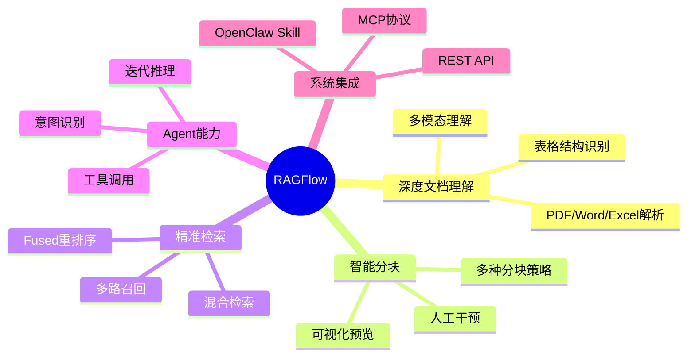

## 一、项目概览

### 1.1 什么是RAGFlow

RAGFlow是[Infiniflow](https://infiniflow.ai/)团队开源的**检索增强生成（RAG）引擎**，其核心特点是将深度文档理解技术与RAG全流程深度整合。

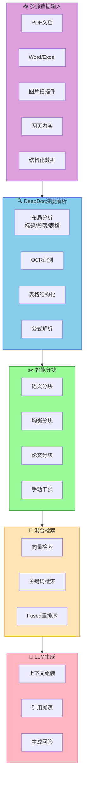

### 1.2 核心数据

| 指标 | 数据 |
|------|------|
| **GitHub Stars** | 28,000+ |
| **Fork** | 3,500+ |
| **最新版本** | v0.24.0 |
| **语言** | Python + React |
| **首次发布** | 2024年 |
| **维护团队** | Infiniflow |

### 1.3 关键特性

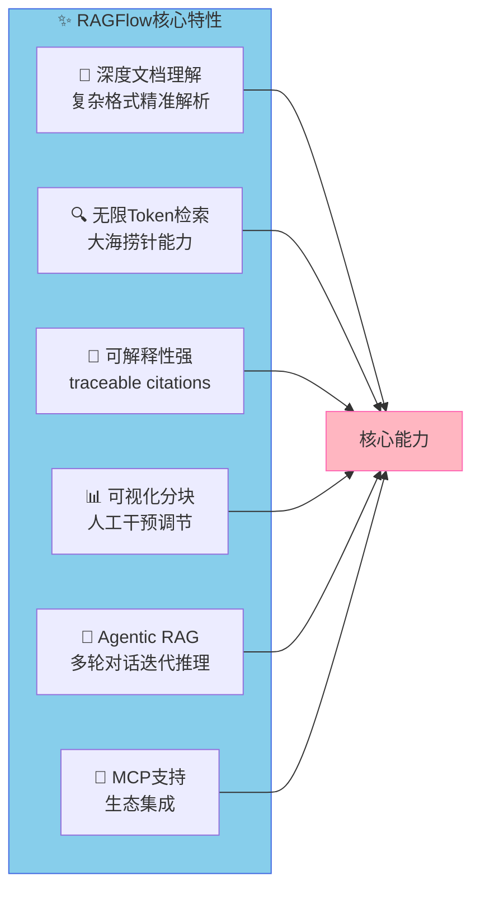

## 二、技术架构解析

### 2.1 系统架构图

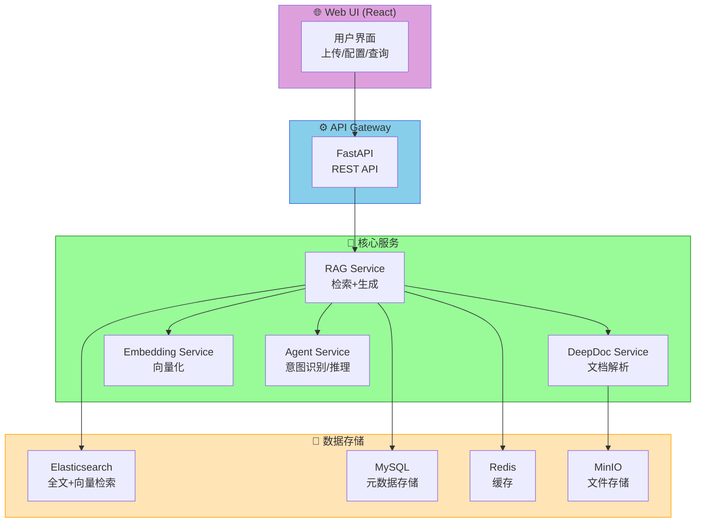

### 2.2 DeepDoc文档理解引擎

RAGFlow的**DeepDoc**是其核心技术亮点，能够处理复杂格式文档：

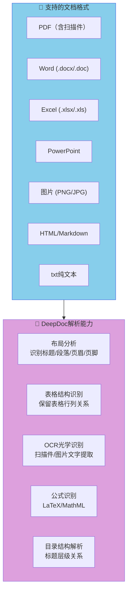

### 2.3 检索流程

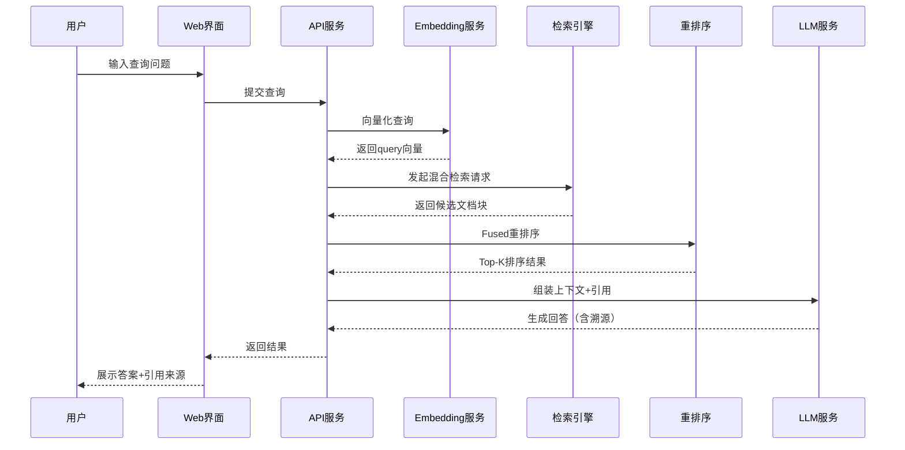

### 2.4 Agentic RAG能力

RAGFlow v0.15+ 引入了**Agentic RAG**，支持复杂的多轮对话和迭代推理：

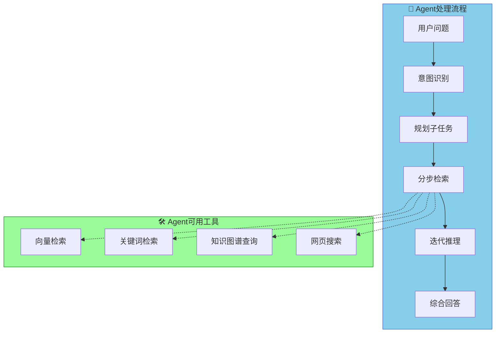

## 三、快速部署

### 3.1 系统要求

| 组件 | 最低要求 | 推荐配置 |
|------|---------|---------|
| CPU | 4核 | 8核+ |
| 内存 | 16GB | 32GB+ |
| 硬盘 | 50GB | 100GB+ SSD |
| Docker | 24.0.0+ | 最新版 |
| Docker Compose | v2.26.1+ | 最新版 |

### 3.2 Docker一键部署

```bash
# 1. 克隆项目
git clone https://github.com/infiniflow/ragflow.git
cd ragflow

# 2. 进入Docker目录
cd ragflow/docker

# 3. 下载CPU版本（首次运行会自动下载镜像，约2GB）
docker compose -f docker-compose.yml up -d

# 4. 查看启动日志
docker logs -f docker-ragflow-cpu-1

# 5. 看到以下输出表示启动成功
#  ____ ___ ______ ______ __
# / __ \ / |/ ____// ____// /____ _ __
# / /_/ // /| | / __ / /_ / // __ \| | /| / /
# / _, _// ___ |/ /_/ // __/ / // /_/ /| |/ |/ /
# /_/ |_|/_/  |_|\____//_/ /_/ \____/ |__/|__/
#
#  * Running on all addresses (0.0.0.0)
```

### 3.3 GPU加速部署（如有NVIDIA GPU）

```bash
# 1. 修改docker/.env，添加GPU支持
echo "DEVICE=gpu" >> .env

# 2. 重启服务
docker compose -f docker-compose.yml up -d

# 3. 验证GPU是否被使用
docker exec docker-ragflow-cpu-1 nvidia-smi
```

### 3.4 配置LLM API Key

```bash
# 编辑配置文件
vim docker/service_conf.yaml.template

# 找到并配置LLM厂商
user_default_llm:  # 选择LLM厂商
  API_KEY: your_api_key_here
  # 可选：deepseek / openai / zhipu / minimax 等
```

支持的LLM厂商：

| 厂商 | 模型 | 配置名 |
|------|------|--------|
| OpenAI | GPT-4o, GPT-4-turbo, GPT-5 | `openai` |
| DeepSeek | DeepSeek-V3, DeepSeek-R1 | `deepseek` |
| 智谱AI | GLM-4, GLM-4V | `zhipu` |
| MiniMax | MiniMax-Text, MiniMax-VL | `minimax` |
| Google | Gemini 1.5 Pro, Gemini 2.0 | `gemini` |

### 3.5 访问RAGFlow

```bash
# 在浏览器中访问（默认端口80）
http://<服务器IP>

# 默认管理员账号
# 用户名: admin
# 密码: default_password
```

> ⚠️ **重要**：首次登录后请立即修改默认密码！

## 四、使用教程

### 4.1 创建知识库

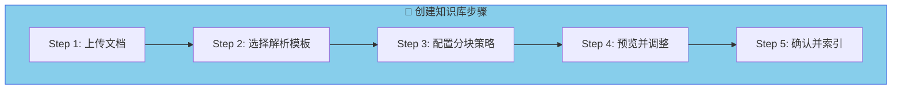

**操作步骤**：

1. **上传文档**：点击"上传文件"按钮，选择要处理的PDF/Word/Excel等文件
2. **选择解析模板**：RAGFlow提供多种解析模板
   - `General`：通用文档
   - `Paper`：学术论文
   - `Manual`：用户手册
   - `Book`：书籍
   - `Laws`：法律法规
   - `Table`：表格
   - `Resume`：简历
3. **配置分块策略**：
   - `General`：基于段落自动分块
   - `Balanced`：均衡分块
   - `Quality`：高质量分块（语义理解）
   - `Manual`：手动设置
4. **预览分块结果**：可视化查看分块效果，可手动合并/拆分
5. **提交索引**：确认后开始向量化索引

### 4.2 分块策略详解

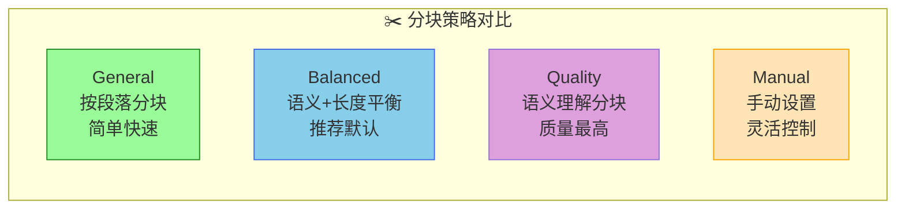

| 参数 | 说明 | 推荐值 |
|------|------|--------|
| Chunk Size | 每个块的目标字符数 | 512-1024 |
| Chunk Overlap | 相邻块的重叠字符数 | 50-100 |
| Omit User Question | 是否在块中省略用户问题 | 否 |
| Auto Keywords | 自动提取关键词 | 启用 |

### 4.3 创建Agent对话

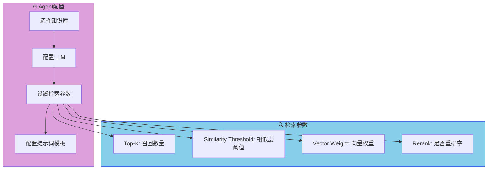

**推荐检索参数**：

| 参数 | 说明 | 推荐值 |
|------|------|--------|
| Top-K | 召回的文档块数量 | 10-20 |
| Similarity Threshold | 相似度得分阈值 | 0.5-0.7 |
| Vector Weight | 向量检索权重 | 0.7 |
| Keywords Weight | 关键词权重 | 0.3 |

### 4.4 API调用示例

RAGFlow提供RESTful API，可以集成到其他系统：

```bash
# 1. 获取API Key（在设置页面生成）
export API_KEY="***"
export BASE_URL="http://<服务器IP>"

# 2. 创建知识库
curl -X POST "${BASE_URL}/v1/datasets" \
  -H "Authorization: Bearer *** \
  -H "Content-Type: application/json" \
  -d '{"name": "my_knowledge_base", "description": "测试知识库"}'

# 3. 上传文档
curl -X POST "${BASE_URL}/v1/datasets/{dataset_id}/documents" \
  -H "Authorization: Bearer *** \
  -F "file=@/path/to/document.pdf"

# 4. 获取文档列表
curl -X GET "${BASE_URL}/v1/datasets/{dataset_id}/documents" \
  -H "Authorization: Bearer ***

# 5. 发起检索
curl -X POST "${BASE_URL}/v1/retrieval" \
  -H "Authorization: Bearer *** \
  -H "Content-Type: application/json" \
  -d '{
    "dataset_ids": ["dataset_id_1", "dataset_id_2"],
    "question": "什么是RAG？",
    "top_k": 10
  }'

# 6. 删除知识库
curl -X DELETE "${BASE_URL}/v1/datasets/{dataset_id}" \
  -H "Authorization: Bearer ***
```

```python
# Python SDK调用示例
import requests

BASE_URL = "http://your-ragflow-server"
API_KEY="***"
headers = {"Authorization": f"Bearer {API_KEY}"}

# 创建知识库
response = requests.post(
    f"{BASE_URL}/v1/datasets",
    headers=headers,
    json={"name": "test_kb", "description": "Test"}
)
dataset_id = response.json()["data"]["id"]

# 上传文档
with open("document.pdf", "rb") as f:
    files = {"file": f}
    response = requests.post(
        f"{BASE_URL}/v1/datasets/{dataset_id}/documents",
        headers=headers,
        files=files
    )

# 检索
response = requests.post(
    f"{BASE_URL}/v1/retrieval",
    headers=headers,
    json={
        "dataset_ids": [dataset_id],
        "question": "RAG的优势是什么？",
        "top_k": 10
    }
)
print(response.json())
```

## 五、进阶功能

### 5.1 Agentic RAG（多轮对话）

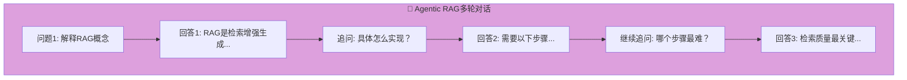

RAGFlow的Agent支持：
- **意图识别**：自动判断用户是查询、总结还是对比
- **迭代推理**：多轮对话中保持上下文连贯
- **工具编排**：自动选择合适的工具组合

### 5.2 数据源同步

RAGFlow支持从多种数据源同步数据：

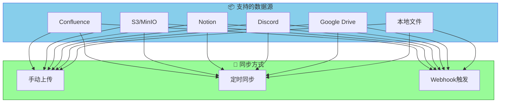

### 5.3 MCP协议集成

RAGFlow支持**Model Context Protocol (MCP)**，可以与其他AI系统集成：

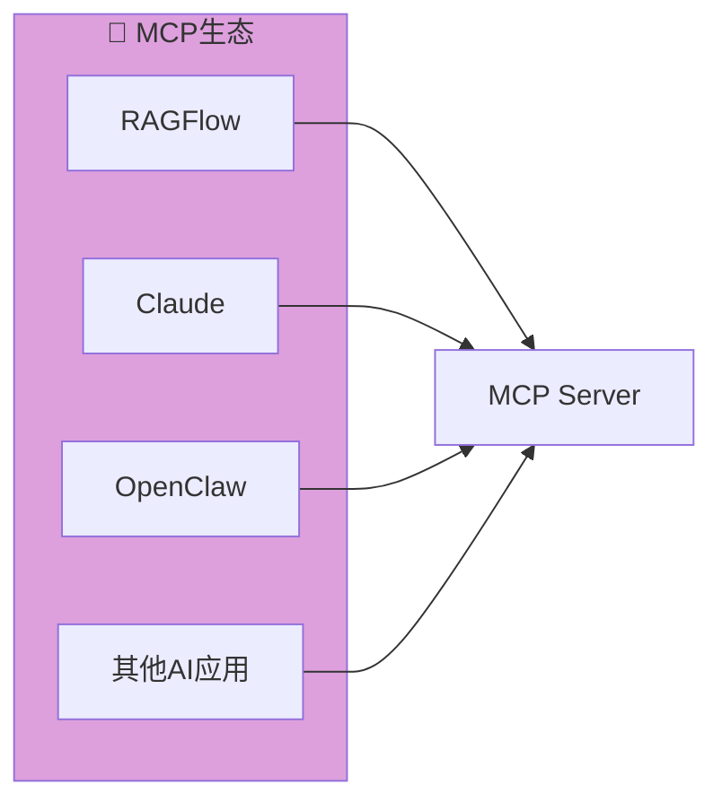

### 5.4 Agent Memory（记忆能力）

v0.16+ 支持Agent记忆功能：

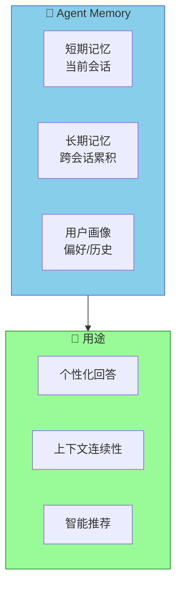

## 六、与OpenClaw集成

### 6.1 RAGFlow OpenClaw Skill

RAGFlow官方提供了OpenClaw Skill，可以直接在OpenClaw中访问RAGFlow数据集：

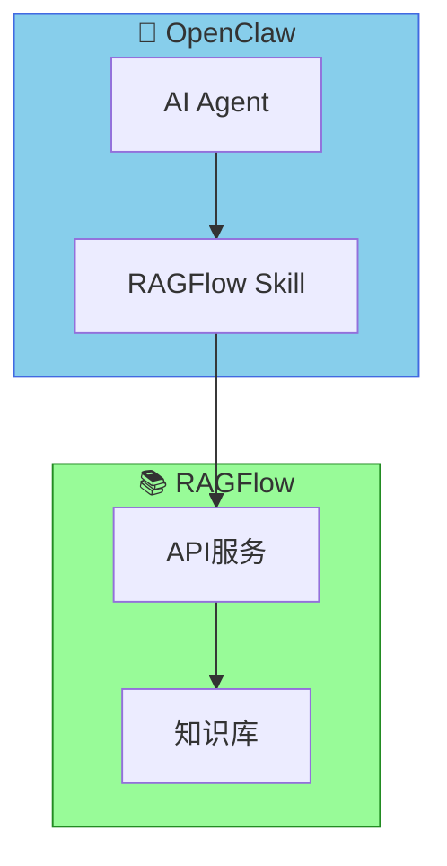

**安装方式**：

```bash
# 通过OpenClaw安装RAGFlow Skill
openclaw skills install https://clawhub.ai/yingfeng/ragflow-skill
```

### 6.2 集成配置

```yaml
# openclaw配置文件
ragflow:
  api_url: http://your-ragflow-server
  api_key: your_api_key
  default_dataset: my_knowledge_base
```

## 七、常见问题

### 7.1 部署问题

| 问题 | 解决方案 |
|------|---------|
| Docker镜像下载慢 | 配置国内镜像加速 |
| 内存不足 | 增加Docker内存限制到16GB+ |
| 端口冲突 | 修改.env中的SVR_HTTP_PORT |
| 启动失败 | 检查docker logs -f |

### 7.2 检索效果问题

| 问题 | 解决方案 |
|------|---------|
| 检索不到相关内容 | 降低Similarity Threshold |
| 答案不准确 | 调整分块策略，重新索引 |
| 引用来源错误 | 检查Top-K参数，增加召回数量 |
| 响应速度慢 | 启用GPU加速，清理历史会话 |

### 7.3 性能优化建议

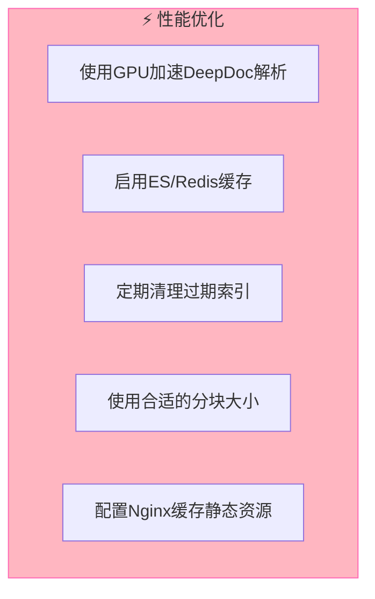

## 八、深度使用技巧

### 8.1 文档解析优化技巧

**PDF扫描件处理**：
- 优先选择**高分辨率**（300dpi以上）的扫描件
- 对于多层叠压的PDF，先转换为单页PDF再上传
- 中文文档建议开启**OCR语言包**（简体中文+英文）

```bash
# 技巧：使用gs命令优化PDF
gs -dNOPAUSE -dBATCH -sDEVICE=pdfwrite \
   -dCompatibilityLevel=1.4 \
   -dPDFSETTINGS=/prepress \
   -sOutputFile=optimized.pdf input.pdf
```

**表格解析技巧**：
- 复杂表格建议选择`Table`解析模板
- 带有合并单元格的表格，先在Excel中"取消合并单元格"
- 表格超过20行，建议拆分为多个小表格

### 8.2 分块调参实战

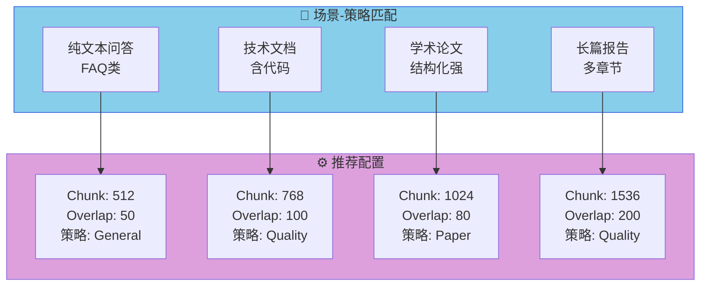

**Overlap参数的关键作用**：
- `Overlap=0`：可能导致上下文断裂，关键信息被截断
- `Overlap=50-100`：适合短问答场景
- `Overlap=200+`：适合长文档分析，但会增加检索噪音

### 8.3 检索参数调优

**相似度阈值（Similarity Threshold）调整原则**：

| 场景 | 推荐阈值 | 说明 |
|------|---------|------|
| 精确问答 | 0.7-0.8 | 高置信度才返回 |
| 综合分析 | 0.5-0.6 | 宽松召回 |
| 模糊匹配 | 0.3-0.5 | 海底捞针 |

**Top-K参数实战经验**：
- `Top-K=5`：单一事实查询
- `Top-K=10`：标准问答（推荐）
- `Top-K=20`：复杂分析报告
- `Top-K=50+`：需要多源交叉验证

### 8.4 Prompt工程技巧

RAGFlow支持自定义提示词模板，关键技巧：

```yaml
# 提示词模板示例：技术文档问答
system_prompt: |
  你是一个专业的技术文档助手。
  请基于以下上下文回答用户问题。
  
  回答规范：
  1. 如果上下文包含明确答案，直接引用回答
  2. 如果答案不完整，明确说明"根据现有文档，无法确定..."
  3. 回答后列出参考来源
  
  引用格式：
  [来源: {citation}]
```

**多轮对话提示词优化**：
```
保持对话上下文连贯性。
当用户追问时，优先使用之前对话中的信息。
如果当前问题涉及新主题，明确区分"关于新问题"和"继续之前话题"。
```

### 8.5 避坑指南

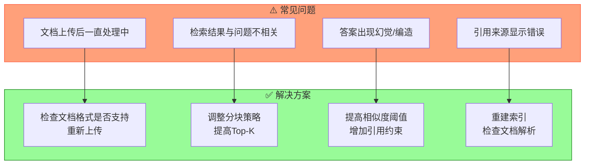

**文档处理卡住的排查步骤**：
1. 检查Docker日志：`docker logs docker-ragflow-cpu-1 | tail -100`
2. 确认文件大小（单文件建议<50MB）
3. 检查是否为加密PDF（需要解除密码）
4. 尝试转换为纯文本PDF

## 九、应用场景详解

### 9.1 企业知识库问答

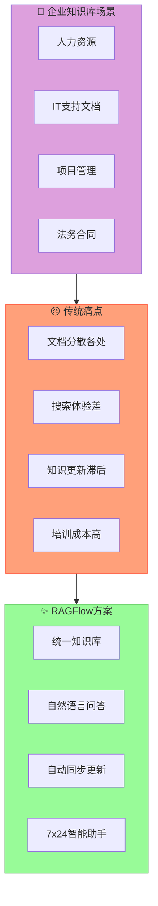

**典型配置**：
- 文档类型：员工手册、HR政策、技术文档、项目流程
- 分块策略：`Balanced` 或 `Quality`
- Top-K：15-20
- 相似度阈值：0.5-0.6

### 9.2 法律文档分析

**核心价值**：快速从海量法律文书中检索相关条款

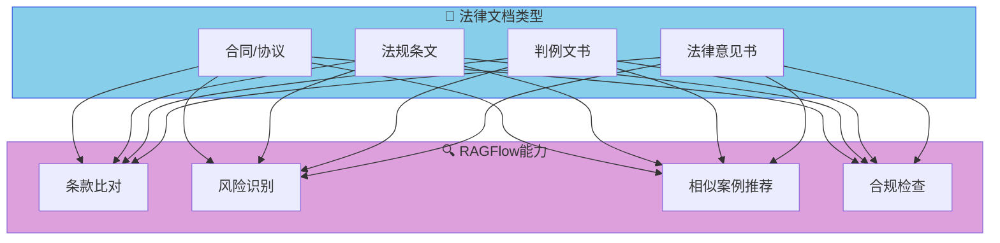

**推荐配置**：
- 解析模板：`Laws`
- 分块策略：`Quality`（语义分块）
- 保留表格结构（法律文书中的列表、金额表格）
- Top-K：10-15

### 9.3 学术研究辅助

**核心价值**：快速理解论文核心内容，进行文献综述

```mermaid
flowchart LR
    subgraph 研究流程["📚 学术研究流程"]
        R1["论文检索"]
        R2["快速摘要"]
        R3["方法对比"]
        R4["文献综述"]
    end
    
    subgraph RAGFlow应用["🤖 RAGFlow应用"]
        A1["上传论文PDF"]
        A2["自然语言提问"]
        A3["图表解读"]
        A4["引用生成"]
    end
    
    R1 --> A1
    R2 --> A2
    R3 --> A3
    R4 --> A4
    
    style 研究流程 fill:#87CEEB,stroke:#4169E1
    style RAGFlow应用 fill:#98FB98,stroke:#228B22
```

**典型问答示例**：
- "这篇论文的主要创新点是什么？"
- "方法部分使用了什么数据集？"
- "与Transformer相比，有什么改进？"

### 9.4 医疗健康档案

**核心价值**：辅助医生快速检索病历、医学文献

```mermaid
flowchart TB
    subgraph 数据类型["🏥 医疗数据"]
        M1["病历记录"]
        M2["检验报告"]
        M3["医学文献"]
        M4["药品说明书"]
    end
    
    subgraph 应用场景["💡 应用场景"]
        C1["临床决策支持"]
        C2["患者咨询"]
        C3["医学研究"]
        C4["药品查询"]
    end
    
    M1 & M2 & M3 & M4 --> C1 & C2 & C3 & C4
    
    style 数据类型 fill:#FFB6C1,stroke:#FF69B4
    style 应用场景 fill:#87CEEB,stroke:#4169E1
```

> ⚠️ **重要提醒**：医疗场景使用RAGFlow时，**必须**确保：
> 1. 答案仅供参考，不能替代专业医生诊断
> 2. 添加明确的免责声明提示词
> 3. 病历数据需做好脱敏处理

### 9.5 金融财报分析

**核心价值**：快速从年报、季报、招股书中提取关键信息

```mermaid
flowchart TB
    subgraph 财报内容["📊 金融文档"]
        F1["年报/季报"]
        F2["招股说明书"]
        F3["审计报告"]
        F4["券商研报"]
    end
    
    subgraph 提取信息["🔍 关键信息提取"]
        E1["财务指标"]
        E2["业务构成"]
        E3["风险因素"]
        E4["业绩展望"]
    end
    
    subgraph 应用["💼 应用场景"]
        A1["投资研究"]
        A2["风险评估"]
        A3["竞品对比"]
        A4["智能投顾"]
    end
    
    F1 & F2 & F3 & F4 --> E1 & E2 & E3 & E4
    E1 & E2 & E3 & E4 --> A1 & A2 & A3 & A4
    
    style 财报内容 fill:#FFE4B5,stroke:#FFA500
    style 提取信息 fill:#87CEEB,stroke:#4169E1
    style 应用 fill:#98FB98,stroke:#228B22
```

**表格处理技巧**：
- 财务表格使用`Table`模板解析
- 启用"保留表格结构"选项
- 对于跨页表格，确保行标题重复

## 十、竞争优势深度分析

### 10.1 技术护城河

```mermaid
flowchart TB
    subgraph 护城河["🛡️ RAGFlow技术护城河"]
        T1["DeepDoc引擎"]
        T2["无限Token检索"]
        T3["可视化分块"]
        T4["Agentic RAG"]
    end
    
    subgraph 竞品对比["⚔️ 竞品对比"]
        C1["传统RAG"]
        C2["LangChain"]
        C3["LlamaIndex"]
    end
    
    护城河 --> C1 & C2 & C3
    
    style 护城河 fill:#98FB98,stroke:#228B22
    style 竞品对比 fill:#FFA07A,stroke:#FF6347
```

| 能力 | RAGFlow | 传统RAG | LangChain | LlamaIndex |
|------|---------|---------|-----------|------------|
| 深度文档理解 | ✅ 自研DeepDoc | ❌ 简单解析 | ⚠️ 插件支持 | ⚠️ 插件支持 |
| 可视化分块 | ✅ 完整支持 | ❌ 无 | ❌ 无 | ⚠️ 基础支持 |
| 无限Token | ✅ 原生支持 | ❌ 受限 | ❌ 受限 | ⚠️ 受LLM限制 |
| Agentic RAG | ✅ 原生支持 | ❌ 无 | ⚠️ 需手动实现 | ⚠️ 需手动实现 |
| 复杂格式支持 | ✅ 优秀 | ❌ 差 | ⚠️ 一般 | ⚠️ 一般 |

### 10.2 DeepDoc引擎的核心优势

**传统文档解析 vs DeepDoc**：

```mermaid
flowchart LR
    subgraph 传统解析["❌ 传统解析"]
        T1["按页分块"]
        T2["文字提取"]
        T3["表格丢失"]
        T4["格式丢失"]
    end
    
    subgraph DeepDoc["✅ DeepDoc解析"]
        D1["语义分块"]
        D2["布局分析"]
        D3["表格结构化"]
        D4["格式保留"]
    end
    
    T1 & T2 & T3 & T4 --> D1 & D2 & D3 & D4
    
    style 传统解析 fill:#FFA07A,stroke:#FF6347
    style DeepDoc fill:#98FB98,stroke:#228B22
```

**DeepDoc处理流程**：
1. **布局分析**：自动识别标题、段落、页眉、页脚、图表标题
2. **语义分块**：基于语义而非固定长度分块
3. **表格结构化**：保留表格行列关系，支持嵌套表格
4. **OCR增强**：扫描件图片文字识别，支持多种语言

### 10.3 无限Token检索技术

传统RAG受限于LLM的Context Window，通常只能处理几千Token。RAGFlow通过**滑动窗口+迭代检索**实现了"无限Token"能力：

```mermaid
flowchart TB
    subgraph 问题["📜 长期文档挑战"]
        L1["万页PDF"]
        L2["千页合同"]
        L3["多文档关联"]
    end
    
    subgraph 解决方案["✨ RAGFlow解决方案"]
        S1["语义切片"]
        S2["迭代检索"]
        S3["答案组装"]
    end
    
    问题 --> 解决方案
    
    style 问题 fill:#FFA07A,stroke:#FF6347
    style 解决方案 fill:#98FB98,stroke:#228B22
```

**实现原理**：
1. 将长文档按语义切分为多个Chunk
2. 根据问题确定相关Chunk区域
3. 扩展检索范围（带Overlap）
4. 多次迭代检索，逐步聚焦
5. 汇总多个Chunk的回答

### 10.4 可解释性优势

RAGFlow的**Traceable Citations**提供了业界领先的可解释性：

```mermaid
flowchart TB
    subgraph 引用追踪["🎯 引用溯源能力"]
        C1["高亮原文"]
        C2["点击跳转"]
        C3["置信度显示"]
        C4["多源对比"]
    end
    
    subgraph 用户价值["💡 用户价值"]
        V1["验证答案准确性"]
        V2["追溯信息源头"]
        V3["深度阅读相关段"]
        V4["多角度交叉验证"]
    end
    
    引用追踪 --> 用户价值
    
    style 引用追踪 fill:#87CEEB,stroke:#4169E1
    style 用户价值 fill:#DDA0DD,stroke:#9370DB
```

相比其他方案：
- **传统RAG**：答案无引用，用户无法验证
- **LangChain/LlamaIndex**：基础引用支持，但不精确
- **RAGFlow**：逐句引用 + 高亮 + 置信度 + 原文对比

## 十一、生产环境最佳实践

### 11.1 架构部署建议

```mermaid
flowchart TB
    subgraph 前端["🌐 用户访问层"]
        LB["负载均衡器"]
        CDN["CDN加速"]
    end
    
    subgraph 应用层["⚙️ 应用服务层"]
        RF1["RAGFlow实例1"]
        RF2["RAGFlow实例2"]
        RF3["RAGFlow实例3"]
    end
    
    subgraph 数据层["💾 数据存储层"]
        ES["Elasticsearch集群"]
        MYSQL["MySQL主从"]
        REDIS["Redis集群"]
        MINIO["MinIO集群"]
    end
    
    前端 --> 应用层
    应用层 --> 数据层
    
    style 前端 fill:#DDA0DD,stroke:#9370DB
    style 应用层 fill:#87CEEB,stroke:#4169E1
    style 数据层 fill:#FFE4B5,stroke:#FFA500
```

**生产环境配置建议**：
- 至少3个RAGFlow实例（支持横向扩展）
- Elasticsearch集群（至少3节点）
- MySQL主从复制
- Redis集群（会话缓存）
- MinIO多副本（文件存储）

### 11.2 监控与运维

```bash
# 关键监控指标
# 1. 检索延迟
curl -X GET "http://ragflow-api/v1/metrics/retrieval_latency"

# 2. 文档处理队列
curl -X GET "http://ragflow-api/v1/metrics/processing_queue"

# 3. LLM调用成功率
curl -X GET "http://ragflow-api/v1/metrics/llm_success_rate"

# 4. 系统资源使用
docker stats --no-stream
```

**告警阈值建议**：
| 指标 | 警告值 | 严重值 |
|------|--------|--------|
| CPU使用率 | >70% | >90% |
| 内存使用率 | >75% | >90% |
| 检索延迟P99 | >2s | >5s |
| LLM错误率 | >5% | >10% |

### 11.3 安全加固

```mermaid
flowchart TB
    subgraph 安全措施["🔒 安全加固措施"]
        S1["API认证"]
        S2["权限控制"]
        S3["数据加密"]
        S4["审计日志"]
        S5["脱敏处理"]
    end
    
    style 安全措施 fill:#FFB6C1,stroke:#FF69B4
```

**必做安全配置**：
1. 修改默认admin密码
2. 启用API Key认证
3. 配置IP白名单
4. 敏感文档启用访问审计
5. 对外暴露的API启用HTTPS

### 11.4 备份与恢复

```bash
# 关键数据备份
# 1. MySQL数据
docker exec mysql mysqldump -u root -p ragflow > backup_$(date +%Y%m%d).sql

# 2. Elasticsearch索引
curl -X POST "http://es:9200/_snapshot/backup/snapshot_$(date +%Y%m%d)"

# 3. MinIO文件
mc mirror minio/ragflow-data /backup/ragflow-files/

# 恢复测试（定期演练）
docker compose -f docker-compose.yml down
docker volume rm ragflow_mysql_data
# 执行恢复流程...
```

## 十二、总结

RAGFlow作为新一代开源RAG引擎，相比传统方案有显著优势：

```mermaid
flowchart LR
    subgraph 对比["RAGFlow vs 传统RAG"]
        T1["传统RAG"]
        T2["RAGFlow"]
    end
    
    T1 --> C1["❌ 文档解析粗糙"]
    T1 --> C2["❌ 分块效果差"]
    T1 --> C3["❌ 无法溯源"]
    T1 --> C4["❌ 复杂格式支持差"]
    
    T2 --> R1["✅ DeepDoc精准解析"]
    T2 --> R2["✅ 可视化智能分块"]
    T2 --> R3["✅ traceable citations"]
    T2 --> R4["✅ 复杂格式完美支持"]
    
    style T1 fill:#FFA07A,stroke:#FF6347
    style T2 fill:#98FB98,stroke:#228B22
```

**适用场景**：

| 场景 | 推荐度 | 理由 |
|------|--------|------|
| 企业知识库问答 | ⭐⭐⭐⭐⭐ | 复杂文档支持好 |
| 客服机器人 | ⭐⭐⭐⭐ | 快速部署，效果好 |
| 学术文档问答 | ⭐⭐⭐⭐⭐ | 论文解析专业 |
| 法律文档检索 | ⭐⭐⭐⭐ | 法规分块精准 |
| 技术文档库 | ⭐⭐⭐⭐ | 代码+文档混合 |

**RAGFlow的核心价值总结**：
1. **DeepDoc引擎**：业界领先的深度文档理解能力
2. **无限Token检索**：突破LLM Context限制
3. **可视化分块**：人工干预精细调控
4. **Traceable Citations**：可解释性最强
5. **Agentic RAG**：多轮对话迭代推理

## 参考资源

| 资源 | 链接 |
|------|------|
| **GitHub** | github.com/infiniflow/ragflow |
| **官网** | ragflow.io |
| **在线Demo** | cloud.ragflow.io |
| **文档** | ragflow.io/docs |
| **OpenClaw Skill** | clawhub.ai/yingfeng/ragflow-skill |
| **Docker Hub** | hub.docker.com/r/infiniflow/ragflow |

---

*RAGFlow是目前最值得关注的开源RAG项目之一，推荐在生产环境中尝试！*
