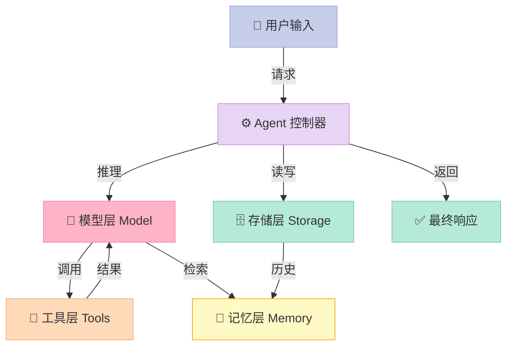

> 📚 **AI Agent 开源框架实战系列**（5/6） | ⬅️ 上一篇：[AutoGen：让多个 AI Agent 对话协作](/2026/04/17/autogen-multi-agent-conversation/) | ➡️ 下一篇：[Smolagents：HuggingFace 的轻量级 Agent 框架](/2026/04/17/smolagents-huggingface-lightweight-agent/) | 🔗 [配套代码仓库](https://github.com/xuqi2024/ai-agent-tutorials)


## 开篇钩子：如果 AI Agent 框架只需要 5 行代码，你信吗？

大多数 AI Agent 教程的第一步，是让你安装十几个包，然后写几十行样板代码——光是配置日志和初始化客户端就能耗掉你半个小时。

但如果我说，用 Agno 框架，**5 行核心代码就能创建一个真实可用的、有工具调用能力的完整 Agent**？

```python
from agno.agent import Agent
from agno.models.openai import OpenAIChat
from agno.tools.duckduckgo import DuckDuckGoTools

agent = Agent(model=OpenAIChat(id="gpt-4o"), tools=[DuckDuckGoTools()], show_tool_calls=True)
agent.print_response("今天 AI 领域有什么新闻？", stream=True)
```

这不是玩具——这是一个真实能联网搜索、实时流式输出的 Agent。Agno 的设计哲学很极端：**用最少的代码，做最多的事**。

---

## 一、为什么要用 Agno？（极简哲学的代价与收益）

**从 phidata 到 Agno：** 2025 年，phidata 正式改名为 Agno（发音同 "ag-no"），寓意 AI 智能体（Agent）的起点。这次改名不只是换个 logo——整个框架重新聚焦于一个核心命题：**让 AI Agent 开发回归简单**。

**原生多模态：** 同一个 Agent 实例可以直接处理文字、图片、语音、视频，不需要为每种模态单独搭建数据管道。你给它一张菜单图片，它能分析菜品热量；你传一段语音，它能直接总结内容。

**性能数字说话：** 官方基准测试显示，Agno Agent 的实例化时间约为 **2 微秒**，内存占用约 **6.5 KB**。这意味着即使你在同一个服务里同时运行数千个 Agent 实例，资源开销依然可控。

**模型支持最广：** Agno 原生支持 **23+ 家模型提供商**，包括 OpenAI、Anthropic、Groq、Google Gemini、以及本地运行的 Ollama 等，切换模型只需改一行代码，无需重构业务逻辑。

---

## 二、核心概念，用人话解释

### Agent：一把瑞士军刀

LangChain 的 Agent 初始化可能需要二十几个参数，还要单独配置 chain、prompt template、memory buffer……Agno 的 `Agent` 更像**瑞士军刀**——小巧，但每个刀片都真实好用。

```python
agent = Agent(
    model=OpenAIChat(id="gpt-4o"),                              # 用哪个大脑
    tools=[get_current_time, calculate],                         # 会哪些技能
    storage=SqliteAgentStorage(db_file="agent.db"),              # 记在哪里
    instructions=["用中文回答", "回答要简洁"],                    # 行为准则
    add_history_to_messages=True,                                # 记住对话历史
)
```

五个参数，全部职责一目了然。

### @tool 装饰器：给 Agent 赋予技能

`@tool` 是 Python 的装饰器语法。理解它很简单：**写一个普通函数，在定义前一行加上 `@tool`，这个函数就变成了 Agent 能主动调用的能力**。

```python
from agno.tools import tool

@tool
def get_current_time() -> str:
    """获取当前时间"""
    from datetime import datetime
    return datetime.now().strftime("%Y-%m-%d %H:%M:%S")
```

Agent 会自动读取函数的名称、文档字符串（那行 `"""获取当前时间"""`）、参数类型，决定"什么时候该用这个工具"。你不需要额外注册或配置。

### Storage（存储）：Agent 的日记本

没有 Storage，每次对话 Agent 都是全新状态——就像每天睡醒都失忆的人。

**SqliteStorage** 就像一本本地日记，把对话历史写入 SQLite 文件。下次启动程序，Agent 还记得上次聊了什么。PostgreSQL 版本适合需要多用户并发的生产环境。

### instructions vs system_message：别混用

- `instructions`：**列表格式**，每条是一个独立规则，Agno 自动格式化成系统提示
- `system_message`：**字符串格式**，完全自定义，直接覆盖默认的系统提示

两者功能重叠，**同时设置时 `system_message` 会覆盖 `instructions`**，你精心写的规则列表会完全失效。选一个用就好。

---

## 三、它是怎么工作的？



整个流程分四层：

1. **模型层**：负责理解意图、规划步骤，调用 OpenAI/Anthropic 等大模型完成推理
2. **工具层**：执行具体操作，比如查时间、做计算、搜知识库
3. **记忆层**：短期对话上下文，存在运行内存里，会话结束即清空
4. **存储层**：长期记忆，写入数据库，跨会话持久化

用户发出一条消息，控制器先从 Storage 拉取历史，注入到 Memory，再交给 Model 推理。Model 决定要不要调用 Tools，把结果汇总，最终输出给用户。

---

## 四、5 分钟上手：完整可运行代码

配套仓库：[https://github.com/xuqi2024/ai-agent-tutorials](https://github.com/xuqi2024/ai-agent-tutorials)

以下是 `05-agno/01_simple_agent.py` 的关键片段：

```python
from agno.agent import Agent
from agno.models.openai import OpenAIChat
from agno.storage.agent.sqlite import SqliteAgentStorage
from agno.tools import tool
from datetime import datetime

# ── 定义工具（普通函数 + @tool 装饰器）──────────────────────────
@tool
def get_current_time() -> str:
    """获取当前日期和时间"""
    return datetime.now().strftime("%Y-%m-%d %H:%M:%S")

@tool
def calculate(expression: str) -> str:
    """计算数学表达式，例如 '2 + 2' 或 '100 * 0.15'"""
    try:
        result = eval(expression)
        return f"计算结果：{expression} = {result}"
    except Exception as e:
        return f"计算错误：{e}"

# ── 创建 Agent（核心就这几行）──────────────────────────────────
agent = Agent(
    model=OpenAIChat(id="gpt-4o"),
    tools=[get_current_time, calculate],
    storage=SqliteAgentStorage(
        db_file="agent_memory.db",
        table_name="agent_sessions"
    ),
    instructions=[
        "用中文回答所有问题",
        "回答简洁明了",
        "需要计算时主动使用计算工具",
    ],
    add_history_to_messages=True,
    show_tool_calls=True,   # 调试时开启，能看到 Agent 调用了哪些工具
)

# ── 运行 ───────────────────────────────────────────────────────
agent.print_response("现在几点了？帮我计算 18 乘以 7", stream=True)
```

运行后，你会看到 Agent 先调用 `get_current_time`，再调用 `calculate`，最后组织成一段自然语言回答——**整个推理过程透明可见，没有黑盒**。

> 对比：完成同样功能，LangChain 版本需要额外定义 Tool 对象、配置 AgentExecutor、设置 ConversationBufferMemory，代码量约为 Agno 的 **3-4 倍**。

---

## 五、常见误区（踩坑指南）

**误区 1：`show_tool_calls=True` 忘了关**

这个参数是调试神器，能实时显示 Agent 每次工具调用的名称和参数。但在生产环境留着，会把内部调试信息直接暴露给用户。**上线前务必改为 `False`**。

**误区 2：开了历史记忆，但没配 Storage**

`add_history_to_messages=True` 让 Agent 把对话历史带入上下文，但如果没有 Storage，历史只存在于当前进程内存里——程序一重启，记忆全清。**要跨会话记忆，必须配合 `SqliteAgentStorage` 或 `PostgresAgentStorage`** 才有意义。

**误区 3：`instructions` 和 `system_message` 同时设置**

两者功能重叠。同时设置时，`system_message` 会完全覆盖 `instructions` 生成的系统提示，你写的规则列表会静默失效，且不会有任何报错提示。**建议新手只用 `instructions` 列表**，每条规则清晰独立。

---

## 六、对比：Agno vs LangChain vs Smolagents

| 维度 | Agno | LangChain | Smolagents |
|------|------|-----------|------------|
| 创建基础 Agent 代码量 | ~5 行 | ~20 行 | ~10 行 |
| 原生多模态支持 | ✅ 内置 | ⚠️ 需扩展 | ⚠️ 部分支持 |
| 记忆/存储系统 | ✅ 开箱即用 | ⚠️ 需配置 | ❌ 需自建 |
| 学习曲线 | 🟢 平缓 | 🔴 陡峭 | 🟡 中等 |
| 模型提供商支持 | 23+ 家 | 50+ 家 | 10+ 家 |
| 适合场景 | 快速原型 & 生产 | 复杂企业应用 | 研究 & 实验 |

LangChain 的优势在于**生态最成熟**，插件最多，适合需要高度定制的企业级项目。Agno 的优势在于**上手最快、代码最少**，适合个人项目、快速验证想法，以及对性能敏感的高并发场景。

---

## 七、下一步怎么学？

**第一步**：克隆配套仓库，先跑通第一个示例

```bash
git clone https://github.com/xuqi2024/ai-agent-tutorials
cd ai-agent-tutorials/05-agno
pip install agno openai
python 01_simple_agent.py
```

**第二步**：修改 `instructions` 列表，让 Agent 扮演不同角色（客服助手、翻译官、数据分析师），感受指令对行为的直接影响。

**第三步**：写一个自己的 `@tool`——把你最常用的 Python 函数（查天气、读本地文件、调公司内部 API）包装成 Agent 工具，体验"技能可插拔"的快感。

**第四步**：查阅 [Agno 官方文档](https://docs.agno.com)，探索 Team（多 Agent 协作）和 Workflow（工作流编排）等进阶能力。

> **一句话结论：** Agno 不是生态最丰富的框架，但它是**让你最快写出第一个真实可用 Agent** 的框架。如果你还没有写过 Agent，从这里开始——是个好主意。

---

## 对比分析

Agno 强调"5 行代码"的极简 Python 体验。下面与同属"极简系"的两大框架对比：Smolagents（HuggingFace）和 LangChain 的 AgentExecutor（同样 Python、同样轻）。

### 对比维度一：抽象与体积
| 维度 | Agno | Smolagents | LangChain Agent |
| --- | --- | --- | --- |
| 抽象核心 | Agent + Tools + Models | CodeAgent / ToolCallingAgent | AgentExecutor + Tools |
| 模型支持 | 23+ 家提供商 | HF 生态为主 | 数十家 |
| 多模态 | 原生 | 可扩展 | 可扩展 |
| 启动时间/内存 | 官方基准：~2μs/6.5KB | 取决于 HF 模型 | 一般偏重 |

### 对比维度二：开发体验
| 维度 | Agno | Smolagents | LangChain Agent |
| --- | --- | --- | --- |
| 上手难度 | 极低 | 低 | 中 |
| 工具生态 | 内置丰富 | HF 工具集 | 全栈最多 |
| 多 Agent | Team + Workflow | 不强调 | 通过 LangGraph |
| 文档/教程 | 中 | 中 | 极多 |

### 优缺点
- **Agno**：极简 + 多模态 + 多模型，体验最清爽；高级能力相对克制。
- **Smolagents**：紧跟 HF 生态、Code Agent 范式有意思；和 HF 绑定较深。
- **LangChain Agent**：生态最厚，几乎所有问题都有现成工具；概念多、抽象层多。

### 何时选哪个
- 第一次写 Agent、想 5 行跑通 → 选 Agno
- 想紧跟 HF 生态 + Code Agent 风格 → 选 Smolagents
- 复杂业务 + 多工具 + 多模型 → 选 LangChain Agent

### 参考资料
- Agno 仓库：https://github.com/agno-agi/agno
- Smolagents 仓库：https://github.com/huggingface/smolagents
- LangChain Agents 文档：https://python.langchain.com/docs/modules/agents/
