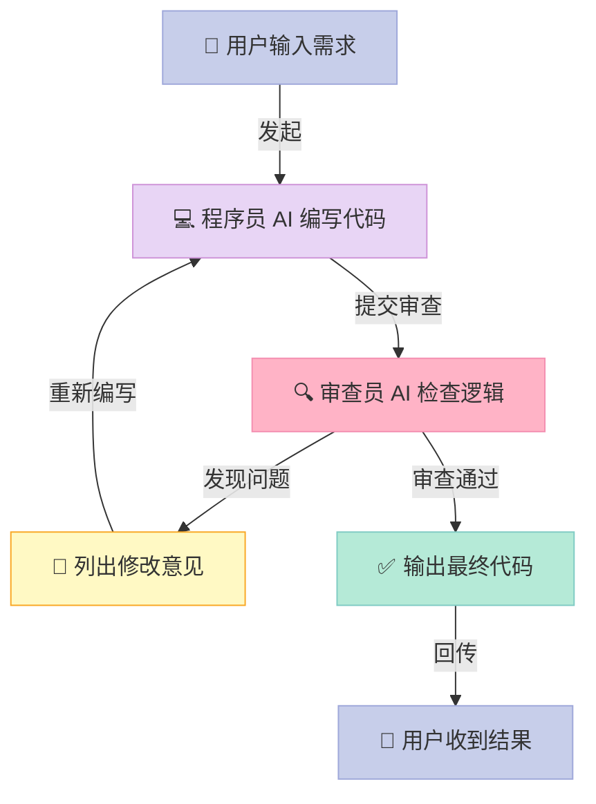

> 📚 **AI Agent 开源框架实战系列**（4/6） | ⬅️ 上一篇：[CrewAI：用角色扮演构建多 Agent 团队](/2026/04/17/crewai-multi-agent-team/) | ➡️ 下一篇：[Agno：极简主义的 AI Agent 框架](/2026/04/17/agno-minimalist-agent-framework/) | 🔗 [配套代码仓库](https://github.com/xuqi2024/ai-agent-tutorials)


## 你有没有想过，让两个 AI 互相"卷"一下？

一个 AI 写代码，另一个 AI 专门挑毛病——这不是科幻，而是微软研究院正在运行的真实系统。

根据 AutoGen 原始论文（Wu et al., 2023），**多智能体对话可以将代码错误率降低 40% 以上**，比单个 AI 独自完成任务的效果好得多。逻辑其实很朴素：人类的 Code Review 有效，是因为不同视角能发现盲点——AI 也一样。

如果你还在用"一个 AI + 一个提示词"解决所有问题，AutoGen 会让你重新思考 AI 编程的边界在哪里。

---

## 一、为什么 AutoGen 与众不同？

市面上 AI 框架很多，**AutoGen 最根本的差异在于：它把"对话"而非"工具调用"或"流程链"作为核心抽象**。

| 框架 | 核心原语 | 理解方式 |
|------|---------|---------|
| LangChain | 链（Chain） | 工厂流水线，步骤固定 |
| CrewAI | 角色（Role） | 角色扮演，职责固定 |
| **AutoGen** | **对话（Conversation）** | **开放式会议，动态协商** |

LangChain 的问题是流程太死板——链写好就固定了，AI 没法中途改变策略。CrewAI 的角色之间交互仍然比较机械。**AutoGen 让每个 Agent 都能在对话中随时调整策略**，更接近真实团队协作的样子。

AutoGen 来自微软研究院，2023 年 8 月发表，**论文引用数已超过 5000 次**（截至 2025 年初），是多智能体领域引用量最高的开源框架之一。

---

## 二、核心概念，用人话解释

AutoGen 只有几个核心概念，理解了就能上手。

### `AssistantAgent` —— 高级顾问

这是真正调用大语言模型（LLM）的角色。把它想象成**一个随叫随到的高级顾问**：你说需求，它出方案；你提反馈，它改代码。一个任务里可以有多个 `AssistantAgent`，分别扮演"程序员"和"代码审查员"等不同角色。

### `UserProxyAgent` —— 项目经理

`UserProxyAgent` 代表"人类"那一侧。**它的关键能力是：可以在本地真实执行代码**，然后把执行结果（报错、输出）反馈给 AI。就像项目经理把客户反馈带回给开发团队。

它有一个重要参数 `human_input_mode`：

- `"NEVER"` → 全自动，不等人介入
- `"ALWAYS"` → 每步都等你手动确认
- `"TERMINATE"` → 只在对话结束前询问

### `GroupChat` + `GroupChatManager` —— 会议室 + 主持人

当有两个以上 Agent 时，`GroupChat` 把大家聚在同一个"群聊"里，`GroupChatManager` 决定**下一个发言的是谁**。它们一起实现了多 Agent 轮番协作的机制。

### TERMINATE 信号 —— 散会暗号

AutoGen 的对话不会自动结束。你需要在 `system_message` 里明确告诉 AI：**当任务完成时，在回复里写上 `TERMINATE`**，框架检测到这个词才会停下来。这是初学者最容易忘的一步。

---

## 三、它是怎么工作的？

以"程序员 AI 写斐波那契函数、审查员 AI 挑毛病"为例，完整的对话循环如下：



这个循环的关键在于：**程序员 AI 和审查员 AI 彼此都能看到完整对话历史**。审查员不只是看最新一版代码，它知道之前改过什么，能判断修改方向是否正确——这比简单的"调用审查工具"要强得多。

---

## 四、5 分钟上手：完整可运行代码

> 完整代码在配套仓库：[https://github.com/xuqi2024/ai-agent-tutorials](https://github.com/xuqi2024/ai-agent-tutorials)，路径是 `04-autogen/01_code_review.py`。

**第一步：安装依赖**

```bash
pip install pyautogen
```

**第二步：安全读取 API Key**

不要把密钥硬写进代码。**用环境变量读取是正确的安全习惯**：

```python
import os

# 从环境变量读取，而不是直接写 api_key = "sk-..."
api_key = os.environ.get("OPENAI_API_KEY")
```

在终端设置：`export OPENAI_API_KEY="你的密钥"`

**第三步：定义两个 Agent 并发起对话**

```python
import autogen

llm_config = {
    "model": "gpt-4o",
    "api_key": api_key,
}

# 程序员 AI：负责编写代码
programmer = autogen.AssistantAgent(
    name="programmer",
    system_message="""你是一个 Python 专家，负责编写高质量代码。
收到审查意见后及时修改。代码被审查通过后，回复中包含 TERMINATE。""",
    llm_config=llm_config,
)

# 审查员 AI：负责检查代码质量
reviewer = autogen.AssistantAgent(
    name="reviewer",
    system_message="""你是一个严格的代码审查员，逐项检查：
1. 逻辑正确性（边界情况：n=0, n=1, n<0 是否处理）
2. 是否有完整的 docstring 说明参数和返回值
3. 是否处理了非整数输入的类型错误
代码符合所有要求时，回复"审查通过 TERMINATE"。
否则，明确列出每条需要修改的问题。""",
    llm_config=llm_config,
)

# UserProxyAgent：代表人类，负责执行代码并传递结果
user_proxy = autogen.UserProxyAgent(
    name="user_proxy",
    human_input_mode="NEVER",         # 全自动，不需要人工介入
    max_consecutive_auto_reply=10,    # 最多自动回复 10 次
    is_termination_msg=lambda x: "TERMINATE" in x.get("content", ""),
    code_execution_config={
        "work_dir": "coding",         # 代码在此目录内执行
        "use_docker": False,          # 本地执行；生产环境建议改为 True
    },
)

# 发起对话：让 user_proxy 找 programmer 开始任务
user_proxy.initiate_chat(
    programmer,
    message="请编写一个 Python 函数计算斐波那契数列的第 n 项，完成后请 reviewer 审查代码质量。",
    max_turns=6,  # 关键：必须设置，防止无限循环和高额账单
)
```

**关键点解释：**

- `initiate_chat`：对话的入口，第一个参数决定"先和谁说话"
- `max_turns=6`：**必须设置**，否则对话可能一直跑，产生高额 API 费用
- `TERMINATE`：框架检测到此词即停止，必须在每个 `system_message` 里告诉 AI 何时使用
- `code_execution_config`：控制代码执行环境——`use_docker=False` 方便本地调试，**生产环境建议改为 `True`**，避免 AI 生成的代码在宿主机上执行危险操作

---

## 五、常见误区（踩坑指南）

### ❌ 坑 1：`max_turns` 不设或设太大

一次 GPT-4o 调用约 0.01 美元。`max_turns=100` 意味着理论上单次任务可花掉 1 美元。**初学阶段将 `max_turns` 控制在 6-10 以内**，确认效果后再放开。

### ❌ 坑 2：TERMINATE 没有写进 `system_message`

如果 AI 不知道"完成时要说 TERMINATE"，对话要么超出 `max_turns` 被强制截断，要么 AI 不停地"让我再改一版"。**每个 `AssistantAgent` 的 `system_message` 里都要明确说明 TERMINATE 的触发时机**。

### ❌ 坑 3：自动化场景用了 `human_input_mode="ALWAYS"`

这个模式会在每轮对话后等待你从键盘输入。如果是跑脚本或 CI 管道，程序会在第一步卡住并无限等待。**自动化场景一律用 `"NEVER"`，调试时再改成 `"ALWAYS"`**。

---

## 六、横向对比：选哪个框架？

| 维度 | AutoGen | CrewAI | LangGraph |
|------|---------|--------|-----------|
| 协作模式 | 自由对话式 | 角色分工式 | 图状流程式 |
| 代码执行 | ✅ 内置沙箱 | ⚠️ 需自行配置 | ⚠️ 需自行配置 |
| 学习难度 | ⭐⭐ 中等 | ⭐ 较低 | ⭐⭐⭐ 较高 |
| 适合场景 | 代码生成与审查、研究任务 | 内容创作、结构化分工 | 复杂状态机、精确控制流 |
| 社区活跃度 | ✅ 非常活跃 | ✅ 活跃 | ✅ 活跃 |

**选框架的简单原则**：

- 任务需要 AI 反复迭代、互相纠错 → **AutoGen**
- 需要严格控制每一步的执行顺序 → **LangGraph**
- 想快速搭一个分工明确的多角色团队 → **CrewAI**

---

## 七、下一步怎么学？

**三步入门路径：**

1. **先跑通示例**：克隆配套仓库 [ai-agent-tutorials](https://github.com/xuqi2024/ai-agent-tutorials)，运行 `04-autogen/01_code_review.py`，亲眼看两个 AI 的对话全过程
2. **改一个场景**：把"斐波那契"换成你自己的需求（排序算法、数据处理、API 封装），观察 reviewer 会提什么意见
3. **加第三个 Agent**：尝试加一个"文档撰写员 AI"，让它在代码审查通过后自动生成 README

**推荐资源：**

- 📄 官方论文：[AutoGen: Enabling Next-Gen LLM Applications via Multi-Agent Conversation](https://arxiv.org/abs/2308.08155)
- 📦 官方文档：[microsoft.github.io/autogen](https://microsoft.github.io/autogen)
- 💻 配套代码：[github.com/xuqi2024/ai-agent-tutorials](https://github.com/xuqi2024/ai-agent-tutorials)

> **现在就行动**：打开终端，`pip install pyautogen`，把代码跑起来。看两个 AI 互相"挑毛病"的那一刻，你对多智能体协作的理解会比读十篇文章都深。
