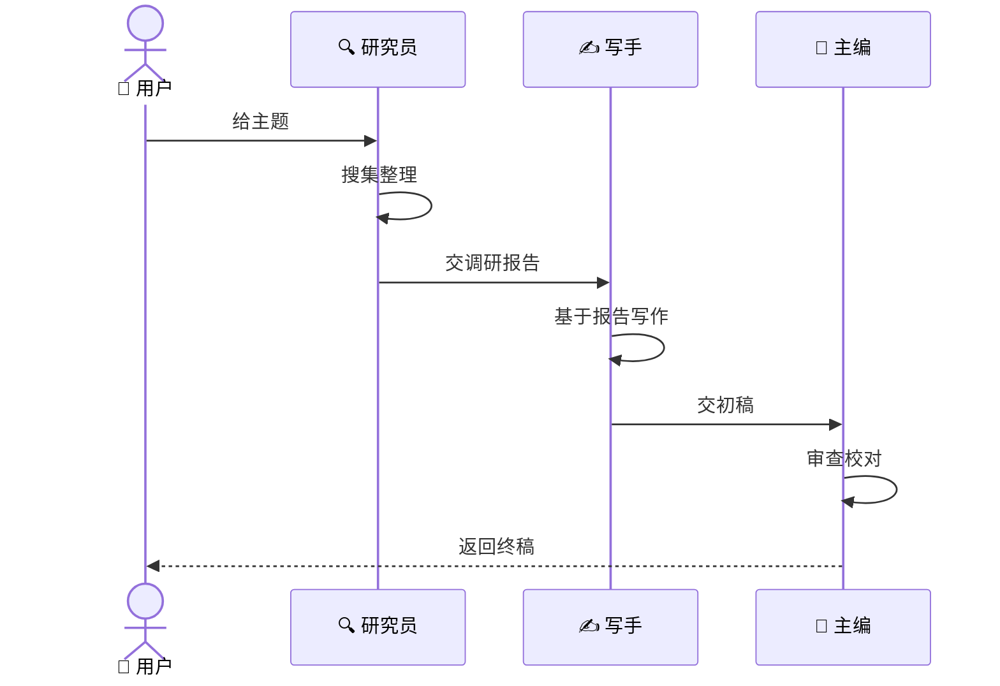
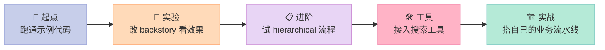

> 📚 **AI Agent 开源框架实战系列**（3/6） | ⬅️ 上一篇：[LangGraph：用状态图构建有记忆的 AI 工作流](/2026/04/17/langgraph-stateful-workflow/) | ➡️ 下一篇：[AutoGen：让多个 AI Agent 对话协作](/2026/04/17/autogen-multi-agent-conversation/) | 🔗 [配套代码仓库](https://github.com/xuqi2024/ai-agent-tutorials)


## 开篇钩子：一个 AI 不够用，我需要一个 AI "团队"

你有没有遇到过这种情况：让 AI 帮你写一篇深度行业报告，它洋洒洒写了 3000 字，引用了十几个"权威数据"——结果你一查，**至少一半数据是凭空编造的**。

这不是 AI 在故意骗你。问题在于，单个 AI 同时扮演调研员、分析师、写手、校对——每件事都做，每件事都容易出错。就像让一个人同时当记者、编辑和主编：顾此失彼是必然的。

**解决方案不是换一个更聪明的 AI，而是组建一个 AI 团队，让每个成员只专注自己的一件事。**

CrewAI（多智能体协作框架）就是干这件事的工具。它让你像管理真实团队一样，给每个 AI 分配岗位、目标和专长，让它们流水线式协作，完成复杂任务。

---

## 一、为什么需要多 Agent？

### 单 Agent 的三大痛点

2023 年，美国律师直接把 ChatGPT 生成的案例引用提交法院，结果法官发现引用的多个判例根本不存在，律师因此被罚款。**单个 AI 没有"同行审查"，错误直接流向结果。**

| 痛点 | 表现 | 根因 |
|------|------|------|
| 注意力分散 | 又调研又写作，每个环节都不专注 | 角色混乱，无法深度聚焦 |
| 上下文溢出 | 任务越长越容易前后矛盾 | 单次对话的 token 上限 |
| 无审查机制 | 输出直接是终态，无人把关 | 缺少独立的质量检验环节 |

### 多 Agent 的解法

多 Agent 系统的核心是**分工专注 + 流程审查**：

| 角色 | 类比 | 职责 |
|------|------|------|
| 🔍 研究员 Agent | 调研部门 | 搜集信息，输出事实 |
| ✍️ 写手 Agent | 内容部门 | 基于事实写作，不编造 |
| 📝 主编 Agent | 质量部门 | 审查内容，确保准确 |

每个 Agent 只做自己最擅长的一件事，上一个的输出是下一个的输入，形成完整闭环。

---

## 二、核心概念，用人话解释

### 🧑‍💼 Agent（角色）= 员工

一个 Agent 就是一名"AI 员工"。创建时需要告诉它三件事：

- **role（职位）**：它是研究员还是写手？
- **goal（目标）**：这个岗位的 KPI 是什么？
- **backstory（背景故事）**：它有哪些经验、风格、工作原则？

`backstory` 听起来像小说里的人物设定，但**它本质上是系统提示（System Prompt）**，直接决定 AI 的行为模式。写"你是严谨的科技记者，习惯用数据说话"，输出风格就截然不同于"你是活泼的科技博主"。

### 📋 Task（任务）= 工单

Task 是分配给 Agent 的具体工作，关键字段有三个：

- **description**：要做什么
- **expected_output**：产出物的格式和内容标准
- **agent**：由谁负责

**`expected_output` 必须写清楚。** "写个总结"和"用中文写一份 200 字摘要，包含 3 个要点"产出的结果天壤之别。

### 👥 Crew（团队）= 公司

Crew 把多个 Agent 和 Task 组合起来，定义谁来做、按什么顺序做。

### ⚙️ Process（流程）= 工作方式

- **sequential（顺序流）**：流水线模式，A 做完交给 B，B 做完交给 C
- **hierarchical（层级流）**：有"管理者" Agent 统一分配，类似老板派活

入门阶段用 `sequential` 就够了，直观且易于调试。

---

## 三、它是怎么工作的？

以"写一篇 AI 技术文章"为例，三个 Agent 按顺序协作：



关键机制是 **`context` 参数（任务依赖）**：写手 Task 设置 `context=[research_task]`，它就会自动获得研究员的输出作为素材，而不是凭空创作。这是多 Agent 协作的核心纽带。

---

## 四、5 分钟上手：完整可运行代码

> 📦 配套仓库：[xuqi2024/ai-agent-tutorials](https://github.com/xuqi2024/ai-agent-tutorials)
> 对应文件：`03-crewai/01_content_crew.py`

### 安装依赖

```bash
pip install crewai crewai-tools
```

### 核心代码片段

```python
from crewai import Agent, Task, Crew, Process

# ── 第一步：定义员工（Agent） ──────────────────────────────────────────

researcher = Agent(
    role="资深科技研究员",
    goal="搜集准确、有深度的技术信息，绝不编造数据",
    backstory=(
        "你在科技行业有 10 年经验，擅长从学术论文和技术文档中提炼关键信息。"
        "你的铁则是：没有可验证的来源，就不引用数据。"
    ),
    verbose=True
)

writer = Agent(
    role="科技内容写手",
    goal="将研究结果转化为清晰易懂的中文技术文章",
    backstory=(
        "你是一名科技博主，擅长用生活类比解释复杂概念，文章风格简洁有力，"
        "从不使用空话套话，读者以技术初学者为主。"
    ),
    verbose=True
)

editor = Agent(
    role="主编",
    goal="确保文章事实准确、逻辑通顺、格式规范",
    backstory=(
        "你是经验丰富的技术主编，对错误零容忍。"
        "你会逐段核查事实，标注可疑数据，并给出具体的修改建议。"
    ),
    verbose=True
)

# ── 第二步：定义工单（Task） ──────────────────────────────────────────

research_task = Task(
    description="调研 CrewAI 框架的核心功能和最新进展",
    expected_output="一份 300 字的调研摘要，包含核心概念、使用场景和典型案例",
    agent=researcher
)

write_task = Task(
    description="基于调研结果，写一篇面向初学者的 CrewAI 入门文章",
    expected_output="一篇 600 字的中文博客，包含代码示例，不使用专业术语堆砌",
    agent=writer,
    context=[research_task]   # 依赖研究员的输出，关键！
)

edit_task = Task(
    description="审查文章的事实准确性和可读性，输出最终版本",
    expected_output="经过校对的最终文章，附一段修改说明（指出改了什么、为什么改）",
    agent=editor,
    context=[write_task]
)

# ── 第三步：组建团队并运行（Crew） ──────────────────────────────────────

crew = Crew(
    agents=[researcher, writer, editor],
    tasks=[research_task, write_task, edit_task],
    process=Process.sequential,   # 顺序执行：研究→写作→审查
    verbose=True
)

result = crew.kickoff()
print(result)
```

**`backstory` 是整个系统最重要的调参旋钮。** 把研究员的 backstory 改成"你喜欢凭直觉判断而不是查找来源"，整个团队的输出质量就会断崖式下降。它不是装饰性文字，而是在塑造 AI 的"职业人格"，直接影响每一次推理的方向。

---

## 五、常见误区（踩坑指南）

### ❌ 误区一：backstory 只是描述性文字

很多新手把 `backstory` 写成："你是一名研究员，有丰富经验。" 这几乎没有效果。

**有效的 backstory 要包含行为准则、禁忌事项和工作方式。** 把它当成给新员工写的入职手册，而不是 LinkedIn 个人简介。例如明确写出"你的原则是：没有可验证来源，就不引用数据"，AI 就会在不确定时主动说"我找不到相关数据"，而不是编一个。

### ❌ 误区二：随手打开 allow_delegation=True

`allow_delegation=True` 允许 Agent 把收到的任务再转发给其他 Agent。听起来很智能，实际上在复杂场景中容易导致**任务在 Agent 之间循环传递**，最终陷入死循环或产生意外的任务链。

入门阶段保持默认值（`False`），等完全理解框架后再按需启用。

### ❌ 误区三：expected_output 写得模糊

`expected_output="写一个总结"` 和 `expected_output="用中文写一份 200 字摘要，包含 3 个核心结论，每条不超过 2 句话"` 的产出完全不是同一个量级。

**越具体的期望，越稳定的输出。** 写 expected_output 时，脑子里先想象一份满意的终态，再把它描述出来。

---

## 六、框架对比：CrewAI vs LangGraph vs AutoGen

| 维度 | CrewAI | LangGraph | AutoGen |
|------|--------|-----------|---------|
| 核心范式 | 角色扮演 + 顺序流 | 状态机 + 图结构 | 对话驱动 |
| 学习难度 | ⭐ 低（Python 类） | ⭐⭐⭐ 高（图论概念） | ⭐⭐ 中 |
| 适合场景 | 内容生产、研究报告 | 复杂业务流程 | 代码生成、对话任务 |
| 角色系统 | ✅ 原生支持 | ❌ 需自行设计 | ⚠️ 部分支持 |
| 入门友好度 | ✅ 非常友好 | ❌ 陡峭 | ✅ 较友好 |

**如果你是初学者，CrewAI 是入门多 Agent 开发的最佳起点。** 用"公司团队"这个最直觉的模型，几十行代码就能搭出有实际产出的 AI 工作流。

---

## 七、下一步怎么学？



**具体行动路径：**

1. **先跑通**：克隆 [ai-agent-tutorials](https://github.com/xuqi2024/ai-agent-tutorials)，直接运行 `03-crewai/01_content_crew.py`，观察三个 Agent 的完整对话日志
2. **再改参数**：分别修改每个 Agent 的 `backstory` 和 Task 的 `expected_output`，对比输出变化
3. **加真实工具**：给研究员接入 `SerperDevTool`（联网搜索），让数据有真实来源而非 AI 臆造
4. **读官方文档**：[docs.crewai.com](https://docs.crewai.com) 提供完整的工具库和进阶流程参考

> 多 Agent 系统的本质，不是"多个 AI 叠加就更聪明"，而是**分工让每个 AI 更专注**。就像一家运转良好的公司，不需要每个员工都是全才——需要的是清晰的职责边界和顺畅的协作流程。
>
> **你的第一个 AI 团队，今天就可以开始搭建。**

---

## 对比分析

CrewAI 把多 Agent 系统抽象为"角色 + 任务 + 流程"。下面与同样做多 Agent 的两个项目对比：AutoGen（对话式）和 LangGraph（图编排）。

### 对比维度一：抽象与表达
| 维度 | CrewAI | AutoGen | LangGraph |
| --- | --- | --- | --- |
| 抽象层级 | Role / Task / Crew / Process | Agent + GroupChat | Node / Edge / State |
| 流程控制 | Sequential / Hierarchical | 对话选择 + speaker 规则 | 任意图结构 |
| 表达重点 | 业务流水线 | 对话协商 | 状态与控制流 |
| 学习曲线 | 低 | 中 | 中偏高 |

### 对比维度二：可观测与扩展
| 维度 | CrewAI | AutoGen | LangGraph |
| --- | --- | --- | --- |
| 可视化 | 中 | 弱 | 强 |
| 持久化 | 任务级 | 有限 | Checkpointer |
| 第三方工具 | 内置工具库 | 需自封装 | LangChain 全栈 |
| 适合谁 | 业务/产品经理 | 研究者 | 工程师 |

### 优缺点
- **CrewAI**：角色化模型最易"业务化"，门槛最低；复杂场景需走 LangGraph。
- **AutoGen**：对话驱动，适合灵活推演；缺乏结构化流程控制。
- **LangGraph**：图模型表达力最强，但学习曲线偏高。

### 何时选哪个
- 业务团队最熟悉的"角色 + 任务"模型 → 选 CrewAI
- 让多个 Agent 自由对话推演 → 选 AutoGen
- 复杂流程需要可视化、状态管理 → 选 LangGraph

### 参考资料
- CrewAI 仓库：https://github.com/crewAIInc/crewAI
- AutoGen 仓库：https://github.com/microsoft/autogen
- LangGraph 仓库：https://github.com/langchain-ai/langgraph
