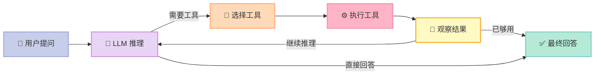
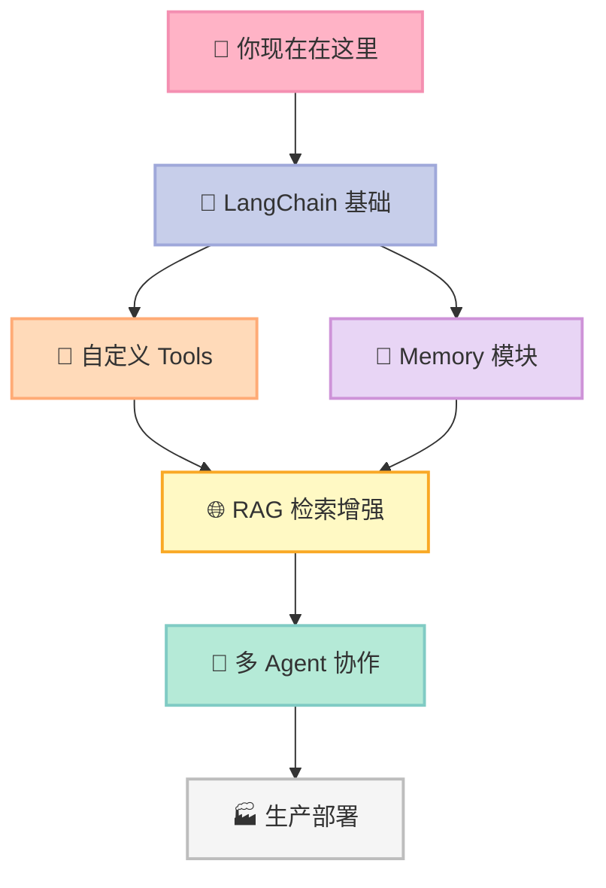

> 📚 **AI Agent 开源框架实战系列**（1/6） | ➡️ 下一篇：[LangGraph：用状态图构建有记忆的 AI 工作流](/2026/04/17/langgraph-stateful-workflow/) | 🔗 [配套代码仓库](https://github.com/xuqi2024/ai-agent-tutorials)


## 你以为 AI 聊天很简单？直到你需要它查数据、跑代码……

你打开 ChatGPT，输入"帮我查一下今天上海的天气，然后告诉我适不适合跑步"。

ChatGPT 给了你一个看起来合理的回答——但它根本**没有联网**，也**没有查天气**。它只是在用自己的训练数据"猜"。

这就是裸 LLM（大语言模型）的硬伤：**会说话，但不会行动**。你让它帮你发邮件，它给你写好了，但没发。你让它查股票，它给你一个可能已经过时的数字。

**LangChain** 就是为了解决这个问题而生的——它让 LLM 从"只会聊天"进化为"能干活的 AI Agent"。

---

## 一、为什么需要 LangChain？（从痛点切入）

假设你自己用 OpenAI API 写一个能"查天气 + 做计算"的小助手，你需要：

1. 手动拼接 system prompt 和 user 消息
2. 自己解析模型输出，判断它想调用哪个工具
3. 自己执行工具，再把结果塞回对话历史
4. 循环上述逻辑，直到模型不再调用工具

光是这一套"决策-执行-观察"的循环，就能让初学者写几百行代码，还充满 bug。

来看一组对比：

| 维度 | 裸 OpenAI API | 自己搭框架 | LangChain |
|------|:---:|:---:|:---:|
| 工具调用支持 | ❌ 需手写解析 | ⚠️ 费时费力 | ✅ 内置支持 |
| 对话记忆管理 | ❌ 手动维护 | ⚠️ 容易出 bug | ✅ Memory 模块 |
| 多工具 Agent | ❌ 无 | ⚠️ 复杂 | ✅ 开箱即用 |
| 学习曲线 | 低 | 高 | 中 |
| 生产可用性 | ⚠️ 需大量工作 | ❌ 不推荐 | ✅ 有生态 |

**结论很直接**：如果你只是测试一下 GPT 的文字能力，裸 API 够用。但一旦你想让 AI "做事情"，LangChain 会帮你省掉大量重复劳动。

---

## 二、核心概念，用人话解释

### 🔗 Chain（链）——流水线工人

想象一条工厂流水线：原料进来 → 加工 → 检验 → 打包 → 出货。每个工序只干自己的事，按顺序传递。

**Chain 就是这条流水线**，把多个处理步骤串在一起。比如：接收用户问题 → 调用 LLM → 格式化输出。

### 🤖 Agent（代理）——聪明的项目经理

普通 Chain 是"按流程走"，Agent 是"自己想怎么走"。

给 Agent 一堆工具（查天气、搜索网络、执行代码），告诉它目标，它**自己决定用哪个工具、用几次、什么顺序**。就像一个项目经理，手下有各种专家，他负责调度。

### 🔧 Tool（工具）——专家团队

Tool 是 Agent 可以调用的能力单元。一个 Tool 就是一个函数，有名字、有描述（告诉 LLM 什么时候该用它）、有输入输出。

**关键细节**：LLM 是通过读 Tool 的**文字描述**来决定要不要用它的——描述写得烂，Agent 就会乱选工具。

### 🧠 Memory（记忆）——会记事的秘书

默认的 LLM 调用是无状态的，每次对话互不相干。Memory 模块让 Agent 记住上下文，比如你说"帮我分析刚才那份报告"，它知道"刚才那份"是什么。

---

## 三、它是怎么工作的？

Agent 的核心是 **ReAct 循环**（Reason + Act）：先思考，再行动，看结果，再思考……



举个具体例子：你问"北京今天适合出门吗？"

1. **LLM 推理**：需要知道天气才能回答
2. **选择工具**：调用 `get_weather` 工具
3. **执行**：工具返回"北京今天 15℃，晴"
4. **观察**：拿到数据了
5. **LLM 再推理**：信息足够了，给出答案
6. **输出**："今天天气不错，适合出门，建议穿薄外套。"

整个过程，LLM 可能循环 1-5 次，直到它认为信息足够为止。

---

## 四、5 分钟上手：完整可运行代码

> 配套仓库：[https://github.com/xuqi2024/ai-agent-tutorials](https://github.com/xuqi2024/ai-agent-tutorials)
> 本节代码对应 `01-langchain/01_hello_agent.py`

先安装依赖：

```bash
pip install langchain langchain-openai
export OPENAI_API_KEY="your-key-here"
```

然后是完整代码，**每一行都有中文注释**：

```python
# 01_hello_agent.py
# 目标：构建一个有天气查询 + 计算能力的简单 Agent

from langchain_openai import ChatOpenAI
from langchain.agents import tool, AgentExecutor, create_react_agent
from langchain import hub

# ── ① 定义工具 ──────────────────────────────────────────────
# @tool 是 Python 装饰器（decorator）
# 它的作用：把一个普通函数"包装"成 LangChain 能识别的 Tool 对象
# 函数的 docstring（三引号注释）就是 LLM 看到的工具描述，要写清楚！
@tool
def get_weather(city: str) -> str:
    """查询指定城市今天的天气情况。输入城市名，返回天气描述。"""
    # 这里用 mock 数据模拟，真实场景接天气 API
    mock_data = {
        "北京": "晴，15℃，微风",
        "上海": "多云，18℃，无风",
        "广州": "小雨，22℃，东南风",
    }
    # dict.get(key, 默认值)：找不到 key 时返回默认值
    return mock_data.get(city, f"暂无 {city} 的天气数据")


@tool
def calculate(expression: str) -> str:
    """计算数学表达式。输入合法的 Python 数学表达式，返回计算结果。"""
    try:
        # eval() 执行字符串表达式，生产环境要做安全过滤
        result = eval(expression)
        return f"计算结果：{result}"
    except Exception as e:
        return f"计算错误：{e}"


# ── ② 初始化 LLM ────────────────────────────────────────────
# gpt-4o-mini 是性价比最高的入门选择，速度快、便宜
# temperature=0 让输出更稳定（不随机），适合工具调用场景
llm = ChatOpenAI(model="gpt-4o-mini", temperature=0)

# ── ③ 加载 ReAct Prompt 模板 ────────────────────────────────
# LangChain Hub 提供了经过验证的 prompt 模板
# hwchase17/react 是标准 ReAct Agent 的 prompt
prompt = hub.pull("hwchase17/react")

# ── ④ 把工具列表交给 Agent ──────────────────────────────────
tools = [get_weather, calculate]

# create_react_agent 把 LLM + tools + prompt 组合成一个 Agent
agent = create_react_agent(llm, tools, prompt)

# AgentExecutor 负责实际运行 Agent（处理循环、错误、超时等）
# verbose=True 会打印 Agent 的推理过程，方便调试
agent_executor = AgentExecutor(agent=agent, tools=tools, verbose=True)

# ── ⑤ 运行！────────────────────────────────────────────────
response = agent_executor.invoke({
    "input": "北京今天天气怎么样？如果温度超过 10 度，再乘以 2 是多少？"
})

print("\n🤖 最终答案：", response["output"])
```

运行后你会看到 Agent 的"思考过程"被打印出来，像这样：

```yaml
Thought: 需要先查北京天气
Action: get_weather
Action Input: 北京
Observation: 晴，15℃，微风
Thought: 15 > 10，需要计算 15 × 2
Action: calculate
Action Input: 15 * 2
Observation: 计算结果：30
Thought: 信息足够了，可以回答
Final Answer: 北京今天晴，15℃，微风。15 度超过 10 度，乘以 2 是 30。
```

**这就是 ReAct 循环的真实样子**——LLM 在推理和行动之间反复切换。

---

## 五、常见误区（踩坑指南）

### ❌ 误区一：以为 LangChain = 完整 AI 解决方案

LangChain 是**框架**，不是产品。它帮你把 LLM、工具、记忆连接起来，但你仍然需要：
- 自己的 OpenAI API Key（要花钱）
- 自己设计工具逻辑
- 自己处理错误和边界情况

**别以为装了 LangChain 就万事大吉**，它解决的是"连接问题"，不是"AI 能力问题"。

### ❌ 误区二：温度参数（temperature）理解错误

很多人以为 `temperature=1` 就是"最聪明"，其实它控制的是**随机性**，不是智力。

- `temperature=0`：输出最稳定，适合工具调用、结构化输出
- `temperature=0.7`：创意写作的常用值，有一定随机性
- `temperature=1+`：很随机，适合头脑风暴，**不适合**需要精确的 Agent

**工具调用场景一律用 `temperature=0`**，否则 Agent 可能"心血来潮"选错工具。

### ❌ 误区三：工具描述写得含糊导致 Agent 乱选

这是最常见的坑。LLM 选工具完全靠读描述，如果你的描述是：

```python
@tool
def my_tool(x: str) -> str:
    """处理数据"""  # ← 太模糊！LLM 不知道什么时候用它
```

Agent 要么从不用它，要么乱用它。

**正确做法**：描述要包含"什么时候用"和"输入输出格式"：

```python
@tool
def my_tool(city: str) -> str:
    """查询指定城市的实时天气。
    输入：城市名（中文），如"北京"、"上海"。
    输出：天气描述字符串，包含温度和天气状况。
    """
```

一句话原则：**描述越精确，Agent 越靠谱**。

---

## 六、下一步怎么学？

掌握了 Hello Agent 之后，推荐按以下路径深入：



**推荐资源清单：**

| 资源 | 类型 | 适合阶段 |
|------|------|----------|
| [配套仓库 ai-agent-tutorials](https://github.com/xuqi2024/ai-agent-tutorials) | 代码实战 | 入门 |
| [LangChain 官方文档](https://python.langchain.com/docs/) | 文档 | 入门～进阶 |
| [LangSmith](https://smith.langchain.com/) | 调试工具 | 调试 Agent 必备 |
| 《Building LLM Apps》（LangChain 博客系列） | 文章 | 进阶 |

**今天就可以做的三件事：**

1. **Clone 配套仓库**，把 `01_hello_agent.py` 跑起来，看 Agent 的推理日志
2. **改一个工具**：把 `get_weather` 的 mock 数据替换成真实天气 API（推荐和风天气，有免费额度）
3. **加一个工具**：自己定义一个"查汇率"或"搜索新闻"的 Tool，观察 Agent 怎么学会用它

> LLM 能聊天，Agent 能干活。**你离一个真正会干活的 AI 助手，只差一个 `@tool` 的距离。**

---

## 对比分析

LangChain Agents 是 Agent 入门最常见的路径。下面与同样面向"工具调用 Agent"的两个框架对比：Agno（极简 Python）和 Smolagents（HuggingFace）。

### 对比维度一：抽象与上手
| 维度 | LangChain Agent | Agno | Smolagents |
| --- | --- | --- | --- |
| 抽象层级 | AgentExecutor + Tool | Agent + Tools + Models | CodeAgent / ToolCallingAgent |
| 上手代码量 | 10+ 行 | 5 行 | 10+ 行 |
| 模型切换 | 改一行 | 改一行 | HF 接口为主 |
| 文档与社区 | 最厚 | 中 | 中 |

### 对比维度二：能力与扩展
| 维度 | LangChain Agent | Agno | Smolagents |
| --- | --- | --- | --- |
| 工具生态 | 全栈最多 | 内置丰富 | HF 工具集 |
| 多 Agent 协作 | 通过 LangGraph | Team + Workflow | 不强调 |
| 可观测 | LangSmith | 内置 | HF Hub |
| 适合谁 | 想长期深耕 LLM 应用的人 | 第一次写 Agent 的人 | 紧跟 HF 的人 |

### 优缺点
- **LangChain Agent**：生态最厚，长期迭代最稳；概念多，入门会有"信息过载"感。
- **Agno**：极简 5 行，多模态原生；想用高级能力时还是要补别的库。
- **Smolagents**：紧跟 HF 生态，Code Agent 范式新颖；和 HF 绑定较深。

### 何时选哪个
- 想系统学 LLM 应用 + 长期迭代 → 选 LangChain Agent
- 想 5 行代码跑通第一个 Agent → 选 Agno
- 想用 HF 生态 + Code Agent 范式 → 选 Smolagents

### 参考资料
- LangChain 仓库：https://github.com/langchain-ai/langchain
- Agno 仓库：https://github.com/agno-agi/agno
- Smolagents 仓库：https://github.com/huggingface/smolagents
