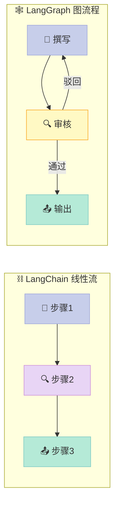
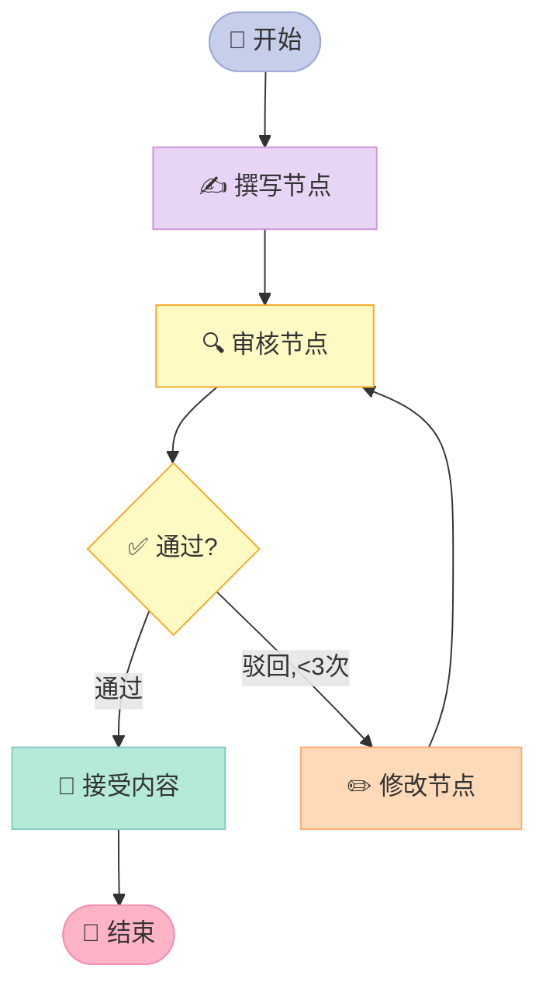

> 📚 **AI Agent 开源框架实战系列**（2/6） | ⬅️ 上一篇：[LangChain：从零构建你的第一个 AI Agent](/2026/04/17/langchain-agent-from-zero/) | ➡️ 下一篇：[CrewAI：用角色扮演构建多 Agent 团队](/2026/04/17/crewai-multi-agent-team/) | 🔗 [配套代码仓库](https://github.com/xuqi2024/ai-agent-tutorials)


> 你以为一次 LLM 调用就能搞定复杂任务？错了——真正的 AI Agent 需要"反复思考、按条件走、带着记忆"。

---

## 开篇钩子：为什么 AI 决策需要"流程图"？

假设你让 ChatGPT 帮你写一份市场分析报告。它洋洋洒洒输出了两千字，但质量差强人意——**你想让它自我审核并修改，但它已经忘了自己刚才写了什么。**

这不是 GPT 不聪明，而是它的默认工作模式就是"一次性回答"。如果你想构建一个能**循环思考、跨步骤记忆、按条件分叉**的 AI Agent，你就需要 LangGraph。

---

## 一、LangChain 够用吗？LangGraph 解决了什么？

LangChain 让我们能快速把 LLM 和工具链组合起来。但当业务逻辑变复杂，它就开始露出短板：

- **线性执行**：任务只能从头跑到尾，没有"如果不满足条件就回去重试"
- **状态难追踪**：上一步的输出传到下一步后，就和"前面的记忆"断联了
- **无法真正循环**：Agent 虽然能调用工具，但复杂的多轮决策逻辑写起来极其别扭

LangGraph 的解法很直觉：**把 AI 工作流画成一张图（Graph）**。

- **节点（Node）**：每个处理步骤
- **边（Edge）**：步骤之间的连接
- **状态（State）**：贯穿全程的共享数据

下面这张图展示了 LangGraph 与 LangChain 线性流程的对比：



LangChain 是一条单向高速公路，LangGraph 是一张带环形匝道的城市路网。

---

## 二、核心概念，用人话解释

### StateGraph（状态图）—— 地铁线路图

整个工作流就是一张地铁图。每个站是一个节点，每条线路是一条边。列车（数据）按线路流动，在某些站点可以换乘（条件分支）。

### TypedDict State —— 共享白板

所有节点共用一块白板，每个节点可以在上面读取信息、写入结果。用 Python 的 `TypedDict` 来定义白板格式：

```python
from typing import TypedDict, List

class AgentState(TypedDict):
    content: str        # 当前内容
    feedback: str       # 审核意见
    attempts: int       # 已修改次数
    approved: bool      # 是否通过审核
```

`TypedDict` 就是给字典加上"说明书"——告诉 Python 这个字典里有哪些 key，每个 key 是什么类型，这样 IDE 能帮你自动补全，出错时也有提示。

### Node（节点）—— 工作站

每个节点是一个 Python 函数，**接收当前状态，返回更新后的状态**：

```python
def writer_node(state: AgentState) -> AgentState:
    # 调用 LLM 生成内容
    content = llm.invoke("请写一段产品介绍")
    return {"content": content.content, "attempts": state["attempts"] + 1}
```

### Edge（边）—— 通道

边决定"完成这个节点后去哪"。普通边是固定路径，条件边根据状态动态选择。

### 条件边（Conditional Edge）—— 红绿灯

```python
def route_after_review(state: AgentState) -> str:
    if state["approved"]:
        return "accept"           # 绿灯 → 通过
    elif state["attempts"] >= 3:
        return "accept"           # 超过3次也放行
    else:
        return "revise"           # 红灯 → 打回修改
```

---

## 三、它是怎么工作的？

下面是一个"写作→审核→可能修改"的完整工作流图：



**关键：修改节点会再次进入审核节点，形成一个可控的循环。** 但循环有终止条件（最多 3 次），不会无限转圈。

---

## 四、5 分钟上手：完整可运行代码

配套代码仓库：[https://github.com/xuqi2024/ai-agent-tutorials](https://github.com/xuqi2024/ai-agent-tutorials)

完整示例在 `02-langgraph/02_conditional_graph.py`。以下是核心结构拆解：

### Step 1：定义状态

```python
from typing import TypedDict
from langgraph.graph import StateGraph, END

class AgentState(TypedDict):
    content: str
    feedback: str
    attempts: int
    approved: bool
```

### Step 2：编写节点函数

```python
def writer_node(state: AgentState) -> AgentState:
    """撰写或修改内容"""
    prompt = "请写一段100字以内的产品介绍"
    if state.get("feedback"):
        prompt = f"根据反馈修改：{state['feedback']}"
    result = llm.invoke(prompt)
    return {
        "content": result.content,
        "attempts": state.get("attempts", 0) + 1,
        "approved": False,
        "feedback": ""
    }

def reviewer_node(state: AgentState) -> AgentState:
    """审核内容质量"""
    prompt = f"请审核以下内容，回复 APPROVE 或 REJECT+原因：\n{state['content']}"
    result = llm.invoke(prompt)
    approved = "APPROVE" in result.content
    feedback = result.content if not approved else ""
    return {"approved": approved, "feedback": feedback}
```

### Step 3：定义路由函数和构建图

```python
def should_continue(state: AgentState) -> str:
    # 通过 或 超过3次 → 结束
    if state["approved"] or state["attempts"] >= 3:
        return "accept"
    return "revise"

# 构建图
builder = StateGraph(AgentState)

# 添加节点
builder.add_node("writer", writer_node)
builder.add_node("reviewer", reviewer_node)

# 添加普通边
builder.add_edge("writer", "reviewer")

# 添加条件边（核心！）
builder.add_conditional_edges(
    "reviewer",            # 从哪个节点出发
    should_continue,       # 路由函数
    {
        "accept": END,     # "accept" → 终止
        "revise": "writer" # "revise" → 回到撰写
    }
)

# 设置入口和编译
builder.set_entry_point("writer")
graph = builder.compile()
```

### Step 4：运行

```python
result = graph.invoke({
    "content": "",
    "feedback": "",
    "attempts": 0,
    "approved": False
})
print(result["content"])
```

`add_conditional_edges` 是 LangGraph 的灵魂——**它把路由函数的返回值映射到下一个节点名称**，让循环和分支变得清晰可控。

---

## 五、常见误区（踩坑指南）

**误区一：直接修改 state 字典**

```python
# ❌ 错误写法
def bad_node(state):
    state["content"] = "new content"  # 直接改，会破坏状态追踪
    return state

# ✅ 正确写法
def good_node(state):
    return {"content": "new content"}  # 返回新字典，只包含要更新的 key
```

LangGraph 的状态是**不可变更新**模式——每次只返回你想修改的字段，框架自动合并。

**误区二：忘记设置 END 终止**

每条路径必须最终到达 `END`，否则图会一直运行下去。检查你的所有条件分支，确保每一条都有出口。

**误区三：无限循环没有保险**

条件分支如果逻辑写错，很容易让图陷入死循环。**始终加上计数器或最大尝试次数**，就像上面例子中的 `attempts >= 3` 兜底逻辑。

---

## 六、LangChain vs LangGraph 对比

| 维度 | LangChain | LangGraph |
|------|-----------|-----------|
| 适用场景 | 简单链式调用、RAG | 复杂多步 Agent、需要循环 |
| 学习曲线 | ⭐⭐ 较平缓 | ⭐⭐⭐ 稍陡，需理解图结构 |
| 状态管理 | ⚠️ 靠 Memory 模块，较繁琐 | ✅ TypedDict State，天然共享 |
| 循环支持 | ❌ 基本不支持 | ✅ 核心特性 |
| 条件分支 | ⚠️ 需要 Router Chain | ✅ `add_conditional_edges` 原生支持 |
| 可视化调试 | ❌ 较难 | ✅ 支持 `graph.get_graph().draw_mermaid()` |

结论很清晰：**需要循环和复杂分支就用 LangGraph，简单任务 LangChain 依然够用。**

---

## 七、下一步怎么学？

**第一步**：克隆配套仓库，直接跑代码

```bash
git clone https://github.com/xuqi2024/ai-agent-tutorials
cd ai-agent-tutorials/02-langgraph
pip install -r requirements.txt
python 02_conditional_graph.py
```

**第二步**：改动实验。把 `attempts >= 3` 改成 `>= 5`，观察图会多跑几次审核。

**第三步**：阅读官方文档的 [Concepts 页面](https://langchain-ai.github.io/langgraph/concepts/)，重点看 `Checkpointer`（持久化状态）和 `Human-in-the-loop`（人工介入）两节——这是生产级 Agent 的核心能力。

**第四步**：尝试把你自己的业务流程画成节点图，再用 LangGraph 实现它。

---

> **一句话总结**：LangGraph 把 AI 工作流从"一问一答"升级为"有记忆、能循环、按规则走"的状态机——这才是真正 Agent 的样子。现在就去跑一跑配套代码，感受循环审核的魔力吧。
