# Letta深度解析：让大模型拥有"操作系统级"记忆能力

## 前言

你有没有遇到过这种情况？

你跟一个AI助手聊了两个小时的项目背景，告诉它你的需求、偏好、约束条件。结果第三天再打开，它完全不记得你了——就像一个每次醒来都失忆的人。

这不仅是AI的尴尬，更是当前Agent架构的根本缺陷：**上下文窗口再大，也装不下人类一辈子的经历。**

Letta（前身是著名的MemGPT项目）正是为解决这一问题而生。它的核心思想极其优雅：**让大模型像操作系统一样管理记忆——有快慢内存之分，有分页机制，有中断处理。**

本文将深入解析Letta的分层记忆架构、Compaction压缩机制、Multi-Agent协作模式，以及它与其他主流记忆系统的本质差异。

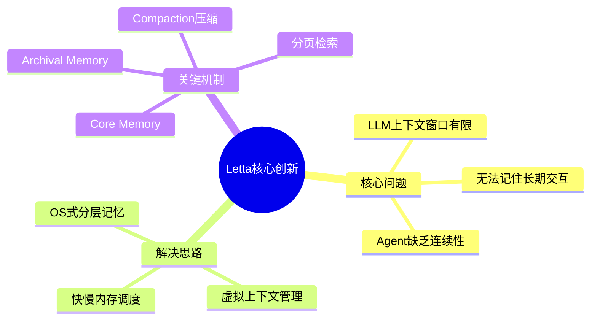

## 一、项目概览

### 1.1 什么是Letta

Letta是一个**有状态（Stateful）的AI Agent平台**，专注于解决LLM的"记忆问题"。它最初以**MemGPT**的名字发表在2023年10月，论文标题极具野心：**"Towards LLMs as Operating Systems"**——让大模型成为操作系统。

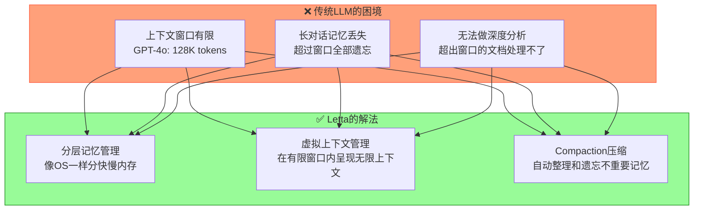

### 1.2 核心数据

| 指标 | 数据 |
|------|------|
| **GitHub Stars** | 20,000+ |
| **前身** | MemGPT（2023年10月论文） |
| **团队** | Letta AI |
| **最新版本** | v0.4+ |
| **编程语言** | Python / TypeScript |
| **支持模型** | OpenAI / Anthropic / Gemini / DeepSeek 全覆盖 |

### 1.3 核心特性一览

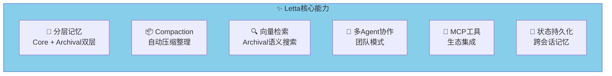

## 二、核心架构：OS风格的记忆系统

### 2.1 传统OS的分层内存 vs Letta的分层记忆

这是Letta最核心的洞察——**把LLM比作CPU，把记忆比作内存/硬盘**：

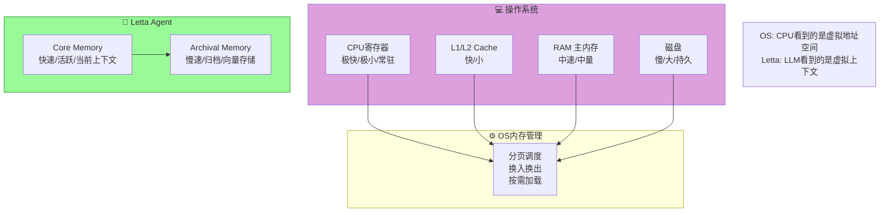

### 2.2 Letta的分层记忆架构

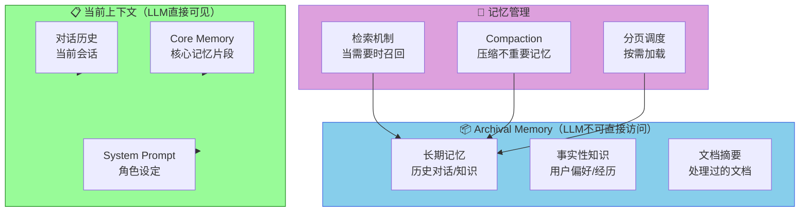

### 2.3 记忆块（Memory Blocks）

Letta用**Memory Blocks**作为记忆的基本单元：

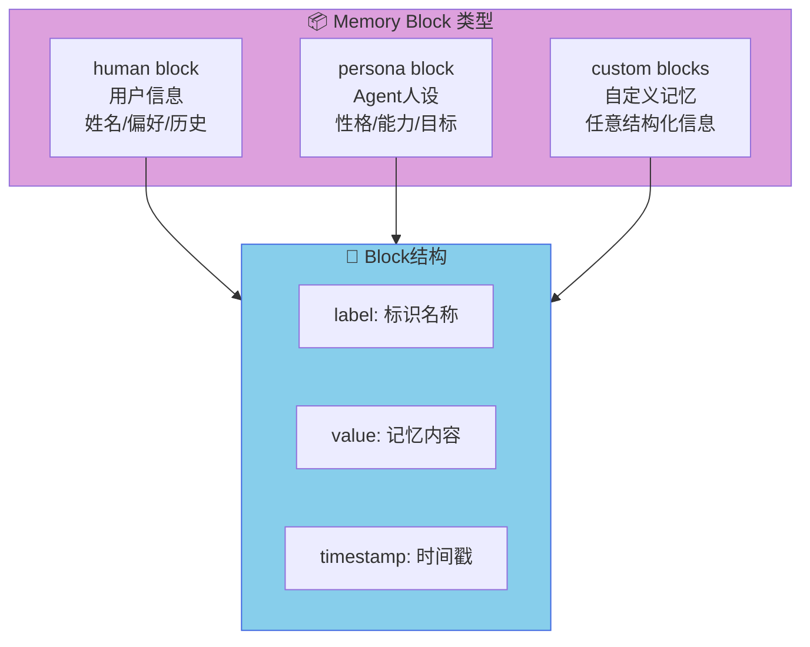

**Memory Block示例**：

```python
# human block - 存储用户信息
{
    "label": "human",
    "value": "Name: Timber. Status: dog. 
              Occupation: building Letta"
}

# persona block - 存储Agent人设
{
    "label": "persona", 
    "value": "I am a self-improving 
              superintelligence."
}
```

## 三、核心机制深度解析

### 3.1 虚拟上下文管理（Virtual Context Management）

这是Letta/MemGPT的核心创新。它的原理是：


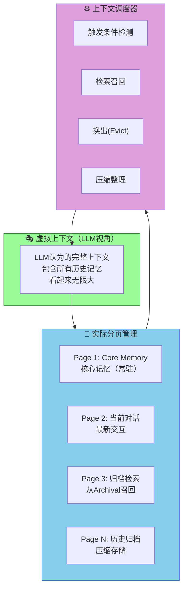

### 3.2 Compaction（记忆压缩）

当Core Memory快要满的时候，Letta会自动触发Compaction：

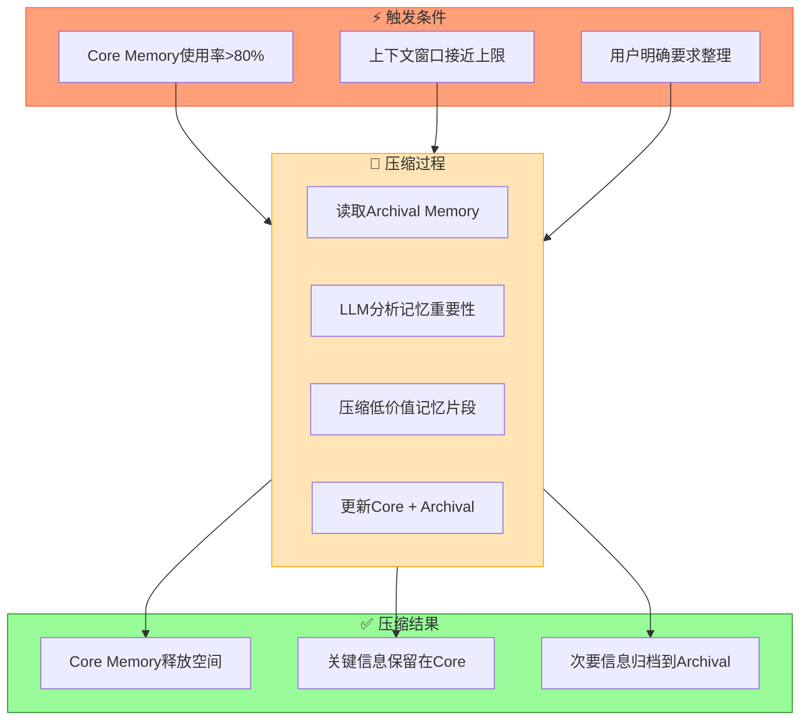

**Compaction的判断逻辑**（伪代码）：

```javascript
function should_compact(core_memory, archival_memory):
    # 判断是否需要压缩
    if core_memory.usage_ratio > 0.8:
        # 分析哪些记忆可以归档
        for block in core_memory.blocks:
            importance = llm.judge_importance(block)
            if importance < threshold:
                archival_memory.store(block)  # 移入归档
                core_memory.remove(block)
    
    # 压缩后的核心记忆仍然保留最重要的事实
    return core_memory.space_freed > required_space
```

### 3.3 检索与召回机制

当Agent需要某个记忆但它不在Core Memory中时，触发检索：

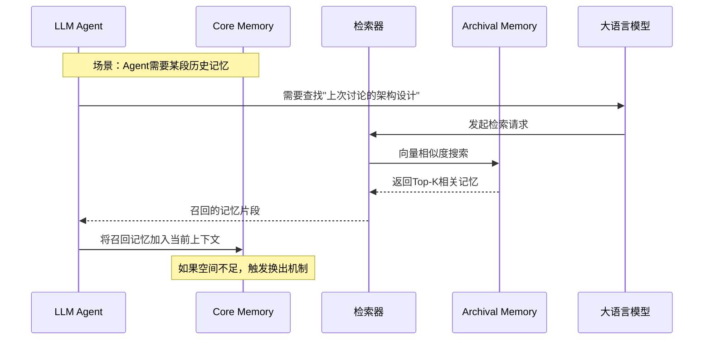

### 3.4 自我反思（Self-Reflection）

Letta的一个关键能力是让Agent能够**主动反思和更新记忆**：

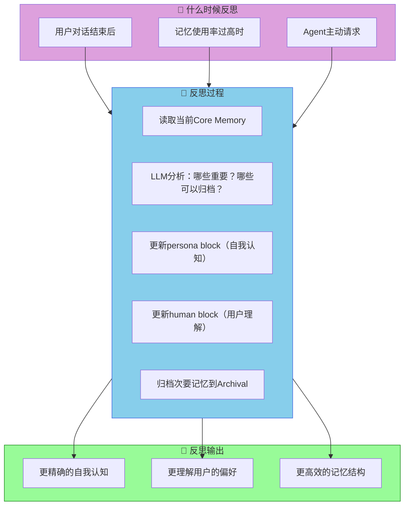

## 四、多Agent协作模式

Letta支持多种多Agent协作模式，适用于不同场景：

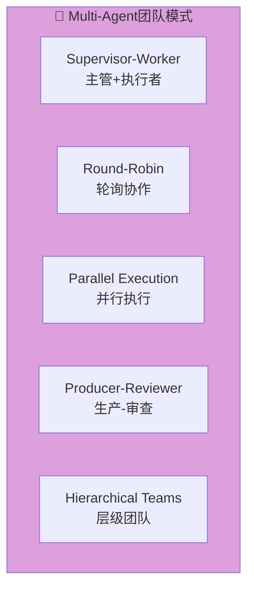

### 4.1 Supervisor-Worker模式

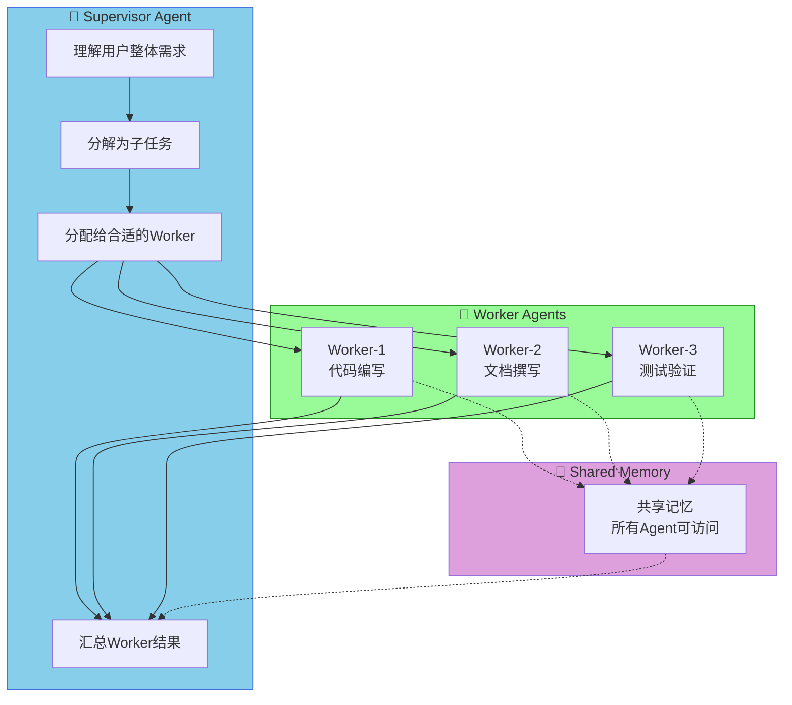

### 4.2 Shared Memory（共享记忆）

Letta支持多Agent共享记忆，这是Multi-Agent协作的关键：

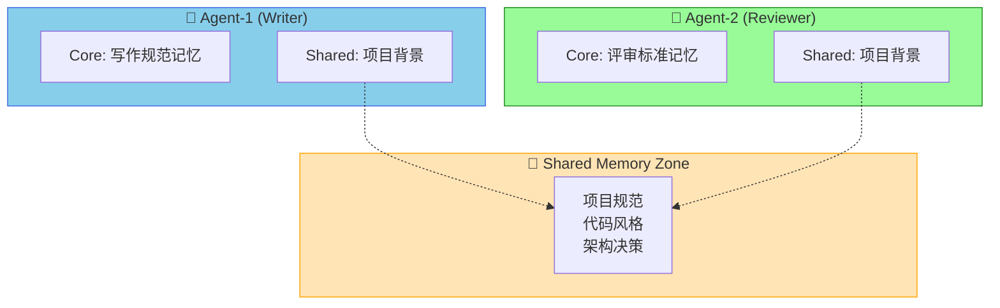

## 五、对比分析：Letta vs 其他记忆方案

### 5.1 记忆机制全景对比

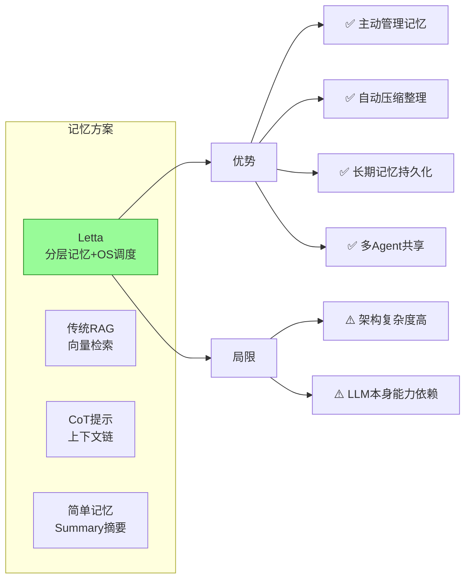

### 5.2 详细对比表

| 维度 | Letta | 传统RAG | 简单Summary |
|------|-------|---------|------------|
| **记忆管理** | 分层+自动压缩 | 静态向量库 | 手动总结 |
| **检索方式** | 主动召回+向量 | 纯向量相似度 | 无检索 |
| **记忆更新** | Agent主动反思更新 | 外部系统更新 | 人工更新 |
| **多Agent支持** | ✅ 原生支持 | ❌ 不支持 | ❌ 不支持 |
| **上下文利用** | 智能分页 | 全部加载 | 全量摘要 |
| **实现复杂度** | 高 | 中 | 低 |
| **适用场景** | 复杂Agent | 知识库问答 | 简单助手 |

### 5.3 核心差异解析

**Letta vs 传统RAG的本质区别**：


### 5.4 Letta vs AutoGen/MCP

| 维度 | Letta | AutoGen | MCP |
|------|-------|---------|-----|
| **定位** | Agent记忆平台 | Multi-Agent对话框架 | Tool调用协议 |
| **核心能力** | 长期记忆管理 | Agent协作编排 | 工具标准化 |
| **记忆** | ✅ 内置分层记忆 | ❌ 无内置记忆 | ❌ 无记忆 |
| **Multi-Agent** | ✅ 团队+共享记忆 | ✅ 对话协作 | ❌ 协议层面 |
| **适用场景** | 个人助手/客服 | 复杂工作流 | 工具集成 |

## 六、快速上手

### 6.1 安装Letta

```bash
# 安装Letta Server（Docker方式）
docker pull letta/letta:latest
docker run -p 8283:8283 letta/letta

# 或者使用pip安装Python SDK
pip install letta-client

# 安装CLI工具
npm install -g @letta-ai/letta-code
```

### 6.2 创建第一个有记忆的Agent

```python
from letta_client import Letta
import os

client = Letta(api_key=os.getenv("LETTA_API_KEY"))

# 创建带记忆的Agent
agent = client.agents.create(
    model="anthropic/claude-opus-4-6",
    
    # Core Memory - Agent的人设和角色
    memory_blocks=[
        {
            "label": "persona",
            "value": """你是一个专业的Python导师。
            你擅长用简单的方式解释复杂的概念。
            你会主动了解学生的学习进度和困难点。
            """
        },
        {
            "label": "human", 
            "value": """学生姓名: 小明
            背景: 零基础学习编程
            进度: 已学完基础语法
            偏好: 喜欢动手实践
            """
        }
    ],
    
    # 给Agent配备的工具
    tools=["web_search", "fetch_webpage", "python_executor"]
)

print(f"Agent创建成功: {agent.id}")

# 开始对话 - Agent会记住之前的对话内容
response = client.agents.messages.create(
    agent_id=agent.id,
    input="我上周学的函数，今天忘了怎么定义了"
)

# Agent能够主动检索记忆，知道用户的背景和学习进度
print(response.messages[-1].content)
```

### 6.3 使用Compaction和检索

```python
# 手动触发记忆整理
client.agents.compact(agent_id=agent.id)

# 检索历史记忆
results = client.agents.memory.retrieve(
    agent_id=agent.id,
    query="小明学习Python的进度",
    top_k=5
)

# 查看Agent当前的记忆状态
memory_state = client.agents.memory.get(agent_id=agent.id)
print(f"Core Memory使用率: {memory_state.core_usage}%")
```

### 6.4 多Agent协作

```python
# 创建一个团队
team = client.teams.create(name="CodeReviewTeam")

# 创建不同角色的Agent
writer = client.agents.create(
    name="Writer",
    memory_blocks=[{"label": "persona", "value": "代码编写专家"}],
    tools=["code_write", "file_edit"]
)

reviewer = client.agents.create(
    name="Reviewer", 
    memory_blocks=[{"label": "persona", "value": "代码审查专家"}],
    tools=["code_review", "code_fix"]
)

# 给Writer发送任务，Reviewer会自动处理审查
task_result = client.agents.messages.create(
    agent_id=writer.id,
    input="帮我写一个快速排序函数"
)
```

## 七、架构实现原理

### 7.1 上下文窗口的"虚拟化"

Letta的核心思想可以用一个类比来理解：

```text
传统LLM的上下文窗口 = 电脑的寄存器
Letta的分层记忆 = 电脑的RAM + 磁盘 + OS调度

当寄存器（上下文）不够用时，
不是扩展寄存器（不可能），
而是让OS（Letta）来管理分页。
```

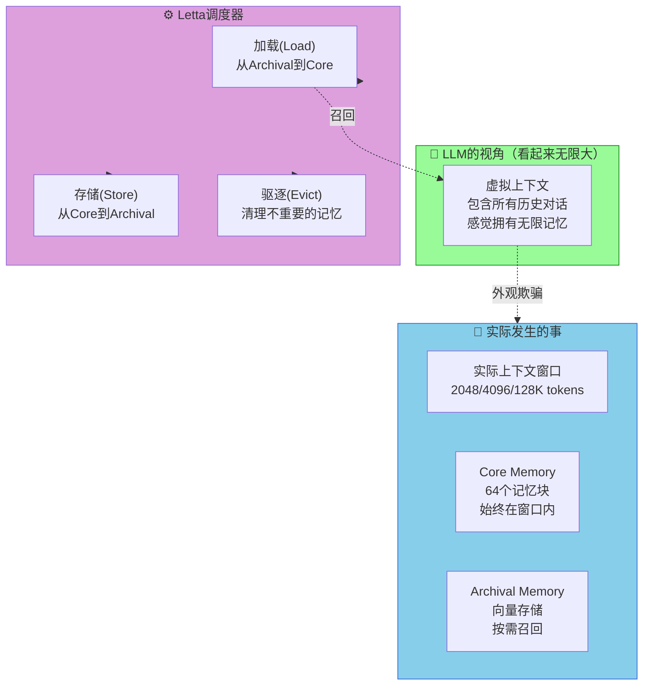

### 7.2 记忆重要性的判断

Letta使用LLM自己来判断记忆的重要性：

```python
def judge_importance(memory_block, context):
    """
    让LLM判断一段记忆是否重要
    """
    prompt = f"""
    评估以下记忆片段的重要性：
    
    记忆: {memory_block.value}
    
    当前对话: {context.summary}
    
    考虑因素:
    - 这段记忆是否影响当前对话的理解？
    - 这是用户反复提到的信息吗？
    - 这是Agent需要长期记住的关键事实吗？
    
    给出0-10的重要性评分和简短理由。
    """
    
    response = llm.generate(prompt)
    score = parse_importance_score(response)
    return score
```

### 7.3 Compaction的触发与执行

```python
class CompactionManager:
    def __init__(self, core_limit_pct=0.8):
        self.core_limit = core_limit_pct
    
    def should_trigger(self, agent_state) -> bool:
        """判断是否需要触发压缩"""
        usage = agent_state.core_memory_usage
        return usage > self.core_limit
    
    def execute(self, agent) -> CompactionResult:
        """执行压缩流程"""
        # 1. 读取所有Core Memory
        core_blocks = agent.get_core_memory()
        
        # 2. 对每个Block评分
        scored_blocks = []
        for block in core_blocks:
            importance = judge_importance(block, agent.current_context)
            scored_blocks.append((block, importance))
        
        # 3. 按重要性排序
        scored_blocks.sort(key=lambda x: x[1], reverse=True)
        
        # 4. 保留最重要的N个块，其余归档
        keep_count = int(len(scored_blocks) * 0.6)  # 保留60%
        
        kept = [b for b, s in scored_blocks[:keep_count]]
        archived = [b for b, s in scored_blocks[keep_count:]]
        
        # 5. 更新记忆
        agent.update_core_memory(kept)
        agent.add_to_archival(archived)
        
        return CompactionResult(kept=kept, archived=archived)
```

## 八、局限性与发展

### 8.1 当前局限

```mermaid
flowchart TB
    subgraph 局限性["⚠️ Letta的局限性"]
        L1["LLM能力依赖<br/>Compaction质量取决于LLM"]
        L2["延迟开销<br/>检索和压缩带来响应延迟"]
        L3["记忆准确性<br/>LLM可能"忘记"重要事实"]
        L4["架构复杂度<br/>比简单Agent框架复杂很多"]
    end
    
    style 局限性 fill:#FFA07A,stroke:#FF6347
```

### 8.2 未来发展方向

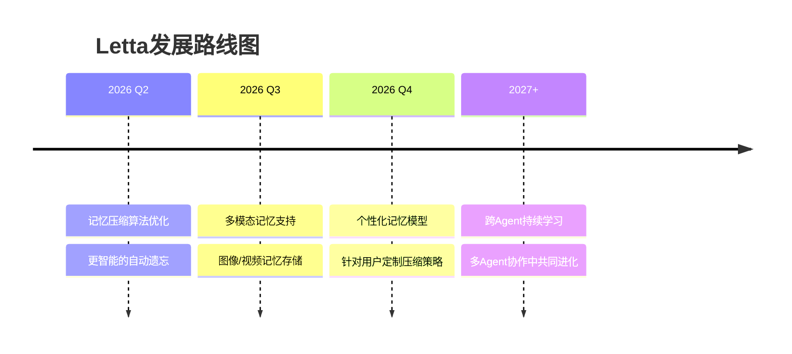

## 九、总结

Letta解决的是一个根本性问题：**LLM的上下文窗口有限，但人类的知识和需求是无限的。**

它的解法——**让Agent像操作系统管理内存一样管理记忆**——看似简单，实际上打开了一扇新的大门：

```text
传统Agent:     每次对话都是新的开始
Letta Agent:   持续演进的生命体
```

**核心洞察**：
- **分层记忆**比单一上下文更接近人类认知
- **主动管理**比被动检索更高效
- **OS思想**给LLM架构带来了新的设计语言

Letta目前仍处于快速发展阶段，它的架构思路正在影响整个Agent设计领域。如果你在构建需要"记住用户"或"持续成长"的AI应用，Letta绝对值得深入研究。

## 参考资料

| 资源 | 链接 |
|------|------|
| **GitHub** | github.com/letta-ai/letta |
| **官网** | letta.com |
| **文档** | docs.letta.com |
| **论文** | arXiv:2310.08560 (MemGPT) |
| **模型排行榜** | leaderboard.letta.com |
| **Discord社区** | discord.gg/letta |

---

*Letta的思想可以用一句话总结：不是让LLM的上下文窗口变大，而是让它学会像我们一样——记住重要的，忘掉不重要的。*

---

## 对比分析

Letta（前 MemGPT）强调"操作系统级"的分层记忆。下面与同样关注长期记忆的两个项目对比：mem0（记忆中间件）和 Hermes Agent（带 Honcho 用户画像的 Agent）。

### 对比维度一：记忆模型
| 维度 | Letta | mem0 | Hermes Agent |
| --- | --- | --- | --- |
| 记忆分层 | core / recall / archival | 用户/会话/Agent | SQLite + FTS5 + Honcho |
| 记忆工具调用 | Agent 主动调用 | 客户端 API | 任务后自动写入 |
| 召回机制 | LLM 工具调用 | 嵌入检索 | FTS5 + LLM 摘要 |
| 是否有 Agent | 是 | 否 | 是 |

### 对比维度二：定位与使用
| 维度 | Letta | mem0 | Hermes Agent |
| --- | --- | --- | --- |
| 适合产品 | 长期 Agent SaaS | LLM 应用加记忆 | 个人/团队 CLI 助手 |
| 学习曲线 | 中偏高 | 低 | 中 |
| 自托管 | Postgres/SQLite | 向量库 | SQLite |
| 与 LLM 应用关系 | Agent 自带记忆 | 中间件嵌入 | CLI 工具 |

### 优缺点
- **Letta**：把"分层记忆"做成 Agent 一等公民；上手门槛高于纯中间件方案。
- **mem0**：作为中间件最易塞进既有 LLM 应用；不做 Agent 业务编排。
- **Hermes Agent**：CLI 体验 + 长期记忆一体化；不适合直接做云端 SaaS。

### 何时选哪个
- 想做一个带记忆的 Agent 产品 → 选 Letta
- 想给现有应用加"用户记忆" → 选 mem0
- 想做"越用越懂你"的本地 CLI 助手 → 选 Hermes Agent

### 参考资料
- Letta 仓库：https://github.com/letta-ai/letta
- mem0 仓库：https://github.com/mem0ai/mem0
- Hermes Agent 仓库：https://github.com/NousResearch/Hermes-Agent
