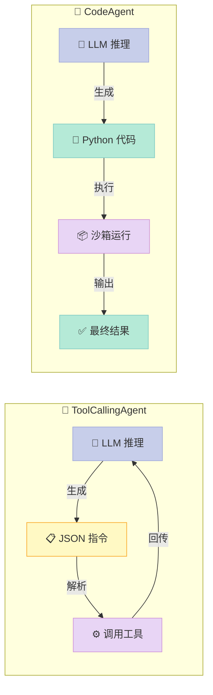

> 📚 **AI Agent 开源框架实战系列**（6/6） | ⬅️ 上一篇：[Agno：极简主义的 AI Agent 框架](/2026/04/17/agno-minimalist-agent-framework/) | 🔗 [配套代码仓库](https://github.com/xuqi2024/ai-agent-tutorials)


## 如果 AI 不是"说"要调用工具，而是直接"写代码"执行，会发生什么？

大多数 AI Agent 框架是这样工作的：LLM 输出一段 JSON，告诉系统"我要调用 search 工具，参数是'北京天气'"，框架解析这个 JSON，再去调用工具，拿到结果，再交回 LLM 继续推理……如此循环。

**但 HuggingFace 的 Smolagents 换了一种玩法**：让 LLM 直接写 Python 代码，然后在沙箱里执行。

这个区别看似不大，实则改变了整个执行模式——LLM 可以在一段代码里同时调用多个工具、写条件判断、做循环，用几行 Python 搞定复杂任务，而不是一次次来回"对话"。

---

## 一、为什么 Smolagents 与众不同？

### 传统 ToolCallingAgent 的瓶颈

标准的工具调用 Agent（包括 LangChain、OpenAI Function Calling）的流程高度固定：

1. LLM 分析任务，输出 JSON 格式的工具调用指令
2. 框架解析 JSON，提取工具名和参数
3. 调用对应工具，拿到结果
4. 把结果塞回给 LLM，继续下一轮推理

**每调用一个工具就要触发一次 LLM 推理**，调用链越长、耗时越久、成本越高。

### CodeAgent 的突破口

Smolagents 的 `CodeAgent` 让 LLM 输出的不是 JSON，而是**完整的 Python 代码片段**：

```python
# LLM 生成的代码（在沙箱内一次性执行）
word_count = get_word_count(text="今天天气真好")
summary = summarize_list(items=["苹果", "香蕉", "橘子"])
result = format_as_markdown(title="统计报告", content=f"字数：{word_count}，摘要：{summary}")
print(result)
```

一次推理，三个工具，一气呵成。**这是 CodeAgent 的核心竞争力**。

另一个亮点：Smolagents 原生支持 HuggingFace Hub 上的开源模型，不需要 OpenAI API Key，真正做到零成本起步。

---

## 二、核心概念，用人话解释

### 🤖 CodeAgent（代码智能体）

把它想象成一个**程序员助手**：你告诉它任务，它不口头说"我要搜索、我要计算"，而是直接写一段 Python 代码，丢进沙箱执行，然后给你结果。

核心特点：执行力强，适合多步骤、需要组合多个工具的复杂任务。

### 🔧 ToolCallingAgent（工具调用智能体）

更像一个**按流程办事的执行员**：每次只做一件事，走完一步再走下一步。逻辑清晰，适合简单线性任务，调试也更方便。

### 🏷️ @tool 装饰器

这是向 Agent 注册工具的方式，就像给 AI 发一本**技能手册**。**关键在于 `docstring`**——Agent 完全靠它来理解这个工具的用途和参数。

docstring 写得差，Agent 就不知道该怎么调用你的工具，这是初学者最常踩的坑（后面详讲）。

### 🌐 LiteLLMModel

相当于一个**万能遥控器**，帮你接入几乎所有主流 LLM：OpenAI、Anthropic Claude、HuggingFace Hub 开源模型，切换只需改一行配置。

---

## 三、它是怎么工作的？

下图对比了两种 Agent 模式的完整执行流程：



**关键差别**：ToolCallingAgent 每调用一个工具就要绕回 LLM 再推理一次；CodeAgent 的 LLM 一次出手，代码在沙箱里把所有工具都调完，效率更高，推理成本更低。

---

## 四、5 分钟上手：完整可运行代码

> 配套仓库：[https://github.com/xuqi2024/ai-agent-tutorials](https://github.com/xuqi2024/ai-agent-tutorials)
> 对应文件：`06-smolagents/01_code_agent.py`

### 第一步：安装依赖

```bash
pip install smolagents litellm
```

### 第二步：定义工具（@tool + 规范 docstring）

```python
from smolagents import tool, CodeAgent, ToolCallingAgent, LiteLLMModel

@tool
def get_word_count(text: str) -> int:
    """计算中文文本的字数（按字符数统计）。

    Args:
        text: 需要统计字数的中文文本。

    Returns:
        文本的字符数量（整数）。
    """
    return len(text)

@tool
def format_as_markdown(title: str, content: str) -> str:
    """将标题和内容格式化为 Markdown 格式的字符串。

    Args:
        title: 文档标题。
        content: 文档正文内容。

    Returns:
        格式化后的 Markdown 字符串。
    """
    return f"# {title}\n\n{content}"

@tool
def summarize_list(items: list) -> str:
    """将列表中的元素整理为简洁的摘要句子。

    Args:
        items: 需要摘要的字符串列表。

    Returns:
        以顿号分隔的摘要字符串。
    """
    return "、".join(str(item) for item in items)
```

**注意 docstring 格式**：`Args:` 列出每个参数名和说明，`Returns:` 说明返回值类型和含义，这两个段落缺一不可。Smolagents 会把 docstring 原封不动地作为工具描述传给 LLM。

### 第三步：运行 CodeAgent

```python
model = LiteLLMModel(model_id="gpt-4o-mini")

agent = CodeAgent(
    tools=[get_word_count, format_as_markdown, summarize_list],
    model=model,
)

result = agent.run(
    "统计'人工智能改变世界'的字数，"
    "再把['深度学习','强化学习','大语言模型']整理成摘要，"
    "最后生成一份 Markdown 报告。"
)
print(result)
```

**一句话任务，三个工具，Agent 自动编排执行**——CodeAgent 会生成类似上面第一节展示的那段 Python，然后在沙箱中一次跑完。

### 第四步：对比 ToolCallingAgent（可选）

```python
# 把 CodeAgent 换成 ToolCallingAgent，工具定义完全不用改
agent_tc = ToolCallingAgent(
    tools=[get_word_count, format_as_markdown, summarize_list],
    model=model,
)
result_tc = agent_tc.run("统计'人工智能改变世界'的字数并生成报告。")
```

两者接口完全一致，切换成本接近零，方便你对比效果和调试过程。

---

## 五、常见误区（踩坑指南）

### ❌ 误区一：docstring 写得太随意

```python
# 错误写法：缺少 Args/Returns
@tool
def my_tool(text: str) -> str:
    """处理文本"""  # ← Agent 根本不知道参数干什么用
    return text.upper()
```

**后果**：Agent 调用工具时不知道该传什么参数，轻则报错，重则乱传参数导致结果错误。**正确做法是始终写完整的 `Args:` 和 `Returns:` 段落**，像 Google 风格的 docstring 那样规范。

### ❌ 误区二：生产环境忽视沙箱安全

CodeAgent 让 LLM 写代码并执行，**如果沙箱配置不当，错误或恶意代码可能操作本地文件系统甚至网络**。

生产环境建议：
- 使用 Docker 容器或 E2B 云沙箱隔离执行环境
- 限制代码可访问的文件路径和网络出口
- 设置代码执行的超时时间上限

---

## 六、横向对比：Smolagents vs LangChain vs Agno

| 维度 | Smolagents | LangChain | Agno |
|------|-----------|-----------|------|
| 核心创新 | ✅ LLM 写代码执行 | ⚠️ JSON 工具调用 | ⚠️ 多 Agent 协作 |
| 开源模型支持 | ✅ HuggingFace Hub 原生 | ⚠️ 需额外配置 | ⚠️ 有限支持 |
| 代码执行能力 | ✅ 内置沙箱 | ❌ 需插件扩展 | ❌ 不内置 |
| 工具定义难度 | ✅ 简单（@tool + docstring） | ⚠️ 中等复杂度 | ✅ 相对简单 |
| 适合场景 | 多步骤复杂任务 | 企业级复杂流程 | 多 Agent 协同 |
| 学习曲线 | ✅ 低（代码量极少） | ❌ 高（概念繁多） | ⚠️ 中等 |

Smolagents 的定位很清晰：**小而美，轻量启动，代码执行是杀手锏**。它不是要替代 LangChain，而是提供一个更轻的起点——尤其适合想用开源模型、快速验证 Agent 想法的开发者。

---

## 七、下一步怎么学？

**第一步**：克隆配套仓库，运行示例，感受 CodeAgent 一次性调用三个工具的流程。

```bash
git clone https://github.com/xuqi2024/ai-agent-tutorials
cd ai-agent-tutorials/06-smolagents
pip install -r requirements.txt
python 01_code_agent.py
```

**第二步**：探索 HuggingFace Hub 工具生态。Smolagents 支持直接从 Hub 加载社区贡献的工具，不需要自己造轮子：

```python
from smolagents import load_tool

# 从 Hub 加载文生图工具
image_tool = load_tool("m-ric/text-to-image")
```

**第三步**：阅读 [Smolagents 官方文档](https://huggingface.co/docs/smolagents)，重点看 `MultiStepAgent` 的执行日志调试方法，以及如何接入 E2B 云端沙箱做生产级隔离。

---

> **我的建议**：如果你已经会 Python 基础，跑通第一个 CodeAgent 只需要 10 分钟；如果目标是生产部署，就把精力放在沙箱安全和 docstring 质量上，这两点决定了 Agent 能否稳定工作。**Smolagents 代码量极少，是理解 Agent 工作原理的最佳入门框架——先跑起来，再深入理解，别在环境配置上卡太久。**
