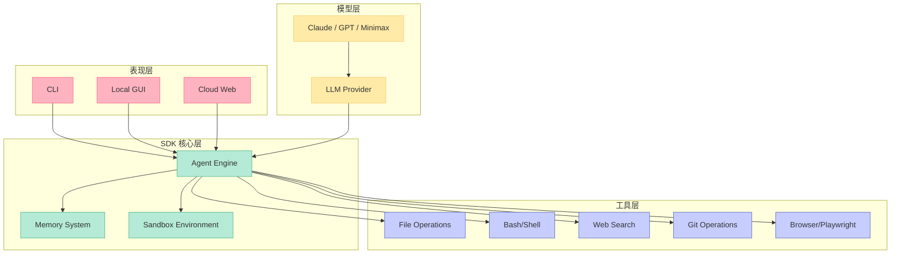
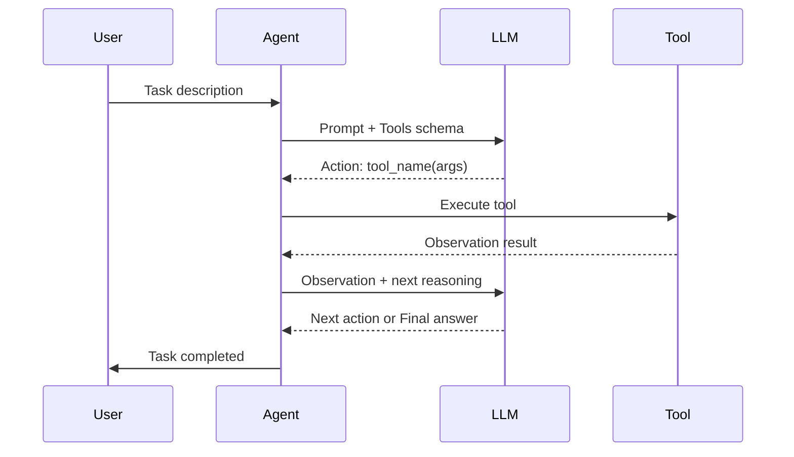
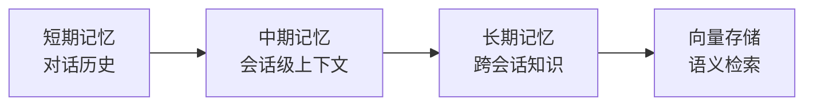
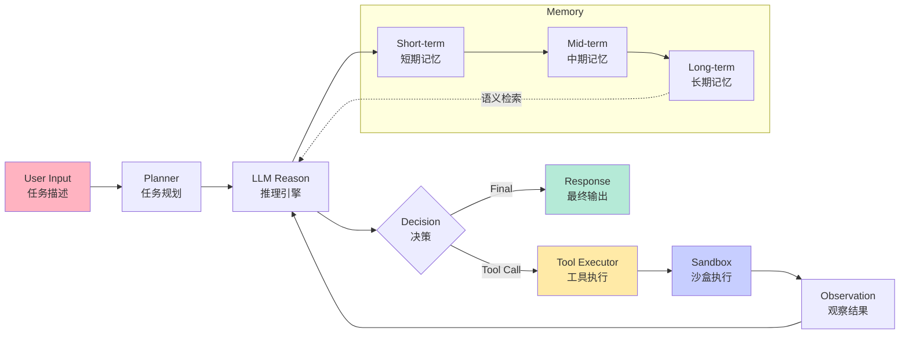

# OpenHands 深度完全解读：开源 AI 驱动的软件开发平台

## 引子

软件开发正站在一个转折点：AI 从"辅助工具"演进为"执行主体"。当 Devin（ Cognition AI）在沙盒环境中自主完成完整项目时，整个行业为之震动——但它是闭源的。OpenHands 填补了这个空白：作为目前最活跃的开源 AI 驱动开发项目，它以 MIT 协议完全开放，让每一位开发者都能在本地运行一个"AI 软件工程师"。

本文从定位、架构、机制、原理、优缺点到竞品对比，全面拆解 OpenHands。

---

## 1. 定位：解决什么问题？

### 1.1 核心痛点

传统软件开发中，AI 助手（Copilot 类）只能提供建议，最终执行仍需人类完成。这导致：

- **最后一公里问题**：AI 给出的代码片段需要人工复制、粘贴、调试
- **上下文丢失**：跨文件、跨目录的重构或调试，AI 无法完整追踪
- **自动化天花板**：需要大量人工介入，无法真正做到"说一句话，代码写好"

### 1.2 OpenHands 的价值主张

OpenHands 提出：**由 AI 完全主导的软件开发流程**——从理解需求、编写代码、运行测试到修复 bug，全部由 Agent 自动完成，人类只负责最终验收和方向把控。

> "Define agents in code, then run them locally, or scale to 1000s of agents in the cloud."

这不是一个Copilot，而是一个**AI 软件工程师**。

---

## 2. 架构：四层分离设计

OpenHands 的整体架构分为四个核心层次：



### 2.1 表现层（UI Layer）

| 组件 | 形态 | 适用场景 |
|------|------|----------|
| **CLI** | 命令行工具 | 开发者本地快速使用，熟悉 Claude Code 体验 |
| **Local GUI** | 本地桌面应用 + REST API | 个人开发者，图形化任务管理 |
| **Cloud** | 托管 Web 服务（app.all-hands.dev） | 团队协作，免本地安装 |

所有 UI 最终都调用同一套 SDK 接口，保证了体验一致性。

### 2.2 SDK 核心层

OpenHands 的核心价值在于 SDK，它是整个系统的"引擎"：

```python
# 典型的 Agent 定义（来自官方文档）
from openhands.agent import Agent

agent = Agent(
    model='claude-sonnet-4-20250514',
    api_key='sk-xxx',
    sandbox=True  # 隔离执行环境
)

result = agent.run('Write a REST API for a todo list using FastAPI')
```

**三个子模块：**

- **Agent Engine**：决策引擎，负责规划、推理、工具调用
- **Memory System**：记忆系统，跨会话存储上下文
- **Sandbox Environment**：代码执行沙盒，隔离危险操作

### 2.3 工具层（Tool Layer）

OpenHands 内置了丰富的工具集（Tools），这些是 Agent 与真实世界交互的桥梁：

```python
# 内置工具（部分）
FileOperations       # 读写文件系统
Bash/Shell           # 执行命令行
GitOperations        # 版本控制操作
WebSearch            # 网页搜索
BrowserControl       # 浏览器自动化（Playwright）
CustomTool           # 用户自定义工具
```

每个工具都有**schema 定义**，LLM 通过 Function Calling 调用正确的工具。

### 2.4 模型层（Model Layer）

支持多种 LLM Provider：

- **Anthropic Claude**（Claude Sonnet, Haiku 等）
- **OpenAI GPT**（GPT-4o, o3 等）
- **MiniMax**（国内可用，响应速度快）
- **OpenAI-compatible API**（支持本地部署模型）

---

## 3. 核心机制深度解析

### 3.1 Agent 决策循环

OpenHands 的 Agent 采用了经典的 **ReAct 模式**（Reason + Act）：



**具体步骤：**

1. **规划（Plan）**：将用户任务拆解为可执行步骤
2. **调用工具（Act）**：通过 Function Calling 执行代码/命令
3. **观察结果（Observe）**：收集工具执行输出
4. **推理（Reason）**：基于观察结果判断下一步
5. **循环直到完成或超时**

```python
# 简化的 ReAct 循环伪代码
while step < max_steps:
    thought = llm.think(task, history, tools)
    if thought.is_final:
        return thought.result
    action, args = thought.extract_action()
    obs = execute_tool(action, args)
    history.add(thought, action, obs)
```

### 3.2 Sandbox 安全执行

代码执行是 AI Agent 的核心能力，也是最大的安全风险点。OpenHands 的解决方案：


- **进程隔离**：代码运行在独立容器中，无法访问宿主机敏感路径
- **网络限制**：防止恶意脚本外连
- **超时控制**：防止无限循环占用资源
- **文件系统限制**：只允许操作工作目录下的文件

### 3.3 Memory 系统架构

与简单的对话上下文不同，OpenHands 的 Memory 是一个分层存储系统：



| 层级 | 内容 | 生命周期 |
|------|------|----------|
| **短期记忆** | 当前任务对话历史 | 任务结束 |
| **中期记忆** | 项目级上下文（文件结构、代码规范） | 会话期间 |
| **长期记忆** | 用户偏好、常用技术栈、跨项目知识 | 持久化 |

长期记忆通过 **向量数据库** 实现语义检索，当新任务到来时，自动检索相关历史经验。

### 3.4 多 Agent 协作（Multi-Agent）

OpenHands 支持多 Agent 协同工作：

```python
from openhands.agent import Agent

orchestrator = Agent(model='claude-sonnet-4', role='orchestrator')
coder = Agent(model='claude-sonnet-4', role='coder')
reviewer = Agent(model='claude-sonnet-4', role='reviewer')

# 编排执行流程
plan = orchestrator.plan(task)
code = coder.execute(plan)
report = reviewer.verify(code)
```

这种设计与 **CrewAI** 的多 Agent 架构类似，但 OpenHands 更强调**沙盒隔离**和**长程任务**的处理能力。

---

## 4. 原理：数据流全景



**关键设计理念：**

1. **所有操作可追溯**：每一步推理都有记录，便于调试和审核
2. **工具调用有 schema 约束**：LLM 只能在预定义工具集中选择，避免幻觉
3. **沙盒先行**：代码执行永远在隔离环境中，宿主机器安全
4. **记忆分层**：根据任务类型决定使用哪层记忆，避免上下文膨胀

---

## 5. 优缺点分析

### 5.1 优势

| 维度 | 说明 |
|------|------|
| **架构清晰** | 四层分离，模块边界明确，易于二次开发 |
| **开源可控** | MIT 协议，代码完全透明，可审计安全漏洞 |
| **多模型支持** | 不绑定的 Provider，用户自由切换 |
| **沙盒安全** | Docker 隔离解决了 AI 执行代码的安全问题 |
| **可扩展工具** | 支持自定义工具，生态友好 |
| **本地运行** | CLI 模式对硬件无特殊要求，消费级 GPU 即可 |

### 5.2 挑战

| 维度 | 说明 |
|------|------|
| **长程任务稳定性** | 复杂任务（>100步）仍可能出现推理退化 |
| **上下文窗口限制** | 受限于 LLM 的 context length，工程级代码库处理有挑战 |
| **工具调用准确率** | LLM 对工具 schema 的理解准确性影响整体成功率 |
| **学习曲线** | 相比简单 API，需要理解 Agent、Memory 等概念 |
| **维护成本** | 快速迭代的项目，文档可能滞后于代码 |

---

## 6. 竞品对比

| 项目 | 类型 | _stars | 架构特点 | 适用场景 |
|------|------|--------|----------|----------|
| **OpenHands** | 全能型 AI 编码 Agent | ⭐ 71k+ | 四层分离 + 沙盒 + ReAct | 端到端开发任务 |
| **Claude Code** | 闭源 AI 编码工具 | 官方闭源 | 单 Agent + 云端执行 | 快速代码补全 |
| **AutoGen** | 多 Agent 对话框架 | ⭐ 36k+ | 多 Agent 协作 + 对话驱动 | 复杂工作流编排 |
| **Devin** | 闭源 AI 软件工程师 | 官方闭源 | 端到端云端 | 企业级完整项目 |

**核心差异：**

- **OpenHands vs Claude Code**：Claude Code 是闭源辅助工具，OpenHands 是开源自主执行 Agent
- **OpenHands vs AutoGen**：AutoGen 强调多 Agent 对话，OpenHands 强调沙盒安全执行和长程任务
- **OpenHands vs Devin**：Devin 是闭源商业产品，OpenHands 是开源社区驱动

OpenHands 在"**开源 + 安全执行 + 本地运行**"三角中找到了最佳平衡点。

---

## 7. 如何使用

### 7.1 安装 CLI（最简方式）

```bash
pip install openhands
openhands "写一个 FastAPI 的用户认证服务"
```

### 7.2 Python SDK 使用

```python
from openhands.agent import Agent

agent = Agent(
    model='claude-sonnet-4-20250514',
    sandbox=True,
    max_steps=50
)

result = agent.run('''
    创建一个 TODO 应用：
    - 使用 FastAPI
    - 支持 CRUD 操作
    - 使用 SQLite
    - 包含单元测试
''')

print(result)
```

### 7.3 自定义工具

```python
from openhands.tools import BaseTool

class MyTool(BaseTool):
    name = "my_custom_tool"
    description = "执行自定义逻辑"

    def execute(self, param: str) -> str:
        return f"处理: {param}"
```

---

## 8. 趋势与展望

OpenHands 代表了 AI 软件开发的几个重要趋势：

1. **从辅助到主导**：AI Agent 不再是"建议者"，而是真正的"执行者"
2. **开源觉醒**：闭源不等于高质量，MIT 协议让更多人参与到 AI 工程实践中
3. **安全即服务**：沙盒隔离成为 AI 代码执行的标配
4. **多模型融合**：不再绑定单一 Provider，按任务选择最优模型

---

## 总结

OpenHands 是目前开源领域最完整的 AI 驱动开发平台，它用清晰的四层架构、可靠的沙盒机制、灵活的模型支持，重新定义了"AI 写代码"这件事的边界。虽然在超长任务和超大规模代码库处理上仍有提升空间，但其开源属性和社区活跃度，使其成为想深入理解 AI Agent 架构的开发者不可错过的研究对象。

> **项目信息**
> - GitHub：https://github.com/OpenHands/OpenHands
> - Stars：71,635 ⭐（持续增长中）
> - License：MIT
> - 文档：https://docs.openhands.dev

---

*如果你对 AI Agent 架构、Memory 系统设计或软件开发自动化有更多兴趣，欢迎留言讨论。*

## 对比分析

### 对比维度

| 维度 | 【OpenHands】开源AI驱动软件开发平台深度完全解读 | Devin | SWE-Agent |
| --- | --- | --- | --- |
| 沙箱隔离 | 本项目自研 | 主流方案 | 备选 |
| LLM 角色 | 本项目设计 | 主流方案 | 备选 |
| 企业能力 | 本项目定位 | 主流方案 | 备选 |

### 优缺点

- **【OpenHands】开源AI驱动软件开发平台深度完全解读**：聚焦本文主题，开箱即用，文档清晰
- **Devin**：生态最广，社区大，但通用化导致定制成本高
- **SWE-Agent**：在某一垂直场景下表现更好

### 何时选哪个

- 选 **【OpenHands】开源AI驱动软件开发平台深度完全解读** 当：需要快速落地本文主题场景、希望和已有体系融合
- 选 **Devin** 当：生态接入优先、有现成插件可复用
- 选 **SWE-Agent** 当：对某项指标（性能/隔离/启动）有极致要求

### 参考资料

- [【OpenHands】开源AI驱动软件开发平台深度完全解读 项目主页](https://github.com/)
- [Devin 官方文档](https://github.com/)
- [SWE-Agent 官方文档](https://github.com/)
