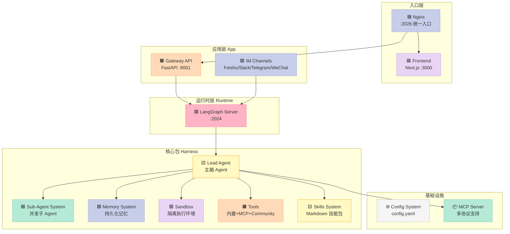
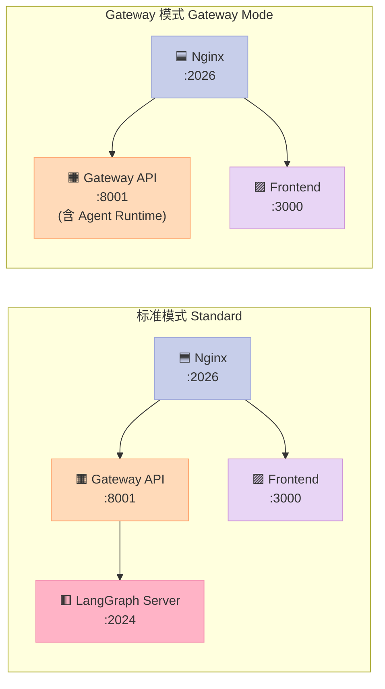
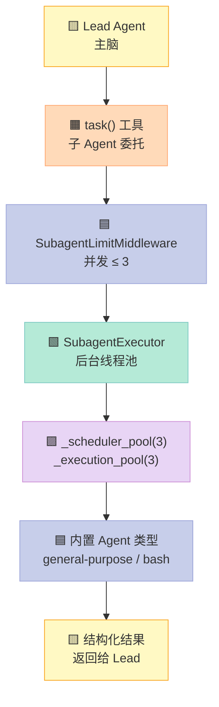
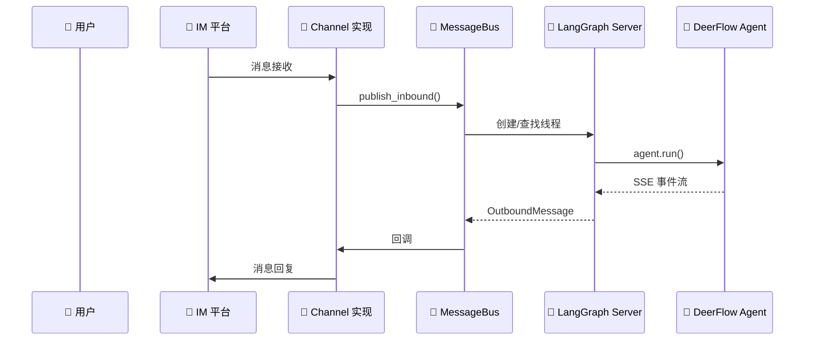

> 大多数 Agent 框架给开发者一副牌，但牌桌要自己搭。DeerFlow 2.0 说：不，你需要一个"全包拎包入住"的 Agent 工作台。

---

## 一、引子：为什么需要 Super Agent Harness

传统的 AI Agent 开发范式是这样的：你选择一个 Agent 框架（LangGraph、AutoGPT、CrewAI），然后开始痛苦地"粘合"各种组件——

- **Memory 怎么持久化？**  自己接向量库、自己写读写逻辑。
- **Sandbox 怎么隔离？**  手动开容器、处理超时、挂载路径。
- **Sub-Agent 怎么编排？**  自己设计通信协议、自己管理并发。
- **IM 渠道怎么接入？**  写 Webhook、处理回调、对接平台 API。

每个组件都能做，但拼在一起就变成了"框架之上的框架"。DeerFlow 2.0 正是看到了这个痛点，定位为 **Super Agent Harness**——一个"开箱即用、功能完备、可拆解替换"的 Agent 运行时底座。

**🦌 DeerFlow**（Deep Exploration and Efficient Research Flow）是字节跳动开源的超级 Agent 马具系统，核心能力一句话：**给 Agent 配上记忆、工具、隔离执行环境和子 Agent 委托能力，让 AI 真正"动手做事"而不是"动嘴皮子"。**

截至 2026 年 4 月，GitHub Star 突破 **63k**，Forks 超过 **8.2k**，2026 年 2 月 28 日冲到 GitHub Trending 第一名。

---

## 二、项目定位与解决的问题

### 2.1 解决的核心问题

| 痛点 | 传统方案 | DeerFlow 方案 |
|------|---------|--------------|
| Memory 持久化 | 自建向量库 + RAG | 内置分层 Memory，跨会话持久化 |
| 执行隔离 | 直接在宿主机跑 bash | Docker/Local Sandbox 隔离 |
| 工具扩展 | 硬编码函数注册 | MCP Server + Skill 系统热插拔 |
| 子 Agent 协作 | 自己实现调度 | Lead Agent → Sub-Agent 委托机制 |
| IM 渠道接入 | 各自实现 | 内置 Feishu/Slack/Telegram/WeChat 接入 |
| 长任务上下文 | 手写压缩逻辑 | SummarizationMiddleware 自动压缩 |

### 2.2 技术定位

DeerFlow 不是又一个"Agent 框架"，而是一个**基于 LangGraph 和 LangChain 的生产级 Agent 运行时**。它站在巨人的肩膀上，把粘合工作做到极致，让开发者专注于业务逻辑而不是基础设施。

---

## 三、整体架构

### 3.1 系统分层架构



### 3.2 双模式架构：标准模式 vs Gateway 模式

DeerFlow 2.0 引入了独特的**双运行时模式**：



| 对比维度 | 标准模式 | Gateway 模式 |
|---------|---------|------------|
| 进程数 | 4（前端+网关+LangGraph+Nginx） | 3（前端+网关+Nginx） |
| Agent 执行 | 独立 LangGraph Server | 嵌入 Gateway 内 |
| 并发管理 | `--n-jobs-per-worker` | `--workers` × 异步任务 |
| 冷启动 | 较慢（两个服务） | 较快 |
| LangGraph Platform 许可 | 生产镜像需要 | 不需要 |
| 资源占用 | 较高 | 较低 |

Gateway 模式是实验性特性，但已经可以看出 DeerFlow 在**进程裁剪**和**资源优化**上的努力。

---

## 四、核心组件深度解析

### 4.1 Lead Agent：主脑 Agent

Lead Agent 是 DeerFlow 的核心决策者，基于 LangGraph 实现。其核心逻辑通过 `make_lead_agent(config)` 工厂函数创建：

```python
# 简化逻辑
lead_agent = make_lead_agent(config=RunnableConfig)

# 内部流程
# 1. create_chat_model() → 选择 LLM（支持 thinking/vision）
# 2. get_available_tools() → 聚合所有工具
# 3. apply_prompt_template() → 注入 Skills + Memory + Subagent 指令
# 4. 组装 Middleware Chain → 18 个中间件按序执行
```

**ThreadState** 是 Lead Agent 的状态载体，比标准 `AgentState` 多了：

- `sandbox` / `thread_data` — 隔离执行上下文
- `title` — 线程标题
- `artifacts` — 输出物（去重归并）
- `todos` — 任务清单
- `uploaded_files` / `viewed_images` — 上传/查看媒体

### 4.2 18 个中间件链：DeerFlow 的魔法所在

DeerFlow 在 LangGraph 的 Agent Runtime 上叠加了**18 个中间件**，形成一条精密的处理链。理解这条链，就理解了 DeerFlow 的精髓：

```mermaid
flowchart TD
    Input["🟦 用户输入"]
    M1["🔧 ThreadDataMiddleware<br/>创建线程目录"]
    M2["📎 UploadsMiddleware<br/>注入上传文件"]
    M3["🧊 SandboxMiddleware<br/>获取隔离环境"]
    M4["🔗 DanglingToolCallMiddleware<br/>补全中断的工具调用"]
    M5["⚠️ LLMErrorHandlingMiddleware<br/>LLM 错误标准化"]
    M6["🛡️ GuardrailMiddleware<br/>工具调用授权"]
    M7["📋 SandboxAuditMiddleware<br/>沙箱操作审计"]
    M8["🔧 ToolErrorHandlingMiddleware<br/>工具异常转错误消息"]
    M9["📝 SummarizationMiddleware<br/>上下文压缩"]
    M10["✅ TodoListMiddleware<br/>任务清单跟踪"]
    M11["📊 TokenUsageMiddleware<br/>Token 计量"]
    M12["🏷️ TitleMiddleware<br/>生成线程标题"]
    M13["🧠 MemoryMiddleware<br/>异步记忆更新"]
    M14["🖼️ ViewImageMiddleware<br/>图像数据注入"]
    M15["🔍 DeferredToolFilterMiddleware<br/>隐藏延迟工具"]
    M16["⚡ SubagentLimitMiddleware<br/>子 Agent 并发限制"]
    M17["🔄 LoopDetectionMiddleware<br/>循环检测"]
    M18["❓ ClarificationMiddleware<br/>澄清请求拦截"]
    Output["🟧 Agent 输出"]

    Input --> M1 --> M2 --> M3 --> M4 --> M5 --> M6 --> M7 --> M8 --> M9 --> M10 --> M11 --> M12 --> M13 --> M14 --> M15 --> M16 --> M17 --> M18 --> Output

    style Input fill:#C7CEEA,stroke:#9FA8DA,color:#333
    style M1 fill:#FFF9C4,stroke:#F9A825,color:#333
    style M2 fill:#FFF9C4,stroke:#F9A825,color:#333
    style M3 fill:#E8D5F5,stroke:#CE93D8,color:#333
    style M4 fill:#FFDAB9,stroke:#FFAB76,color:#333
    style M5 fill:#FFB3C6,stroke:#F48FB1,color:#333
    style M6 fill:#B5EAD7,stroke:#80CBC4,color:#333
    style M7 fill:#E8D5F5,stroke:#CE93D8,color:#333
    style M8 fill:#FFDAB9,stroke:#FFAB76,color:#333
    style M9 fill:#FFF9C4,stroke:#F9A825,color:#333
    style M10 fill:#B5EAD7,stroke:#80CBC4,color:#333
    style M11 fill:#C7CEEA,stroke:#9FA8DA,color:#333
    style M12 fill:#FFF9C4,stroke:#F9A825,color:#333
    style M13 fill:#E8D5F5,stroke:#CE93D8,color:#333
    style M14 fill:#FFDAB9,stroke:#FFAB76,color:#333
    style M15 fill:#B5EAD7,stroke:#80CBC4,color:#333
    style M16 fill:#FFB3C6,stroke:#F48FB1,color:#333
    style M17 fill:#FFB3C6,stroke:#F48FB1,color:#333
    style M18 fill:#B5EAD7,stroke:#80CBC4,color:#333
    style Output fill:#FFDAB9,stroke:#FFAB76,color:#333
```



**几个值得重点关注的中间件：**

- **GuardrailMiddleware**：前置拦截器，可在工具执行前做自定义策略判断（支持内置白名单、OAP 策略、或自定义 `GuardrailProvider`）
- **SandboxAuditMiddleware**：在沙箱操作执行前做安全审计日志
- **DanglingToolCallMiddleware**：处理用户中断时的"悬空"工具调用——这是生产环境中一个极其常见但多数框架忽略的问题
- **ClarificationMiddleware**：捕获 `ask_clarification` 工具调用，直接通过 `Command(goto=END)` 中断对话让用户澄清

### 4.3 Sub-Agent 委托系统

DeerFlow 的 Sub-Agent 不是简单的事件驱动，而是**完整的并发任务系统**：



**关键机制：**
- Lead Agent 调用 `task()` 工具，传入 `description`、`prompt`、`subagent_type`、`max_turns`
- `SubagentLimitMiddleware` 截断超额请求，确保并发 ≤ 3
- 每个子 Agent 有**独立隔离上下文**，看不到主 Agent 或其他子 Agent 的中间状态
- 结果通过 SSE 事件流回传：`task_started` → `task_running` → `task_completed/failed/timed_out`
- 超时时间 **15 分钟**，远长于普通 Agent 的单轮超时

### 4.4 Memory System：跨会话持久化记忆

DeerFlow 的 Memory 不是 RAG 向量检索，而是一套**分层记忆系统**：

```mermaid
flowchart TD
    subgraph "记忆写入"
        Messages["💬 对话消息<br/>用户+AI 响应"]
        MM["🧠 MemoryMiddleware<br/>过滤+入队"]
        Queue["📋 DebouncedQueue<br/>30s 防抖+线程去重"]
        Updater["⚙️ MemoryUpdater<br/>LLM 提取事实"]
        Facts["📝 Facts 去重写入<br/>confidence ≥ 0.7"]
        MemoryFile["💾 memory.json<br/>原子写入"]
    end

    subgraph "记忆读取"
        Read["📖 下次对话"]
        Inject["💉 注入 Top 15 Facts<br/>+ 上下文摘要"]
        Prompt["🟨 System Prompt<br/>&lt;memory&gt; 标签"]
    end

    Messages --> MM --> Queue --> Updater --> Facts --> MemoryFile
    Read --> Inject --> Prompt

    style Messages fill:#C7CEEA,stroke:#9FA8DA,color:#333
    style MM fill:#E8D5F5,stroke:#CE93D8,color:#333
    style Queue fill:#FFDAB9,stroke:#FFAB76,color:#333
    style Updater fill:#FFF9C4,stroke:#F9A825,color:#333
    style Facts fill:#B5EAD7,stroke:#80CBC4,color:#333
    style MemoryFile fill:#C7CEEA,stroke:#9FA8DA,color:#333
    style Read fill:#C7CEEA,stroke:#9FA8DA,color:#333
    style Inject fill:#E8D5F5,stroke:#CE93D8,color:#333
    style Prompt fill:#FFF9C4,stroke:#F9A825,color:#333
```



**数据结构**（存储在 `backend/.deer-flow/memory.json`）：

```
User Context:
  - workContext        工作背景
  - personalContext    个人偏好
  - topOfMind          当前最在意的事

History:
  - recentMonths       近况摘要
  - earlierContext     早期背景
  - longTermBackground 长期记忆

Facts:
  - id / content / category   (preference/knowledge/context/behavior/goal)
  - confidence (0-1)
  - source / createdAt
```

这种设计比向量检索更**可解释**、更**结构化**，适合存储用户偏好和行为模式。

### 4.5 Sandbox 隔离执行环境

DeerFlow 不只是"给 Agent 开放 bash 权限"，而是提供了**完整的虚拟文件系统**：

```
Agent 视角（虚拟路径）:
/mnt/user-data/
├── uploads/      ← 用户上传文件
├── workspace/    ← Agent 工作目录
└── outputs/      ← 最终产出物

/mnt/skills/public   ← 内置技能
/mnt/skills/custom    ← 自定义技能
```

**三种 Sandbox 模式：**

| 模式 | 隔离性 | 执行位置 | 适用场景 |
|------|-------|---------|---------|
| Local | 无真正隔离 | 宿主机 | 完全可信的本地开发 |
| Docker | 容器级隔离 | Docker 容器 | 推荐的生产模式 |
| Kubernetes | Pod 级隔离 | K8s Pod | 大规模多租户部署 |

虚拟路径到物理路径的映射由 `replace_virtual_path()` 函数处理，Agent 完全感知不到底层差异。

### 4.6 Skills 系统：Markdown 格式的技能包

DeerFlow 的 Skills 不是代码插件，而是一套**用 Markdown 封装的技能工作流**：

```
skills/public/
├── research/SKILL.md           # 研究技能
├── report-generation/SKILL.md  # 报告生成
├── slide-creation/SKILL.md    # PPT 生成
├── web-page/SKILL.md          # 网页生成
└── image-generation/SKILL.md  # 图像生成

skills/custom/
└── your-custom-skill/SKILL.md  # 用户自定义
```

SKILL.md 包含工作流定义、最佳实践和资源引用。DeerFlow 按需加载——只有任务需要时才注入对应 Skill 内容，避免 Context 膨胀。

### 4.7 IM Channels：让 Agent 跑在即时通讯里

DeerFlow 罕见地在 Agent 框架中内置了**多 IM 平台接入**：



支持平台：Telegram、Slack、飞书（Feishu/Lark）、微信（WeChat）、企业微信（Wecom）。所有渠道共享同一个 Agent 运行时，但可以通过 `assistant_id` 为不同平台配置不同的 Agent。

---

## 五、优缺点分析

### 5.1 优点

| 维度 | 说明 |
|------|------|
| **功能完备性** | 开箱即用，Memory/Sandbox/Sub-Agent/IM 渠道全部内置，无需自行粘合 |
| **Harness/App 分层** | Harness 包（`deerflow-harness`）可独立发布，App 层仅负责 HTTP 接入和 IM 渠道，边界清晰 |
| **中间件设计** | 18 个中间件各司其职，扩展点明确，调试友好 |
| **双运行时模式** | Gateway 模式省去了 LangGraph Server 进程，资源利用率更高 |
| **Context 管理** | SummarizationMiddleware + Memory 去重 + 隔离子 Agent 上下文，三重保障防止 Context 膨胀 |
| **多 IM 渠道** | 生产级 IM 接入，无需额外开发 |

### 5.2 缺点与局限性

| 维度 | 说明 |
|------|------|
| **复杂度较高** | 18 个中间件 + 多进程架构，学习曲线陡峭 |
| **LangGraph 强依赖** | 核心建立在 LangGraph 之上，若 LangGraph API 变更存在维护风险 |
| **沙箱性能开销** | Docker 容器启动有冷启动延迟，不适合超低延迟场景 |
| **国内生态** | 默认 Tavily 搜索、飞书/微信渠道在国内访问受限，需要额外配置 |
| **Gateway 模式实验性** | 双模式中 Gateway 模式仍为实验特性，生产使用需评估 |
| **记忆系统局限** | Memory 基于 JSON 文件存储，不适合大规模多用户场景 |

---

## 六、横向对比

### 6.1 DeerFlow vs CrewAI

| 维度 | DeerFlow | CrewAI |
|------|---------|--------|
| **架构定位** | Super Agent Harness | Multi-Agent 编排框架 |
| **Memory** | 内置分层持久化 Memory | 需自行集成 |
| **Sandbox** | 内置 Docker/Local 隔离 | 无内置 |
| **Sub-Agent** | 并发委托（3 并发，15min 超时） | Agent → Sub-Agent |
| **IM 渠道** | 内置 5 大 IM 平台 | 无内置 |
| **中间件链** | 18 个精细中间件 | 相对扁平 |
| **复杂度** | 高（多进程、多组件） | 中（单进程为主） |

**核心差异**：CrewAI 侧重多 Agent 协作的"关系"（谁做什么），DeerFlow 侧重 Agent 的"能力基础设施"（记忆、隔离、工具、渠道）。

### 6.2 DeerFlow vs LangGraph

| 维度 | DeerFlow | LangGraph |
|------|---------|-----------|
| **定位** | 开箱即用的应用 | 底层框架/库 |
| **开发体验** | 面向最终用户（Web UI + IM） | 面向开发者（API 编程） |
| **Memory** | 内置 JSON 文件 Memory | 需自行实现 Checkpoint |
| **工具/技能系统** | 内置 Skills + MCP | 需自行组装 |
| **IM 渠道** | 内置 | 无 |
| **自定义空间** | 中（可替换组件但有既定架构） | 高（完全可定制） |

**核心差异**：LangGraph 是"搭框架的乐高"，DeerFlow 是"搭好了一座可以住人的房子"。DeerFlow 在 LangGraph 之上做了大量"最后一公里"的工作。

### 6.3 DeerFlow vs OpenHands

| 维度 | DeerFlow | OpenHands |
|------|---------|-----------|
| **专注场景** | 通用的 Super Agent | AI 代码助手/自动化 |
| **记忆系统** | 结构化 JSON Memory | 无内置持久化记忆 |
| **IM 渠道** | 内置 5 大 IM | 无 |
| **Skills 系统** | Markdown 技能包 | 无 |
| **架构** | LangGraph + 多进程 | 单体 / Agent as Service |

**核心差异**：OpenHands 更聚焦于代码自动化，DeerFlow 是通用任务执行平台。DeerFlow 的 Memory 和 Skills 是 OpenHands 所没有的。

---

## 七、核心机制原理

### 7.1 工具调用恢复机制

DeerFlow 解决了生产环境中一个极其隐蔽的问题：**当用户在工具执行过程中刷新页面或发送中断信号时，LangGraph 的 `AIMessage.tool_calls` 会处于"悬空"状态**，后续模型调用会因为历史记录不完整而失败。

```python
# DanglingToolCallMiddleware 的处理逻辑（伪代码）
if assistant_message.tool_calls and not corresponding_tool_messages:
    # 为每个悬空工具调用注入空结果
    for tc in assistant_message.tool_calls:
        placeholder_result = ToolMessage(
            tool_call_id=tc.id,
            content="[用户中断，工具未执行]"
        )
        injected_messages.append(placeholder_result)
```

这个机制保证了**中断恢复**的健壮性，是生产级 Agent 的必备能力。

### 7.2 记忆更新的去重写入

```python
# MemoryUpdater 的原子写入（伪代码）
def update_memory(new_facts):
    existing = load_memory()
    for nf in new_facts:
        # 去重：去除首尾空白后比较内容
        normalized = nf.content.strip()
        if not any(f.content.strip() == normalized for f in existing.facts):
            if nf.confidence >= threshold:
                existing.facts.append(nf)
    # 原子写入：先写临时文件，再 rename
    temp_file = storage_path + ".tmp"
    write_json(temp_file, existing)
    os.rename(temp_file, storage_path)
```

去重 + 原子写入保证了 Memory 文件不会因并发写入而损坏。

### 7.3 Sub-Agent 并发控制

```python
# SubagentLimitMiddleware 的截断逻辑（伪代码）
MAX_CONCURRENT_SUBAGENTS = 3

def after_model(model_output, state):
    task_calls = [tc for tc in model_output.tool_calls if tc.name == "task"]
    if len(task_calls) > MAX_CONCURRENT_SUBAGENTS:
        # 保留前 3 个，丢弃剩余的
        excess = task_calls[MAX_CONCURRENT_SUBAGENTS:]
        model_output.tool_calls = [
            tc for tc in model_output.tool_calls if tc not in excess
        ]
        # 为被截断的添加错误信息
        for tc in excess:
            model_output.content += f"\n[警告] {tc.name} 超过并发限制"
```

---

## 八、适用场景与不适用的场景

### ✅ 适用

- **需要 Agent 真正"动手干活"的场景**：不只是聊天，而是要读文件、写代码、查网页、执行命令
- **跨会话需要"记住用户"的生产部署**：DeerFlow 的 Memory 让 Agent 有持久化偏好
- **多 IM 平台统一接入**：飞书/微信/Telegram 团队需要一个 Agent 后台
- **需要多步子 Agent 委托的复杂任务**：一个任务分解给多个子 Agent 并行执行

### ❌ 不适用

- **轻量级聊天机器人**：DeerFlow 的多进程架构过于重量，简单的 Q&A 场景用 API 直接调 LLM 更合适
- **需要大规模用户隔离的 Saas 服务**：Memory 基于 JSON 文件，不适合多租户
- **超低延迟要求的实时交互**：沙箱冷启动有延迟
- **非中文互联网环境**：默认集成的搜索/工具在国内可用性受限

---

## 九、总结与趋势展望

DeerFlow 2.0 展现了字节跳动在 AI Agent 基础设施上的深度投入。它不是又一个"框架"，而是一个**把粘合工作做到极致的产品级 Harness**。

**三个最值得关注的设计决策：**

1. **Harness/App 分层**：`deerflow-harness` 可独立发布和复用，App 层专注于接入，这种设计值得所有 Agent 基础设施项目学习
2. **18 个中间件链**：将横切关注点（审计、安全、循环检测、澄清请求）分解为独立中间件，既保持了单一职责，又实现了组合扩展
3. **Memory 非 RAG 化**：用结构化 JSON 替代向量检索，换取了可解释性和写入去重能力，适合 Agent 的"用户画像"存储场景

**趋势上看**，DeerFlow 代表了 Agent 基础设施从"框架"向"运行时"演进的方向——未来会有更多类似项目从"如何搭 Agent"转向"如何让 Agent 稳定运行"。

> 框架是工具，运行时是产品。DeerFlow 选择了做产品。

**项目链接**：https://github.com/bytedance/deer-flow

---

*本文分析基于 DeerFlow 2.0，架构细节请以官方最新版本为准。*
