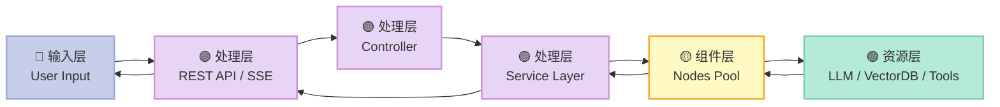
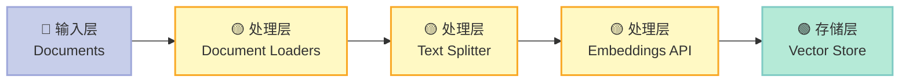
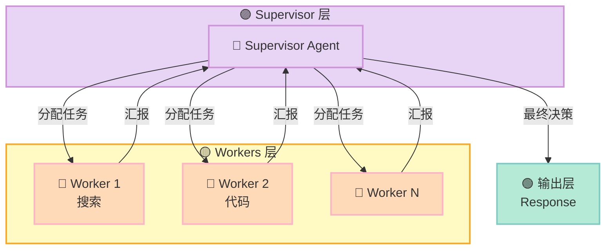

## 引子

用 LLM 构建应用，绕不开几个核心问题：Prompt 怎么管理？工具怎么串联？多 Agent 怎么协作？记忆怎么持久化？

直接写代码当然可以，但当你想快速验证思路、或者让非开发者也能搭建 AI 流程时，可视化低代码平台就成了最优解。

今天要介绍的 [Flowise](https://github.com/FlowiseAI/Flowise)，就是这样一个开源项目——它让你用拖拽的方式，搭出完整的 RAG 流程、Agent 对话、甚至是 Multi-Agent 协作系统。

## 项目概览

Flowise 是一个开源的生成式 AI 应用开发平台，核心能力：

- **可视化 Builder**：拖拽节点，配置参数，无需代码即可构建完整 AI 流程
- **三种流程类型**：Assistant（助手）、Chatflow（单 Agent）、Agentflow（Multi-Agent / 复杂编排）
- **100+ 集成**：支持 OpenAI、Azure、HuggingFace 等模型；Pinecone、Chroma 等向量库；Slack、Discord 等工具
- **多种部署方式**：Docker、本地 npm、HuggingFace Space、Railway、AWS 等
- **企业级特性**：RBAC 权限、SSO、单点登录、审计日志（企业版）

GitHub：https://github.com/FlowiseAI/Flowise

## 架构分析

### 整体架构

Flowise 采用**单仓库多包**（mono-repo）的 TypeScript 结构，主要分为三个模块：

```
packages/
├── server/        # Node.js 后端，API 逻辑
├── ui/            # React 前端，可视化编辑器
└── components/    # 节点定义，工具集成
```

数据流遵循经典的请求-响应模型：



### 节点体系：Components

Flowise 的核心抽象是**节点**（Node）。每个节点是一个独立的功能单元，实现了 `INode` 接口：

```typescript
interface INode {
    label: string           // 显示名称
    name: string            // 唯一标识
    type: string            // 节点类型
    category: string        // 所属分类
    baseClasses: string[]  // 可连接的父类
    description?: string

    // 生命周期
    init?(nodeData, input, options): Promise<any>
    run?(nodeData, input, options): Promise<string | ICommonObject>
}
```

节点分为几大类：

| 分类 | 示例 | 作用 |
|------|------|------|
| **Models** | OpenAI ChatGPT、Claude、Local LLM | LLM 推理核心 |
| **Memory** | Buffer Memory、Conversation Summary | 对话历史管理 |
| **Tool** | Search、Calculator、API Call | Agent 调用外部能力 |
| **Vector Store** | Pinecone、Chroma、FAISS | RAG 检索存储 |
| **Embeddings** | OpenAI Embeddings、HuggingFace | 文本向量化 |
| **Document Loaders** | PDF、CSV、Web | 数据摄入 |
| **Reranker** | Cohere Reranker | 检索结果重排 |

### 数据结构：Flow 的表达

一个完整的 Flow（流程）在后端被表达为 React Flow 的图结构：

```typescript
interface IReactFlowObject {
    nodes: IReactFlowNode[]
    edges: IReactFlowEdge[]
    viewport: { x: number; y: number; zoom: number }
}

interface IReactFlowNode {
    id: string
    type: string           // 节点类型名
    position: { x: number; y: number }
    data: INodeData        // 节点的配置参数
}
```

前端拖拽生成的 JSON，就是后端执行的「程序」。

## 核心机制解析

### 1. Agent 决策机制

Flowise 的 Agent 基于 [LangChain.js](https://github.com/langchain-ai/langchainjs) 实现，支持两种决策模式：

**ReAct（Thinking）模式**：Agent 在每个循环中交替执行「思考→行动→观察」三步：

```pseudo
while (未达成目标):
    1. think()   → 根据上下文决定下一步行动
    2. act()    → 调用 Tool 或检索 Memory
    3. observe() → 获取 Tool 返回结果
    4. 如果 Tool 调用耗尽或超限 → 结束
```

**MRKL（Modular Reasoning, Knowledge and Language）模式**：将任务分解为多个专家子任务，由 Supervisor 分配给不同 Worker。

### 2. Memory 存储与检索

Flowise 的 Memory 机制支持多种实现：

```typescript
// 简单缓冲记忆（只保留最近 N 条）
BufferMemory

// 滑动窗口记忆（保留最近 K 轮）
BufferWindowMemory

// 摘要记忆（定期压缩历史）
ConversationSummaryMemory

// 摘要缓冲（摘要 + 最近缓冲的组合）
ConversationSummaryBufferMemory
```

记忆的使用时机：
- **每次对话开始**：从 Memory 检索相关历史，构建 Context
- **每次对话结束**：将本轮对话写入 Memory
- **Agent 执行中**：Tool 调用时，Memory 提供背景信息

### 3. RAG（检索增强生成）

Flowise 的 RAG 流程分两个阶段：

**索引阶段**（Ingestion）：



**检索阶段**（Retrieval）：

```mermaid
graph LR
    A["🔵 输入层<br/>User Query"]
    B["🟡 处理层<br/>Embeddings API"]
    C["🟡 处理层<br/>Vector Search"]
    D["🟡 处理层<br/>Reranker"]
    E["🟡 处理层<br/>Context"]
    F["🟣 AI 层<br/>LLM"]
    G["🟢 输出层<br/>Response"]

    A --> B --> C --> D --> E --> F --> G

    style A fill:#C7CEEA,stroke:#9FA8DA,stroke-width:2px,color:#333
    style B fill:#FFF9C4,stroke:#F9A825,stroke-width:2px,color:#333
    style C fill:#FFF9C4,stroke:#F9A825,stroke-width:2px,color:#333
    style D fill:#FFF9C4,stroke:#F9A825,stroke-width:2px,color:#333
    style E fill:#FFF9C4,stroke:#F9A825,stroke-width:2px,color:#333
    style F fill:#E8D5F5,stroke:#CE93D8,stroke-width:2px,color:#333
    style G fill:#B5EAD7,stroke:#80CBC4,stroke-width:2px,color:#333
```



支持多种高级 RAG 策略：Graph RAG、Parent Document RAG、Hybrid Search 等。

### 4. Multi-Agent 协作

Flowise 的 Multi-Agent 通过 Agentflow V2 实现，采用 **Supervisor-Worker** 架构：



Supervisor 负责：
- 理解用户意图
- 将任务分解为子任务
- 分配给合适的 Worker
- 整合 Worker 反馈，生成最终回复

Worker 专注于执行特定领域的子任务（如搜索、代码生成、数据分析）。

## 使用指南

### 快速启动

```bash
# Node.js >= 18.15.0
npm install -g flowise
npx flowise start

# 打开 http://localhost:3000
```

### Docker 部署

```bash
git clone https://github.com/FlowiseAI/Flowise.git
cd Flowise/docker
cp .env.example .env
docker compose up -d
```

### 开发模式

```bash
# 安装 pnpm
npm i -g pnpm

# 克隆并构建
git clone https://github.com/FlowiseAI/Flowise.git
cd Flowise
pnpm install
export NODE_OPTIONS="--max-old-space-size=4096"
pnpm build
pnpm start
```

### API 调用示例

```bash
# 启动 chatflow 对话
curl -X POST http://localhost:3000/api/v1/prediction/:chatflow-id \\
  -H "Content-Type: application/json" \\
  -d '{
    "question": "你好，介绍一下 Flowise",
    "streaming": true
  }'
```

## 与同类项目对比

### Flowise vs LangFlow

| 维度 | Flowise | LangFlow |
|------|---------|----------|
| 语言 | TypeScript (Node.js) | Python |
| 部署 | npm / Docker，一行命令 | pip install / Docker |
| UI 设计 | 更现代，交互更流畅 | 偏学术风格 |
| 生态集成 | LangChain JS 生态 | LangChain Python 生态 |
| Multi-Agent | Agentflow V2 | 较弱 |

### Flowise vs Dify

| 维度 | Flowise | Dify |
|------|---------|------|
| 定位 | 开发者友好，偏研究 | 企业应用，偏生产 |
| API | 完整 REST API | 完整 API + OAuth |
| 部署 | 社区版功能完整 | 社区版功能完整 |
| 扩展性 | 节点用 TypeScript 写 | 节点用 Python 写 |

## 优缺点总结

### 优点

1. **上手极快**：拖拽即可跑通 RAG / Agent 流程
2. **架构清晰**：基于 LangChain，源码结构好懂
3. **集成丰富**：100+ 节点，覆盖主流需求
4. **部署灵活**：一条 `npx flowise start` 即可运行
5. **API 完善**：天然支持程序化调用

### 缺点

1. **复杂编排受限**：Agentflow V2 解决了 Multi-Agent，但超复杂场景仍需写代码
2. **性能调优空间有限**：黑盒节点内部逻辑无法深度定制
3. **企业特性闭源**：RBAC、SSO 等在企业版
4. **依赖 LangChain**：版本升级可能带来 breaking change

## 趋势与展望

Flowise 正在从「可视化 LangChain 工具」向「企业级 AI 应用平台」演进：

- **Agentflow V2** 的发布补齐了 Multi-Agent 短板
- **MCP 集成**（Model Context Protocol）让工具生态更开放
- **Embedding / Reranker** 支持使 RAG 质量大幅提升
- **Embedded Chatbot** 让 AI 能力无缝嵌入现有产品

如果你在寻找一个免费、开源、又能快速落地 LLM 应用的项目，Flowise 值得一试。

## 参考链接

- GitHub：https://github.com/FlowiseAI/Flowise
- 官方文档：https://docs.flowiseai.com/
- 在线体验：https://flowiseai.com/
- HuggingFace Space：https://huggingface.co/spaces/FlowiseAI/Flowise
