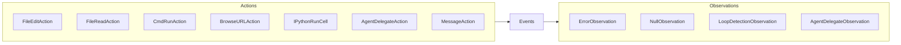
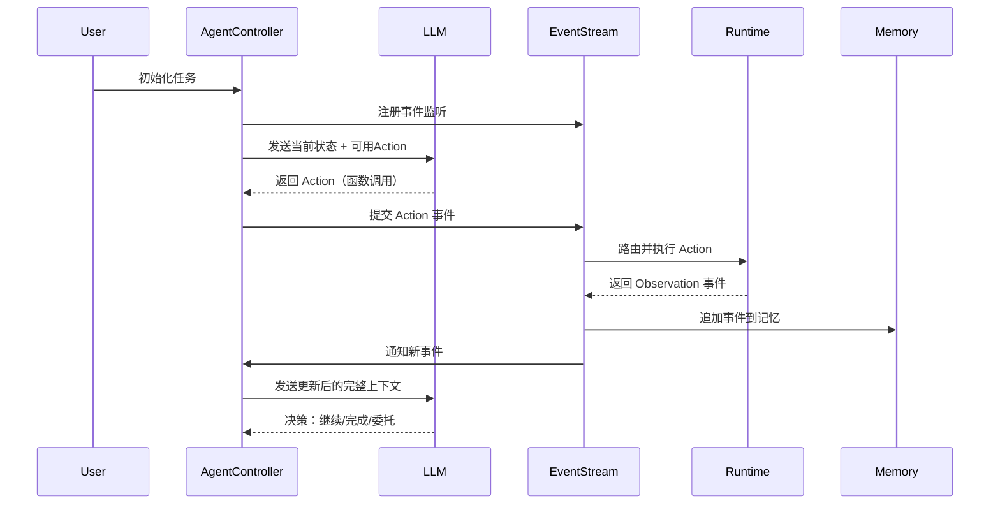
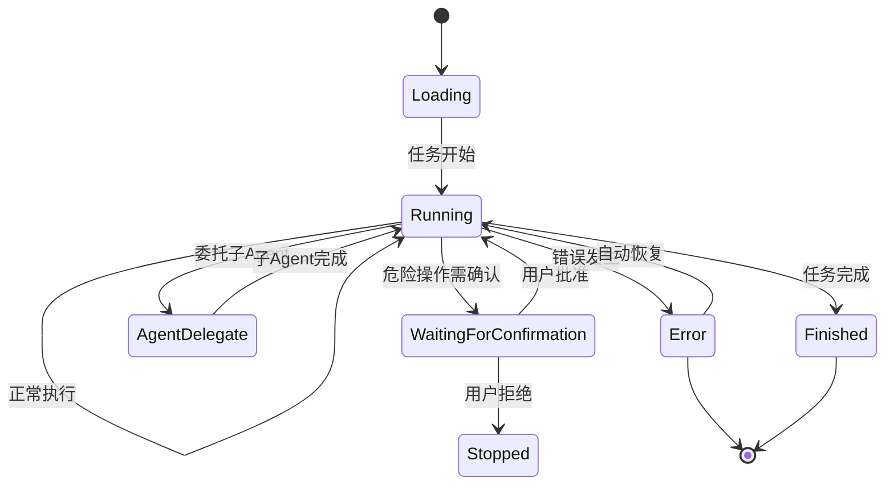
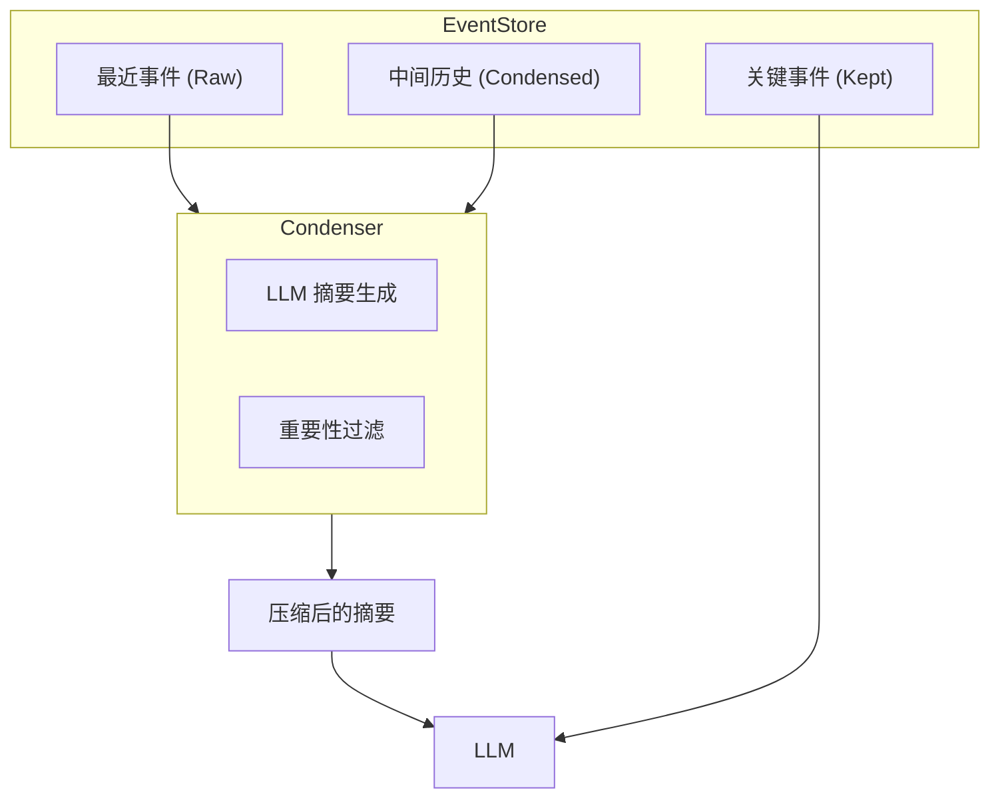
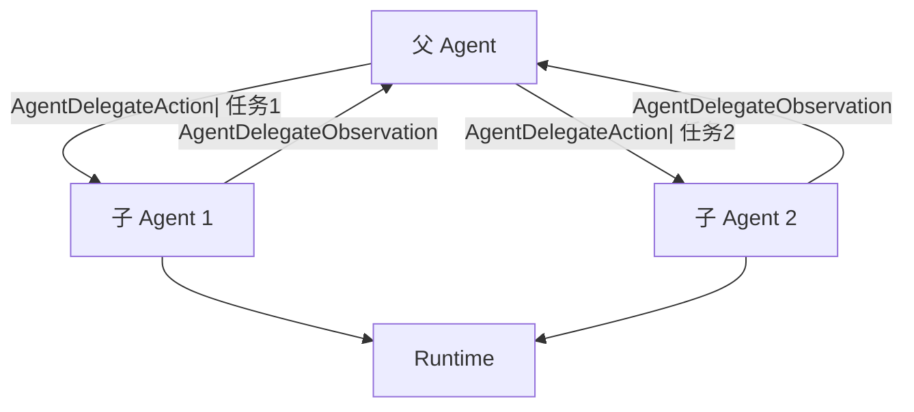

## 引子

当 AI 能够自主阅读代码库、编写修复方案、执行命令行操作、提交 Pull Request —— 软件开发会变成什么样子？**OpenHands** 正在将这个愿景变为现实。

作为目前最活跃的 AI 软件工程代理之一，OpenHands 在 SWEBench 基准测试中达到了 **77.6%** 的通过率，被 TikTok、Amazon、Netflix、NVIDIA 等知名企业工程师采用。本文将深度剖析其核心架构、设计原理与工程实践。

<!-- more -->

## 项目概述

**OpenHands**（[github.com/OpenHands/OpenHands](https://github.com/OpenHands/OpenHands)）是一个 AI 驱动的软件开发代理，目标是让 AI 能够像人类工程师一样独立完成代码阅读、调试、修复、测试等完整开发流程。

### 核心定位

| 维度 | 描述 |
|------|------|
| **问题域** | 自动化软件工程任务：Bug修复、功能开发、代码重构、测试编写 |
| **核心价值** | 将大语言模型的推理能力与真实代码执行环境结合，实现端到端的自动化开发 |
| **技术特色** | 事件驱动的 Agent 架构、强大的代码执行 Runtime、支持多 Agent 委托 |
| **性能指标** | SWEBench 77.6%（SOTA 级别）、支持 Claude/GPT/任何兼容 LLM |

### 产品形态

OpenHands 提供四种使用方式：

```
┌─────────────────────────────────────────────────────┐
│                  OpenHands 生态                      │
├─────────────────────────────────────────────────────┤
│  SDK        │ Python 库，可嵌入任何应用                │
│  CLI        │ 类比 Claude Code，终态终端交互            │
│  Local GUI  │ 类比 Devin/Jules，本地 Web 界面         │
│  Cloud      │ 托管服务，支持 Slack/Jira/Linear 集成    │
└─────────────────────────────────────────────────────┘
```

---

## 核心架构

OpenHands 采用**事件驱动（Event-Driven）架构**，将 Agent 决策、代码执行、多轮对话全部抽象为事件流。这种设计使得系统状态可追溯、可回放、易调试。

### 整体架构图

```mermaid
graph TB
    subgraph User_Interface
        CLI[CLI]
        GUI[Local GUI]
        SDK[SDK API]
        Cloud[OpenHands Cloud]
    end

    subgraph App_Server
        Router[v1_router]
        Conv[app_conversation]
        Settings[settings]
    end

    subgraph Agent_Core
        Controller[AgentController]
        Agent[Agent]
        Loop[run_agent_until_done]
    end

    subgraph Event_System
        EventStream[EventStream]
        Actions[Actions]
        Observations[Observations]
    end

    subgraph Memory
        Memory[Memory]
        Condenser[condenser]
        View[View]
    end

    subgraph LLM
        LLM[LLM]
        Router[llm_router]
        ToolConverter[fn_call_converter]
    end

    subgraph Runtime
        Runtime[Runtime]
        Sandbox[Sandbox]
        FileEdit[FileEdit]
        CmdRun[CmdRun]
        Browse[BrowseURL]
        IPython[IPythonRunCell]
    end

    User_Interface --> App_Server
    App_Server --> Agent_Core
    Agent_Core --> Event_System
    Event_System --> Memory
    Agent_Core --> LLM
    Event_System --> Runtime
    LLM --> ToolConverter
    ToolConverter --> Event_System
```

### 各层职责

| 层级 | 模块 | 职责 |
|------|------|------|
| **接口层** | CLI / GUI / SDK | 用户交互入口 |
| **应用层** | app_server | 会话管理、配置、生命周期 |
| **Agent层** | AgentController / Agent | 决策循环、状态管理、错误恢复 |
| **事件层** | EventStream / Actions / Observations | 统一事件抽象、状态流转 |
| **记忆层** | Memory / condenser | 对话记忆压缩、摘要生成 |
| **LLM层** | LLM / router / fn_call_converter | 模型调用、工具 schema 转换 |
| **运行时** | Runtime / Sandbox | 代码执行、环境隔离 |

---

## 事件驱动机制：核心设计哲学

OpenHands 最核心的设计思想是将**一切交互都抽象为事件**。

### 事件类型体系



### 事件流循环



### 关键事件类型

```python
# 动作事件（Agent → 执行器）
FileReadAction      # 读取文件内容
FileWriteAction     # 写入/创建文件
FileEditAction      # 编辑文件（diff 格式）
CmdRunAction        # 执行 Shell 命令
IPythonRunCellAction # 执行 Python 代码
BrowseURLAction     # 浏览网页
AgentDelegateAction # 委托给子 Agent
MessageAction       # 发送消息/评论

# 观察事件（执行器 → Agent）
ErrorObservation          # 执行出错
NullObservation           # 执行成功（无输出）
LoopDetectionObservation   # 检测到循环
AgentDelegateObservation   # 子 Agent 完成
AgentStateChangedObservation # Agent 状态变更
```

---

## Agent 决策机制

### AgentController：状态机驱动

`AgentController` 是 Agent 的大脑，负责管理 Agent 的生命周期和决策循环。

```python
class AgentController:
    id: str
    agent: Agent
    max_iterations: int
    event_stream: EventStream
    state: State
    confirmation_mode: bool  # 是否需要用户确认危险操作

    TRAFFIC_CONTROL_REMINDER = "Please click resume to continue"
```

### 决策循环

```python
async def run_agent_until_done(
    controller: AgentController,
    runtime: Runtime,
    memory: Memory,
    end_states: list[AgentState],  # 终止状态列表
):
    # 1. 挂载回调（错误/状态通知）
    runtime.status_callback = status_callback
    controller.status_callback = status_callback
    memory.status_callback = status_callback

    # 2. 事件驱动循环
    while controller.state.agent_state not in end_states:
        await asyncio.sleep(1)
        # 每次 EventStream 有新事件时，Controller 会被唤醒
        # 重新收集上下文 → 调用 LLM → 生成下一步 Action
```

### 状态机



---

## 记忆系统：Condenser 模式

OpenHands 的记忆系统采用**压缩（Condensation）**机制，而非简单的滑动窗口。

### 记忆结构

```python
class Memory:
    event_store: EventStore
    condenser: Condenser  # 记忆压缩器
    status_callback: Callable

    def build_conversation_view(self) -> View:
        """构建供 LLM 使用的对话视图"""
        return self.event_store.get_view()
```

### 压缩策略

OpenHands 维护一个** condensation 循环**：

1. **最近消息**（Last N 条）：原样保留
2. **中间历史**：经过 `Condenser` 压缩为摘要
3. **关键决策点**：保留原始格式（如 AgentFinishAction）



---

## 工具系统：Runtime 执行层

### 多运行时支持

OpenHands 支持多种执行后端：

```python
# 运行时配置
Runtime = LocalRuntime | DockerRuntime | RemoteRuntime
```

### 核心工具实现

| 工具 | 执行方式 | 特点 |
|------|---------|------|
| **CmdRunAction** | 在沙盒中执行 Shell | 完整的 Linux 环境 |
| **IPythonRunCellAction** | Python REPL | 支持数据分析、可视化 |
| **FileReadAction** | 读取文件 | 支持大文件截断 |
| **FileWriteAction** | 写入文件 | 自动创建目录 |
| **FileEditAction** | Diff 编辑 | 精确的代码修改 |
| **BrowseURLAction** | 浏览器自动化 | 可与网页交互 |
| **AgentDelegateAction** | 子 Agent 执行 | 支持多 Agent 协作 |

### 安全机制

```python
class SecurityAnalyzer:
    """执行前分析 Action 的安全风险"""
    def analyze(action: Action) -> ActionSecurityRisk:
        # 检测：rm -rf /、git push --force 等危险操作
        # 返回：SAFE / CONFIRMATION_REQUIRED / UNSAFE
```

---

## 多 Agent 协作：委托模式

OpenHands 支持通过 `AgentDelegateAction` 启动子 Agent：

```python
@dataclass
class AgentDelegateAction(Action):
    agent_id: str
    task: str
    parent_agent_id: str
    # 子Agent可以独立执行任务，完成后返回结果给父Agent
```



**典型场景**：
- 主 Agent 分析任务，子 Agent 并行执行搜索/编写/测试
- 复杂任务分解为「代码审查 Agent」+「代码修改 Agent」+「测试 Agent」

---

## LLM 集成：灵活的模型支持

### 多模型路由

```python
class LLMRegistry:
    """支持多模型动态切换"""
    def get_llm(config: LLMConfig) -> LLM:
        # 支持：Claude / GPT-4 / Gemini / 本地模型
```

### 函数调用转换

OpenHands 使用 `fn_call_converter` 将内部 Action schema 转换为各模型支持的函数调用格式：

```python
# 内部统一格式
action = FileReadAction(file_path="src/main.py")

# 转换为目标模型格式
# Claude: anthropic-tools
# GPT: function-calling
# Gemini: function-declarations
```

---

## 深度对比

### OpenHands vs LangChain Agent

| 维度 | OpenHands | LangChain Agent |
|------|-----------|----------------|
| **设计哲学** | 事件驱动，状态可回放 | Chain/Prompt 组合 |
| **执行模型** | Real Runtime（真实代码执行） | 多为 Tool 抽象 |
| **记忆系统** | 内置 Condenser 压缩 | 依赖外部 Memory 管理 |
| **多 Agent** | 内置委托机制 | 通过 LangGraph 实现 |
| **专注领域** | 软件工程垂直 | 通用 LLM 应用 |
| **Benchmark** | SWEBench 77.6% | 无专项评测 |

### OpenHands vs AutoGPT

| 维度 | OpenHands | AutoGPT |
|------|-----------|---------|
| **架构** | 事件驱动 + 可视化调试 | 目标驱动 + 树搜索 |
| **执行环境** | 沙盒隔离，安全可靠 | 本地执行，风险较高 |
| **产品化** | SDK/CLI/GUI/Cloud 完整生态 | 主要 CLI |
| **社区活跃度** | 71k ⭐，企业采用 | 184k ⭐，偏个人开发者 |

### OpenHands vs CrewAI

| 维度 | OpenHands | CrewAI |
|------|-----------|--------|
| **交互模式** | 事件驱动，可单步调试 | Role-Based Agent |
| **执行能力** | 深度代码执行 | 任务分配为主 |
| **记忆管理** | 内置压缩机制 | 外部集成 |
| **场景** | 软件开发全流程 | 通用多Agent协作 |

---

## 优缺点分析

### 优点

1. **事件驱动架构**：状态可追溯、回放、重放，调试体验好
2. **真实执行环境**：不只是 LLM 调用，能真正修改文件、运行测试
3. **强大的记忆系统**：Condenser 机制避免上下文溢出
4. **Benchmark 驱动**：SWEBench 77.6% 证明工程化能力
5. **多 Agent 原生支持**：委托机制简洁直观
6. **企业级支持**：有 Enterprise 版本和专业支持

### 缺点与挑战

1. **学习曲线**：事件模型对于新手不够直观
2. **V0 → V1 迁移**：当前正处于架构升级期，部分文档可能有歧义
3. **资源消耗**：完整 Runtime（尤其 Docker）资源占用较高
4. **调试复杂度**：多轮交互后，事件流可能变得复杂
5. **模型依赖**：效果高度依赖底层 LLM 的函数调用能力

---

## 使用场景

### 最佳场景

- **Bug 自动修复**：输入 Bug 描述，Agent 分析代码并提交修复
- **代码重构**：大型代码库的结构调整和迁移
- **测试生成**：为现有代码自动编写单元测试
- **PR 审查**：自动化 Code Review 和问题标注
- **文档生成**：代码库文档自动生成

### 不适合场景

- 简单的单一 LLM 调用（直接用 API 更轻量）
- 需要实时交互的低延迟场景
- 没有明确结束标准的开放式任务

---

## 总结

OpenHands 代表了 **AI 软件开发代理**的一种成熟架构范式：事件驱动 + 强执行环境 + 可压缩记忆。其在 SWEBench 上的出色表现证明了架构的有效性。

随着 AI 模型能力的持续提升，像 OpenHands 这样的代理将成为工程师的强大助手——不是替代，而是将人类从重复性编码中解放出来，专注于更具创造性的工作。

**相关链接**：
- GitHub：[OpenHands/OpenHands](https://github.com/OpenHands/OpenHands)
- 文档：[docs.openhands.dev](https://docs.openhands.dev)
- SDK：[OpenHands/software-agent-sdk](https://github.com/OpenHands/software-agent-sdk)
- 论文：[arxiv.org/abs/2511.03690](https://arxiv.org/abs/2511.03690)
