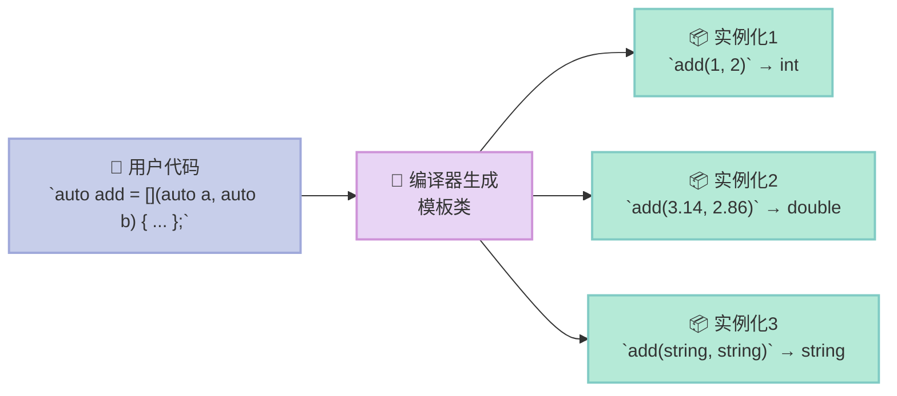
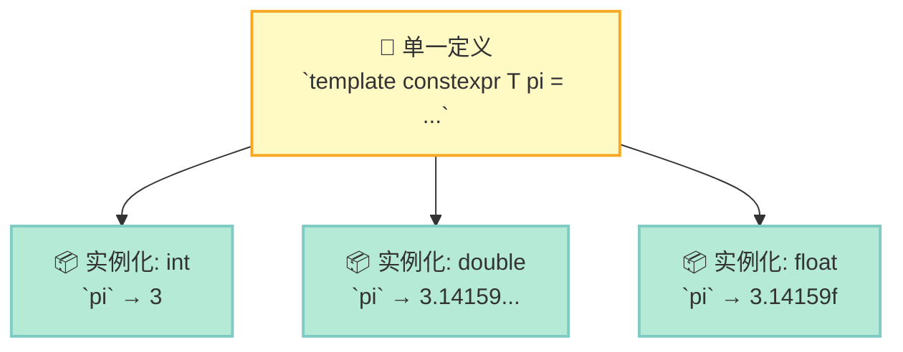

> C++14 是现代 C++ 的真正起点——它让模板和 Lambda 不再是"奇技淫巧"，而是日常编程的一部分。

## 前言

C++11 引入了 Lambda，C++14 则让它真正变得**通用**。配合 Variable Template，C++14 开启了一个新纪元：**编译期计算**和**泛型编程**终于可以写得优雅而直观。

读完本文，你会理解：
- Generic Lambda 的本质是**模板语法糖**
- Variable Template 如何实现"一次定义，多态使用"
- `std::make_unique` 为什么优于裸 `new`
- `std::index_sequence` 如何让 Tuple 解包成为可能

---

## 一、Generic Lambda：模板方法的语法糖

### 1.1 什么是 Generic Lambda？

```cpp
auto add = [](auto a, auto b) { return a + b; };
```

这行代码看似简单，实则编译器会把它翻译成一个**带有模板 `operator()` 的匿名类**：

```cpp
struct __AddLambda {
    template<typename A, typename B>
    auto operator()(A a, B b) const { return a + b; }
};
```

**核心原理**：每个 `auto` 参数对应模板参数的一次实例化。换句话说：

```cpp
[](auto a, auto b) { return a + b; }
```

等价于：

```cpp
template<typename A, typename B>
auto operator()(A a, B b) const { return a + b; }
```

### 1.2 Mermaid 图：Generic Lambda 编译过程



### 1.3 Lambda 的本质：无法 decltype

Lambda 没有名字，**无法直接 `decltype`**。但可以用 `std::function` 包装：

```cpp
auto my_lambda = [](int x) { return x * 2; };
std::function<int(int)> f = my_lambda;  // ✅ 可以
decltype(my_lambda) f2;                  // ❌ 编译错误：Lambda 类型不可达
```

> 这与 Lambda 的"匿名性"本质相关——编译器生成的类型是一个**未命名的仿函数**，语法上无法写出它的名字。

---

## 二、Variable Template：一次定义，多态使用

### 2.1 基本用法

```cpp
template<typename T>
constexpr T pi = T(3.14159265358979);

std::cout << pi<int>;      // 3
std::cout << pi<double>;   // 3.14159...
```

**与 `constexpr` 变量的区别**：

| 维度 | `constexpr` 变量 | Variable Template |
|------|------------------|-------------------|
| 本质 | 编译期常量 | **模板**，每个实例化都是独立变量 |
| 参数化 | 无 | 按**类型**或**整数值**参数化 |
| 示例 | `constexpr int MAX = 100;` | `template<int N> constexpr int factorial = N * factorial<N-1>;` |

### 2.2 Mermaid 图：Variable Template 实例化



### 2.3 编译期阶乘：递归实例化的威力

```cpp
template<int N>
constexpr int factorial = N * factorial<N-1>;

template<>
constexpr int factorial<0> = 1;

static_assert(factorial<5> == 120);  // 编译期验证！
```

这利用了**模板的递归实例化**特性——每个 `factorial<N>` 都依赖 `factorial<N-1>`，直到 base case `factorial<0>`。

---

## 三、std::make_unique：比 new 更安全

### 3.1 异常安全

```cpp
auto p1 = std::make_unique<int>(42);  // ✅ 异常安全
auto p2 = new int(42);                // ⚠️ 需要手动 delete
delete p2;
```

**为什么更安全？**

考虑以下场景：

```cpp
void process() {
    auto p = std::make_unique<Config>(load_config());
    // 如果 load_config() 抛出异常，p 仍会被正确销毁
    // 但如果是 new + 构造函数抛异常，就会内存泄漏
    do_something();
}
```

### 3.2 make_unique for 数组

```cpp
auto arr = std::make_unique<int[]>(10);  // ✅ C++14 支持
arr[0] = 1;
```

> 注意：`std::make_unique<T[]>(n)` 在 C++14 引入，C++20 才开始支持默认初始化 `std::make_unique<int[]>(10, 0)`。

---

## 四、std::index_sequence：解包 Tuple 的钥匙

### 4.1 问题背景

如何遍历一个 `std::tuple` 的所有元素？传统方法需要递归模板：

```cpp
template<typename... Args>
void print_all(Args... args) {
    std::cout << "args: ";
    int dummy[] = { (std::cout << args << ' ', 0)... };
    (void)dummy;
    std::cout << "\n";
}
```

这里用到了一个 **折叠表达式（fold expression）** 技巧：`(expression)...` 会展开为 `expr1, expr2, ...`。

### 4.2 index_sequence 的典型用法

```cpp
template<typename Tuple, std::size_t... Is>
void print_tuple_impl(const Tuple& t, std::index_sequence<Is...>) {
    ((std::cout << std::get<Is>(t) << ' '), ...);
}

template<typename Tuple>
void print_tuple(const Tuple& t) {
    print_tuple_impl(t, std::make_index_sequence<std::tuple_size<Tuple>::value>{});
}
```

`std::index_sequence` 本质上是一个**编译期整数序列**，用于在模板元编程中展开参数包。

---

## 五、完整可运行代码

```cpp
#include <iostream>
#include <memory>
#include <tuple>
#include <utility>

// === Generic Lambda 原理：编译器生成的等价格式 ===
struct __AddLambda {
    template<typename A, typename B>
    auto operator()(A a, B b) const { return a + b; }
};

// === Variable Template ===
template<typename T>
constexpr T pi = T(3.14159265358979);

// 阶乘 compile-time (递归模板实例化)
template<int N>
constexpr int factorial = N * factorial<N-1>;
template<>
constexpr int factorial<0> = 1;

// === index_sequence 辅助 ===
template<typename... Args>
void print_all(Args... args) {
    std::cout << "args: ";
    int dummy[] = { (std::cout << args << ' ', 0)... };
    (void)dummy;
    std::cout << "\n";
}

int main() {
    // === Generic Lambda ===
    auto add = [](auto a, auto b) { return a + b; };
    std::cout << "int: " << add(1, 2) << "\n";
    std::cout << "double: " << add(3.14, 2.86) << "\n";
    std::cout << "string: " << add(std::string("hello"), std::string(" world")) << "\n";
    
    // 等价的编译器生成代码
    __AddLambda add2;
    std::cout << add2(1, 2) << "\n";
    
    // === Variable Template ===
    std::cout << "int pi: " << pi<int> << "\n";          // 3
    std::cout << "double pi: " << pi<double> << "\n";    // 3.14159...
    
    static_assert(factorial<5> == 120);
    std::cout << "factorial<10>: " << factorial<10> << "\n";
    
    // === make_unique vs new ===
    auto p1 = std::make_unique<int>(42);
    auto p2 = new int(42);  // old way
    delete p2;
    
    // make_unique for arrays
    auto arr = std::make_unique<int[]>(10);
    arr[0] = 1;
    
    // === index_sequence ===
    print_all(1, 2.5, "hello");
}
```

**编译验证**：

```bash
g++ -std=c++14 -o demo demo.cpp && ./demo
```

---

## 总结

| 特性 | 核心价值 | 使用场景 |
|------|---------|---------|
| Generic Lambda | 模板参数推导自动化 | 泛型算法、回调函数 |
| Variable Template | 类型参数化变量 | 数学常量、编译期查表 |
| make_unique | 异常安全 + 简洁语法 | 替代所有 `new` 表达式 |
| index_sequence | 参数包展开工具 | Tuple/ParameterPack 处理 |

> **行动建议**：从今天开始，写代码时优先使用 `std::make_unique` 替代 `new/delete`；需要泛型 Lambda 时，直接用 `auto` 参数，无需显式声明模板。
