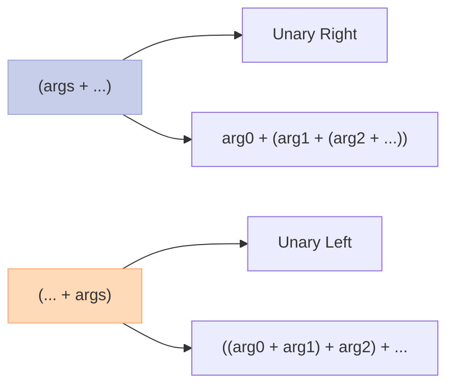

> C++14 写一个变参 print 函数需要几步？答案是：至少 50 行递归模板代码。C++17 的折叠表达式让这件事变成一行。

## 一、变参模板的痛：递归展开的噩梦

在 C++14 之前（或不用 fold expressions 时），处理变参模板需要递归展开：

```cpp
// C++14: 变参打印的噩梦
#include <iostream>

// 基础版本：递归终止
void print() {
    std::cout << '\n';
}

// 递归版本：处理一个参数，然后递归
template<typename T, typename... Args>
void print(T first, Args... rest) {
    std::cout << first;
    if (sizeof...(rest) > 0) {
        std::cout << ", ";
        print(rest...);  // 递归调用
    } else {
        std::cout << '\n';
    }
}

int main() {
    print(1, "hello", 3.14, "world");
}
```

**问题**：
1. 需要两个函数（递归终止 + 递归展开）
2. 每个参数都要实例化一套模板
3. 代码难懂，维护成本高
4. 编译错误信息经常让人摸不着头脑

## 二、折叠表达式：四种形式

C++17 引入折叠表达式，有 **4 种形式**：

| 形式 | 表达式 | 展开结果 |
|------|--------|----------|
| **Unary Right** | `(args op ...)` | `arg0 op (arg1 op (... op argN))` |
| **Unary Left** | `(... op args)` | `((arg0 op arg1) op ...) op argN` |
| **Binary Right** | `(args op ... op init)` | `arg0 op (arg1 op (... op (argN op init)))` |
| **Binary Left** | `(init op ... op args)` | `(((init op arg0) op arg1) op ...) op argN` |



## 三、一行搞定变参打印

```cpp
#include <iostream>

// C++17: 折叠表达式一行解决
template<typename... Args>
void print(Args&&... args) {
    (std::cout << ... << std::forward<Args>(args)) << '\n';
}

int main() {
    print(1, "hello", 3.14, "world");
    // 输出: 1hello3.14world
}
```

`(std::cout << ... << std::forward<Args>(args))` 展开为：
```cpp
((std::cout << arg1) << arg2) << ... << argN
```

**完美转发 + 折叠表达式 = 优雅的变参处理。**

## 四、实际应用场景

### 场景 1：求和函数

```cpp
// Unary Right Fold
template<typename... Args>
auto sum(Args... args) {
    return (args + ...);  // arg0 + (arg1 + (arg2 + ...))
}

// Unary Left Fold (对于 + 运算结果相同)
template<typename... Args>
auto sum_left(Args... args) {
    return (... + args);  // ((arg0 + arg1) + ...)
}

// Binary Fold (带初始值)
template<typename... Args>
auto sum_with_default(Args... args) {
    return (args + ... + 0);  // arg0 + (arg1 + (... + (argN + 0)))
}

int main() {
    std::cout << sum(1, 2, 3, 4, 5) << '\n';       // 15
    std::cout << sum_left(1, 2, 3, 4, 5) << '\n';   // 15 (same for +)
    std::cout << sum_with_default(1, 2, 3) << '\n'; // 6
}
```

### 场景 2：逻辑运算

```cpp
// 所有条件都为 true？
template<typename... Conds>
constexpr bool all_of(Conds... conds) {
    return (... && conds);  // ((c0 && c1) && c2) && ...
}

// 任意条件为 true？
template<typename... Conds>
constexpr bool any_of(Conds... conds) {
    return (... || conds);  // ((c0 || c1) || c2) || ...
}

// 批量检查值是否满足所有条件
template<typename T, typename... Preds>
bool matches_all(const T& val, Preds... preds) {
    return (preds(val) && ...);
}

int main() {
    std::cout << all_of(true, true, true) << '\n';  // 1
    std::cout << all_of(true, false, true) << '\n'; // 0
    
    std::cout << any_of(false, false, true) << '\n'; // 1
    std::cout << any_of(false, false, false) << '\n'; // 0
    
    bool r = matches_all(5,
        [](int x){ return x > 0; },
        [](int x){ return x < 10; },
        [](int x){ return x % 2 == 1; }
    );
    std::cout << "matches: " << r << '\n'; // 1
}
```

### 场景 3：完美转发参数包

```cpp
#include <memory>

// 工厂函数：转发所有参数
template<typename T, typename... Args>
std::unique_ptr<T> make_unique(Args&&... args) {
    return std::unique_ptr<T>(new T(std::forward<Args>(args)...));
}

// 变参成员初始化
struct Widget {
    int x, y, z;
    template<typename... Ints>
    Widget(Ints... vals) : x(vals)... {
        static_assert(sizeof...(Ints) <= 3, "Too many arguments");
    }
};
```

## 五、C++14 vs C++17：方案对比

### 变参求和

```cpp
// =============================================
// C++14: 递归实现
// =============================================
template<typename T>
T sum() {
    return T{};  // 递归终止
}

template<typename T, typename... Args>
T sum(T first, Args... rest) {
    return first + sum<T>(rest...);  // 递归
}

// =============================================
// C++17: Fold Expression
// =============================================
template<typename... Args>
auto sum(Args... args) {
    return (args + ...);  // 一行！
}
```



```mermaid
flowchart TD
    subgraph "C++14 递归方案"
        A1["sum(1,2,3,4,5)"] --> A2["1 + sum(2,3,4,5)"]
        A2 --> A3["2 + sum(3,4,5)"]
        A3 --> A4["3 + sum(4,5)"]
        A4 --> A5["4 + sum(5)"]
        A5 --> A6["5 + sum()"]
        A6 --> A7["5 + 0 = 5"]
        A7 --> A8["9"]
        A8 --> A9["13"]
        A9 --> A10["15"]
    end
    
    subgraph "C++17 Fold 方案"
        B1["(1 + 2 + 3 + 4 + 5)"] --> B2["编译器直接展开"]
        B2 --> B3["15"]
    end

    style A1 fill:#FFDAB9,stroke:#FFAB76
    style B1 fill:#B5EAD7,stroke:#80CBC4
    style B3 fill:#B5EAD7,stroke:#80CBC4
```

### 完整代码对比

| 维度 | C++14 递归 | C++17 Fold |
|------|------------|------------|
| **代码量** | 10+ 行 | 1-2 行 |
| **模板实例化次数** | O(N) | O(1) |
| **编译时间** | 较慢 | 更快 |
| **可读性** | 差 | 好 |
| **维护成本** | 高 | 低 |

## 六、常见陷阱

### 陷阱 1：空参数包

```cpp
// 一元折叠对空参数包的行为：
// && : true
// || : false
// ,  : void()
// 其他运算符: 编译错误！

template<typename... Args>
bool all_true(Args... args) {
    return (... && args);  // 空参数包返回 true
}

static_assert(all_true() == true);  // OK

// 但这样不行：
template<typename... Args>
auto sum(Args... args) {
    return (args + ...);  // 编译错误！+ 对空包无定义
}
```

### 陷阱 2：优先级问题

```cpp
template<typename... Args>
void print(Args... args) {
    // 错误：逗号表达式优先级问题
    // (std::cout << args, ...);  // 实际被解析为:
    // std::cout << (args, ...)   // 逗号表达式优先
    
    // 正确：加括号
    (std::cout << ... << args);
}
```

### 陷阱 3：二元折叠的初始值

```cpp
template<typename... Args>
auto sum(Args... args) {
    // 错误：需要显式初始值
    // return (args + ... +);  // 语法错误
    
    // 正确：提供初始值
    return (args + ... + 0);
}

// 对于字符串，初始值要匹配类型
template<typename... Args>
auto concat(Args... args) {
    return (args + ... + std::string{});
}
```

## 七、综合实例：类型安全的 printf

```cpp
#include <iostream>
#include <string>

// 编译期格式化字符串解析
template<char... Cs>
struct FormatString {
    static constexpr char value[] = {Cs...};
};

// 递归打印任意类型
void print_impl() {}

template<typename T, typename... Args>
void print_impl(T first, Args... rest) {
    std::cout << first;
    if constexpr (sizeof...(rest) > 0) {
        print_impl(rest...);
    }
}

template<typename... Args>
void println(Args... args) {
    print_impl(args...);
    std::cout << '\n';
}

// 批量类型检查
template<typename T, typename... Preds>
constexpr bool satisfies_all(T val, Preds... preds) {
    return (... && preds(val));
}

int main() {
    println("Hello,", "World!", 42, 3.14);
    
    // 编译期 + 运行时混合验证
    constexpr bool valid = satisfies_all(5,
        [](int x){ return x > 0; },
        [](int x){ return x < 100; }
    );
    
    static_assert(valid, "5 应该满足所有条件");
    
    std::cout << "All checks passed!\n";
}
```

---

> 折叠表达式是 C++17 最实用的新特性之一。**一行 `(pack op ...)` 替代几十行递归模板代码**，不仅更简洁，编译更快，生成的错误信息也更加友好。变参模板从此不再可怕。

**C++17 新特性系列完结**：
- ✅ Structured Bindings：告别临时变量
- ✅ if constexpr：编译期分支利器  
- ✅ Inline Variables：ODR 问题终结者
- ✅ Fold Expressions：变参模板救星

有问题或建议？欢迎留言讨论！
---

## 📚 C++17 新特性 系列导航

> 本文是《C++17 新特性》系列第 **4/8** 篇。

| 方向 | 章节 |
|:--|:--|
| ◀ 上一篇 | [（三）Inline Variables 与 constexpr 加强](/2026/04/23/2026-04-23-cpp17-inline-constexpr/) |
| 下一篇 ▶ | [（五）std::optional / variant / any](/2026/04/23/2026-04-23-cpp17-optional-variant-any/) |

<details>
<summary>📖 全部 8 篇目录（点击展开）</summary>

1. [（一）Structured Bindings](/2026/04/23/2026-04-23-cpp17-structured-bindings/)
2. [（二）if constexpr](/2026/04/23/2026-04-23-cpp17-if-constexpr/)
3. [（三）Inline Variables 与 constexpr 加强](/2026/04/23/2026-04-23-cpp17-inline-constexpr/)
4. [（四）Fold Expressions](/2026/04/23/2026-04-23-cpp17-fold-expressions/) **← 当前**
5. [（五）std::optional / variant / any](/2026/04/23/2026-04-23-cpp17-optional-variant-any/)
6. [（六）std::apply / std::invoke](/2026/04/23/2026-04-24-cpp17-any-apply-invoke/)
7. [（七）Filesystem 大全](/2026/04/23/2026-04-24-cpp17-filesystem/)
8. [（八）Attribute 新增](/2026/04/23/2026-04-24-cpp17-attributes/)

</details>
