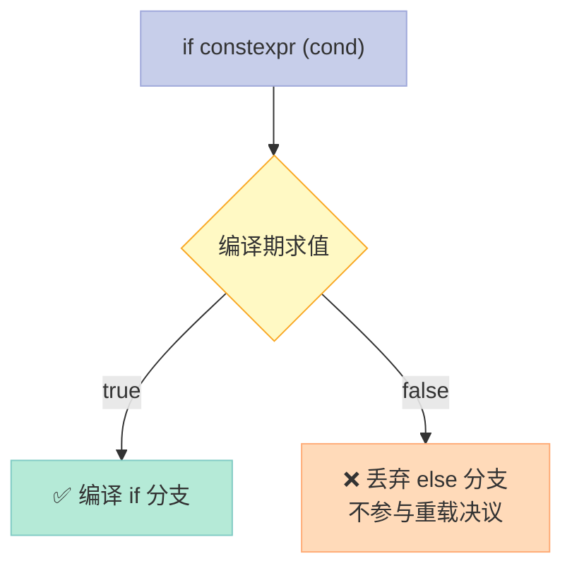

> 模板代码中最讨厌的是什么？SFINAE 那种拐弯抹角的控制流！C++17 的 `if constexpr` 让编译期分支变得像普通 if 语句一样直观。

## 一、SFINAE 的痛：想说爱你不容易

在 C++17 之前，如果你想让模板函数对不同类型做不同处理，通常用 SFINAE：

```cpp
// 整数类型版本
template<typename T, 
         typename = std::enable_if_t<std::is_integral_v<T>>>
void print(T val) {
    std::cout << "整数: " << val << '\n';
}

// 浮点类型版本  
template<typename T,
         typename = std::enable_if_t<std::is_floating_point_v<T>>>
void print(T val) {
    std::cout << "浮点: " << val << '\n';
}
```

**问题**：
1. 代码繁琐，需要 `enable_if_t` 包装
2. 错误信息晦涩难懂
3. 两个模板不能同时存在一个作用域（会冲突）
4. 想加第三个版本？改到崩溃

## 二、if constexpr 的解决方案

C++17 引入的 `if constexpr` 彻底改变了游戏规则：

```cpp
#include <iostream>
#include <type_traits>

template<typename T>
void print_type_info(T val) {
    if constexpr (std::is_integral_v<T>) {
        std::cout << "整数: " << val << '\n';
    } else if constexpr (std::is_floating_point_v<T>) {
        std::cout << "浮点: " << val << '\n';
    } else {
        std::cout << "其他类型\n";
    }
}

int main() {
    print_type_info(42);      // 整数: 42
    print_type_info(3.14);    // 浮点: 3.14
    print_type_info("hello"); // 其他类型
}
```

**太优雅了！** 就像写普通 if-else 一样，但实际执行的是**编译期分支**。

## 三、底层原理：false 分支被丢弃

`if constexpr` 的关键特性：**条件为 false 的分支不会被编译**。



这和普通 if 的本质区别：

| 特性 | 普通 if | if constexpr |
|------|---------|--------------|
| **求值时机** | 运行时 | 编译期 |
| **false 分支** | 编译+忽略 | **根本不编译** |
| **重载决议** | 参与 | **不参与** |
| **实例化** | 两者都实例化 | 只实例化进入的分支 |

## 四、if constexpr 淘汰 SFINAE

### SFINAE 旧写法

```cpp
// 用 SFINAE 检测是否有 size() 方法
template<typename T, typename = void>
struct has_size : std::false_type {};

template<typename T>
struct has_size<T, std::void_t<decltype(std::declval<T>().size())>>
    : std::true_type {};
```

### if constexpr 新写法

```cpp
template<typename T>
void process(T& obj) {
    if constexpr (requires { obj.size(); }) {
        // 只有当 T 有 size() 方法时才编译这段
        std::cout << "size = " << obj.size() << '\n';
    } else {
        // 没有 size() 方法时，编译这段
        std::cout << "no size method\n";
    }
}
```

**代码量减少 70%，可读性提升 200%。**

## 五、与 std::variant 配合：Visitor 模式的利器

C++17 的 `std::variant` 配合 `if constexpr`，终于实现了真正简洁的 Visitor：

```cpp
#include <iostream>
#include <type_traits>
#include <variant>

struct Circle { double r; };
struct Rectangle { double w, h; };
struct Triangle { double base, height; };

// C++17: 用 if constexpr 优雅地处理 variant
double area(std::variant<Circle, Rectangle, Triangle> shape) {
    if constexpr (std::is_same_v<std::variant_alternative_t<0, decltype(shape)>, Circle>) {
        // 第一个类型是 Circle
        return std::get<Circle>(shape).r * std::get<Circle>(shape).r * 3.14159;
    } else if constexpr (std::is_same_v<std::variant_alternative_t<1, decltype(shape)>, Rectangle>) {
        // 第二个类型是 Rectangle
        auto& r = std::get<Rectangle>(shape);
        return r.w * r.h;
    } else {
        // 第三个类型是 Triangle
        auto& t = std::get<Triangle>(shape);
        return t.base * t.height * 0.5;
    }
}

int main() {
    std::variant<Circle, Rectangle, Triangle> s = Circle{2.0};
    std::cout << area(s) << '\n';  // 12.56636
    
    s = Rectangle{3.0, 4.0};
    std::cout << area(s) << '\n';  // 12
}
```

### 对比 C++14 的 std::visit

```cpp
// C++14: 必须用 visitor 函子
struct AreaVisitor {
    double operator()(Circle c) const { return c.r * c.r * 3.14159; }
    double operator()(Rectangle r) const { return r.w * r.h; }
    double operator()(Triangle t) const { return t.base * t.height * 0.5; }
};

double area_cpp14(std::variant<Circle, Rectangle, Triangle> shape) {
    return std::visit(AreaVisitor{}, shape);
}
```

`if constexpr` 直接在函数内部处理，**不需要额外的 visitor 类**！

## 六、常见坑：else 分支与多层嵌套

### 坑 1：必须有 else（或者编译失败）

```cpp
// 这个无法编译！
template<typename T>
void broken(T val) {
    if constexpr (std::is_integral_v<T>)
        std::cout << val << " is integral\n";
    // 错误：缺少 else 或者不是 if constexpr
}
```

### 坑 2：嵌套时注意作用域

```cpp
template<typename T>
void nested(T val) {
    if constexpr (std::is_pointer_v<T>) {
        // 这里 val 是指针类型
        if constexpr (std::is_integral_v<std::remove_pointer_t<T>>) {
            // 内层检查指向的类型
            std::cout << "pointer to integral\n";
        }
    }
}
```

### 坑 3：return 后的 false 分支仍然被丢弃

```cpp
template<typename T>
auto get_value(T val) {
    if constexpr (std::is_integral_v<T>) {
        return val * 2;
    } else {
        return -1.0;  // 这个 return 永远不会被编译
    }
}
```

编译器知道 false 分支不会被执行，所以**两个分支的返回类型只要有一个合法就行**。

## 七、if constexpr 与 Concept 配合

C++20 的 concept 让条件更清晰：

```cpp
template<typename T>
concept Numeric = std::is_integral_v<T> || std::is_floating_point_v<T>;

template<typename T>
void print(Numeric auto val) {
    if constexpr (std::is_integral_v<T>) {
        std::cout << "整数: " << val << '\n';
    } else {
        std::cout << "浮点: " << val << '\n';
    }
}
```

## 八、综合实例：类型分派的完整体验

```cpp
#include <iostream>
#include <type_traits>
#include <variant>
#include <vector>
#include <string>

// 打印任意容器的通用函数
template<typename T>
std::string stringify(T const& container) {
    std::string result = "[";
    
    if constexpr (std::is_integral_v<typename T::value_type>) {
        // 整数容器：紧凑打印
        bool first = true;
        for (auto const& elem : container) {
            if (!first) result += ", ";
            result += std::to_string(elem);
            first = false;
        }
    } else {
        // 其他容器：详细打印
        bool first = true;
        for (auto const& elem : container) {
            if (!first) result += ", ";
            result += "\"" + std::to_string(elem) + "\"";
            first = false;
        }
    }
    
    result += "]";
    return result;
}

int main() {
    std::vector<int> nums{1, 2, 3, 4, 5};
    std::vector<double> floats{1.1, 2.2, 3.3};
    
    std::cout << stringify(nums) << '\n';
    std::cout << stringify(floats) << '\n';
}
```

---

> `if constexpr` 彻底解放了 C++ 模板编程的表达力。编译期分支不再需要 SFINAE 的"曲线救国"，代码写起来就像普通 if-else 一样自然，但实际执行的是编译期的智慧。

**下一篇**：【C++17】Inline Variables 与 constexpr 加强 — 看看 C++17 如何解决头文件中的 ODR 问题，以及 constexpr 的全面进化。
