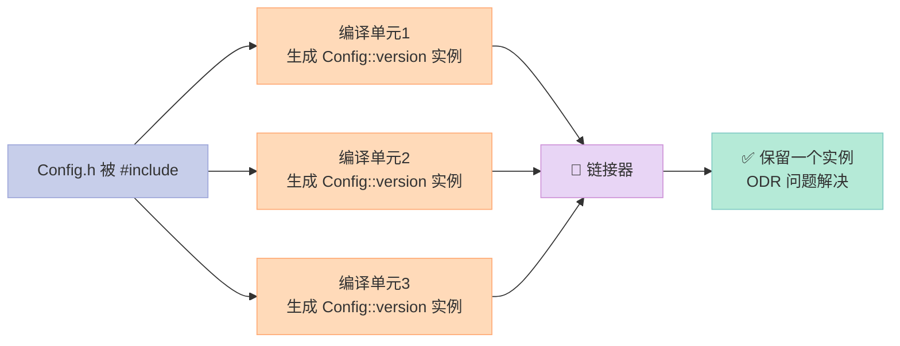
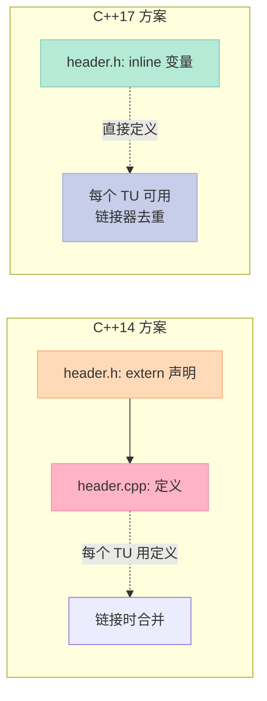

> 头文件里定义一个 `const` 变量就 ODR violation？模板静态成员变量要初始化还得跑到 .cpp 文件？C++17 的 inline 变量和全面进化的 constexpr 让这些问题统统成为历史。

## 一、ODR 难题：头文件定义变量的噩梦

你是否见过这样的错误？

```
undefined reference to 'Config::version'
multiple definition of 'Config::version'
```

这就是 **ODR（One Definition Rule）违规**。C++14 时代，头文件中定义变量是个禁区：

```cpp
// config.h (C++14 噩梦)
struct Config {
    static const int version = 1;        // 头文件里定义？
    static const std::string name;      // 字符串更麻烦
};

// config.cpp
const std::string Config::name = "MyApp";
```

如果你直接在头文件里给 `static const int` 赋值，在每个编译单元里都会生成一个实例，链接时就冲突了。

## 二、inline 变量：C++17 的救星

C++17 引入了 `inline` 变量，完美解决这个问题：

```cpp
// config.h (C++17 优雅方案)
struct Config {
    inline static int version = 1;
    inline static const char* name = "MyApp";
    inline static constexpr double PI = 3.14159265358979;
};
```



**原理**：inline 变量告诉链接器"多个编译单元可以定义同一个变量，保留一个就行"。

## 三、inline 的历史：C++98 就有 inline 函数

| 版本 | inline 支持范围 |
|------|----------------|
| C++98 | inline 函数 |
| C++17 | **inline 变量** |
| C++20 | inline 静态成员（与 C++17 等效） |

inline 函数从 C++98 就有了，原理类似：**允许在头文件中定义，链接时只保留一份实现**。

## 四、constexpr 全面进化

### C++14 vs C++17 constexpr 对比

| 特性 | C++11 | C++14 | C++17 |
|------|-------|-------|-------|
| constexpr 函数限制 | 单一 return 语句 | 多语句、局部变量 | **放宽更多** |
| constexpr lambda | ❌ | ❌ | **✅ 默认constexpr** |
| constexpr if | ❌ | ❌ | **✅** |
| constexpr 变参模板 | ❌ | ❌ | **✅** |
| constexpr 字符串 | ❌ | ❌ | **✅ (受限)** |

### constexpr lambda：Lambda 也能编译期求值

C++17 开始，所有 lambda 默认就是 constexpr：

```cpp
int main() {
    // C++17: lambda 默认 constexpr
    auto add = [](auto a, auto b) { return a + b; };
    
    // 编译期常量
    constexpr int result = add(1, 2);
    static_assert(add(1, 2) == 3, "lambda 计算要正确");
    
    // C++14 需要这样写:
    // auto add = [](auto a, auto b) constexpr { return a + b; };
}
```

### constexpr 变量模板：数学常数的现代写法

```cpp
#include <iostream>

template<typename T>
constexpr T pi = T(3.14159265358979323846);

int main() {
    std::cout << pi<double> << '\n';  // 3.14159...
    std::cout << pi<int> << '\n';     // 3 (被截断)
    
    // 编译期验证
    static_assert(pi<double> > 3.14, "pi 要足够精确");
}
```

### constexpr 函数进化：变参模板支持

C++17 之前，constexpr 函数不能使用变参模板：

```cpp
// C++14: constexpr 变参模板不合法
template<typename... Args>
constexpr auto sum(Args... args) = delete;  // 只能手动展开

// C++17: 完美支持
template<typename... Args>
constexpr auto sum(Args... args) {
    return (args + ...);  // 使用 fold expression
}

static_assert(sum(1, 2, 3, 4, 5) == 15);
```

## 五、应用场景

### 场景 1：静态配置常量

```cpp
// settings.h
struct Settings {
    inline static constexpr int MAX_CONNECTIONS = 100;
    inline static constexpr int TIMEOUT_MS = 5000;
    inline static const std::string VERSION = "1.0.0";  // const 也要 inline
};
```

### 场景 2：编译期数学计算

```cpp
#include <iostream>

// 编译期计算阶乘
constexpr int factorial(int n) {
    int result = 1;
    for (int i = 2; i <= n; ++i) {
        result *= i;
    }
    return result;
}

// 编译期斐波那契
constexpr int fib(int n) {
    if (n <= 1) return n;
    return fib(n-1) + fib(n-2);
}

int main() {
    // 编译期验证
    static_assert(factorial(5) == 120, "5! = 120");
    static_assert(fib(10) == 55, "fib(10) = 55");
    
    // 也可以运行时使用
    constexpr int f10 = fib(10);
    std::cout << "fib(10) = " << f10 << '\n';
}
```

### 场景 3：类型列表的编译期操作

```cpp
template<typename... Types>
struct TypeList {
    static constexpr std::size_t size = sizeof...(Types);
};

// C++17: 可以用 constexpr if 做类型过滤
template<typename T, typename... Types>
constexpr bool contains() {
    return ((std::is_same_v<T, Types>) || ...);
}

static_assert(contains<int, int, float, double>(), "int 在列表中");
static_assert(!contains<char, int, float>(), "char 不在列表中");
```

## 六、C++14 vs C++17 头文件写法对比

```cpp
// =============================================
// C++14 方案：需要 extern + cpp 文件
// =============================================

// database.h
struct DatabaseConfig {
    static extern const int MAX_CONNECTIONS;
    static extern const std::string HOST;
};

// database.cpp  (必须单独定义)
#include "database.h"
const int DatabaseConfig::MAX_CONNECTIONS = 100;
const std::string DatabaseConfig::HOST = "localhost";

// =============================================
// C++17 方案：inline 变量一步到位
// =============================================

// database.h
struct DatabaseConfig {
    inline static constexpr int MAX_CONNECTIONS = 100;
    inline static const std::string HOST = "localhost";  // string 也可以
};
```



## 七、实战：设计一个编译期配置类

```cpp
#include <iostream>
#include <array>

// 编译期配置
struct GameConfig {
    // inline 静态成员：头文件直接定义
    inline static constexpr int WIDTH = 800;
    inline static constexpr int HEIGHT = 600;
    inline static constexpr int FPS = 60;
    
    // constexpr 数组
    inline static constexpr std::array<int, 3> VERSION{1, 0, 0};
    
    // constexpr 成员函数
    constexpr int area() const { return WIDTH * HEIGHT; }
    constexpr bool is_valid_resolution() const {
        return WIDTH > 0 && HEIGHT > 0 && FPS > 0;
    }
};

int main() {
    constexpr GameConfig config;
    
    // 编译期验证
    static_assert(config.is_valid_resolution());
    static_assert(config.area() == 480000);
    
    // 运行时也可使用
    std::cout << "Resolution: " << GameConfig::WIDTH << "x" 
              << GameConfig::HEIGHT << "\n";
    std::cout << "Version: " << GameConfig::VERSION[0] << "."
              << GameConfig::VERSION[1] << "."
              << GameConfig::VERSION[2] << "\n";
}
```

---

> C++17 的 inline 变量解决了 C++ 程序员 decades 的痛点，而 constexpr 的全面进化让编译期计算更加强大。**头文件定义常量不再需要 extern + cpp 的曲线救国，lambda 也能参与编译期计算** — 现代 C++ 的工程实践因此优雅太多了。

**下一篇**：【C++17】Fold Expressions：变参模板的救星 — 看看 C++17 如何用折叠表达式让变参模板告别递归噩梦。
