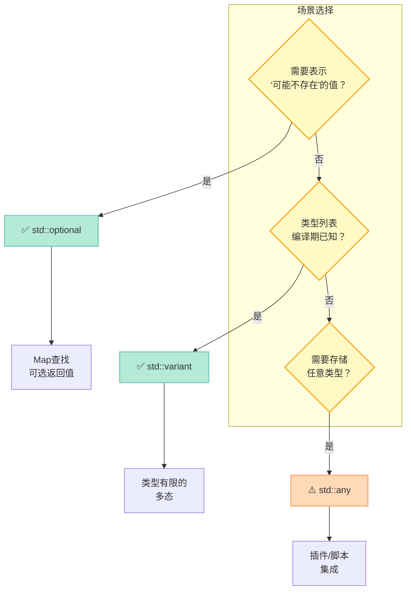

> C++ 以"类型安全"著称，但在 C++17 之前，**"值可能不存在"** 和 **"类型不确定"** 一直是痛点。std::optional / variant / any 就是答案。

## 前言

想象一个场景：你在写一个配置文件解析器，某些字段**可能存在，可能不存在**。传统做法是：

- 返回 `nullptr` —— 类型系统无法区分"合法的空值"和"错误"
- 返回 `std::pair<T, bool>` —— 笨拙，难以组合
- 抛出异常 —— 流程控制，异常用于"异常情况"

C++17 的三剑客给出了**优雅的答案**。

---

## 一、std::optional：表示"可能不存在"的值

### 1.1 基本用法

```cpp
std::optional<std::string> find_user(int id) {
    if (id > 0) return "user_" + std::to_string(id);
    return std::nullopt;  // 明确表示"不存在"
}

auto user = find_user(1);
if (user.has_value()) {
    std::cout << "Found: " << *user << "\n";
}
std::cout << "or: " << user.value_or("anonymous") << "\n";
```

### 1.2 与其他方案的对比

| 方案 | 类型安全 | 语法简洁 | 语义清晰 |
|------|---------|---------|---------|
| 返回 `nullptr` | ❌ `T*` vs `T` 混淆 | ✅ | ❌ 无法区分"合法空"和"错误" |
| 返回 `pair<T, bool>` | ✅ | ❌ 访问繁琐 | ❌ |
| 抛出异常 | ✅ | ❌ 流程被打断 | ❌ 只用于异常 |
| `std::optional<T>` | ✅ | ✅ | ✅ |

### 1.3 应用场景：Map 查询

```cpp
std::optional<int> get_value(const std::map<int,int>& m, int key) {
    auto it = m.find(key);
    if (it != m.end()) return it->second;
    return std::nullopt;
}

std::map<int,int> m{{1,10}, {2,20}};
if (auto val = get_value(m, 1)) {
    std::cout << "m[1] = " << *val << "\n";
}
```

---

## 二、std::variant：类型安全的 union

### 2.1 基本概念

`std::variant<A, B, C>` 是一个**类型安全的 union**——它持有 A/B/C 中**之一**，且**始终有效**（不像 union 需要自己追踪类型）。

```cpp
using Shape = std::variant<Circle, Rectangle>;

Shape c = Circle{2.0};
Shape r = Rectangle{3.0, 4.0};
```

### 2.2 std::visit： visitation 模式

如何处理不同类型？用 **`std::visit`** + **visitor 函数**：

```cpp
// 辅助类：将多个 lambda 合并为一个可调用对象
template<class... Ts> struct overload : Ts... { using Ts::operator()...; };
template<class... Ts> overload(Ts...) -> overload<Ts...>;

auto area = [](const Shape& s) {
    return std::visit(overload{
        [](const Circle& c) { return c.r * c.r * 3.14159; },
        [](const Rectangle& r) { return r.w * r.h; }
    }, s);
};
```

### 2.3 为什么不用 void* 或 union？

```cpp
// 传统 union 的问题
union Data {
    int i;
    double d;
    const char* s;
};
Data u;
u.d = 3.14;
// 你得自己记住 u 现在是 double，否则读取 u.i 会 UB
```

```cpp
// variant 的优势
std::variant<int, double, std::string> v = 3.14;
double x = std::get<double>(v);  // ✅ 编译期类型检查
double y = std::get<int>(v);     // ❌ 编译错误！
```

---

## 三、std::any：任意类型的容器

### 3.1 基本用法

```cpp
std::any a = 42;
std::cout << std::any_cast<int>(a) << "\n";

a = std::string("hello");
std::cout << std::any_cast<std::string&>(a) << "\n";
```

### 3.2 类型不安全，需要检查

```cpp
try {
    std::any_cast<double>(a);  // 现在 a 是 string，不是 double
} catch (const std::bad_any_cast& e) {
    std::cout << "bad_cast: " << e.what() << "\n";
}
```

> **与 variant 的区别**：variant 的类型列表是**编译期已知**的；any 的类型是**运行时**才确定的。

---

## 四、类型安全三剑客对比

| 维度 | std::optional | std::variant | std::any |
|------|--------------|-------------|----------|
| **用途** | 值可能不存在 | 类型列表已知的多态 | 类型完全不确定 |
| **类型安全** | ✅ 编译期 | ✅ 编译期 | ⚠️ 运行时检查 |
| **内存开销** | `sizeof(T) + 1` | 最大成员 + alignment | 动态分配 + type erasure |
| **访问方式** | `*`, `.value()`, `value_or()` | `std::visit` | `std::any_cast` |
| **空状态** | `std::nullopt` | ❌ 始终有效 | `std::any` (empty) |
| **典型场景** | 可选参数、缺失值 | 类型有限的联合 | 插件系统、脚本绑定 |

---

## 五、Mermaid 图：类型安全流程



---

## 六、bonus：std::string_view

虽然不是"三剑客"之一，但 `std::string_view` 是 C++17 另一个**零成本抽象**的代表：

```cpp
std::string s = "hello world";
std::string_view sv = s;  // 不复制！只是引用
sv.remove_prefix(6);      // "world"
sv.remove_suffix(1);       // "worl"
std::cout << "sv: " << sv << "\n";  // "worl"
```

> **警告**：`string_view` 不拥有数据，要注意生命周期——原字符串 `s` 必须保持有效。

---

## 七、完整可运行代码

```cpp
#include <iostream>
#include <optional>
#include <variant>
#include <any>
#include <string>
#include <map>
#include <vector>
#include <stdexcept>

// Helper for variant visitor
template<class... Ts> struct overload : Ts... { using Ts::operator()...; };
template<class... Ts> overload(Ts...) -> overload<Ts...>;

struct Circle { double r; };
struct Rectangle { double w, h; };

// === std::optional ===
std::optional<std::string> find_user(int id) {
    if (id > 0) return "user_" + std::to_string(id);
    return std::nullopt;
}

std::optional<int> get_value(const std::map<int,int>& m, int key) {
    auto it = m.find(key);
    if (it != m.end()) return it->second;
    return std::nullopt;
}

// === std::variant ===
using Shape = std::variant<Circle, Rectangle>;

double area(const Shape& s) {
    return std::visit(overload{
        [](const Circle& c) { return c.r * c.r * 3.14159; },
        [](const Rectangle& r) { return r.w * r.h; }
    }, s);
}

int main() {
    // === std::optional ===
    auto user = find_user(1);
    if (user.has_value()) {
        std::cout << "Found: " << *user << "\n";
    }
    std::cout << "or: " << user.value_or("anonymous") << "\n";
    
    // optional with map
    std::map<int,int> m{{1,10}, {2,20}};
    if (auto val = get_value(m, 1)) {
        std::cout << "m[1] = " << *val << "\n";
    }
    
    // === std::variant ===
    Shape c = Circle{2.0};
    Shape r = Rectangle{3.0, 4.0};
    std::cout << "circle area: " << area(c) << "\n";
    std::cout << "rect area: " << area(r) << "\n";
    
    // === std::any ===
    std::any a = 42;
    std::cout << std::any_cast<int>(a) << "\n";
    a = std::string("hello");
    std::cout << std::any_cast<std::string&>(a) << "\n";
    
    try {
        std::any_cast<double>(a);
    } catch (const std::bad_any_cast& e) {
        std::cout << "bad_cast: " << e.what() << "\n";
    }
    
    // === std::string_view ===
    std::string s = "hello world";
    std::string_view sv = s;  // no copy!
    sv.remove_prefix(6);  // "world"
    sv.remove_suffix(1);  // "worl"
    std::cout << "sv: " << sv << "\n";  // "worl"
    
    // string_view with substring search
    auto pos = sv.find("rl");
    std::cout << "found at: " << pos << "\n";
}
```

**编译验证**：

```bash
g++ -std=c++17 -o demo demo.cpp && ./demo
```

---

## 总结

| 工具 | 解决的问题 | 一句话总结 |
|------|---------|-----------|
| `std::optional<T>` | 值可能不存在 | **nullable value** — 类型安全的 `T*` 替代品 |
| `std::variant<...>` | 类型列表已知的多态 | **type-safe union** — 编译期穷尽检查 |
| `std::any` | 类型完全不确定 | **type erasure container** — 运行时类型安全 |

> **行动建议**：在 C++ 代码中，**优先用 `optional` 替代 `nullptr`**、用 **variant 替代 union**，只有在真正需要"任意类型"时才用 `any`。这三个工具让 C++ 的类型系统更加严密，bug 更难藏身。
