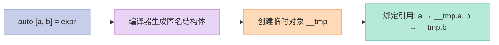

> 一行代码同时声明多个变量并绑定值？C++17 之前想都不敢想的事情，现在一行 `auto [a, b, c] = expr` 就能搞定。

## 一、痛点：为什么要结构绑定？

想象你要遍历一个 `std::map`：

```cpp
// C++14 时代的无奈
std::map<int, std::string> m = {{1, "one"}, {2, "two"}};

for (auto& kv : m) {
    // kv 是 pair<const int, string>&，想分别操作 key 和 value？
    // 你只能这样：
    const int& key = kv.first;
    const std::string& value = kv.second;
    // ...
}
```

**临时变量满天飞**，代码又臭又长。更别提 `std::tuple` 那让人崩溃的 `std::get<N>` 访问方式。

## 二、结构绑定三剑客：pair / tuple / array / struct

C++17 的结构绑定可以绑定 **四种类型**：

```cpp
#include <iostream>
#include <tuple>
#include <map>
#include <array>

struct Point { double x = 0, y = 0; };

int main() {
    // 1. pair 绑定
    std::pair p{1, 3.14};
    auto [a, b] = p;
    std::cout << a << ", " << b << "\n";  // 1, 3.14

    // 2. tuple 绑定
    std::tuple t{1, 2, 3};
    auto [x, y, z] = t;
    std::cout << x << ", " << y << ", " << z << "\n";  // 1, 2, 3

    // 3. array 绑定 (C++17 支持固定大小数组)
    std::array arr{1, 2, 3};
    auto [first, second, third] = arr;
    std::cout << first << ", " << second << ", " << third << "\n";  // 1, 2, 3

    // 4. struct 绑定 (仅限 public 成员，C++17)
    Point pt{1.0, 2.0};
    auto [px, py] = pt;
    std::cout << px << ", " << py << "\n";  // 1, 2
}
```

**注意**：C++17 绑定 struct 时，成员必须是 public 的。C++20 放宽了这个限制，支持绑定任何 aggregate 类型。

## 三、if/switch 中的结构绑定：一条语句搞定插入判断

这是结构绑定最优雅的用法——**在条件判断中直接解构**：

```cpp
std::map<int, std::string> m;

// if (初始化; 条件) — C++17 新语法
if (auto [it, inserted] = m.insert({1, "one"}); inserted) {
    std::cout << "插入成功: " << it->second << "\n";
} else {
    std::cout << "键已存在: " << it->second << "\n";
}

// switch 中同样适用
std::map<std::string, int> ages;
if (auto [result, found] = ages.emplace("Alice", 30); found) {
    // 使用 result 和 found
}
```

这比 C++14 的写法简洁太多了：

```cpp
// C++14: 必须先声明变量，再判断
auto result = m.insert({1, "one"});
if (result.second) {
    // ...
}
```

## 四、函数返回多值：tuple 的最佳拍档

以前返回多个值，要么用 `std::pair`，要么用输出参数，要么用结构体。现在：

```cpp
#include <tuple>

// 分解三位数：百位、十位、个位
std::tuple<int, int, int> divide(int n) {
    return {n / 100, n % 100 / 10, n % 10};
}

int main() {
    auto [hundreds, tens, ones] = divide(9527);
    std::cout << hundreds << ", " << tens << ", " << ones << "\n";
    // 输出: 9, 5, 7
    
    // 遍历 map 时绑定 key-value
    std::map<std::string, int> scores{{"Alice", 95}, {"Bob", 87}};
    for (auto [name, score] : scores) {
        std::cout << name << ": " << score << "\n";
    }
}
```

## 五、底层原理：编译器如何实现结构绑定？

**结构绑定只是语法糖**，编译器会把它展开成类似这样的代码：

```cpp
// 你写的代码:
auto [a, b] = std::pair{1, 3.14};

// 编译器展开后等价于:
struct __hidden {
    typename std::pair<int, double>::first_type a;
    typename std::pair<int, double>::second_type b;
    __hidden(std::pair<int, double>&& p) : a(p.first), b(p.second) {}
};
__hidden __tmp{std::pair{1, 3.14}};
auto& a = __tmp.a;
auto& b = __tmp.b;
```

也就是说：
1. 编译器生成一个**匿名的隐藏结构体**
2. 用它包装原始表达式
3. 然后引用其成员



## 六、C++11/14 vs C++17：方案对比

| 维度 | C++11/14 (std::tie) | C++17 (Structured Bindings) |
|------|---------------------|----------------------------|
| **声明方式** | 必须预先声明变量 | 直接在绑定时声明 |
| **代码量** | 需要多行 | 一行搞定 |
| **可读性** | 差，std::get 满天飞 | 好，变量名直观 |
| **类型推导** | 需手动指定或用 auto | 自动推导 |
| **const 绑定** | 需要 const 引用 | `const auto [a, b] = ...` |

```cpp
// C++11/14 方案
int a, b;
std::tie(a, b) = std::make_pair(1, 2);

// C++17 方案
auto [a, b] = std::make_pair(1, 2);
// 或者更简洁
std::pair p{1, 2};
auto [a, b] = p;
```

## 七、生命周期细节：这些坑你踩过吗？

结构绑定有几个容易出错的地方：

```cpp
// 1. 绑定到右值时，绑定的是临时对象的成员（延长生命周期）
auto [x, y] = std::make_pair(1, 2);  // OK，临时对象被延长生命周期

// 2. 但如果你在循环中绑定右值，要小心
std::vector<std::pair<int, int>> pairs;
for (auto [a, b] : pairs) {  // 注意：这里绑定的是拷贝
    // 修改 a, b 不会影响原始 pairs
}

// 3. 想修改原始值？用引用
for (auto& [a, b] : pairs) {
    b = 100;  // 会修改原始 pairs
}

// 4. 结构绑定不能和正则表达式混淆
std::tuple<int, int, int> t{1, 2, 3};
auto& [x, y, z] = t;  // 错误：不能对临时量绑定非常量引用
```

## 八、实战应用

### 应用 1：优雅地遍历 map

```cpp
std::map<std::string, std::vector<int>> data{
    {"Alice", {85, 90, 92}},
    {"Bob", {78, 81, 88}}
};

for (auto const& [name, scores] : data) {
    int sum = 0;
    for (int s : scores) sum += s;
    std::cout << name << ": " << sum / scores.size() << "\n";
}
```

### 应用 2：坐标分解

```cpp
struct Vec3 { double x, y, z; };

Vec3 cross(Vec3 const& a, Vec3 const& b) {
    auto [ax, ay, az] = a;
    auto [bx, by, bz] = b;
    return {ay * bz - az * by, az * bx - ax * bz, ax * by - ay * bx};
}
```

### 应用 3：解构函数返回值

```cpp
auto [ok, value] = db.query("SELECT * FROM users WHERE id = 1");
if (ok) {
    std::cout << value.name << "\n";
}
```

---

> 结构绑定让代码**表意更清晰**，变量声明和使用自然地融为一体。忘掉 `std::tie` 吧，`auto [a, b, c]` 才是现代 C++ 该有的样子。

**下一篇**：【C++17】if constexpr：编译期分支的终极武器 — 看看 C++17 如何用 `if constexpr` 淘汰 SFINAE。
