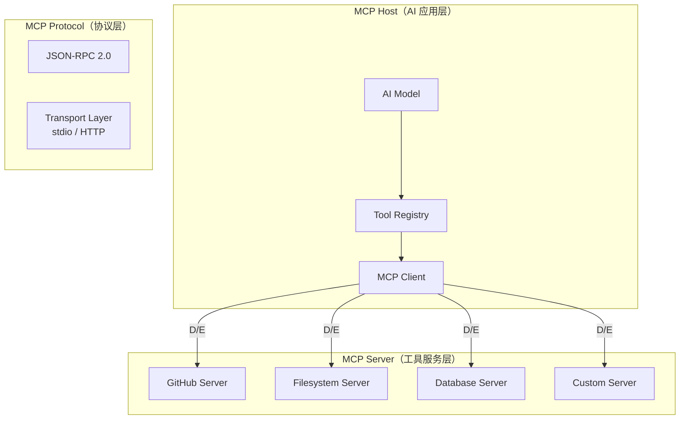
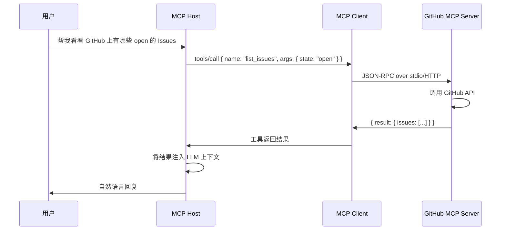

## 引子

用过 AI 助手的人大概都有过这种体验：问 AI 一个需要实时数据的问题，它要么编造答案，要么说"我不知道"。问题不在于 AI 不够聪明，而在于它被关在了一个信息孤岛里——没有文件系统访问权限、不能查 GitHub Issues、不能调数据库、不能连第三方 API。

**MCP（Model Context Protocol）** 正是来解决这个问题的。它是 Anthropic 在 2024 年末开源的协议，目标是让 AI 模型能够以标准化的方式调用外部工具和数据源。本文将深入解析 MCP 的设计理念、架构机制，并重点介绍它在主流 AI 平台中的实现方式。

## MCP 是什么

MCP 是一个开放协议，定义了 **AI 应用（Host）与外部工具服务（Server）之间的通信标准**。

打个比方：如果把 AI 助手比作一个"大脑"，那 MCP 就是它的"手"——通过这个标准化的接口，大脑可以控制各种手（工具）来完成任务。

### 核心设计哲学

MCP 解决的是 AI 工具集成的三个根本矛盾：

1. **每家平台都重复造轮子**：OpenAI 有 plugins，Anthropic 有 tool use，各家自建标准，开发者为每个平台都要适配一次。
2. **工具定义格式混乱**：有的用 JSON Schema，有的用自然语言描述，解析成本高，跨平台迁移几乎不可能。
3. **状态管理缺失**：传统工具调用是"无状态"的，工具之间无法共享上下文。

MCP 的思路是：定义一个**统一的传输层和接口层**，让任何 MCP-compatible Server 可以被任何 MCP-compatible Host 调用。

## 架构分析

### 三层架构



**Host 层**：运行 AI 模型的应用程序（如 Claude Desktop、Hermes Agent），负责管理对话上下文、决定何时调用工具。

**Protocol 层**：基于 JSON-RPC 2.0 定义了标准化的请求/响应格式，支持两种传输方式：
- **Stdio**：通过标准输入/输出通信，适合本地进程
- **HTTP/StreamableHTTP**：适合远程服务

**Server 层**：具体的工具提供者，每个 Server 暴露一组可调用的 Tools（以及可选的 Resources 和 Prompts）。

### 工具发现机制

MCP 的核心创新之一是**动态工具发现**：

```
Host ──list_tools()──► Server
Host ◄──[{"name": "read_file", "description": "...", "inputSchema": {...}}, ...]── Server
```

AI 模型不需要事先知道工具的实现细节，只需通过标准化的 schema 理解每个工具的：
- **名称**（name）：唯一标识符
- **描述**（description）：AI 能否理解这个工具的用途
- **输入模式**（inputSchema）：工具需要什么参数

这种设计让新增工具完全不需要修改 Host 代码——只要 Server 启动并声明自己的能力，Host 就能自动发现并使用它们。

### 消息类型

MCP 定义了三种核心消息类型：

| 消息类型 | 方向 | 用途 |
|---------|------|------|
| `initialize` | Host → Server | 建立连接，交换协议版本 |
| `tools/list` | Host → Server | 列举可用工具 |
| `tools/call` | Host → Server | 调用具体工具 |
| `resources/list` | Host → Server | 列举可访问资源 |
| `sampling/createMessage` | Server → Host | Server 请求 LLM 推理 |

## 核心机制详解

### 工具调用流程

当用户问"帮我看看 GitHub 上有哪些 open 的 Issues"时，MCP 的完整调用链如下：



关键点在于：**工具的原始输出被自动注入到 LLM 的上下文窗口**，LLM 再用自然语言组织成回复，用户感知到的就是 AI"会"查 GitHub 了。

### 安全隔离机制

MCP 对 stdio 传输模式的处理尤其值得注意。默认情况下，Host **不会**把完整环境变量传给 MCP Server——只有 PATH、HOME 等基础变量会被保留。

如果要传 API Key，必须在配置中显式声明：

```yaml
mcp_servers:
  github:
    command: "npx"
    args: ["-y", "@modelcontextprotocol/server-github"]
    env:
      GITHUB_PERSONAL_ACCESS_TOKEN: "ghp_xxx"  # 显式注入
```

这防止了第三方 MCP Server 意外读取敏感凭证。

### Sampling：Server 也可以调用 LLM

MCP 还支持一种反向调用：**Server 向 Host 请求 LLM 推理**（`sampling/createMessage`）。这使得"Agent 环"成为可能：

- MCP Server 发现复杂情况，请示 Host 的 LLM 做决策
- LLM 决策后再通过 MCP 调用其他工具
- 多 Server 协作时，可以形成事实上的多 Agent 系统

## 实现对比

### Anthropic MCP vs OpenAI plugins vs LangChain Tools

| 维度 | Anthropic MCP | OpenAI Plugins | LangChain Tools |
|------|--------------|-----------------|-----------------|
| **标准化程度** | 开放协议，跨平台 | 平台绑定（ChatGPT only） | 框架绑定 |
| **传输方式** | Stdio + HTTP | HTTP only | Python 直接调用 |
| **工具发现** | 动态发现 | 静态注册 | 静态注册 |
| **安全模型** | 显式凭证注入 | OAuth 流程 | 直接暴露 Key |
| **多 Agent 支持** | Sampling 原生支持 | 无 | 多 Agent 需自行实现 |

MCP 的核心优势在于**真正的开放性**：Server 实现不依赖任何特定框架，任何语言都可以实现 MCP Server。目前已有 Python、TypeScript、Go、Rust 等多种语言的 SDK。

### Hermes Agent 的 MCP 实现：native-mcp

在 Hermes Agent 中，MCP Client 是**内置**的，无需额外桥接程序。MCP Server 的工具发现和注册发生在 Agent 启动时：

```python
# 伪代码：Hermes Agent 启动流程
def discover_mcp_tools():
    config = load_config("~/.hermes/config.yaml")
    for server_name, server_config in config["mcp_servers"].items():
        client = MCPClient(transport=server_config.transport)
        tools = client.list_tools()
        for tool in tools:
            register_tool(f"mcp_{server_name}_{tool.name}", tool)
```

配置简单到只需在 `config.yaml` 中声明：

```yaml
mcp_servers:
  filesystem:
    command: "npx"
    args: ["-y", "@modelcontextprotocol/server-filesystem", "/home/user/docs"]
  github:
    command: "npx"
    args: ["-y", "@modelcontextprotocol/server-github"]
    env:
      GITHUB_PERSONAL_ACCESS_TOKEN: "ghp_xxx"
```

工具注册后，命名遵循 `mcp_{server}_{tool}` 模式，如 `mcp_filesystem_read_file`、`mcp_github_list_issues`。这种命名空间隔离确保了不同 Server 的工具不会冲突。

## 使用指南

### 快速上手：连接一个 MCP Server

**Step 1：安装 MCP SDK**

```bash
pip install mcp
```

**Step 2：配置 Server**

编辑 `~/.hermes/config.yaml`：

```yaml
mcp_servers:
  time:
    command: "uvx"
    args: ["mcp-server-time"]
```

**Step 3：重启 Hermes Agent**

重启后观察日志，应该能看到类似输出：

```
[MCP] Connected to server 'time'
[MCP] Discovered 1 tool: mcp_time_get_current_time
```

**Step 4：直接使用**

现在你可以对 Hermes Agent 说："现在几点？" 它会自动调用 `mcp_time_get_current_time` 工具。

### 进阶：多 Server 组合

一个典型的工程环境配置：

```yaml
mcp_servers:
  filesystem:
    command: "npx"
    args: ["-y", "@modelcontextprotocol/server-filesystem", "/home/user/projects"]
    timeout: 30

  github:
    command: "npx"
    args: ["-y", "@modelcontextprotocol/server-github"]
    env:
      GITHUB_PERSONAL_ACCESS_TOKEN: "ghp_xxx"
    timeout: 60

  sqlite:
    command: "npx"
    args: ["-y", "@modelcontextprotocol/server-sqlite", "/data/app.db"]
    timeout: 120
```

这样配置后，AI 可以同时访问文件系统、GitHub API 和数据库，三者的工具命名空间独立，互不干扰。

### 自定义 MCP Server

如果你有私有 API 或特殊需求，可以用任何语言实现 MCP Server。Python 示例：

```python
from mcp.server.fastmcp import FastMCP

mcp = FastMCP("my-api")

@mcp.tool()
def query_database(sql: str) -> list[dict]:
    # 执行 SQL 查询并返回结果
    return db.execute(sql)

mcp.run()  # 启动 stdio 服务
```

Server 启动后，同样通过 `npx` 或 `uvx` 接入 Host。

## 趋势与思考

### MCP 的生态现状

MCP 最大的贡献是**把工具生态的门槛降到了零**。传统方式下，一个 AI 平台要接入 GitHub，需要平台官方主动对接；有了 MCP，任何人都可以写一个 Server，让任何 MCP-compatible Host 使用。

目前官方维护的 Server 包括：
- `server-filesystem`：文件系统访问
- `server-github`：GitHub API
- `server-sqlite`：本地数据库
- `server-slack`：Slack 消息
- `server-everything`：Brave 搜索

社区则贡献了服务器、数据库、云服务等数百种 Server。

### 局限性

MCP 不是银弹，有几个现实问题：

1. **Server 质量参差不齐**：社区 Server 缺乏统一测试，某些边界情况可能出问题。
2. **认证标准缺失**：目前凭证靠 `env` 明文传递，大规模使用时密钥管理是痛点。
3. **调试困难**：stdio 模式下，Server 的错误信息不容易追踪。

### 未来展望

随着 MCP 生态成熟，我们可以预期：
- **标准化认证框架**：类似 OAuth 的 MCP-native 授权流程
- **Server 注册市场**：类似 npm 的 MCP Server 发现和分发平台
- **多模型统一接入**：同一个 MCP Server 被不同厂商的 Host 调用

MCP 正在成为 AI 工具互联的事实标准。掌握它，就掌握了让 AI 连接真实世界的钥匙。

---

*如果你对某个具体 MCP Server 的使用有疑问，或者想了解如何写一个自定义 MCP Server，欢迎在评论区留言。*
