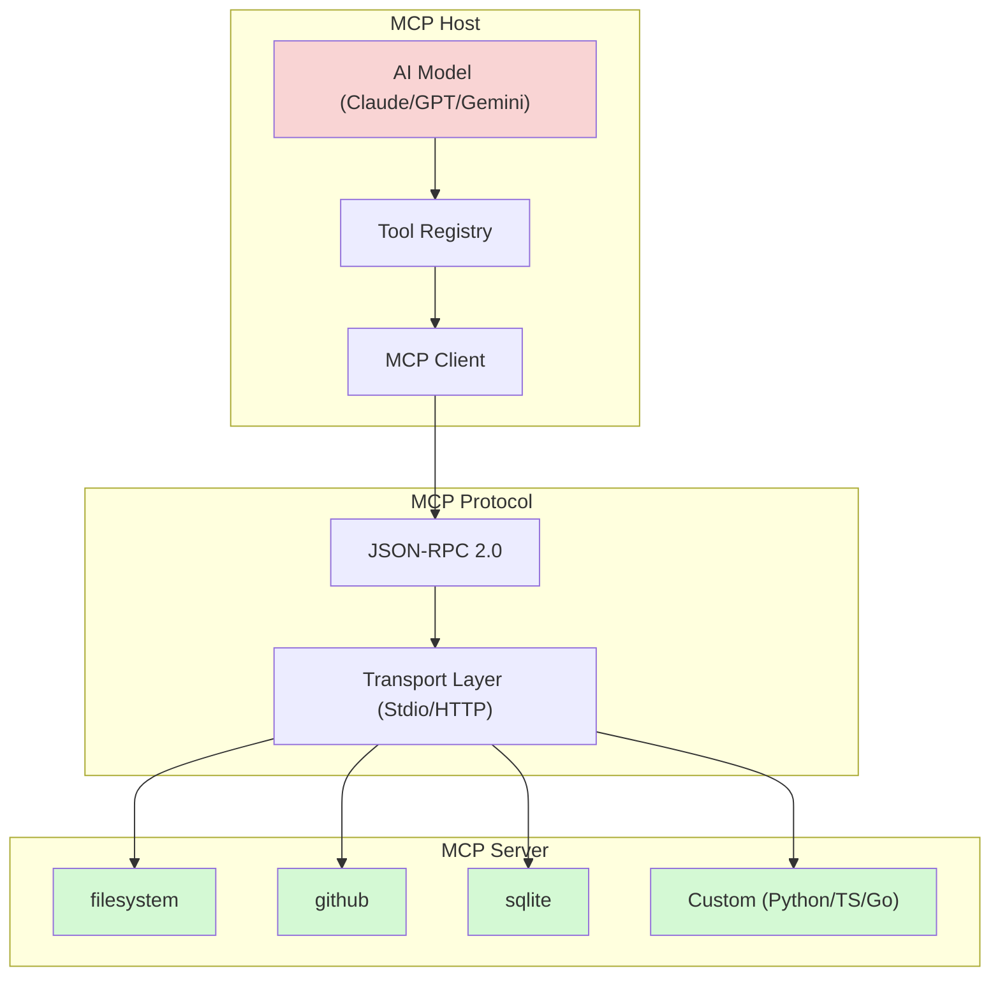
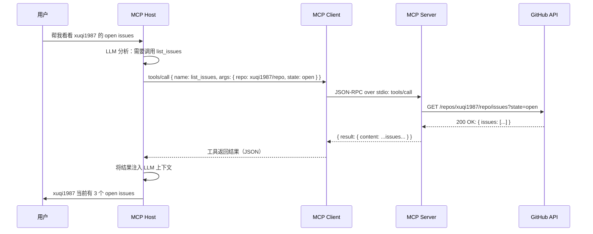
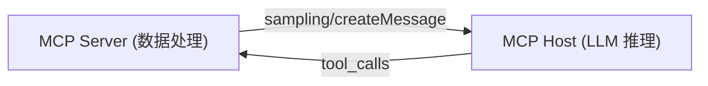

## 引子

用过 AI 助手的人大概都有过这种体验：问 AI 一个需要实时数据的问题，它要么编造答案，要么说"我不知道"。问题不在于 AI 不够聪明，而在于它被关在了一个信息孤岛里——没有文件系统访问权限、不能查 GitHub Issues、不能调数据库、不能连第三方 API。

**MCP（Model Context Protocol）** 正是来解决这个问题的。它是 Anthropic 在 2024 年末开源的协议，目标是让 AI 模型能够以标准化的方式调用外部工具和数据源。本文将深入解析 MCP 的设计理念、架构机制，并重点介绍它在主流 AI 平台中的实现方式。

## MCP 是什么

MCP 是一个开放协议，定义了 **AI 应用（Host）与外部工具服务（Server）之间的通信标准**。

打个比方：如果把 AI 助手比作一个"大脑"，那 MCP 就是它的"手"——通过这个标准化的接口，大脑可以控制各种手（工具）来完成任务。

### 核心设计哲学

MCP 解决的是 AI 工具集成的三个根本矛盾：

1. **每家平台都重复造轮子**：OpenAI 有 plugins，Anthropic 有 tool use，各家自建标准，开发者为每个平台都要适配一次。
2. **工具定义格式混乱**：有的用 JSON Schema，有的用自然语言描述，解析成本高，跨平台迁移几乎不可能。
3. **状态管理缺失**：传统工具调用是"无状态"的，工具之间无法共享上下文。

MCP 的思路是：定义一个**统一的传输层和接口层**，让任何 MCP-compatible Server 可以被任何 MCP-compatible Host 调用。

## 快速上手：一个可运行的 MCP Server

先看一个完整可运行的例子，感受一下 MCP 的实际用法。下面的 Python 代码实现了一个简单的 MCP Server，支持两个工具：**加法**和**减法**。

```python
# server.py
# 运行方式：pip install mcp && python server.py

from mcp.server.fastmcp import FastMCP

# 实例化一个名为 "calculator" 的 MCP Server
mcp = FastMCP("calculator")


@mcp.tool()
def add(a: int, b: int) -> int:
    """两个整数相加，返回结果"""
    return a + b


@mcp.tool()
def subtract(a: int, b: int) -> int:
    """从 a 中减去 b，返回结果"""
    return a - b


if __name__ == "__main__":
    # 启动 Server，以 stdio 模式运行（通过标准输入输出通信）
    mcp.run()
```

就是这么简单。`@mcp.tool()` 装饰的方法会自动注册为 MCP 工具，参数类型和 docstring 会被 MCP 协议用来生成工具的 inputSchema——Host 无需额外配置就能知道这个工具需要什么参数。

运行这个 Server：

```bash
pip install mcp
python server.py
```

Server 启动后，会通过 stdio 接收 JSON-RPC 请求。这就是 MCP 的核心使用模式。

### 工具发现的原理

当 Host 调用 `tools/list` 时，Server 返回的工具列表结构是这样的：

```python
# Server 内部生成的 inputSchema（自动从函数签名推导）
{
    "name": "add",
    "description": "两个整数相加，返回结果",
    "inputSchema": {
        "type": "object",
        "properties": {
            "a": {"type": "integer"},
            "b": {"type": "integer"}
        },
        "required": ["a", "b"]
    }
}
```

这就是为什么 MCP 能够做到**动态工具发现**——工具的参数信息完全来自代码本身，不需要额外的配置文件或注册步骤。

## 架构分析

### 三层架构



**Host 层**：运行 AI 模型的应用程序（如 Claude Desktop、Hermes Agent）。负责管理对话上下文、决定何时调用工具。

**Protocol 层**：基于 JSON-RPC 2.0，定义了标准化的请求/响应格式，支持两种传输方式：
- **Stdio**：通过标准输入/输出通信，适合本地进程，延迟最低
- **HTTP/StreamableHTTP**：适合远程服务，可以跨机器调用

**Server 层**：具体的工具提供者，每个 Server 暴露一组 Tools、Resources 和 Prompts。

### 完整的工具调用流程

下面是一个真实的工具调用序列图，展示了从用户提问到获得结果的全过程：



### 两种传输方式的对比

| 传输方式 | 适用场景 | 延迟 | 配置复杂度 |
|---------|---------|------|-----------|
| **Stdio** | 本地进程，同机器通信 | 极低（进程间通信） | 简单，命令+参数 |
| **HTTP** | 远程服务，跨机器 | 中等（网络延迟） | 需要 URL + headers |

## 核心机制详解

### 动态工具发现

MCP 的核心创新之一是**动态工具发现**。传统方式下，工具列表是写死在代码里的；MCP 则是 Server 启动时动态声明自己的能力。

```python
# Host 端（展示原理的可运行代码）
import subprocess, json

def list_tools(server_command, server_args):
    """通过 stdio 向 Server 发送 list_tools 请求"""
    request = {
        "jsonrpc": "2.0",
        "id": 1,
        "method": "tools/list",
        "params": {}
    }
    
    # 启动 Server 子进程
    proc = subprocess.Popen(
        [server_command] + server_args,
        stdin=subprocess.PIPE,
        stdout=subprocess.PIPE,
        stderr=subprocess.PIPE,
    )
    
    # 发送 JSON-RPC 请求
    stdout, _ = proc.communicate(
        input=json.dumps(request).encode()
    )
    
    # 解析响应
    response = json.loads(stdout)
    return response["result"]["tools"]

# 使用示例：
# tools = list_tools("python", ["my_server.py"])
# print(tools)
# 返回: [{"name": "add", ...}, {"name": "subtract", ...}]
```

AI 模型拿到这个工具列表后，只需要看 `name`、`description` 和 `inputSchema`，就能理解每个工具是做什么的、以及如何调用它。

### 安全隔离机制

MCP 对 stdio 传输模式的处理尤其值得注意。默认情况下，Host **不会**把完整环境变量传给 MCP Server——只有 PATH、HOME 等基础变量会被保留。

```yaml
# config.yaml — 显式注入敏感凭证
mcp_servers:
  github:
    command: "npx"
    args: ["-y", "@modelcontextprotocol/server-github"]
    env:
      GITHUB_PERSONAL_ACCESS_TOKEN: "ghp_xxx"  # 只有这里声明的变量才会传过去
```

这防止了第三方 MCP Server 意外读取用户的敏感环境变量。

### Sampling：Server 也可以调用 LLM

MCP 还支持一种反向调用：**Server 向 Host 请求 LLM 推理**（`sampling/createMessage`）。这使得"Agent 环"成为可能：



典型的使用场景：MCP Server 发现数据异常，请示 LLM 做决策，LLM 返回决策后再触发下一步操作。这种模式是多 Agent 协作的基础。

## 对比分析：设计差异（非功能罗列）

### MCP vs OpenAI Plugins vs LangChain Tools

很多人会对比功能列表（支不支持文件访问、支不支持 GitHub 等），但这没有意义——功能是 Server 决定的，不是协议决定的。真正体现设计差异的是**架构思路**。

**OpenAI Plugins**：中心化设计
- OpenAI 定义协议，ChatGPT 是唯一 Host
- 工具以 HTTP API 形式提供（不是进程）
- 认证靠 OAuth，用户手动授权
- **设计思路**：平台把工具当成"插件"，让用户去适应平台

**LangChain Tools**：框架绑定设计
- 工具是 Python 函数，注册到 LangChain 框架
- 只能在 LangChain 环境内使用
- 跨框架迁移需要重写所有 Tool 定义
- **设计思路**：把工具当成"函数"，框架决定一切

**MCP**：去中心化开放协议
- 协议完全开放，任何厂商都可以实现
- Server 是独立进程，Host 不需要知道工具实现细节
- 工具发现是动态的，不需要框架参与
- **设计思路**：协议即标准，工具的提供方和使用方完全解耦

### 核心设计差异总结

| 维度 | OpenAI Plugins | LangChain Tools | MCP |
|------|---------------|----------------|-----|
| **协议归属** | OpenAI 私有 | LangChain 私有 | 开放标准（Anthropic 开源）|
| **Host 绑定** | 只能 ChatGPT | 只能 LangChain 生态 | 任何 MCP 兼容应用 |
| **工具载体** | HTTP API | Python 函数 | 独立进程（Server）|
| **认证模式** | OAuth 手动授权 | 直接传 API Key | 显式 env 注入 |
| **工具发现** | 静态注册 | 静态注册 | 动态发现 |
| **跨平台复用** | 不支持 | 不支持 | 完全支持 |

### Hermes Agent 的 native-mcp 实现

在 Hermes Agent 中，MCP Client 是**内置**的，无需额外桥接程序。配置方式：

```yaml
# ~/.hermes/config.yaml
mcp_servers:
  time:
    command: "uvx"
    args: ["mcp-server-time"]
  
  filesystem:
    command: "npx"
    args: ["-y", "@modelcontextprotocol/server-filesystem", "/home/user/docs"]
  
  github:
    command: "npx"
    args: ["-y", "@modelcontextprotocol/server-github"]
    env:
      GITHUB_PERSONAL_ACCESS_TOKEN: "ghp_xxx"
```

重启 Hermes Agent 后，工具自动注册，命名遵循 `mcp_{server}_{tool}` 模式：

```text
mcp_time_get_current_time    # 获取当前时间
mcp_filesystem_read_file     # 读文件
mcp_github_list_issues      # 查 GitHub Issues
```

## 优缺点分析

### 优点

**架构层面**：
- **真正的开放标准**：协议开源，任何人都可以实现，不被任何厂商锁定
- **Host / Server 解耦**：Server 可以独立演进，Host 不需要任何修改
- **动态发现机制**：新增工具不需要改 Host 代码，Server 启动即上线
- **跨平台复用**：同一个 Server 可以被 Claude Desktop、Hermes、Cursor 等多种 Host 使用

**扩展性层面**：
- **语言无关**：Server 可以用 Python、TypeScript、Go、Rust 任何语言实现
- **传输无关**：可以切换 stdio / HTTP 而不改 Server 逻辑
- **命名空间隔离**：工具以 `mcp_{server}_{tool}` 命名，不同 Server 工具不冲突

**易用性层面**：
- **配置极简**：几行 YAML 即可连接一个 MCP Server
- **SDK 完善**：官方提供 Python/TypeScript SDK，5 行代码即可创建工具
- **生态丰富**：官方 + 社区已有数百个现成 Server，拿来就用

### 缺点

**性能 / 复杂度层面**：
- **进程开销**：每个 Server 都是独立进程，资源占用比直接函数调用高
- **网络延迟**：HTTP 模式下有网络开销，不适合 ultra-low latency 场景
- **调试困难**：stdio 模式下 Server 的错误输出不容易捕获，排查问题耗时

**维护性层面**：
- **版本碎片化**：社区 Server 质量参差不齐，部分维护不善
- **认证标准缺失**：目前凭证靠 env 明文传递，大规模使用时密钥管理是痛点
- **SDK 成熟度**：部分语言的 MCP SDK 还在早期阶段，某些边界情况处理不完善
- **运维复杂度**：多 Server 环境下，进程管理、日志收集、监控告警都需要额外考虑

## 使用指南

### 方式一：用 npx / uvx 直接运行官方 Server

不需要写代码，直接用官方提供的 Server：

```bash
# 文件系统访问（Node.js 环境）
npx -y @modelcontextprotocol/server-filesystem /tmp

# 时间服务（Python 环境）
uvx mcp-server-time

# GitHub API（需要 GITHUB_PERSONAL_ACCESS_TOKEN）
GITHUB_PERSONAL_ACCESS_TOKEN=ghp_xxx npx -y @modelcontextprotocol/server-github
```

### 方式二：写一个自己的 MCP Server（完整可运行）

下面是一个更完整的例子，实现了一个**天气查询 MCP Server**：

```python
# weather_server.py
# 依赖：pip install mcp requests
import requests
from mcp.server.fastmcp import FastMCP

mcp = FastMCP("weather")


@mcp.tool()
def get_weather(city: str) -> str:
    """
    查询给定城市的当前天气。
    Args:
        city: 城市名称，例如 "上海"、"Beijing"、"Tokyo"
    Returns:
        格式化的天气描述字符串
    """
    url = f"https://wttr.in/{city}?format=j1"
    resp = requests.get(url, timeout=5)
    data = resp.json()
    current = data["current_condition"][0]
    temp = current["temp_C"]
    desc = current["weatherDesc"][0]["value"]
    humidity = current["humidity"]
    return f"{city}：{desc}，温度 {temp}°C，湿度 {humidity}%"


@mcp.tool()
def get_forecast(city: str, days: int = 3) -> str:
    """
    查询给定城市未来几天的天气预报。
    Args:
        city: 城市名称
        days: 预报天数，1-3，默认3
    Returns:
        格式化天气预报字符串
    """
    url = f"https://wttr.in/{city}?format=j1"
    resp = requests.get(url, timeout=5)
    data = resp.json()
    lines = [f"{city} 天气预报："]
    for i in range(min(days, 3)):
        day = data["weather"][i]
        max_temp = day["maxtempC"]
        min_temp = day["mintempC"]
        desc = day["weatherDesc"][0]["value"]
        lines.append(f"  第{i+1}天：{desc}，{min_temp}~{max_temp}°C")
    return "\n".join(lines)


if __name__ == "__main__":
    mcp.run()
```

运行：

```bash
pip install mcp requests
python weather_server.py
```

### 方式三：在 Hermes Agent 中配置 MCP Server

```yaml
# ~/.hermes/config.yaml
mcp_servers:
  weather:
    command: "python"
    args: ["/path/to/weather_server.py"]
    timeout: 30
```

重启后，Hermes Agent 会自动发现 `mcp_weather_get_weather` 和 `mcp_weather_get_forecast` 两个工具。

### 进阶：HTTP 传输模式（远程 MCP Server）

如果 Server 部署在远程机器上，可以用 HTTP 传输：

```yaml
mcp_servers:
  remote_tools:
    url: "https://mcp.example.com/mcp"
    headers:
      Authorization: "Bearer sk-xxx"
    timeout: 180
    connect_timeout: 30
```

Server 端也需要以 HTTP 模式启动（MCP SDK 1.0+ 支持）：

```python
# server.py
from mcp.server.fastmcp import FastMCP
mcp = FastMCP("my-server")

@mcp.tool()
def do_something(arg: str) -> str:
    return f"结果：{arg}"

if __name__ == "__main__":
    mcp.run(transport="http", port=8080)
```

## 趋势与思考

### MCP 的生态现状

MCP 最大的贡献是**把工具生态的门槛降到了零**。传统方式下，一个 AI 平台要接入 GitHub，需要平台官方主动对接；有了 MCP，任何人都可以写一个 Server，让任何 MCP-compatible Host 使用。

目前官方维护的 Server 包括：
- `server-filesystem`：文件系统访问
- `server-github`：GitHub API 完整封装
- `server-sqlite`：本地数据库
- `server-slack`：Slack 消息
- `server-everything`：Brave 搜索
- `server-memory`：跨会话记忆存储

社区则贡献了数据库、云服务、IoT 设备等数百种 Server。

### 局限性

1. **Server 质量参差不齐**：社区 Server 缺乏统一测试，某些边界情况可能出问题。
2. **认证标准缺失**：目前凭证靠 `env` 明文传递，大规模使用时密钥管理是痛点。
3. **调试困难**：stdio 模式下，Server 的错误信息不容易追踪，生产环境排障耗时。
4. **性能开销**：每个 Server 一个进程，对于工具数量极多的场景，进程管理复杂度上升。

### 未来展望

随着 MCP 生态成熟，我们可以预期：

- **标准化认证框架**：类似 OAuth 的 MCP-native 授权流程，密钥管理不用再靠 env 手工传递
- **Server 注册市场**：类似 npm 的 MCP Server 发现和分发平台，查找和集成更方便
- **多模型统一接入**：同一个 MCP Server 被不同厂商的 Host 调用，一次实现，处处运行
- **Server 组合**：多个轻量 Server 按需组合，像搭积木一样构建 AI 能力

MCP 正在成为 AI 工具互联的事实标准。掌握它，就掌握了让 AI 连接真实世界的钥匙。

---

*项目链接：https://github.com/modelcontextprotocol*
