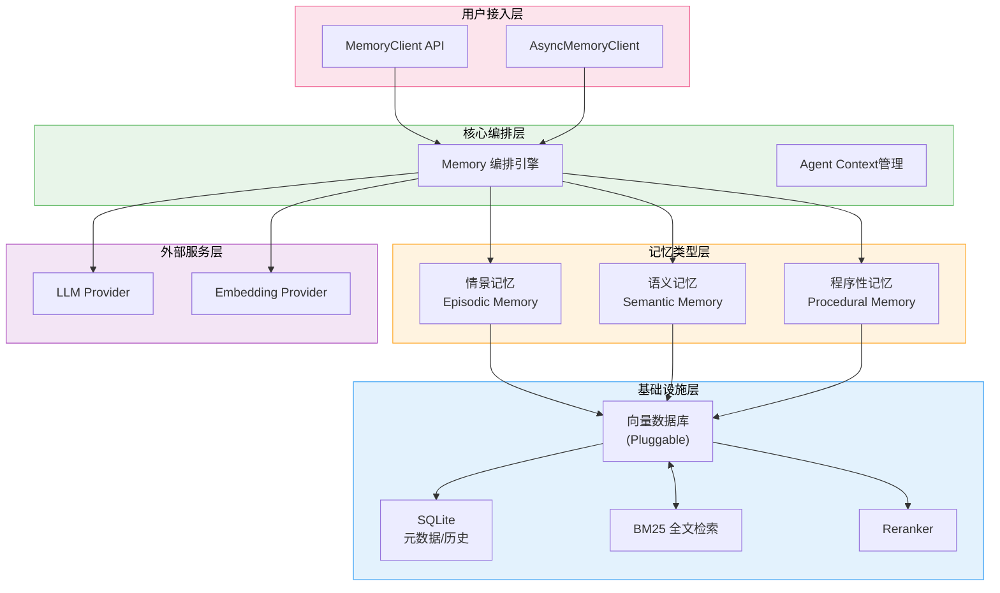
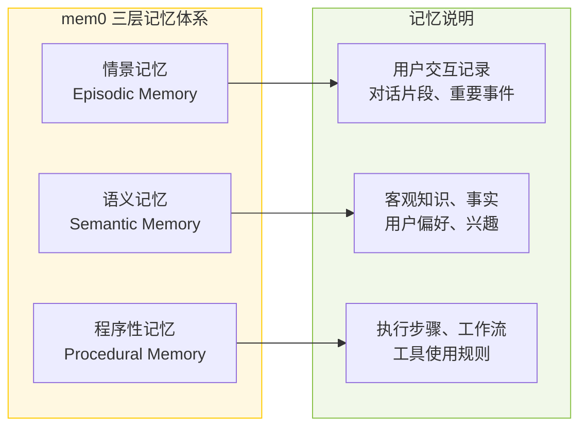
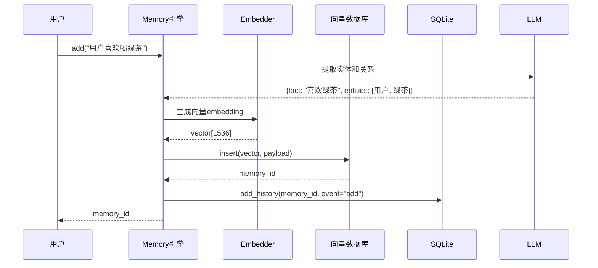
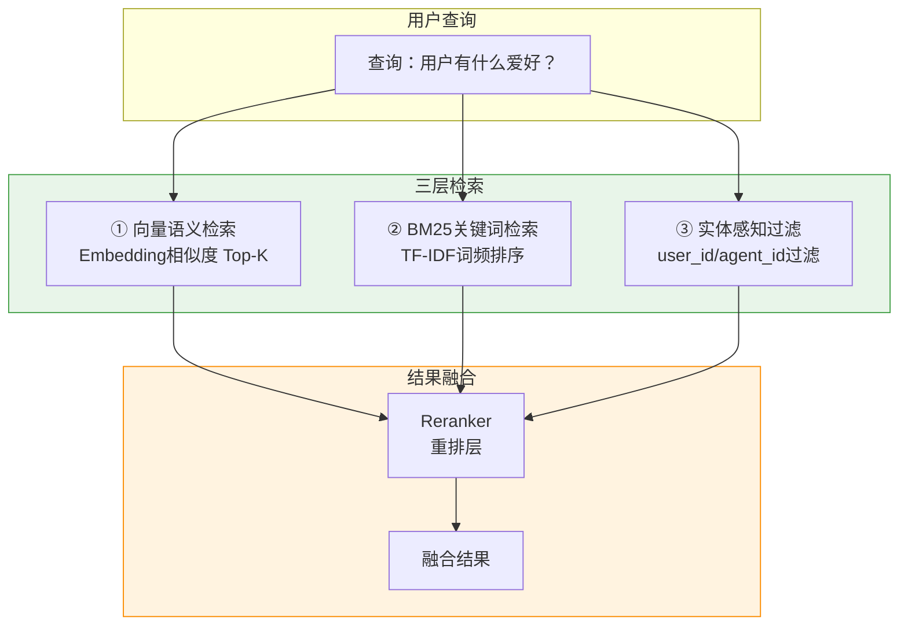

# mem0——为AI Agent打造的Universal Memory Layer深度解读

> 为什么你的AI助手总是"记不住"你上次说的话？为什么每次新建对话，它就像失忆了一样？mem0（53K stars）试图解决这个AI记忆难题。它是目前GitHub上最活跃的AI Agent记忆层开源项目。本文从架构、机制、原理三个层面做深度解析。

---

## 引子：为什么AI需要记忆层

大语言模型（LLM）本质上是一个**无状态的概率模型**——每一次新的对话上下文，模型都从零开始。但现实世界的AI应用几乎都依赖**上下文积累**：

- 私人助理需要记住你的偏好、习惯、历史交互
- 研究助手需要跨session保留调研资料和思路
- 客服机器人需要知道用户的历史问题和服务记录
- 代码助手需要记住项目结构和编码风格

这催生了一个专门解决AI记忆问题的项目——**mem0**，定位为AI Agent的Universal Memory Layer。

---

## 一、项目定位

### 1.1 解决什么问题

mem0解决的核心问题是：**为AI Agent提供持久化、跨会话、个性化记忆能力**。

它的设计哲学是：
> *"Every AI agent needs memory. mem0 provides a unified API for that."*

三个关键词：
- **持久化**：记忆不只存在于当前对话，可跨session保留
- **多层次**：支持情景记忆、语义记忆、程序性记忆三种类型
- **即插即用**：一套API，对接多种向量存储和LLM后端

### 1.2 基本信息

| 指标 | 数值 |
|------|------|
| GitHub | [mem0ai/mem0](https://github.com/mem0ai/mem0) |
| Stars | 53.9K |
| 语言 | Python |
| 许可证 | Apache 2.0 |
| 最近活跃 | 2026-04-23（今日！）|
| 首次发布 | 2023年6月 |

### 1.3 支持的后端

**LLM后端**：OpenAI、Anthropic Claude、Azure OpenAI、AWS Bedrock、Google Gemini、本地模型等

**向量存储后端**：Qdrant、ChromaDB、Milvus、Pinecone、Weaviate、Redis、Azure AI Search、AstraDB、百度云等

**Embedding后端**：OpenAI Embeddings、Azure OpenAI、HuggingFace、AWS Bedrock等

---

## 二、架构设计

### 2.1 整体分层架构

mem0采用清晰的**五层架构**，每层职责明确，通过工厂模式（Factory Pattern）实现解耦：



### 2.2 核心模块解析

#### 模块职责表

| 模块 | 文件位置 | 职责 |
|------|---------|------|
| Memory | `mem0/memory/main.py` | 核心编排引擎，137KB，实现所有记忆CRUD和检索逻辑 |
| MemoryBase | `mem0/memory/base.py` | 抽象基类，定义`get/get_all/update/delete/history`接口 |
| SQLiteManager | `mem0/memory/storage.py` | SQLite元数据存储，管理记忆历史变更记录 |
| VectorStoreBase | `mem0/vector_stores/base.py` | 向量存储抽象，定义`insert/search/delete/update`接口 |
| LLMFactory | `mem0/utils/factory.py` | LLM实例工厂 |
| EmbedderFactory | `mem0/utils/factory.py` | Embedding实例工厂 |
| VectorStoreFactory | `mem0/utils/factory.py` | 向量存储实例工厂 |

### 2.3 三层记忆体系

mem0实现了**三种类型的记忆**，这是其核心创新点：



**情景记忆（Episodic Memory）**：记录用户与AI的具体交互历史，比如"用户上周问过关于Python的问题"

**语义记忆（Semantic Memory）**：存储提取出来的客观事实和偏好，比如"用户喜欢用MacOS"

**程序性记忆（Procedural Memory）**：存储可复用的执行步骤和工作流，比如"用户的工作流程是：先搜索、再总结"

---

## 三、核心机制详解

### 3.1 记忆存储流程

当用户添加一段记忆时，mem0的处理流程如下：



**流程说明**：
1. 用户调用`memory.add()`添加记忆
2. LLM提取记忆中的**实体**和**关系**（实体识别）
3. Embedder将记忆内容转为向量
4. 向量存储到向量数据库（Qdrant/ChromaDB等）
5. 元数据（memory_id、类型、关联实体等）存入SQLite
6. 操作历史记录到history表（用于支持回滚和审计）

### 3.2 混合检索策略

mem0的检索是**三层混合检索**，这非常关键：



**第一步：向量语义检索**
- 将查询文本通过Embedding模型转为向量
- 在向量数据库中做最近邻搜索（余弦相似度或内积）
- 返回Top-K个候选结果

**第二步：BM25关键词检索**
- 对记忆内容做lemmatization（词形还原）
- 计算Query与各记忆的BM25得分
- 作为语义检索的补充，捕捉精确关键词匹配

**第三步：实体过滤**
- 根据`user_id`、`agent_id`、`run_id`等维度过滤
- 确保不同用户/不同Agent的记忆隔离

**第四步：Reranker重排**
- 用重排序模型（如Cohere）综合语义+BM25+过滤因素
- 输出最终排序结果
- 控制最终返回数量（通常Top-5~20）

### 3.3 Agent Context管理

mem0提供了专门的`get_all_agent_context()`接口，用于为Agent提供上下文注入：

```python
# 伪代码示例：Agent使用mem0获取记忆上下文
memory = Memory()
context = memory.get_all_agent_context(
    agent_id="my-agent",
    max_results=10,
    query="用户偏好"
)
# context被拼接到Agent的system prompt中
```

核心设计思路：**不要把记忆一股脑塞给LLM**，而是通过检索+过滤+排序，精准获取最相关的那部分记忆。

---

## 四、原理深入

### 4.1 可插拔向量存储（Pluggable Vector Store）

mem0通过抽象接口`VectorStoreBase`实现了向量存储的完全可插拔：

```python
# mem0/vector_stores/base.py 核心接口
class VectorStoreBase(ABC):
    @abstractmethod
    def create_col(self, name, vector_size, distance): pass

    @abstractmethod
    def insert(self, vectors, payloads=None, ids=None): pass

    @abstractmethod
    def search(self, query, vectors, top_k=5, filters=None): pass

    @abstractmethod
    def delete(self, vector_id): pass

    @abstractmethod
    def update(self, vector_id, vector=None, payload=None): pass

    @abstractmethod
    def get(self, vector_id): pass

    @abstractmethod
    def list(self, filters=None, top_k=None): pass
```

当前支持的向量存储实现：
- **Qdrant**（推荐，生产级）
- **ChromaDB**（轻量，本地开发）
- **Milvus**（大规模分布式）
- **Pinecone**（云服务）
- **Weaviate**（混合搜索）
- **Redis**（高速缓存场景）
- **Azure AI Search**（企业Azure生态）
- **AstraDB**（DataStax云）
- **百度云向量检索**（国内场景）

每种实现都继承`VectorStoreBase`，只需实现对应接口即可接入mem0生态。

### 4.2 实体感知增强

mem0在检索时引入了**实体识别**机制来增强记忆的关联性：

```python
# 实体提取相关代码 (mem0/utils/entity_extraction.py)
def extract_entities(text, llm):
    # 使用LLM从文本中提取实体和关系
    # 例如："用户住在上海陆家嘴"
    # → {"entities": ["用户", "上海陆家嘴"], "relations": ["住在"]}
    pass
```

提取的实体信息被存储在记忆的payload中，检索时可以作为过滤/排序的参考因子。

### 4.3 历史追踪（不可变日志）

mem0的`SQLiteManager`维护了一张`history`表，记录记忆的每一次变更：

```sql
CREATE TABLE history (
    id TEXT PRIMARY KEY,
    memory_id TEXT,
    old_memory TEXT,
    new_memory TEXT,
    event TEXT,       -- "add", "update", "delete"
    created_at DATETIME,
    updated_at DATETIME,
    is_deleted INTEGER,
    actor_id TEXT,
    role TEXT
)
```

这种设计实现了：
- **可审计**：任何记忆的变更都有记录
- **可回滚**：可以重建某个时间点的记忆状态
- **可复现**：可以回放记忆的演化过程

---

## 五、优缺点分析

### 5.1 优势

**架构清晰，模块解耦**
- 向量存储、LLM、Embedding全部通过Factory模式注入
- 换后端只需要改配置，不需要改业务代码

**三层记忆设计科学**
- Episodic/Semantic/Procedural的划分，参考了认知科学中的记忆分类理论
- 不同类型记忆适用不同场景，不是"一刀切"存进去再检索

**检索策略成熟**
- 向量+BM25+Reranker的混合检索，是目前RAG领域的主流方案
- 不是简单粗暴的全量注入，而是精准检索

**多后端支持完善**
- 从开源的Qdrant/ChromaDB到商业化的Pinecone/Weaviate都有支持
- 国内用户可以用百度云向量检索

**异步支持完整**
- 同时提供`Memory`同步客户端和`AsyncMemory`异步客户端
- 适配FastAPI等异步Web框架

### 5.2 不足与挑战

**137KB的单文件核心引擎**
- `mem0/memory/main.py` 达到137KB，承载了过多逻辑
- 虽然结构化，但维护难度随功能增加而上升

**记忆更新的语义判断依赖LLM**
- 什么时候合并记忆？什么时候更新记忆？
- 当前依赖LLM做决策，有一定不确定性

**长期记忆的衰减机制缺失**
- 没有看到自动遗忘/定期清理的策略
- 长期运行后记忆数据会持续膨胀

**多Agent共享记忆的协调机制不明确**
- 多个Agent是否可以读写同一份记忆？
- Agent间的记忆隔离策略还需要用户自己设计

---

## 六、项目对比

### 6.1 mem0 vs LangChain ConversationMemory

LangChain提供了基础的`ConversationBufferMemory`、`ConversationSummaryMemory`等，但功能相对简单：

| 维度 | LangChain Memory | mem0 |
|------|-----------------|------|
| 存储介质 | 内存/Buffer | 向量数据库 |
| 检索方式 | 全量上下文 | 语义检索+过滤 |
| 记忆类型 | 单一 | 三层（情景/语义/程序）|
| 多后端 | 有限 | 10+向量存储 |
| 历史追踪 | 无 | SQLite完整记录 |
| 适用场景 | 简单聊天 | 复杂Agent |

**本质区别**：LangChain的Memory是"把所有对话都塞进Context"的方案；mem0是"只检索最相关的记忆"的方案。

### 6.2 mem0 vs LlamaIndex Memory

LlamaIndex通过`MemoryNode`支持记忆存储，但更像是文档检索的一个子功能：

| 维度 | LlamaIndex Memory | mem0 |
|------|------------------|------|
| 定位 | 索引+检索工具箱 | 专注记忆层 |
| API设计 | 低级灵活 | 高级简单 |
| 实体感知 | 无 | 有 |
| 记忆类型 | 不区分 | 三层分类 |
| 多Agent支持 | 一般 | 专为Agent设计 |

**本质区别**：LlamaIndex是一站式数据框架，记忆只是其中一个模块；mem0专注射门Agent记忆，API更简洁直接。

### 6.3 架构设计差异总结

```text
LangChain Memory:  Context Window ← 全量注入 ← 无筛选
mem0:              Context Window ← 精准检索 ← 三层记忆 ← 向量+BM25+Reranker
LlamaIndex Memory: Context Window ← 索引检索 ← 文档级别 ← 不区分记忆类型
```

mem0的核心设计差异在于：**"宁缺毋滥"**——不是把所有记忆都塞给LLM，而是通过多层检索策略，只返回最相关的那部分。

---

## 七、快速上手

### 7.1 安装

```bash
pip install mem0ai
```

### 7.2 基本使用

```python
from mem0 import Memory

# 初始化（使用Qdrant作为向量存储）
config = {
    "vector_store": {
        "provider": "qdrant",
        "config": {
            "host": "localhost",
            "port": 6333
        }
    },
    "llm": {
        "provider": "openai",
        "config": {"model": "gpt-4o"}
    }
}
memory = Memory.from_config(config)

# 添加记忆
memory.add("用户叫张三，喜欢喝绿茶，工作是软件工程师", user_id="zhangsan")

# 检索记忆
results = memory.search("用户喜欢喝什么？", user_id="zhangsan", top_k=3)
print(results)

# 查看所有记忆
all_memories = memory.get_all(user_id="zhangsan")
```

### 7.3 为Agent注入记忆上下文

```python
# 获取Agent上下文
context = memory.get_all_agent_context(
    agent_id="my-research-agent",
    user_id="zhangsan",
    max_results=5,
    query="用户的工作相关"
)

# 拼接到System Prompt
system_prompt = f"""
你是张三分私人研究助手。以下是关于用户的重要背景信息：
{context}
现在用户的问题是：
"""
```

---

## 八、未来趋势

### 8.1 Agent Memory的演进方向

从mem0的发展路线可以看出几个明确趋势：

1. **记忆层的专业化分工**：记忆存储与Agent逻辑进一步解耦，专门的Memory Layer将取代在每个Agent中手写记忆逻辑的现状

2. **多模态记忆**：mem0已支持图像描述（Vision消息解析），未来将支持视频、音频等多模态记忆的存储与检索

3. **记忆的可解释性**：不只是"记住/检索"，还要能解释"为什么记住了这条"

4. **分布式记忆**：随着多Agent协作场景增加，Agent间的记忆共享与隔离策略将成为重要课题

### 8.2 与OpenClaw的结合

mem0的架构与OpenClaw的Skill/Memory设计高度契合。mem0的三层记忆体系（情景/语义/程序性）可以映射到OpenClaw的对话记忆、技能注册、上下文管理模块。mem0的pluggable向量存储设计理念，与OpenClaw的extension框架也有异曲同工之妙。

---

## 结语

mem0是目前GitHub上最成熟的AI Agent记忆层开源项目。它通过三层记忆体系、pluggable架构设计和成熟的混合检索策略，为AI Agent提供了一个可靠的记忆基础设施。53K的stars和持续的活跃度证明了市场对专业化记忆层的强烈需求。

随着AI Agent应用场景的深化，记忆层将从"nice to have"变成"must have"——mem0正是这个趋势的先行者和实践者。

---

**项目链接**：[mem0ai/mem0](https://github.com/mem0ai/mem0)

**相关对比项目**：
- [LangChain Memory](https://github.com/langchain-ai/langchain)
- [LlamaIndex Memory](https://github.com/run-llama/llama_index)

---

## 对比分析

mem0 是 Agent 记忆层最成熟的开源项目之一，与同期的 MemPalace、LangChain Memory 在记忆模型与定位上各有侧重。

### 维度对比表

| 维度 | mem0 | MemPalace | LangChain Memory |
|------|------|-----------|------------------|
| 记忆模型 | 三层（情景/语义/程序性）+ 可插拔 LLM 提取 | 三库（精确/索引/上下文）+ 逐字保留 | 模块化（BufferMemory / Summary / VectorStoreMemory…） |
| 检索策略 | 向量 + 关键词 + 时序混合 | Chroma 向量 + YAML 元数据 + 三库路由 | 主要依赖所挂载的向量库/摘要器 |
| 持久化 | 多后端（Qdrant、PG、Redis…） | 本地 Chroma + YAML | 由所选 Retriever 决定 |
| 开箱即用程度 | 高（云服务 + OSS 双轨） | 较高（29 个 MCP 工具） | 中（需自己选型组合） |
| 适合场景 | 通用 Agent 长期记忆、SaaS 化部署 | 本地优先 / 隐私敏感 / 高精度检索 | 已有 LangChain 项目的快速集成 |

### 优缺点

**mem0**
- 优点：三层记忆体系成熟、可插拔架构灵活、社区活跃（53k stars）、云服务 + OSS 双轨；适合作为通用 Agent 记忆基础设施。
- 缺点：抽象较多，对轻量场景偏重；部分高级能力依赖云服务或付费层。

**MemPalace**
- 优点：完全本地、零摘要、逐字保留原始证据，精度高；提供 29 个 MCP 工具开箱即用；适合隐私敏感场景。
- 缺点：依赖 Chroma 单后端；benchmark 与生态相比 mem0 较小；学习曲线略陡。

**LangChain Memory**
- 优点：与 LangChain 生态无缝集成，多种记忆类型可选；上手最快。
- 缺点：抽象相对零散，跨记忆类型的一致性弱；向量库选型需要自己决定。

### 何时选

- **选 mem0**：你在构建通用 AI Agent，希望记忆层有云/OSS 双模式、社区活跃、可插拔存储后端。
- **选 MemPalace**：你强隐私场景（医疗、法律、内部合规），需要逐字保真与完全本地部署。
- **选 LangChain Memory**：你已经在用 LangChain 框架，希望快速集成记忆模块而不引入新依赖。

### 参考资料

- mem0 GitHub：https://github.com/mem0ai/mem0
- MemPalace GitHub：https://github.com/MemPalace/mempalace
- LangChain Memory 文档：https://python.langchain.com/docs/modules/memory/
- LoCoMo 长对话记忆基准：https://github.com/snap-stanford/locomo
