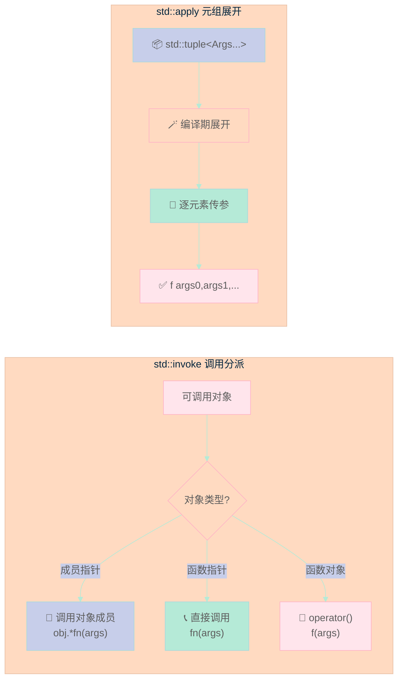

> 为什么调用成员函数要写 `std::mem_fn`？为什么展开 `tuple` 调用函数那么麻烦？C++17 的 `std::apply` 和 `std::invoke` 就是来终结这些历史遗留问题的。

---

## 前言

在 C++17 之前：

- 用 `std::bind` 绑定参数，用 `std::mem_fn` 调用成员函数
- 手写代码展开 `std::tuple` 作为函数参数
- 没有统一方式处理「函数 / 成员函数 / 函数对象」的调用

**结果**：代码充斥着模板元编程技巧，可读性差，bug 难找。

C++17 带来了两个简洁有力的工具：**`std::apply`** 和 **`std::invoke`**。

---

## 一、std::apply：tuple 展开为函数参数

### 1.1 问题：tuple 怎么传给函数？

假设有个三元加法函数：

```cpp
auto add = [](int a, int b, int c) { return a + b + c; };
```

普通调用很简单：`add(1, 2, 3);`

但如果参数封装在 `tuple` 里呢？

```cpp
auto t = std::make_tuple(1, 2, 3);
// 以前要手动展开：
// add(std::get<0>(t), std::get<1>(t), std::get<2>(t));
```

### 1.2 解决方案：std::apply

```cpp
#include <iostream>
#include <tuple>
#include <functional>

auto add = [](int a, int b, int c) { return a + b + c; };

int main() {
    auto t = std::make_tuple(1, 2, 3);
    std::cout << std::apply(add, t) << "\n";  // 6
    
    // 甚至可以这样用
    std::cout << std::apply(add, std::make_tuple(10, 20, 30)) << "\n";  // 60
}
```

**`std::apply(fn, tuple)`** 的作用：**把 tuple 的每个元素展开，作为 fn 的参数传入**。

### 1.3 原理简析

```cpp
// apply 的本质大概是这样（简化版）：
namespace detail {
    template<typename F, typename Tuple, std::size_t... I>
    decltype(auto) apply_impl(F&& f, Tuple&& t, std::index_sequence<I...>) {
        return std::forward<F>(f)(std::get<I>(std::forward<Tuple>(t))...);
    }
}

template<typename F, typename Tuple>
decltype(auto) apply(F&& f, Tuple&& t) {
    return apply_impl(std::forward<F>(f), std::forward<Tuple>(t),
                       std::make_index_sequence<...>{});
}
```

---

## 二、std::invoke：统一调用一切可调用对象

### 2.1 统一调用的意义

C++ 里「可调用」的东西很多：

- 普通函数
- 函数指针
- 成员函数（需要对象）
- 成员变量（需要对象）
- lambda
- 函数对象（重载了 `operator()`）

**以前**：调用成员函数要用 `std::mem_fn` + `std::bind`，调用普通函数直接调——语法不统一。

**现在**：`std::invoke` 一个打天下。

### 2.2 基本用法

```cpp
#include <iostream>
#include <functional>

struct Widget {
    int value = 42;
    void process(int n) { std::cout << "process: " << n << "\n"; }
};

int main() {
    auto add = [](int a, int b, int c) { return a + b + c; };
    
    // 调用普通函数
    std::invoke(add, 1, 2, 3);  // 6
    
    // 调用成员函数（需要对象）
    Widget w;
    std::invoke(&Widget::process, w, 5);  // process: 5
    
    // 访问成员变量
    std::cout << std::invoke(&Widget::value, w) << "\n";  // 42
    
    // lambda 也可以
    std::invoke([](int x) { return x * 2; }, 21);  // 42
}
```

### 2.3 统一语义的魔力

```cpp
template<typename Callable, typename... Args>
decltype(auto) call_and_print(Callable&& fn, Args&&... args) {
    // 不管 fn 是普通函数还是成员函数，都能正确调用
    return std::invoke(std::forward<Callable>(fn), std::forward<Args>(args)...);
}

// 普通函数
call_and_print([](int x) { return x * 2; }, 10);  // 20

// 成员函数
Widget w;
call_and_print(&Widget::process, w, 100);  // process: 100
```

---

## 三、对比旧时代：bind vs mem_fn

| 场景 | 旧写法 (C++14) | C++17 新写法 |
|------|--------------|-------------|
| 绑定参数 | `std::bind(fn, _1, 5, _2)` | `std::bind(fn, std::placeholders::_1, 5, std::placeholders::_2)` 或 lambda |
| 成员函数绑定 | `std::bind(&Widget::process, obj, _1)` | `std::bind(&Widget::process, obj, std::placeholders::_1)` |
| 调用成员函数 | `auto fn = std::mem_fn(&Widget::process); fn(obj, 5);` | `std::invoke(&Widget::process, obj, 5);` |
| tuple 展开 | 手写展开或用 `std::experimental::apply` | `std::apply(fn, tuple)` |

**为什么 `invoke` 更好？**

1. **语法统一**：不需要记 `mem_fn` 这种特殊工具
2. **可读性**：一看就知道是「调用」操作
3. **泛化**：同时支持函数、成员函数、成员变量

---

## 四、实际工程应用

### 4.1 事件系统 / 回调包装

```cpp
#include <iostream>
#include <functional>
#include <vector>
#include <any>

class EventEmitter {
    std::vector<std::function<void(std::any)>> callbacks_;
    
public:
    template<typename F>
    void on(F&& handler) {
        callbacks_.push_back(std::forward<F>(handler));
    }
    
    template<typename... Args>
    void emit(Args&&... args) {
        // 统一调用：支持普通函数、lambda、成员函数
        for (auto& cb : callbacks_) {
            std::invoke(cb, std::forward<Args>(args)...);
        }
    }
};
```

### 4.2 命令模式实现

```cpp
#include <iostream>
#include <functional>
#include <memory>

struct Command {
    virtual ~Command() = default;
    virtual void execute() = 0;
};

template<typename Callable, typename... Args>
class FunctionCommand : public Command {
    Callable func_;
    std::tuple<Args...> args_;
    
public:
    FunctionCommand(Callable f, Args... args) 
        : func_(f), args_(std::make_tuple(std::move(args)...)) {}
    
    void execute() override {
        std::apply(func_, args_);  // 完美转发
    }
};
```

### 4.3 完整示例

```cpp
#include <iostream>
#include <tuple>
#include <functional>

auto add = [](int a, int b, int c) { return a + b + c; };

struct Widget {
    int value = 42;
    void process(int n) { std::cout << "process: " << n << "\n"; }
};

int main() {
    // std::apply: tuple展开调用
    auto t = std::make_tuple(1, 2, 3);
    std::cout << std::apply(add, t) << "\n";  // 6
    
    // std::invoke: 统一调用
    std::invoke(add, 1, 2, 3);  // 6
    
    Widget w;
    std::invoke(&Widget::process, w, 5);  // 调用成员函数
    std::cout << std::invoke(&Widget::value, w) << "\n";  // 访问成员
}
```

---

## 五、总结

| 工具 | 作用 | 核心价值 |
|------|------|---------|
| `std::apply` | 把 tuple 展开为函数参数 | **告别手写展开代码** |
| `std::invoke` | 统一调用函数/成员函数/可调用对象 | **一个函数，打遍天下** |

> **行动建议**：检查你项目里用 `std::bind` + `std::mem_fn` 的地方，替换成 `std::invoke` / lambda，你会发现代码简洁很多。
---

## 📚 C++17 新特性 系列导航

> 本文是《C++17 新特性》系列第 **6/8** 篇。

| 方向 | 章节 |
|:--|:--|
| ◀ 上一篇 | [（五）std::optional / variant / any](/2026/04/23/2026-04-23-cpp17-optional-variant-any/) |
| 下一篇 ▶ | [（七）Filesystem 大全](/2026/04/23/2026-04-24-cpp17-filesystem/) |

<details>
<summary>📖 全部 8 篇目录（点击展开）</summary>

1. [（一）Structured Bindings](/2026/04/23/2026-04-23-cpp17-structured-bindings/)
2. [（二）if constexpr](/2026/04/23/2026-04-23-cpp17-if-constexpr/)
3. [（三）Inline Variables 与 constexpr 加强](/2026/04/23/2026-04-23-cpp17-inline-constexpr/)
4. [（四）Fold Expressions](/2026/04/23/2026-04-23-cpp17-fold-expressions/)
5. [（五）std::optional / variant / any](/2026/04/23/2026-04-23-cpp17-optional-variant-any/)
6. [（六）std::apply / std::invoke](/2026/04/23/2026-04-24-cpp17-any-apply-invoke/) **← 当前**
7. [（七）Filesystem 大全](/2026/04/23/2026-04-24-cpp17-filesystem/)
8. [（八）Attribute 新增](/2026/04/23/2026-04-24-cpp17-attributes/)

</details>

## 语法/控制流可视化

下面是一张马卡龙色 Mermaid 图，帮你从图形角度把握本章涉及的语法与控制流。



本章讲 C++17 的 std::apply 与 std::invoke（也涉及 std::any），对比维度：本特性 vs 旧写法 vs 其他语言一等函数调用机制。

## 对比分析

### 一、本特性 vs 旧写法

| 维度 | C++17 写法 | 旧写法 | 影响 |
|------|------------|--------|------|
| 用 tuple 调函数 | `std::apply(f, std::tuple{1, "x"})` | 手写 `unpack` helper / index_sequence 展开 | 一行替代 30+ 行 |
| 调用成员函数指针 | `std::invoke(&Foo::bar, foo, 1, 2)` | `std::bind` / `std::mem_fn` | 简洁、统一 |
| any 容器 | `std::any a = 1;` | `void*` + 手动管理 | 类型安全略好 |

### 二、对比其他语言

| 语言 | 一等函数调用 | 元组调用 | 备注 |
|------|--------------|----------|------|
| C++17 | `std::invoke` | `std::apply` | 标准化 |
| Python | 直接调用 + `*args` 解包 | `f(*t)` | 语言原生 |
| Rust | trait `Fn` | `f.call(args)` | 类型系统严格 |
| Java | Method Reference | ❌ | 仅限单参数 |
| JavaScript | 直接调用 | `f(...args)` | 动态类型 |

### 三、优缺点

优点：
- 把"调用任意可调用对象"这件事标准化
- apply 让"tuple 当参数列表"可一行完成

缺点：
- invoke 的 SFINAE 友好性需要适应
- any 仍是类型擦除

### 四、何时选

- 实现通用回调 / 任务队列：用 invoke + function
- 处理 tuple / pair 当参数：用 apply
