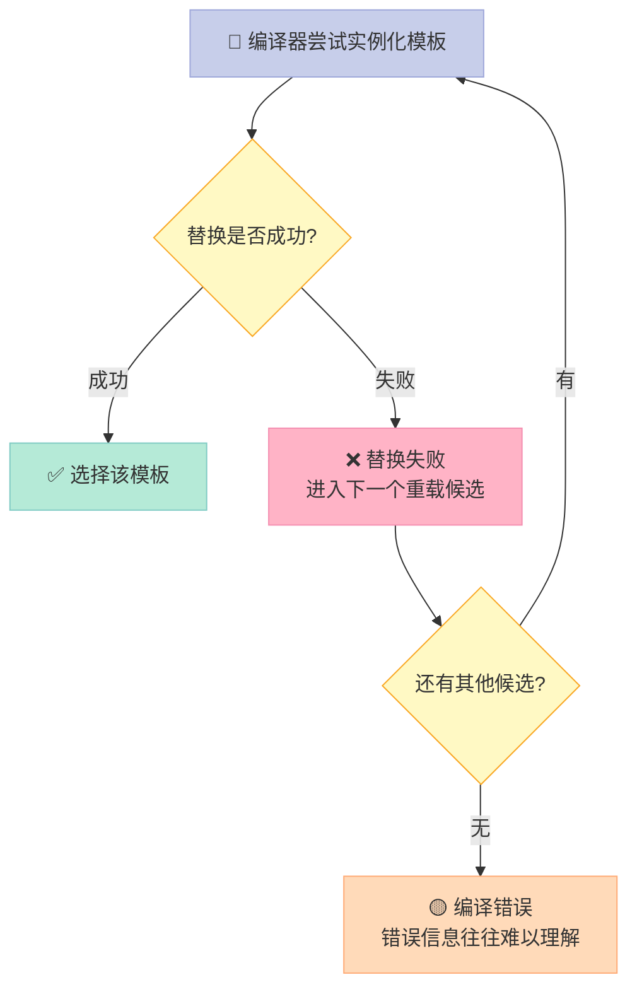
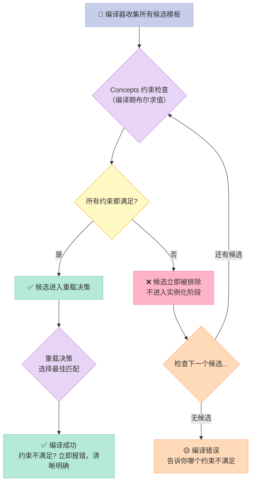

## 前言：从"模板地狱"到"概念约束"

如果你写过现代 C++ 模板代码，一定体验过这种痛苦：**错误信息长达几百行，却找不到问题根源**。SFINAE 时期的模板约束就像在黑暗中摸索——你不知道哪个重载会被选中，也不知道为什么某个函数突然就不能用了。

**Concepts 的出现，彻底改变了游戏规则。** 它让模板约束从"隐形魔法"变成了"显式声明"，编译器可以在第一时间告诉你：**"这个类型不满足要求，原因如下"**。

本文将深入解析 C++20 Concepts 的核心语法、运作原理，以及如何用它写出清晰、可维护的泛型代码。

---

## 一、Concept 是什么？

### 1.1 定义语法

Concept 本质上是一个**编译期布尔表达式**，用于约束模板参数的类型要求。

```cpp
template <typename T>
concept Name = expression;
```

**关键点**：
- `concept` 关键字后跟概念名称
- 必须是**编译期可求值的布尔表达式**
- 可以使用 `requires` 表达式来定义更复杂的约束

### 1.2 最简单的 Concept 示例

```cpp
#include <iostream>
#include <concepts>
#include <type_traits>

// 定义 concept：Numeric = 整数类型 或 浮点类型
template<typename T>
concept Numeric = std::integral<T> || std::floating_point<T>;

// 定义 concept：Addable = 可以做加法运算
template<typename T>
concept Addable = requires(T a, T b) { a + b; };

// 使用 concept 约束模板参数
template<Numeric T>
T add(T a, T b) { return a + b; }

// requires 子句约束
template<typename T>
    requires Addable<T>
T mul(T a, T b) { return a * b; }

// concept 检查类型是否具有某个嵌套类型
template<typename T>
concept HasValueType = requires { typename T::value_type; };

template<HasValueType T>
void print_value_type() {
    std::cout << typeid(typename T::value_type).name() << "\n";
}

int main() {
    std::cout << add(1, 2) << "\n";        // 输出: 3
    std::cout << add(1.5, 2.5) << "\n";   // 输出: 4
    
    static_assert(Numeric<int>);          // ✅ int 满足 Numeric
    static_assert(Numeric<double>);      // ✅ double 满足 Numeric
    static_assert(!Numeric<std::string>); // ✅ std::string 不满足 Numeric
    
    print_value_type<std::vector<int>>(); // 输出: i (int 的类型名)
}
```

**运行结果**：
```
3
4
i
```

---

## 二、标准库内置 Concept

C++20 `<concepts>` 头文件提供了大量预定义 Concepts，涵盖了最常见的类型约束需求：

| Concept | 含义 | 示例类型 |
|---------|------|----------|
| `std::integral<T>` | 整数类型 | `int`, `long`, `char` |
| `std::floating_point<T>` | 浮点类型 | `float`, `double` |
| `std::signed_integral<T>` | 有符号整数 | `int`, `long` |
| `std::unsigned_integral<T>` | 无符号整数 | `unsigned int` |
| `std::same_as<T, U>` | 两个类型完全相同 | - |
| `std::derived_from<T, U>` | T 派生自 U | - |
| `std::movable<T>` | 可移动 | - |
| `std::copyable<T>` | 可拷贝 | - |
| `std::ranges::range<T>` | 是一个范围 | `vector`, `array` |

### 使用示例

```cpp
#include <iostream>
#include <concepts>
#include <vector>
#include <ranges>

template<std::integral T>
T factorial(T n) {
    if (n <= 1) return 1;
    return n * factorial(n - 1);
}

template<std::floating_point T>
T circle_area(T radius) {
    return 3.14159 * radius * radius;
}

int main() {
    std::cout << factorial(5) << "\n";          // 120
    std::cout << circle_area(2.0) << "\n";      // 12.56636
    
    // 编译期检查
    static_assert(std::ranges::range<std::vector<int>>);  // ✅
}
```

---

## 三、约束的组合与逻辑运算

Concepts 支持使用 `&&` 和 `||` 进行组合，这让我们可以构建更精细的约束。

### 3.1 组合示例

```cpp
#include <concepts>

// 组合多个 concept：有符号整数但不是 bool
template<typename T>
concept SignedInteger = std::signed_integral<T> && !std::same_as<T, bool>;

// 数值类型且可比较
template<typename T>
concept ComparableNumeric = (std::integral<T> || std::floating_point<T>) 
                            && requires(T a, T b) { a < b; };

// 使用
template<ComparableNumeric T>
T max(T a, T b) { return a > b ? a : b; }
```

### 3.2 requires 子句 vs 约束参数

有两种方式给模板添加约束：

```cpp
// 方式 1：约束参数（放在模板参数列表中）
template<std::integral T>
void func1(T n) { /* ... */ }

// 方式 2：requires 子句（放在模板参数列表后、函数声明前）
template<typename T>
    requires std::integral<T>
void func2(T n) { /* ... */ }

// 方式 3：requires 子句 + concept
template<typename T>
    requires SignedInteger<T>
void func3(T n) { /* ... */ }
```

---

## 四、SFINAE vs Concepts：编译器的决策流程

这是理解 Concepts 最关键的部分。让我用 Mermaid 图展示 SFINAE 和 Concepts 在编译器层面的不同处理流程。

### 4.1 SFINAE 时期的"盲选"机制



**SFINAE 的问题**：替换失败时，编译器**默默尝试**下一个重载，整个过程对程序员是"黑盒"的。

### 4.2 Concepts 的"透明约束"机制



**Concepts 的优势**：
1. **约束检查在实例化之前**——早发现，早排除
2. **错误信息清晰**——直接指出哪个约束不满足
3. **代码可读性高**——约束显式声明，不依赖奇怪的类型技巧

### 4.3 对比表格

| 维度 | SFINAE | Concepts |
|------|--------|----------|
| 语法 | `enable_if` + 条件类型 | `concept` + `requires` |
| 可读性 | 低（隐式排除） | 高（显式声明） |
| 错误信息 | 几百行，找不到重点 | 清晰指出约束不满足 |
| 编译速度 | 较慢（实例化失败后才排除） | 较快（早期排除） |
| 组合约束 | 嵌套 `enable_if`，难以维护 | `&&` `\|\|` 直接组合 |
| 重载选择 | 依赖替换失败副作用 | 约束求值结果明确 |

---

## 五、实战：用 Concepts 替代 enable_if

### 5.1 传统 SFINAE 写法

```cpp
#include <iostream>
#include <type_traits>
#include <enable_if.h>  // 非标准，但常见

// 使用 enable_if 约束：只接受整数
template<typename T>
typename std::enable_if<std::is_integral<T>::value, T>::type
square(T n) {
    return n * n;
}
```

### 5.2 Concepts 写法

```cpp
#include <iostream>
#include <concepts>

// 直接约束，清清楚楚
template<std::integral T>
T square(T n) {
    return n * n;
}

int main() {
    std::cout << square(5) << "\n";     // 25
    // square(3.14);  // 编译错误：double 不满足 std::integral
}
```

**结论**：Concepts 让代码从"技巧"变成了"声明"，意图一目了然。

---

## 六、常见错误与避坑指南

### 6.1 约束检查的时机

Concept 约束检查发生在**模板参数绑定时**，而不是函数调用时。这意味着：

```cpp
template<std::integral T>
void func(T n) { }

int main() {
    func(42);      // ✅ T = int，满足约束
    // func(3.14);  // ❌ 编译期就失败，T = double 不满足
}
```

### 6.2 partial specialization + requires

```cpp
#include <iostream>
#include <concepts>

// 只有满足 std::integral 时才启用这个特化
template<typename T>
    requires std::integral<T>
struct Handler<T> {
    static void process() { std::cout << "整数处理\n"; }
};

template<typename T>
    requires std::floating_point<T>
struct Handler<T> {
    static void process() { std::cout << "浮点处理\n"; }
};

int main() {
    Handler<int>::process();      // 整数处理
    Handler<double>::process();   // 浮点处理
}
```

---

## 七、下一步学习路径

1. **深入 `requires` 表达式**：了解原子约束、约束组合、优先级
2. **学习 `std::ranges`**：C++20 Ranges 库大量使用 Concepts
3. **实践泛型算法**：尝试用 Concepts 重写自己的模板代码

---

> **记住**：Concepts 不仅仅是一个新语法，它是 C++ 模板编程思维的根本转变——从"隐式排除"到"显式声明"，从"运行时才发现问题"到"编译期就确保正确"。
---

## 📚 C++20 新特性 系列导航

> 本文是《C++20 新特性》系列第 **1/7** 篇。

| 方向 | 章节 |
|:--|:--|
| 下一篇 ▶ | [（二）requires 表达式](/2026/04/23/2026-04-24-cpp20-requires/) |

<details>
<summary>📖 全部 7 篇目录（点击展开）</summary>

1. [（一）Concepts](/2026/04/23/2026-04-24-cpp20-concepts/) **← 当前**
2. [（二）requires 表达式](/2026/04/23/2026-04-24-cpp20-requires/)
3. [（三）Spaceship Operator](/2026/04/23/2026-04-24-cpp20-spaceship-operator/)
4. [（四）Lambda 加强](/2026/04/23/2026-04-24-cpp20-lambda/)
5. [（五）consteval 与 constinit](/2026/04/23/2026-04-24-cpp20-consteval-constinit/)
6. [（六）Coroutine 协程](/2026/04/23/2026-04-24-cpp20-coroutine/)
7. [（七）Ranges 库](/2026/04/23/2026-04-24-cpp20-ranges/)

</details>
