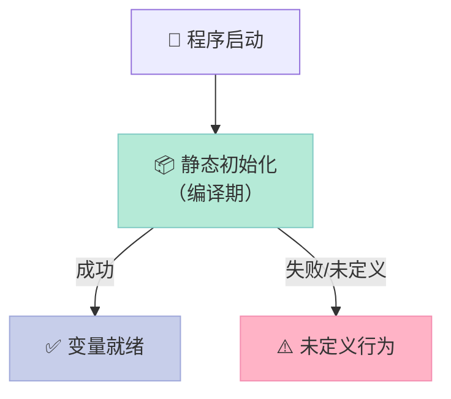
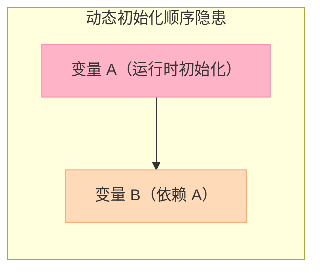

> **C++14 引入 `constexpr` 函数，C++20 带来 `consteval` 和 `constinit`。这三个关键字守卫着编译期计算的大门，但职责各不相同。**

## 前言

编译期计算（Compile-Time Computation）是 C++ 性能优化的重要手段。**`constexpr`** 在 C++14/17/20 持续进化，但有一个痛点始终存在：

- `constexpr` 函数**可以**在编译期求值，也**可以**在运行时求值
- 你无法强制调用者必须在编译期使用

这就引出了 C++20 的两个新关键字：**`consteval`** 和 **`constinit`**。

## 一、consteval：强制编译期求值

### 1.1 什么是 consteval

`consteval` 修饰的函数必须是**常量表达式**（Constant Expression），如果调用时无法在编译期求值，**直接编译失败**。

```cpp
consteval int sqr(int n) { return n * n; }

int main() {
    int x = 5;
    // sqr(x);  // ❌ 编译错误：x 不是常量表达式
    sqr(5);     // ✅ 编译期计算：5 * 5 = 25
}
```

### 1.2 consteval vs constexpr

| 维度 | `constexpr` | `consteval` |
|------|-------------|-------------|
| 求值时机 | 编译期 **或** 运行时 | **仅**编译期 |
| 调用限制 | 任意上下文 | 必须是常量表达式 |
| 编译失败 | 否（延迟到运行时） | 是（立即失败） |
| 适用场景 | 可选编译期优化 | 强制编译期验证 |

### 1.3 典型场景：编译期元编程

```cpp
#include <iostream>

// consteval: 强制编译期求值
consteval int sqr(int n) { return n * n; }
constexpr int sqr_ce(int n) { return n * n; }  // 可编译期也可运行时

// consteval 保证编译期计算
static_assert(sqr(5) == 25);  // OK: 编译期验证

int main() {
    int x = 5;
    // sqr(x);  // ERROR: consteval 必须是常量表达式
    std::cout << sqr_ce(x) << "\n";  // OK: constexpr 可以运行时
    std::cout << sqr_ce(5) << "\n";   // OK: 编译期计算
}
```

**关键区别**：
- `constexpr int sqr_ce(int n)`：编译期、运行时都能调用
- `consteval int sqr(int n)`：**必须**在编译期求值

### 1.4 consteval 的边界

```cpp
consteval int id(int x) { return x; }

constexpr int a = id(42);    // ✅ OK：常量初始化
int b = id(42);               // ✅ OK：常量表达式初始化
int c = 42; id(c);           // ❌ ERROR：c 不是常量
```

## 二、constinit：保证静态初始化

### 2.1 什么是 constinit

`constinit` 保证变量在**静态初始化阶段**（Static Initialization）完成，而非延迟到**动态初始化**（Dynamic Initialization）。



### 2.2 constinit vs const vs constexpr

| 关键字 | 类型检查 | 编译期求值 | 初始化保证 | 用途 |
|--------|----------|------------|------------|------|
| `const` | 只读 | 否 | 无 | 运行时只读 |
| `constexpr` | 只读 | 是 | 编译期求值 | 编译期常量 |
| `constinit` | 无（保留字） | 无要求 | **静态初始化优先** | 避免动态初始化顺序问题 |

### 2.3 实际示例

```cpp
#include <iostream>

// constinit: 保证静态初始化优先于动态初始化
constinit int init_val = []() { 
    std::cout << "init_val initialized\n"; 
    return 42; 
}();

// 注意：constinit 不要求编译期求值，只要求优先初始化
// 这个 lambda 会在 main() 之前执行

int get_runtime() {
    int x;
    std::cin >> x;
    return x;
}

// 如果不用 constinit，这里可能引发问题：
// 静态初始化阶段无法调用需要运行时的函数
// constinit int runtime_dependent = get_runtime(); // 取决于实现
```

### 2.4 为什么需要 constinit？

**C++ 的初始化顺序问题**：



- 不同编译单元（.cpp 文件）的静态变量初始化顺序是**未定义**的
- `constinit` 强制变量在动态初始化前完成，减少"初始化顺序崩溃"的概率

## 三、综合对比

```cpp
#include <iostream>

// consteval: 强制编译期求值
consteval int sqr(int n) { return n * n; }
constexpr int sqr_ce(int n) { return n * n; }  // 可编译期也可运行时

// constinit: 保证静态初始化优先于动态初始化
constinit int init_val = []() { 
    std::cout << "init_val initialized\n"; 
    return 42; 
}();

// consteval 保证编译期计算
static_assert(sqr(5) == 25);  // OK: 编译期验证

int main() {
    int x = 5;
    // sqr(x);  // ERROR: consteval 必须是常量表达式
    std::cout << sqr_ce(x) << "\n";  // OK: constexpr 可以运行时
    std::cout << sqr_ce(5) << "\n";   // OK: 编译期计算
}
```

**什么时候用什么**：

| 场景 | 推荐关键字 |
|------|-----------|
| 编译期元编程，必须在编译时求值 | `consteval` |
| 需要编译期计算，但也可以运行时求值 | `constexpr` |
| 防止静态变量初始化顺序问题 | `constinit` |
| 运行时只读变量 | `const` |

## 四、注意事项

1. **`constinit` 不保证编译期求值**，它只保证"优先于动态初始化"
2. **`consteval` 函数不能是 `constexpr`**，因为 `constexpr` 允许运行时求值
3. **变量不能用 `consteval` 声明**，只能用 `consteval` 函数

## 结论

> **`consteval` 是编译期的"强制执行"，`constinit` 是初始化顺序的"优先保障"，而 `constexpr` 是编译期的"可选优化"。**

如果你写元库（template library），需要强制用户传递常量，`consteval` 是你的武器。如果你要避免静态初始化顺序灾难，`constinit` 是你的盾牌。

**下一步**：结合 `std::array` 和 `std::tuple` 的编译期操作，以及 C++23 的 `constexpr std::vector` 进展。