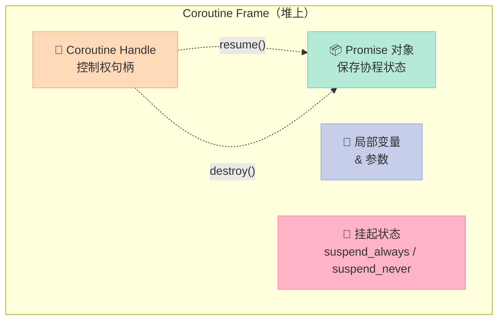
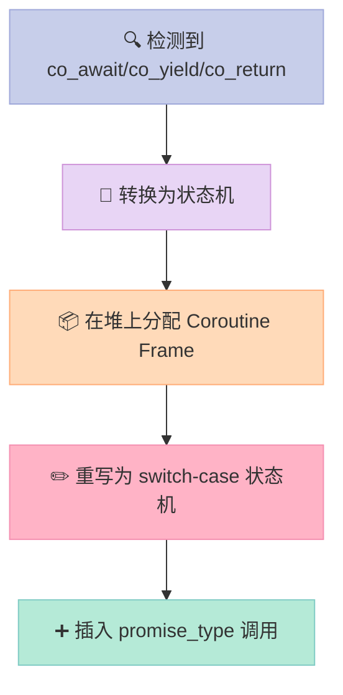
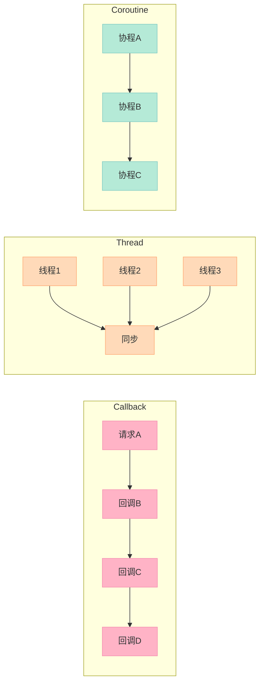

> **协程不是新概念，但 C++20 引入的协程将异步编程从"callback 地狱"中彻底解救出来。**

## 前言

你写过嵌套 callback 的代码吗？三层嵌套还好，四五层的时候调试就像在走迷宫。而**线程**呢？创建成本高，切换开销大，十个线程可能只有两个在干活。

**协程（Coroutine）** 提供了一种新的异步模型：**协作式多任务**，协程主动让出（yield）控制权，而非被操作系统强制抢占。

## 一、为什么需要协程？

| 方案 | 控制权 | 资源开销 | 复杂度 | 适用场景 |
|------|--------|----------|--------|----------|
| **回调（Callback）** | 被动 | 低 | 高（嵌套地狱） | 简单事件 |
| **线程（Thread）** | 抢占式 | 高（栈空间） | 中 | 阻塞 I/O |
| **协程（Coroutine）** | 协作式 | 低（堆分配） | 中 | 高并发异步 |

回调地狱的痛点：**控制流碎片化**，业务逻辑被拆散到不同 lambda 里，变量作用域混乱，异常处理更是噩梦。

协程的出现，让**异步代码看起来像同步代码**，却不需要阻塞线程。

## 二、Coroutine 的核心概念

### 2.1 协程帧（Coroutine Frame）：状态机在堆上

普通函数调用时，局部变量存在**栈**上，函数返回时栈帧自动销毁。

协程不同：**协程帧（Coroutine Frame）** 分配在**堆**上，包含：
- 局部变量和参数
- 挂起点（suspend point）状态
- promise 对象
- 协程句柄（coroutine_handle）



### 2.2 三大关键字：co_await、co_yield、co_return

```cpp
Task my_coro() {
    std::cout << "A ";
    co_await std::suspend_always{};  // 挂起在这里
    std::cout << "B ";
    co_await std::suspend_always{};
    std::cout << "C ";
    co_return;  // 或 co_return value;
}
```

- **co_await expr**：挂起协程，执行 expr，返回时恢复
- **co_yield value**：暂停并产出值，类似 generator
- **co_return**：结束协程，返回值（或 void）

### 2.3 promise_type：协程的"发动机"

每个协程类型必须提供 **promise_type**，它是协程与调用者之间的桥梁：

| 方法 | 作用 |
|------|------|
| `get_return_object()` | 返回协程对象给调用者 |
| `initial_suspend()` | 协程开始时是否自动挂起 |
| `final_suspend()` | 协程结束时是否挂起 |
| `return_value(v)` | 处理 `co_return v` |
| `yield_value(v)` | 处理 `co_yield v` |
| `unhandled_exception()` | 捕获未处理异常 |

### 2.4 suspend_always vs suspend_never

```cpp
// 总是挂起：协程创建后不立即执行
std::suspend_always initial_suspend() { return {}; }

// 从不挂起：协程立即开始执行
std::suspend_never initial_suspend() { return {}; }
```

**大多数场景下使用 `suspend_always`**，让调用者控制何时开始执行。

## 三、编译器如何处理协程

当编译器遇到协程函数，它会：



实际编译后的代码会将协程转为一个**状态机**，每个挂起点是一个状态分支：

```cpp
// 原代码:
co_await suspend_point;
// 编译器转换为:
switch (state) {
    case 0: /* 初始化 */ state = 1; /* fallthrough */;
    case 1: /* 恢复点 */ /* await 逻辑 */ state = 2; break;
    case 2: /* 结束 */;
}
```

## 四、完整示例：Generator 风格的协程

```cpp
#include <iostream>
#include <coroutine>

// 最简 coroutine
struct Task {
    struct promise_type {
        Task get_return_object() { return Task{}; }
        std::suspend_always initial_suspend() { return {}; }
        std::suspend_always final_suspend() noexcept { return {}; }
        void return_void() {}
        void unhandled_exception() {}
    };
};

Task simple() {
    std::cout << "A ";
    co_await std::suspend_always{};  // 挂起点
    std::cout << "B ";
    co_await std::suspend_always{};
    std::cout << "C ";
    co_return;
}

// generator-like coroutine
template<typename T>
struct Generator {
    struct promise_type {
        T value;
        std::suspend_always yield_value(T v) { value = v; return {}; }
        std::suspend_always initial_suspend() { return {}; }
        std::suspend_always final_suspend() noexcept { return {}; }
        Generator get_return_object() { return Generator{this}; }
        void return_void() {}
        void unhandled_exception() {}
    };
    
    struct Sentinel {};
    
    promise_type* p_;
    explicit Generator(promise_type* p) : p_(p) {}
    
    T operator()() {
        p_->promise.yield_value(p_->value);
        return p_->value;
    }
};

Generator<int> count_to(int n) {
    for (int i = 1; i <= n; ++i) {
        co_yield i;
    }
}

int main() {
    auto g = count_to(5);
    for (int i = 0; i < 5; ++i) {
        std::cout << g() << " ";
    }
    std::cout << "\n";
}
```

**编译**：需要 GCC 12+ 或 Clang 15+，并开启 `-fcoroutines` 和 `-std=c++20`。

## 五、三种方案对比



| 维度 | Callback | Thread | Coroutine |
|------|----------|--------|-----------|
| **代码可读性** | ❌ 差 | ✅ 好 | ✅ 好 |
| **内存开销** | ✅ 低 | ❌ 高（栈） | ✅ 低（堆帧） |
| **上下文切换** | N/A | ❌ 操作系统切换 | ✅ 用户态协作 |
| **并发规模** | 中等 | 受限（千级） | 高（万级） |
| **适用场景** | 简单异步 | CPU 密集 | I/O 密集高并发 |

## 结论与建议

**协程最适合的场景**：
- **网络 I/O 高并发**：如 HTTP 服务器，需要同时处理数万连接
- **异步流处理**：数据管道式处理，不需要线程同步
- **状态机模式**：复杂业务逻辑，协程天然对应状态机

**慎用的场景**：
- CPU 密集型计算（多线程更合适）
- 需要真正并行执行（协程是协作式，不是抢占式）

> **记住**：协程是**协作式**的多任务，不是操作系统的抢占式调度。协程本身不提供并行，需要配合其他机制（线程池、io_uring）才能充分利用多核。

**下一步**：学习 C++ 生态中的协程库（如 libunifex、cppcoro），以及 `std::jthread` 与协程的结合使用。